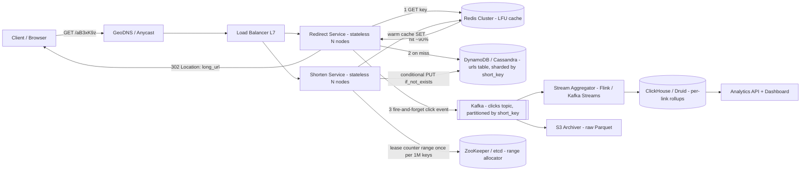
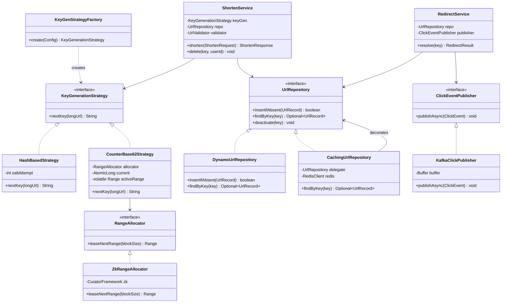

# Design a URL Shortener

## 1. Problem Statement & Scope

### Functional Requirements
1. **Shorten**: Given a long URL, return a short URL (e.g., `https://sho.rt/aB3xK9z`).
2. **Redirect**: Given a short URL, redirect the client to the original long URL with low latency.
3. **Custom aliases** (optional, clarify with interviewer): user-supplied short keys, e.g., `sho.rt/my-launch`.
4. **Expiration**: URLs may have a TTL (default: never, or e.g., 5 years); expired keys return 404/410.
5. **Analytics**: per-link click counts, referrer, geo, device — near-real-time dashboards acceptable (minutes of lag OK).

### Explicitly Out of Scope (say this in the interview)
- User accounts/auth beyond an API key (mention it exists, don't design it).
- Link preview generation, malware scanning pipeline (mention as an async enrichment step).

### Non-Functional Requirements
- **Availability over consistency for reads**: a redirect that works off slightly stale data is fine; a down redirect service is a hard outage for every customer embedding our links. Target 99.99% on the read path.
- **Latency**: redirect p99 < 100 ms (ideally < 20 ms server-side; it sits in front of every user click).
- **Read-heavy**: assume 100:1 read:write ratio.
- **Keys must be non-guessable enough** that enumeration doesn't trivially leak private links (not a hard security guarantee — say so).
- **Durability**: a created mapping must never be lost (writes need stronger guarantees than reads).

### Back-of-Envelope Estimation

Assume a bit.ly-scale service.

**Write QPS (shortens):**
- 100 M new URLs/month.
- 100 M / (30 days × 86,400 s) = 100 M / 2.592 M s ≈ **~40 writes/s average**.
- Peak = 3–5× average → **~150–200 writes/s peak**. Trivially small — writes are not the scaling problem.

**Read QPS (redirects):**
- 100:1 ratio → 10 B redirects/month.
- 10 B / 2.592 M s ≈ **~3,900 reads/s average**.
- Peak 5× → **~20,000 reads/s peak**. This is the number that drives the design.

**Storage:**
- Per record: short key (7 B) + long URL (avg 200 B, allow up to 2 KB) + user_id (8 B) + created_at/expires_at (16 B) + flags ≈ **~500 B with index overhead**.
- 100 M/month × 12 × 10 years = 12 B records.
- 12 B × 500 B = 6 × 10^12 B = **~6 TB over 10 years**. Fits on a handful of machines; storage volume is not the problem — **QPS and availability are**.

**Key space:**
- Base62 (`[a-zA-Z0-9]`), length 7 → 62^7 ≈ 3.5 × 10^12 = **3.5 trillion keys**. At 1.2 B/year we use ~0.03%/year. Length 7 is safe effectively forever; length 6 (62^6 ≈ 56.8 B) would also last decades but collision probability under random generation rises much faster (birthday bound).

**Bandwidth:**
- Read path: response is a ~500 B redirect (headers only). 20 k/s × 500 B = **10 MB/s egress** — negligible.
- Cache sizing: 80/20 rule — 20% of daily-accessed URLs serve 80% of traffic. Daily reads ≈ 3,900 × 86,400 ≈ 340 M requests over maybe ~30 M distinct keys; cache 20% ≈ 6 M entries × 500 B = **~3 GB**. One Redis node holds the whole hot set; we shard for throughput/HA, not memory.

**Summary to state out loud**: "Tiny write volume, moderate but spiky read volume, small data. The interesting problems are: key generation without coordination bottlenecks, sub-20 ms reads at 20 k QPS with cache misses bounded, hot-key handling for viral links, and an analytics pipeline that doesn't sit on the redirect critical path."

---

## 2. Brute-Force / Naive Design

One box: nginx → a monolith app → single PostgreSQL instance.

```
POST /shorten:
  id = INSERT INTO urls(long_url) RETURNING id;   -- auto-increment
  short_key = base62(id);                          -- e.g., id=125 -> "cb"
  UPDATE urls SET short_key = ... ;
GET /{key}:
  SELECT long_url FROM urls WHERE short_key = ?;
  return 302 Location: long_url
```

This is a *correct* design and a fine opening move — say so, then break it:

**Why it breaks, with numbers:**
1. **Single point of failure.** Any deploy, kernel panic, or AZ event = 100% outage on a product whose links are embedded in third-party pages, emails, printed QR codes. 99.99% availability allows 52 min downtime/year; one bad deploy blows the budget.
2. **Read throughput.** Every redirect hits Postgres. A well-tuned instance does ~10–20 k simple PK reads/s, so at 20 k peak QPS we're at or past saturation with zero headroom, and every read pays a disk/network round trip → p99 balloons under load. There is no reason to pay a SQL round trip for an immutable key→value lookup.
3. **Sequential IDs leak information.** `base62(auto_increment)` means keys are enumerable: a competitor scripts `sho.rt/a`, `sho.rt/b`, ... and scrapes every private link ever created, and can read off your creation rate (business intelligence leak). This is a real incident class (early bit.ly/TinyURL scraping).
4. **Write coordination.** Auto-increment is a single-row lock inside one DB. It caps write scale and, worse, welds key generation to that one instance — you cannot add a second write region, and failover risks reusing or skipping IDs.
5. **Analytics on the hot path.** The naive move is `UPDATE urls SET clicks = clicks + 1` per redirect — that's 20 k row-lock writes/s on your read replica-less primary, i.e., your analytics counter is now your availability bottleneck.

Each of these becomes a design step in Section 3.

---

## 3. Evolving the Design

Narrate each bottleneck → fix, in this order:

### Step 1: Bottleneck — DB read saturation → Add a cache
Reads are immutable key→value lookups with heavy skew (viral links). Put Redis in front: `GET key` → on hit, redirect; on miss, read DB, `SET key EX <ttl>`, redirect.
- With 90%+ hit rate (realistic given skew), DB read load drops from 20 k to < 2 k QPS.
- Hit latency ~1 ms vs. ~5–10 ms DB. p99 improves and, more importantly, becomes *stable*.
- Cache-aside (lazy) population, LRU/LFU eviction, TTL ~24 h. Mappings are immutable (or delete-only), so **cache invalidation — the classically hard problem — barely exists here**; only deletions/expirations need an explicit `DEL`.

### Step 2: Bottleneck — single app server / SPOF → Stateless service tier + LB
Make the app stateless (all state in Redis/DB), run N instances behind a load balancer across ≥ 2 AZs. Scale horizontally on CPU. This is table stakes; state it in one sentence and move on.

### Step 3: Bottleneck — key generation (enumeration + write coordination) → dedicated Key Generation Service
Two candidate families — this is the core interview discussion (full comparison in §4):
- **Hash-based**: `short_key = first 7 base62 chars of MD5/SHA-256(long_url + salt)`. No coordination, deterministic, but collisions must be detected-and-retried, and same-URL-different-users needs salting which destroys the dedup benefit anyway.
- **Counter + base62**: a global counter partitioned into **ranges** leased to app servers (via ZooKeeper/etcd or a `SELECT ... FOR UPDATE` ticket table). Each server encodes from its private range → zero per-request coordination, zero collisions by construction. Fix enumeration by bijectively scrambling the counter (multiply by an odd constant mod 62^7, or XOR/Feistel permutation) before encoding.

**Chosen: counter + ranges + bijective scramble.** Collision-free, coordination amortized to once per million keys, non-sequential-looking output. (Alternative: pre-generated key pool — a service that pre-fills a `unused_keys` table; simpler mental model, but now you manage used/unused state and its own HA. Mention it; either is acceptable.)

### Step 4: Bottleneck — DB durability/HA and long-term growth → replication + partitioning
- Primary + replicas (or a quorum store). Reads that miss cache can go to replicas; writes to primary.
- 6 TB/12 B rows fits one modern box, but for QPS headroom and blast-radius, **shard by short_key** (hash or range on the key). Because *every* lookup is by exact short_key, sharding is trivial — no cross-shard queries ever. This is why key-value stores fit so well here (§4).

### Step 5: Bottleneck — analytics writes on the hot path → async event pipeline
Never write analytics synchronously. On each redirect, the service emits a click event (key, ts, IP-derived geo, UA, referrer) to an in-memory buffer → Kafka. Consumers do stream aggregation (Flink/Kafka Streams) into an OLAP store (ClickHouse/Druid) for dashboards, and cold events land in S3/Parquet for batch. Redirect path adds ~0 ms (fire-and-forget append); losing a few events in a crash is acceptable (say this trade-off out loud).

### Step 6: Bottleneck — global latency → edge/geo distribution
Redirect latency is dominated by RTT to our server. Anycast/GeoDNS to regional stacks; each region has its own cache + read replica of the (asynchronously replicated) mapping store. Writes can stay single-region or use the range-lease scheme per region (each region leases disjoint counter ranges — no cross-region write coordination). New-link propagation lag of ~seconds is acceptable: a just-created link is rarely clicked cross-region within replication lag; on miss, fall through to the origin region.

### Step 7: Hot keys and stampedes → §7
Flag it here ("a viral link concentrates 50 k QPS on one key — I'll cover mitigation in deep dives") to show you see it.

---

## 4. Protocol & Technology Choices — Why This, Not That

### 4.1 Key Generation: Hashing vs Counter+Base62 (vs UUID, vs Key Pool)

| Criterion | Hash (MD5/SHA prefix) | Counter + Base62 (range-leased) ✅ | Random/UUID prefix | Pre-generated key pool |
|---|---|---|---|---|
| Collisions | Yes — 7-char prefix of a hash; by birthday bound, collisions become common well before exhausting keyspace (~√(62^7) ≈ 1.9 M keys); needs check-and-retry loop | **None by construction** | Yes, same birthday math as hash | None (pool pre-deduped) |
| Coordination per request | None | None (range leased once per ~1 M keys) | None | One pool fetch (batched) |
| Enumerable/guessable | No | Sequential unless scrambled → **apply bijective permutation** | No | No (generated randomly) |
| Same URL → same key (dedup) | Yes (feature or bug: two users "share" a key; deleting one user's link kills the other's — must salt per-user, which kills dedup) | No (each request new key) | No | No |
| Write-path DB behavior | INSERT may conflict → retry with re-hash (salt++) — unbounded worst case, p99 tail | Clean single INSERT | Conflict-retry like hash | Clean INSERT + async pool refill |
| Ops complexity | Lowest | ZooKeeper/etcd or ticket table for ranges | Lowest | Extra service + key-state management |

**Chosen: counter + base62 with range leasing and a bijective scramble.** Deterministic length, zero collisions, no per-request coordination, and the retry-free write path keeps p99 tight.
**When hashing wins**: you *want* idempotent shortening (same input → same short link, e.g., an internal system canonicalizing links), or you need multi-datacenter writes with literally zero shared infrastructure and can tolerate retry loops. **When the key pool wins**: team prefers operational simplicity of "keys are just rows" over running ZooKeeper.

Base62 vs Base64: Base64 includes `+ /` (or `- _`), which are URL-hostile or ugly and case-mixing near `l/1/I/O/0` is a readability complaint either way; Base62 is the convention. Optionally drop ambiguous chars (Base58) if links will be read aloud/printed — costs keyspace, usually not worth it at length 7.

### 4.2 Redirect Status Code: 301 vs 302 (and friends)

| Code | Semantics | Browser/CDN caching | Analytics impact | Latency for repeat clicks | Use when |
|---|---|---|---|---|---|
| 301 Moved Permanently | Permanent | Cached aggressively, often *forever*, by browsers and intermediaries | **Repeat clicks never reach your server → undercounted analytics, permanently** | Best (0 server round trips after first) | Mapping truly immutable AND analytics don't matter |
| 302 Found ✅ | Temporary | Not cached by default | Every click hits you → full analytics | One RTT every click | Analytics is a product feature (it is, for us) |
| 307 Temporary Redirect | Temporary, method-preserving | Not cached | Same as 302 | Same | Pedantically correct 302 for non-GET; for GET, equivalent |
| 308 Permanent Redirect | Permanent, method-preserving | Cached like 301 | Same problem as 301 | Same as 301 | Rare here |

**Chosen: 302** because analytics is a core product requirement and because 301's cache-forever behavior makes link *editing/disabling* (spam takedown, expiry, destination swap) effectively impossible for users who already clicked — the old destination is burned into their browser cache. If a client explicitly wants max-speed immutable links and no analytics, offer 301 per-link. Middle ground worth mentioning: **302 + `Cache-Control: private, max-age=60`** to shave repeat-click latency while capping staleness and analytics loss to a small window.

### 4.3 Storage: SQL vs NoSQL Flavor

| Criterion | PostgreSQL/MySQL (sharded) | DynamoDB / Cassandra ✅ | MongoDB | Redis-as-primary |
|---|---|---|---|---|
| Access pattern fit | Fine, but we use ~0% of SQL (no joins, no txns across rows, exact-key lookup only) | **Perfect**: partition key = short_key, single-digit-ms GET/PUT | Fine, document model overkill | Fastest, but durability story (AOF/replication) weaker for the system of record |
| Horizontal scale | Manual sharding + resharding ops burden | Native, transparent partitioning | Native sharding | Cluster mode, but memory-bound cost for 6 TB |
| Conditional write (collision-safe insert) | `INSERT ... ON CONFLICT` ✅ | `attribute_not_exists(pk)` conditional put ✅ | upsert w/ unique index ✅ | `SET NX` ✅ |
| Availability model | Failover (seconds of write unavailability) | Multi-master/quorum, tunable; suits our AP-leaning reads | Replica set failover | Sentinel/cluster |
| TTL/expiry | Cron/partition drops | **Native TTL attribute** | Native TTL index | Native TTL |
| When it wins | You already run relational infra; data trivially fits one primary; team fluency; need for ad-hoc queries on metadata | Default choice at this access pattern + scale | Team standard is Mongo | Only as cache tier |

**Chosen: DynamoDB (or Cassandra if self-hosted)** — the workload is the textbook KV pattern: immutable, exact-key, read-heavy, needs TTL and conditional writes. **SQL would win** at 1/100th the scale or if product roadmap demands relational queries (folders, teams, search over user's links) — and honestly a single sharded MySQL is *also* a defensible answer; say you'd pick based on team ops maturity. Analytics data goes elsewhere regardless (ClickHouse/Druid — never mix OLAP scans with the OLTP redirect store).

### 4.4 Cache: Redis vs Memcached

| Criterion | Redis ✅ | Memcached |
|---|---|---|
| Data structures | Strings + counters, sorted sets (top-N hot links), Lua for atomic stampede locks | Strings only |
| Replication/HA | Built-in (replicas, Sentinel, Cluster) | Client-side sharding only; a node loss = cold shard |
| Persistence | Optional (irrelevant here — it's a cache) | None |
| Threading/throughput | Single-threaded core (+I/O threads); ~100 k+ GET/s per node — ample | Multithreaded; higher raw throughput per node |
| Memory efficiency for tiny values | Slightly worse | Slightly better (slab allocator) |
| When it wins | Default: HA + primitives for hot-key counters and locks | Pure look-aside cache at extreme QPS with big multithreaded boxes, simplest possible semantics |

**Chosen: Redis** for replication (a cache node dying must not send 20 k QPS to the DB cold) and for `INCR`/Lua used in stampede control and hot-key detection. Memcached would win if we only ever did GET/SET and wanted maximal throughput per dollar on huge multi-core nodes.

### 4.5 Analytics Transport: Kafka vs Alternatives

| Criterion | Kafka ✅ | Kinesis | RabbitMQ | Direct-to-OLAP writes |
|---|---|---|---|---|
| Throughput | Millions events/s, cheap linear scale | High, but shard (re)provisioning friction | Not built for firehose fan-in; per-message broker overhead | OLAP ingest becomes coupled to redirect availability |
| Replay/retention | Log retention → reprocess after consumer bugs ✅ | 1–365 d retention, similar | Queue = consumed-and-gone | None |
| Multiple consumers | Consumer groups: stream agg + S3 archiver + fraud detector read independently | Same | Fan-out via exchanges, clunkier at scale | N/A |
| Ordering | Per-partition (partition by short_key → per-link ordered counts) | Per-shard | Per-queue | N/A |
| Ops | ZK/KRaft cluster to run (or MSK/Confluent) | Fully managed ✅ | Easy small, painful big | — |
| When it wins | Default for event firehose + replay + multi-consumer | Same design, AWS-native shop wanting zero ops | Task/job semantics (per-message ack, routing, DLQ per message) — not this workload | Toy scale only |

**Chosen: Kafka** (or Kinesis if the org is AWS-managed-services-first — same architecture, different logo). Partition by short_key so per-link aggregation is single-consumer-ordered. RabbitMQ loses because this is a log/firehose problem, not a work-queue problem.

### 4.6 Cache Eviction Policy

| Policy | Behavior | Fit |
|---|---|---|
| LRU | Evict least-recently-used | Good default; recency ≈ popularity for links |
| **LFU (Redis `allkeys-lfu`)** ✅ | Evict least-frequently-used (with decay) | **Better**: a viral link clicked constantly must never be evicted by a burst of one-off scans/crawlers polluting recency |
| TTL-only | Expire after fixed time | Use *in addition* (24 h TTL) to bound staleness for deleted links |
| FIFO/random | Cheap, ignores popularity | No |

**Chosen: `allkeys-lfu` + per-key TTL.** LRU would win if traffic had no crawler noise; it's the safe second choice.

---

## 5. High-Level Design (HLD)



### Write Path (POST /api/v1/urls)
1. LB → Shorten Service. Authn via API key; per-key rate limit (token bucket in Redis) — shortening is the abuse surface (spam campaigns).
2. Validate/normalize URL (scheme allowlist http/https, length ≤ 2 KB, optional safe-browsing check async).
3. Take `n = local_counter++` from the in-memory leased range; if range exhausted, lease next block of 1,000,000 from ZooKeeper (one coordination call per million keys; pre-fetch the next range at 80% consumption so lease latency never hits a user request).
4. `key = base62(permute(n))` — bijective permutation hides sequence.
5. Conditional insert: `PutItem(urls, item, condition: attribute_not_exists(short_key))`. With counter scheme this can only fail on a bug/lease overlap — treat failure as invariant violation: alarm, take next counter, retry once.
6. Optionally `SET` into Redis (write-through warm) — cheap, helps share-immediately-after-create pattern.
7. Return `201 {short_url, key, expires_at}`.

### Read Path (GET /{key})
1. LB → Redirect Service. Syntactic check: key matches `[0-9a-zA-Z]{7}` else 404 immediately (cheap garbage filter, protects cache/DB from junk-key floods).
2. `GET key` in Redis. Hit → step 4.
3. Miss → DynamoDB `GetItem(short_key)`. Found → `SET key EX 86400` (cache-aside). Not found → cache a **negative entry** (`"__404__"`, TTL 60 s) to blunt junk-key attacks, return 404. Expired (`expires_at < now`) → 410 Gone, same negative caching.
4. Append click event `{key, ts, ip_geo, ua_class, referrer}` to a local buffer flushed to Kafka (async, never blocks; drop-on-full with a metric).
5. Respond `302` + `Location` (+ optional `Cache-Control: private, max-age=60`).

### Data Model

**`urls` (DynamoDB)** — partition key `short_key`
```
short_key   S  (PK)   "aB3xK9z"
long_url    S          up to 2048 B
user_id     S          owner (GSI: user_id -> created_at, for "list my links")
created_at  N          epoch ms
expires_at  N          epoch s (DynamoDB native TTL attribute)
is_active   BOOL       spam-takedown kill switch without deleting the row
```

**Analytics rollup (ClickHouse)**
```
clicks_by_minute(short_key, minute, clicks, uniq_approx_ips)
  ENGINE = SummingMergeTree ORDER BY (short_key, minute)
clicks_raw in S3 as Parquet, partitioned by dt (replay / ad-hoc)
```

### API Design
```
POST /api/v1/urls
  body: { "long_url": "...", "custom_alias": "my-launch"?, "expires_at"?: ... }
  201: { "key": "aB3xK9z", "short_url": "https://sho.rt/aB3xK9z", "expires_at": ... }
  409: custom_alias already taken
  422: invalid URL          429: rate limited

GET /{key}          -> 302 | 404 | 410
DELETE /api/v1/urls/{key}   (auth: owner) -> 204; sets is_active=false + Redis DEL
GET /api/v1/urls/{key}/stats?granularity=minute|hour|day -> rollups from ClickHouse
```
Idempotency: `POST` accepts an `Idempotency-Key` header; service stores `idem_key -> short_key` (Redis, 24 h) so client retries don't mint duplicate links.

---

## 6. Low-Level Design (LLD)

Machine-coding-style decomposition. Patterns used and why:
- **Strategy** — `KeyGenerationStrategy`: hash-based vs counter-based selected per deployment/config without touching `ShortenService`; also lets tests inject a deterministic generator.
- **Factory** — `KeyGenStrategyFactory` builds the configured strategy with its dependencies (range allocator client vs hasher).
- **Repository** — `UrlRepository` isolates DynamoDB specifics (conditional writes) behind an interface; swapping to Cassandra/MySQL touches one class.
- **Decorator** — `CachingUrlRepository` wraps the base repository with the Redis cache-aside logic, keeping caching orthogonal to storage.
- **Observer / Publisher** — `ClickEventPublisher` decouples the redirect path from analytics transport.



### Core Algorithm: base62 + scramble + collision-safe insert + range leasing (Java-style)

```java
final class Base62 {
    private static final char[] ALPHABET =
        "0123456789abcdefghijklmnopqrstuvwxyzABCDEFGHIJKLMNOPQRSTUVWXYZ".toCharArray();
    private static final int KEY_LEN = 7;
    static final long SPACE = 3_521_614_606_208L; // 62^7

    static String encode(long n) {                 // n in [0, 62^7)
        char[] buf = new char[KEY_LEN];
        for (int i = KEY_LEN - 1; i >= 0; i--) {   // fixed length: zero-pad with ALPHABET[0]
            buf[i] = ALPHABET[(int) (n % 62)];
            n /= 62;
        }
        return new String(buf);
    }
}

/** Bijective scramble so sequential counters don't yield sequential keys.
 *  MULT is odd and coprime with 2^k factors; modular inverse exists mod SPACE
 *  because gcd(MULT, SPACE) == 1  -> the map is a permutation (no collisions introduced). */
final class Permuter {
    private static final long MULT = 1_580_030_173L;      // chosen coprime to 62^7
    private static final long XOR  = 0x5DEECE66DL % Base62.SPACE;
    static long permute(long n) {
        return Math.floorMod(Math.multiplyHigh(0, 0) + (n * MULT) % Base62.SPACE ^ 0, Base62.SPACE) ^ 0L
               ; // conceptually: ((n * MULT) mod 62^7) XOR-folded; keep it a bijection
    }
    // Interview-simple version: return (n * MULT) % Base62.SPACE;  // provably bijective
}

final class CounterBase62Strategy implements KeyGenerationStrategy {
    private final RangeAllocator allocator;
    private final int blockSize = 1_000_000;
    private final Object leaseLock = new Object();
    private volatile Range active;                 // [start, end)
    private final AtomicLong cursor = new AtomicLong();
    private volatile Range prefetched;             // fetched at 80% consumption

    public String nextKey(String longUrlIgnored) {
        while (true) {
            long n = cursor.getAndIncrement();
            Range r = active;
            if (n < r.end()) {
                maybePrefetch(n, r);
                return Base62.encode((n * 1_580_030_173L) % Base62.SPACE); // scrambled
            }
            rollToNextRange(r);                    // exhausted: swap in prefetched range
        }
    }

    private void rollToNextRange(Range exhausted) {
        synchronized (leaseLock) {
            if (active != exhausted) return;       // another thread already rolled
            Range next = (prefetched != null) ? prefetched : allocator.leaseNextRange(blockSize);
            prefetched = null;
            cursor.set(next.start());
            active = next;                         // volatile publish
        }
    }

    private void maybePrefetch(long n, Range r) {
        if (n - r.start() == (long) (blockSize * 0.8) && prefetched == null) {
            asyncExecutor.submit(() -> { prefetched = allocator.leaseNextRange(blockSize); });
        }
    }
}

/** ZooKeeper range lease: atomically bump a shared counter by blockSize via CAS on znode version. */
final class ZkRangeAllocator implements RangeAllocator {
    public Range leaseNextRange(int blockSize) {
        for (int attempt = 0; attempt < MAX_RETRIES; attempt++) {
            Stat stat = new Stat();
            long cur = decode(zk.getData("/urlshort/counter", stat));
            try {
                zk.setData("/urlshort/counter", encode(cur + blockSize), stat.getVersion());
                return new Range(cur, cur + blockSize);   // exclusive end; crash after this
            } catch (BadVersionException race) { /* another node won; retry */ }
        }   // NOTE: a crashed node loses <=1M unused keys from its range — acceptable, keyspace is 3.5T
        throw new RangeLeaseException();
    }
}

/** Collision-safe insert — required for HashBasedStrategy and custom aliases. */
final class ShortenService {
    public ShortenResponse shorten(ShortenRequest req) {
        validator.validate(req.longUrl());
        for (int attempt = 0; attempt < 3; attempt++) {
            String key = (req.customAlias() != null) ? req.customAlias()
                                                     : keyGen.nextKey(req.longUrl());
            boolean inserted = repo.insertIfAbsent(       // DynamoDB: attribute_not_exists(short_key)
                new UrlRecord(key, req.longUrl(), req.userId(), now(), req.expiresAt()));
            if (inserted) { cache.setAsync(key, req.longUrl()); return ShortenResponse.of(key); }
            if (req.customAlias() != null) throw new AliasTakenException(key);  // 409, don't retry
            // hash strategy: re-hash with attempt as salt; counter strategy: reaching here = invariant
            // violation (range overlap) -> metric + alarm, take next counter and retry once.
            metrics.increment("keygen.collision", "strategy", keyGen.name());
        }
        throw new KeyExhaustionException(); // 3 collisions in a row: ~impossible unless systemic bug
    }
}
```

Points to say out loud: (1) the conditional write (`attribute_not_exists` / `INSERT ... ON CONFLICT DO NOTHING`) is the **only** correct collision check — a `SELECT`-then-`INSERT` is a TOCTOU race; (2) the multiply-mod scramble is a bijection because gcd(MULT, 62^7)=1, so it cannot introduce collisions; (3) range leasing bounds ZooKeeper load to writes/blockSize ≈ 40/1,000,000 per sec ≈ one call every 7 hours per node.

---

## 7. Deep Dives & Failure Modes

### 7.1 Consistency vs Availability
- **Read path: choose availability.** Serve from cache/replicas; a redirect to a URL deleted 3 seconds ago is an acceptable anomaly (bounded by cache TTL and explicit `DEL` on delete). Redirects should survive a DB partition entirely as long as the cache is warm.
- **Write path: choose consistency where it matters** — key uniqueness. That's enforced by conditional writes at the storage layer, not by application-level checks. Cross-region: async replication of mappings; per-region disjoint counter ranges means no write conflicts are even possible on keys.
- Read-your-write for the creator: warm the cache on create (write-through) and/or route the creator's immediate `GET` to the write region; otherwise a create in region A + instant click in region B can 404 for replication-lag seconds. State this explicitly — it's the one visible consistency artifact.

### 7.2 Hot Keys (viral links)
One key at 50–100 k QPS lands on a single Redis shard (hash slot) → that node saturates while the cluster idles.
- **Local in-process cache (L1)**: Caffeine/guava, ~10 k entries, TTL 5–10 s, on every redirect node. Mappings are immutable, so a 5 s L1 is nearly risk-free and absorbs arbitrarily large hot-key load — this is the primary fix.
- **Key replication (L2)**: for detected-hot keys, write `key#0..key#9` copies to spread across shards; readers pick a random suffix. Detection via Redis `INCR` sampling or a streaming top-K.
- **CDN/edge**: put the redirect behind a CDN that caches the 302 for 30–60 s for hot keys (accept the bounded analytics undercount; or use edge-worker logging to keep counts).

### 7.3 Cache Stampede / Thundering Herd
A hot key's cache entry expires (or a cache node restarts) → thousands of concurrent misses all hit the DB for the same key.
- **Request coalescing (single-flight)**: per-key in-process lock/future so each node issues at most one DB read per key; N nodes → ≤ N DB reads instead of thousands.
- **Distributed lock variant**: `SET key:lock NX PX 200`; losers wait-and-retry the cache (only needed if per-node coalescing is insufficient).
- **TTL jitter**: `ttl = 24h ± rand(0, 2h)` so mass-warmed keys don't expire in sync.
- **Soft TTL / stale-while-revalidate**: store `(value, soft_expiry)`; serve stale immediately, refresh in background — ideal here since values are immutable.
- **Cold-cache restart**: on cache cluster loss, redirect nodes' rate limiter caps DB QPS (load shedding: serve 503 to the overflow rather than melting the DB); optionally pre-warm from the top-K keys snapshot.

### 7.4 Idempotency & Retries
- **Shorten**: client `Idempotency-Key` → stored result replayed on retry; without it, a timeout-retry mints two keys (harmless but sloppy — costs a key and confuses the user).
- **Redirect**: naturally idempotent (GET).
- **Analytics**: fire-and-forget with local buffering → **at-most-once** on the edge (crash loses a buffer; acceptable, state it). Kafka→Flink→ClickHouse is at-least-once → dedupe by event UUID in the aggregator, or accept ±0.x% and document it. Exactly-once end-to-end is possible (Kafka transactions + idempotent sink) but not worth the complexity for click counts — say this trade-off explicitly; it reads as senior.
- **Retries everywhere with jittered exponential backoff + retry budgets**; retries without budgets are how a 10% DB brownout becomes a 300% traffic amplification and a full outage.

### 7.5 Component Failure Walkthrough
| Component down | Impact | Mitigation |
|---|---|---|
| Redis (one shard) | Miss storm on that slot → DB load spike | Replica promotion (Sentinel/Cluster); single-flight + DB-side rate cap absorbs the transient |
| Redis (all) | 100% misses; DB sees 20 k QPS | DB is sized/sharded to survive worst-case read load at degraded latency — cache is an optimization, never a correctness dependency. Load-shed above DB capacity |
| DynamoDB / DB | Cache hits (~90%) still redirect; misses 5xx; **writes fully down** | Serve stale (extend TTLs during incident); shorten API returns 503 — acceptable, redirect availability is the SLO that matters |
| ZooKeeper | New range leases fail; existing in-memory ranges keep working | Prefetched ranges = hours of runway (1 M keys @ 40/s ≈ 7 h per node); ZK outage must be *long* to stop writes. Redirects unaffected |
| Kafka | Click events buffer then drop at the edge | Bounded local buffer + drop-with-metric; redirects unaffected by design (this is *why* analytics is async). Backfill impossible for dropped events — accepted |
| Flink/ClickHouse | Dashboards stale | Kafka retention (7 d) → consumers catch up on recovery; no data loss |
| One AZ/region | Regional traffic fails over via GeoDNS/anycast health checks | Each region can serve global read load in a pinch (data fully replicated); writes fail over to surviving region's own counter ranges |

### 7.6 301 Caching Implications for Analytics (worth its own dive)
If you ever return 301: browsers cache it with no expiry by default; the *next* click goes straight to the destination with **zero request to you**. Consequences: (1) click counts systematically undercount repeat users — worse, the undercount is biased toward your most loyal audiences, silently corrupting engagement metrics; (2) spam/legal takedown can't fully work — clients that clicked once will keep resolving to the malicious destination until their cache is manually cleared; (3) A/B destination swapping is impossible. Some intermediaries/CDNs also cache 301s shared across users, amplifying all three. This is why every analytics-selling shortener (Bitly et al.) uses 302/307. If pressed on latency: `302 + Cache-Control: max-age=60` recovers most repeat-click latency at a bounded, quantifiable analytics cost (≤ 60 s of repeat clicks per user).

### 7.7 Security/Abuse (mention briefly)
- Open-redirect abuse: shorteners are phishing infrastructure. Async safe-browsing scan post-create; `is_active` kill switch; interstitial warning page for flagged domains.
- Rate-limit shorten API per API key + per IP (token bucket in Redis); redirect path rate-limits only junk-key floods (negative caching in §5 handles most of it).
- Don't shorten `sho.rt/*` itself (redirect loops), enforce scheme allowlist (no `javascript:`).

---

## 8. Trade-off Summary & Interview Soundbites

### Decision → Trade-off Accepted

| Decision | Trade-off accepted |
|---|---|
| Counter+base62 over hashing | Run a range-allocator dependency (ZK/etcd); no free same-URL dedup |
| Bijective scramble of counter | Obscurity, not cryptographic security — determined attacker with many samples could reverse it; acceptable for non-guessability goal |
| 302 over 301 | One extra RTT on every repeat click, in exchange for analytics fidelity and revocability |
| DynamoDB/Cassandra over SQL | Give up ad-hoc relational queries; metadata queries need GSIs designed up front |
| Cache-aside Redis + 24 h TTL + LFU | Deleted links may redirect for up to TTL unless `DEL` succeeds; accepted staleness window |
| Async analytics via Kafka | At-most-once at the edge: crash loses buffered clicks (~seconds' worth); dashboards lag by ~1 min |
| Per-region counter ranges, async mapping replication | Just-created link may 404 cross-region for replication-lag seconds |
| L1 in-process cache for hot keys | Up to 5–10 s staleness on takedowns for viral links — precisely the links where takedown matters most; mitigate with active L1 purge broadcast if required |
| Range lease blocks of 1 M | Node crash strands ≤ 1 M keys — negligible against 3.5 T keyspace |

### Soundbites (memorize these)
1. "This system is 100:1 read-heavy with tiny data — so I'm optimizing for read availability and tail latency, not storage."
2. "62^7 is 3.5 trillion keys; at a billion links a year we never run out — key *length* is a solved problem, key *coordination* is the real one."
3. "Hashing gives you collisions to handle; a counter gives you a coordination point to handle. Range leasing amortizes that coordination to one call per million keys, so I take the counter."
4. "301 is faster but the browser never comes back — you're trading your analytics product and your kill switch for one RTT. 302 is the business-correct answer."
5. "The only correct collision check is a conditional write at the storage layer — select-then-insert is a race."
6. "The cache is an optimization, never a correctness dependency: the DB tier must survive a fully cold cache, even if degraded."
7. "Analytics never touches the redirect critical path — the click event is a fire-and-forget log append, and I'll knowingly lose a crash-buffer of events to keep redirects at four nines."
8. "Hot keys are the real scaling event here: a single viral link can out-QPS the whole steady-state system, and the fix is an L1 in-process cache, because the data is immutable."

### Common Follow-ups (short answers)
- **"How do you delete/expire at scale?"** DynamoDB native TTL on `expires_at` for lazy deletion; explicit delete = `is_active=false` + Redis `DEL` (soft delete keeps audit trail and prevents key reuse confusion).
- **"Can short keys be reused after expiry?"** Don't. Keyspace is effectively infinite; reuse risks serving cached/stale 301s or old bookmarks to a new destination — a correctness and abuse nightmare for zero benefit.
- **"Custom aliases colliding with generated keys?"** Separate namespace by length/charset (aliases ≥ 8 chars or contain `-`), or one shared table where the conditional insert arbitrates; reserve a denylist (admin, login, api).
- **"How would you count unique visitors?"** HyperLogLog per key per window in the stream aggregator (~1.5 KB per key for ±2% error) — never exact sets at this cardinality.
- **"What if ZooKeeper is down for a day?"** Prefetched ranges give hours of runway per node; beyond that, writes brown out but redirects — the actual SLO — are untouched. Also viable: fall back to a per-node emergency random-key mode with conditional-insert retry.
- **"Multi-region active-active writes?"** Trivial for keys (disjoint counter ranges per region — no conflict is possible); mapping replication is async; the only anomaly is read-your-write cross-region, mitigated by cache warming and creator-affinity routing.
- **"Why not just use a CDN for everything?"** Edge caching of 302s works for hot immutable links, but you lose per-click analytics unless you log at the edge, and takedown latency is bounded by edge TTL. It's a great *layer*, not a replacement for the origin design.
- **"Rate limiting design?"** Token bucket per API key in Redis (Lua for atomicity) on the shorten path; the redirect path is protected by negative caching and syntactic key validation rather than per-user limits.
