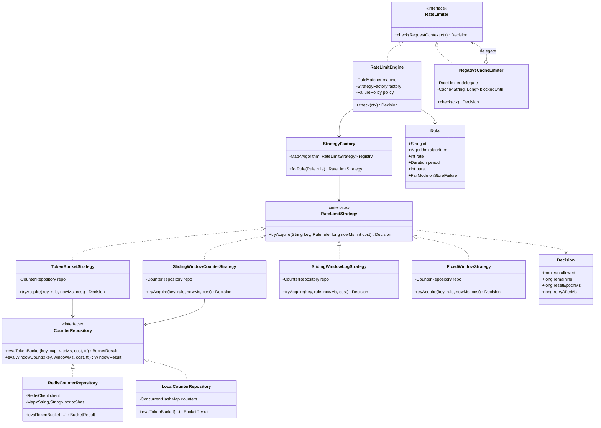

# Design a Rate Limiter

## 1. Problem Statement & Scope

Design a service-side rate limiter that throttles clients exceeding configured request quotas, for an API platform the scale of Stripe or GitHub's public API.

### Functional Requirements

1. Limit requests per client identifier (API key, user ID, IP) per rule, e.g. `100 req/min per API key on POST /v1/charges`.
2. Support multiple rules per request (per-user AND per-endpoint AND global), all of which must pass.
3. Return `429 Too Many Requests` with standard headers (`Retry-After`, `X-RateLimit-*`) when a limit is exceeded.
4. Rules are dynamically configurable (change a tier's limit without redeploying).
5. Support different algorithms per rule (burst-tolerant vs. strict smoothing).

### Non-Functional Requirements

1. **Low latency overhead**: the limiter sits on the hot path of every request; budget < 1–2 ms p99 added latency.
2. **Accuracy**: limits should be enforced within a small tolerance (a few % over-admission is acceptable; 2x is not).
3. **High availability**: the limiter must not become the reason the API is down. Explicit fail-open/fail-closed policy.
4. **Scalability**: horizontally scalable with the API fleet; no single-node counter bottleneck.
5. **Fault tolerance**: survive Redis node failure, network partitions, clock skew.
6. **Observability**: per-rule throttle metrics, so we can distinguish "attack" from "misconfigured limit".

### Out of Scope (state this in the interview)

- Client-side throttling, billing/quota (monthly entitlements — related but different consistency needs), DDoS scrubbing at L3/L4 (that's the CDN/edge provider's job; we handle L7 application limits).

### Back-of-Envelope Estimation

**Traffic:**
- 10M daily active API clients.
- Average 50 requests/client/day → 500M requests/day.
- 500M / 86,400 s ≈ 5,787 → **~6K QPS average**.
- Peak factor 5x → **~30K QPS peak**. Every one of these hits the limiter, so the limiter itself must do 30K checks/sec (more, if multiple rules per request: 3 rules → 90K counter ops/sec).

**Memory per counter (token bucket):**
- Key: `rl:{ruleId}:{clientId}` ≈ 40 bytes.
- Value: tokens (8 B double) + last_refill_ts (8 B) + Redis hash overhead ≈ ~50 B.
- Redis per-key overhead (dict entry, robj, expires entry) ≈ ~80–100 B.
- Total ≈ **~200 bytes per active counter**.

**Total memory:**
- 10M clients × 3 rules = 30M counters × 200 B = 6 × 10^9 B ≈ **6 GB**.
- Fits in a single large Redis node; with a 3-shard cluster + replicas, trivially. Note: sliding window **log** would instead store one entry per request: 100 req/min window × 30M counters × ~30 B/entry ≈ 90 GB+ worst case — this number is why we will reject the log approach at scale.

**Bandwidth:**
- Each check: ~200 B request (Lua EVALSHA + args) + ~50 B response ≈ 250 B.
- 90K ops/sec × 250 B ≈ 22.5 MB/s ≈ **180 Mbps** to Redis. Fine on 10 GbE, but motivates batching multiple rules into one Lua call (one RTT, one packet).

**Latency budget:**
- Same-AZ Redis RTT ≈ 0.3–0.5 ms. One round trip per request (batched rules) keeps us under the 1–2 ms budget. Two or three sequential round trips would not.

---

## 2. Brute-Force / Naive Design

Simplest possible: a fixed-window counter in an in-process hash map on each API server.

```java
// Naive: in-memory fixed window, per server
Map<String, AtomicInteger> counters = new ConcurrentHashMap<>();

boolean allow(String clientId, int limit) {
    long window = System.currentTimeMillis() / 60_000;   // current minute
    String key = clientId + ":" + window;
    int count = counters.computeIfAbsent(key, k -> new AtomicInteger())
                        .incrementAndGet();
    return count <= limit;
}
```

### Why it breaks, concretely

1. **Horizontal scaling destroys the limit.** With 20 API servers behind a round-robin LB, each server sees ~1/20 of a client's traffic. A client limited to 100 req/min can actually send **20 × 100 = 2,000 req/min** before any single server throttles it. The effective limit is `N_servers × limit` — off by a factor equal to your fleet size, and it silently changes every time you autoscale.
2. **Fixed-window boundary burst.** A client can send 100 requests at 11:59:59 and 100 more at 12:00:01 — **200 requests in 2 seconds**, 2x the intended rate, fully "legal" under fixed windows. For a rule protecting a fragile downstream (e.g. a payments processor rated at 120 req/min), this is an outage.
3. **State lost on deploy/restart.** Rolling deploys reset all counters; every deploy is a free limit reset for abusers. At 30K QPS, a fleet-wide restart admits an unbounded burst.
4. **Memory unbounded.** Keys are never evicted. 10M clients × old windows accumulating → OOM on the API server itself, taking down the service the limiter was meant to protect.
5. **No shared config.** Changing a limit means redeploying 20 servers; during the rollout, different servers enforce different limits.

Each of these failures maps to a design evolution step below.

---

## 3. Evolving the Design

Narrate each bottleneck → fix, in order. This is the core of the interview.

### Step 1: Fix the boundary burst — pick a better algorithm

Fixed window's 2x boundary problem (breakage #2) is an algorithm problem, not an infrastructure problem. Options, with the math:

- **Sliding window log**: store a timestamp per request; count entries in `[now - W, now]`. Perfectly accurate, but memory is O(limit) per client — the 90 GB estimate from Section 1. Reserve it for low-volume, high-value rules (e.g. login attempts: 5/min, tiny logs, and accuracy matters for security).
- **Sliding window counter**: keep counts for current and previous fixed windows; estimate `count = curr + prev × overlap_fraction`. O(1) memory (two integers), and the approximation error is small in practice — Cloudflare measured ~0.003% of requests wrongly admitted/rejected across 400M requests. The assumption baked in: traffic in the previous window was uniformly distributed. Adversarially bursty traffic can exploit that slightly, but never by more than 2x, and typically by a few percent.
- **Token bucket**: bucket of capacity B, refilled at r tokens/sec; each request consumes a token. Two numbers of state (`tokens`, `last_refill_ts`), O(1) memory, O(1) time (lazy refill: `tokens = min(B, tokens + (now - last) × r)` computed on read — no background timer needed). Naturally models "sustained rate r with bursts up to B", which is exactly how API quotas are described to customers.
- **Leaky bucket (as a queue)**: requests enter a FIFO drained at a fixed rate. Perfectly smooth *output* rate — great when the protected downstream cannot absorb bursts at all — but it adds queueing latency, needs O(queue) memory, and turns a limiter into a traffic shaper. Wrong default for a low-latency API path. (The "leaky bucket as meter" variant is mathematically equivalent to token bucket.)

**Decision:** token bucket as the default (burst-friendly, O(1), matches product semantics), sliding window counter where we must enforce "no more than N in any trailing window" semantics, sliding window log only for small-limit security rules. This is roughly what industry does: Stripe uses token bucket, Cloudflare uses sliding window counter.

### Step 2: Fix fleet-multiplication — move state out of process

Breakage #1 requires counters shared across servers. Move counter state to a centralized store. Requirements for that store: sub-millisecond ops, atomic read-modify-write, TTL-based eviction (fixes breakage #4 — every key gets a TTL of ~2× the window and dead clients evaporate), and enough throughput for ~90K ops/sec.

**Redis** is the standard answer: in-memory, single-threaded command execution (a feature here — see Step 3), native TTLs, Lua scripting, and 100K+ ops/sec per node. Rules/config move to a config service pushed to nodes (fixes breakage #5); state loss on deploy disappears because state lives in Redis, not the app (fixes breakage #3).

### Step 3: Fix the race condition — atomicity

Naive Redis usage reintroduces a race:

```
Server A: GET rl:u1  -> tokens = 1
Server B: GET rl:u1  -> tokens = 1        (interleaved!)
Server A: SET rl:u1 0 ; allow
Server B: SET rl:u1 0 ; allow             <- 2 requests admitted on 1 token
```

Read-compute-write across the network is not atomic. Under 30K QPS with concurrent requests from the same hot client, this over-admits routinely, not rarely. Fixes considered:

- **`WATCH`/`MULTI`/`EXEC` (optimistic locking)**: correct but retries under contention — the hot-client case is *exactly* the high-contention case, so throughput collapses precisely when you need the limiter most.
- **`INCR` alone**: atomic, but only expresses fixed-window; token bucket refill math needs read-modify-write of two fields.
- **Lua script via `EVALSHA`**: Redis executes the whole script atomically (single-threaded, no interleaving), the refill math runs server-side, and one script can check multiple rules in one RTT. **This is the answer.** Full script in Section 6.

Key subtlety to mention: use Redis server time (`TIME` inside the script or pass a coordinator-free `now` carefully) rather than each app server's clock, so clock skew across the fleet can't corrupt refill math.

### Step 4: Fix the latency cost — sync check with local fast paths

Every request now pays one Redis RTT. Optimizations, in the order you'd deploy them:

1. **Batch rules**: one Lua call evaluates all rules for the request. 3 rules → still 1 RTT.
2. **Local negative cache**: if a client is throttled, cache "blocked until T" in-process. Subsequent requests from that client are rejected with zero Redis calls. Abusive clients — the ones generating the most checks — become the *cheapest*. This also mitigates hot keys (Section 7).
3. **Async / batched sync for loose limits** (optional): count locally, sync deltas to Redis every 50–100 ms. Trades accuracy (transient over-admission bounded by `N_servers × local_budget`) for near-zero added latency. Appropriate for coarse abuse limits ("10K/hour"), not for strict per-second limits. State this as a knob, per rule, not a global choice.

### Step 5: Decide the failure policy — fail-open vs. fail-closed

If Redis is unreachable, do we admit or reject?

- **Fail-open** (admit): an infrastructure failure in the *limiter* must not become an API outage. Correct default for revenue-serving APIs — rate limiting is a protection mechanism, not an authorization mechanism.
- **Fail-closed** (reject): correct when the limiter *is* the security control — login endpoints, OTP verification, password reset — where unlimited attempts are worse than downtime.
- **Degraded middle ground**: on Redis failure, fall back to *local* in-memory limiting with `limit / N_servers` per node (approximate, but bounded), plus aggressive alerting. This is what you say to show senior judgment: policy is **per rule**, and the fallback is graceful, not binary.

Timeout discipline: the Redis call gets a hard 5–10 ms timeout; a slow limiter is treated as a failed limiter and the failure policy kicks in. Never let the limiter's dependency stall the request path.

### Step 6: Where does the limiter sit?

- **API gateway plugin** (Kong, Envoy filter, NGINX): enforce coarse, identity-level limits before requests consume app resources. One place to operate; throttled requests never touch app servers.
- **Middleware/library in the service**: needed for limits requiring business context the gateway lacks ("free-tier users get 10 report-generations/day" — the gateway doesn't know the tier or the semantic operation).
- **Sidecar** (Envoy + a rate limit service, à la Lyft's `ratelimit`): gateway-like enforcement, mesh-native, polyglot fleet friendly.

**Decision:** two layers. Gateway enforces per-key/per-IP transport-level limits (cheap rejection at the edge); service middleware enforces business-level limits. Both talk to the same Redis-backed rate limit service so counters and config are unified.

---

## 4. Protocol & Technology Choices — Why This, Not That

### 4.1 The five algorithms head-to-head

| Algorithm | Memory / key | Time | Accuracy | Burst handling | Boundary problem | State stored |
|---|---|---|---|---|---|---|
| Fixed window counter | O(1) (~1 int) | O(1) | Poor at edges | Allows 2x at boundary | Yes — up to 2× limit in 2×ε time | count |
| Sliding window log | O(limit) per key | O(log n) or O(n) prune | Exact | Exact trailing-window semantics | No | timestamp per request (ZSET) |
| Sliding window counter | O(1) (2 ints) | O(1) | ~exact (Cloudflare: ~0.003% error) | Smooth; assumes uniform prev window | No (approximated away) | curr count, prev count |
| Token bucket | O(1) (2 fields) | O(1) lazy refill | Exact for "rate r, burst B" semantics | Configurable burst up to B | N/A (no windows) | tokens, last_refill_ts |
| Leaky bucket (queue) | O(queue) | O(1) | Exact output rate | Absorbs bursts into queue → latency | N/A | queue of requests |

**Chosen:** token bucket (default), sliding window counter (strict trailing-window rules), sliding window log (small-limit security rules).
**Rejected as defaults:** fixed window — the 2x boundary burst is a real correctness bug against fragile downstreams; acceptable only for very coarse limits where simplicity wins. Leaky-bucket-queue — adds latency and turns limiting into shaping; it *would win* when the protected system genuinely requires a constant drain rate (e.g., feeding a legacy mainframe, outbound calls to a partner API with strict pacing).
**When log wins:** limit is small (≤ ~100), window semantics must be exact, and per-request auditability matters (login throttling, OTP).

### 4.2 Counter store

| Option | Latency | Atomic RMW | TTL | Data structures | Verdict |
|---|---|---|---|---|---|
| Redis | ~0.3 ms same-AZ | Lua, single-threaded | Native | Hash, ZSET, scripts | **Chosen** |
| Memcached | ~0.3 ms | Only `incr`/`decr`/CAS | Native | Strings only | Rejected: no server-side scripting → token bucket refill math needs CAS retry loops (contention on hot keys), no ZSET for window log |
| In-process memory | ~0 | Trivially | Manual | Anything | Rejected as sole store: fleet-multiplication problem (Section 2). **Wins** as L1: negative cache, and as fallback when Redis is down |
| DynamoDB / SQL | 5–10 ms+ | Conditional writes | TTL (coarse) | Rows | Rejected: an order of magnitude over latency budget; conditional-write contention on hot keys. Wins for monthly *quotas* where durability > latency |

### 4.3 Atomicity mechanism in Redis

| Mechanism | Atomic? | Contention behavior | Multi-key / multi-rule | Verdict |
|---|---|---|---|---|
| Lua `EVALSHA` | Yes — script runs uninterrupted | No retries; serialized by Redis's single thread | Yes, one RTT for N rules | **Chosen** |
| `MULTI`/`EXEC` | Batched, but commands can't read-then-branch | N/A | Yes | Rejected: cannot express "read tokens, compute refill, conditionally decrement" — no logic between queued commands |
| `WATCH` + `MULTI` | Optimistic CAS | Retry storms exactly on hot keys | Awkward | Rejected: worst-case behavior aligns with worst-case traffic |
| Redis Cell module (`CL.THROTTLE`) | Yes — native GCRA | Excellent | One key per call | Rejected for ops reasons: module must be installed on every node, unavailable on most managed Redis (ElastiCache/MemoryDB). **Would win** if you self-host Redis and want GCRA's precision without maintaining Lua |
| Plain `INCR` + `EXPIRE` | Two ops — needs `SET ... NX EX` or Lua to be safe | Fine | No | Acceptable *only* for fixed window; also has the "INCR succeeded, EXPIRE lost" leak bug unless scripted |

### 4.4 Distribution strategy for counters

| Strategy | Accuracy | Latency | Failure blast radius | Verdict |
|---|---|---|---|---|
| Centralized Redis (sharded by key) | High | +1 RTT | Shard down → its keys degrade | **Chosen** — with client-side hashing on `{clientId}` hash tags so all of a client's rules colocate on one shard (one Lua call) |
| Sticky sessions (route client → same app server, count locally) | High while sticky | Zero RTT | Server death resets client's counters; LB rebalancing breaks stickiness; hot clients hotspot one server | Rejected: couples LB policy to correctness. Would win in stateful long-lived-connection systems (WebSocket gateways) where stickiness exists anyway |
| Local counters + async sync (gossip or Redis delta-merge) | Eventual; over-admission up to N × sync-interval budget | Zero RTT | Graceful | Rejected as default; **chosen selectively** for coarse limits (Step 4.3). Would win at extreme scale (millions of QPS) where a Redis RTT per request is unaffordable — this is how CDN-edge limiters work |

### 4.5 Enforcement point

| Placement | Pros | Cons | Verdict |
|---|---|---|---|
| Gateway plugin (Envoy/Kong/NGINX) | Rejects before app resources spent; centralized ops; language-agnostic | No business context; gateway team owns your limits | **Chosen** for L7 transport-level limits |
| In-service library/middleware | Full business context; per-endpoint nuance | Per-language implementations; app pays cost of rejected requests; N codebases to upgrade | **Chosen** for domain limits |
| Sidecar (Envoy + ratelimit service) | Polyglot; mesh-native; central rule service | Extra hop; mesh operational complexity | Would win in a large service-mesh org standardizing cross-cutting concerns; overkill for a single API tier |

---

## 5. High-Level Design (HLD)

```mermaid
flowchart LR
    C[Client] --> LB[Load Balancer]
    LB --> GW[API Gateway\nrate-limit filter]
    GW -- "1. check(key, rules)" --> RLS[Rate Limit Service\n(library or sidecar)]
    RLS -- "2. EVALSHA token_bucket.lua" --> R[(Redis Cluster\nsharded by client hash-tag)]
    R -- "3. {allowed, remaining, reset}" --> RLS
    RLS -- "allowed" --> GW
    GW -- "4a. forward" --> APP[API Servers\n+ middleware limiter\n(business rules)]
    APP --> R
    APP --> DS[(Downstream services)]
    GW -- "4b. 429 + Retry-After" --> C
    CFG[Rule Config Service] -- "push rules (poll/stream)" --> GW
    CFG -- push rules --> APP
    ADM[Admin UI / API] --> CFG
    RLS -. metrics: throttle rate per rule .-> MON[Metrics/Alerting]
    R -. replica .-> RR[(Redis Replicas\nfailover)]
```

### Request path — allowed

1. Request hits gateway; gateway extracts identity (API key → client ID) and matches applicable rules from its locally cached config (config is pushed/polled from the config service — no config lookup on the hot path).
2. Gateway (or its rate-limit filter) issues a single `EVALSHA` to the Redis shard owning `{clientId}` — the script evaluates all transport-level rules, decrementing each bucket atomically.
3. Script returns `allowed=1`, plus `remaining` and `reset` per rule. Gateway attaches `X-RateLimit-*` headers (from the most-constrained rule) and forwards.
4. Service middleware repeats the pattern for business rules (same Redis, different key prefix), then handles the request.

### Request path — rejected

1. Same as above, but the script finds `tokens < cost` for some rule; it does **not** decrement any bucket (all-or-nothing across the batched rules) and returns `allowed=0` with `retry_after`.
2. Gateway returns **429** immediately — the request never reaches app servers.
3. Gateway records the client in its local negative cache until `reset`; subsequent requests are rejected without touching Redis.
4. Throttle metric emitted with rule ID; sustained throttling on one client can escalate to a temporary edge ban (fed to WAF).

### Rule / config data model

```yaml
rules:
  - id: charge-per-key
    match: { method: POST, path: /v1/charges }
    key: api_key                # what identifies the bucket
    algorithm: token_bucket
    rate: 100                   # tokens per period
    period: 60s
    burst: 20                   # bucket capacity above sustained rate
    cost: 1                     # tokens per request (batch endpoints may cost more)
    on_store_failure: open      # fail-open
  - id: login-per-ip
    match: { method: POST, path: /v1/login }
    key: ip
    algorithm: sliding_window_log
    rate: 5
    period: 60s
    on_store_failure: closed    # fail-closed: this rule IS the security control
```

Rules live in a strongly-consistent config store (e.g., a small SQL DB fronted by the config service); enforcers cache them and refresh every ~30 s or via push. Rule changes take effect fleet-wide within one refresh interval — acceptable, since limits are policies, not transactions.

### API design and response headers

Internal check API (if deployed as a sidecar/service; as a library it's a function call):

```
POST /v1/ratelimit/check
{ "descriptors": [{"key": "api_key:ak_123", "rule": "charge-per-key", "cost": 1}] }
->
{ "allowed": false, "results": [{"rule": "charge-per-key", "remaining": 0,
   "limit": 100, "reset_epoch_s": 1723000000, "retry_after_s": 12}] }
```

Client-facing headers on **every** response (not just 429s — good clients pace themselves off these):

```
HTTP/1.1 429 Too Many Requests
Retry-After: 12                          # seconds (RFC 9110); the one header clients most respect
X-RateLimit-Limit: 100
X-RateLimit-Remaining: 0
X-RateLimit-Reset: 1723000000            # epoch seconds when the window/bucket replenishes
RateLimit-Policy: 100;w=60               # IETF draft standard form, if you want to be current
```

Body: machine-readable error `{ "error": { "code": "rate_limited", "rule": "charge-per-key", "retry_after": 12 } }`. Never leak internal rule internals beyond what helps the client back off.

---

## 6. Low-Level Design (LLD)

Machine-coding-style structure. Patterns used and why:

- **Strategy** — each algorithm behind a common interface; rules select algorithms at runtime, and new algorithms are added without touching the engine (Open/Closed).
- **Factory** — maps `rule.algorithm` string from config to a Strategy instance; isolates construction and per-algorithm parameter validation.
- **Repository** — abstracts counter storage (Redis vs. in-memory fallback); the engine and strategies never see Redis APIs, which is exactly what makes the fail-open local fallback a one-line swap.
- **Decorator** (mentionable) — `NegativeCacheLimiter` wraps the real limiter to short-circuit known-throttled clients.



### Redis Lua script — token bucket with lazy refill

Loaded once via `SCRIPT LOAD`, invoked with `EVALSHA` (avoids resending the script body per call). Uses Redis `TIME` so all app servers share one clock.

```lua
-- KEYS[1] = bucket key, e.g. "rl:charge-per-key:{ak_123}"
-- ARGV[1] = capacity (burst ceiling, e.g. 120)
-- ARGV[2] = refill_rate_per_ms (e.g. 100/60000 = 0.001666)
-- ARGV[3] = cost (tokens requested, usually 1)
-- ARGV[4] = ttl_ms (>= time to refill from 0 to full; lets idle keys expire)
local capacity  = tonumber(ARGV[1])
local rate_ms   = tonumber(ARGV[2])
local cost      = tonumber(ARGV[3])
local ttl_ms    = tonumber(ARGV[4])

local t = redis.call('TIME')                       -- server clock, not app clock
local now_ms = t[1] * 1000 + math.floor(t[2] / 1000)

local b = redis.call('HMGET', KEYS[1], 'tokens', 'ts')
local tokens = tonumber(b[1])
local ts     = tonumber(b[2])
if tokens == nil then                              -- first sight: full bucket
  tokens = capacity
  ts = now_ms
end

-- Lazy refill: credit tokens for elapsed time, capped at capacity.
local elapsed = math.max(0, now_ms - ts)           -- guard replica/skew weirdness
tokens = math.min(capacity, tokens + elapsed * rate_ms)

local allowed = tokens >= cost
local retry_after_ms = 0
if allowed then
  tokens = tokens - cost
else
  retry_after_ms = math.ceil((cost - tokens) / rate_ms)
end

redis.call('HSET', KEYS[1], 'tokens', tokens, 'ts', now_ms)
redis.call('PEXPIRE', KEYS[1], ttl_ms)

-- remaining (floored), reset-to-full estimate, retry hint
local reset_ms = math.ceil((capacity - tokens) / rate_ms)
return { allowed and 1 or 0, math.floor(tokens), now_ms + reset_ms, retry_after_ms }
```

Notes worth saying aloud:
- The whole script executes atomically — Redis runs no other command mid-script, so the read-refill-decrement sequence cannot interleave. This *is* the race-condition fix.
- Refill math: `elapsed × rate_ms` credits fractional tokens; capacity cap prevents idle clients from banking unlimited burst.
- `PEXPIRE` on every touch means only *active* clients occupy memory — the 6 GB estimate holds because idle keys die.
- Multi-rule variant: pass N keys + N parameter tuples; first pass checks all rules, second pass decrements only if all passed (all-or-nothing, otherwise a rejected request would still burn tokens in the rules it passed).

### Java-style pseudocode — sliding window counter

```java
public final class SlidingWindowCounterStrategy implements RateLimitStrategy {
    private final CounterRepository repo;

    @Override
    public Decision tryAcquire(String key, Rule rule, long nowMs, int cost) {
        long windowMs   = rule.period().toMillis();
        long currWindow = nowMs / windowMs;                 // window index
        long prevWindow = currWindow - 1;

        // Atomic on the store side (single Lua call under the hood):
        //   INCRBY curr by cost (tentatively), GET prev, set TTL = 2 * windowMs
        WindowCounts w = repo.evalWindowCounts(
                key, currWindow, prevWindow, cost, 2 * windowMs);

        // Fraction of the sliding window still covered by the previous window.
        double elapsedInCurr = (nowMs % windowMs) / (double) windowMs;  // [0,1)
        double prevWeight    = 1.0 - elapsedInCurr;

        // Estimated requests in the trailing windowMs:
        double estimated = w.currCount() + w.prevCount() * prevWeight;

        if (estimated > rule.rate()) {
            repo.decrBy(key, currWindow, cost);             // roll back tentative incr
            long retryAfterMs = (long) Math.ceil(
                // time until enough prev-window weight decays to admit `cost`
                ((estimated - rule.rate()) / Math.max(w.prevCount(), 1e-9)) * windowMs);
            return Decision.rejected(0,
                    (currWindow + 1) * windowMs,            // reset = next boundary
                    Math.max(retryAfterMs, 1));
        }
        long remaining = (long) Math.floor(rule.rate() - estimated);
        return Decision.allowed(remaining, (currWindow + 1) * windowMs);
    }
}
```

The incr-then-rollback shown here is fine when rejections are rare; production-grade code folds the estimate check into the same Lua script so the increment is conditional and there is no rollback window. Storage: two counters per key (`{key}:{currWindow}` and `{key}:{prevWindow}`), TTL 2 windows — O(1) memory as promised in Section 4.1.

---

## 7. Deep Dives & Failure Modes

### Redis down — fail-open vs. fail-closed, operationally

- Per-rule `on_store_failure` policy (Section 5 config). Defaults: fail-open for product API limits, fail-closed for auth/security rules.
- Implementation detail: use a **circuit breaker** around the Redis client. After k consecutive timeouts, stop calling Redis entirely (don't pay 10 ms timeout per request during an outage) and switch to the `LocalCounterRepository` with `limit / N_servers` per node. Half-open probes restore centralized mode.
- Alert on fallback activation; fail-open without alerting is silent loss of protection.

### Hot keys — one abusive client

- One client hammering at 50K QPS concentrates all its checks on one Redis shard (its hash tag pins it there). Mitigations, layered:
  1. **Negative cache** at the enforcer: once throttled, the client is rejected locally until `reset` — the abuser's Redis load collapses to ~1 op per reset interval per server.
  2. **Edge escalation**: sustained 429 ratio for a client → push a temporary block rule to the WAF/CDN; the traffic stops reaching the limiter at all.
  3. If a *legitimately* huge client (one enterprise key doing 100K QPS) is the hot key: split the bucket — `key = client:{shard = hash(request) % 8}`, each sub-bucket gets `limit/8`. Slight accuracy loss (a client could be under-admitted if traffic skews across sub-buckets), gains 8x shard fan-out.

### Clock skew

- Never use app-server wall clocks for refill math — 100 servers disagree by tens of ms (or seconds when NTP misbehaves). The Lua script reads Redis `TIME`, so each shard is internally consistent. Residual risk: cross-shard skew if a client's rules ever land on different shards (avoided by hash tags), and skew after failover (below).
- The `math.max(0, now - ts)` guard prevents negative elapsed time from producing token debits.

### Race conditions with concurrent requests

- Solved at the store by Lua atomicity (Section 3, Step 3). Also mention: the *check-then-act* gap between gateway check and middleware check is not a race — they are different rules on different keys; each is individually atomic.
- Beware the classic `INCR` + separate `EXPIRE` bug: if the client crashes between the two, the key never expires and permanently blocks the client after limit is hit once. Scripting both together eliminates it.

### Replication lag causing over-admission

- Redis replication is async. On failover, the replica may be missing the last tens of ms of writes → recently spent tokens reappear → brief over-admission for affected keys.
- Position: **accept it**. Rate limiting is a control loop, not a ledger; a one-time over-admission of a few requests per client during a failover is harmless. Do *not* reach for `WAIT` (sync replication) — it multiplies latency on every request to prevent a non-problem. If someone insists on stronger guarantees, that's a signal the requirement is actually *quota/billing*, which belongs in a durable store with idempotent deduction, not in the limiter.
- Same argument covers Redis Cluster resharding: keys mid-migration may double-count briefly. Fine.

### Thundering herd at window reset

- Fixed and sliding-window rules reset many clients at aligned boundaries (top of the minute). Throttled clients that honor `Retry-After` all return at the same instant → synchronized spike.
- Fixes: (1) **jitter the reset** — `Retry-After: retry + rand(0, 0.1 × window)`; (2) prefer token bucket, whose per-client refill is continuous and unaligned by construction; (3) offset window boundaries per client by `hash(clientId) % window` so resets are phase-shifted across the population.
- Client-side guidance in docs: exponential backoff with full jitter; the server can't fully save clients from their own retry loops, but honest `Retry-After` values plus jitter prevent the server from *causing* synchronization.

### Backpressure vs. rejection

- 429 is *load shedding*, the right default for external clients. For internal service-to-service traffic, consider queueing (leaky-bucket shaping) or adaptive concurrency instead — internal callers can wait; external abusers should be told no immediately.
- The limiter should also protect *itself*: bound the negative-cache size (LRU), bound per-request rule count, and shed limiter work (fail-open) before the limiter becomes the bottleneck.

### Multi-datacenter limits

- Option A — **regional independent limits** (each region enforces `limit` against its own Redis): simplest, zero cross-region latency; a client routed to 3 regions gets up to 3× the global limit. Acceptable when DNS/anycast keeps a client pinned to one region (the common case).
- Option B — **regional limit shares**: split by observed traffic ratio (`limit × region_share`), rebalanced by a slow control loop watching per-region consumption. Bounded global error, no hot-path cross-region calls. This is the pragmatic senior answer.
- Option C — **global synchronous counter**: every check crosses regions — 50–150 ms RTT annihilates the latency budget. Rejected outright; say so explicitly.
- Option D — local enforcement + async cross-region aggregation (CRDT-style G-counters or periodic delta merge): near-accurate global limits with over-admission bounded by `N_regions × sync_interval × rate`. This is what edge networks do. Choose B or D depending on how adversarial the traffic is.

---

## 8. Trade-off Summary & Interview Soundbites

### Decision → trade-off accepted

| Decision | Trade-off accepted |
|---|---|
| Token bucket as default algorithm | Bursts up to `burst` above sustained rate are admitted by design; strict trailing-window semantics need a different strategy |
| Sliding window counter over log | ~0.003%-class approximation error and a uniform-previous-window assumption, in exchange for O(1) vs O(limit) memory |
| Centralized Redis over local counters | +1 same-AZ RTT (~0.5 ms) on every request; Redis becomes a dependency requiring an explicit failure policy |
| Lua scripts over Redis Cell / WATCH | We own and version the scripts (testing burden), in exchange for portability to any managed Redis and no retry storms |
| Fail-open default (per-rule override) | During a Redis outage, abuse protection degrades to approximate local limits; we alert instead of rejecting revenue traffic |
| Async replication, no `WAIT` | Failover can briefly over-admit a few requests per key; we refuse to pay sync-replication latency to prevent it |
| Two enforcement layers (gateway + middleware) | Two places to operate and keep consistent, in exchange for cheap edge rejection *and* business-context limits |
| Negative cache at enforcers | Slightly stale blocks (a client may be rejected marginally after its bucket refilled) for a large Redis load reduction under attack |
| Regional limit shares over global sync counter | Global limit is approximately enforced (rebalance-loop lag), never at hot-path cross-region latency cost |

### Soundbites

1. "A rate limiter is a control mechanism, not a ledger — I'll accept small transient over-admission everywhere it buys latency or availability; exact counting is a billing problem."
2. "The naive per-server counter doesn't enforce `limit`, it enforces `limit × N_servers` — and N changes every autoscale event."
3. "Fixed windows admit 2× the limit in the two seconds straddling a boundary; that's a correctness bug, not a nitpick, when the limit protects a fragile downstream."
4. "GET-then-SET across a network is a distributed race; the fix is moving the read-modify-write inside Redis's single thread via a Lua script — one RTT, fully atomic."
5. "Fail-open for product limits, fail-closed for security limits — the failure policy belongs on the rule, not on the system."
6. "Token bucket is two numbers and a subtraction: lazy refill means no timers, O(1) memory, and 'rate plus burst' is exactly how quotas are sold to customers."
7. "The cheapest request to rate-limit is the one you reject from local negative cache — the abuser who costs you the most checks should cost you the fewest Redis calls."
8. "Return `Retry-After` with jitter, or every well-behaved client you throttled comes back in the same millisecond and you've engineered your own thundering herd."

### Common follow-ups, short answers

- **"How would you rate-limit by cost, not count?"** — Make `cost` a per-request token amount (already in the Lua script's ARGV): a batch write of 50 items costs 50 tokens; an LLM call costs `tokens_estimated`. Same bucket math.
- **"What if the limits are per-tier (free/pro/enterprise)?"** — Rules reference a tier variable resolved at identity extraction; the bucket key stays per-client, only the parameters differ. Never encode the limit in the key, or tier upgrades strand old buckets.
- **"How do clients discover their limits?"** — `X-RateLimit-*` on every response plus a `GET /v1/rate_limits` introspection endpoint; document backoff expectations.
- **"Sliding window counter vs. GCRA?"** — GCRA (what Redis Cell implements) is token-bucket-equivalent with a single theoretical-arrival-time value; even less state, very precise `Retry-After`. Choose it if the module or a library is available; it's not a different capability, just a tighter encoding.
- **"How do you test the limiter?"** — Property tests on the algorithms (admitted count over any window ≤ limit + burst), deterministic-clock unit tests for refill math, Lua scripts tested against a real Redis in CI, and load tests that specifically hammer one key to validate hot-key behavior and atomicity under contention.
- **"How is this different from a circuit breaker?"** — Rate limiter protects the *server* from clients by policy; circuit breaker protects the *client* from a failing server by observation. Complementary, often stacked.
- **"Can a rejected request be queued instead?"** — That's leaky-bucket shaping: right for internal async work (job ingestion), wrong for interactive APIs where holding the request costs a connection and the honest answer is 429-with-Retry-After now.
