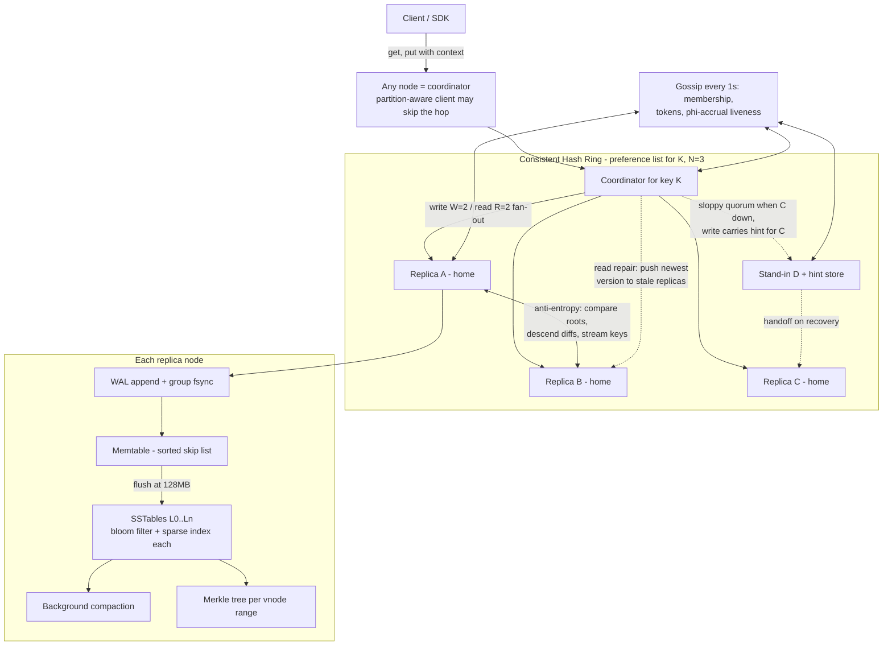
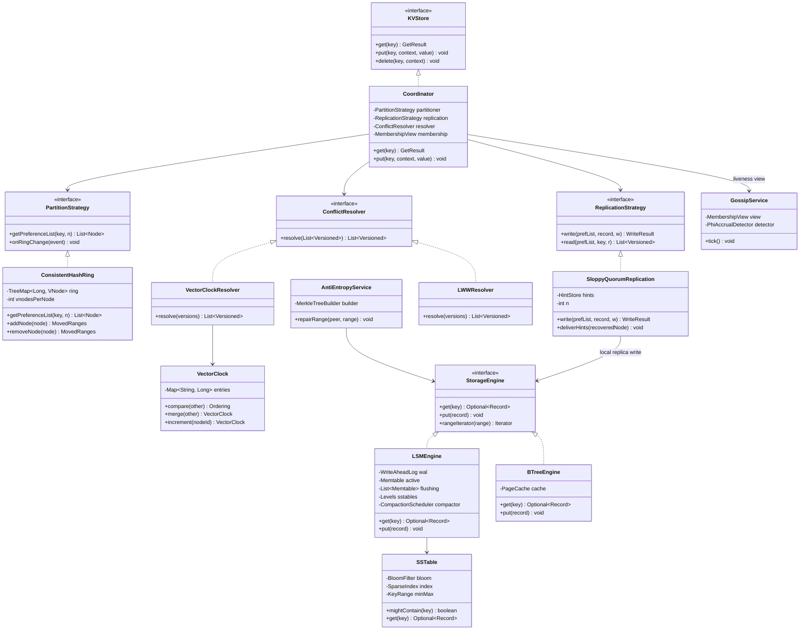

# Design a Distributed Key-Value Store

## 1. Problem Statement & Scope

Design a horizontally scalable, highly available key-value store in the style of Amazon Dynamo / Apache Cassandra / Riak. Clients issue `get(key)` and `put(key, value)`; the system must survive node, rack, and datacenter failures without losing writes.

### Functional Requirements

- `put(key, value)` — store a value (opaque blob) under a key. Idempotent from the client's perspective given a version context.
- `get(key)` — return the value(s) associated with a key, plus a version context. May return multiple conflicting siblings if concurrent writes occurred.
- `delete(key)` — logically remove a key (implemented as a tombstone write).
- Keys are opaque byte strings (typically < 256 B); values are blobs up to ~1 MB (larger objects belong in a blob store with a KV pointer).
- Tunable consistency per request (`R`, `W` overrides).

### Non-Functional Requirements

- **Availability over strong consistency**: writes must succeed even during network partitions ("always writable"). AP in CAP terms.
- **Eventual consistency** with bounded convergence time; tunable to read-your-writes via quorum settings.
- **Latency SLO**: p99 read < 10 ms, p99 write < 15 ms within a region (in-memory + SSD path).
- **Scalability**: linear capacity/throughput growth by adding commodity nodes; no central coordinator on the data path.
- **Durability**: no acknowledged write lost as long as fewer than `N - W + 1` replicas of a key fail permanently and simultaneously.
- **Incremental operability**: adding/removing a node moves a minimal fraction of data.

### Out of Scope

Secondary indexes, multi-key transactions, SQL, cross-key ordering guarantees. State these explicitly in the interview — it keeps the design honest and Dynamo-shaped.

### Back-of-Envelope Estimation

Assume a large-tenant workload:

- **Users / traffic**: 100 M DAU, each generating ~100 KV ops/day.
  - Total ops/day = 100 M x 100 = 10^10 ops/day.
  - Average QPS = 10^10 / 86,400 s ≈ 1.16 x 10^5 ≈ **116 K QPS**.
  - Peak = 2.5x average ≈ **290 K QPS**.
  - Read:write ratio 4:1 → ~232 K reads/s, ~58 K writes/s at peak.
- **Storage**:
  - 10 B unique keys, average record = 100 B key/metadata + 1 KB value ≈ 1.1 KB.
  - Raw = 10^10 x 1.1 KB ≈ 11 TB.
  - Replication factor N = 3 → 33 TB.
  - LSM space amplification + tombstones + headroom (x2) → **~66 TB provisioned**.
- **Bandwidth**:
  - Write ingress = 58 K writes/s x 1.1 KB ≈ 64 MB/s client-facing; x3 for replication fan-out ≈ 190 MB/s internal.
  - Read egress = 232 K reads/s x 1.1 KB ≈ 255 MB/s; xR=2 internal fetches ≈ 510 MB/s internal.
- **Node count**:
  - Per-node budget: 2 TB usable SSD, ~15 K sustained ops/s (mixed, with LSM engine on NVMe this is conservative — keeps headroom for compaction).
  - By storage: 66 TB / 2 TB = 33 nodes.
  - By throughput: 290 K x (avg internal amplification ~2.3) / 15 K ≈ 45 nodes.
  - Throughput-bound → **~50 nodes** with headroom, one region; multiply per region for geo-replication.
- **Memory**: memtables (128 MB x a few) + bloom filters (~10 bits/key x 10^10/50 nodes = 2 x 10^8 keys/node → ~250 MB) + block cache. 32–64 GB RAM/node is comfortable.

The arithmetic tells us: no single machine holds 66 TB or serves 290 K QPS. Partitioning and replication are forced moves, not optional flourishes.

## 2. Brute-Force / Naive Design

Start with the simplest thing: **one server, an in-memory hash map, periodically snapshotted to disk** (or backed by a single B-tree file like a lone RocksDB/BerkeleyDB instance).

```
Client → [ Single Server: HashMap<byte[], byte[]> + WAL + snapshot ] → local disk
```

Why it's attractive: O(1) reads/writes, trivially strong consistency (one copy = no conflicts), simple operations.

### Why It Breaks — With Numbers

1. **Memory/storage ceiling.** 11 TB of data does not fit on one box. Even the largest commodity instances top out around 24–64 TB of NVMe and 1–4 TB RAM; a pure in-memory hash map dies at ~1 TB of hot data, and a single-disk B-tree at 11 TB has no room for growth, backups, or compaction scratch space. One hardware SKU should never define your product's ceiling.
2. **Throughput ceiling.** One server realistically sustains 100–500 K in-memory ops/s, but disk-backed with fsync-per-write it drops to 10–50 K ops/s. Peak load is 290 K QPS with strict tail-latency SLOs — a single machine saturates its NIC (25 Gbps ≈ 3 GB/s is fine for bytes, but interrupt/CPU limits bite first) and its disk IOPS long before that, and p99 explodes under queueing (Little's Law: at 90%+ utilization, wait times grow hyperbolically).
3. **Single point of failure.** Annual failure rate of a commodity server is ~2–4% (disk, PSU, kernel panic). One node → expected multi-hour outage yearly, and a dead disk without replication = permanent data loss of all 10 B keys. Availability of one node ≈ 99.9% at best → ~9 h downtime/year, versus a 4-nines SLO (~52 min/year).
4. **Operational cliff.** Snapshots of 11 TB take hours; restart/recovery replay of a large WAL means long cold starts; you cannot upgrade or reboot without downtime.

Every subsequent design decision in Section 3 is a response to one of these four failures.

## 3. Evolving the Design

### 3.1 Storage doesn't fit → Partition (shard) the keyspace

Split keys across M nodes. First idea: `node = hash(key) mod M`.

**Why mod-N fails**: when M changes (add/remove a node), `hash(key) mod M` changes for almost every key. Going from 50 → 51 nodes remaps ~50/51 ≈ **98% of keys**. That's a 33 TB shuffle to add one machine — the cluster spends days rebalancing, cache hit rates collapse, and during the move requests hit wrong nodes. Elastic scaling is impossible.

**Fix: consistent hashing.** Hash both keys and nodes onto a ring `[0, 2^128)`. A key belongs to the first node clockwise from its hash. Adding a node steals data only from its clockwise neighbor: expected movement = **K/M keys** (10^10/50 = 2 x 10^8 keys ≈ 220 GB), not 98% of the dataset.

Two problems remain, both fixed by **virtual nodes (vnodes)**:

- *Non-uniform load*: with one token per physical node, ranges vary wildly (variance of gaps between M random points is high — expected max gap is O(log M / M), i.e., some node gets several times its fair share). With V = 128–256 vnodes per physical node, each node owns many small ranges; by concentration, load variance shrinks like 1/sqrt(V).
- *Rebalancing parallelism*: a new node's vnodes take small slices from *many* existing nodes, so the 220 GB transfer streams from dozens of peers in parallel instead of hammering one neighbor.
- *Heterogeneity*: give a 2x-capacity machine 2x the vnodes.

### 3.2 One copy per key = data loss and unavailability → Replicate

Each key is written to **N nodes**: the coordinator walks the ring clockwise from the key's position and picks the next N *distinct physical nodes* (skipping vnodes of already-chosen machines, and preferring distinct racks/AZs). This ordered list is the key's **preference list**.

Now tune consistency with **quorums**: a write is acknowledged after **W** replicas confirm; a read fans out and waits for **R** replicas.

**The W + R > N math.** If W + R > N, the set of nodes that acknowledged the latest write and the set answering a read must intersect (|write set| + |read set| = W + R > N total replicas → pigeonhole: at least W + R − N nodes are in both). So at least one replica in every read quorum has the newest acknowledged version; version metadata (vector clock or timestamp) lets the coordinator pick it. Typical config: **N=3, W=2, R=2** → 2+2 > 3, tolerating one slow/dead replica on both paths while staying consistent for non-concurrent operations.

Caveat worth saying aloud: quorum intersection gives you "read sees latest *acknowledged* write" only absent sloppy quorum, concurrent writes, and failed partial writes — it is *not* linearizability. Dynamo deliberately trades that away.

### 3.3 Nodes fail transiently → Sloppy quorum + hinted handoff

Strict quorum hurts availability: if 2 of a key's 3 home replicas are down, W=2 writes fail even though 48 healthy nodes sit idle.

**Sloppy quorum**: the coordinator writes to the first N *healthy* nodes on the ring, which may include nodes outside the home preference list. Availability is preserved — the write lands on N live machines somewhere.

**Hinted handoff**: a stand-in node stores the write with a *hint* ("this belongs to node X"). It keeps the data in a separate hints store and periodically probes X; when X recovers, the stand-in streams hinted writes home and deletes its copies. Result: transient failures (reboots, GC pauses, brief partitions) cost nothing in availability and heal automatically in minutes.

Cost: during the failure window, the "quorum" you achieved doesn't overlap with the home replicas — a read at the home nodes can miss the write. Sloppy quorum trades the W+R>N guarantee for availability. Say this trade-off explicitly.

### 3.4 Replicas diverge permanently → Anti-entropy with Merkle trees

Hinted handoff covers *transient* failure. If a node dies before delivering hints, or a disk is replaced, replicas silently diverge. Comparing replicas key-by-key means shipping ~1.1 KB x 2 x 10^8 keys between two nodes — hundreds of GB per comparison. Unacceptable.

**Merkle trees**: each node maintains, per owned key range, a hash tree — leaves are hashes of key/version buckets, internal nodes hash their children. Two replicas compare roots (32 bytes). Equal roots → ranges identical, done in one round trip. Different roots → descend only into differing subtrees, exchanging O(log n) hashes per divergent key, and stream only the actually-different keys. Synchronizing two replicas that differ in 1,000 keys out of 200 M costs KBs of hash traffic + 1,000 records, not 220 GB.

Trees must be rebuilt/invalidated as ranges move (a known operational pain in Cassandra: repair is expensive; scope it per-vnode-range and schedule off-peak).

### 3.5 Who's alive? Who owns what? → Gossip membership

A central membership service is a SPOF and a scaling bottleneck. Instead, **gossip protocol** (epidemic dissemination):

- Every T=1 s, each node picks a random peer and exchanges its membership view: node list, ring tokens, heartbeat/version counters, and status (up, down, joining, leaving).
- Information spreads epidemically: reaches all M nodes in **O(log M)** rounds — for 50 nodes, ~6 rounds ≈ 6 seconds; for 1,000 nodes, ~10 s. Bandwidth per node is constant regardless of cluster size.
- **Failure detection**: no gossip about node X's heartbeat advancing for a timeout → X is *locally* suspected down (Cassandra refines this with the phi-accrual detector: instead of a binary timeout, compute suspicion level from the historical inter-arrival distribution, robust to variable network conditions).
- Crucially, failure detection here is **advisory**: it only steers coordinators toward sloppy-quorum stand-ins. There is no leader election, so temporary disagreement about liveness is safe — worst case is a few extra hinted writes.
- Explicit membership changes (join/decommission) are administrative operations propagated via gossip with seed nodes to bootstrap.

### 3.6 Concurrent writes conflict → Versioning: vector clocks vs LWW

With no leader and sloppy quorums, two clients can update the same key concurrently on disjoint replicas. Options:

- **Last-write-wins (LWW)**: keep the version with the highest timestamp. Simple, no siblings, constant metadata — but *silently drops* one of two concurrent writes, and clock skew (NTP is typically ±1–10 ms, worse during faults) means "last" may be arbitrary. Fine for idempotent/overwrite-only data (session blobs, caches); dangerous for read-modify-write data (shopping carts).
- **Vector clocks**: each version carries `{replica_id → counter}`. On write, the coordinator increments its entry. Compare two clocks: if every counter in A ≤ the counterpart in B, A is an *ancestor* of B → discard A (causal overwrite). If neither dominates, the writes were **concurrent** → keep both as siblings, return both on `get`, and let the client (or a merge function) reconcile, then `put` the merged value with the merged context. Nothing is silently lost. Costs: metadata grows with the number of distinct coordinators (prune oldest entries past a threshold, e.g., 10 — technically unsound but rarely harmful), and sibling reconciliation pushes complexity to clients.
- The mention-worthy third option: **CRDTs** encode merge into the data type itself (see Section 4).

Dynamo chose vector clocks (cart merge = set union: the famous "deleted item reappears" anomaly beats "bought item disappears"). Cassandra chose LWW-per-column for simplicity at scale. Know both and pick per use case.

### 3.7 Write throughput and durability per node → LSM storage engine

Each node needs a local engine sustaining thousands of writes/s durably. B-trees update pages in place: a random write = read page, modify, write back → random I/O, and write amplification from torn-page protection (full-page WAL images).

**Log-Structured Merge tree** path:

1. **WAL (commit log)**: append the write to a sequential log, fsync (group commit batches fsyncs). Durability with sequential I/O — disks/SSDs do sequential appends 10–100x faster than random writes.
2. **Memtable**: apply the write to an in-memory sorted structure (skip list / RB-tree). Writes are now memory-speed.
3. **Flush**: when the memtable hits a threshold (e.g., 128 MB), freeze it and write it to disk as an immutable, sorted **SSTable** (data blocks + sparse index + bloom filter + min/max key metadata). Its WAL segment can then be recycled.
4. **Compaction**: background merge of SSTables — dedupe overwritten versions, drop expired tombstones, keep read fan-out bounded. Leveled compaction (RocksDB-style: L1..Ln, each level 10x larger, non-overlapping ranges within a level) favors reads and space; size-tiered favors write throughput.
5. **Reads**: check memtable(s), then SSTables newest-first; per-SSTable **bloom filters** (~10 bits/key → ~1% false positives) skip files that can't contain the key, so most point reads touch ≤ 1 data file.

All writes become sequential I/O; a single node comfortably absorbs tens of thousands of writes/s. The cost is read amplification (multiple files) and background compaction I/O — deep-dived in Section 7.

### Final architecture in one sentence

A ring of symmetric nodes: consistent hashing with vnodes for placement, N-way leaderless replication with tunable R/W quorums, sloppy quorum + hinted handoff for transient failures, Merkle-tree anti-entropy for permanent divergence, gossip for membership, vector clocks (or LWW) for conflicts, and an LSM engine per node.

## 4. Protocol & Technology Choices — Why This, Not That

### Partitioning scheme

| Scheme | Data moved on resize | Load balance | Range scans | Verdict |
|---|---|---|---|---|
| Hash mod N | ~100% of keys on any N change | Uniform (while static) | No | Rejected: rebalancing is catastrophic |
| Range partitioning (Bigtable/HBase) | Only split/moved ranges | Needs active splitting; hot-spots on sequential keys (timestamps, auto-increment IDs) | Yes, efficient | Rejected here: no scan requirement; requires a metadata authority for range map |
| Consistent hashing + vnodes | K/M keys, streamed from many peers | Good with 128+ vnodes/node | No (keys scattered) | **Chosen**: decentralized, elastic, no metadata master |

When the alternative wins: range partitioning wins the moment you need ordered scans or prefix queries (time-series, table stores) — that's why Bigtable/HBase/Spanner use it and accept the master/metadata layer.

### Conflict resolution

| Mechanism | Detects concurrency? | Data loss | Metadata cost | Client burden |
|---|---|---|---|---|
| LWW (wall-clock timestamp) | No — picks a winner blindly | Yes, silent, under skew even the "earlier" write can win | 8 bytes | None |
| Vector clocks | Yes — exposes siblings | No (siblings preserved) | O(#coordinators), needs pruning | Must merge siblings |
| CRDTs | Concurrency is absorbed by type semantics | No, by construction | Type-dependent (OR-Set tags, counters per replica) | None at read time, but only CRDT-expressible data |

**Chosen**: vector clocks as the default `ConflictResolver`, LWW as an opt-in per-namespace strategy for overwrite-only data. CRDTs would win for counters, sets, and flags where automatic merge semantics exist (Riak data types); rejected as the *general* mechanism because arbitrary blobs have no canonical merge.

### Quorum configurations (N = 3)

| Config | Guarantee | Latency profile | Use case |
|---|---|---|---|
| R=1, W=1 | W+R=2 ≤ N: eventual only; may read stale | Fastest both paths; survives 2 node failures for availability | Caches, metrics, presence — staleness is fine |
| R=2, W=2 | W+R=4 > N: read-sees-latest-acked (strict quorum) | Balanced; tolerates 1 slow node each way | **Default** for user data |
| R=3, W=1 | W+R=4 > N via read side | Cheap fast writes, expensive fragile reads (any one node down blocks reads) | Write-heavy ingest, rare reads (audit trails) |
| W=3, R=1 | W+R=4 > N via write side | Expensive fragile writes (one node down blocks writes), cheapest reads | Read-heavy config/catalog data updated rarely |

Note the symmetry: push cost onto the rare operation. Also note W=3/R=1 and R=3/W=1 both lose availability on a single node failure for one path — that's the price of one-round-trip reads/writes on the other path.

### Storage engine

| Dimension | LSM tree | B-tree |
|---|---|---|
| Write path | Sequential (WAL + flush); very high throughput | Random in-place page writes |
| Write amplification | Compaction-driven (leveled ~10–30x total, tiered lower) | Page-granularity + full-page WAL images |
| Read path | Memtable + multiple SSTables (mitigated by blooms/cache) | Single tree descent, O(log n) pages, predictable |
| Space | Temporary duplicates until compaction; good compression (immutable sorted files) | Fragmentation/partially-filled pages, but no dupes |
| Latency variance | Compaction can cause stalls/spikes | Steadier tails |
| Concurrency | Immutable files → simple snapshots | Latching/locking complexity |

**Chosen**: LSM — the workload is write-heavy per node, values are blobs (no in-place update benefit), and immutable SSTables pair beautifully with Merkle tree construction and streaming for rebalancing. B-tree wins for read-dominated workloads needing stable low read latency and strong transactional locking (classic RDBMS heap+index engines like InnoDB/Postgres).

### Membership & failure detection

| Approach | Failure mode | Scalability | Consistency of view | Verdict |
|---|---|---|---|---|
| Gossip (peer-to-peer) | No SPOF; views converge in O(log M) rounds; brief disagreement tolerated | Constant per-node cost | Eventual — acceptable because detection is advisory | **Chosen** |
| Central coordinator (ZooKeeper/etcd) | ZK ensemble is another system to run; sessions/watch storms at scale; data path may block on ZK hiccups | ZK write throughput bounds churn handling | Strongly consistent view | Rejected: reintroduces a coordination dependency into an otherwise symmetric design |
| Raft-based membership (built-in consensus group) | Leader election pauses during partitions | Fine for membership-sized state | Strongly consistent | Overkill: we never need agreement on liveness, only hints |

When the alternative wins: if the system assigned *exclusive* ownership (leader per shard — HBase regions, Kafka partitions), you need consistent membership + fencing, and ZooKeeper/Raft is correct, not optional. Leaderless replication is precisely what lets us get away with gossip.

### Replication topology

| | Leaderless (Dynamo/Cassandra) | Leader-based per partition (Bigtable/HBase, Raft groups) |
|---|---|---|
| Write availability | Any coordinator; survives partitions (sloppy quorum) | Blocked during leader failover/election (seconds) |
| Consistency | Tunable, eventual by default; conflicts possible | Single serialization point → per-key linearizability easy |
| Conflict handling | Required (clocks/siblings) | None (leader orders writes) |
| Latency | One round of parallel fan-out; no leader hop | Possibly extra hop to leader; leader can bottleneck hot partition |
| Complexity location | Read path & clients (repair, merging) | Control plane (election, leases, fencing) |

**Chosen**: leaderless — the prime directive is "always writable." Leader-based wins when the product needs transactions, conditional writes (CAS), or ordered per-key history without client-side merging; that's why databases that promise strong consistency pick it.

## 5. High-Level Design (HLD)



### Data model & API

- Model: `key → { versions: [(value, vector_clock)], tombstone? }`. Flat namespace, optional buckets/namespaces carrying per-namespace N/R/W and resolver config.
- API:
  - `get(key) → (context, [value...])` — context is the opaque encoded vector clock set; multiple values = unresolved siblings.
  - `put(key, context, value) → ok` — context from the preceding get; server uses it to establish causality. Missing context on an existing key = concurrent with everything → sibling.
  - `delete(key, context)` — writes a tombstone version (must replicate like any write; purged only after `gc_grace` > anti-entropy period, else deleted keys resurrect).

### Write path (put)

1. Client sends `put(key, context, value)` to any node; that node is the **coordinator** (or a partition-aware client sends directly to a home replica, saving a hop).
2. Coordinator computes `hash(key)`, looks up the ring (local gossip-maintained copy — no remote lookup), gets the preference list of N=3 distinct physical nodes.
3. Coordinator increments its own entry in the vector clock derived from `context`, producing the new version.
4. Fan-out in parallel to the top N healthy nodes (skipping suspected-down nodes → sloppy quorum, attaching hints for the skipped home replicas).
5. Each replica appends to WAL, applies to memtable, acks.
6. Coordinator responds success after **W=2** acks (the third continues asynchronously). On timeout below W: return failure — but note replicas may have applied it (no rollback in leaderless), so the write may still surface later; clients must treat timeout as "unknown," not "no."

### Read path (get)

1. Coordinator sends read to all N replicas (or R fastest with backup requests), waits for **R=2**.
2. Compares returned versions via vector clocks: causally dominated versions are discarded; concurrent versions are all returned as siblings with a merged context.
3. **Read repair**: if any responding replica returned a stale/missing version, the coordinator asynchronously pushes the winning version(s) to it. Hot keys thus self-heal without waiting for anti-entropy.
4. Optionally, digest reads: fetch full value from one replica and hashes from the rest to save bandwidth; on digest mismatch, fetch full values and reconcile.

## 6. Low-Level Design (LLD)



### Design patterns — named and justified

- **Strategy**: `PartitionStrategy`, `ReplicationStrategy`, `ConflictResolver`, `StorageEngine` are all swappable behaviors behind interfaces. This is not decoration — Cassandra literally ships pluggable partitioners, replication strategies, and compaction strategies; per-namespace resolver choice (vector clock vs LWW) requires it.
- **Repository/Facade**: `KVStore` hides ring topology, quorum mechanics, and versioning behind three methods; clients never see replicas.
- **Chain of Responsibility**: the LSM read path (memtable → immutable memtables → L0 → L1 → …) — each stage answers or passes down.
- **Observer**: gossip membership changes notify the ring (`onRingChange`) and the hint-delivery scheduler.
- **Builder/Immutable**: SSTables and `VectorClock` are immutable value objects — immutability is what makes lock-free reads, snapshots, and Merkle hashing safe.

### Vector clock compare and merge (Java-style)

```java
enum Ordering { BEFORE, AFTER, EQUAL, CONCURRENT }

final class VectorClock {
    private final Map<String, Long> entries; // nodeId -> counter, immutable

    Ordering compare(VectorClock other) {
        boolean thisSmallerSomewhere = false, otherSmallerSomewhere = false;
        Set<String> ids = union(entries.keySet(), other.entries.keySet());
        for (String id : ids) {
            long a = entries.getOrDefault(id, 0L);
            long b = other.entries.getOrDefault(id, 0L);
            if (a < b) thisSmallerSomewhere = true;
            if (b < a) otherSmallerSomewhere = true;
        }
        if (thisSmallerSomewhere && otherSmallerSomewhere) return Ordering.CONCURRENT;
        if (thisSmallerSomewhere) return Ordering.BEFORE;   // this is an ancestor: discard it
        if (otherSmallerSomewhere) return Ordering.AFTER;   // other is an ancestor
        return Ordering.EQUAL;
    }

    /** Pointwise max; used when a client writes back a reconciled sibling set. */
    VectorClock merge(VectorClock other) {
        Map<String, Long> m = new HashMap<>(entries);
        other.entries.forEach((id, c) -> m.merge(id, c, Math::max));
        return new VectorClock(m);
    }

    VectorClock increment(String nodeId) {
        Map<String, Long> m = new HashMap<>(entries);
        m.merge(nodeId, 1L, Long::sum);
        return new VectorClock(m);   // prune to MAX_ENTRIES oldest-first if oversized
    }
}

// Coordinator-side sibling reduction:
List<Versioned> resolve(List<Versioned> candidates) {
    List<Versioned> frontier = new ArrayList<>();
    for (Versioned v : candidates) {
        boolean dominated = false;
        frontier.removeIf(f -> f.clock().compare(v.clock()) == Ordering.BEFORE);
        for (Versioned f : frontier)
            if (v.clock().compare(f.clock()) != Ordering.CONCURRENT) { dominated = true; break; }
        if (!dominated) frontier.add(v);
    }
    return frontier; // size > 1 => siblings returned to the client
}
```

### LSM read path (Java-style)

```java
Optional<Record> get(byte[] key) {
    // 1. Active memtable — newest data, O(log n) in-memory.
    Record r = activeMemtable.get(key);
    if (r != null) return liveOrEmpty(r);          // tombstone => Optional.empty()

    // 2. Immutable memtables awaiting flush, newest first.
    for (Memtable m : flushingMemtables) {
        r = m.get(key);
        if (r != null) return liveOrEmpty(r);
    }

    // 3. SSTables, newest to oldest. L0 files may overlap: check each.
    for (SSTable t : levels.level0NewestFirst()) {
        if (t.range().contains(key) && t.bloom().mightContain(key)) {
            Optional<Record> hit = t.get(key);     // sparse index -> block read -> scan
            if (hit.isPresent()) return liveOrEmpty(hit.get());
        }
    }
    // 4. L1+ are range-partitioned and non-overlapping: at most ONE candidate per level.
    for (Level level : levels.fromL1()) {
        SSTable t = level.findFileCovering(key);   // binary search on file min/max keys
        if (t != null && t.bloom().mightContain(key)) {
            Optional<Record> hit = t.get(key);
            if (hit.isPresent()) return liveOrEmpty(hit.get());
        }
    }
    return Optional.empty();
}
```

Key observations to narrate: first hit wins because newer data shadows older; bloom filters make the common "key not in this file" case a memory-only check (~1% false-positive I/O at 10 bits/key); read amplification is bounded at roughly `#memtables + #L0 files + #levels` bloom checks but usually ≤ 1 actual disk read.

## 7. Deep Dives & Failure Modes

**CAP positioning and tunable consistency.** Under partition, this design chooses A: sloppy quorum keeps accepting writes on both sides, and vector clocks reconcile afterward. But CAP is per-operation here: a request with strict quorum semantics (home replicas only, R+W>N) behaves CP-ish — it fails rather than returning who-knows-what. The honest framing: PACELC — under Partition choose Availability; Else trade Latency vs Consistency via R/W. R=W=1 is the low-latency corner; R=W=quorum buys read-your-writes for non-concurrent histories.

**Hot partitions.** Consistent hashing balances *key count*, not *access frequency*. One celebrity key concentrates load on its N replicas regardless of vnodes. Mitigations: (1) request coalescing and a small front-side cache for hot reads; (2) key salting — split `hot_key` into `hot_key#0..k`, spraying it over k preference lists, scatter-gather on read (only for read-mostly data); (3) detect via per-key/token heat sampling and alert — resharding does not fix a single hot key. For write-hot keys, the real answer is usually a data-model change (shard the counter, CRDT counter).

**Sloppy quorum consistency implications.** W+R>N intersection assumes both quorums draw from the *same* N nodes. During failures, a sloppy write may land on {A, D-standin} while a later read hits {B, C} — zero overlap, stale read despite "quorum" success on both sides. Consequences: read-your-writes can break during failure windows even with R=W=2. If a use case cannot tolerate this, disable sloppy quorum for its namespace (fail writes instead) — this is precisely a per-namespace consistency dial.

**Hinted handoff overload.** If node X is down for hours, its stand-ins accumulate its entire write stream. Risks: stand-in disk fill (hints compete with primary data), and a "hint hammer" when X returns — a flood of handoff traffic that tanks X's latency exactly when it's cold-cached. Mitigations: cap hint storage per node with TTL (e.g., 3 h — beyond that, rely on anti-entropy); rate-limit handoff streaming; if X is down past the hint window, treat as permanent failure and run repair/rebuild instead.

**Compaction stalls and write amplification.** Leveled compaction rewrites each byte ~once per level: with 5–6 levels, total write amplification of 10–30x. If ingest outruns compaction, L0 file count grows → read amplification climbs → engines apply write throttling or hard stalls (RocksDB stall triggers), producing p99.9 latency cliffs. Mitigations: reserve I/O bandwidth for compaction (rate limiters both ways), size-tiered or hybrid strategies for ingest-heavy tables, watch "pending compaction bytes" as a leading indicator, and never run nodes past ~70% sustained disk bandwidth. Also note the SSD angle: write amplification burns flash endurance budget — capacity planning must include it.

**Gossip partition (split brain).** A network partition splits the cluster into islands; each side gossips the other side as down and serves sloppy-quorum writes locally. Because there are no leaders, this is not classic split-brain data corruption — it is planned-for divergence: both sides accept writes, vector clocks mark them concurrent, anti-entropy + resolvers merge on heal. The real dangers are (a) LWW namespaces silently dropping one side's writes on merge, and (b) a *minority* island with fewer than N reachable nodes silently degrading durability (writes replicated 1x). Mitigation: surface "effective replication achieved" in write responses/metrics; optionally refuse writes when reachable replicas < some floor.

**Read repair vs anti-entropy.** Read repair is opportunistic and biased: it heals exactly the keys that are read, at read time, nearly free, but cold keys never heal. Merkle anti-entropy is exhaustive but expensive (tree builds hash every key on disk; scheduling full-cluster repair within the tombstone `gc_grace` window is an operational treadmill). You need both: read repair for hot-set freshness, scheduled anti-entropy as the durability backstop. Design note: track "repair coverage age" per range and alert when a range hasn't been repaired within gc_grace — otherwise tombstone purge can resurrect deleted data (the classic Cassandra zombie).

**Coordinator/replica/network fails mid-write.**
- *Coordinator dies after fan-out, before responding*: replicas that received the write keep it — there is no rollback in leaderless replication. The client sees a timeout; the write is in an indeterminate state and will propagate via read repair/anti-entropy if any replica has it. Lesson: **a failed response is not a failed write.**
- *Replica dies after WAL append, before ack*: on restart, WAL replay reapplies to the memtable; the write survives locally. The coordinator simply counted it as a miss and satisfied W elsewhere.
- *Network partitions the coordinator from W-1 replicas mid-fan-out*: sub-W acks → error to client, but 1..W-1 replicas hold the new version. A subsequent read may or may not see it depending on which replicas answer. This is why the API is versioned: the partial write is causally ordered, not corrupting.

**Idempotency of retries.** Client retries after timeout are the norm. A `put` with the *same* context retried is safe-ish under vector clocks (the retry increments the coordinator's counter again → it may create a sibling of the first attempt with identical value — resolvable, value-equal siblings can be collapsed). Under LWW, a retry just overwrites with a newer timestamp — idempotent by value. The dangerous pattern is client-side read-modify-write retried without re-reading: it can resurrect stale state. Guidance to state in the interview: make values idempotent (full-state writes or CRDTs), never counters-via-read-modify-write; if exactly-once matters, add a client-generated operation ID into the value and dedupe at merge time. Deletes must be tombstones with contexts — a naive "delete then retry put" race is exactly what vector clocks order correctly and LWW may not.

## 8. Trade-off Summary & Interview Soundbites

| Decision | Trade-off accepted |
|---|---|
| Leaderless replication, always-writable | Conflicts are possible; consistency becomes the client's/resolver's problem |
| Consistent hashing + vnodes | Lose ordered scans; small per-request ring lookup and higher operational complexity vs mod-N |
| Sloppy quorum + hinted handoff | W+R>N intersection guarantee suspended during failure windows |
| Vector clocks (default) | Metadata growth + sibling merge burden pushed to clients, vs LWW's silent data loss |
| N=3, R=2, W=2 default | One extra replica round-trip on both paths vs R=W=1's speed; still not linearizable |
| LSM engine | Read amplification and compaction background load in exchange for sequential-write throughput |
| Gossip membership | Only eventually consistent liveness view — acceptable because nothing elects a leader from it |
| Merkle anti-entropy | Tree build/maintenance cost and repair scheduling burden, in exchange for O(diff) sync bandwidth |
| Tombstoned deletes with gc_grace | Deleted data occupies space for hours/days; missing a repair window can resurrect deletes |

### Soundbites

1. "Mod-N remaps ~everything when N changes; consistent hashing moves K/M keys — that single property is what makes elastic scaling possible."
2. "W + R > N is just the pigeonhole principle: the read and write quorums must share at least one replica, so some reader always holds the newest acknowledged version."
3. "Sloppy quorum trades the quorum-intersection guarantee for availability — it's 'always writable,' not 'always consistent.'"
4. "Vector clocks don't resolve conflicts; they *detect* them. LWW resolves conflicts by destroying one of them."
5. "In a leaderless system a timeout means 'unknown,' never 'no' — there is no rollback, so failed writes can still surface later."
6. "Read repair heals what you read; Merkle anti-entropy heals what you don't. You need both."
7. "An LSM turns random writes into sequential I/O and pays for it at read time — bloom filters are what make that debt affordable."
8. "Gossip is safe here precisely because failure detection is advisory: the worst consequence of a wrong opinion is an extra hint, not a split-brain leader."

### Common follow-ups, short answers

- **"How do you add strong consistency for one namespace?"** Strict quorum (no sloppy), R=W=quorum on home replicas only, single coordinator per key via client routing — or admit the honest answer: put that namespace on a Raft-per-shard system; leaderless can't give you CAS/linearizability cleanly (Cassandra bolts on Paxos for LWT at ~4x round-trip cost).
- **"How do range queries work?"** They don't, efficiently — hashing destroys order. Either scatter-gather all nodes, maintain a secondary index, or switch that dataset to range partitioning (and accept the metadata master).
- **"What breaks first as the cluster grows 10x?"** Full-mesh gossip payload size and repair scheduling; then operational blast radius per node. Mitigate with gossip digests and incremental repair.
- **"Why not CRDTs everywhere?"** Only some data has lattice merge semantics; arbitrary blobs don't. Where they fit (counters, sets), prefer them over sibling merging.
- **"Cross-region?"** Per-region rings with asynchronous replication and per-region quorums (LOCAL_QUORUM); conflicts across regions handled by the same resolver machinery. Synchronous cross-region quorums put 100+ ms RTT on every write.
- **"How does a client get read-your-writes?"** Session stickiness to one coordinator plus R+W>N strict quorum, or client carries the version context and retries reads until the returned clock dominates it.
- **"What's on your dashboard?"** Per-node: pending compactions, L0 file count, hint queue depth, repair age per range. Per-cluster: achieved-replication histogram, sibling rate, quorum failure rate, p99 by operation, hottest tokens.
