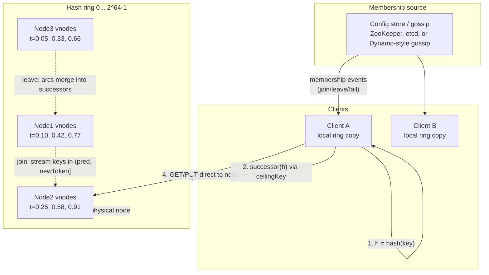
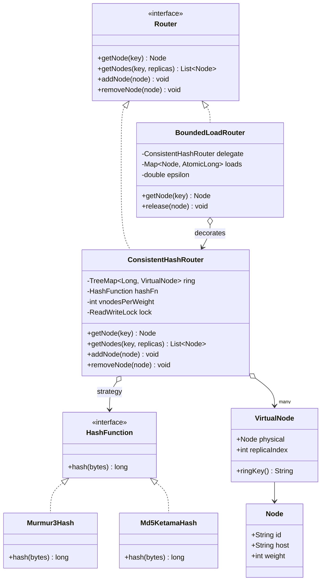

# Consistent Hashing

## 1. Problem Statement & Scope

**Core problem:** Given a set of keys (cache entries, partition keys, session IDs) and a dynamic set of N nodes (nodes join, leave, and fail), assign each key to exactly one node such that:

1. Lookup is deterministic and fast — any client can compute `owner(key)` locally.
2. When the node set changes from N to N±1, the number of keys that change owner is minimized — ideally K/N of K keys, the information-theoretic minimum (the new node must own *something*; the departed node's keys must go *somewhere*).
3. Load is approximately uniform across nodes, even with heterogeneous capacity.

### Functional requirements

- `getNode(key) -> node`: deterministic mapping from key to owning node.
- `addNode(node)`, `removeNode(node)`: mutate membership; only keys whose ownership actually changed should move.
- Support weighted nodes (a 2x-capacity node should own ~2x the keyspace).
- Support replication: `getNodes(key, R)` returns R distinct nodes for R-way replication.

### Non-functional requirements

- Lookup latency: O(log M) or better, where M = total ring entries (nodes × vnodes). Sub-microsecond in practice — this sits on the hot path of every cache get.
- Remapping fraction on membership change: ~K/N (vs ~(N-1)/N·K for mod-N).
- Load imbalance: max node load within a small factor (e.g., 1.1–1.25x) of mean.
- No central coordinator required for lookups (clients can hold the ring locally).

### Back-of-envelope: cost of a rehash storm

Concrete scenario — a Memcached tier fronting a relational DB:

- Cache cluster: 20 nodes, 64 GB each → ~1.28 TB cache, ~1.2B objects at ~1 KB avg.
- Read traffic: 500K QPS against the cache, 98% hit rate.
- Steady-state DB load: 500K × 0.02 = **10K QPS** — DB is provisioned for ~30K QPS peak.

Now one node is replaced and the client library uses `hash(key) mod N`:

- Adding node 21 to 20 remaps fraction ≈ 1 − 1/21 ≈ **95.2%** of keys (derived in §2).
- Instantly, 95% of cached keys point at the *wrong* node → effective hit rate collapses to near the 5% of keys that landed on the same node by coincidence.
- DB load spikes toward 500K × 0.95 ≈ **475K QPS** — 15–45x over provisioned capacity. The DB queues, latency explodes, timeouts trigger client retries, retries add load: classic cache-stampede-induced cascading failure. Recovery takes as long as it takes to re-warm 1.2 TB of cache through a saturated DB.

With consistent hashing, the same event remaps ≈ 1/21 ≈ **4.8%** of keys → DB spike of 500K × 0.048 ≈ 24K QPS transient, within provisioned headroom. That delta — 475K vs 24K — is the entire justification for this data structure.

**Scope for this doc:** the routing/partitioning layer only. Replication protocols, quorums, and anti-entropy are separate topics; we touch them only where they interact with ring placement (Dynamo preference lists, Cassandra token ranges).

---

## 2. Brute-Force / Naive Design

### hash(key) mod N

```java
int nodeIndex = Math.abs(hash(key)) % nodes.size();
```

Correct, uniform (given a good hash), O(1), zero memory. Perfect — until N changes.

### Why almost everything moves

A key stays on the same node across a resize N → N+1 iff:

```
hash(k) mod N == hash(k) mod (N+1)
```

For a uniformly distributed hash value h, write h = q·N(N+1) + r. Within each block of N(N+1) consecutive hash values, the residues mod N and mod N+1 coincide only for r in [0, N) — i.e., for N out of N(N+1) values. So:

```
P(key stays) = N / (N(N+1)) · N = 1/(N+1)   →   P(key moves) = N/(N+1)
```

(Equivalently: the pair (h mod N, h mod N+1) cycles through all N(N+1) combinations by CRT since gcd(N, N+1)=1; they agree on exactly N of them.)

For N=4 → 5: **fraction moved = 4/5 = 80%**. The minimum necessary was K/5 = 20% (the keys the new node should take). Mod-N moves 4x more than necessary.

### Worked example: N=4 → N=5, keys with hash values 0–19

| hash(k) | mod 4 | mod 5 | moved? |
|---|---|---|---|
| 0 | 0 | 0 | no |
| 1 | 1 | 1 | no |
| 2 | 2 | 2 | no |
| 3 | 3 | 3 | no |
| 4 | 0 | 4 | **yes** |
| 5 | 1 | 0 | **yes** |
| 6 | 2 | 1 | **yes** |
| 7 | 3 | 2 | **yes** |
| 8 | 0 | 3 | **yes** |
| 9 | 1 | 4 | **yes** |
| 10 | 2 | 0 | **yes** |
| 11 | 3 | 1 | **yes** |
| 12 | 0 | 2 | **yes** |
| 13 | 1 | 3 | **yes** |
| 14 | 2 | 4 | **yes** |
| 15 | 3 | 0 | **yes** |
| 16 | 0 | 1 | **yes** |
| 17 | 1 | 2 | **yes** |
| 18 | 2 | 3 | **yes** |
| 19 | 3 | 4 | **yes** |

16/20 = 80% moved, exactly N/(N+1). Only hashes 0–3 (where h < N) survive.

### Impact behind a cache

Every moved key is a guaranteed cache miss on next access (the data sits on a node no client will ask). With K keys and hit-driven DB protection, miss rate jumps from (1 − hit) to ≈ moved-fraction. Per §1's numbers: a routine scale-up event becomes a DB-melting incident. Mod-N also cannot express weights, and a *removal* is equally bad: N → N−1 moves (N−1)/N of keys.

**Verdict:** mod-N is acceptable only when N is truly fixed for the lifetime of the data (e.g., a fixed number of Kafka partitions, where the "resize" story is handled at a different layer).

---

## 3. Evolving the Design

### Step 1: mod-N → hash ring

Decouple key placement from node count. Hash both keys and nodes into the same circular space [0, 2^64) (or [0, 2^32) for ketama). A key is owned by the first node clockwise from `hash(key)` (its **successor**).

- Adding a node splits one arc: only keys in the new node's arc — expected K/N of them — move, and they all come from a single predecessor's range. **Optimal movement.**
- Removing a node merges its arc into its successor's: only that node's K/N keys move.
- Lookup: binary search over sorted node positions, O(log N).

This is Karger et al. (1997), built for web caching; the same construction independently underlies Chord DHT finger routing.

### Step 2: problem — non-uniform arcs and neighbor cascade

With one point per node, arc lengths are order statistics of N uniform random points on a circle. Expected arc = 1/N, but the distribution is wide: max arc is Θ(log N / N) with high probability — some node owns ~log N times its fair share. Two concrete failures:

1. **Static imbalance:** with N=10 physical points, it is routine for one node to own 25%+ of the ring.
2. **Failure cascade:** when a node dies, its *entire* arc lands on exactly one successor, which now carries ~2x load — the node most likely to fall over next, whose death dumps ~3x on the next one. Sequential domino failures.

### Step 3: virtual nodes (vnodes)

Place each physical node at V positions on the ring: `hash(nodeId + ":" + i)` for i in [0, V). Node load = sum of V independent arcs.

- Averaging over V arcs shrinks variance. Sketch: node load L = Σ V arc-lengths; E[L] = 1/N; treating arcs as ~i.i.d. with mean 1/(NV), Var(L) = V · Var(arc) and each exponential-like arc has stddev ≈ mean, so **stddev(L)/E[L] ≈ 1/√V**.
  - V=1 → ±100% relative deviation (useless).
  - V=100 → ±10%.
  - V=256 → ±6.25%.
  - V=1000 → ±3.2%.
- **Typical production values: V = 100–256** (ketama: 160 points per server; classic Cassandra: num_tokens=256, later default 16 with a smarter allocator — see §7).
- Failure spill: a dead node's V arcs have V *different* successors, so its load spreads across ~min(V, N−1) survivors — each picks up roughly 1/(N−1) extra instead of one node picking up 100%. This kills the domino cascade.
- Cost: ring memory and lookup are O(N·V); rebuild and lookup stay cheap (a TreeMap with 20×256 = 5,120 entries is nothing), but per-node token bookkeeping (repairs, range streams) multiplies — the real Cassandra pain point.

### Step 4: problem — heterogeneous capacity → weighted vnodes

Fleet has 64 GB and 128 GB boxes. Give node i `V_i = V_base × (capacity_i / capacity_base)` vnodes; expected ownership is proportional to vnode count. This falls out for free from the vnode design — one reason to prefer ring+vnodes over schemes where weighting is awkward (jump hash) or requires per-node score functions (rendezvous handles it via weighted HRW).

### Step 5: problem — hot keys and skewed load → bounded loads

Vnodes equalize *keyspace*, not *traffic*. Two residual problems:

1. Popularity skew: keys are Zipfian; a node can own average keyspace but 5x average QPS.
2. Even with uniform traffic, random placement leaves a max-loaded node ~(1 + c/√V) above mean, and during churn that drifts.

**Consistent Hashing with Bounded Loads** (Mirrokni, Thorup, Zadimoghaddam 2017; deployed in Google Cloud Pub/Sub, Vimeo's HAProxy patch):

- Fix ε > 0. Hard cap per node: `capacity = ceil((1+ε) × totalLoad / N)`.
- Lookup: hash the key, find successor; if that node is at capacity, **continue clockwise** to the next node with spare capacity (linear probing on the ring).
- Guarantee: no node ever exceeds (1+ε)× mean load, while key movement on membership change stays bounded — expected reassignments O(1/ε²) per insert/delete in the theoretical analysis; small in practice.
- Trade-off dial: ε = 0.25 → max 1.25x mean, few forwards; ε → 0 → perfect balance but lookups devolve toward round-robin-like scanning and remapping grows. ε in [0.1, 0.5] is typical.
- Caveat: requires (approximate) load tracking, so it fits **stateful routers/load balancers** (HAProxy, Pub/Sub brokers) more naturally than fully independent cache clients.

For a *single* hot key even bounded loads can't help a cache (the key lives somewhere): replicate the hot key to R nodes (`hash(key + saltIdx)`) and spread reads, or absorb it in a client-local/edge cache. Covered in §7.

### Evolution summary

| Stage | Fixes | New problem introduced |
|---|---|---|
| mod-N | nothing to fix yet | ~N/(N+1) keys move on resize |
| hash ring | movement → K/N optimal | arc-size variance; neighbor cascade on failure |
| vnodes (V≈100–256) | stddev ≈ 1/√V; spill spread over V successors | O(N·V) ring entries; ops overhead per token |
| weighted vnodes | heterogeneous capacity | still keyspace-balance, not traffic-balance |
| bounded loads (1+ε) | traffic cap at (1+ε)·mean | needs load state; forwarding hops |
| hot-key replication | single-key hotspots | per-key config/detection; read-your-writes complexity |

---

## 4. Protocol & Technology Choices — Why This, Not That

### Placement algorithm

| Algorithm | Lookup | Memory | Keys moved on node change | Weighted support | Notes |
|---|---|---|---|---|---|
| mod-N | O(1) | O(1) | ≈ N/(N+1) (add) — near total | via slot duplication, ugly | Only for permanently fixed N |
| Ring + vnodes | O(log NV) | O(N·V) | K/N optimal | natural (vnode count) | The default; arbitrary add/remove |
| Rendezvous (HRW) | O(N) per lookup | O(N) | K/N optimal | yes (weighted HRW / logarithmic method) | Hash key with *every* node, pick max score; perfect balance, no vnodes needed |
| Jump consistent hash | O(ln N), tiny constant | **O(1)** — no table | K/N optimal | no (not directly) | Google 2014; maps key → bucket in [0,N); buckets must be numbered 0..N−1, so only shrink/grow at the *end* — no arbitrary removal |
| Maglev | O(1) via lookup table | O(table) ~65k entries | small but **> K/N** (table disruption) | yes | Google's LB; table regeneration O(M log M); optimized for lookup speed + near-perfect balance, tolerates slightly more remap |

**Why ring+vnodes here:** arbitrary node add/remove by name (cache nodes fail unpredictably), weighted nodes, replication via "next R distinct successors" falls out naturally (Dynamo preference lists), O(log M) lookup is plenty fast, and it's the scheme your interviewer expects you to know cold.

**When the alternatives win:**
- **Jump hash**: N is a count of *interchangeable* shards that only grows (e.g., resharding a keyspace 0..N−1, data pipeline partitioning). Unbeatable memory (zero state) and speed; useless when node 7 of 20 dies.
- **Rendezvous/HRW**: small N (≤ ~100, since lookup is O(N)); wins on simplicity (no ring state, no vnodes, provably perfect balance) and elegant weighted variant. Great for picking 1-of-8 regions or replica sets.
- **Maglev**: software load balancers with millions of lookups/sec where O(1) table lookup and near-perfect backend balance matter more than minimal disruption (connections are short-lived; slightly higher remap is tolerable, often masked by connection tracking).

### Hash function

| Function | Speed | Distribution | Cryptographic | Verdict |
|---|---|---|---|---|
| MD5 | ~500 MB/s, 16-byte out | excellent | broken-crypto but irrelevant here | Legacy: ketama and Cassandra's RandomPartitioner use it; fine, just slow |
| MurmurHash3 (128/64) | ~5–10 GB/s | excellent (passes SMHasher) | no | **Default choice**; Cassandra Murmur3Partitioner, Guava |
| xxHash / XXH3 | ~10–30 GB/s | excellent | no | Pick when hashing is measured on profiles; XXH3 for short keys |
| FNV-1a | fast for tiny keys | mediocre avalanche | no | Avoid for ring placement |
| SHA-256 | slow | excellent | yes | Wasted cycles — **cryptographic strength buys nothing**: adversarial key-crafting is handled at auth/rate-limit layers, not the ring |

Key point to say out loud: we need *uniformity and speed*, not preimage resistance. Also: never use `String.hashCode()`/language default hashes — poor avalanche, differs across languages, and ring views must agree byte-for-byte across polyglot clients.

### Ring data structure

| Structure | Lookup | Add/remove node (V entries) | Memory/locality | Verdict |
|---|---|---|---|---|
| Sorted long[] + binary search | O(log M), best constants (cache-friendly) | O(M) rebuild | excellent | **Best for read-mostly**: rebuild array on membership change, swap atomically (copy-on-write) |
| TreeMap (red-black) | O(log M) | O(V log M) incremental | pointer-chasing, worse cache behavior | Best for teaching/interview and frequently-mutating rings; `ceilingEntry` is exactly successor-on-ring |
| Skip list (ConcurrentSkipListMap) | O(log M) expected | O(V log M), **lock-free concurrent** | moderate | When you want in-place concurrent mutation without a ReadWriteLock |
| Hash table | O(1) point lookup only | — | — | Can't answer "smallest key ≥ h" — wrong tool |

Membership changes are rare (minutes/hours apart) vs lookups (millions/sec) → copy-on-write sorted array is the production answer; TreeMap is the clean LLD answer (§6). Both are correct.

---

## 5. High-Level Design (HLD)



### Key lookup walkthrough

1. Client computes `h = murmur3_64(key)`.
2. Ring lookup: smallest vnode token ≥ h (`ceilingEntry`); if none, wrap to the ring's first entry.
3. Resolve vnode → physical node; send the request directly. No coordinator, no network hop for routing. All clients with the same ring view make the same decision.

### Node join

1. New node announces (gossip or registers in config store); picks/receives V tokens.
2. Each token t splits an existing arc `(pred(t), succ_old(t)]`: keys in `(pred(t), t]` now belong to the new node.
3. Exactly those keys — expected K/N total across all V tokens — are streamed from the V previous owners. During the transfer, either double-read (new then old) or serve stale from old until handoff completes.
4. Membership update propagates; clients atomically swap ring versions.

### Node leave / failure

- Graceful leave: node streams each vnode's keys to that arc's successor, then deregisters. Only its K/N keys move.
- Crash: successors of its V vnodes absorb ownership immediately (routing self-heals); data recovery relies on replication — which is why Dynamo-style systems replicate each range to the next R−1 *distinct physical* successors.

### Mapping to real systems

- **Cassandra token ranges:** each node owns `num_tokens` ranges `(prev_token, my_token]` on a Murmur3 ring over [−2^63, 2^63). Placement of replicas = walk clockwise collecting distinct nodes (NetworkTopologyStrategy additionally skips nodes to satisfy rack/DC constraints). Membership via gossip; every node and driver knows the full ring, so drivers do **token-aware routing** straight to a replica.
- **Dynamo preference lists:** `getNodes(key, N)` = first N distinct *physical* nodes clockwise from hash(key); top N healthy entries form the preference list; the coordinator is typically the first. Sloppy quorum: if a preference-list node is down, walk further clockwise and hand the write to the next node with a hinted handoff.
- **Memcached + ketama (client-side, zero server coordination):** memcached servers are dumb — they don't know about each other. The *client library* builds the ring: per server, 40 groups × MD5 → 4 points each = **160 points/server**, weighted by memory size. Every client with the same server list and same algorithm independently computes identical placement. Consistency across clients is purely conventional — the failure mode when it isn't is §7.

---

## 6. Low-Level Design (LLD)



**Patterns:** `HashFunction` is a **Strategy** (swap Murmur3/MD5-ketama without touching ring logic — also the seam for cross-language compatibility tests). `Router` is an interface for **dependency inversion**; `BoundedLoadRouter` is a **Decorator** adding load caps over the plain ring. `VirtualNode` → `Node` is a lightweight **Flyweight** (V vnodes share one physical-node object).

### Java implementation — TreeMap ring with ceilingEntry + wrap-around

```java
public interface HashFunction {
    long hash(byte[] data);
    default long hash(String s) { return hash(s.getBytes(StandardCharsets.UTF_8)); }
}

public final class Node {
    final String id;      // stable identity, e.g. "cache-07.us-east-1a" — NOT the IP
    final String host;
    final int weight;     // 1 = baseline capacity
    Node(String id, String host, int weight) { this.id = id; this.host = host; this.weight = weight; }
}

public final class VirtualNode {
    final Node physical;
    final int replicaIndex;
    VirtualNode(Node physical, int replicaIndex) { this.physical = physical; this.replicaIndex = replicaIndex; }
    String ringKey() { return physical.id + "#VN" + replicaIndex; }   // deterministic token seed
}

public final class ConsistentHashRouter implements Router {
    private final TreeMap<Long, VirtualNode> ring = new TreeMap<>();
    private final HashFunction hashFn;                 // Strategy
    private final int vnodesPerWeight;                 // e.g. 160
    private final ReadWriteLock lock = new ReentrantReadWriteLock();

    public ConsistentHashRouter(HashFunction hashFn, int vnodesPerWeight, Collection<Node> seed) {
        this.hashFn = hashFn;
        this.vnodesPerWeight = vnodesPerWeight;
        seed.forEach(this::addNode);
    }

    @Override
    public void addNode(Node node) {
        lock.writeLock().lock();
        try {
            int vnodes = vnodesPerWeight * node.weight;          // weighted vnodes
            for (int i = 0; i < vnodes; i++) {
                VirtualNode vn = new VirtualNode(node, i);
                long token = hashFn.hash(vn.ringKey());
                // Collision on 64-bit tokens is ~never; last-writer-wins is acceptable,
                // or probe: while (ring.containsKey(token)) token++;
                ring.put(token, vn);
            }
        } finally { lock.writeLock().unlock(); }
    }

    @Override
    public void removeNode(Node node) {
        lock.writeLock().lock();
        try {
            int vnodes = vnodesPerWeight * node.weight;
            for (int i = 0; i < vnodes; i++) {
                ring.remove(hashFn.hash(new VirtualNode(node, i).ringKey()));
            }
        } finally { lock.writeLock().unlock(); }
    }

    /** Successor on the ring: smallest token >= hash(key), wrapping to firstEntry(). */
    @Override
    public Node getNode(String key) {
        lock.readLock().lock();
        try {
            if (ring.isEmpty()) throw new IllegalStateException("empty ring");
            long h = hashFn.hash(key);
            Map.Entry<Long, VirtualNode> e = ring.ceilingEntry(h);   // O(log M)
            if (e == null) e = ring.firstEntry();                    // wrap-around
            return e.getValue().physical;
        } finally { lock.readLock().unlock(); }
    }

    /** First `count` DISTINCT physical nodes clockwise — Dynamo preference list. */
    @Override
    public List<Node> getNodes(String key, int count) {
        lock.readLock().lock();
        try {
            long h = hashFn.hash(key);
            List<Node> result = new ArrayList<>(count);
            Set<String> seen = new HashSet<>();
            // Clockwise from h, then wrap: tailMap covers [h, max], headMap covers the wrap.
            for (VirtualNode vn : ring.tailMap(h, true).values()) {
                if (seen.add(vn.physical.id)) result.add(vn.physical);
                if (result.size() == count) return result;
            }
            for (VirtualNode vn : ring.headMap(h, false).values()) {
                if (seen.add(vn.physical.id)) result.add(vn.physical);
                if (result.size() == count) return result;
            }
            return result;   // fewer than count physical nodes exist
        } finally { lock.readLock().unlock(); }
    }
}
```

### Thread-safety: ReadWriteLock vs copy-on-write

| | ReadWriteLock (above) | Immutable copy-on-write |
|---|---|---|
| Read path | lock acquire per lookup — contention & cache-line bouncing at millions of QPS | `volatile Ring ref` read; zero contention, trivially safe |
| Write path | incremental O(V log M) | rebuild full structure O(M log M) — fine, membership changes are rare |
| Consistency | readers may interleave mid-batch if adds aren't atomic per node | each reader sees one immutable snapshot — no torn views |
| Verdict | fine for interview code / low QPS | **production choice**: rebuild `long[] tokens + VirtualNode[] owners`, binary-search, publish via volatile/AtomicReference |

Copy-on-write sketch:

```java
private volatile RingSnapshot snapshot;   // { long[] tokens; VirtualNode[] owners; }

public Node getNode(String key) {
    RingSnapshot s = snapshot;                       // one volatile read
    int i = Arrays.binarySearch(s.tokens, hashFn.hash(key));
    if (i < 0) i = -i - 1;                           // insertion point = ceiling index
    if (i == s.tokens.length) i = 0;                 // wrap-around
    return s.owners[i].physical;
}
// addNode/removeNode: synchronized { build new arrays; snapshot = newSnapshot; }
```

(`ConcurrentSkipListMap` is the middle option: lock-free concurrent reads *and* incremental writes, at the cost of worse constants than the array.)

### Bounded-load lookup pseudocode (the (1+ε) walk)

```text
function getNodeBounded(key, epsilon):
    cap = ceil((1 + epsilon) * totalInFlight / nodeCount)   # recompute or amortize
    h = hash(key)
    for entry in ringEntriesClockwiseFrom(h):                # ceiling, then wrap
        node = entry.physicalNode
        if node already skipped this lookup: continue        # dedupe vnodes of same node
        if load[node] < cap:
            load[node] += 1                                  # release on completion
            return node
    return successor(h)    # all at cap (transient); fall back rather than fail

# Properties:
#  - No node exceeds (1+eps) * mean load, by construction.
#  - Same key usually lands on same node (walk order is deterministic);
#    it forwards only while its home is saturated -> good-enough cache affinity.
#  - eps small -> tighter balance, longer walks & more remapping; eps in [0.1, 0.5] typical.
```

Edge cases worth naming in an interview: empty ring (throw/fallback), single node (every lookup wraps to it), token collision (probe or last-writer-wins with deterministic ordering), and **hash the stable node ID, not the IP** — a node that changes IP on restart must keep its tokens or you've triggered a silent partial rehash.

---

## 7. Deep Dives & Failure Modes

### 7.1 Cascading failure on node death — why vnodes spread the spill

Without vnodes, dead node D's whole arc → its single successor S: S goes to ~2x load. If the fleet runs at 60% utilization, S is now at 120% → S dies → its successor takes ~3x. Domino. With V vnodes, D's V arcs have up to V distinct successors; each survivor absorbs ~1/(N−1) of D's load → each goes from 60% to ~60%·(1 + 1/(N−1)) ≈ 63% at N=20. The same total spill, spread thin. Corollary: this is also why you provision headroom as `(N/(N−1))` per expected concurrent failure, not 2x.

### 7.2 Hot keys — what vnodes do NOT fix

Vnodes balance *keyspace ownership*. A single key (celebrity user, viral post, global config row) hashes to exactly one token no matter how many vnodes exist — its owner melts while the ring is perfectly "balanced". Mitigations, in escalating order:

1. **Detection:** client-side or node-side top-K/heavy-hitter tracking (count-min sketch) to find hot keys before they find you.
2. **Key replication / salting:** write to `key`, read from `key#i, i = rand(0..R−1)` where each salted variant hashes elsewhere; or read-replicate the value to the R clockwise successors and let clients pick randomly. Costs write fan-out or staleness.
3. **Local/edge cache:** an L1 in-process cache with a short TTL (even 1s) absorbs the vast majority of a hot key's reads — the standard first move.
4. **Bounded loads** cap *aggregate* node load and help with *many warm keys clustering*, but for one single hot key in a cache, forwarding just moves the miss — replication/local caching is the real fix.

### 7.3 Data movement during rebalance

Ownership change is instant (a map update); *data* movement is not. A joining Cassandra node streams its ranges from current owners: this must be **throttled** (`stream_throughput_outbound`) or the streaming saturates disks/NICs and tanks p99 for live traffic. For caches, common practice is to *not* migrate at all — accept K/N cold misses and let the cache re-warm — but then you must rate-limit the resulting DB fill (request coalescing / single-flight per key so 10K concurrent misses on one key become one DB read). During migration windows, systems either double-read (new owner, fall back to old) or double-write; both need a cutover fence to avoid lost updates.

### 7.4 Ring inconsistency across clients (the memcached trap)

Ketama has no coordination: each client builds its ring from its own server list and its own library version. Failure modes seen in the wild:

- Two services use different client libraries (or the same library, different versions) with different point counts or hash details → **same key lives on two different nodes**, effective cache capacity halves, and — far worse — invalidations go to the wrong node → **stale data served indefinitely**.
- Config rollout skew: half the fleet has the new server list for 10 minutes → split-brain routing for the duration.

Mitigations: single shared routing library pinned across services; distribute the server list from one source (config service) with versioning; or interpose a routing proxy tier (twemproxy/mcrouter) so only proxies hold ring views. State the invariant explicitly: *correct invalidation requires all writers and readers to share one ring view*; stale-tolerant workloads can relax this, cache-as-source-of-truth workloads cannot.

### 7.5 Cassandra vnode trade-offs

- num_tokens=256 (old default) gave good balance and incremental rebalancing but: repairs must process 256 ranges per node (Merkle-tree overhead per range), range queries touch more ranges, and with random token assignment the probability that *any* two nodes share a replica set approaches 1 — so **any 2 (RF=3: any 3) simultaneous node failures likely lose some range's quorum** in a large cluster. Fewer, smarter tokens shrink that combinatorial exposure.
- Cassandra 3.0+ added `allocate_tokens_for_keyspace`: instead of random tokens, it *optimizes* token placement to even out ownership, allowing **num_tokens=16** (the 4.0 default) with balance comparable to 256 random tokens. Lesson for interviews: random placement needs many samples for balance; deliberate placement achieves it with few.

### 7.6 Gossip vs static ring configuration

| | Static config (ketama-style) | Gossip (Dynamo/Cassandra) |
|---|---|---|
| Propagation | deploy/config push — minutes | epidemic, O(log N) rounds — seconds |
| Failure handling | none built in; needs external health checks | failure detection integrated (phi-accrual) |
| Consistency of view | skew during rollout (7.4) | eventually consistent; transient disagreement by design, tolerated via hinted handoff/read repair |
| Complexity | trivial | seed nodes, generation/version numbers, shadow-state bugs |
| Fits | client-side cache routing, small fleets | server-side data stores where nodes coordinate anyway |

Middle ground used by most modern infra: membership in a strongly consistent store (etcd/ZooKeeper) with client watches — consistent view, fast propagation, at the cost of a coordination-service dependency.

---

## 8. Trade-off Summary & Interview Soundbites

### Decision → trade-off accepted

| Decision | Trade-off accepted |
|---|---|
| Ring over mod-N | O(log M) lookup + O(N·V) state, in exchange for K/N minimal remapping |
| V = 100–256 vnodes | ~1/√V balance (±6–10%) for V× ring entries and V× per-node ops metadata (repair ranges, streams) |
| Murmur3/xxHash over MD5/SHA | 10–50x hashing speed; give up cryptographic properties we never needed |
| Copy-on-write sorted array over locked TreeMap | O(M log M) rebuild per membership change (rare) for contention-free reads (constant) |
| Bounded loads with ε=0.25 | ≤1.25x mean load guaranteed, paying occasional forwarding hops and load-state tracking |
| Client-side routing (ketama) over proxy tier | Zero extra hop and no coordinator, paying with ring-view-skew risk across clients |
| Don't migrate cache data on join, just re-warm | Simplicity; must survive a K/N miss burst — pair with single-flight DB fills |
| Cassandra num_tokens 16 + smart allocation over 256 random | Slightly more complex token assignment for cheaper repairs and lower multi-failure quorum-loss probability |

### Soundbites

1. "Mod-N moves N/(N+1) of keys on a resize; consistent hashing moves 1/(N+1) — that ratio, ~N×, is the whole point."
2. "One token per node gives max arcs of ~log N times fair share; V vnodes cut relative load stddev to about 1/√V — V=256 gets you within ~6% of uniform."
3. "Vnodes' second job is failure dilution: a dead node's load spills to V different successors instead of doubling one neighbor."
4. "Vnodes balance keyspace, not traffic — a single hot key still lands on one node; the fix is replication or an L1 cache, not more vnodes."
5. "Bounded loads is consistent hashing plus a capacity check: walk clockwise past full nodes, and no node ever exceeds (1+ε) times the mean."
6. "The ring lookup is just TreeMap.ceilingEntry with a wrap to firstEntry — successor-on-a-circle in one line."
7. "Ketama's superpower and its trap are the same thing: no coordination — every client must compute an identical ring or invalidations go to the wrong node."
8. "Jump hash when shards are numbered and only grow, rendezvous when N is small, maglev when you're a load balancer, ring+vnodes for everything else."

### Common follow-ups, short answers

- **"Why not just rendezvous hashing everywhere — it's simpler?"** O(N) per lookup. Fine at N=20, not at N=2,000 or with vnode-free weighted replicas; the ring gives O(log M). Below ~100 nodes, honestly, rendezvous is a defensible answer — say so.
- **"How do you replicate with a ring?"** Walk clockwise from the key's position collecting the next R *distinct physical* nodes (skip same-node vnodes; optionally skip same rack/DC) — Dynamo's preference list, Cassandra's replication strategy.
- **"Two nodes hash to the same token?"** 64-bit space with a few thousand tokens → collision probability ~10^-13 (birthday bound); deterministic tie-break (probe +1 or order by node ID) so all clients agree.
- **"How does the client learn the ring changed?"** Static config push, watch on etcd/ZooKeeper, or gossip. For caches, brief skew only costs extra misses; for invalidation-critical or storage systems, you need versioned ring views and a handoff protocol.
- **"What happens to in-flight requests during a topology change?"** Routing flips instantly; data follows. Either accept misses (cache), double-read old+new owner during the window (storage), or use hinted handoff for writes to temporarily wrong owners.
- **"Can consistent hashing shrink to zero disruption?"** No — K/N movement is the floor; the new node must own something. Anything claiming less isn't rebalancing.
- **"How would you handle a node that's slow but not dead?"** That's load-aware routing, not placement: bounded loads, power-of-two-choices among replicas, or outlier ejection at the client — the ring deliberately doesn't model health.
