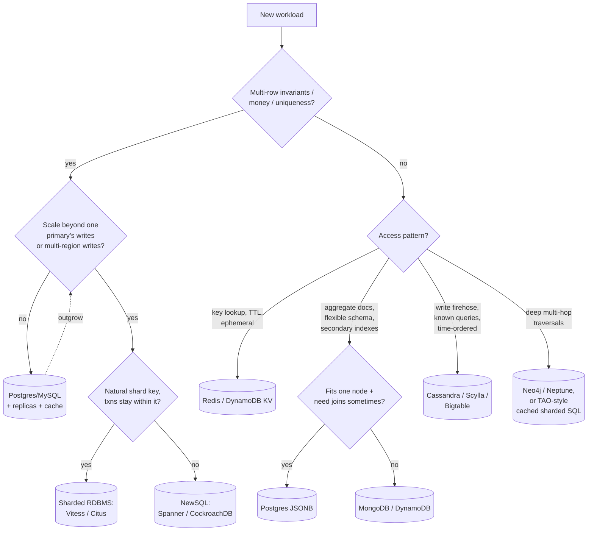
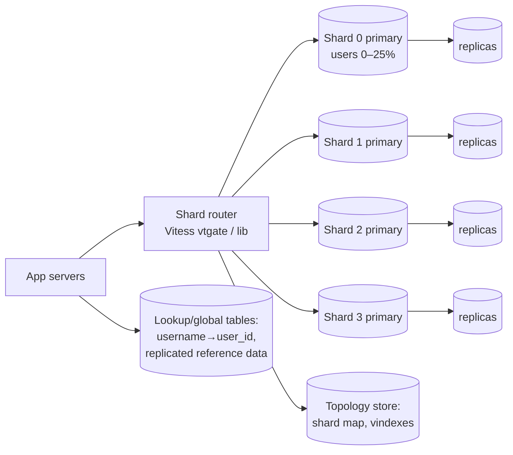
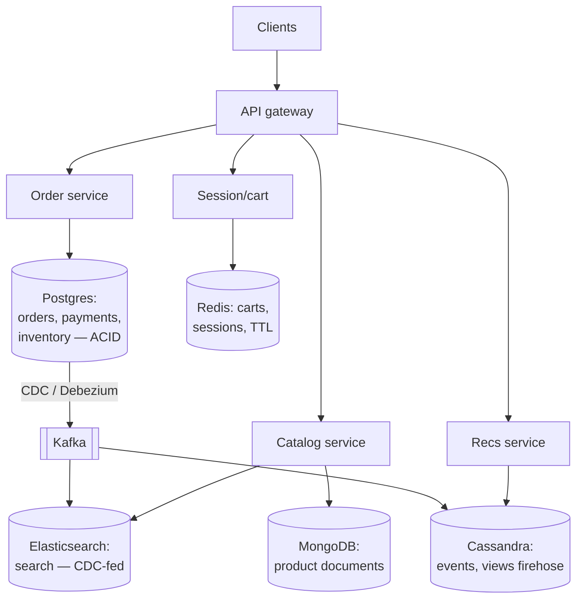
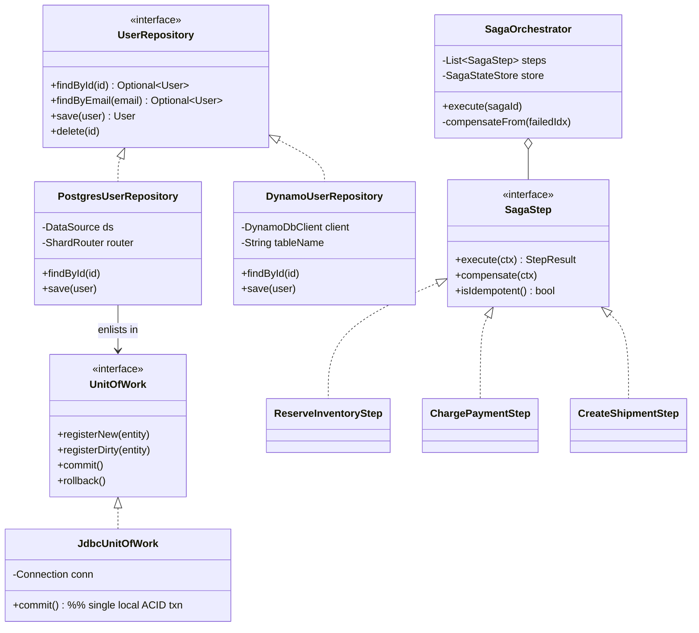

# SQL vs NoSQL — A Decision Framework

## 1. Problem Statement & Scope

This is not a "design X" question; it is the meta-question that sits inside every design interview: **given the workload, which storage engine(s) do I pick, and how do I defend the choice?** The interviewer is testing whether you reason from requirements to technology, not from brand names to justifications.

### Decision inputs (the "requirements" of this topic)

Treat database selection as a function of four inputs:

1. **Consistency requirements**
   - Do concurrent readers need to see the latest committed write (linearizability / strong consistency)?
   - Do multi-row invariants matter (debits equal credits, unique usernames, inventory never negative)?
   - Or is eventual convergence fine (like counts, feeds, presence)?
2. **Access patterns**
   - Known, finite set of queries (key lookup, partition scan) vs ad-hoc queries, joins, aggregations, reporting.
   - Read/write ratio; point reads vs range scans vs full-text vs graph traversals.
3. **Scale numbers** — throughput (QPS), data volume (TB), working set size, growth rate.
4. **Operational constraints** — multi-region, latency SLOs (p99), team expertise, cost.

### Back-of-envelope: when does a single Postgres box run out?

Know these thresholds cold; they anchor section 2.

| Dimension | Single-node Postgres (big box, tuned) | Arithmetic |
|---|---|---|
| Connections | ~500 direct; thousands via PgBouncer | Each backend is a process, ~5–10 MB overhead. 5,000 direct conns ≈ 25–50 GB RAM just for connections → pooler mandatory. |
| Read QPS | ~50k–100k simple indexed reads (cached) | B-tree point read ≈ 3–4 page touches; RAM-resident pages ≈ microseconds each. CPU-bound long before disk if working set fits in RAM. |
| Write QPS | ~5k–20k transactional writes | Each commit = WAL fsync. NVMe fsync ≈ 0.1–1 ms; with group commit batching ~10 commits/fsync → 10k–100k commits/s theoretical, but index maintenance, locking, and vacuum pressure land you at 5k–20k sustained. |
| Storage | Comfortable to ~2–4 TB; painful past ~10 TB | Not a hard limit — the pain is operational: `pg_dump`/restore takes days, a reindex of a 1 TB table takes hours, replica rebuild saturates the network (10 TB over 10 Gbps ≈ 2.2 hours best case, usually 10x that). |
| Working set | Must roughly fit in RAM (up to ~1–4 TB on big cloud boxes) | Once the hot set spills, reads go from µs to ms and throughput collapses ~100x. |

**Worked example.** Social app, 10 M DAU, 20 reads + 2 writes per user per day:
- Reads: 10M x 20 / 86,400 ≈ 2,300 QPS avg, x5 peak ≈ 12k QPS.
- Writes: 10M x 2 / 86,400 ≈ 230 QPS avg, ~1.2k peak.
- Storage: 2 writes/day x 1 KB x 365 ≈ 7.3 GB/year of raw rows; with indexes and bloat, ~20–30 GB/year.

Conclusion: **one Postgres box with a read replica handles 10 M DAU for years.** Interviewers reward candidates who compute this instead of reflexively sharding.

### Scope

In scope: CAP/PACELC, ACID vs BASE, isolation levels, NoSQL taxonomy, sharding an RDBMS vs native distribution, NewSQL, concrete scenario picks, failure modes (hot shards, resharding, cross-shard transactions, replication lag).
Out of scope: OLAP/warehouses (Snowflake, BigQuery), search engines (Elasticsearch) except as sidecars, storage engine internals (LSM vs B-tree covered only where it changes the decision).

## 2. Brute-Force / Naive Design: One Postgres For Everything

The naive design is a monolith with a single Postgres instance holding users, orders, sessions, events — everything. It is also the **correct starting design** for the vast majority of systems, and saying so is a senior signal.

Why it holds far longer than people think:
- Full ACID transactions, real foreign keys, ad-hoc SQL for any product question, one backup story, one operational skill set.
- JSONB gives you schemaless columns inside a relational engine; `LISTEN/NOTIFY` gives cheap pub/sub; partial and expression indexes cover exotic access patterns.
- From the arithmetic above: a $2k/month box (64 vCPU, 512 GB RAM, NVMe) serves tens of thousands of QPS on a cached working set. That is a mid-size successful company.

### Exactly when and why it breaks

| Breakpoint | Symptom | Number that triggers it |
|---|---|---|
| Connection storms | `FATAL: too many connections`, latency spikes | Microservices x pods x pool size > ~500 backends; fixed by PgBouncer, until transaction-mode pooling breaks prepared statements/session state |
| Write throughput | Commit latency climbs, replication lag grows | Sustained > ~10–20k transactional writes/s on one primary; WAL fsync + lock contention; vertical scaling has a ceiling (one primary, one WAL stream) |
| Working set > RAM | p99 reads go 100 µs → 10 ms, cache hit ratio < 99% | Hot data > ~0.5–1 TB on affordable hardware |
| Table size operations | `ALTER TABLE` locks, autovacuum can't keep up, index bloat | Single tables past ~500 GB–1 TB; vacuum on a 2 TB table with high churn falls behind → txid wraparound risk |
| Availability | Failover = 30 s–minutes of unavailability; single region | Any SLO better than ~99.95% with strict RTO, or a multi-region write requirement — a single-primary RDBMS fundamentally cannot take writes in two regions without conflict |
| Analytics contention | Report query holds back vacuum, evicts hot pages | OLAP on the OLTP box — fixed by a replica long before a new database |

Note the shape: the first four are *scaling* problems solvable within the relational world (pooling, replicas, partitioning, sharding). Only multi-region active-active writes and truly unbounded single-table write throughput force a genuinely different architecture.

## 3. Evolving the Design

Narrate this ladder in the interview; each rung buys an order of magnitude and is cheaper than the next.

**Step 1 — Read replicas.** Async streaming replication; route reads to replicas. Buys 5–10x read throughput. New problem introduced: **replication lag** → a user writes then reads a replica and doesn't see their write. Mitigations: read-your-writes routing (pin user to primary for N seconds after write, or track LSN and wait for replica catch-up). Does nothing for write throughput — still one primary.

**Step 2 — Caching.** Redis/Memcached in front for hot keys (cache-aside). Buys 10–100x on read-heavy skewed workloads (Zipfian: top 1% of keys often 90% of reads). New problems: invalidation, stampedes (mitigate with request coalescing / probabilistic early expiry), and cache-DB inconsistency windows. Still no write relief.

**Step 3 — Vertical scale + tuning.** Bigger box, NVMe, partitioned tables (Postgres declarative partitioning turns one 4 TB table into 100 manageable 40 GB partitions — fixes vacuum and DDL pain, not throughput). Cheap, do it early. Ceiling: the biggest cloud instance, and failover blast radius grows with the box.

**Step 4 — Functional partitioning.** Split by domain before splitting by key: sessions → Redis, events/metrics → a time-series or wide-column store, full-text → Elasticsearch, blobs → S3. Each offloaded workload was abusing the RDBMS anyway (sessions are ephemeral key-value churn; events are append-only firehose). This is where **polyglot persistence** begins, and it defers horizontal sharding by years. Cost: cross-store consistency is now the application's problem.

**Step 5 — The fork: shard the RDBMS vs migrate to NoSQL.** Only when a *single domain's* write volume or data size exceeds one primary.

- **Shard the RDBMS** when you need transactions/joins *within* a natural partition key and your queries are tenant- or user-scoped. Options:
  - *App-level sharding*: `shard = hash(user_id) % N` in a routing library. Full control, no new infra; but resharding, cross-shard queries, and schema rollout across N databases are all on you.
  - *Vitess* (MySQL) / *Citus* (Postgres): a proxy/coordinator layer that owns routing, resharding (Vitess does live resharding with VReplication), connection pooling, and scatter-gather. Battle-tested (YouTube, Slack, GitHub on Vitess).
  - Pain you accept either way: cross-shard joins become app-side scatter-gather; cross-shard transactions need 2PC (blocking, coordinator SPOF) or sagas; auto-increment IDs must be replaced (Snowflake IDs/UUIDs); resharding is a project, not a command (unless Vitess).
- **Migrate to NoSQL** when the access pattern is genuinely key-oriented, joins are absent or precomputable, and you want the database — not you — to own partitioning, rebalancing, and replication. Cassandra/DynamoDB give elastic writes and multi-region active-active out of the box; the price is denormalization, no ad-hoc queries, eventual consistency by default, and modeling tables per query pattern.

**Step 6 — NewSQL as the escape hatch from the fork.** Spanner/CockroachDB: SQL, serializable transactions, *and* horizontal write scaling via consensus-replicated ranges. Pay for it in write latency (consensus round trips) and cost. Covered in §4 and §8.

### The theory you must narrate along the way

**CAP theorem — properly.** For a distributed system, when a network **P**artition occurs, you must choose between **C**onsistency (every read sees the most recent write — linearizability) and **A**vailability (every request to a non-failed node gets a non-error response). Key corrections to the pop version:
- **Partition tolerance is not optional.** Networks partition; that is an empirical fact, not a design choice. A "CA system" would be one guaranteed never to partition — i.e., a single node, or a distributed system that stops entirely on partition (which forfeits A anyway). So for distributed systems the real menu is **CP vs AP**, and "CA" is a misnomer.
- CAP is about behavior **during** a partition only. In healthy operation you can have both C and A. It says nothing about latency, which is the more common everyday trade — hence PACELC.
- C in CAP (linearizability) ≠ C in ACID (integrity constraints). Don't conflate them.

**PACELC.** If **P**artition: trade **A**vailability vs **C**onsistency (CAP). **E**lse (normal operation): trade **L**atency vs **C**onsistency — strong consistency requires coordination (quorums/consensus) on every write and often reads, adding round trips.

| System | Partition | Else | Notes |
|---|---|---|---|
| DynamoDB | PA | EL | Default eventually-consistent reads; opt-in strongly consistent reads (single-region), transactions cost 2x |
| Cassandra | PA | EL | Tunable per-query (ONE/QUORUM/ALL); R+W>N gives strong-ish reads at latency cost |
| Riak | PA | EL | Dynamo lineage, vector clocks / CRDTs |
| MongoDB | PC | EC | Raft-like replica sets; minority partition can't accept writes; default reads from primary |
| Spanner | PC | EC | Paxos per split + TrueTime; external consistency; pays commit-wait latency |
| CockroachDB | PC | EC | Raft per range; serializable by default |
| HBase | PC | EC | Single RegionServer owns a region; consistent, unavailable during region reassignment |
| Postgres + sync replica | PC | EC | Sync commit waits on replica ack |

**ACID unpacked.**
- **Atomicity** — a transaction's writes apply all-or-nothing; implemented via WAL/undo. Protects multi-row invariants on failure.
- **Consistency** — the DB moves between valid states: constraints, foreign keys, triggers hold. (The weakest letter — partly the app's job.)
- **Isolation** — concurrent transactions behave as if serialized, per the chosen isolation level (see table in §4). This is where money bugs live: write skew at snapshot isolation famously allows two doctors to both go off-call.
- **Durability** — committed = survives crash; fsync'd WAL, plus replication for surviving the node.

**BASE unpacked.** **B**asically **A**vailable — the system answers even during partial failure (possibly stale). **S**oft state — state may change without input as replicas converge. **E**ventual consistency — absent new writes, all replicas converge. BASE is not a specification; it is an admission that the app must handle staleness, conflicts (last-write-wins clobbering, sibling resolution), and no cross-item invariants.

**NoSQL taxonomy.**

| Family | Data model | Query pattern | Wins when | Canonical |
|---|---|---|---|---|
| Key-value | Opaque value by key | GET/PUT/DELETE, TTL | Sessions, caching, feature flags, counters; lowest latency, simplest scaling | Redis, DynamoDB (KV mode), Memcached |
| Document | JSON docs, nested, secondary indexes | Query by fields inside doc, per-doc atomic updates | Aggregate-oriented entities read/written as a unit (catalog item, user profile); flexible schema | MongoDB, DynamoDB (single-table), Couchbase |
| Wide-column | Partition key → ordered rows (clustering key) → columns; LSM storage | Point/range queries within a partition; queries designed table-first | Massive write throughput, time-ordered data per key, multi-region active-active | Cassandra, HBase, ScyllaDB, Bigtable |
| Graph | Nodes + edges + properties | Traversals (friends-of-friends), pattern matching | Deep multi-hop relationship queries where SQL would need N self-joins | Neo4j, Neptune |

## 4. Protocol & Technology Choices — Why This, Not That

### SQL vs each NoSQL family

| Axis | RDBMS (Postgres/MySQL) | Key-value | Document | Wide-column | Graph |
|---|---|---|---|---|---|
| Schema | Enforced, migrations | None | Flexible per-doc | Table-per-query, fixed-ish | Flexible |
| Transactions | Full multi-row ACID | Single-key (Redis MULTI is limited) | Single-doc atomic; multi-doc costly | Single-partition LWT (Paxos, slow) | Full ACID (Neo4j) |
| Joins | Native, optimized | None | $lookup (avoid at scale) | None — denormalize | Traversal = the point |
| Scale-out writes | Manual sharding | Native | Native (auto-sharding) | Native, best-in-class | Hard (graph partitioning is NP-hard) |
| Ad-hoc queries | Excellent | None | Good | Poor | Excellent for graph shapes |
| Why chosen | Unknown future queries, invariants | Latency + simplicity | Aggregate = document | Write firehose, known queries | ≥3-hop traversals |
| Why rejected | Write ceiling, ops at >10 TB | No queries, no invariants | Weak cross-doc invariants | Rigid queries, eventual consistency | Doesn't scale horizontally well; niche ops |

### Isolation levels

| Level | Dirty read | Non-repeatable read | Phantom | Write skew | Notes |
|---|---|---|---|---|---|
| Read uncommitted | allowed | allowed | allowed | allowed | Postgres doesn't actually implement it (treated as RC) |
| Read committed | prevented | allowed | allowed | allowed | Postgres default; each statement sees latest committed snapshot |
| Repeatable read / Snapshot | prevented | prevented | mostly prevented (PG) | **allowed** | MVCC snapshot per txn; write skew is the classic trap (on-call doctors, double-booking) |
| Serializable | prevented | prevented | prevented | prevented | PG uses SSI (optimistic, retry on serialization failure); ~10–30% throughput cost |

Interview line: "Default isolation is not serializable anywhere popular; if the design has an invariant spanning rows I read then wrote, I either use `SELECT ... FOR UPDATE`, a constraint, or serializable with retries."

### Wide-column vs document for write-heavy workloads

| | Cassandra/Scylla (wide-column) | MongoDB (document) |
|---|---|---|
| Storage engine | LSM: writes = append to memtable/commitlog → very cheap | WiredTiger B-tree: writes dirty pages, checkpoint pressure |
| Sustained write QPS/node | ~50k–100k+ | ~10k–30k |
| Multi-region writes | Active-active native, tunable CL | Primary-per-shard; writes go to one region per shard |
| Verdict | Wins for ingest firehose (metrics, events, chat) | Wins when you need secondary indexes + rich per-entity updates |

### DynamoDB vs Cassandra

| | DynamoDB | Cassandra |
|---|---|---|
| Ops | Zero — fully managed, autoscaling | You run it (or pay for Astra/Keyspaces); compaction/repair tuning |
| Cost model | Per-request (RCU/WCU) — cheap spiky, expensive at sustained massive throughput | Per-node — cheap at sustained high throughput |
| Limits | 400 KB item, 1k WCU/10k RCU per partition, GSI throttling | Partition size soft limit ~100 MB; no hard item cap |
| Consistency | Opt-in strong reads, ACID transactions (2x cost) | Tunable CL, LWT only |
| Multi-region | Global Tables (LWW conflict resolution) | Native multi-DC, tunable |
| Pick | Default on AWS, small team | Multi-cloud, huge sustained volume, need control |

### Postgres JSONB vs MongoDB

| | Postgres JSONB | MongoDB |
|---|---|---|
| Model | Relational rows + document columns; GIN indexes on JSONB | Documents all the way down |
| When it wins | You need documents **and** joins/transactions/constraints across entities — i.e., most apps. "Relational with documents" beats "documents pretending to be relational" | Genuinely aggregate-oriented data, > single-node scale, dev velocity on schemaless CRUD, built-in sharding |
| Trap | JSONB updates rewrite the whole value (TOAST); heavy sub-field churn hurts | Cross-document invariants and multi-doc transactions are bolted on and slow |

Rule of thumb: choose MongoDB for its **distribution**, not for its data model — Postgres gives you the data model for free.

### Vitess/Citus vs app-level sharding vs CockroachDB

| | Vitess / Citus | App-level sharding | CockroachDB / Spanner |
|---|---|---|---|
| What it is | Sharding middleware over MySQL/PG | `hash(key) % N` in your code | Distributed SQL, Raft/Paxos per range |
| Resharding | Vitess: live, built-in (VReplication) | DIY dual-write + backfill project | Automatic range splits/rebalancing |
| Cross-shard queries | Scatter-gather via proxy | You write it | Full SQL, transparent |
| Cross-shard txns | Limited/2PC (avoid) | You build sagas | Native serializable |
| Write latency | Local (single shard) — fast | Fast | +consensus RTT (single-region ~2–10 ms; multi-region tens of ms) |
| Why chosen | Keep MySQL/PG semantics + ecosystem at scale | Zero new infra, total control | Correctness + scale + multi-region without app-managed sharding |
| Why rejected | Another complex layer to operate | Every hard problem is yours forever | Latency, cost, smaller ecosystem, can't beat physics on commit wait |
| Alternative wins when | You're already huge on MySQL (Slack, GitHub) | N is small and fixed (e.g., 4 shards, forever) | Greenfield with global consistency needs |

### Concrete interview scenarios — the pick and the reasoning

| Scenario | Pick | Reasoning |
|---|---|---|
| Payments ledger | Postgres (→ Spanner/CockroachDB at global scale) | Double-entry invariant needs multi-row ACID + serializable/`FOR UPDATE`; append-only ledger table; audit via immutability. Never eventual consistency on money. |
| Product catalog | MongoDB or Postgres JSONB (+ Elasticsearch for search) | Products are heterogeneous aggregates (variant attrs differ per category); read-heavy, cache-friendly; eventual consistency on a price display is acceptable. |
| Social graph | Postgres/MySQL edges table at small scale → dedicated graph service (TAO-style cached MySQL, or Neo4j for deep traversal products) | 1-hop (friend list) is fine in SQL with an index; ≥2–3 hops (mutual friends, suggestions) explodes in SQL. FB's TAO shows graph *workload* ≠ graph *database*: sharded MySQL + write-through cache. |
| Session store | Redis | Pure KV, TTL native, sub-ms, data is disposable — durability doesn't matter. Backing DB is overkill. |
| Time-series metrics | Cassandra/Bigtable or purpose-built TSDB (Timescale, InfluxDB) | Append-only firehose (LSM wins), queries are always (series, time-range) → partition key = series + time bucket; TTL/downsampling built-in. |
| Chat messages | Cassandra/Scylla (Discord's path: Mongo → Cassandra → Scylla) | Partition key `channel_id` + bucket, clustering by `message_id` (Snowflake, time-ordered) → recent-messages query is one partition scan; massive write volume; per-channel ordering suffices — no global transactions. |
| Inventory/checkout | RDBMS | `UPDATE stock SET qty = qty - 1 WHERE qty > 0` is a conditional atomic decrement — trivially correct in SQL, awkward and race-prone in eventually consistent stores. |

## 5. High-Level Design (HLD)

### The decision tree



### Reference architecture 1 — sharded RDBMS



Key decisions: shard key = `user_id` (all user data co-located → single-shard transactions); a lookup table maps unique usernames/emails to shard (uniqueness is otherwise unenforceable across shards); IDs from Snowflake-style generator, never `AUTO_INCREMENT`.

### Reference architecture 2 — polyglot e-commerce



### Same data, both ways

Relational (orders in Postgres):

```sql
CREATE TABLE orders (
  order_id     BIGINT PRIMARY KEY,
  user_id      BIGINT NOT NULL REFERENCES users(user_id),
  status       TEXT NOT NULL,
  total_cents  BIGINT NOT NULL,
  created_at   TIMESTAMPTZ NOT NULL DEFAULT now()
);
CREATE TABLE order_items (
  order_id   BIGINT REFERENCES orders(order_id),
  line_no    INT,
  product_id BIGINT REFERENCES products(product_id),
  qty        INT NOT NULL CHECK (qty > 0),
  price_cents BIGINT NOT NULL,
  PRIMARY KEY (order_id, line_no)
);
-- "Order with items" = a join; invariant: SUM(items) = orders.total_cents enforceable in one txn.
```

Denormalized document (MongoDB) — the aggregate is the unit:

```json
{
  "_id": 98123,
  "userId": 456,
  "status": "PLACED",
  "totalCents": 8497,
  "createdAt": "2026-08-06T12:00:00Z",
  "items": [
    { "productId": 11, "name": "USB-C cable", "qty": 2, "priceCents": 1249 },
    { "productId": 42, "name": "Keyboard",    "qty": 1, "priceCents": 5999 }
  ]
}
```

One read fetches the whole order; single-document update is atomic. Cost: product name is duplicated (stale on rename — usually desirable for orders!), and "all orders containing product 42" needs an index on `items.productId` or a separate materialization.

Wide-column (Cassandra) — table per query:

```sql
-- Query: recent orders for a user
CREATE TABLE orders_by_user (
  user_id     bigint,
  created_at  timeuuid,
  order_id    bigint,
  status      text,
  total_cents bigint,
  items       frozen<list<order_item>>,   -- UDT, denormalized in
  PRIMARY KEY ((user_id), created_at)
) WITH CLUSTERING ORDER BY (created_at DESC);
-- A second query pattern (orders_by_status_day) = a second table, written in parallel.
```

## 6. Low-Level Design (LLD)

### Repository abstraction, Unit of Work, Saga



Point to make aloud: the repository interface keeps the domain layer storage-agnostic, but **don't oversell it** — swapping Postgres→Dynamo changes transaction semantics and query capabilities; the interface hides syntax, not consistency models. Unit of Work only makes sense over a store with multi-entity transactions; over Dynamo it degrades to best-effort `TransactWriteItems` (25-item limit) or a saga.

### Application-level shard router

```java
public final class ShardRouter {
  private final NavigableMap<Long, ShardNode> ring = new TreeMap<>(); // consistent hash ring
  private static final int VNODES = 256;

  public ShardRouter(List<ShardNode> shards) {
    for (ShardNode s : shards)
      for (int v = 0; v < VNODES; v++)
        ring.put(hash64(s.id() + "#" + v), s);
  }

  /** All data for one userId lands on one shard -> single-shard ACID txns. */
  public ShardNode shardFor(long userId) {
    long h = hash64(Long.toString(userId));
    Map.Entry<Long, ShardNode> e = ring.ceilingEntry(h);
    return (e != null ? e : ring.firstEntry()).getValue();
  }

  public <T> T inTransaction(long userId, Function<Connection, T> work) {
    ShardNode shard = shardFor(userId);
    try (Connection c = shard.dataSource().getConnection()) {
      c.setAutoCommit(false);
      try {
        T out = work.apply(c);
        c.commit();
        return out;
      } catch (Exception ex) { c.rollback(); throw ex; }
    }
  }

  /** Cross-shard read = scatter-gather; no cross-shard write txn here — use a saga. */
  public <T> List<T> scatterGather(Function<Connection, List<T>> q) {
    return ring.values().stream().distinct()
        .parallel()
        .flatMap(s -> runOn(s, q).stream())
        .collect(Collectors.toList());
  }
}
```

Design notes: consistent hashing with virtual nodes so adding a shard moves ~1/N of keys, not reshuffling everything (vs `mod N`, which moves nearly all keys); the router reads the ring from a topology store (ZooKeeper/etcd) and watches for changes; during resharding the router supports a **dual-write window** keyed by migration state per key-range.

### Idempotent saga step

```java
public final class ChargePaymentStep implements SagaStep {
  private final PaymentGateway gateway;
  private final SagaStateStore store; // durable: outbox table / DynamoDB

  @Override
  public StepResult execute(SagaContext ctx) {
    String idemKey = ctx.sagaId() + ":charge";           // stable per saga+step
    Optional<StepRecord> prior = store.get(idemKey);
    if (prior.isPresent()) return prior.get().result();   // replay-safe: return recorded outcome

    ChargeResult r = gateway.charge(
        ctx.orderId(), ctx.amountCents(), idemKey);       // gateway dedupes on same key
    StepResult out = r.success()
        ? StepResult.ok(Map.of("chargeId", r.chargeId()))
        : StepResult.failed(r.reason());
    store.putIfAbsent(idemKey, out);                      // conditional write wins races
    return store.get(idemKey).get().result();             // read back: concurrent executor may have won
  }

  @Override
  public void compensate(SagaContext ctx) {
    // Compensation must also be idempotent and must tolerate "execute never happened".
    store.get(ctx.sagaId() + ":charge")
         .filter(rec -> rec.result().isOk())
         .ifPresent(rec -> gateway.refund(
             (String) rec.result().data().get("chargeId"),
             ctx.sagaId() + ":refund"));
  }
}
```

The three rules encoded here: (1) idempotency key = sagaId + step, stored durably *with* the outcome; (2) conditional write (`putIfAbsent` / `INSERT ... ON CONFLICT DO NOTHING`) resolves concurrent retries; (3) compensation is itself idempotent and handles the not-executed case (semantic lock / "pending" records for the tricky in-flight window).

## 7. Deep Dives & Failure Modes

**Cross-shard transactions.** 2PC gives atomicity: coordinator sends PREPARE (participants persist intent, hold locks), then COMMIT. Failure mode: coordinator dies after PREPARE → participants are **blocked holding locks** until it recovers; throughput collapses under coordinator latency; a single slow participant stalls all. That is why Vitess discourages it and why the industry default is **sagas**: a sequence of local transactions with compensations. Sagas trade atomicity for availability — intermediate states are visible (order exists, payment pending), so you need semantic locks (`status = RESERVING`) and compensations for every step. Spanner/Cockroach make 2PC tolerable by making the coordinator state itself consensus-replicated (no single coordinator to lose).

**Hot shards / celebrity problem.** Hash sharding balances key *count*, not *load*: one celebrity's timeline partition takes 10⁶x average traffic. Detection: per-partition metrics (Dynamo's CloudWatch heat, Cassandra `nodetool`). Mitigations: (1) **key salting** — split hot key into `key#0..key#k`, fan-in on read; (2) dedicated cache layer for hot entities (TAO); (3) isolate whales onto their own shard; (4) for writes, buffer through Kafka and batch. DynamoDB's adaptive capacity helps but is capped per-partition (~1k WCU/3k RCU) — it cannot save a single hot *item*.

**Resharding live traffic.** The canonical zero-downtime dance: (1) provision new shards; (2) **dual writes** — application writes old + new (new-side failures logged, not fatal); (3) **backfill** old data into new layout, in key order with checkpoints; (4) **verify** — checksum comparison, shadow reads comparing old vs new results; (5) **cutover reads** gradually (1% → 100%); (6) stop old writes, decommission. Traps: dual writes are not atomic — a crash between the two writes creates divergence, so verification/repair (or CDC-based replication à la Vitess VReplication, which replays the binlog instead of trusting the app) is mandatory; backfill must not clobber a newer dual-written value (compare timestamps/versions).

**Replication lag & read-your-writes.** Async replicas lag ms–minutes (vacuum, long transactions, network). User posts a comment, refresh hits a replica, comment gone → support ticket. Fixes: session stickiness to primary for N seconds after a write; LSN/GTID tokens — client carries the write's LSN, router picks a replica that has replayed ≥ that LSN or waits; or CQRS-style: serve the user's own recent writes from a client/session cache. Monotonic reads: pin a session to one replica so time never appears to go backwards.

**Secondary indexes in NoSQL.** *Local* secondary index (LSI/Cassandra 2i): co-located with the partition — cheap to maintain, but a query without the partition key becomes scatter-gather across all nodes (Cassandra 2i's trap). *Global* secondary index (DynamoDB GSI): a separate table partitioned by the index key — efficient queries, but **asynchronously** maintained (eventually consistent, no strong reads) and with **its own capacity**: if a GSI partition throttles (e.g., low-cardinality index key like `status=ACTIVE` → hot GSI partition), **base-table writes are throttled too**. Mitigation: high-cardinality GSI keys, write sharding on the GSI key (`status#<random 0-9>`), or maintain your own index table.

**Schema migrations at scale.** `ALTER TABLE` on a 1 TB MySQL table = hours of copy, historically with locks. Online tools: **gh-ost** (reads binlog, builds shadow table, throttles by replica lag, atomic rename cutover) and pt-online-schema-change (trigger-based). Postgres is better (`ADD COLUMN` with default is metadata-only since PG11) but `SET NOT NULL`, type changes, and index builds still need care (`CREATE INDEX CONCURRENTLY`, validate constraints in two phases). On a *sharded* fleet, schema rollout is N migrations that must tolerate mixed-version schema mid-rollout → expand/migrate/contract pattern: add nullable column → dual-write → backfill → switch reads → drop old. NoSQL "schemaless" just moves this into application code: readers must handle every historical document shape, or you run lazy rewrite-on-read plus a background rewriter.

**Multi-region writes & conflict resolution.** Single-primary-per-region (MySQL, Mongo) means cross-region write latency for remote users and failover complexity, but no conflicts. Active-active (Cassandra, Dynamo Global Tables) accepts writes everywhere and must resolve conflicts: **LWW** (timestamp wins — silently drops concurrent updates; clock skew makes it worse; this is Dynamo Global Tables' model — fine for profiles, unacceptable for counters/money); **CRDTs** (counters, sets that merge mathematically — Riak, Redis Enterprise); **vector clocks + app merge** (original Dynamo shopping cart — union the carts). Spanner sidesteps conflicts entirely: every write goes through Paxos with TrueTime-ordered commit timestamps; commit-wait (~ clock uncertainty ε, a few ms) guarantees **external consistency** — if T2 starts after T1 commits anywhere on Earth, T2 sees T1. The price is write latency floor = consensus RTT + commit wait, which is CAP/PACELC arithmetic you cannot dodge.

## 8. Trade-off Summary & Interview Soundbites

| Decision | Trade-off accepted |
|---|---|
| Start on one Postgres | A future migration project, in exchange for years of velocity and full ACID |
| Read replicas | Replication lag → must engineer read-your-writes |
| Denormalize into documents/wide-column | Write amplification + stale duplicates + no ad-hoc queries, for horizontal scale and read locality |
| Cassandra/Dynamo (AP/EL) | Conflict resolution and no cross-item invariants, for multi-region availability and write throughput |
| Sharded RDBMS | Cross-shard joins/txns become app problems (sagas, scatter-gather), to keep SQL semantics per shard |
| Sagas over 2PC | Visible intermediate states + compensation logic, for availability and no blocking coordinator |
| Spanner/CockroachDB | Consensus latency on every write + cost, for serializable SQL at horizontal scale |
| DynamoDB over Cassandra | Vendor lock-in + per-request pricing, for zero ops |

### Soundbites

1. "For a distributed system, partition tolerance isn't a choice — the network makes it for you. The real menu is CP vs AP, and 'CA' just means 'single node'."
2. "CAP is about the 5 minutes a year you're partitioned; PACELC is about the other 525,595 — where you pay for consistency in latency."
3. "I'd start with one Postgres and a replica — 10 million DAU is roughly 12k peak read QPS, which is one well-tuned box. Sharding on day one is how you get all of the complexity and none of the scale."
4. "Choose MongoDB for its distribution, not its data model — Postgres JSONB gives you documents plus joins and real transactions."
5. "Hash sharding balances key count, not load. One celebrity breaks it — so I salt hot keys and cache hot entities."
6. "In Cassandra you don't design a schema, you design queries — one table per access pattern, denormalized at write time."
7. "2PC blocks when the coordinator dies while participants hold locks; sagas trade that atomicity for availability plus compensation logic."
8. "Money means multi-row invariants means real ACID at serializable-ish isolation — a ledger on an eventually consistent store is a bug with a launch date."

### Common follow-ups

**"Is MongoDB web-scale for X?"** — Wrong axis. Ask: is X an aggregate read/written as a unit, are cross-document invariants rare, and do you exceed one node? If yes to all, Mongo is fine (sharded, majority write concern). If X needs cross-entity transactions or ad-hoc joins, Mongo at scale is where you'll rediscover why relational databases exist.

**"Why not just shard Postgres?"** — Often you should (Citus, or Vitess for MySQL); it's the right call when transactions stay inside a natural key like `tenant_id`. You don't when there's no clean shard key, when you need multi-region *writes*, or when the workload is a key-value/firehose pattern that never needed SQL — then sharding buys pain without buying fit.

**"Where does Spanner's external consistency come from?"** — TrueTime exposes clock uncertainty as an interval [earliest, latest] via GPS + atomic clocks. Spanner assigns each transaction a timestamp and **waits out the uncertainty (commit wait)** before acknowledging, so timestamp order provably matches real-time order globally; plus Paxos per split and 2PC across splits with the coordinator log itself replicated.

**"When would you actually pick a graph database?"** — When the *queries* are ≥3-hop traversals or pattern matches (fraud rings, recommendations, dependency graphs), not merely because the data 'has relationships'. Facebook serves its social graph from sharded MySQL behind TAO — the workload is 1-hop reads at massive QPS, which is a caching problem, not a traversal problem.

**"DynamoDB single-table design — yes or no?"** — Yes when access patterns are fully known and you want to co-locate an aggregate's items under one partition key for one-query reads; no for evolving products where new access patterns keep appearing — each one is a GSI or a redesign, which is exactly the rigidity you left SQL to avoid.

**"How do you keep Elasticsearch/cache/search consistent with the source DB?"** — Never dual-write from the app (non-atomic, diverges on crash). CDC: the transactional write goes to the DB, Debezium tails the WAL/binlog into Kafka, downstream consumers materialize search indexes and caches — eventually consistent by design, with replay for rebuilds.
