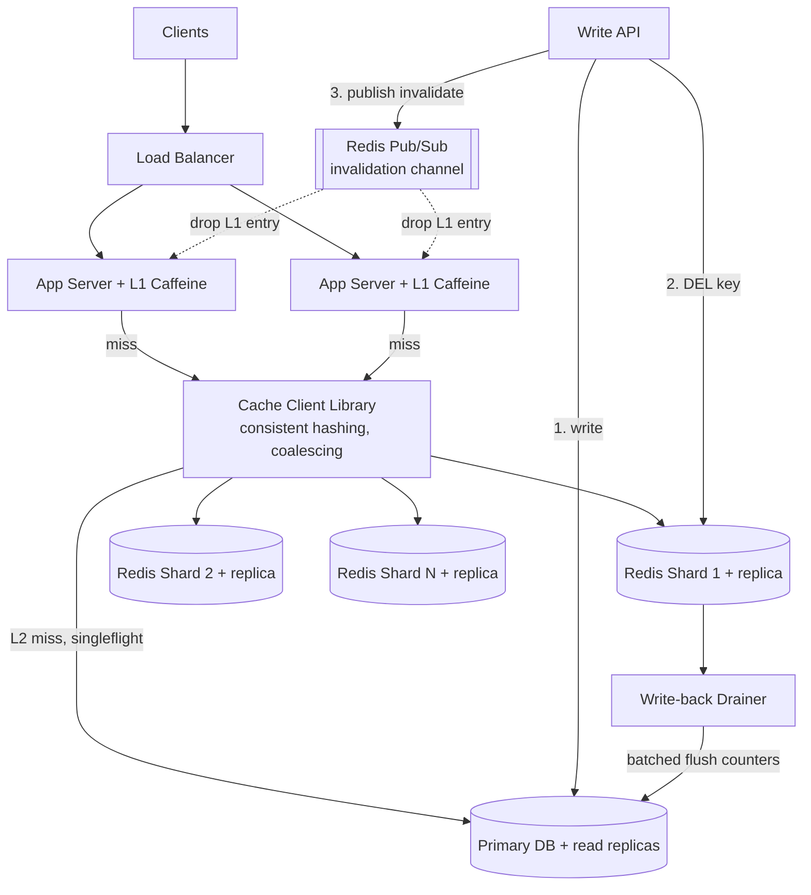
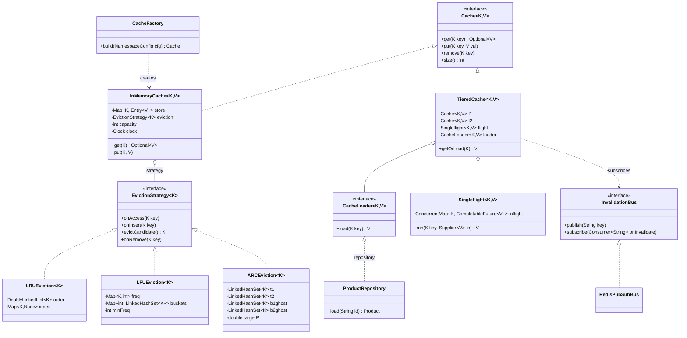

# Caching Strategy System

## 1. Problem Statement & Scope

Design the caching layer for a large read-heavy web platform (think product catalog + user profiles for an e-commerce site). The deliverable is not "add Redis" — it is a coherent caching *strategy*: which write/read policies to use per data class, how eviction works, how we avoid stampedes, how invalidation propagates, and how the cache tiers compose.

### Functional Requirements
- Serve reads for hot entities (products, profiles, sessions, rendered fragments) with p99 < 10 ms from cache.
- Support multiple caching patterns per data class: cache-aside, read-through, write-through, write-back, write-around.
- Configurable eviction (LRU / LFU / ARC) and TTL with jitter per namespace.
- Explicit invalidation API (`invalidate(key)`, `invalidate_by_tag(tag)`) for correctness-sensitive data.
- Multi-tier: in-process (L1) → distributed cache cluster (L2) → database (source of truth).
- Stampede protection: at most ~1 origin fetch per key per expiry event, cluster-wide.

### Non-Functional Requirements
- Cache hit ratio ≥ 95% for the hot working set; DB must survive a full cache flush (degraded but alive).
- Availability: cache cluster loss must not cause an outage, only elevated latency (cache is an optimization, not a dependency for correctness).
- Staleness budget: product prices ≤ 5 s stale; product descriptions ≤ 10 min; inventory counts must never be served from cache for the checkout path.
- Horizontal scalability of the cache tier without full rehash storms (consistent hashing).

### Back-of-Envelope Estimation
- 50 M DAU, average 40 page views/day → 2 B page views/day.
- Each page fans out to ~20 entity reads → 40 B entity reads/day.
- 40 B / 86,400 s ≈ 463 K reads/s average; peak = 3× average ≈ **1.4 M reads/s**.
- Write rate (catalog updates, profile edits): ~2% of reads → ~28 K writes/s peak.
- Object size: avg 2 KB serialized. Hot working set: 200 M distinct hot keys × 2 KB = **400 GB** → fits in a cluster of ~15 nodes × 32 GB usable (with replication ×2 → ~30 nodes) or fewer bigger nodes.
- Bandwidth at cache tier: 1.4 M reads/s × 2 KB = **2.8 GB/s** egress. This alone justifies an L1 in-process tier: if L1 absorbs 60% of reads, L2 egress drops to ~1.1 GB/s.
- DB capacity check: at 95% hit ratio, miss traffic = 5% × 1.4 M = 70 K QPS to the DB — that already requires read replicas. At 90% hit ratio it doubles to 140 K QPS. **Every point of hit ratio matters**; this is the argument you make numerically in the interview.

## 2. Brute-Force / Naive Design

Single app server, single PostgreSQL, no cache:

```
Client → App Server → PostgreSQL
```

Why it breaks, with numbers:
- A tuned Postgres box does ~10–50 K simple indexed reads/s. Peak demand is 1.4 M reads/s → you need ~30–100× the capacity of one box on the read path alone.
- p99 latency: even a fast indexed lookup is 1–5 ms under light load; under connection saturation (Postgres degrades badly past a few hundred active connections) p99 blows past 100 ms.
- Naive fix #1 — read replicas: 1.4 M QPS / 30 K per replica ≈ 47 replicas, plus replication lag issues, plus you're paying database prices for what is mostly repeated reads of the same 200 M hot rows. 40 B reads/day over 200 M hot keys means the average hot key is read **200 times/day** — redundant work screaming to be cached.
- Naive fix #2 — one global in-process dict per app server: no bound on memory (OOM), no coherence across servers (server A shows the old price, server B the new), cold caches on every deploy (deploy = self-inflicted stampede on the DB).

## 3. Evolving the Design

**Step 1 — Bottleneck: repeated identical reads hammer the DB.**
Fix: add a distributed cache (Redis cluster) with **cache-aside**: app checks cache, on miss reads DB and populates cache with TTL. Chosen first because it's the least invasive: no change to the write path, cache failure degrades to plain DB reads. Hit ratio ~90%+ immediately for Zipfian access patterns.

**Step 2 — Bottleneck: staleness after writes.**
Cache-aside + TTL alone means up to TTL-seconds of staleness. Fix: on write, **invalidate (delete) the cache key** rather than updating it. Delete-not-update because two concurrent writers updating the cache can interleave and leave the *older* value cached forever; a delete converges via the next read. Order: write DB first, then delete cache ("write-then-invalidate"). The residual race (reader loads old value between DB write and delete) is narrowed with a short delayed second delete ("double delete") or accepted within the staleness budget.

**Step 3 — Bottleneck: hot key expiry causes a stampede.**
When a key read 10 K times/s expires, thousands of concurrent misses all hit the DB ("cache stampede"; correlated expiry of many keys = "thundering herd"). Fixes, layered: (a) **TTL jitter** — `ttl = base × uniform(0.9, 1.1)` so keys populated together don't expire together; (b) **per-key mutex / request coalescing** — only one caller per key rebuilds, others wait or serve stale; (c) **probabilistic early expiry (XFetch)** — hot readers refresh *before* expiry with probability increasing near the deadline, so the herd never forms. Details in §7.

**Step 4 — Bottleneck: network round-trip to Redis (0.3–1 ms) × 20 keys/page adds up; Redis egress bandwidth.**
Fix: **L1 in-process cache** (Caffeine/Guava-style, ~1 GB per app server, short TTL 1–5 s) in front of L2 Redis. L1 hits cost ~100 ns. Coherence: L1 entries are short-TTL only, plus an **invalidation pub/sub channel** (Redis pub/sub or Kafka) that app servers subscribe to; on invalidate, every server drops its L1 entry. Accept that L1 gives bounded (seconds) staleness — that's why checkout-path inventory bypasses L1 entirely.

**Step 5 — Bottleneck: single Redis node caps at ~100 K–1 M ops/s and 400 GB doesn't fit.**
Fix: shard by key with **consistent hashing** (Redis Cluster's 16,384 hash slots). Adding a node moves only ~1/N of slots — no global rehash storm. Replicate each shard (1 replica) for failover; reads stay on primaries to avoid replica-lag surprises unless we explicitly opt into stale reads.

**Step 6 — Bottleneck: heavy-write, read-later data (view counters, like counts) makes write-through wasteful and DB-write-bound.**
Fix: **write-back (write-behind)** for tolerant data: increment in Redis, flush batched deltas to DB every few seconds via a drainer. Accept bounded data loss on cache node crash (mitigate with AOF persistence / replication) — acceptable for counters, never for orders.

**Step 7 — Bottleneck: bulk imports / analytics writes pollute the cache with never-read keys, evicting hot ones.**
Fix: **write-around** for those paths — write straight to DB, don't populate cache; the rare subsequent read misses once and cache-asides it in.

End state: pattern-per-data-class, two tiers, sharded L2, stampede protection, pub/sub invalidation.

## 4. Protocol & Technology Choices — Why This, Not That

### Redis vs Memcached (L2 distributed cache)

| Dimension | Redis (chosen) | Memcached |
|---|---|---|
| Data structures | Hashes, sorted sets, sets, streams — enables counters, leaderboards, coalescing locks (`SET NX PX`) | Strings/blobs only |
| Threading | Single-threaded core (I/O threads ≥6.0); predictable latency | Multithreaded; better raw throughput per node for flat GET/SET |
| Persistence / replication | RDB/AOF, replicas, Cluster mode, failover | None built in (client-side sharding only) |
| Pub/sub | Yes — powers L1 invalidation channel | No |
| Memory efficiency | Slightly worse per byte (structure overhead) | Slab allocator, very efficient for uniform small values |
| Eviction | 8 policies incl. `allkeys-lru`, `allkeys-lfu` | LRU per slab class |

**Why Redis:** we need `SET NX` locks for stampede control, pub/sub for L1 invalidation, atomic `INCR` for write-back counters, and replication for shard failover. **When Memcached wins:** pure ephemeral blob cache with a multithreaded hot box and maximum GET/SET throughput per dollar, no need for durability or structures (Facebook's classic mcrouter deployment).

### Cache-aside vs Read-through vs Write-through vs Write-back vs Write-around

| Pattern | Read path | Write path | Staleness | Failure blast radius | Use for |
|---|---|---|---|---|---|
| Cache-aside (default) | App: cache → miss → DB → populate | App: DB write → cache delete | Bounded by TTL + invalidate | Cache down ⇒ DB pressure only | Most entities |
| Read-through | Cache library/proxy loads on miss | Same as aside typically | Same | Loader is a new SPOF/complexity | Uniform loading logic, DAX-style |
| Write-through | Cache always warm | Write cache + DB synchronously | ~0 for cached keys | Write latency = max(cache, DB); double-write consistency | Read-after-write critical, moderate write rate |
| Write-back | Cache is freshest | Write cache, async flush to DB | DB is stale, cache fresh | **Data loss** window on cache crash | Counters, metrics, tolerant aggregates |
| Write-around | Miss on first read | DB only | First read is a miss | None extra | Bulk loads, write-once-read-rarely |

**Why cache-aside as default:** simplest failure semantics — the cache is strictly an optimization; every alternative couples writes or reads to cache availability. **When write-through wins:** strong read-after-write on the same key with modest write volume. **When write-back wins:** write rate ≫ DB write capacity and loss of a few seconds of deltas is acceptable.

### Eviction: LRU vs LFU vs ARC

| Policy | Mechanism | Strength | Weakness | When it wins |
|---|---|---|---|---|
| LRU | Evict least-recently-used; O(1) with hashmap + doubly linked list | Simple, great for temporal locality | One sequential scan flushes the whole cache | General default; recency-dominated traffic |
| LFU | Evict least-frequently-used (Redis: 8-bit log counter + decay) | Protects perennially hot keys from scan pollution | New keys die young without aging; more bookkeeping | Stable popularity distribution (top-N products) |
| ARC | Two LRU lists (recent T1, frequent T2) + ghost lists (B1/B2) self-tune the split | Adapts between recency and frequency automatically, scan-resistant | Patented history (IBM; expired 2024-ish), ~2× metadata, rarely off-the-shelf | Mixed/shifting workloads; ZFS uses it |
| TinyLFU/W-TinyLFU (mention) | Frequency sketch admission filter in front of LRU | Best hit ratios in practice (Caffeine's default) | Complexity | L1 in-process caches |

**Choice:** Redis `allkeys-lfu` for the catalog namespace (stable Zipfian popularity), `allkeys-lru` for sessions (pure recency); Caffeine/W-TinyLFU for L1.

### L1 invalidation transport: Redis pub/sub vs Kafka

| | Redis pub/sub (chosen) | Kafka |
|---|---|---|
| Delivery | Fire-and-forget, at-most-once | Durable, replayable, at-least-once |
| Latency | Sub-ms | ms–tens of ms |
| Miss consequence | L1 serves stale until its short TTL (≤5 s) expires — acceptable | Guaranteed delivery but heavier |

**Why pub/sub:** the short L1 TTL is the correctness backstop, so lost invalidations self-heal within seconds; we buy simplicity and latency. **Kafka wins** when invalidations must be durable/audited or drive downstream materialized views (then it's a CDC pipeline, not a cache ping).

### Serialization: JSON vs Protobuf

| | JSON | Protobuf (chosen for hot namespaces) |
|---|---|---|
| Size | 2 KB avg | ~0.8–1.2 KB (40–60% smaller) → directly cuts the 2.8 GB/s egress |
| CPU | Slower parse | Fast, schema-checked |
| Debuggability | `redis-cli GET` readable | Needs tooling |

## 5. High-Level Design (HLD)



### Read Path (product page, key `prod:{id}:v3`)
1. App checks L1 (Caffeine, TTL 2 s + jitter). Hit → return (~100 ns). Expected 60% of reads.
2. L1 miss → cache client hashes key to shard, `GET` from Redis. Hit → deserialize, populate L1, return (~0.5 ms). Expected ~37% of reads.
3. L2 miss → **singleflight**: acquire per-key in-process latch and cluster lock `SET lock:{key} {token} NX PX 3000`. Winner queries DB, `SET key val EX ttl±jitter`, releases lock, returns. Losers wait on the latch (bounded 50 ms) then re-read cache; on timeout, serve stale-if-available or go to DB with a concurrency cap.
4. Near-expiry hits may trigger probabilistic early refresh (§7) — refresh happens async, the caller still gets the cached value.

### Write Path (price update)
1. Write to DB (transactional, source of truth).
2. In the same request path: `DEL prod:{id}:v3` on L2; publish `{key}` on the invalidation channel → all app servers evict L1.
3. Schedule a delayed re-delete (+500 ms) to close the read-modify race window.
4. For counters (write-back namespace): `HINCRBY` in Redis only; drainer flushes deltas to DB every 5 s with idempotent upserts.

### Data Model / Key Schema
```
prod:{product_id}:v{schema_ver}     -> protobuf blob, TTL 600s ±10%, LFU namespace
price:{product_id}                  -> string, TTL 5s ±10%   (tight staleness budget)
sess:{session_id}                   -> hash, TTL 1800s, LRU namespace, sliding
cnt:views:{product_id}              -> int, write-back, no TTL (drainer-owned)
tag:{tag} -> SET of keys            (tag-based invalidation index)
lock:{key} -> owner token, PX 3000  (stampede lock)
```
Schema version in the key = free "invalidation" on deploys that change the serialized shape (old keys age out; no poisoned deserialization).

### API (cache client library)
```
get(ns, key) -> Optional<V>
getOrLoad(ns, key, loader, ttl) -> V        // coalesced, stampede-safe
put(ns, key, v, ttl)
invalidate(ns, key)                          // L2 DEL + pub/sub broadcast
invalidateByTag(tag)                         // fan-out DEL over tag set
increment(ns, key, delta)                    // write-back namespace only
```

## 6. Low-Level Design (LLD)

Patterns used: **Strategy** (pluggable eviction), **Template Method / Decorator** (tiered cache composing L1 over L2), **Repository** (loader abstraction over DB), **Singleton-per-namespace Factory** (CacheFactory builds configured instances), **Singleflight** (request coalescing).



Why these patterns: **Strategy** lets one `InMemoryCache` host LRU/LFU/ARC without subclass explosion and makes eviction unit-testable in isolation; **Repository** keeps the cache ignorant of SQL so loaders are mockable; **Factory** centralizes per-namespace config (capacity, TTL, jitter, eviction) so product code can't misconfigure; **Singleflight** is the coalescing primitive reused by both tiers.

### Hardest algorithm 1 — O(1) LRU cache (the classic machine-coding ask)
```java
class LRUCache<K, V> {
    private final int capacity;
    private final Map<K, Node<K, V>> map = new HashMap<>();
    private final Node<K, V> head = new Node<>(null, null); // MRU sentinel
    private final Node<K, V> tail = new Node<>(null, null); // LRU sentinel

    LRUCache(int capacity) {
        this.capacity = capacity;
        head.next = tail; tail.prev = head;
    }

    synchronized V get(K key) {
        Node<K, V> n = map.get(key);
        if (n == null) return null;
        unlink(n); linkFront(n);            // move-to-front on access
        return n.val;
    }

    synchronized void put(K key, V val) {
        Node<K, V> n = map.get(key);
        if (n != null) { n.val = val; unlink(n); linkFront(n); return; }
        if (map.size() == capacity) {       // evict from tail
            Node<K, V> lru = tail.prev;
            unlink(lru); map.remove(lru.key);
        }
        n = new Node<>(key, val);
        map.put(key, n); linkFront(n);
    }

    private void unlink(Node<K, V> n) { n.prev.next = n.next; n.next.prev = n.prev; }
    private void linkFront(Node<K, V> n) {
        n.next = head.next; n.prev = head;
        head.next.prev = n; head.next = n;
    }
    static final class Node<K, V> {
        K key; V val; Node<K, V> prev, next;
        Node(K k, V v) { key = k; val = v; }
    }
}
```
Interview notes: both ops O(1); sentinels remove null-edge cases; `synchronized` is fine for L1 per-segment — production caches (Caffeine) use lock-free reads + striped write buffers instead of a global lock.

### Hardest algorithm 2 — Singleflight + probabilistic early expiry
```java
V getOrLoad(K key) {
    Entry<V> e = l1.getEntry(key);
    if (e != null && !e.expired(clock)) {
        // XFetch: refresh early with prob rising near expiry
        // refresh if: now - delta * beta * ln(rand()) >= expiry
        double delta = e.lastLoadMillis;          // observed recompute cost
        if (clock.now() - delta * BETA * Math.log(rng.nextDouble()) >= e.expiry) {
            asyncRefresh(key);                    // caller still gets cached value
        }
        return e.value;
    }
    return flight.run(key, () -> {                // one loader per key per process
        V v2 = l2get(key);
        if (v2 != null) { l1.put(key, v2); return v2; }
        String token = UUID.randomUUID().toString();
        boolean won = redis.set("lock:" + key, token, "NX", "PX", 3000);
        if (!won) {
            V v = pollL2(key, 50 /*ms*/);          // wait for winner's SET
            if (v != null) return v;
            if (e != null) return e.value;         // serve stale as last resort
        }
        long t0 = clock.now();
        V fresh = loader.load(key);                // repository → DB
        long cost = clock.now() - t0;
        l2setWithJitter(key, fresh, baseTtl, cost);
        releaseIfOwner("lock:" + key, token);      // Lua: GET==token then DEL
        l1.put(key, fresh);
        return fresh;
    });
}
```
Note `BETA = 1.0` default; log of uniform(0,1] is negative, so the term pulls "now" forward — hotter keys sample more often and almost surely refresh before expiry, cold keys rarely pay early refresh. Lock release must be compare-and-delete (Lua script) so a slow winner can't delete a successor's lock.

## 7. Deep Dives & Failure Modes

**Consistency model.** This design is deliberately eventually consistent with bounded staleness: DB-write → L2 delete → pub/sub L1 evict. Windows of staleness: (a) between DB commit and DEL (~ms), (b) the read-repopulate race (a reader read the old DB value pre-commit and SETs it post-DEL) — closed by delayed double-delete or CDC-driven invalidation (Debezium reading the binlog and issuing deletes — removes the "app forgot to invalidate" class entirely), (c) lost pub/sub message — bounded by L1's ≤5 s TTL. Anything needing linearizability (inventory decrement at checkout) bypasses cache and hits the DB with `SELECT ... FOR UPDATE` or a Redis-atomic reservation.

**Cache stampede vs thundering herd (name the difference).** Stampede = many concurrent misses on *one* key (hot key expired). Herd = many keys/clients synchronized (mass expiry after deploy, cache flush, or every client retrying on the same timer). Defenses map accordingly: per-key locks/coalescing and XFetch for stampede; TTL jitter, warm-up scripts on deploy, and retry-with-jitter for herd. Also "stale-while-revalidate": serve the expired value for a grace window while one refresher runs — best p99 protection of all, if staleness budget allows.

**Hot keys.** A celebrity product can push one Redis shard past its ops ceiling while others idle. Detect: per-key hit counters via client-side sampling or `redis-cli --hotkeys`. Mitigate: (1) L1 absorbs most hot-key reads (this is the single best fix — the hotter the key, the higher its L1 hit ratio); (2) key replication: write `key#0..key#9` to 10 shards, readers pick a random suffix — trades 10× memory and 10× invalidation fan-out for 10× read capacity; (3) for hot *write* keys (counters), shard the counter and sum on read.

**Big keys.** A 5 MB serialized object at 1 K reads/s = 5 GB/s from one shard and blocks Redis's single thread during serialization. Enforce a max value size (e.g., 100 KB) in the client library; split or compress above it.

**Cache penetration** (queries for keys that don't exist — attacker or bug — every one a guaranteed DB hit). Fix: cache negative results (`"NULL"` sentinel, short TTL 30 s) and/or a Bloom filter of valid IDs in front of the DB path; reject non-members without touching the DB. Trade-off: Bloom false positives (~1%) still pass through; deletions need a counting filter or periodic rebuild.

**Idempotency & retries.** Cache ops are naturally idempotent (SET/DEL), so client retries are safe. The dangerous retry is the *loader*: on lock-acquire timeout, losers must not stampede the DB — cap loader concurrency with a semaphore (e.g., ≤ 2× shard count) and prefer serving stale. Write-back drainer must flush idempotently: store deltas with a flush epoch, upsert `SET count = count + :delta WHERE epoch < :e` semantics, so a crash-and-retry doesn't double-count.

**Backpressure.** If DB latency rises, misses queue behind singleflight latches; bound the wait (50 ms) and the inflight map size. If Redis latency rises, the client circuit-breaks per shard (rolling error rate > 50% → open for 5 s) and falls through to DB *with a concurrency limiter* — a fallen-open circuit without a limiter converts a cache brownout into a DB outage.

**Failure walk-through by component:**
- **One Redis shard dies:** replica promoted in ~1–2 s (Cluster failover). During the window, that shard's keys miss → coalesced DB reads, limiter caps damage. Data loss on that shard = fine (cache) except write-back counters → run write-back namespaces with `appendfsync everysec` AOF + replica; worst case lose ≤1 s of deltas.
- **Whole cache cluster dies (cold start):** the scariest scenario. Full miss traffic = 1.4 M QPS at the DB → certain outage without protection. Mitigations: DB-side global concurrency limit + load shedding (serve degraded pages), cache warmer that replays the top-N key list (kept as a periodically snapshotted key-frequency log), and gradual traffic ramp via LB. State in the interview: "the system must be *provisioned* so the DB survives at max shed rate, not at full traffic."
- **Pub/sub gap (network partition):** L1s serve ≤5 s stale; correctness backstop is L1 TTL. Monitor invalidation-channel lag/subscriber count.
- **App server deploy:** L1s start cold → transient 60%-of-traffic shift to L2 (sized for it: L2 must handle 100% of read traffic on its own). Rolling deploys keep the aggregate L1 hit ratio smooth.
- **Clock skew:** TTLs are server-side in Redis (safe); L1 uses monotonic clock for expiry, never wall clock.
- **Poisoned cache entry (bad deploy wrote garbage):** schema version in key namespace lets you bump `v3 → v4` and abandon the poisoned generation instantly — O(1) "flush" without touching Redis.

**Metrics that must exist:** hit ratio per namespace per tier, p99 per tier, eviction rate vs insert rate (eviction ≫ insert churn = capacity problem), lock contention count, stale-served count, invalidation channel lag, top-K hot keys.

## 8. Trade-off Summary & Interview Soundbites

| Decision | Trade-off accepted |
|---|---|
| Cache-aside as default | Extra app-side logic + first-miss latency, for the cleanest failure isolation |
| Delete-on-write, not update-on-write | One extra miss per write, to eliminate concurrent-writer stale-forever bug |
| L1 with 2–5 s TTL + pub/sub | Bounded seconds of staleness, for ~60% traffic offload and ns latency |
| TTL jitter everywhere | Slightly unpredictable expiry, kills synchronized mass expiry |
| Singleflight + distributed lock + serve-stale | Added latency/complexity on miss path, for DB protection at expiry |
| LFU for catalog, LRU for sessions | Per-namespace tuning burden, for hit-ratio gains matched to access pattern |
| Write-back for counters only | Bounded loss window on crash, for 100× DB write reduction |
| Redis over Memcached | Some throughput/memory efficiency, for structures, locks, pub/sub, replication |
| Negative caching + Bloom filter | Memory + false positives, to defeat penetration attacks |

**Soundbites:**
1. "The cache is an optimization, never a dependency — every failure mode must degrade to the database plus a load shedder, not to an outage."
2. "On writes I delete the cache key rather than update it: concurrent updates can interleave and pin a stale value forever; a delete always converges."
3. "At 95% hit ratio the DB sees 70 K QPS; at 90% it sees 140 K — each point of hit ratio is a fleet of database replicas."
4. "Jitter breaks herds, coalescing breaks stampedes, and stale-while-revalidate makes both invisible to p99."
5. "The hotter the key, the better L1 handles it — in-process caching is the only hot-key fix that gets *stronger* as the key gets hotter."
6. "L1's short TTL is the correctness backstop, so the invalidation bus can be fast and lossy instead of durable and slow."
7. "Schema version in the key is a free O(1) cache flush."

**Common follow-ups:**
- *"Why not write-through everywhere?"* Couples every write's latency and availability to the cache, and warms keys nobody reads; reserve it for strict read-after-write namespaces.
- *"How do you invalidate a list/page cache when one item changes?"* Tag-based invalidation: maintain `tag:{product_id} → {page keys}`, DEL the set members; or version the item and embed versions in the page key.
- *"TTL vs explicit invalidation?"* Both: explicit invalidation for correctness on known write paths, TTL as the safety net for the write paths you forgot.
- *"Redis Cluster vs client-side sharding vs proxy (Twemproxy/Envoy)?"* Cluster for built-in failover and slot migration; proxy when clients are polyglot and you want thin clients; client-side when you need per-key routing tricks (hot-key replication).
- *"How would CDC-based invalidation work?"* Debezium tails the DB binlog, an invalidator service maps table rows → cache keys and issues DELs; removes reliance on app code remembering to invalidate, at the cost of an async pipeline (~100 ms lag).
- *"What breaks first at 10× traffic?"* L2 egress bandwidth and hot shards — answer: raise L1 TTL/size, protobuf compression, hot-key replication, and more shards via slot rebalancing.
