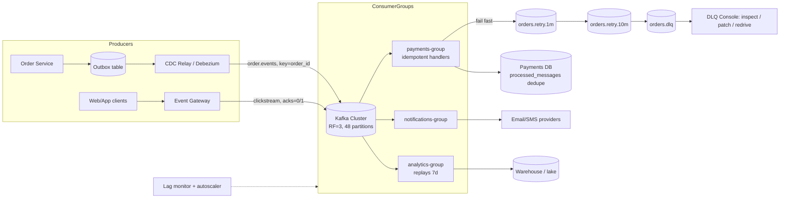
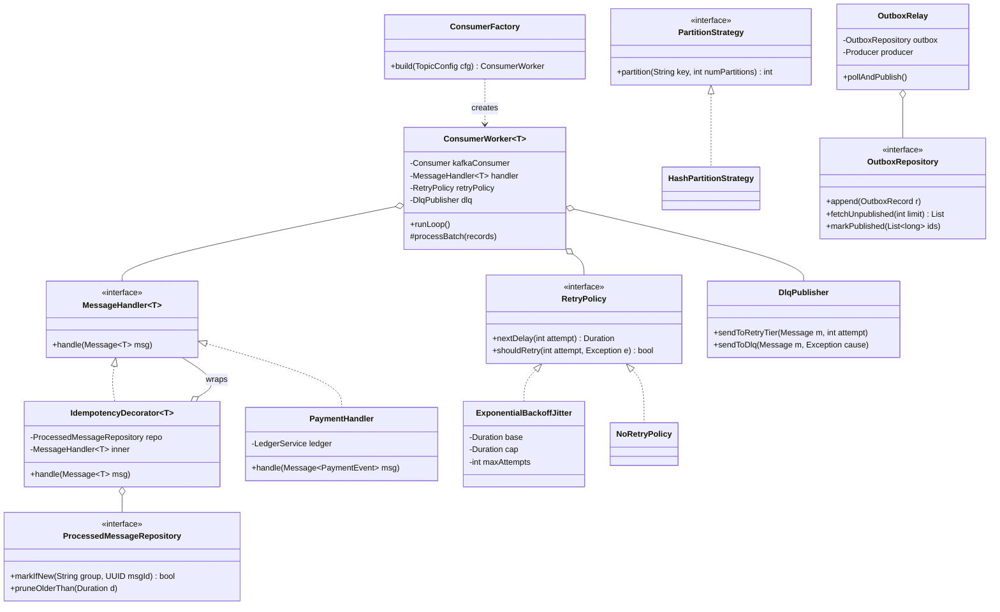

# Message Queue Architecture

## 1. Problem Statement & Scope

Design the asynchronous messaging backbone for a large platform (order processing + notifications + analytics events for an e-commerce site). Goal: decouple producers from consumers, absorb bursts, guarantee delivery semantics per use case, preserve ordering where required, and keep consumers correct under retries and failures.

### Functional Requirements
- Produce/consume messages across independent services; producers never block on consumer availability.
- Per-use-case delivery semantics: at-least-once for order events (with idempotent consumers ⇒ effectively-once), at-most-once acceptable for metrics, exactly-once *processing* for payment ledger updates.
- Ordering: per-entity ordering (all events for order #123 in order); no global ordering requirement.
- Consumer groups: N instances of a service share a stream's load; multiple independent services each get the full stream (fan-out).
- Replay: analytics can re-read the last 7 days.
- Retry with exponential backoff; poison messages routed to a Dead Letter Queue (DLQ) with tooling for inspection and redrive.
- Backpressure: slow consumers must not crash the broker or lose data.

### Non-Functional Requirements
- Throughput: sustain peak event rate with ≤ p99 200 ms produce latency; end-to-end lag SLO < 5 s for order pipeline, < 5 min for analytics.
- Durability: acknowledged messages survive loss of any single broker (RF=3, no data loss on 1-node failure).
- Availability: 99.95% produce availability (order placement must not fail because a downstream is slow).
- Retention: 7 days on the main log; DLQ 14 days.

### Back-of-Envelope Estimation
- 50 M DAU; 10 M orders/day; each order emits ~20 events through its lifecycle (created, paid, packed, shipped, …) → 200 M order events/day.
- Clickstream/analytics: 2 B page views/day × 3 events = 6 B events/day.
- Total ≈ 6.2 B events/day / 86,400 ≈ 72 K msg/s average; peak 3× ≈ **215 K msg/s**.
- Avg message 1 KB → peak ingress ≈ **215 MB/s**; with RF=3, broker disk write ≈ 645 MB/s across the cluster — trivially handled by ~9–12 brokers doing sequential I/O (~100+ MB/s each even on modest disks; NVMe makes this laughable).
- Storage: 6.2 B × 1 KB × 7 days × 3 replicas ≈ **130 TB** cluster-wide → ~11 TB/broker on 12 brokers. Fine.
- Partitions: order topic at peak 3× (200 M/86,400) ≈ 7 K msg/s; a single Kafka partition comfortably does 5–20 K msg/s, but consumer processing (say 200 msg/s per consumer thread due to DB writes) dominates: 7,000 / 200 = 35 → provision **48 partitions** (headroom + divisibility).

## 2. Brute-Force / Naive Design

Naive #1 — synchronous HTTP chaining: order service calls payment, then inventory, then email, in-line.
- Availability math: 4 services at 99.9% each ⇒ 0.999⁴ ≈ 99.6% — order placement now fails when the *email* service hiccups.
- Latency: sum of downstream p99s; one slow dependency (email provider at 2 s) makes checkout 2 s.
- Bursts: flash sale at 10× normal rate has nowhere to queue; everything times out simultaneously.

Naive #2 — a database table as a queue (`SELECT ... WHERE status='pending' FOR UPDATE SKIP LOCKED`):
- Works to ~1–5 K msg/s, then dies: polling load, table/index bloat from churn (every message = insert + update + delete ⇒ vacuum storm in Postgres), lock contention among consumers.
- At 215 K msg/s you'd be doing ~600 K row operations/s on a hot table plus index maintenance — 2 orders of magnitude past comfortable.
- No fan-out (multiple independent consumer services need duplicated rows), no replay without keeping everything, no ordering guarantees under SKIP LOCKED.
- Legit at small scale — and it *is* the right building block for the outbox pattern (§7) — but not the backbone.

## 3. Evolving the Design

**Step 1 — Bottleneck: synchronous coupling.** Introduce a broker: producers publish `order.events`, consumers subscribe. Order placement now depends only on broker availability (one 99.99% dependency instead of four 99.9% ones). Burst absorption: the queue depth grows during the flash sale; consumers drain it after.

**Step 2 — Bottleneck: one consumer can't keep up.** Consumer processing (200 msg/s each, DB-bound) < peak 7 K msg/s. Fix: **partitions + consumer groups**. Topic split into 48 partitions; the group protocol assigns each partition to exactly one consumer in the group. Scale consumers up to 48 (one per partition — the hard parallelism ceiling; more consumers sit idle). Key insight to state: *partition count is chosen from consumer throughput, not broker throughput*.

**Step 3 — Bottleneck: ordering broke when we parallelized.** Two events for order #123 processed by different consumers can commit out of order (shipped before paid). Fix: **partition by entity key** — `partition = hash(order_id) % 48`. All events for one order land in one partition ⇒ consumed by one consumer, in log order. Trade-off accepted: a hot key (one order can't be hot, but a hot *merchant* key could be) skews a partition; and increasing partition count later re-maps keys (breaks ordering during transition) — so over-provision partitions up front.

**Step 4 — Bottleneck: duplicate deliveries corrupt state.** At-least-once delivery means redelivery after consumer crash between "processed" and "committed offset". Fix: **idempotent consumers** — dedupe on a message/business key (§7), not attempts to make the network exactly-once. State the law: *in a distributed system you pick at-most-once or at-least-once on the wire; exactly-once is an end-to-end property built from at-least-once + idempotency (or transactions)*.

**Step 5 — Bottleneck: lost messages at the source.** Service writes DB then publishes; crash between the two loses the event (or publish-then-write creates events for rolled-back transactions). Fix: **transactional outbox** — write the event to an `outbox` table in the same DB transaction as the state change; a relay (poller or CDC/Debezium) publishes it and marks it sent. At-least-once from the outbox + idempotent consumers = end-to-end effectively-once.

**Step 6 — Bottleneck: poison messages block partitions.** One malformed message that always throws will, with naive blocking retry, halt its partition forever (head-of-line blocking). Fix: bounded in-process retries with exponential backoff + jitter → then publish to **retry topics** (`orders.retry.1m`, `orders.retry.10m`) with delayed consumption → after N total attempts, to **DLQ** with full error metadata. Partition keeps flowing; humans/automation redrive the DLQ.

**Step 7 — Bottleneck: slow consumer during incident, queue grows unbounded?** With log-based Kafka, backlog is bounded by retention (disk), not memory — the broker doesn't care about lag; consumers **pull** at their own pace (natural backpressure). Add lag-based autoscaling (scale consumer group on `consumer_lag` metric) and producer-side load shedding for the analytics tier only (drop sampled clickstream before dropping order events).

**Step 8 — Bottleneck: rebalance storms.** Every consumer join/leave triggers partition reassignment; with eager rebalancing the whole group stops (stop-the-world). Fix: cooperative incremental rebalancing (`CooperativeStickyAssignor`), static group membership (`group.instance.id`) so a pod restart doesn't trigger reassignment, and tuned `max.poll.interval.ms` so slow batches aren't mistaken for dead consumers.

## 4. Protocol & Technology Choices — Why This, Not That

### Kafka vs RabbitMQ vs SQS vs Pulsar (the core table)

| Dimension | Kafka (chosen for backbone) | RabbitMQ | SQS (+SNS) | Pulsar |
|---|---|---|---|---|
| Model | Distributed, partitioned, replicated **log**; consumers track offsets | **Smart broker**: exchanges/bindings route to queues; broker tracks per-message acks | Fully managed queue; visibility-timeout redelivery | Log like Kafka, but **compute (brokers) separated from storage (BookKeeper)** |
| Throughput | Millions msg/s; sequential I/O + zero-copy + batching | ~10–50 K msg/s per node typical | High but per-API-call cost; 3K msg/s per FIFO queue (30K batched) | Kafka-class |
| Ordering | Per partition, strong | Per queue (single consumer); weak with competing consumers/requeues | FIFO queues: per MessageGroupId; standard: best-effort | Per key/partition |
| Replay / fan-out | Free: consumers are independent cursors over retained log | No replay — consumed = gone; fan-out via exchange duplication | No replay; fan-out via SNS→multiple SQS | Free, like Kafka; tiered storage native |
| Delayed/priority msgs | Not native (retry-topic pattern) | Native-ish (TTL+DLX plugin, priority queues) | Native delay up to 15 min | Native delayed delivery |
| Routing sophistication | Dumb broker: topic/partition only | Rich: topic/headers/fanout exchanges, per-message routing keys | None (SNS filter policies help) | Moderate |
| Ops burden | Significant (or pay for MSK/Confluent) | Moderate | **Zero** | Highest (brokers + BookKeeper + ZK) |
| Latency | Low ms (batching adds a few ms) | Very low ms end-to-end | 10s of ms + polling | Low ms |

**Why Kafka:** we need replay for analytics, fan-out to many independent consumer services without duplicating data, per-key ordering at 200 K+ msg/s, and 7-day retention — that's precisely the log abstraction. **When RabbitMQ wins:** complex per-message routing (route by header to region-specific queues), task/job queues needing per-message ack + fair dispatch + priorities + low latency at modest scale. **When SQS wins:** small team, AWS-native, no ops appetite, no replay/ordering-at-scale needs — the correct default for 90% of startups; also as a DLQ substrate for Lambda consumers. **When Pulsar wins:** need per-topic multi-tenancy with millions of topics, geo-replication built-in, or elastic storage/compute scaling independently (adding brokers without moving data).

### Delivery semantics — pick per use case

| Semantics | Mechanism | Cost | Use here |
|---|---|---|---|
| At-most-once | Fire-and-forget produce (`acks=0`); commit offset before processing | Loss on any failure | Sampled clickstream metrics |
| At-least-once | `acks=all` + producer retries; commit offset **after** processing | Duplicates on redelivery | Order events (default) |
| Exactly-once (Kafka-internal) | Idempotent producer (PID + seq) + transactions (`read_process_write` atomically, `read_committed` consumers) | Throughput/latency overhead; only covers Kafka→Kafka (streams) | Stream-processing aggregations |
| Effectively-once (end-to-end) | At-least-once + **idempotent consumer** (dedupe key in target store) | Dedupe storage + design discipline | Payment ledger, anything touching external systems |

Key interview line: Kafka's "exactly-once" (EOS) is exactly-once *stream processing within Kafka*; the moment a consumer calls an external API or writes a non-transactional store, you're back to needing idempotency at the sink.

### Offset commit strategy

| Strategy | Behavior on crash | Verdict |
|---|---|---|
| Auto-commit (every 5 s, before processing completes) | Can lose messages (committed-but-unprocessed) *and* duplicate | Never for important data |
| Manual commit after batch processed | Redelivers the in-flight batch → duplicates only | Chosen (with idempotent handlers) |
| Commit per message (sync) | Minimal duplication window | Throughput killer (~1 commit RTT/msg); only for very low volume |
| Store offset in the sink DB transactionally with results | True exactly-once into that DB | Best when sink is a single transactional DB |

### Push vs Pull consumption

| | Pull (Kafka, chosen) | Push (RabbitMQ, webhooks) |
|---|---|---|
| Backpressure | Implicit — consumer polls at its capacity | Broker must track windows (prefetch/QoS); overrun risk |
| Latency | Long-poll makes it near-push | Slightly lower |
| Batching | Natural (fetch.min.bytes) | Harder |

Pull wins for throughput systems; push wins for latency-critical dispatch to many idle consumers.

### Broker replication settings (Kafka specifics worth saying aloud)
`replication.factor=3`, `min.insync.replicas=2`, producer `acks=all`, `enable.idempotence=true`: tolerates one broker loss with zero acknowledged-message loss; a second failure makes the partition unavailable-for-produce rather than silently lossy (CP choice on the write path). `unclean.leader.election=false` — prefer unavailability over data loss.

## 5. High-Level Design (HLD)



### Write Path (produce)
1. Order service commits business change + outbox row in one DB transaction.
2. CDC relay reads the outbox (binlog tail), publishes to `order.events` with `key=order_id`, headers `{message_id (UUID), event_type, schema_version, trace_id}`; marks/watermarks the outbox row. Producer: idempotent, `acks=all`, batches (`linger.ms=5`) with compression (lz4/zstd — 3–5× on JSON).
3. Broker: leader appends to log, waits for ISR quorum (min 2 of 3), acks. Clickstream path skips the outbox and uses `acks=1` — loss-tolerant by contract.

### Read Path (consume)
1. Consumer in group `payments-group` is assigned partitions {0..11} by the group coordinator; polls batches (up to 500 records).
2. For each record: check `processed_messages` for `message_id` → skip if present; else process + insert dedupe row in the same DB transaction.
3. Commit offsets manually after the batch. Crash before commit ⇒ batch redelivered ⇒ dedupe rows absorb it.
4. On handler exception: retry in-process 3× with backoff; still failing → produce to `orders.retry.1m` (with `attempt` header), commit offset, move on — the partition never blocks.

### Data Model
```sql
-- Outbox (in each producing service's DB)
CREATE TABLE outbox (
  id            BIGSERIAL PRIMARY KEY,
  aggregate_id  TEXT NOT NULL,        -- becomes the Kafka key
  event_type    TEXT NOT NULL,
  payload       JSONB NOT NULL,
  headers       JSONB NOT NULL,       -- message_id, trace_id, schema_version
  created_at    TIMESTAMPTZ DEFAULT now()
);
-- Consumer-side dedupe
CREATE TABLE processed_messages (
  consumer_group TEXT,
  message_id     UUID,
  processed_at   TIMESTAMPTZ DEFAULT now(),
  PRIMARY KEY (consumer_group, message_id)
);  -- pruned after 7d (must exceed max redelivery horizon)
```

### Message Envelope (API)
```json
{
  "message_id": "uuid-v7",
  "event_type": "order.paid",
  "schema_version": 3,
  "occurred_at": "2026-08-06T10:15:00Z",
  "trace_id": "…",
  "partition_key": "order_1234",
  "payload": { "order_id": "1234", "amount_cents": 4999, "currency": "USD" }
}
```
Schema managed in a registry (Avro/Protobuf), **backward-compatible evolution enforced at CI**: consumers deploy before producers for new required fields; never renumber/reuse fields.

## 6. Low-Level Design (LLD)

Patterns: **Strategy** (RetryPolicy, PartitionStrategy), **Template Method** (ConsumerWorker skeleton: poll → dedupe → handle → ack), **Decorator** (IdempotencyDecorator, MetricsDecorator wrap MessageHandler), **Repository** (ProcessedMessageRepository, OutboxRepository), **Factory** (ConsumerFactory builds configured pipelines), **Chain of Responsibility** (retry → retry-topic → DLQ escalation).



Why: Decorator keeps idempotency orthogonal to business logic (every handler gets it by construction, none can forget it); Strategy makes backoff policy per-topic config, not code; Repository isolates the dedupe store so it can be Postgres today, Redis-with-TTL tomorrow.

### Hardest algorithm — consumer loop with dedupe, backoff, retry-tiers, DLQ
```java
void runLoop() {
    while (running) {
        ConsumerRecords<String, byte[]> records = consumer.poll(Duration.ofMillis(500));
        for (ConsumerRecord<String, byte[]> rec : records) {
            Message msg = codec.decode(rec);
            int attempt = msg.header("attempt", 0);
            try {
                // markIfNew: INSERT ... ON CONFLICT DO NOTHING; returns rowCount==1
                // Executed INSIDE the same DB tx as the handler's writes.
                tx.run(() -> {
                    if (!processedRepo.markIfNew(groupId, msg.messageId())) return; // dup: skip
                    handler.handle(msg);
                });
            } catch (TransientException e) {
                if (retryPolicy.shouldRetry(attempt, e)) {
                    // full jitter: sleep in [0, min(cap, base * 2^attempt)]
                    long capped = Math.min(capMs, baseMs * (1L << Math.min(attempt, 20)));
                    sleep(ThreadLocalRandom.current().nextLong(capped + 1));
                    dlqPublisher.sendToRetryTier(msg.withAttempt(attempt + 1), attempt + 1);
                } else {
                    dlqPublisher.sendToDlq(msg, e);   // exhausted
                }
            } catch (PermanentException e) {          // e.g. deserialization, validation
                dlqPublisher.sendToDlq(msg, e);       // no retry: it will never succeed
            }
        }
        consumer.commitSync();  // after the whole batch; crash before ⇒ redelivery ⇒ dedupe absorbs
    }
}
```
Interview notes: (1) **full jitter** prevents synchronized retry waves — with plain exponential backoff, 10 K consumers that failed together retry together; (2) classify exceptions — retrying a validation error just burns 6 attempts before the inevitable DLQ; (3) the dedupe insert and the business write share one transaction — that's what upgrades at-least-once to effectively-once; (4) retry *topics* (not in-place sleep) keep `max.poll.interval.ms` honest and the partition unblocked.

### Retry-tier consumption trick
`orders.retry.1m` consumer reads a message, checks `not_before` header; if in the future, it pauses that partition (`consumer.pause()`) until due — giving delay semantics on a log that has none natively.

## 7. Deep Dives & Failure Modes

**Outbox pattern, precisely.** The dual-write problem: `db.commit(); kafka.send();` — crash between them loses the event; reverse order publishes phantom events for rolled-back transactions. Outbox makes the event part of the ACID transaction; the relay is at-least-once (it may re-publish after a crash before marking sent) — which is fine because consumers dedupe on `message_id`. CDC relay (Debezium) beats a poller at scale: no polling load, ordering follows the binlog, latency ~10–100 ms. Poller is simpler and fine to start (index on unpublished, `FOR UPDATE SKIP LOCKED`, batch 500).

**Idempotency taxonomy (say all three):** (1) *natural* — `SET status='shipped'` is idempotent by construction; prefer these; (2) *dedupe table* — generic, exact, needs storage + pruning ≥ redelivery horizon; (3) *version/fencing* — apply event only if `event.version == row.version + 1`; also fixes out-of-order application. For external side effects (charging a card) pass `message_id` as the provider's idempotency key — you can't dedupe someone else's side effects locally.

**Ordering edge cases.** Per-partition ordering breaks when: producer retries with `max.in.flight > 1` without idempotence (batch 2 succeeds, batch 1 retries → reordered — fixed by `enable.idempotence=true` which allows 5 in-flight *with* ordering); a message detours through retry topics (its siblings pass it — mitigate with per-entity version checks in handlers, or park *all* subsequent messages for that key — expensive, usually version-check wins); partition count changes (key→partition mapping shifts; drain-then-switch or over-provision from day one).

**Consumer lag & backpressure.** Lag = latest offset − committed offset, the single most important health metric. Runbook: lag rising + consumer CPU low ⇒ downstream (DB) is the bottleneck — scale that, not consumers. Lag rising + consumers maxed ⇒ scale group (up to partition count). Backlog age approaching retention ⇒ data-loss risk: raise retention now, then fix throughput. Broker itself never buffers in memory per-consumer (log is on disk) — this is why slow consumers are safe in Kafka but dangerous in RabbitMQ (unbounded queue growth in RAM until flow-control kicks in / node falls over).

**Rebalance storms.** Symptom: group loops join/leave, no progress. Causes: processing a batch exceeds `max.poll.interval.ms` (coordinator assumes death — lower `max.poll.records` or raise interval); GC pauses exceed `session.timeout.ms`; flapping pods. Fixes: cooperative-sticky assignor (only moved partitions stop), static membership (restart ≠ leave), health-check-before-join deploys.

**Hot partitions.** `hash(merchant_id)` when one merchant is 30% of traffic ⇒ one partition at 30% of topic load. Fixes: composite key `merchant_id + order_id` when merchant-level ordering isn't actually required (interrogate the ordering requirement — it's usually per-order, not per-merchant); or two-tier topics (whales get a dedicated topic).

**Poison message anatomy.** Distinguish: *transient* (downstream timeout — retry), *permanent* (unparseable — straight to DLQ), *wedged* (handler infinite-loops/OOMs — needs processing timeout wrapper + circuit). DLQ hygiene: alert on DLQ rate (a DLQ nobody watches is a data-loss device with extra steps), store original topic/partition/offset/exception in headers, redrive tool replays to the original topic *with the original message_id* so dedupe still protects double-redrive.

**Thundering herd on recovery.** Downstream DB comes back after 10 min; consumers rip through 10 min of backlog at max speed and knock it over again. Fix: rate-limit consumers (token bucket per instance) at the sink's known safe throughput; drain deliberately, not maximally.

**Failure walkthrough:**
- **Broker dies:** partitions with leaders there fail over to ISR followers (~seconds); producers/consumers retry through metadata refresh; no acked data lost (min.insync=2).
- **Two of three replicas die:** partition rejects produces (`NotEnoughReplicas`) — availability sacrificed for durability; producers buffer/backpressure upstream; order API can degrade to "accepted, processing delayed" (outbox holds events).
- **Consumer instance dies:** its partitions reassigned within session timeout; in-flight uncommitted batch redelivered elsewhere; dedupe absorbs.
- **CDC relay dies:** events accumulate in outbox (durable); relay resumes from binlog position; burst on recovery — producer-side rate cap.
- **Dedupe store dies:** consumers must stop (fail closed) or accept duplicates (fail open) — per-topic policy: payments fail closed, notifications fail open (a rare duplicate email beats no emails).
- **Schema registry down:** producers/consumers use cached schemas — cache with long TTL, registry is not on the hot path.
- **Zombie consumer** (paused by GC, thinks it still owns partition 7, writes to sink after reassignment): fencing — sink writes carry epoch/generation, or rely on dedupe + version checks. This is the subtle one interviewers love.

## 8. Trade-off Summary & Interview Soundbites

| Decision | Trade-off accepted |
|---|---|
| Kafka over SQS/RabbitMQ | Real ops burden, for replay + fan-out + per-key ordering at scale |
| At-least-once + idempotent consumers | Dedupe storage & discipline, instead of chasing wire-level exactly-once |
| Partition by order_id | Hot-key skew risk + fixed parallelism ceiling, for per-entity ordering |
| Outbox + CDC | Extra table + relay component, to kill the dual-write problem |
| Retry topics over in-place blocking retry | Per-key ordering weakened during retries (version checks compensate), to avoid head-of-line blocking |
| acks=all, min.insync=2, no unclean election | Reduced availability under double failure, for zero acked-loss |
| Manual post-batch offset commit | Redelivery duplicates on crash, absorbed by idempotency |
| 48 partitions up front | Idle parallelism early, to avoid key-remapping later |
| Consumer rate limiting at sinks | Slower backlog drain, to prevent recovery herding |

**Soundbites:**
1. "Exactly-once delivery doesn't exist on a network; exactly-once *processing* is at-least-once plus idempotency — I build the latter and stop arguing about the former."
2. "Partition count is set by consumer throughput, not broker throughput — the broker was never the bottleneck."
3. "The outbox pattern makes 'save and publish' atomic by making publish a database write."
4. "A queue is a buffer, and every buffer needs a policy for when it's full: Kafka's answer is disk + retention; make sure yours isn't 'OOM'."
5. "Retry with jitter, or your retries arrive as synchronized waves and become the second outage."
6. "A DLQ without an alert is just a slow /dev/null."
7. "Lag rising with idle CPUs means the bottleneck is downstream — scaling consumers would just aim the firehose better."
8. "Interrogate ordering requirements: 'ordered' almost always means per-entity, and per-entity ordering is nearly free."

**Common follow-ups:**
- *"How do you replay just one customer's events?"* You can't seek by key — replay the time range with a filtering consumer, or maintain a keyed materialized view (compacted topic / event store) alongside.
- *"Compacted topics?"* Retain latest value per key — a changelog for state restoration (consumer groups' `__consumer_offsets` is one); not for event history.
- *"How big can a message be?"* Keep ≤1 MB; for larger payloads use claim-check pattern: blob to S3, pointer in the message.
- *"Kafka without ZooKeeper?"* KRaft mode — metadata quorum inside Kafka; operationally simpler, the modern default.
- *"Priority messages?"* Kafka has no priorities — separate topics per priority class with weighted consumer capacity; if you truly need per-message priority, that's a RabbitMQ-shaped problem.
- *"When would you go back to a DB-table queue?"* Sub-1K msg/s, single consumer service, transactional enqueue wanted for free — it's simpler and correct; graduate when polling load or fan-out needs appear.
