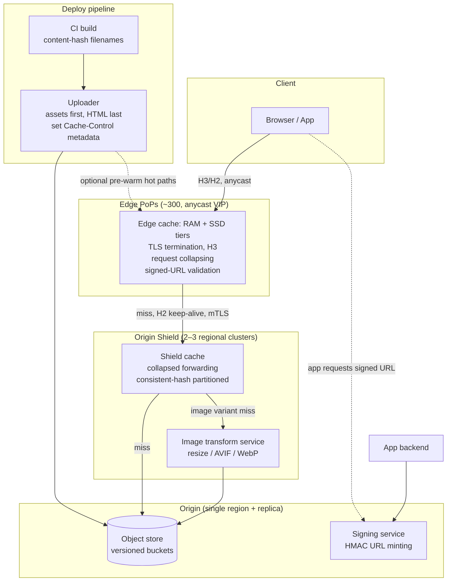
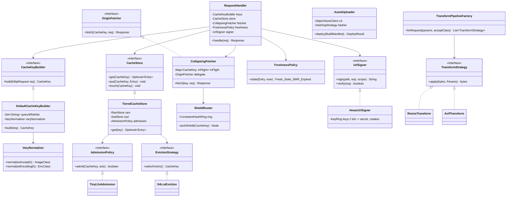

# CDN + Static Asset Delivery Pipeline

## 1. Problem Statement & Scope

Design the static asset delivery system for a large consumer web/mobile product: JS/CSS bundles, images, fonts, video thumbnails, and downloadable files, served globally with low latency, plus the pipeline that gets assets from a build/upload into users' browsers.

### Functional Requirements

- Serve static assets (JS, CSS, images, fonts, media) globally with < 100 ms p95 TTFB from the user's region.
- Support **immutable versioned assets** (build artifacts) and **mutable assets** (user avatars, CMS images) with correct freshness semantics.
- On-the-fly **image optimization**: resize, format negotiation (WebP/AVIF), quality tuning per device.
- **Private content**: serve paid/gated assets only to authorized users (signed URLs / signed cookies).
- **Deploy pipeline**: build → upload to object store → available at edge, with atomic rollout and rollback.
- **Invalidation**: purge or version away stale content within seconds when required.

### Non-Functional Requirements

- **Availability**: 99.99% for asset delivery (assets down = product down; a missing JS bundle is a full outage).
- **Latency**: p50 < 30 ms, p95 < 100 ms TTFB at edge (cache hit); p99 origin-fetch path < 500 ms.
- **Cache hit ratio**: ≥ 95% at edge for versioned assets; ≥ 90% overall including origin shield.
- **Scalability**: absorb 10× flash traffic (product launch, viral event) without origin melting.
- **Cost**: egress from origin is the expensive path; minimize origin fetches.
- **Security**: TLS everywhere, no hot-linking of private content, DDoS absorption at edge.

### Back-of-Envelope Estimation

Assume 100 M DAU web/app product.

**Requests:**
- Page view loads ~60 static requests (bundles, images, fonts). Assume 8 page views/user/day.
- Asset requests/day = 100 M × 8 × 60 = **48 B requests/day**.
- Average QPS = 48 B / 86,400 ≈ **555 K QPS**; peak ×2.5 ≈ **1.4 M QPS** globally.
- At 95% edge hit ratio, misses = 5% → 70 K QPS to mid-tier/shield; with shield absorbing 90% of those, **~7 K QPS to origin** — this is the number that keeps the origin alive.

**Bandwidth:**
- Average asset size ~50 KB (mix of 5 KB icons and 500 KB hero images/bundles).
- Egress = 1.4 M QPS × 50 KB ≈ **70 GB/s ≈ 560 Gbps** peak globally — this is exactly why you need a CDN: no origin cluster serves 560 Gbps economically; edge PoPs each serve a slice near the user.

**Storage:**
- Build artifacts: 200 MB/build × 50 builds/day × 90-day retention ≈ 900 GB — trivial.
- User-generated images: 10 M uploads/day × 2 MB original + 4 derived renditions × 200 KB ≈ 28 TB/day → **~10 PB/year** in object storage. Object store is the system of record; CDN caches are ephemeral.

**Cache footprint at edge:**
- Hot set follows Zipf: ~1% of objects get ~70% of traffic. If catalog is 10 B objects, hot set ≈ 100 M objects × 50 KB = 5 TB — fits in a PoP's SSD tier; RAM tier holds the top ~50 GB.

## 2. Brute-Force / Naive Design

**V0: One origin, no CDN.** Nginx serving files from local disk (or proxying S3), single region (us-east-1), one A record.

```
Browser ──HTTPS──> nginx (us-east-1) ──> local disk / S3
```

### Why it breaks, with numbers

1. **Latency physics.** Sydney → Virginia RTT ≈ 200 ms. TLS 1.3 handshake (1-RTT) + TCP handshake + request = 3 RTTs before first byte ≈ **600 ms TTFB** for every asset. With 60 assets even over HTTP/2 multiplexing, page load is multi-second. No amount of server tuning fixes the speed of light.
2. **Bandwidth wall.** 560 Gbps peak egress. A beefy server pushes ~10–40 Gbps NIC-limited; you'd need dozens of machines just for egress, all in one region, paying premium cloud egress rates ($0.05–0.09/GB → 70 GB/s ≈ **$300K+/day** in raw cloud egress vs ~$0.01–0.02/GB via CDN commit pricing).
3. **Single point of failure.** One region outage = global outage of all pages (JS bundles unreachable).
4. **Flash crowd = death.** A viral event sends 10× traffic straight at the origin; connection table exhaustion, disk IO saturation, cascading failure. No absorption layer.
5. **TCP inefficiency at distance.** Long fat networks: congestion window ramp-up over 200 ms RTT means a 500 KB image takes many RTTs to deliver; short RTT to a nearby edge fixes throughput too, not just TTFB.

Interview line: *"The naive design fails on physics (RTT), economics (egress $), and resilience (single region). CDN solves all three simultaneously: proximity, cheap egress, and a shock absorber."*

## 3. Evolving the Design

**Step 1 — Bottleneck: global latency → Fix: put a CDN in front (pull model).**
Point `static.example.com` at a CDN. Edge PoPs cache on first request (cache miss → fetch from origin → store → serve). TTFB drops from 600 ms to ~20 ms for hits. Origin QPS drops by (1 − hit ratio).

**Step 2 — Bottleneck: origin still hammered on misses from 300 PoPs → Fix: origin shield (mid-tier cache).**
Each of ~300 PoPs independently misses and fetches the same object → origin sees up to 300 fetches per object per TTL. Insert a **shield tier**: designate 1–3 regional cache clusters that all PoPs fetch through. Origin now sees ≈ 1 fetch per object per TTL per shield. Origin fetch rate drops from 70 K QPS to ~7 K QPS. This is the classic **cache hierarchy**: browser → edge PoP → regional/shield → origin.

**Step 3 — Bottleneck: stale content after deploys → Fix: content-hashed immutable URLs, not purges.**
Deploys must be instant and atomic. Instead of purging `app.js`, emit `app.3f9a1c.js` with `Cache-Control: public, max-age=31536000, immutable`. New HTML references new hashes. Old and new versions coexist → zero-downtime deploy, instant rollback (re-point HTML), and edge hit ratio stays high because nothing is ever invalidated. Purge APIs remain only for the mutable minority (avatars, legal takedowns).

**Step 4 — Bottleneck: HTML itself can't be immutable → Fix: short-TTL + stale-while-revalidate for entry points.**
`index.html` gets `Cache-Control: max-age=60, stale-while-revalidate=600` (or `no-cache` + ETag revalidation for strict freshness). The HTML is tiny; revalidation is a cheap 304. All the heavy bytes hang off immutable URLs.

**Step 5 — Bottleneck: thundering herd on cold/expired hot objects → Fix: request collapsing.**
When a hot object expires, 50 K concurrent requests hit one PoP simultaneously; naive behavior forwards all 50 K to origin. Enable **request coalescing** (a.k.a. collapsed forwarding): first request goes to origin, the other 49,999 queue on the in-flight fetch and are served from the single response. Combine with `stale-while-revalidate` so queued users get stale bytes instantly while one background fetch refreshes.

**Step 6 — Bottleneck: image bytes dominate bandwidth → Fix: image optimization pipeline at/near edge.**
Serve AVIF to Chrome (−50% bytes vs JPEG), WebP fallback, resize to device width. Either pre-generate renditions at upload time (predictable, storage-heavy) or transform on-demand at a regional image tier with the result cached at edge (flexible, compute on miss only). Cache key must include format/width variant.

**Step 7 — Bottleneck: private content hot-linking → Fix: signed URLs / signed cookies.**
Edge validates an HMAC signature + expiry without calling the origin — auth at the edge, zero origin round trip.

**Step 8 — Bottleneck: routing users to the right PoP → Fix: anycast (or GeoDNS).**
Announce the same IP prefix from every PoP via BGP; the internet routes each user to the topologically nearest PoP. Failover is automatic (withdraw the route). Details in §4.

**Step 9 — Bottleneck: deploy race conditions → Fix: ordered upload (assets before HTML), and never overwrite a hashed path.**
Upload new hashed assets first, verify, then flip HTML. Old HTML in users' tabs still resolves old hashed assets (retained for N days). No mid-deploy 404s.

## 4. Protocol & Technology Choices — Why This, Not That

### Push CDN vs Pull CDN

| Dimension | Pull (origin-pull) ✅ chosen | Push (pre-upload to edge) |
|---|---|---|
| Population | Lazy, on first request per PoP | Operator pushes content to PoPs ahead of time |
| Ops burden | Low — CDN manages eviction | High — you manage placement, expiry, cleanup |
| First-request latency | Miss penalty (origin fetch) | Always warm where pushed |
| Long-tail catalogs (10 B objects) | Perfect — only hot set cached | Infeasible — can't push everything everywhere |
| Storage cost | Pay for hot set only | Pay to store the full pushed set per location |
| Best for | Web assets, images, most workloads | Small, known-hot catalogs; scheduled events |

**Chosen: pull, with origin shield.** Push *would win* for a live-event video launch where you know exactly which 50 GB will be hammered at 8 pm — pre-warm (which is really "push into a pull CDN") gets you the same benefit without the ops model.

### Invalidation (purge) vs Versioned URLs (content hashing)

| Dimension | Versioned URLs ✅ | Purge/invalidation |
|---|---|---|
| Propagation | Instant — new URL, nothing to purge | Seconds to minutes across 300 PoPs; eventual |
| Rollback | Instant — repoint HTML at old hashes | Re-purge, re-warm; risky |
| Hit ratio impact | None — immutable, 1-year TTL | Purge nukes warm cache → miss storm |
| Cost | Free | Purge APIs often rate-limited/billed |
| Mixed-version safety | Old+new coexist safely | Window where some PoPs serve old, some new |
| When the other wins | — | Legal takedowns, leaked secrets, mutable content at a stable URL (user avatar), emergency kill |

**Chosen: content hashing for build artifacts, purge API reserved for mutable/emergency.** Honest note for the interviewer: you always need *both* — hashing for the 99% case, tag-based purge (surrogate keys) for the rest.

### Anycast vs GeoDNS routing

| Dimension | Anycast ✅ (primary) | GeoDNS |
|---|---|---|
| Mechanism | Same IP announced by all PoPs; BGP picks nearest | DNS answers different IPs by resolver geo |
| Failover | Seconds (BGP route withdrawal), transparent | Bound by DNS TTL + resolver caching; clients pin stale IPs |
| Accuracy | Topological (network-near), usually good | Resolver location ≠ user location (public DNS, ECS mitigates) |
| Control | Coarse — BGP decides; hard to steer % of traffic | Fine — weighted answers, gradual drain, per-region steering |
| Long-lived TCP | Rare risk: route flap mid-connection resets it | Stable per-connection |
| Ops complexity | Requires owning IP space + BGP expertise | Any DNS provider |

**Chosen: anycast for the edge (what Cloudflare/Fastly do), GeoDNS as the steering layer when you need weighted control or run on a CDN broker across multiple vendors.** GeoDNS *wins* when you're multi-CDN and need to shift 20% of traffic between vendors by cost/perf — DNS is your traffic-engineering knob.

### TLS termination: at edge vs at origin

| Dimension | Terminate at edge ✅ | End-to-end to origin only |
|---|---|---|
| Handshake latency | 1 RTT to nearby PoP (~10 ms) vs cross-ocean | 200 ms+ handshakes |
| Caching | Edge can see/cache plaintext responses | CDN is a dumb TCP pipe; no caching possible |
| Session resumption/0-RTT | High resumption rates at PoP | Poor — origin far away |
| Trust | CDN holds your cert/keys (or Keyless SSL) | Keys never leave you |

**Chosen: terminate at edge, re-encrypt edge→origin (separate TLS session, mTLS with origin so only the CDN can reach it).** Full end-to-end wins only when regulation forbids third-party termination — but then you lose caching entirely, so it's really "don't use a CDN for that content."

### HTTP version at the edge

| Dimension | HTTP/2 | HTTP/3 (QUIC) ✅ client-side | HTTP/1.1 |
|---|---|---|---|
| Multiplexing | Yes, but TCP head-of-line blocking on loss | Yes, stream-independent loss recovery | 6 connections, no muxing |
| Handshake | TCP+TLS = 2 RTT (1 with TLS1.3) | 1 RTT, 0-RTT resumption | 2 RTT |
| Lossy mobile networks | Degrades (single TCP cwnd) | Best — per-stream recovery | Worst |

**Chosen: H3 with H2 fallback client→edge; H2 or long-lived H1.1 keep-alive pools edge→shield→origin** (stable datacenter paths don't need QUIC; connection reuse matters more).

### Image pipeline: pre-generate renditions vs on-the-fly transform

| Dimension | On-the-fly at regional tier ✅ | Pre-generate at upload |
|---|---|---|
| Storage | Original + cached derivatives only | N renditions × every image, mostly never viewed |
| Flexibility | New size/format = config change | Backfill job over 10 PB |
| Latency | First-hit transform ~100–300 ms, then cached | Always ready |
| Compute | Pay per unique (image, variant) miss | Pay upfront for everything |
| Attack surface | Must whitelist sizes (else cache-busting DoS via `?w=1..10000`) | None |

**Chosen: on-the-fly with a strict whitelist of allowed widths/formats (normalize `w=317` → bucket `w=320`), cached at edge + shield.** Pre-generation wins for the top-3 renditions of avatar-like content with predictable access.

### Object store as origin vs custom origin servers

| Dimension | Object store (S3/GCS) as origin ✅ | Nginx fleet |
|---|---|---|
| Durability | 11 nines, versioned | You manage replication |
| Scalability | Absorbs shield-level QPS trivially | Capacity planning on you |
| Features | Needs CDN for headers, auth logic | Full control of headers/logic |

**Chosen: object store origin fronted by CDN, with a thin "origin service" only for signed-URL minting and image transforms.**

## 5. High-Level Design (HLD)



### Read path (edge hit — 95% of requests)

1. Browser resolves `static.example.com` → anycast VIP; BGP routes to nearest PoP.
2. TLS 1.3 (or QUIC 0-RTT resumption) terminates at edge.
3. Edge computes **cache key** = normalized `(host, path, selected query params, variant dims)`. Query params are whitelisted — everything else stripped (else `?utm_source=...` fragments the cache into misses).
4. `Vary` handling: response stored per secondary key of normalized `Accept` (image format class: avif/webp/legacy) and `Accept-Encoding` (br/gzip/identity — normalized to 3 buckets, never the raw header string, which has hundreds of spellings and would shred hit ratio).
5. RAM-tier hit → serve in µs; SSD-tier hit → serve in ms. TTFB ~10–30 ms.

### Read path (miss)

1. Edge miss → coalesce concurrent requests for same key → single fetch to designated shield (consistent hashing on cache key picks shield node, so each object lives on one shield node, not all of them).
2. Shield hit → return; shield miss → single origin fetch (collapsed again at shield).
3. Response streamed through: origin → shield → edge → user (cut-through, not store-and-forward — first byte reaches user before edge has full object).
4. Each tier stores per `Cache-Control` / `Surrogate-Control` (CDN-only directives that origin can use to give edge a different TTL than browsers).

### Write path (deploy)

1. CI builds; bundler emits `app.<sha256-12>.js`, manifest maps logical → hashed names.
2. Uploader pushes all hashed assets to object store with `Cache-Control: public, max-age=31536000, immutable`, correct `Content-Type`, pre-compressed `.br`/`.gz` variants.
3. Verify (HEAD each manifest entry), then upload `index.html` (`max-age=60, stale-while-revalidate=600`) — **assets before HTML** ordering guarantees no 404s.
4. Optional: pre-warm top-N assets on top-M PoPs; soft-purge HTML by surrogate key.
5. Rollback = re-upload previous HTML (old hashed assets still in store, retention ≥ 30 days).

### Write path (user upload, e.g. avatar)

1. App backend gives client a presigned PUT URL → client uploads original directly to object store (bytes never traverse app servers).
2. Async worker validates/virus-scans, strips EXIF, writes canonical original.
3. URL published as `/img/<id>/<content-hash>?w=320&f=auto` — hash changes on re-upload, so no purge needed; old URL naturally dies when HTML stops referencing it.

### Data model / metadata schema

```sql
-- asset registry (control plane, not on request path)
CREATE TABLE assets (
  asset_id      UUID PRIMARY KEY,
  logical_path  TEXT,             -- "js/app"
  content_hash  CHAR(64),         -- sha256 of bytes
  storage_key   TEXT,             -- s3://bucket/js/app.3f9a1c.js
  content_type  TEXT,
  size_bytes    BIGINT,
  build_id      TEXT,
  visibility    ENUM('public','signed'),
  surrogate_keys TEXT[],          -- purge tags: ["build:1234","tenant:acme"]
  created_at    TIMESTAMPTZ
);

CREATE TABLE deploys (
  deploy_id   TEXT PRIMARY KEY,
  manifest    JSONB,              -- logical -> hashed mapping
  html_hash   CHAR(64),
  status      ENUM('uploading','verified','live','rolled_back'),
  created_at  TIMESTAMPTZ
);
```

### API design

```
GET  /{hashed-asset-path}                  # public immutable
GET  /img/{id}/{hash}?w=320&f=auto         # image variant (w whitelisted)
GET  /private/{path}?Expires=..&KeyId=..&Signature=..   # signed URL
POST /v1/purge          {surrogate_keys:[...] | urls:[...], soft:bool}
POST /v1/sign           {path, ttl_s, ip_scope?} -> signed URL   (internal)
POST /v1/deploys        {build_id, manifest}                     (CI only)
POST /v1/prewarm        {urls:[...], pops:[...]}                 (internal)
```

## 6. Low-Level Design (LLD)

Machine-coding view of an edge cache node + the deploy uploader.



**Design patterns used and why:**
- **Strategy** — `AdmissionPolicy`, `EvictionStrategy`, `TransformStrategy`, `AuthenticationStrategy`-style `UrlSigner`: cache tuning and image ops are swappable policies; you A/B TinyLFU vs LRU without touching the request path.
- **Factory** — `TransformPipelineFactory` builds the transform chain from request params + client capability class.
- **Repository** — `CacheStore` abstracts RAM/SSD tiering behind get/put; `TieredCacheStore` composes stores (**Composite** flavor).
- **Decorator** — `CollapsingFetcher` wraps a plain `OriginFetcher`, adding coalescing transparently.
- **Chain of Responsibility** — the handler pipeline: verify signature → build key → freshness check → fetch.

**Hardest algorithm: request collapsing with stale-while-revalidate (thread-safe, streaming-aware):**

```java
final ConcurrentHashMap<CacheKey, InFlight> inFlight = new ConcurrentHashMap<>();

Response handle(CacheKey key, Request req) {
    Optional<Entry> e = store.get(key);
    Freshness f = e.map(en -> freshness.state(en, clock.now())).orElse(EXPIRED);

    if (f == FRESH) return e.get().toResponse();

    if (f == SWR) {                       // serve stale, refresh in background — exactly once
        InFlight probe = new InFlight();
        if (inFlight.putIfAbsent(key, probe) == null) {
            executor.submit(() -> {
                try { store.put(key, fetchFromShield(key, req)); }
                finally { inFlight.remove(key, probe); }
            });
        }
        return e.get().toResponse();      // user never waits on refresh
    }

    // MISS or hard-expired: coalesce all waiters onto one fetch
    InFlight mine = new InFlight();
    InFlight winner = inFlight.putIfAbsent(key, mine);
    if (winner != null) {
        // follower: attach to the leader's body broadcaster (cut-through:
        // followers stream bytes as the leader receives them, no full-buffer wait)
        return winner.broadcaster.subscribe(req.range());
    }
    try {
        Response r = fetchFromShield(key, req);       // leader
        mine.broadcaster.feed(r);                     // tee to followers while streaming
        if (r.cacheable() && admission.admit(key, r.size())) store.put(key, entryOf(r));
        return r;
    } catch (OriginException ex) {
        if (e.isPresent() && withinStaleIfError(e.get())) return e.get().toResponse(); // serve-stale-on-error
        mine.broadcaster.fail(ex);                    // wake followers with 5xx, don't hang them
        throw ex;
    } finally {
        inFlight.remove(key, mine);
    }
}
```

**Signed URL verification (edge-local, no origin call):**

```java
boolean verify(Request req) {
    long exp = req.qp("Expires");
    if (clock.now().epochSecond() > exp) return false;
    byte[] secret = keyRing.get(req.qp("KeyId"));     // key rotation via kid
    String payload = req.path() + "|" + exp + "|" + req.qpOrEmpty("Scope");
    byte[] expected = hmacSha256(secret, payload);
    return constantTimeEquals(expected, b64Url(req.qp("Signature")));
}
```

## 7. Deep Dives & Failure Modes

### Hot keys (single viral object)
One image goes viral: 500 K QPS on one cache key. Within a PoP, consistent hashing across cache nodes puts it on one node → NIC saturation. Mitigations: **hot-key detection** (sliding-window counter) promotes the object to *every* node's RAM tier (replicate-on-hot, breaking the hash placement deliberately); serve from RAM; for very large objects, range-partition (slice caching) so slices spread across nodes.

### Thundering herd / cache stampede
Three distinct herds, three fixes:
1. **Expiry stampede** (hot object TTL lapses): request collapsing + SWR (above), plus **TTL jitter** (±10%) so a fleet of objects deployed together doesn't expire together.
2. **Cold-start stampede** (new PoP or post-purge): pre-warm scripts; **soft purge** (mark stale, serve stale while revalidating) instead of hard purge for anything hot.
3. **Origin-recovery stampede**: when origin comes back after an outage, every tier's stale content revalidates at once — shield must rate-limit origin-bound concurrency (token bucket per origin) and rely on `stale-if-error` meanwhile.

### Cache-busting attacks / cache poisoning
- Random query strings (`?x=<rand>`) force misses → origin DoS. Fix: query whitelist in cache key (already in design); unrecognized params stripped before keying *and* before forwarding.
- **Poisoning via unkeyed inputs**: if origin varies output on a header not in the cache key (e.g., `X-Forwarded-Host` reflected into URLs), an attacker poisons the shared cache. Fix: cache key must cover every input that changes the response; edge strips client-supplied hop headers; origin sets `Vary` honestly and CDN config is reviewed against it.
- Image resizer DoS: `?w=1..10000` mints 10 K variants per image. Fix: bucket widths to a fixed ladder (320/640/960/1280/1920), reject others with 400 or snap to nearest.

### Idempotency & retries
All cacheable traffic is GET — safe to retry. Rules: edge retries a failed shield fetch **once** against a secondary shield; shield retries origin once with jittered backoff; retries carry a budget header so a request can't multiply through tiers (3 tiers × 2 retries = 8× origin amplification if unbounded). Purge API is idempotent (purging purged content is a no-op) so purge pipelines can retry blindly. Deploy uploads are idempotent by construction: hashed key already exists → skip (never overwrite a hash path — same hash, same bytes).

### Component failure walkthrough
| Component fails | Blast radius | Mitigation |
|---|---|---|
| One edge PoP | Users routed there | Anycast: withdraw BGP announcement, traffic reflows to next PoP in seconds; users see slightly higher RTT |
| Whole shield cluster | That region's misses | Edge fails over to secondary shield (config: shield failover list); hit ratio dips, origin QPS rises 5–10× — must be within origin headroom (capacity-plan origin for shield loss) |
| Origin/object store region | All misses fail | `stale-if-error=86400`: every tier serves expired content rather than 5xx — for static assets, day-old is nearly always correct. Cross-region bucket replication + origin failover for true recovery |
| Image transform service | New variants only | Cached variants unaffected; fall back to serving the original (bigger bytes) or nearest cached variant |
| Signing service | New private-URL minting | Edge verification is local (shared HMAC keys) — existing URLs keep working; app backend degrades gracefully for new mints; key rotation uses overlapping `kid` validity |
| DNS provider | Everything | Dual DNS providers, long TTLs on the anycast A record (it's stable) |
| Purge pipeline | Stale mutable content | Versioned URLs make this affect only the mutable minority; soft-TTL ceilings (nothing mutable cached > 1 h) bound staleness |
| CDN vendor (whole) | Everything | Multi-CDN: GeoDNS/broker steers across two vendors; origin must present vendor-agnostic behavior (standard headers, no proprietary VCL logic on the critical path) |

### Cache hit ratio optimization (the metric that runs the system)
- Measure **edge hit ratio** and **origin offload** separately (shield hits count as offload, not edge hits).
- Levers, in impact order: (1) kill cache-key fragmentation — query whitelist, normalized `Vary`, consistent URL casing; (2) longer TTLs via immutability; (3) shield tier (dedupes 300 PoPs' misses); (4) TinyLFU-style admission — don't let a scan of one-hit-wonders (crawlers) evict the hot set; (5) larger SSD tier for the long tail; (6) `stale-while-revalidate` converting revalidation misses into hits.
- Watch **hit ratio by object cohort**: HTML vs hashed assets vs images — an aggregate 95% can hide images at 70%.

### Range requests & large files
Video/large downloads use `Range`. Cache slices (e.g., 1 MB chunks) keyed as `(key, chunkIdx)` so partial content is cacheable and a seek doesn't refetch the whole file; collapse per-slice.

### Consistency corner: deploy atomicity
A user whose HTML references `app.3f9a1c.js` while a PoP has only old assets: impossible by construction (assets uploaded and verified before HTML flips; hashed asset miss just origin-fetches the already-present object). The real bug class is *cross-asset* version skew (new JS + old CSS) — solved because HTML pins *all* hashes from one manifest atomically.

## 8. Trade-off Summary & Interview Soundbites

| Decision | Trade-off accepted |
|---|---|
| Pull CDN over push | First-request miss penalty per PoP, in exchange for zero placement ops and long-tail economics |
| Content hashing over purge | Deploy pipeline complexity + old-version storage retention, for instant atomic deploys and max hit ratio |
| Origin shield tier | +1 hop latency on edge misses (~10–30 ms), for 10× origin offload and single-fetch-per-object semantics |
| Anycast over GeoDNS | Coarse traffic control and BGP ops burden, for seconds-level transparent failover |
| TLS termination at edge | CDN holds certs (trust expansion), for cacheability and 10 ms handshakes; mTLS to origin limits exposure |
| On-the-fly image transforms | First-hit transform latency + strict param whitelisting needed, for 10 PB less derivative storage |
| `stale-if-error` everywhere | Users may see day-old assets during origin outage, for 99.99%+ effective availability |
| Request collapsing | Followers' latency coupled to leader's fetch; leader failure fans out, for origin protection under herds |
| Signed URLs verified at edge | Shared HMAC secrets distributed to CDN, for zero-origin-RTT authorization |

### Soundbites

1. "A CDN buys you three things at once: physics (RTT), economics (egress), and resilience (shock absorption) — the naive design fails all three."
2. "Never purge what you can version: content-hashed immutable URLs make deploys atomic, rollbacks instant, and hit ratio untouchable."
3. "The origin shield turns 300 PoPs' misses into one origin fetch per object — it's the difference between 70 K and 7 K origin QPS."
4. "Cache key discipline is hit-ratio discipline: whitelist query params and normalize `Vary`, or `utm_source` and raw `Accept-Encoding` strings will shred your cache."
5. "Request collapsing plus stale-while-revalidate means at most one origin fetch per object per TTL, and users never wait on a refresh."
6. "For static assets, `stale-if-error` converts an origin outage into 'users see yesterday's bytes' — which for static content is usually indistinguishable from up."
7. "Anycast is failover you don't have to operate; GeoDNS is the steering wheel you reach for when you go multi-CDN."
8. "Sign at the backend, verify at the edge: authorization without an origin round trip."

### Common follow-ups

- **"How do you invalidate within 1 second globally?"** — You mostly don't; you version. For true purges: purge request fans out over the CDN's control plane (often a pub/sub mesh between PoPs); use soft purge + surrogate keys; accept seconds-scale eventual consistency and design content so it tolerates that.
- **"What's your cache key exactly?"** — `(scheme, normalized host, path, whitelisted+sorted query params)` plus normalized variant dimensions from `Vary` (encoding class, image-format class, maybe device class). Nothing else.
- **"Push or pull for a World Cup live stream?"** — Pull with aggressive pre-warm of manifests/init segments; live segments are inherently pull with 1–2 s TTL and request collapsing doing the heavy lifting (thousands of viewers per segment collapse to one shield fetch).
- **"CDN for API responses?"** — Yes for anonymous, cacheable GETs (public catalog, config) with short TTL + SWR + surrogate-key purge; no for personalized responses unless you do edge-compute assembly. The win is smaller and poisoning risk higher — key carefully.
- **"How do signed cookies differ from signed URLs?"** — Signed URL authorizes one path (good for a single download link); signed cookie authorizes a path prefix for a session (good for HLS video: thousands of segment URLs, one cookie), at the cost of cookie-scoping care and CSRF-ish hygiene.
- **"What breaks when you add a second CDN vendor?"** — Purge fan-out (must purge both), hit-ratio halving during ramp (each vendor cold), config drift (two DSLs), log unification, and signed-URL scheme differences — hence a broker/abstraction layer and vendor-neutral origin behavior.
- **"Why not cache in the app's service mesh instead?"** — That helps origin offload but does nothing for user RTT or egress cost; it complements, not replaces, the edge.
