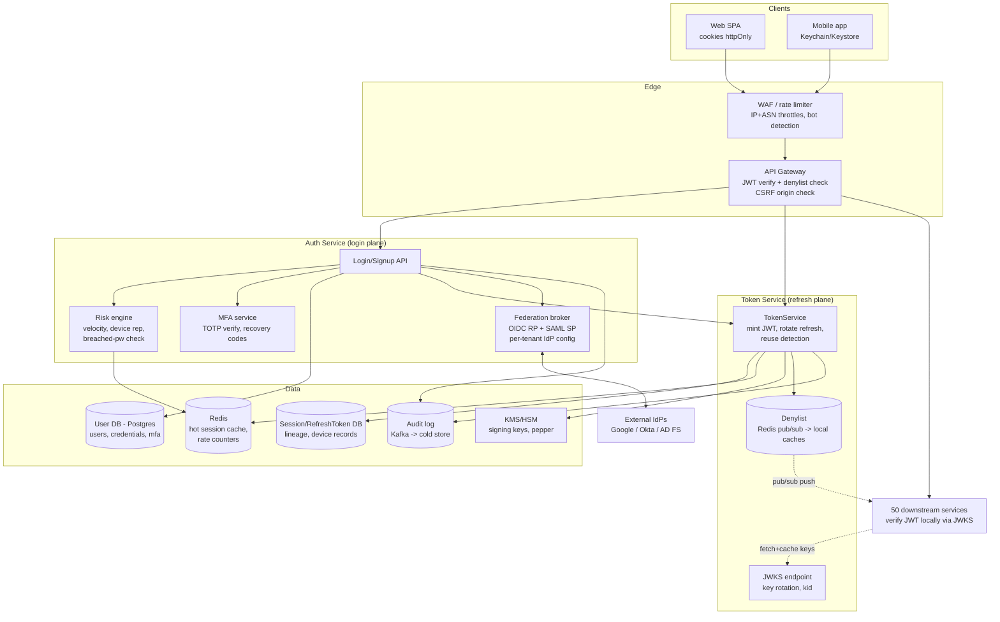
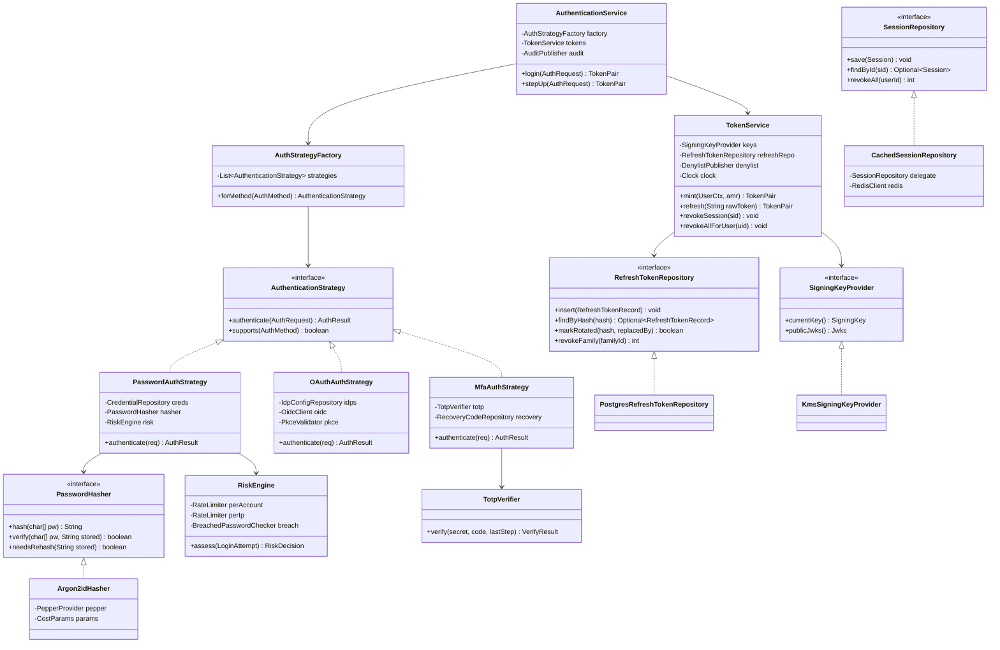

# Auth System Design

## 1. Problem Statement & Scope

Design the authentication and authorization front door for a consumer + B2B SaaS product: password login, social login (OAuth2/OIDC), enterprise SSO (SAML/OIDC), MFA, session management for web and mobile, and the token infrastructure that every other service depends on.

### Functional Requirements

- Signup/login with email+password; email verification; password reset.
- Social login (Google/Apple/GitHub) via OIDC; enterprise SSO via SAML or OIDC per tenant.
- MFA: TOTP (authenticator apps), with recovery codes; step-up auth for sensitive actions.
- Session issuance and validation consumable by ~50 downstream microservices.
- Logout (this device / all devices), admin-forced revocation ("terminate all sessions for user X **now**").
- Token refresh without re-login on mobile for 30–90 days; web sessions with sliding expiry.
- Audit log of auth events; anomaly signals (new device, impossible travel).

### Non-Functional Requirements

- **Latency**: token validation is on *every* request in the fleet → must add < 5 ms p99 to any request.
- **Availability**: 99.99%. Auth down = everything down; login path may degrade before validation path does.
- **Security**: OWASP ASVS L2+; credential-stuffing resistance; revocation propagates in ≤ 60 s (hard requirement — drives the whole token design).
- **Scalability**: validation QPS ≫ login QPS by ~1000×.
- **Compliance**: password hashes upgradable in place; audit retention 1 year.

### Back-of-Envelope Estimation

Assume 50 M MAU, 20 M DAU.

**Logins (write path):**
- 20 M DAU, avg 1.5 logins/day (multi-device) = 30 M logins/day ≈ **350 logins/s avg, ~1.5 K/s peak** (morning spike).
- Each login = 1 password hash verification. Argon2id at ~100 ms CPU each → 1.5 K/s × 0.1 s = **150 dedicated CPU cores at peak** just for hashing. This is deliberate cost (it's what makes offline cracking expensive) and must be capacity-planned — a surprising number in interviews.

**Validation (read path):**
- 20 M DAU × 500 API calls/day = 10 B validations/day ≈ **115 K QPS avg, ~300 K QPS peak**. This asymmetry (300 K validate vs 1.5 K login) is the core argument for stateless access tokens: 300 K QPS of DB lookups is a huge cluster; 300 K QPS of local signature checks is free.

**Refresh:**
- Access token TTL 10 min → each active user refreshes ~every 10 min while active (say 2 h active/day) → 20 M × 12 = 240 M refreshes/day ≈ **2.8 K QPS** hitting the token store. Easily one DB/Redis tier.

**Storage:**
- Users: 50 M × 2 KB (profile+credential rows) = 100 GB.
- Refresh tokens: 20 M DAU × 3 devices × 200 B = ~12 GB hot; with 90-day retention of rotated lineage ~100 GB.
- Audit: 30 M logins + 240 M refreshes/day × 500 B ≈ 135 GB/day → ~50 TB/year (cold storage, partitioned).

## 2. Brute-Force / Naive Design

**V0:** Monolith with a `users` table (`email`, `sha256(password)`), server-side session in memory, session ID in a plain cookie. Every service call queries the DB: `SELECT * FROM sessions WHERE id = ?`.

### Why it breaks, with numbers

1. **SHA-256 passwords are effectively plaintext.** A single GPU computes ~10 B SHA-256/s; an 8-char lowercase+digit password space (36⁸ ≈ 2.8 T) falls in ~5 minutes. Unsalted, a rainbow table cracks the whole dump at once. Must use a *memory-hard, deliberately slow* hash (Argon2id/bcrypt) with per-user salt.
2. **In-memory sessions don't survive restarts or scale-out.** Deploy = logout everyone. Two app servers = sticky sessions (load-balancer pinning), which breaks failover and autoscaling.
3. **DB lookup per request melts at scale.** 300 K QPS of point reads against the primary: even at 1 ms each you need a large read fleet, and the session table becomes the availability bottleneck for *every* product feature. p99 latency of every API inherits DB p99.
4. **No revocation story beyond "delete the row" — which ironically is the one thing V0 does well.** The naive design's session lookup is actually the gold standard for revocation; the lesson is that scaling *away* from it (to JWTs) is what creates the revocation problem — an honest framing interviewers reward.
5. **No CSRF protection**: plain cookie + state-changing POSTs = classic CSRF.
6. **No brute-force defense**: 1.5 K/s of login capacity is also 1.5 K/s of free password-guessing capacity for attackers.

## 3. Evolving the Design

**Step 1 — Bottleneck: password storage → Fix: Argon2id (or bcrypt) with tuned cost, plus a server-side pepper.**
Per-user random salt (in the hash string), global pepper (in KMS/HSM, not the DB) so a DB-only dump is uncrackable without also breaching the app tier. Store algorithm+params in the hash string (`$argon2id$v=19$m=65536,t=3,p=1$...`) so parameters can be raised over time; rehash-on-login upgrades legacy hashes transparently.

**Step 2 — Bottleneck: sticky in-memory sessions → Fix: externalize sessions (Redis + DB), session ID = 128-bit CSPRNG random, httpOnly cookie.**
Now any app server validates any session. Redis point-read: ~0.5 ms. This alone serves many companies forever — say so in the interview: *"If validation QPS is modest, stop here; server-side sessions are simpler and revocation is trivial."*

**Step 3 — Bottleneck: 300 K validation QPS across 50 services all calling the session store → Fix: split into short-lived stateless access token (JWT, 10 min) + stateful refresh token.**
Services verify the JWT signature locally (public key, no network call) → validation cost ≈ 50 µs CPU, zero availability coupling. The refresh token stays a random opaque ID in the token store — the *stateful anchor* that preserves revocation. **This is the honest JWT trade**: you haven't eliminated the revocation problem, you've bounded it to the access-token TTL (≤ 10 min staleness) and moved statefulness to the low-QPS refresh path (2.8 K QPS instead of 300 K).

**Step 4 — Bottleneck: ≤ 60 s revocation requirement, but JWTs live 10 min → Fix: a small denylist for emergency revocation.**
Admin-forced logout / compromise events write `(user_id or jti, expiry)` to a Redis denylist replicated to a per-service in-memory bloom/hash refreshed every ~10–30 s (or pushed via pub/sub). Services check JWT signature (local) *then* the tiny denylist (local memory). Denylist stays small because entries expire with the token TTL. You get JWT economics with near-real-time kill-switch — the standard senior answer to "but JWTs can't be revoked."

**Step 5 — Bottleneck: stolen refresh tokens = 90 days of access → Fix: refresh token rotation with reuse detection.**
Every refresh issues a *new* refresh token and marks the old one used, linked in a family/lineage. If a *used* token is ever presented again, two parties hold the lineage (victim + thief) → **revoke the entire family**, force re-login, raise a security event. Detection instead of prevention — you can't stop exfiltration, but you can make a stolen token detonate on first collision.

**Step 6 — Bottleneck: credential stuffing (attackers replaying breached email:password lists) → Fix: layered lockout + friction.**
Per-account sliding-window counter with exponential backoff + CAPTCHA (not hard lockout — hard lockout is a user-DoS vector: an attacker locks victims out by spraying wrong passwords). Per-IP and per-ASN rate limits at the edge/WAF. Device fingerprint reputation. Breached-password check at signup/login (k-anonymity range query against a Pwned-Passwords-style set). IP reputation feeds. Note the asymmetry: stuffing is *low per-account, high across accounts* — per-account lockout alone misses it; you need global anomaly detection (login failure rate per IP/subnet).

**Step 7 — Bottleneck: passwords are the weak link → Fix: MFA (TOTP) + step-up.**
TOTP (RFC 6238): shared secret provisioned via QR (`otpauth://` URI), 30 s windows, ±1 window skew tolerance, **last-used counter stored to prevent replay within the window**. Recovery codes (10 × one-time, hashed like passwords). Step-up: sensitive operations (change email, add payout account) require `amr`/`acr` claims proving recent MFA (`auth_time` < 5 min), else re-challenge.

**Step 8 — Bottleneck: B2B customers demand SSO; consumers want social login → Fix: federation layer.**
OIDC Authorization Code + PKCE for social and first-party mobile/SPA clients; SAML 2.0 support for legacy enterprise IdPs (Okta/AD FS) behind a broker that normalizes both into an internal identity. Per-tenant IdP config, domain-based home-realm discovery (`user@acme.com` → Acme's IdP), and JIT provisioning.

**Step 9 — Bottleneck: auth service as a single point of failure → Fix: split planes.**
*Validation plane* (JWT verify) is fully distributed — survives auth-service death for the token TTL. *Refresh plane* degrades next (users stay logged in but sessions eventually expire). *Login plane* (password + MFA) is the only part needing the credential DB. Deploy them as separately scaled/failure-isolated services; cache JWKS at every consumer with long overlap on key rotation.

## 4. Protocol & Technology Choices — Why This, Not That

### Sessions vs JWT — done honestly

| Dimension | Server-side sessions (opaque ID) | Stateless JWT access tokens ✅ (hybrid) |
|---|---|---|
| Validation cost | Network hop to store (0.5–2 ms) every request | Local signature check (~50 µs), no I/O |
| Revocation | **Instant and trivial** — delete row | **The problem.** Token valid until expiry; needs short TTL + denylist |
| Availability coupling | Every service depends on session store uptime | Services validate independently; auth can be down 10 min unnoticed |
| Payload | Server-side; nothing leaks | Claims visible to client (base64, not encrypted) — no secrets in JWTs |
| Size on wire | ~32 B cookie | 500–1500 B per request (claims + signature) |
| Cross-service | Each service calls session store or a central gateway | Any service with the public key validates |
| Logout semantics | True logout | "Logout" = drop tokens client-side + denylist; access token may outlive it briefly |
| When the other wins | Single monolith, modest QPS, strict instant-revocation needs (banking) → **sessions, full stop** | Microservices, high validation QPS, mobile APIs |

**Chosen: hybrid — short-TTL JWT access token (10 min) + opaque rotating refresh token + emergency denylist.** Say the honest sentence: *"JWTs don't remove state; they move it. The refresh store and denylist are the state — just off the hot path."*

### JWT signing: HS256 vs RS256 vs EdDSA

| Dimension | HS256 (HMAC) | RS256 (RSA) | EdDSA/ES256 ✅ |
|---|---|---|---|
| Key model | Shared secret — every validator can also **mint** | Private signs, public verifies | Private signs, public verifies |
| Blast radius | Any of 50 services leaked = forge tokens | Only auth service can sign | Only auth service can sign |
| Perf | Fastest | Slow sign, big sigs (256 B) | Fast, small sigs (64 B) |
| Rotation | Redistribute secret everywhere | JWKS endpoint, `kid` header | JWKS endpoint, `kid` header |

**Chosen: ES256/EdDSA with JWKS + `kid` rotation (keep old keys valid for overlap).** HS256 acceptable only when signer = sole verifier. Also: pin accepted `alg` values server-side (reject `alg:none` and HS/RS confusion attacks).

### OAuth2 flows

| Flow | Status | Use |
|---|---|---|
| Authorization Code + PKCE ✅ | Current best practice | Web, SPA, mobile — all client types |
| Implicit | **Deprecated** — tokens in URL fragment leak via history/referrer; no client auth | Never (legacy only) |
| Resource Owner Password (ROPC) | Deprecated — app sees the password, defeats federation/MFA | Never for third parties |
| Client Credentials | Fine | Service-to-service (no user) |
| Device Code | Fine | TVs, CLIs |

**Why PKCE even for confidential clients:** authorization-code interception (malicious app registered on same custom URL scheme on mobile) — the code alone is useless without the `code_verifier` that never left the legitimate app. `S256` challenge only, plus `state` (CSRF) and `nonce` (ID-token replay).

### SSO: SAML vs OIDC

| Dimension | OIDC ✅ (preferred) | SAML 2.0 (must support) |
|---|---|---|
| Format | JSON/JWT over REST | XML + XML-DSig over POST/redirect bindings |
| Mobile/SPA fit | Native | Poor (browser-POST centric) |
| Implementation risk | Mature libs, small surface | XML signature wrapping, canonicalization bugs — historically vulnerable |
| Enterprise reality | Growing | Entrenched — many IdPs are SAML-only |
| Logout | RP-initiated + back-channel logout | Single Logout exists, unreliable in practice |

**Chosen: OIDC-first; SAML via a federation broker for enterprise tenants** (broker converts a SAML assertion into an internal OIDC session, so downstream is uniform). SAML "wins" only in the sense that you don't win enterprise deals without it.

### Password hashing: bcrypt vs scrypt vs Argon2id

| Dimension | bcrypt | scrypt | Argon2id ✅ |
|---|---|---|---|
| Memory-hard | No (4 KB) — GPU/ASIC-friendly | Yes | Yes, tunable independently |
| Params | cost (2^n iters); **12–13** target ~250 ms | N, r, p | m=64 MiB, t=3, p=1 target ~100–250 ms (OWASP-aligned) |
| Input limits | **72-byte truncation** (pre-hash or enforce length) | None | None |
| Pedigree | 25+ years battle-tested | Good | PHC winner (2015), modern recommendation |

**Chosen: Argon2id (m=64 MiB, t=3, p=1) + per-user salt + KMS-held pepper (HMAC the password with the pepper before Argon2).** bcrypt(cost 12) is a defensible answer where FIPS or library maturity dictates; mention the 72-byte pitfall. Tune cost so peak login QPS × hash time fits your CPU budget (the 150-core estimate from §1) and revisit yearly as hardware improves.

### Token storage on web: httpOnly cookies vs localStorage

| Dimension | httpOnly, Secure, SameSite cookies ✅ | localStorage |
|---|---|---|
| XSS token theft | JS cannot read the token (XSS can still *use* the session while page is open — cookies mitigate exfiltration/persistence, not abuse) | Any XSS exfiltrates tokens for offline reuse — game over |
| CSRF | Vulnerable → needs SameSite=Lax/Strict + CSRF tokens for cross-site cases | Immune (attacker can't read storage cross-origin to attach header) |
| Sent automatically | Yes (incl. to subdomains — scope carefully) | No — explicit `Authorization` header |
| Mobile apps | N/A | N/A — use Keychain (iOS) / Keystore-encrypted storage (Android), never plain prefs |

**Chosen: web = access+refresh in httpOnly Secure SameSite=Lax cookies (refresh cookie path-scoped to `/auth/refresh`); mobile = tokens in OS secure enclave storage with `Authorization: Bearer`.** The honest framing: you're choosing which attack to engineer against — cookies pick CSRF (fully solvable: SameSite + anti-CSRF token + Origin check), localStorage picks XSS-exfiltration (never fully solvable in a large JS app).

### CSRF defenses

| Mechanism | Strength | Notes |
|---|---|---|
| SameSite=Lax ✅ baseline | Strong for POSTs | Top-level GET navigations still send cookie — keep state changes off GET |
| Synchronizer / double-submit token ✅ layered | Strong | Per-session token in form/header; double-submit needs `__Host-` prefix to stop subdomain cookie-planting |
| Origin/Referer check ✅ layered | Good | Cheap validation at gateway |
| Custom-header requirement (SPA) | Good | Cross-site forms can't set custom headers |

**Chosen: defense in depth — SameSite=Lax + per-session CSRF token on state-changing routes + Origin validation.**

### Refresh token store: Redis vs RDBMS

**Chosen: PostgreSQL as source of truth (lineage queries for reuse detection need transactional integrity and history), with Redis cache for the hot `token_hash → session` lookup and for the denylist.** Redis-only fails the audit/forensics requirement (need rotated-lineage history) and risks mass-logout on data loss.

## 5. High-Level Design (HLD)



### Write path — password + MFA login

1. `POST /v1/auth/login {email, password}` → WAF rate checks (IP, ASN) → risk engine (per-account counters in Redis, device fingerprint, breached-password bloom).
2. Fetch credential row; compute Argon2id(pepper-HMAC(password), salt); constant-time compare. On mismatch: increment failure counters, return **the same generic error and similar latency** as unknown-email (anti-enumeration).
3. If `mfa_enabled`: return `mfa_token` (5-min single-purpose JWT, `scope=mfa_pending`) → client posts TOTP code → verify with ±1 window, check `last_used_step < current_step`, persist step.
4. Mint: access JWT (`sub`, `sid`, `tenant`, `roles-lite`, `amr:["pwd","otp"]`, `auth_time`, `exp:+10m`, `jti`) signed via KMS; refresh token = 256-bit random, store `sha256(token)` (never plaintext) with new `family_id`, device record.
5. Set cookies (web) or return JSON (mobile). Audit event → Kafka.

### Read path — API request validation

1. Request hits gateway/service with JWT. Verify signature against cached JWKS (`kid` selects key), check `exp`, `iss`, `aud`, pinned `alg`.
2. Check in-memory denylist (refreshed via Redis pub/sub, fallback poll every 30 s) for `sub`/`sid`/`jti`.
3. Authorize (claims + service-local policy). Total added latency: microseconds; **no network I/O on the hot path**.

### Refresh path

`POST /v1/auth/refresh` with refresh token → hash → lookup → rotation logic (§6 pseudocode) → new access+refresh pair. Reuse detection may instead kill the family and 401.

### Data model

```sql
CREATE TABLE users (
  user_id UUID PRIMARY KEY, email CITEXT UNIQUE NOT NULL,
  email_verified BOOL, status ENUM('active','locked','deleted'),
  created_at TIMESTAMPTZ);

CREATE TABLE credentials (             -- separate table: rotate/upgrade without touching users
  user_id UUID PRIMARY KEY REFERENCES users,
  password_hash TEXT NOT NULL,         -- $argon2id$v=19$m=65536,t=3,p=1$<salt>$<hash>
  pepper_version SMALLINT, updated_at TIMESTAMPTZ);

CREATE TABLE mfa_totp (
  user_id UUID PRIMARY KEY, secret_encrypted BYTEA,  -- AES-GCM via KMS data key
  last_used_step BIGINT, confirmed_at TIMESTAMPTZ);

CREATE TABLE recovery_codes (
  user_id UUID, code_hash TEXT, used_at TIMESTAMPTZ,
  PRIMARY KEY (user_id, code_hash));

CREATE TABLE refresh_tokens (
  token_hash CHAR(64) PRIMARY KEY,     -- sha256 of the opaque token
  family_id UUID NOT NULL,             -- rotation lineage
  user_id UUID NOT NULL, session_id UUID NOT NULL,
  device_info JSONB, ip INET,
  status ENUM('active','rotated','revoked') NOT NULL,
  replaced_by CHAR(64),                -- next link in chain
  issued_at TIMESTAMPTZ, expires_at TIMESTAMPTZ);
CREATE INDEX ON refresh_tokens (family_id);
CREATE INDEX ON refresh_tokens (user_id, status);

CREATE TABLE tenant_idp_config (
  tenant_id UUID, protocol ENUM('oidc','saml'),
  issuer TEXT, metadata JSONB,         -- endpoints, certs, attribute mapping
  email_domains TEXT[],                -- home-realm discovery
  PRIMARY KEY (tenant_id));
```

### API design

```
POST /v1/auth/signup                {email, password}
POST /v1/auth/login                 {email, password} -> tokens | {mfa_token}
POST /v1/auth/mfa/verify            {mfa_token, code} -> tokens
POST /v1/auth/refresh               cookie/body refresh -> new pair (rotated)
POST /v1/auth/logout                revoke current session
POST /v1/auth/logout-all            revoke all user sessions -> denylist push
GET  /v1/auth/authorize?...         OIDC authorize (code+PKCE: code_challenge,state,nonce)
POST /v1/auth/token                 code+code_verifier -> tokens
GET  /.well-known/jwks.json         public keys (kid-versioned)
GET  /.well-known/openid-configuration
POST /v1/auth/password/reset-request | reset
POST /v1/auth/mfa/totp/enroll | confirm
Admin: POST /v1/admin/users/{id}/revoke-sessions
```

## 6. Low-Level Design (LLD)



**Design patterns used and why:**
- **Strategy** — `AuthenticationStrategy` with Password/OAuth/MFA implementations: each auth method is an interchangeable policy; adding WebAuthn later = new class, zero changes to `AuthenticationService` (open/closed).
- **Factory** — `AuthStrategyFactory` selects strategy from the request's method; also composes multi-step chains (password → MFA) as a strategy pipeline.
- **Repository** — `SessionRepository`/`RefreshTokenRepository`/`CredentialRepository`: persistence swappable and testable; `CachedSessionRepository` is a **Decorator** adding Redis read-through over the Postgres delegate.
- **Provider/Adapter** — `SigningKeyProvider` abstracts KMS vs local keys; `PepperProvider` likewise.
- **Observer/Publisher** — `AuditPublisher`, `DenylistPublisher` decouple security-event fan-out from the request path.

**Hardest algorithm: refresh rotation with reuse detection (race-safe):**

```java
public TokenPair refresh(String rawToken) {
    String hash = sha256Hex(rawToken);
    RefreshTokenRecord rec = refreshRepo.findByHash(hash)
        .orElseThrow(() -> new AuthException(INVALID_GRANT));   // unknown -> generic 401

    if (rec.expiresAt().isBefore(clock.now())) throw new AuthException(INVALID_GRANT);

    // REUSE DETECTION: a rotated/revoked token presented again means the
    // lineage is held by two parties (victim + thief). Nuke the family.
    if (rec.status() != ACTIVE) {
        refreshRepo.revokeFamily(rec.familyId());
        denylist.publishSessionRevoked(rec.sessionId());        // kill live access JWTs too
        audit.securityEvent(TOKEN_REUSE, rec.userId(), rec.deviceInfo());
        throw new AuthException(INVALID_GRANT);
    }

    // Atomic rotate: compare-and-swap guards the race where the same token
    // is presented twice concurrently (double-tap / flaky mobile network).
    String newRaw = randomUrlSafe(32);
    String newHash = sha256Hex(newRaw);
    boolean won = refreshRepo.markRotated(hash, newHash);       // UPDATE ... SET status='rotated',
                                                                // replaced_by=? WHERE token_hash=? AND status='active'
    if (!won) {
        // Lost the race. Benign concurrency, not theft — within a short grace
        // window (~10 s), return the SAME successor pair (idempotent refresh)
        // instead of nuking the family; outside it, treat as reuse.
        return graceWindow.successorOf(hash)
            .orElseThrow(() -> { refreshRepo.revokeFamily(rec.familyId());
                                 return new AuthException(INVALID_GRANT); });
    }

    refreshRepo.insert(new RefreshTokenRecord(newHash, rec.familyId(), rec.userId(),
        rec.sessionId(), ACTIVE, clock.now(), clock.now().plus(REFRESH_TTL)));
    Jwt access = mintAccessJwt(rec.userId(), rec.sessionId(), rec.amr());
    graceWindow.remember(hash, new TokenPair(access, newRaw));  // for idempotent retry
    return new TokenPair(access, newRaw);
}
```

**TOTP verify with replay protection:**

```java
VerifyResult verify(byte[] secret, String code, long lastUsedStep) {
    long step = clock.now().getEpochSecond() / 30;
    for (long s = step - 1; s <= step + 1; s++) {           // clock-skew tolerance
        if (s <= lastUsedStep) continue;                     // replay guard
        if (constantTimeEquals(hotp(secret, s), code))
            return VerifyResult.ok(s);                       // caller persists s as lastUsedStep
    }
    return VerifyResult.fail();                              // count toward MFA rate limit (e.g. 5/min)
}
```

## 7. Deep Dives & Failure Modes

### The revocation problem, end-to-end
Layers, from strongest to weakest: (1) refresh-token revoke — stops renewal, ≤ TTL staleness; (2) denylist push — kills live access tokens in seconds; (3) short TTL — bounds worst case at 10 min even if denylist fails. State the residual risk plainly: if Redis pub/sub *and* polling both fail, a revoked token works for up to `access_ttl`. If the business can't accept 10 minutes ever (banking), the answer is opaque tokens + gateway introspection — pay the lookup, get instant revocation.

### Hot keys
- **JWKS endpoint** after key rotation: 50 services × N pods refetch at once. Serve JWKS via CDN with SWR; publish new `kid` and *sign with it only after* a propagation delay (pre-publish pattern); consumers cache with background refresh.
- **Celebrity account under attack**: per-account rate counters concentrate on one Redis key — fine (single counter), but ensure the counter key isn't sharded-hot with the session cache; separate keyspace.
- **Tenant-wide SSO login storm** (Monday 9 am, 50 K employees): IdP redirect flow fans out to `tenant_idp_config` — cache per-tenant config in-process with 5-min TTL.

### Thundering herd / stampedes
- **Mass refresh after auth-service outage**: every client's refresh failed and retries on recovery. Mitigate: client jittered exponential backoff (mandated in SDK), server-side load shedding that prioritizes refresh over login (refresh keeps existing users alive), and the idempotent-refresh grace window preventing retry-triggered family revocations — without it, a retry storm mass-logs-out your users *by your own security feature*.
- **Deploy-time JWKS cold caches**: pods start with empty key cache → burst on JWKS. Bake current JWKS into config at deploy; refresh async.
- **Password-reset email storms** (breach news day): queue + rate-limit email sends per user.

### Idempotency & retries
- Refresh: grace-window successor replay (above) — the canonical hard case.
- Login: naturally idempotent-ish (two logins = two sessions; acceptable), but MFA `last_used_step` persistence must be atomic with success to block replay.
- Signup: unique email constraint + upsert-style handling so a retried request doesn't 500; verification-email send is at-least-once with dedupe key.
- Logout: revoking a revoked session is a no-op (repository returns 0 rows, still 200).
- All state-changing admin endpoints accept an `Idempotency-Key` stored 24 h.

### Credential stuffing & account lockout — the honest treatment
Hard lockout after N failures is an attacker's DoS tool (lock out any victim by spraying their email). Instead: exponential delay + CAPTCHA per account; **device-cookie scheme** (trusted-device cookie bypasses friction, so real users on known devices are untouched while unknown-device attempts hit the wall); per-IP/per-ASN ceilings at WAF; global monitors on aggregate failure ratio (stuffing = many accounts × few attempts, invisible per-account). Never reveal whether the email exists — same error, same latency (pad the fast path: hash a dummy credential on unknown-email so timing doesn't leak existence).

### Component failure walkthrough
| Component fails | Impact | Mitigation |
|---|---|---|
| Auth service (login plane) | No new logins; **existing traffic unaffected** (JWTs validate locally) | Multi-AZ; the whole point of the split-plane design |
| Token service (refresh plane) | Sessions die as access tokens expire (10-min cliff ramp) | Multi-AZ; optionally gateways briefly extend `exp` tolerance during declared incident (explicit, time-boxed break-glass) |
| Refresh-token Postgres | No refresh, no reuse detection | Sync replica failover; Redis cache serves reads for a short window (validation-only mode, rotation paused) |
| Redis (counters, denylist, cache) | Rate limiting degrades → fail *open* on limits (availability) but fail *closed* is arguable for high-risk endpoints; denylist falls back to 30 s polling of Postgres revocation table | Redis cluster; local in-memory token-bucket fallback per pod |
| KMS/HSM | Can't sign new tokens | Cached signing key material in memory (envelope pattern: KMS unwraps at boot, key held in process); verification unaffected (public keys cached) |
| External IdP (Google/Okta) | That tenant's/social logins fail | Clear error UX, password fallback where policy allows; circuit breaker so IdP timeouts don't tie up login-plane threads |
| Kafka/audit | Audit events buffer | Local disk spool, async drain; auth never blocks on audit |
| Clock skew across fleet | JWT `exp`/`nbf` misjudged; TOTP windows drift | NTP monitoring; 30–60 s leeway on `nbf`/`iat`; TOTP ±1 window already tolerates 30 s |

### Key rotation runbook (frequent follow-up)
1. Generate new keypair in KMS, publish public key to JWKS with new `kid` (both keys listed). 2. Wait ≥ max consumer cache TTL (e.g., 1 h). 3. Switch signing to new `kid`. 4. Keep old public key published until all tokens signed by it have expired (access TTL + slack). 5. Remove. Compromise = skip waits, push denylist for the old `kid`'s tokens, accept the logout storm.

### Session fixation & fixation-adjacent
Regenerate session/`sid` on every privilege change (login, MFA completion, SSO assertion). Cookies: `__Host-` prefix (locks Secure + no Domain attribute → no subdomain planting), `SameSite=Lax`, `HttpOnly`.

## 8. Trade-off Summary & Interview Soundbites

| Decision | Trade-off accepted |
|---|---|
| Hybrid JWT + opaque refresh | Up-to-10-min revocation staleness (bounded by denylist to seconds) for zero-I/O validation at 300 K QPS |
| 10-min access TTL | 2.8 K QPS refresh load + refresh-path availability criticality, for a tight compromise window |
| Refresh rotation + reuse detection | Grace-window complexity and rare false-positive family kills, for stolen-token detonation |
| Argon2id at ~100–250 ms | ~150 CPU cores at peak login and a DoS surface (rate-limit login!), for offline-cracking resistance |
| httpOnly cookies over localStorage | Must engineer CSRF defenses, to remove XSS token-exfiltration class |
| Soft lockout (backoff+CAPTCHA) over hard lockout | Slightly weaker per-account brute-force ceiling, to eliminate lockout-as-DoS |
| OIDC-first, SAML via broker | Broker build/maintenance cost, for one internal identity model across consumer+enterprise |
| Asymmetric signing (ES256) via KMS | KMS dependency on mint path, so 50 verifying services can never forge tokens |
| Fail-open rate limits on Redis loss | Brief stuffing exposure during Redis outage, to avoid auth-wide availability collapse |

### Soundbites

1. "JWTs don't eliminate session state — they cache it. The refresh store is the state; the JWT is a 10-minute cached read of it."
2. "Sessions vs JWT is really 'instant revocation vs zero-I/O validation' — the hybrid buys most of both and I bound the gap with a denylist."
3. "Refresh rotation is detection, not prevention: I can't stop token theft, but I can make the stolen token explode the family on first reuse."
4. "Password hashing cost is a feature: I budget 150 CPU cores at peak so an attacker needs the same economics times a trillion guesses."
5. "Hard account lockout is an attacker's DoS button — I use backoff, CAPTCHA, and device cookies instead."
6. "Cookies vs localStorage is choosing your attack class: I pick CSRF because it's fully solvable; XSS exfiltration isn't."
7. "PKCE makes the intercepted auth code worthless — the verifier never crossed the wire until the token exchange."
8. "The validation plane must survive the auth service dying — that's the real reason for asymmetric keys and local JWKS caches."

### Common follow-ups

- **"User reports a hacked account — walk me through it."** — Revoke all refresh families + denylist push `sub` (live JWTs dead in seconds), force password reset with new Argon2 hash, invalidate reset tokens, require MFA re-enrollment verification, review audit trail for the session's actions, notify user.
- **"Why not opaque tokens + introspection everywhere?"** — That's the sessions model at microservice scale: every service pays a network hop and couples to the introspection endpoint's uptime. Right choice when instant revocation is non-negotiable; wrong default at 300 K QPS.
- **"Where do roles/permissions live — in the JWT?"** — Only coarse, slow-changing claims (tenant, plan, `roles-lite`). Fine-grained/fast-changing permissions come from the authz service (cached), else a permission change waits out the token TTL and tokens bloat.
- **"Logout on JWT — what actually happens?"** — Client discards tokens, server revokes the refresh family, `sid` goes on the denylist. Without the denylist, 'logout' is a client-side fiction for up to `access_ttl` — say so honestly.
- **"TOTP vs SMS vs WebAuthn?"** — SMS is phishable and SIM-swappable (last resort); TOTP is cheap and offline but phishable in real-time proxy attacks; WebAuthn/passkeys are origin-bound hence phishing-resistant — the end-state, with TOTP as the pragmatic baseline today.
- **"How does SSO logout work?"** — Poorly, industry-wide. Support OIDC back-channel logout (IdP → our endpoint → revoke session); SAML SLO is best-effort. Design assumption: sessions must also die by TTL and admin revocation, never rely on IdP-initiated logout.
- **"Multi-region auth?"** — JWKS and validation are trivially global (static keys). User DB: home-region the user with global read replicas; refresh rotation needs the home region (single-writer per family) — accept cross-region refresh latency or async family migration on region move.
- **"How do you upgrade 50 M bcrypt hashes to Argon2?"** — Rehash-on-login for actives; for dormants, wrap: `argon2(bcrypt_hash)` offline immediately (protects the dump today), unwrap to plain Argon2 on next login.
