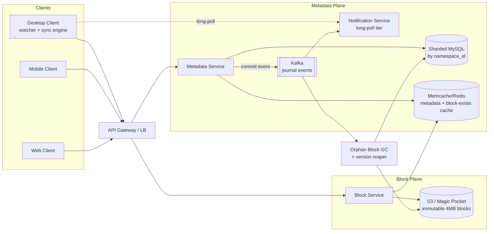
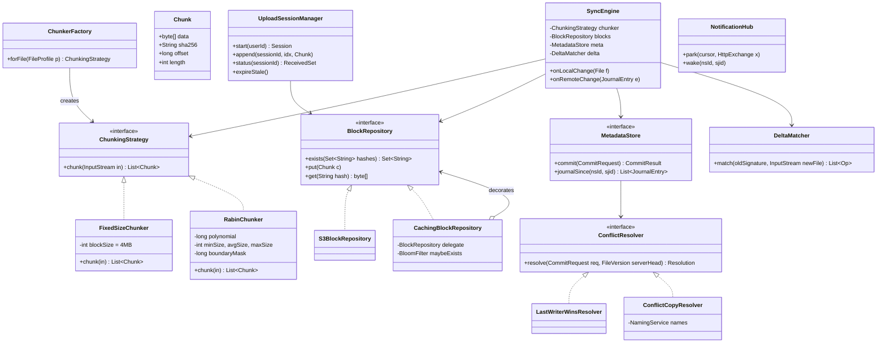

# File Storage System (Dropbox / Google Drive)

## 1. Problem Statement & Scope

Design a cloud file storage and sync service (Dropbox-class): users install a desktop/mobile client, drop files into a synced folder, and the files replicate to the cloud and to all their other devices, with sharing and version history.

### Functional Requirements

- Upload / download files of arbitrary size (support at least 10 GB per file; Dropbox caps ~50 GB via API).
- Automatic sync across N devices per user; near-real-time propagation of changes (< 1 s notification target).
- File versioning: restore any version within a retention window (e.g., 30–180 days).
- Sharing: shared folders visible to multiple users (namespaces).
- Offline edits: client reconciles when back online; conflicts must never silently lose data.
- Resumable uploads over flaky networks.

### Non-Functional Requirements

- Durability: 99.999999999% (11 nines) for file content — data loss is existential for this product.
- Availability: 99.99% for the sync/metadata plane; reads should survive a metadata shard failure degraded.
- Consistency: metadata is strongly consistent per namespace (a client must never see version N+1's metadata pointing at blocks that don't exist). Cross-device propagation is eventually consistent (seconds).
- Bandwidth-efficient: sync a 1-byte change to a 4 GB file without re-sending 4 GB.
- Cost-efficient at exabyte scale: dedup and compression are first-class requirements, not optimizations.

### Back-of-Envelope Estimation

Assume:

- 500M registered users, 10% DAU → 50M DAU.
- Each user stores on average 200 files, average file size 500 KB (median is small; mean dragged up by media) → 100 MB effective, but paid users skew this: use 1 GB average allocated per registered user.
- Raw logical storage: 500M × 1 GB = 500 PB logical.
- Deduplication + compression ratio: dedup (cross-user identical blocks: installers, media, shared folders) plus intra-file dedup gives ~2×; compression on compressible blocks another ~1.3× → assume combined 2.5×. Physical: 500 PB / 2.5 = 200 PB, ×~1.5 for erasure-coding overhead (e.g., RS(10,4) = 1.4×) → **~280 PB physical**.
- Writes: each DAU uploads/modifies 2 files/day average → 100M file writes/day = 100M / 86,400 ≈ **1,160 file commits/s average, ~3,500/s peak (3× diurnal)**.
- With 4 MB blocks and 500 KB average file, most files are 1 block, but large files dominate bytes. Block PUTs: assume average 3 blocks per changed file after delta sync → ~3,500 × 3 ≈ **10,500 block writes/s peak**.
- Upload bandwidth: 100M files/day × 500 KB avg × (say 40% of bytes actually transferred after dedup+delta) = 20 TB/day ≈ 230 MB/s average, ~700 MB/s peak ≈ **~6 Gbps peak ingest** for content (metadata traffic is tiny in bytes, huge in QPS).
- Metadata QPS: every device long-polls; 50M DAU × 1.5 devices = 75M concurrent-ish clients. Long-poll with 60 s timeout → 75M / 60 ≈ **1.25M poll requests/s** if naïve — this single number justifies a dedicated, memory-cheap notification tier (Section 3).
- Metadata size: 500M users × 200 files × ~1 KB metadata/row (path, versions, block lists) = 100 TB of metadata → must be sharded; no single MySQL holds this.

Read:write for content is roughly 2:1 (downloads to other devices + web previews), so downloads peak ~1.5–2 GB/s egress. CDN-cache popular shared content.

## 2. Brute-Force / Naive Design

One server. Client does `PUT /files/{path}` with the whole file body. Server writes it to local disk under `/data/{user_id}/{path}`, inserts a row into a single MySQL `files(user_id, path, size, mtime, disk_path)`. Download is `GET /files/{path}` streaming from disk. Clients poll `GET /changes?since=T` every 30 s.

Why it breaks, with numbers:

1. **Storage**: one beefy server holds ~100 TB of disk. We need 280 PB → 2,800 such servers minimum just for bytes, so "one server + local disk" is off by 3–4 orders of magnitude. Disk failure = data loss (no replication): with 3% AFR on drives and thousands of drives, you lose data weekly.
2. **Whole-file upload**: a user edits 1 KB inside a 4 GB video project file → client re-uploads 4 GB. On a 10 Mbps uplink that's ~55 minutes, and any network blip at minute 54 restarts from zero. Multiply by 100M writes/day and the ingest bandwidth balloons ~10–50×.
3. **No dedup**: 1M users saving the same 100 MB installer stores 100 TB instead of 100 MB. We forfeit the entire 2.5× ratio → +~300 PB of cost.
4. **Single MySQL**: 100 TB of metadata and 3,500 commit TPS plus list/read traffic (~50–100K QPS) crushes one instance (a well-tuned MySQL box does ~5–20K mixed QPS on this schema).
5. **Polling every 30 s**: 75M devices / 30 s = 2.5M req/s of mostly-empty responses hammering the metadata DB, and average change-propagation latency is 15 s — a visibly bad sync experience.
6. **No atomicity**: server crash mid-upload leaves a truncated file on disk with a metadata row pointing at garbage; other devices download corruption.

Each of these failures maps to one evolution step below.

## 3. Evolving the Design

**Bottleneck 1 — whole-file transfer → chunking into 4 MB blocks.**
Split every file into fixed 4 MB blocks; each block is uploaded independently and retried independently. A dropped connection loses at most 4 MB (~3 s on 10 Mbps), not the whole file. 4 MB is the classic Dropbox choice: large enough that per-block overhead (one HTTPS round trip, one metadata entry, one hash) is amortized — a 4 GB file is 1,024 blocks, not 4M blocks at 4 KB — and small enough for retry granularity and parallelism (4–8 concurrent block uploads saturate most uplinks). Blocks also become the unit of dedup and storage.

**Bottleneck 2 — re-upload on edit → delta sync.**
Client keeps the previous version's block list (hashes). On edit, it re-chunks the file, hashes each block, and uploads only blocks whose hash isn't already known to the server. For an append-only or tail-edited file with fixed-size chunking, only trailing blocks change: editing the last 1 KB of a 4 GB file uploads 1 block (4 MB) instead of 4 GB — a 1,000× reduction. For insertions in the middle (which shift all subsequent fixed-size block boundaries) we upgrade to content-defined chunking or rsync-style rolling-hash matching (Sections 4 and 6) so an insert of 1 KB costs ~1–2 chunks, not half the file.

**Bottleneck 3 — storage cost → content-addressed dedup.**
Name each block by SHA-256 of its content. Before uploading, the client (or server) asks "which of these hashes do you already have?" and skips known blocks. This gives (a) cross-user dedup (viral files stored once), (b) instant "upload" of files the server already has, (c) free integrity checking (recompute hash on read), and (d) immutability — a block is never overwritten, which simplifies caching, replication, and consistency enormously. At our scale this is the 2.5× → ~180 PB and >$100M/yr class of saving.

**Bottleneck 4 — metadata coupled to storage → separate metadata service and blob store.**
Split into two planes: a **Block Service** fronting a blob store (S3 or Magic-Pocket-style) that stores immutable content-addressed blocks, and a **Metadata Service** over a sharded relational DB that stores the mutable truth: file paths, versions, and the ordered block-hash list per version. They scale independently (blob store scales in PB and MB/s; metadata scales in QPS and rows), fail independently, and the metadata plane can stay strongly consistent while blocks are trivially replicable because they're immutable.

**Bottleneck 5 — dumb polling → journal cursor + long-poll notification service.**
Model every namespace as an append-only **journal** of change records with a monotonically increasing sequence (Dropbox's SJID). Clients hold a cursor; `list_folder/continue(cursor)` returns everything after it — this makes "what changed?" an indexed range scan, and cursors make sync restartable and idempotent. Then remove the polling load: clients issue a **long-poll** to a dedicated notification tier that holds the connection open (30–90 s) and responds the instant the namespace's journal advances. 75M held-open idle connections are cheap on an epoll-based tier (~10–20 KB memory per connection → a few TB RAM across a modest fleet), versus 1.25M/s of full HTTP request processing hitting the metadata DB. Average change latency drops from 15 s to <1 s. Note the notification is content-free ("something changed") — the client still calls `list_folder/continue`, so the notification tier needs no ordering or durability guarantees and can be lossy (a missed ping self-heals at the next long-poll cycle).

**Bottleneck 6 — non-atomic uploads → blocks-first, commit-second protocol.**
Upload is two phases: (1) PUT all blocks (idempotent, content-addressed, invisible until referenced), (2) `commit` to the metadata service: "path P is now version V = [h1, h2, …, h47]". The commit is a single transactional row insert — atomic. A crash between phases leaves only orphaned blocks, cleaned by a background GC; no client can ever observe a half-uploaded file. Commits carry the client's `parent_version` so the server can detect concurrent writes (Section 7).

**Bottleneck 7 — flaky mobile networks → resumable upload sessions.**
An `upload_session` object tracks which byte ranges/blocks have landed. Client can crash, change networks, and resume from the recorded offset days later. Sessions are server-side state with a TTL (e.g., 7 days), stored in the metadata tier or a session store.

**Bottleneck 8 — concurrent edits → conflict copies, not last-writer-wins.**
Two offline devices edit the same file; both commit with the same `parent_version`. First commit wins; second is rejected with a conflict, and the client re-commits its content as `report (Bob's conflicted copy 2026-08-06).docx`. Rationale in Sections 4 and 7 — for user files, silently dropping someone's edits (LWW) is unacceptable; merging arbitrary binary formats is impossible; so surface both.

**Bottleneck 9 — accidental deletes and overwrites → versioning.**
Because blocks are immutable and versions are just rows pointing at block lists, keeping history is nearly free in metadata and cheap in storage (unchanged blocks are shared between versions). Retention policy + GC of blocks unreferenced by any live version.

## 4. Protocol & Technology Choices — Why This, Not That

### Chunking: fixed-size vs content-defined (CDC)

| Criterion | Fixed 4 MB | Content-defined (Rabin) |
|---|---|---|
| CPU cost to chunk | ~0 (arithmetic) | Rolling hash over every byte (~0.5–2 GB/s/core) |
| Insert 1 byte at offset 0 of 4 GB file | All 1,024 blocks shift → ~full re-upload | 1–2 chunks change (boundary shift-resistant) |
| Append / tail edit | Only last block changes — optimal | Same |
| Chunk size predictability | Exact 4 MB | Variable (min/avg/max e.g. 2/4/8 MB) — index and GC handle ranges |
| Implementation complexity | Trivial | Rolling hash, boundary mask, min/max clamps |
| Dedup ratio on shifted data | Poor | Good (this is why backup systems all use CDC) |

**Choice**: fixed 4 MB as the baseline (Dropbox's actual choice), because most real edits are appends, in-place record updates, or whole-file rewrites where fixed-size behaves fine, and it keeps client CPU/battery cost near zero. Layer **rsync-style rolling-hash matching at sync time** (weak+strong hash, Section 6) to recover insert-tolerance without changing the storage chunking. **CDC would win** in a backup/archival product (Borg, restic) or a dedup appliance where dedup ratio across shifted/similar data dominates and chunking CPU is a server-side batch cost.

### Content hash: SHA-256 vs MD5 vs BLAKE3

| Criterion | SHA-256 | MD5 | BLAKE3 |
|---|---|---|---|
| Collision resistance | Strong (no known attacks) | Broken since 2004 — attacker can craft two blocks with same hash | Strong |
| Speed (x86 w/ SHA-NI) | ~1–2 GB/s | ~0.7 GB/s | ~3–7 GB/s (SIMD, parallel tree) |
| Ubiquity / hardware support | Everywhere, SHA-NI/ARMv8 crypto ext | Everywhere | Library-level, newer |
| Compliance optics | FIPS-approved | Rejected by auditors | Not FIPS |

**Choice**: SHA-256. In a content-addressed dedup store, the hash *is* the identity: with MD5, an attacker uploads block A, then shares a file whose metadata references H(A) while victims expect crafted block B with the same MD5 — dedup collisions become a data-integrity attack, so a broken hash is disqualifying, not just distasteful. **BLAKE3 would win** in a greenfield 2026 design purely on speed (hashing 280 PB matters), and is a defensible answer if you note FIPS/ecosystem trade-offs; SHA-256 is the conservative, interview-safe default with hardware acceleration everywhere.

### Change notification: long-poll vs WebSocket vs SSE vs mobile push

| Criterion | Long-polling | WebSocket | SSE | Platform push (APNs/FCM) |
|---|---|---|---|---|
| Semantics needed | 1-bit "something changed" | Bi-directional stream | Server→client stream | OS-mediated wake-up |
| Proxy/firewall/enterprise middlebox traversal | Excellent — it's a plain HTTP request | Historically flaky (proxies kill Upgrade, idle conns) | Good but some proxies buffer | N/A (OS channel) |
| LB / infra simplicity | Stateless HTTP, any L7 LB | Sticky, connection-aware infra | Sticky-ish | External dependency |
| Failure recovery | Trivial: request just re-issued; missed ping self-heals via cursor | Reconnect + resubscribe logic | Auto-reconnect w/ Last-Event-ID | Delivery not guaranteed |
| Overhead per event | One HTTP round trip per notification | Minimal per-frame | Minimal | N/A |
| Battery (mobile) | Poor (radio held) | Poor | Poor | Best — required on iOS |

**Choice**: long-polling for desktop clients — Dropbox's actual choice, and the reasoning is the interview gold: the payload is a single bit ("re-run list_folder/continue"), events per client are rare (seconds–minutes apart), correctness is guaranteed by the cursor not the channel, and desktop clients sit behind the worst corporate proxies imaginable, where vanilla HTTP always works and WebSocket upgrades get eaten. Long-poll gives ~sub-second latency at trivial protocol complexity. **WebSocket would win** for chatty bi-directional traffic (collaborative editing, cursors in Google Docs) or high event rates where per-event HTTP overhead dominates. **SSE would win** for high-frequency server→client streams to browsers (feeds, tickers). **APNs/FCM is mandatory** for mobile regardless — the OS won't let you hold sockets in the background.

### Metadata DB: sharded MySQL vs DynamoDB vs Spanner

| Criterion | Sharded MySQL (shard by namespace) | DynamoDB | Spanner/CockroachDB |
|---|---|---|---|
| Transactions needed (commit = check parent_version + insert version + append journal, atomically) | Native per-shard ACID; namespace lives on one shard → single-shard txn | Transactions exist but limited, costlier, awkward for multi-row conditional logic | Native, cross-shard |
| Query shapes (list folder, range scan journal by SJID) | Excellent with B-tree indexes | Must design keys around it; range on sort key OK, but secondary patterns hurt | Excellent |
| Operational maturity for this workload | Decades; Dropbox ran exactly this (Edgestore over sharded MySQL) | Managed, zero ops | Managed (Spanner) or self-run (CRDB) |
| Cross-shard operations (move file across namespaces) | Application-level saga — the known pain | Same pain | Free (distributed txn) |
| Cost / latency | Cheap, sub-ms local reads | Pay per RCU/WCU, single-digit ms | Commit latency higher (Paxos quorum, ~5–10 ms+) |

**Choice**: sharded MySQL, sharded by `namespace_id`, so every hot operation (commit, list, journal scan) is a single-shard ACID transaction — the workload was practically designed for this. **DynamoDB would win** for a smaller team wanting zero DB ops and willing to contort the schema. **Spanner would win** if cross-namespace transactions (moves, renames across shared folders) must be frequent and correct without saga machinery, and you'll pay the commit latency.

### Blob store: S3 vs self-hosted (Magic Pocket)

| Criterion | S3 (or GCS) | Self-hosted (Dropbox Magic Pocket) |
|---|---|---|
| Time to market / ops burden | Zero build; 11-nines durability out of the box | Multi-year, exabyte-competent infra team required |
| Cost at exabyte scale | ~$21/TB/mo list (less negotiated); at 280 PB ≈ $70M+/yr | Dropbox reported ~40–50% infra cost reduction post-migration |
| Workload fit | General-purpose | Tuned: immutable 4 MB blocks, append-only, SMR drives, custom erasure coding |
| Egress / lock-in | Egress fees, provider coupling | Own your destiny; but you own the pagers too |

**Choice for the interview**: start on S3 — durability and velocity — and state the migration trigger explicitly: when storage spend at scale exceeds the fully-loaded cost of a storage infra org (Dropbox crossed that around ~500 PB / 2015–16), build Magic Pocket. The workload is unusually amenable to custom hardware precisely *because* blocks are immutable and fixed-size. **S3 wins permanently** below a few hundred PB or without elite infra hiring.

### Sync transport: HTTP/2 vs custom binary protocol

| Criterion | HTTPS (HTTP/1.1 pooled or HTTP/2) | Custom TCP/UDP protocol |
|---|---|---|
| Middlebox traversal | Universal (port 443) | Blocked in many enterprises |
| Multiplexing many 4 MB block PUTs | H2 multiplexes streams on one conn (beware TCP head-of-line on lossy links — H1 with 4–8 pooled conns can beat H2 there) | Full control |
| Tooling: LBs, CDN, TLS termination, debugging | Entire ecosystem | Build it all yourself |
| Marginal perf gain | Baseline | Small for 4 MB objects (payload dominates framing) |

**Choice**: HTTPS — HTTP/2 where the path is clean, falling back to pooled HTTP/1.1 on lossy links. For 4 MB payloads, protocol framing overhead is noise; traversal and tooling dominate. **Custom protocols win** for latency-critical small messages (games, trading) or when you control both endpoints and the network — not here.

## 5. High-Level Design (HLD)



### Write path (upload a changed file)

1. Client's file watcher detects change; sync engine chunks the file into 4 MB blocks and computes SHA-256 per block.
2. Client calls `POST /blocks/diff` with the hash list → Block Service (consulting cache, then store) returns the subset of hashes it does **not** have.
3. Client opens/uses an upload session and PUTs only the missing blocks to the Block Service, 4–8 in parallel, each retried independently. Block Service verifies SHA-256 on receipt before acking, writes to S3 keyed by hash.
4. Client calls `POST /files/commit` on the Metadata Service: `(namespace_id, path, parent_version_id, ordered block hash list, size, client_mtime)`.
5. Metadata Service, in one shard-local transaction: validates `parent_version` matches head (else conflict path, Section 7), verifies referenced blocks exist, inserts a `file_versions` row, updates `files` head pointer, appends a `journal` row with the next SJID.
6. Commit event → Kafka → Notification Service, which completes any parked long-polls for that namespace.
7. Other devices wake, call `list_folder/continue(cursor)`, get the new version's block list, `POST /blocks/diff` against their local block cache, download only missing blocks, reassemble the file, and advance their cursor.

### Read path (fresh download)

1. `GET /files/metadata?path=...` → Metadata Service returns latest version + block hash list (cache-first).
2. Client fetches blocks in parallel from the Block Service (or pre-signed S3/CDN URLs for offload), verifying each SHA-256 locally.
3. Reassemble in block order; set mtime; done. Any block failure retries just that block.

### Data model (metadata shards, keyed by namespace_id)

```sql
namespaces(ns_id PK, owner_user_id, type ENUM('private','shared'), created_at)

files(ns_id, file_id, path VARCHAR(4096), is_deleted BOOL,
      head_version_id, updated_at,
      PRIMARY KEY(ns_id, file_id), UNIQUE(ns_id, path))

file_versions(ns_id, version_id PK-part, file_id, parent_version_id,
      size BIGINT, block_list JSON,           -- ordered [sha256,...]; >1024 blocks: pointer to blocklist blob
      content_hash CHAR(64),                   -- whole-file hash for quick equality
      device_id, committed_at)

blocks(sha256 CHAR(64) PK, size INT, refcount BIGINT, created_at)
      -- lives with Block Service; refcount maintained async via journal events

journal(ns_id, sjid BIGINT AUTO-per-ns, file_id, version_id,
      op ENUM('add','edit','delete','move'), ts,
      PRIMARY KEY(ns_id, sjid))                -- the cursor space; append-only

devices(device_id PK, user_id, name, last_cursor_by_ns JSON, last_seen_at)

upload_sessions(session_id PK, user_id, received_blocks JSON, bytes_received,
      expires_at)
```

Cursor = opaque encoding of `{ns_id → sjid}` for all namespaces the account can see.

### API design

```
POST /upload_session/start                 → { session_id }
POST /upload_session/append                (session_id, block_index, 4MB body, sha256 header)
GET  /upload_session/status                (session_id) → { received: [indices] }   # resume point
POST /blocks/diff                          { hashes: [...] } → { missing: [...] }
POST /files/commit                         { ns_id, path, parent_version_id,
                                             blocks: [sha256...], size, client_mtime,
                                             idempotency_key }                       # atomic
GET  /files/metadata?ns_id&path[&version]
GET  /blocks/{sha256}                      → 4MB body (or 302 to pre-signed URL)
GET  /files/list_folder?path               → entries + cursor
GET  /files/list_folder/continue?cursor    → { entries[], cursor', has_more }
GET  /longpoll?cursor&timeout=60           → { changes: true|false }   # notification tier, no auth-heavy work
GET  /files/list_revisions?path            → [version_id, size, committed_at, device...]
POST /files/restore                        { path, version_id }        # = new commit pointing at old block list
```

`commit` carries an `idempotency_key` so a retried commit after a network timeout doesn't create a duplicate version.

## 6. Low-Level Design (LLD)



**Design patterns, named and justified:**

- **Strategy** — `ChunkingStrategy` (fixed vs Rabin) and `ConflictResolver` (LWW vs conflict-copy): both are policy axes we explicitly debated in Section 4; Strategy lets the policy vary per file type / per product tier without touching `SyncEngine`.
- **Factory** — `ChunkerFactory` picks Rabin for large mutable files (VM images, mailbox files) and fixed for everything else, based on a `FileProfile`; centralizes the heuristic.
- **Repository** — `BlockRepository` abstracts S3 vs Magic Pocket vs local test store; the migration in Section 4 becomes a new implementation, not a rewrite.
- **Decorator** — `CachingBlockRepository` wraps any repository with a Bloom filter + cache for `exists()`; the negative-lookup hot path (dedup checks at 10K/s) never touches S3.
- **Observer** — `NotificationHub` parks long-poll exchanges and wakes them on journal events.

### Rabin-Karp rolling-hash content-defined chunking

```java
final class RabinChunker implements ChunkingStrategy {
    static final int WINDOW = 48;                  // rolling window bytes
    static final int MIN = 2 << 20, AVG = 4 << 20, MAX = 8 << 20;
    static final long MASK = AVG - 1;              // ~1/AVG boundary probability
    static final long MAGIC = 0x3FA7;              // boundary pattern
    final long[] pushTable = precomputed();        // byte -> poly effect entering window
    final long[] popTable  = precomputed();        // byte -> poly effect leaving window

    public List<Chunk> chunk(InputStream in) throws IOException {
        List<Chunk> out = new ArrayList<>();
        byte[] buf = new byte[MAX];
        byte[] window = new byte[WINDOW];
        int len = 0; long hash = 0;
        int b;
        while ((b = in.read()) != -1) {
            buf[len] = (byte) b;
            // O(1) roll: remove byte leaving window, add byte entering
            int leaving = window[len % WINDOW] & 0xFF;
            window[len % WINDOW] = (byte) b;
            hash = ((hash << 1) ^ pushTable[b] ^ popTable[leaving]);
            len++;
            boolean atBoundary = len >= MIN && (hash & MASK) == MAGIC;
            if (atBoundary || len == MAX) {         // MAX clamp bounds worst case
                out.add(seal(buf, len));            // copies bytes, computes SHA-256
                len = 0; hash = 0; Arrays.fill(window, (byte) 0);
            }
        }
        if (len > 0) out.add(seal(buf, len));
        return out;
    }
}
```

Key interview points: the boundary condition depends only on the last 48 bytes of *content*, so inserting bytes upstream shifts data but the same 48-byte sequences still trigger the same boundaries → downstream chunks realign and dedup. MIN prevents pathological tiny chunks; MAX bounds memory and guarantees progress on data where the mask never matches (e.g., long runs of zeros).

### Rsync-style delta matching (weak + strong hash)

Used when the receiver has old version V1 and the sender has V2; sender learns which V1 blocks to reuse without shipping V2.

```java
final class DeltaMatcher {
    // Signature of old file: per 4MB block -> (adler32 weak, sha256 strong)
    public List<Op> match(Signature old, InputStream newFile) {
        Map<Integer, List<BlockRef>> byWeak = old.indexByWeakHash();
        RollingAdler adler = new RollingAdler(BLOCK);
        ByteWindow win = new ByteWindow(BLOCK);
        List<Op> ops = new ArrayList<>(); ByteArrayOutputStream literal = new ByteArrayOutputStream();
        int b;
        while ((b = newFile.read()) != -1) {
            adler.roll(win.push((byte) b));         // O(1): subtract evicted, add new
            if (!win.full()) continue;
            List<BlockRef> cands = byWeak.get(adler.value());
            if (cands != null) {
                String strong = sha256(win.bytes()); // only on weak-hash hit (rare)
                for (BlockRef ref : cands) {
                    if (ref.sha256.equals(strong)) {
                        flushLiteral(ops, literal);              // bytes since last match
                        ops.add(Op.copy(ref.blockIndex));        // reuse server block
                        win.clear(); adler.reset();
                        break;
                    }
                }
            }
            if (win.full()) literal.write(win.evictOldest());    // no match: slide by 1
        }
        literal.write(win.drain()); flushLiteral(ops, literal);
        return ops;   // ops = [COPY(i), LITERAL(bytes), COPY(j), ...]
    }
}
```

The two-level trick is the point: the Adler-32 weak hash is O(1) to roll per byte (feasible at every offset); SHA-256 is computed only on weak matches, so false positives cost one strong hash, and false negatives are impossible for true block matches. Literals are then chunked/uploaded as new blocks; COPYs become hash references in the commit's block list.

## 7. Deep Dives & Failure Modes

**Consistency model.** Metadata is strongly consistent *within a namespace*: commits are single-shard ACID transactions, and the journal gives a total order per namespace (SJID). Cross-device view is eventually consistent — device B lags until its cursor advances — which is fine because it lags to a *consistent prefix*, never a torn state. Blocks are immutable and content-addressed, so block replication needs no consistency protocol at all: any replica with hash H has the right bytes by definition; a stale block cache can serve reads forever safely. This split — mutable-strong tiny plane, immutable-eventual huge plane — is the load-bearing architectural idea; say it explicitly in the interview.

**Commit atomicity and orphan GC.** Order is always blocks-then-metadata. Commit validates block existence, then transacts. Failure between phases leaves orphaned blocks — harmless, invisible, cleaned by GC. GC uses refcounts maintained asynchronously from journal events, with a safety protocol: a block is deleted only if refcount == 0 **and** age > grace window (e.g., 7 days, > upload-session TTL) so an in-flight upload that PUT the block but hasn't committed can't be yanked. Refcount bugs are guarded by a periodic mark-and-sweep audit against live version block lists. Never GC eagerly; disk is cheaper than a lost block.

**Commit idempotency.** Client retries a commit after a timeout; without protection this double-creates versions. `idempotency_key` (client-generated UUID per logical commit) is stored with the version row under a unique constraint; a retry returns the original result. Also naturally safe: same `parent_version` + same `content_hash` can be short-circuited to "already applied."

**Resumable uploads.** Session row records received block indices/byte offsets. Resume flow: client calls `status`, diffs against local plan, uploads the gap. Blocks are verified by SHA-256 at append time, so a corrupted partial can be detected per-block, not at the end of 10 GB. Sessions expire at 7 days; expiry only strands blocks (GC's problem), never metadata.

**Conflict resolution deep dive.** Detection is optimistic concurrency: commit carries `parent_version_id`; if it no longer matches the head, we have a concurrent write. Options: (a) **LWW** — simple, but silently destroys one user's work; acceptable only for derived/re-creatable data (thumbnails, caches), never user documents. (b) **Merge** — requires format knowledge; only Docs-style products with OT/CRDT own the format enough to do this. (c) **Conflict copy** — reject the commit; client re-commits as `name (DeviceX's conflicted copy DATE).ext`; both versions survive; a human resolves. Dropbox chose (c): for opaque binary files it is the only option that is both implementable and lossless. Do we need vector clocks? No — the server serializes all commits per namespace, so a single `parent_version` comparison detects every conflict; vector clocks earn their complexity only in multi-master/P2P designs with no single serialization point. Subtle case: A deletes the file while B edits — treat delete as a version too; B's edit conflicts with the delete and resurfaces as a conflicted copy rather than vanishing.

**Hot spots: viral shared folder.** A 100K-member shared namespace gets one commit → 100K long-polls complete → 100K `list_folder/continue` calls slam one metadata shard, then 100K block downloads slam the same S3 keys. Mitigations: notification fan-out with jitter (spread wakes over 5–30 s — sync is not a trading system); journal reads served from read replicas / cache since journal rows are immutable once written; block downloads via CDN or pre-signed URLs (immutability = infinitely cacheable, `Cache-Control: immutable`); per-namespace rate limits protecting the shard.

**Notification service failure.** Deliberately the most failure-tolerant component: it delivers a lossy 1-bit hint, and correctness lives in the cursor. If the tier dies, clients' long-polls error out and they fall back to timed re-polls (30–60 s) — sync degrades in latency, never in correctness. On recovery, no state to rebuild (subscriptions are re-established by the next long-poll request). This "hint channel is lossy, cursor is truth" pattern is worth stating verbatim.

**S3 / blob-store outage.** Metadata plane still up → clients can list, see changes, and queue work. Uploads: sessions accept nothing; clients back off and retain local state (no data loss — source of truth is still the user's disk until commit). Downloads: block cache and CDN absorb hot content; cold content unavailable. Mitigation for the paranoid tier: cross-region block replication (immutability makes this trivial — pure copy, no conflict resolution) with a region-failover read path.

**Metadata shard failure.** Namespaces on that shard are frozen (no commits, stale lists); all other shards unaffected — blast radius is the point of sharding by namespace. Standard MySQL HA: semi-sync replica promotion in ~seconds–minutes. Clients treat commit failure as retryable; upload sessions and blocks are unaffected, so recovery is a pure metadata-plane event. In-flight commits during failover are safe: either the transaction committed on the promoted replica (retry hits the idempotency key) or it didn't (retry applies cleanly).

**Retries and backpressure.** Every client operation is idempotent by construction (content-addressed PUTs, keyed commits, cursor reads), so blanket retry-with-exponential-backoff + jitter is safe. Server signals backpressure with 429 + `Retry-After`; clients honor it and additionally self-throttle (Dropbox's client famously batches and delays during storms). Kafka between commit and notification absorbs fan-out spikes so the metadata plane's write path never blocks on notification slowness. Priority: interactive traffic (user clicked download) over background sync via separate queues/rate buckets.

## 8. Trade-off Summary & Interview Soundbites

| Decision | Trade-off accepted |
|---|---|
| Fixed 4 MB blocks (+ rsync delta at sync time) | Worse dedup on mid-file inserts vs CDC; bought near-zero client CPU and dead-simple storage |
| SHA-256 content addressing | ~2× slower than BLAKE3; bought universal hardware support, FIPS, and collision safety as identity |
| Long-poll notifications | One HTTP round trip per event and held connections; bought proxy traversal, stateless LBs, lossy-safe simplicity |
| Sharded MySQL by namespace | Cross-namespace ops need sagas; bought single-shard ACID for every hot path |
| Blocks-first, commit-second | Orphan blocks requiring GC; bought atomic visibility and crash safety with one txn |
| Conflict copies over LWW/merge | Users occasionally see duplicate files; bought guaranteed zero data loss on opaque formats |
| Immutable content-addressed blocks | Storage GC complexity (refcounts + grace windows); bought free dedup, infinite cacheability, trivial replication |
| S3 first, Magic Pocket at ~EB scale | Higher unit cost early; bought years of velocity and 11-nines durability without an infra org |

**Soundbites:**

1. "Split the system into a small mutable plane that's strongly consistent and a huge immutable plane that needs no consistency protocol at all — the metadata/block split is the whole design."
2. "The notification channel is a lossy 1-bit hint; the journal cursor is the truth. That's why long-poll failure degrades latency, never correctness."
3. "Content addressing means the hash *is* the identity — which is why MD5 isn't slow-vs-fast, it's a security hole in a dedup store."
4. "Blocks first, metadata second: a crash can only ever create garbage, never a lie."
5. "Every operation is idempotent by construction — content-addressed PUTs, keyed commits, cursor reads — so retry is always the right answer."
6. "For opaque binary files, conflict copies are the only resolution that's both implementable and lossless; LWW silently eats someone's work."
7. "4 MB is the sweet spot where per-block overhead amortizes but retry granularity and dedup still work — 1,024 blocks for a 4 GB file, not 4 million."
8. "Versioning is nearly free once blocks are immutable: a version is just a row pointing at a block list, and unchanged blocks are shared."

**Common follow-ups:**

- *How do you sync a 10 GB file over a flaky network?* Chunk to 2,560 blocks; upload session tracks received indices; each block is independently retried and hash-verified; resume from `status` after any disconnect; commit only after all blocks land — worst-case loss per failure is one 4 MB block.
- *Why immutable blocks?* Dedup for free (same bytes = same key), caching for free (`immutable` semantics end-to-end through CDN), replication for free (no update conflicts possible), integrity for free (key = checksum). Mutability would forfeit all four to save some GC code.
- *How does dedup interact with encryption?* Directly at odds: per-user keys make identical plaintexts encrypt to different ciphertexts → zero cross-user dedup. Options: server-side encryption with provider-held keys (Dropbox's model — full dedup, weaker privacy), convergent encryption (key = H(plaintext) — dedup preserved but leaks file-possession via confirmation attacks), or true E2EE with client keys and dedup only within one user's keyspace. It's a product decision, not a technical one.
- *Client edits a file while it's being uploaded?* The sync engine snapshots (hashes) the file before upload and re-checks after; if the content hash changed mid-flight, abandon the commit and restart chunking — never commit a torn read.
- *How do you delete for real (GDPR)?* Delete version rows, decrement refcounts, GC blocks at refcount 0 after the grace window; convergent-shared blocks referenced by other users legitimately persist — deletion is of *references*, and truly-unique content physically disappears at GC.
- *Why not merge conflicting edits like Google Docs?* Docs owns the document format and streams operations (OT/CRDT); Dropbox syncs opaque byte streams. Merging requires format semantics you don't have. Different product, different consistency machinery.
- *What breaks first at 10× growth?* The metadata plane: journal fan-out on mega-shared namespaces and shard rebalancing. Blocks scale linearly and boringly — immutability again.
