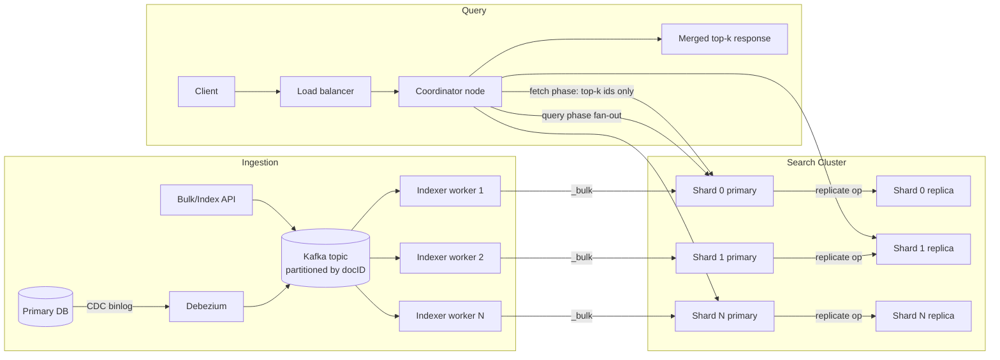
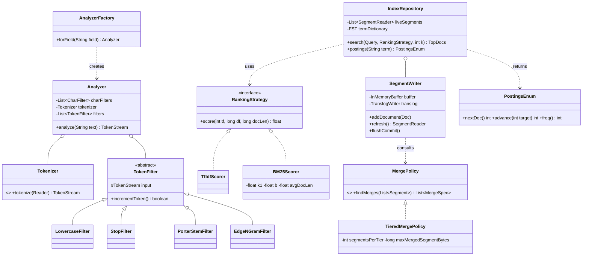

# Search Indexing Pipeline

## 1. Problem Statement & Scope

Design the indexing and query pipeline for a full-text search system (think: product search for a large e-commerce site, or log/document search for an enterprise). The system ingests documents continuously, makes them searchable within seconds, and answers ranked keyword queries with low latency.

### Functional Requirements
- Index documents (JSON with text + structured fields) via single and bulk APIs.
- Full-text search with relevance ranking (BM25), filters, and pagination.
- Near-real-time visibility: a newly indexed document is searchable within ~1s.
- Updates and deletes by document ID.
- Multi-field analysis: different analyzers per field (e.g., `title` with edge n-grams for prefix match, `body` with stemming).

### Non-Functional Requirements
- Search p99 < 200 ms, p50 < 50 ms.
- Indexing throughput: sustain 50k docs/s peak without degrading search.
- Durability: no acknowledged write lost on single-node crash.
- Availability: 99.95% for reads; degrade gracefully (partial results) over failing hard.
- Horizontal scalability to billions of documents.

### Back-of-Envelope Estimation

**Corpus size**
- 2B documents, average raw size 5 KB → raw corpus = 2 × 10⁹ × 5 × 10³ = 10¹³ B = **10 TB raw**.
- Inverted index typically runs 20–40% of raw text with compression; take 30% → **~3 TB index**.
- Add doc values (columnar fields for sorting/aggregation) ~15% and stored fields (compressed originals) ~50% of raw → 1.5 TB + 5 TB. Total on disk ≈ 3 + 1.5 + 5 = **~9.5 TB**, ×2 replication = **~19 TB**.

**Sharding**
- Target shard size 30–50 GB (Lucene sweet spot: big enough to amortize per-shard overhead, small enough to relocate/recover in minutes).
- 9.5 TB / 40 GB ≈ 240 primary shards → with 1 replica, 480 shards. On 30 data nodes: 16 shards/node, ~640 GB/node — fits nodes with 1–2 TB NVMe and 64 GB RAM (page cache holds hot index portions).

**Query load**
- 100M searches/day → 100 × 10⁶ / 86,400 ≈ 1,160 QPS average; peak ×5 ≈ **6,000 QPS**.
- Each query fans out to all 240 primary-or-replica shard copies... but with routing/replicas each node serves ≈ 6,000 × (240 shards / 30 nodes) / (2 copies) ≈ 24,000 shard-searches/s cluster-wide → 800 shard-searches/s per node. At ~5 ms CPU per shard-search, that is 4 cores busy per node just for search — sizing check passes for 16-core nodes.

**Indexing load**
- Steady state: 2B docs refreshed every 30 days → 2 × 10⁹ / (30 × 86,400) ≈ 770 docs/s average; peak bulk reindex target 50k docs/s.
- 50k docs/s × 5 KB = 250 MB/s ingest bandwidth cluster-wide → ~8 MB/s per node across 30 nodes: trivial for NVMe (GB/s), but merge write amplification of ~3–5× means real disk write ≈ 25–40 MB/s/node — still fine, but this is why we budget it.

**Memory**
- Term dictionary (FST) is memory-resident: ~1 GB per TB of index → ~10 GB cluster-wide, negligible per node. The real memory consumer is OS page cache for posting lists: aim for RAM ≈ 10–25% of on-disk index per node (64 GB RAM vs 640 GB disk = 10%, acceptable with NVMe).

## 2. Brute-Force / Naive Design

Store documents in a SQL table; search with `SELECT * FROM docs WHERE body LIKE '%term%'` (or `grep -r` over files).

### Why it breaks — the math

**Full scan cost.** `LIKE '%term%'` cannot use a B-tree (leading wildcard), so every query scans all rows.
- 10 TB of text, sequential read at 2 GB/s NVMe → 10 × 10¹² / 2 × 10⁹ = **5,000 s ≈ 83 minutes per query**. Even a 100 GB corpus is 50 s. Game over at any real scale.
- CPU side is no better: substring matching ~1 GB/s/core → 10,000 core-seconds per query. At 6,000 QPS you would need 60M cores.

**Concurrency.** One scan saturates disk bandwidth; queries serialize. Throughput ≈ 1 query / 83 min = 0.0002 QPS vs required 6,000 QPS — **7 orders of magnitude short**.

**No relevance.** `LIKE` returns unranked boolean matches. Users expect the best 10 of 1M matches, which requires term statistics (document frequency, term frequency) that a scan doesn't produce without... another scan.

**No linguistic handling.** "running" doesn't match "run"; "USA" doesn't match "U.S.A."; case, accents, plurals all miss.

Postgres FTS (`tsvector` + GIN) fixes the scan and stemming, and is the right answer up to ~10–50 GB / low-thousands QPS. Beyond that: single-node write amplification on GIN, no shard-level scaling, weaker ranking (no true BM25 until you build it), and reindex pain push you to a purpose-built engine.

## 3. Evolving the Design

**Bottleneck 1: full scan → inverted index.**
Precompute `term → sorted list of docIDs (posting list)`. Query "cheap flights" becomes: look up 2 posting lists, intersect them. If "cheap" appears in 10M docs and "flights" in 2M docs, intersection with skip pointers touches ~O(min list × log) entries — microseconds-to-milliseconds instead of 83 minutes. Lookup of the term itself is O(1)-ish via an in-memory term dictionary. This is a 10⁶–10⁸× speedup: the single most important data structure in the design.

**Bottleneck 2: index too big → compression.**
Naive posting list: 2M docIDs × 4 B = 8 MB for one common term; a 1M-term vocabulary with Zipfian frequencies blows past RAM. Fix: sort docIDs, store deltas (gaps), varint-encode. A gap of avg 1,000 fits in 2 bytes vs 4 → 2× smaller; frequent terms have tiny gaps (1–2) → 1 byte each, 4×. Block-based PForDelta gets ~3–5 bits/docID for dense lists. 8 MB → ~1–2 MB, and decoding is SIMD-friendly so it's faster too (less I/O, better cache use).

**Bottleneck 3: one machine can't hold it → sharding.**
9.5 TB doesn't fit one node's RAM/disk budget with headroom. Partition by document (hash(docID) → shard): each shard is a complete mini-index over its subset. 240 shards × 40 GB. Every query fans out to all shards; each returns local top-k; coordinator merges. Indexing scales linearly (a doc touches exactly 1 shard).

**Bottleneck 4: write stalls → segments + background merge.**
Updating a compressed, sorted posting list in place means rewriting it — O(list length) per insert; a hot term with a 2 MB list rewritten 50k times/s is impossible. Fix: LSM-like design — writes go to an in-memory buffer, periodically written out as a new **immutable segment** (a small self-contained index). Reads consult all segments and merge. Background merges compact many small segments into fewer large ones (tiered policy). Write cost becomes sequential-append only; ~3–5× write amplification from merges, paid off the query path.

**Bottleneck 5: staleness → NRT refresh.**
Flushing a durable segment per document is too slow (fsync ≈ ms). Fix: **refresh** = write the in-memory buffer to a segment in the filesystem cache (no fsync) and open it for search — cheap enough to do every 1 s. Durability is decoupled: every write is also appended to a **translog** (WAL) which *is* fsynced (per-request or every 5 s). Searchable-in-1s + durable-on-ack, without fsyncing segments per doc.

**Bottleneck 6: single-copy latency & availability → replicas + scatter-gather.**
One copy per shard = no failover, and a slow node drags every query (p99 of max over 240 shards is dominated by the slowest). Add 1 replica per shard; coordinator load-balances shard requests across copies (adaptive replica selection picks the currently-fastest copy), retries a failed shard on its replica, and can return partial results if a shard is truly gone.

**Bottleneck 7: relevance → BM25.**
Boolean matching returns 1M "matches" for common queries. Rank by BM25: rewards rare terms (IDF), saturates repeated terms (a doc saying "flights" 100 times isn't 100× better), and normalizes for document length. Tune analyzers (stemming, synonyms) and add field boosts (`title^3`). Later: rerank top-200 with a learned model — but BM25 is the retrieval backbone.

## 4. Protocol & Technology Choices — Why This, Not That

### Sharding: document-partitioned vs term-partitioned

| Dimension | Doc-partitioned (chosen) | Term-partitioned |
|---|---|---|
| Query | Fan-out to ALL shards, each does full local query, merge top-k | Only shards owning query terms touched (k shards for k terms) |
| Multi-term AND/phrase | Intersection is local & cheap (all postings for a doc co-located) | Must ship posting lists between shards to intersect — network-bound; a 10M-entry list is ~5 MB on the wire per query |
| Indexing | 1 doc → 1 shard; linear scaling | 1 doc → touches every shard owning one of its terms (hundreds) |
| Load balance | Even by construction (hash) | Zipf skew: shard owning "the"/"iphone" melts |
| Failure blast radius | Lose shard → lose 1/N of results (partial results OK) | Lose shard → queries containing its terms fail entirely |
| Per-shard stats | Local IDF (slightly wrong; fixable via DFS phase) | Global IDF for free |

**Why doc-partitioned:** intersections and phrase queries dominate real workloads and must be local; indexing must scale linearly. **When term-partitioned wins:** single-term lookups over enormous corpora with modest query complexity — early web search (Google circa 2000 experimented with it) and some key-value-ish lookup systems. Every mainstream engine (Lucene/ES, Solr, Vespa) is doc-partitioned.

### Ranking: TF-IDF vs BM25 vs learned

| Dimension | TF-IDF | BM25 (chosen for retrieval) | Learned (LTR / neural) |
|---|---|---|---|
| TF behavior | Linear (or log) growth — 100 occurrences ≈ 100× weight | Saturates at k1: asymptote, 20th occurrence adds ~nothing | Learned from clicks/judgments |
| Length handling | Crude cosine normalization; over-penalizes long docs | Tunable pivoted normalization (b) | Learned |
| Cost | O(postings) | O(postings), same | 10–100× per doc → rerank top-k only |
| Data needed | None | None | Labeled/click data, feature pipeline |
| Failure mode | Keyword-stuffing spam wins | Robust default | Cold start, training-serving skew |

**Why BM25:** strictly better theory (probabilistic relevance framework) at identical serving cost; the industry default (Lucene default since 6.0, 2016). **When alternatives win:** TF-IDF basically never anymore; learned ranking wins whenever you have click data — but as a *reranker over BM25's top-200*, not a replacement for first-phase retrieval.

### Posting-list compression

| Scheme | Ratio | Decode speed | Random access | Best for |
|---|---|---|---|---|
| Varint (VByte) | Good (1–5 B/gap) | Fast, branchy | No (sequential) | Simple baselines, small lists, tail terms |
| PForDelta (patched frame-of-reference) | Better (~3–8 bits/gap) | Very fast, SIMD blocks of 128 | Block-level | Long lists, DAAT scoring — Lucene's choice (FOR variant) |
| Roaring bitmaps | Best on dense/clustered sets | Fastest AND/OR (word-level ops) | Yes, O(1)-ish | Filters, cached filter sets, dense enumerations |

**Why a mix:** Lucene uses block FOR/PForDelta for frequency-bearing postings (need positions/freqs interleaved, sequential DAAT scan) and roaring-style bitsets for cached filters (pure membership, heavy boolean algebra). Roaring can't carry per-posting payloads (TF, positions), so it can't replace postings for scoring. Varint survives for block remainders and metadata.

### Engine choice

| Option | Why / why not |
|---|---|
| **Elasticsearch/OpenSearch (chosen)** | Lucene + distributed layer solved: shard allocation, replication, NRT, REST, aggregations, huge operational ecosystem. Rejected-risk: JVM heap tuning, master quorum ops. |
| Solr | Same Lucene core; strong faceting; but weaker cloud-native story, smaller momentum. Wins if: your org already runs SolrCloud, or you need some of its mature features (streaming expressions). |
| Vespa | Superior for combined retrieval+ML ranking at serving time (tensor ranking on content nodes), true realtime in-place updates. Wins if: heavy ML ranking / vector+text hybrid at large scale (e.g., feeds). Costs: smaller community, steeper ops. |
| Raw Lucene | Full control, no cluster layer — you rebuild sharding/replication/failover. Wins if: embedded search in a single-node product, or you're Twitter building Earlybird with bespoke needs. |
| Postgres FTS | Zero new infra, transactional with source data. Wins below ~10–50 GB and modest QPS. Rejected here: no horizontal scale, weaker ranking, GIN write amplification. |

### Ingestion: push (CDC/queue) vs pull (crawler)

| Dimension | Push: CDC → queue (chosen) | Pull: periodic crawl/scan |
|---|---|---|
| Freshness | Seconds (bounded by queue lag) | Minutes–hours (scan interval) |
| Source load | Reads WAL/binlog — near-zero OLTP impact | Repeated full/incremental scans hammer source |
| Deletes | Captured naturally as events | Requires tombstone tables or full diffs |
| Ordering | Per-key ordering via partitioning by docID | Racy without care |

Pull wins when you don't own the source (web crawling) or the source can't emit events (legacy vendor DB). We own the source → CDC (Debezium) into Kafka.

### Kafka vs direct writes for the indexing pipeline

| Dimension | Kafka in the middle (chosen) | App → ES directly |
|---|---|---|
| Backpressure | Queue absorbs bursts; ES indexes at its own pace | ES 429s propagate to app; writes fail or block user requests |
| Replay/reindex | Rewind offsets → rebuild index from topic (with compaction or long retention) | Need separate backfill from source of truth |
| Decoupled failure | ES down → producers unaffected, lag grows | ES down → app write path down |
| Cost | Extra system, extra latency (~100s of ms) | Simpler, lower latency |

Direct writes win for tiny systems or when the app already handles retries and index rebuilds come from the DB anyway. At our scale, the burst-absorption and replay properties are decisive.

## 5. High-Level Design (HLD)



### Write path (numbered)
1. Row changes in the primary DB; Debezium tails the binlog and emits a change event to Kafka, partitioned by `hash(docID)` → per-document ordering preserved.
2. Indexer worker consumes a batch (e.g., 5,000 events), transforms rows → search documents (denormalization, joins from cache), and issues one `_bulk` request.
3. Coordinator routes each doc to its shard: `shard = hash(routing_key) % num_primaries`.
4. Primary shard: analyzes fields, adds doc to the in-memory indexing buffer, **appends operation to translog**, then forwards the operation to replicas in parallel.
5. Replicas apply + translog-append, ack; primary acks the bulk item. Durable now (translog fsync policy: `request` = fsync before ack, or `async` every 5 s for higher throughput).
6. Every `refresh_interval` (1 s), the buffer becomes a new searchable in-cache segment (refresh — no fsync). Every ~30 min or when translog hits 512 MB, a **flush** fsyncs segments to disk (Lucene commit) and truncates the translog.
7. Background tiered merges continuously fold small segments into larger ones; deletes are dropped during merge.

### Read path (numbered)
1. Client → any coordinator node with the search request.
2. **Query phase:** coordinator fans out to one copy (primary or replica, adaptively chosen) of each of the 240 shards. Each shard executes the query locally over all its live segments, scores with BM25, returns top `from+size` as `(docID, score)` pairs — no document bodies.
3. Coordinator merges 240 sorted lists with a heap into the global top `from+size`.
4. **Fetch phase:** coordinator requests full documents (stored fields, highlights) for only the final `size` winners from the shards that own them.
5. Response assembled and returned. Optional DFS pre-phase (Section 7) collects global term stats first when score consistency matters.

### Data model

Mapping (analyzer config per field):

```json
{
  "settings": {
    "number_of_shards": 240, "number_of_replicas": 1,
    "refresh_interval": "1s",
    "analysis": {
      "analyzer": {
        "body_en": { "char_filter": ["html_strip"], "tokenizer": "standard",
                     "filter": ["lowercase", "asciifolding", "english_stop", "english_stemmer"] },
        "title_prefix": { "tokenizer": "standard",
                     "filter": ["lowercase", "edge_2_15"] }
      },
      "filter": {
        "english_stemmer": { "type": "stemmer", "language": "english" },
        "english_stop": { "type": "stop", "stopwords": "_english_" },
        "edge_2_15": { "type": "edge_ngram", "min_gram": 2, "max_gram": 15 }
      }
    }
  },
  "mappings": { "properties": {
    "title":  { "type": "text", "analyzer": "body_en",
                "fields": { "prefix": { "type": "text", "analyzer": "title_prefix",
                                         "search_analyzer": "standard" } } },
    "body":   { "type": "text", "analyzer": "body_en" },
    "price":  { "type": "double" },
    "brand":  { "type": "keyword" },
    "updated_at": { "type": "date" }
  }}
}
```

Analyzer pipeline order (interview must-know): **char filters** (strip HTML, map "&"→"and") → **tokenizer** (text → token stream; `standard` = Unicode word boundaries) → **token filters** in order (lowercase → asciifolding → stop-word removal → stemming; edge n-grams for prefix fields, with a *different, non-n-gram* search analyzer so the query "iph" matches indexed grams without exploding the query itself). Order matters: stem before synonym expansion breaks synonyms; lowercase before stop removal or "The" survives.

Posting list structure (per term, per segment):

```
term "flight" (after stemming "flights" → "flight")
  df=2,000,000  (segment-local doc frequency)
  postings (doc-sorted, delta+FOR blocks of 128):
    [docID Δ | tf | positions Δ...]  →  [7|2|(3,41)] [12|1|(9)] [3|4|(1,5,22,90)] ...
  skip list every 128 docs: (lastDocID, blockOffset) → O(log) advance(target)
per-field norms: encoded doc length (1 byte) for BM25 length normalization
doc values: columnar price/brand/updated_at for sort, filter, aggregation
stored fields: row-oriented compressed (LZ4 blocks) originals for the fetch phase
```

Doc values vs stored fields — different access patterns: doc values are **column-oriented** (read one field for millions of docs: sorting, aggregations, script scoring); stored fields are **row-oriented** (read all fields for ~10 docs: the fetch phase). Storing both is deliberate denormalization.

### API design

```
PUT  /products/_doc/{id}          — index/replace one doc (upsert semantics)
POST /_bulk                        — NDJSON batch: {index}\n{doc}\n... (target 5–15 MB/request)
POST /products/_search
{
  "query": { "bool": {
      "must":   [{ "match": { "body": "cheap flights" }}],
      "should": [{ "match": { "title": { "query": "cheap flights", "boost": 3 }}}],
      "filter": [{ "term": { "brand": "acme" }}, { "range": { "price": { "lte": 200 }}}]
  }},
  "size": 10,
  "search_after": [0.8312, "doc#98213"],   // NOT from/size for deep paging
  "sort": [{ "_score": "desc" }, { "_id": "asc" }]  // tiebreaker required for search_after
}
```

**Why deep paging with from/size is bad:** page 1,000 with size 10 forces *every shard* to compute and return its local top 10,010, and the coordinator to heap-merge 240 × 10,010 ≈ 2.4M entries — memory and CPU scale linearly with `from`, per query. `search_after` uses the last hit's sort values as a cursor: each shard returns only 10 entries after that key. O(size) instead of O(from + size). For dump-everything use cases, use point-in-time (PIT) + `search_after` or scroll.

## 6. Low-Level Design (LLD)



**Patterns and why:**
- **TokenFilter chain = Decorator / Chain of Responsibility.** Each filter wraps a `TokenStream` and pulls from it (`incrementToken()`), transforming or dropping tokens. Filters compose in any order without knowing each other; adding a synonym filter is one line in config. This is literally Lucene's design.
- **RankingStrategy = Strategy.** Scoring is swappable per-field/per-query (BM25 default, TF-IDF legacy, constant-score for filters) without touching traversal code. Similarity is injected where postings are scored.
- **MergePolicy = Strategy.** Tiered vs log-byte-size vs no-merge are interchangeable policies over the same segment set; the scheduler (which throttles I/O) is a separate concern from the policy (which merges to pick).
- **AnalyzerFactory = Factory.** Field name → configured analyzer; index-time and search-time analyzers can differ (edge n-gram case).
- **IndexRepository = Repository/Facade** over segments; **SegmentWriter** isolates the mutable write path from immutable readers (readers never lock).

### BM25 with document-at-a-time (DAAT) traversal + skip pointers

BM25 for query Q, doc D:

```
score(D,Q) = Σ_{t∈Q} IDF(t) · tf(t,D)·(k1+1) / ( tf(t,D) + k1·(1 − b + b·|D|/avgdl) )
IDF(t) = ln( (N − df(t) + 0.5) / (df(t) + 0.5) + 1 )        k1≈1.2, b≈0.75
```

Why it beats TF-IDF: (a) **saturation** — the tf term asymptotes to k1+1, so occurrence #50 adds almost nothing (TF-IDF keeps growing → keyword-stuffing wins); (b) **pivoted length normalization** — the `b·|D|/avgdl` term penalizes docs only for being longer *than average*, tunably, instead of cosine's blunt penalty; (c) principled IDF from the probabilistic relevance framework.

```java
// Conjunctive (AND) DAAT: postings sorted by docID; skip pointers make advance() sub-linear.
TopDocs searchAnd(List<PostingsEnum> postings, BM25Scorer scorer, int k) {
    postings.sort(comparingLong(PostingsEnum::cost));      // rarest term first: drives candidates
    PriorityQueue<ScoreDoc> heap = new PriorityQueue<>(k, byScoreAsc()); // min-heap of size k

    int doc = postings.get(0).nextDoc();
    while (doc != NO_MORE_DOCS) {
        int i = 1;
        while (i < postings.size()) {
            PostingsEnum p = postings.get(i);
            int d = (p.docID() < doc) ? p.advance(doc) : p.docID();  // advance() uses skip list:
            if (d == doc) { i++; }                                    // binary-hop 128-doc blocks, O(log) not O(n)
            else { doc = postings.get(0).advance(d); i = 1;          // leapfrog: restart alignment at d
                   if (doc == NO_MORE_DOCS) return heap.toTopDocs(); }
        }
        float score = 0f;                                  // all lists aligned on `doc`
        long norm = norms.get(doc);                        // encoded |D|
        for (PostingsEnum p : postings)
            score += scorer.score(p.freq(), p.df(), norm); // BM25 per term, summed
        if (heap.size() < k) heap.add(new ScoreDoc(doc, score));
        else if (score > heap.peek().score) { heap.poll(); heap.add(new ScoreDoc(doc, score)); }
        doc = postings.get(0).nextDoc();
    }
    return heap.toTopDocs();                               // heap holds global top-k for this segment
}
```

Key points to say out loud: DAAT scores one document fully before moving on (small memory, works with top-k heap), vs term-at-a-time which needs an accumulator per candidate doc. `advance(target)` uses the skip list — for a 10M-entry list, skipping to a target reads ~log₂(10M/128) ≈ 17 skip entries instead of scanning millions. Disjunctive (OR) queries add WAND/MaxScore: skip whole blocks whose max-possible score can't beat the heap's minimum.

### Top-k heap merge in scatter-gather (coordinator)

```java
// Each shard returns its local top-k sorted desc. Merge 240 sorted lists into global top-k:
List<ScoreDoc> mergeTopK(List<ShardResult> shards, int k) {
    // max-heap over the heads of each shard's list — classic k-way merge
    PriorityQueue<Cursor> pq = new PriorityQueue<>(byScoreDescThenShardThenDoc());
    for (ShardResult s : shards)
        if (!s.hits.isEmpty()) pq.add(new Cursor(s, 0));

    List<ScoreDoc> out = new ArrayList<>(k);
    while (out.size() < k && !pq.isEmpty()) {
        Cursor c = pq.poll();
        out.add(c.current());                       // globally next-best hit
        if (c.hasNext()) pq.add(c.next());          // push this shard's next hit
    }
    return out;                                     // O((k + S) log S), S = shard count
}
```

Complexity: O((k + S) log S) with S=240, k=10 → ~250 heap ops, microseconds. The deterministic tiebreak (score, shardId, docId) makes pagination stable across identical requests.

## 7. Deep Dives & Failure Modes

**Merge amplification & I/O throttling.** Tiered merging rewrites each byte ~O(log(index/flush-size)) times over its lifetime — ~3–5× write amplification in practice. Unthrottled merges saturate NVMe and evict page cache, spiking search p99. Mitigations: merge scheduler I/O throttling (auto-throttle to ~20–50 MB/s when searching), cap `maxMergedSegmentBytes` (default 5 GB — bigger segments would merge forever), and never force-merge a live-written index. Symptom to name: "segment count explosion" when indexing outruns merging → search slows (cost ≈ Σ per-segment overhead) → engine throttles indexing (Lucene's merge backpressure).

**Refresh interval vs indexing throughput.** Refresh=1s creates ~86,400 small segments/day/shard pre-merge; each refresh flushes tiny segments that must be re-merged (more amplification) and invalidates per-segment caches. Bulk loads: set `refresh_interval=-1` and `replicas=0`, restore after — commonly 2–3× throughput. Trade: staleness. State the knob explicitly in the interview: freshness is *purchasable* with merge I/O.

**Translog fsync & durability.** `durability=request`: fsync translog before acking — survives node crash, costs ~0.5–1 ms per bulk (amortized across the batch, so fine for bulks, painful for single-doc writes). `durability=async` (fsync every 5s): up to 5 s of acked writes lost on crash — acceptable only when Kafka retains the source of truth and offsets are committed *after* ES ack (then a crash is repaired by replay, not lost). That coupling — translog policy ↔ upstream replayability — is a senior-level point.

**Split brain / master election.** Metadata (mappings, shard routing table) is managed by an elected master via a quorum (Raft-like in ES 7+; pre-7 `minimum_master_nodes` misconfiguration caused real split brains: two masters, divergent cluster states, lost shards). Run 3 dedicated master-eligible nodes; quorum = 2. Data nodes keep serving reads during brief master loss; what stalls is shard allocation and mapping changes. Also: a partitioned primary gets fenced — replication requires acks from the in-sync copy set tracked by the master, so a stale primary can't silently diverge.

**Hot shards.** Two causes: (1) **temporal skew** — time-series data where all writes hit today's index: fix with rollover indices (ILM), write alias pointing at the newest index, size-based rollover (e.g., 40 GB); (2) **one big tenant** — routing by tenant_id sends a whale to one shard: fix with composite routing (`tenant_id + hash(docID) % partition_factor`), or promote whales to dedicated indices behind an alias. Detection: per-shard indexing/search rate metrics; imbalance ratio > 2–3× is action-worthy.

**Deep pagination as DoS.** `from=100000&size=100` → each shard materializes 100,100 score docs; 240 shards → coordinator heap-merges 24M entries per request. A handful of concurrent requests OOMs the coordinator. Defenses: enforce `max_result_window` (default 10,000 — keep it), expose only `search_after` for deep traversal, and cap it behind PIT for consistency.

**Scoring skew across shards.** BM25's IDF is computed per shard. With random routing and millions of docs, shard-local df ≈ global df — skew is negligible. It bites with: few docs, many shards (df=3 on one shard, 0 on another), or custom routing that clusters similar docs. Fix: `search_type=dfs_query_then_fetch` — an extra round-trip that collects global term stats from all shards first, then scores with global IDF. Costs one full RTT per query; use for tests/small indices, not at 6k QPS. Better long-term fix for routed indices: periodic background global-stats broadcast.

**Replica lag & read-your-writes.** Replication is synchronous per operation (primary waits for in-sync replicas), so replicas don't lag on *acknowledged docs* — but **refresh timing differs per copy**: a doc may be refresh-visible on the primary and not yet on a replica. A user who writes then searches can miss their own doc. Fixes: `refresh=wait_for` on the write (ack after next refresh, adds ≤1 s), or route that user's subsequent reads to the same copy via `preference=_user_id_` (sticky replica selection), or GET-by-ID which is realtime (reads the translog).

**Reindexing strategy.** Mapping changes (analyzer change, field type) require a full rebuild — segments are immutable and analysis is index-time. Zero-downtime recipe: (1) create `products_v2` with new mapping; (2) **backfill** by replaying the Kafka topic (or `_reindex` from v1) into v2 while (3) **dual-writing** live traffic to both (indexer writes v1+v2); (4) verify counts + sampled scoring diffs; (5) atomically swap the read alias `products → products_v2`; (6) stop dual writes, drop v1. Dual-write-then-backfill vs backfill-then-catch-up: dual-write first avoids a moving catch-up target; the backfill must be idempotent (index by _id = upsert, and last-write-wins via external version = source updated_at) so overlap is harmless.

**Backpressure from Kafka lag.** ES rejects with 429 when its write threadpool queue fills. Indexer must treat 429 as backpressure: exponential backoff, shrink bulk size, *pause consumption* — never drop. Kafka absorbs the burst; lag is the health metric (alert on lag age > freshness SLO, e.g., 60 s). The anti-pattern to call out: retrying 429s with a fixed-size unbounded in-worker buffer just moves the OOM from ES to the worker.

**Component death.**
- *Data node dies:* master notices via failed followers-check (~30 s or immediately on connection drop), promotes replicas to primary for its shards, schedules re-replication onto surviving nodes (throttled — recovery traffic vs serving traffic). During the gap, searches use the surviving copy; writes to a shard with no live primary fail fast (retryable — Kafka replays).
- *Coordinator dies mid-query:* client request fails; LB retries on another coordinator — coordinators are stateless (scatter-gather state is per-request in memory). PIT/scroll contexts on data nodes expire via TTL.
- *Indexer worker dies:* Kafka rebalances its partitions to other workers; since offsets commit only after ES acks the bulk, the new owner replays the in-flight batch → duplicates → harmless because indexing by `_id` is idempotent upsert.
- *Master dies:* remaining master-eligibles elect a new one in seconds; data plane (search + indexing to existing shards) continues throughout.

## 8. Trade-off Summary & Interview Soundbites

| Decision | Trade-off accepted |
|---|---|
| Inverted index | Index-time cost + ~30% storage overhead for 10⁶× query speedup |
| Immutable segments (LSM-like) | 3–5× merge write amplification + deletes-as-tombstones, for lock-free reads and sequential writes |
| Doc-partitioned sharding | Every query fans out to all shards (fan-out cost, local IDF) for local intersections and linear write scaling |
| Refresh every 1 s (NRT) | ~1 s staleness + small-segment churn, instead of fsync-per-doc or minutes-stale batch indexes |
| Translog for durability | Extra write per op (WAL) so refresh can skip fsync |
| BM25 first phase + LTR rerank | Two-stage complexity for cheap recall + expensive precision only on top-200 |
| Kafka in the ingest path | +1 system, +100s of ms freshness, for burst absorption, replay-based reindex, decoupled failure |
| `search_after` over from/size | No random page jumps, for O(size) deep pagination instead of O(from+size) per shard |
| Block PForDelta postings + roaring filters | Two codecs to maintain; each optimal for its access pattern (sequential scoring vs boolean set algebra) |

**Soundbites**
1. "An inverted index turns an 83-minute scan into a microsecond lookup — everything else in this design exists to keep that lookup true under writes and scale."
2. "Segments are immutable, so reads never take a lock; we pay for that with background merges — it's an LSM tree where the 'values' are posting lists."
3. "Refresh makes it searchable, flush makes it durable, the translog covers the gap between them."
4. "BM25 = TF-IDF with two fixes: term frequency saturates, and length normalization pivots around the average doc — that's why keyword stuffing stopped working."
5. "We shard by document, not by term, because intersections must be local — shipping a 5 MB posting list across the network per query is how term partitioning dies."
6. "Deep pagination is O(from) on every shard — page 10,000 is a self-inflicted DoS; cursors (`search_after`) make it O(size)."
7. "Scores can differ across shards because IDF is local; with random routing and big shards the error is noise — DFS query-then-fetch buys exact stats for one extra round-trip."
8. "Kafka in front of the indexer isn't about throughput — it's about backpressure and the ability to rebuild the index by replaying the topic."

**Common follow-ups**

- *Why are segments immutable?* Lock-free concurrent reads (a reader holds a point-in-time view over a fixed segment set), sequential-only writes (SSD/page-cache friendly), trivially cacheable file blocks, and compression that assumes data never changes (delta+FOR breaks under in-place edits). Cost: updates = delete + reinsert, and merges.
- *How do deletes/updates work?* A delete flips a bit in a per-segment tombstone bitmap (`.liv` file — the one mutable-ish artifact); the doc still matches postings but is filtered at collect time and its space is reclaimed only when a merge rewrites the segment without it. An update is delete + index of a new doc version; version numbers resolve races.
- *How would you do autocomplete?* Index-time **edge n-grams** on a subfield ("iphone" → "ip","iph","ipho",...) with a plain search analyzer — turns prefix search into an exact term lookup at ~3–5× that field's index size; or Lucene's suggesters built on **FSTs** for top-weighted completions in microseconds; `match_phrase_prefix` only for low-QPS long-tail (it expands the last term at query time — expensive).
- *What's the FST for?* The term dictionary: a minimal acyclic automaton mapping term → posting-list offset, sharing both prefixes and suffixes — ~10 bytes/term, memory-resident, and it natively supports prefix/fuzzy intersection (Levenshtein automaton ∩ FST) for `fuzzy` queries without scanning the vocabulary.
- *Why not one giant shard, or one shard per node forever?* Shard = unit of recovery, rebalance, and parallelism. Too big (>100 GB): hours to relocate/recover, single-threaded-per-shard query limits. Too many: per-shard fixed overhead (heap, file handles, cluster-state entries) and fan-out merge cost. Hence the 30–50 GB target and rollover.
- *How do you handle a query for 'the'?* Stop-word removal at analysis time, or keep stop words but rely on BM25's IDF ≈ 0 plus MaxScore/WAND block-skipping so the 2B-entry posting list is mostly skipped, never fully scanned.
- *Exactly-once indexing?* Not needed — at-least-once from Kafka + idempotent upsert by `_id` + external versioning (source `updated_at`) gives effectively-once results, which is the standard answer for any replayed pipeline feeding an idempotent sink.
