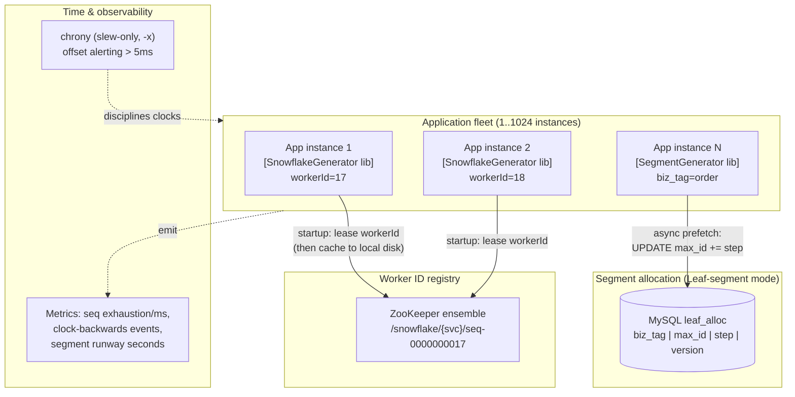
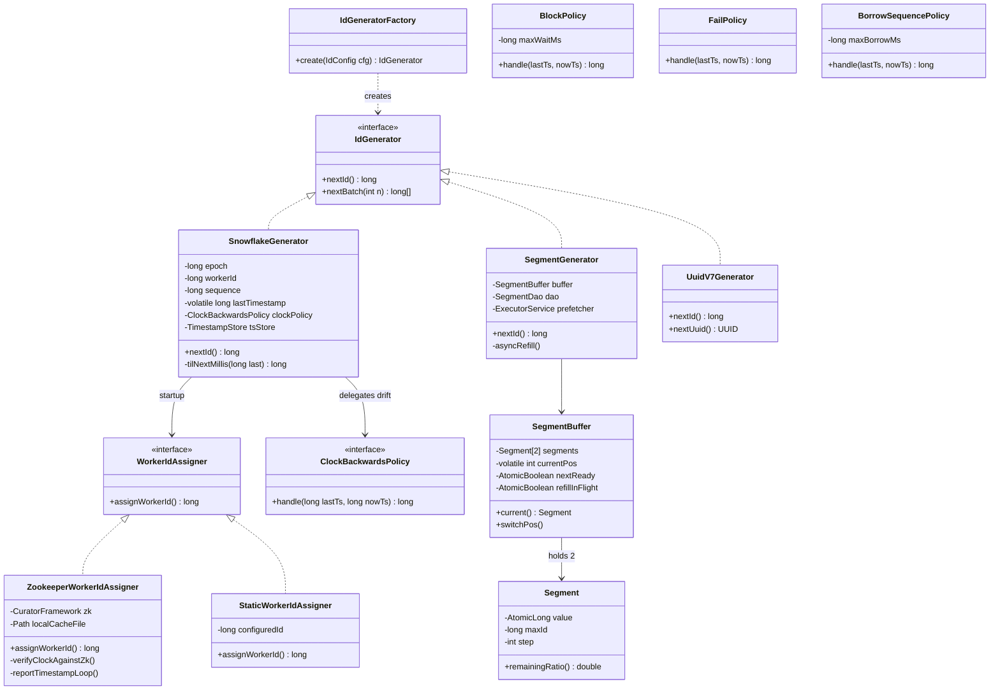

# Distributed ID Generation

## 1. Problem Statement & Scope

Design a service (or embedded library) that generates unique identifiers for entities (tweets, orders, messages, likes) across a fleet of thousands of application servers.

### Functional Requirements

- **Uniqueness**: no two IDs ever collide, across all nodes, across restarts, forever.
- **Roughly time-sortable (k-sorted)**: IDs generated later should generally sort higher. Exact global ordering is NOT required — "within ~1 second accuracy" is the usual bar. This enables `ORDER BY id` as a proxy for `ORDER BY created_at` and makes B+-tree inserts append-mostly.
- **64-bit numeric**: fits in a `BIGINT`, a Java `long`, a protobuf `int64`. Half the storage/index footprint of a 128-bit UUID, and every language/DB handles it natively.
- **Batch support**: callers may ask for N IDs at once (bulk import, fan-out writes).

### Non-Functional Requirements

- **Low latency**: p99 < 1 ms; ideally in-process (no network hop on the hot path).
- **High throughput**: 10k–10M IDs/sec fleet-wide.
- **No coordination on the hot path**: coordination allowed only at startup (worker ID assignment) or infrequently in the background (range refill). Per-ID consensus is a non-starter.
- **Availability > strict ordering**: the ID generator must not become the SPOF for every write in the company.
- **Unpredictability (contextual)**: monotonically increasing IDs leak business volume ("German tank problem" — Allies estimated tank production from serial numbers) and enable enumeration attacks (`/orders/10001`, `/orders/10002`...). Decide per use-case: internal PKs can be sequential; externally exposed tokens should not be the same value, or should be paired with an opaque public ID.

### Back-of-Envelope Estimation

Take Twitter-scale as the canonical sizing exercise:

| Event | Rate | IDs/sec |
|---|---|---|
| Tweets | ~500M/day | 500M / 86,400 ≈ **5,800/s** avg |
| Likes | ~10× tweets | ≈ **58,000/s** avg |
| DMs + media + notifications | ~2× tweets | ≈ **12,000/s** avg |
| **Total average** | | **≈ 76,000/s** |
| **Peak (10× avg, New Year's Eve)** | | **≈ 760,000/s** |

Per-node Snowflake capacity: 12 sequence bits → 2^12 = **4,096 IDs per millisecond per node** = 4,096 × 1,000 = **4.096M IDs/sec/node**.

So peak load of 760k/s fits on **one** node's theoretical capacity with 5× headroom — but we run the generator embedded in every app server anyway (for latency and availability), so real capacity is `4.096M × node_count`. With 10 machine bits → 2^10 = **1,024 nodes** → fleet ceiling of **~4.2 billion IDs/sec**. Throughput is never the constraint; **clock correctness and worker-ID uniqueness are**.

ID-space lifetime: 41 timestamp bits → 2^41 ms ≈ 2.199 × 10^12 ms ≈ 69.7 years from the chosen custom epoch.

Storage delta at scale: 500M tweets/day × 365 days × (16B UUID − 8B long) = **~1.46 TB/year saved on the PK column alone**, and that multiplies across every secondary index and every foreign-key reference to the ID.

## 2. Brute-Force / Naive Design

**Design**: one MySQL instance with a table `ids(id BIGINT AUTO_INCREMENT PRIMARY KEY)`. Every app server does `INSERT INTO ids VALUES (NULL); SELECT LAST_INSERT_ID();` (or `REPLACE INTO`) per ID.

Why it's attractive: trivially unique, strictly monotonic, zero new infrastructure, sortable, 64-bit.

### Why it breaks

1. **Throughput ceiling — the fsync math.** With `innodb_flush_log_at_trx_commit=1`, every commit forces an fsync. A 7200 RPM disk does ~100–200 fsyncs/s; an SSD ~2,000–10,000. Even with group commit batching you realistically cap at **~2,000–5,000 ID-generating transactions/sec** on a single primary. Our average load is 76k/s — **15–38× over capacity** on day one.
2. **Network hop per ID.** Every ID costs one RTT to the DB: ~0.5–1 ms same-AZ, 1–3 ms cross-AZ. Compare to a local Snowflake call: ~50–100 **nano**seconds. That's a **10,000×** latency difference, added to *every write path in the company*.
3. **Single point of failure.** DB down ⇒ every service that writes anything is down. Failover to a replica takes 10–60 s (detection + promotion), and async replication risks the replica being behind — after failover it could **re-issue IDs the old primary already handed out**. You'd need semi-sync replication, which further cuts throughput.
4. **Operational blast radius**: schema migrations, backups, upgrades on this one DB now freeze company-wide writes.

### The multi-master offset/increment hack

MySQL supports `auto_increment_increment=N`, `auto_increment_offset=k`. Two masters: server A issues 1, 3, 5, ... (offset 1, increment 2); server B issues 2, 4, 6, ... (offset 2, increment 2). Capacity doubles, and either can die without a total outage.

Why it's operationally brittle:

- **Cannot add capacity safely.** Going from 2 → 3 servers means changing increment to 3 on live servers; during the transition, old-increment and new-increment sequences **can collide** (A at increment 2 issues 7 while C at increment 3 issues 7). In practice you must over-provision increment up front (e.g., increment=10 with 2 live servers) — guessing future topology.
- **Ordering is gone.** A lightly loaded server's IDs interleave arbitrarily with a busy one's — B could be at 1,000,002 while A is at 5,000,001. IDs no longer approximate time at all.
- **Drift/config errors are silent and catastrophic**: one server restored from a backup with the wrong offset silently issues duplicates; you find out via unique-key violations (best case) or data corruption (worst case).
- Still ~2× the fsync ceiling ≈ 10k/s max — under our 76k/s average.

Verdict: fine for a two-DC failover setup circa 2008; not a distributed ID scheme.

## 3. Evolving the Design

**Step 1 — Central DB → Flickr ticket servers.** Dedicate DBs to *only* issuing IDs. Flickr's trick: a one-row table and MySQL's `REPLACE INTO`:

```sql
CREATE TABLE tickets64 (
  id   BIGINT UNSIGNED NOT NULL AUTO_INCREMENT PRIMARY KEY,
  stub CHAR(1)         NOT NULL UNIQUE
) ENGINE=InnoDB;

REPLACE INTO tickets64 (stub) VALUES ('a');
SELECT LAST_INSERT_ID();
```

`REPLACE INTO` deletes the existing row and inserts a new one, bumping `AUTO_INCREMENT` — the table stays one row forever, so it never grows and stays cache-hot. Run **two** ticket servers with the odd/even offset hack (TicketServer1: offset 1, increment 2; TicketServer2: offset 2, increment 2) for HA; clients round-robin. Numbers: still ~5k/s per server ≈ 10k/s total, still one RTT per ID, roughly sorted only per-server. Improvement over Step 0: isolated blast radius, HA. Remaining problems: **a network hop per ID** and a hard throughput ceiling.

**Step 2 — Amortize the hop: range/segment allocation.** Instead of one ID per round-trip, lease a *range*. The DB stores `(biz_tag, max_id, step)`; a client does one transaction — `UPDATE ... SET max_id = max_id + step` — and receives `(old_max, old_max + step]`, e.g. 10,000 IDs. It then serves those from memory with an atomic counter. Math: at 5,000 IDs/s per node with step=10,000, the node hits the DB **once every 2 seconds** instead of 5,000 times/sec — a 10,000× reduction in DB load. DB QPS = fleet_QPS / step; even 1M IDs/s fleet-wide is only 100 DB tps.

**Step 2.5 — Kill the refill latency spike: double buffering (Meituan Leaf-segment).** Naive range allocation stalls all threads for one DB RTT when a segment exhausts — a periodic p99 spike, and a hard stop if the DB is briefly down. Leaf's fix: keep **two** segment buffers; when the active segment falls below ~10% remaining, an async thread prefetches the next segment into the standby buffer. Exhaustion becomes a pointer swap. Bonus: buffered-but-unserved IDs are runway during a DB outage (see §7).

Remaining problems with segments: (a) **not time-sortable across nodes** — node A may hold range [10k, 20k) while node B holds [90k, 100k), so a later write on A gets a smaller ID; (b) still a DB dependency; (c) strictly sequential per biz_tag ⇒ leaks volume; (d) IDs lost on restart (unused remainder of the segment is discarded — fine, uniqueness only needs monotone max_id).

**Step 3 — Eliminate the DB from generation entirely: Snowflake.** Encode `(time, node, sequence)` into 64 bits and generate **locally**. Uniqueness argument: two IDs can only collide if they share the same millisecond (timestamp bits), same worker ID (machine bits), and same sequence — the per-node sequence counter prevents the last, unique worker IDs prevent the middle, and a monotonic clock prevents the first. Zero coordination on the hot path; ~millions/s/node; k-sorted globally to ~clock-skew accuracy (NTP keeps fleets within single-digit ms).

**Step 4 — The new problem: clocks.** Snowflake trades DB dependency for **wall-clock dependency**. If the clock jumps backwards (NTP step, VM migration, manual reset), the node can re-enter a millisecond it already used and duplicate IDs. Strategies, by drift size:

- **Small backwards drift (≤ ~5 ms)**: spin/sleep until the clock catches up. Bounded latency blip; the common case (NTP slew adjustments are tiny).
- **Moderate drift (5 ms – ~1 s)**: block with a timeout, or fail this node out of rotation while others serve.
- **Large drift (> 1 s)**: refuse to start / throw — a clock that wrong indicates operational breakage; generating IDs risks silent duplicates.
- **Sequence borrowing**: on small drift, keep issuing against `lastTimestamp` using leftover sequence space instead of the (earlier) wall clock — trades a bit of timestamp accuracy for zero blocking.
- **NTP sanity**: run `ntpd`/`chrony` in **slew-only** mode (`-x`) so time never steps backwards, monitor offset, and persist `lastTimestamp` periodically so a restart during drift can't rewind (see LLD).

**Step 5 — Worker ID assignment.** 10 bits ⇒ 1,024 distinct worker IDs; two nodes with the same ID = collisions. Options: **static config** (simple, but config drift and copy-paste bugs — dangerous with autoscaling), **IP/MAC-derived** (e.g., low 10 bits of IP — zero infra, but silently collides across subnets/NAT/containers), **ZooKeeper/etcd lease** (Leaf-snowflake: node registers an ephemeral/persistent-sequential znode under `/snowflake/{service}/`, takes the sequence number as worker ID, caches it to local disk so ZK being down at *restart* is survivable). Coordination moves entirely to startup — exactly where the requirements allow it.

End state: **Snowflake embedded library, ZK-leased worker IDs, drift policy layered by magnitude** — with Leaf-segment as the alternative when strict per-tag sequences or no-clock-trust is required.

## 4. Protocol & Technology Choices — Why This, Not That

### ID scheme comparison

| Scheme | Bits / size | Sortable? | Coordination | Throughput/node | Index hotspot behavior | Predictability / enumeration risk |
|---|---|---|---|---|---|---|
| DB auto-increment | 64 | Strict, global | Every ID (DB txn) | ~5k/s (fsync-bound) | Append-only (ideal locality) | High — dense sequential |
| Ticket server (Flickr) | 64 | Per-server only | Every ID (1 RTT) | ~5k/s/server | Append-mostly | High |
| Segment / Leaf-segment | 64 | Per-node ranges, not cross-node | 1 DB txn per `step` IDs | Millions/s (atomic increment) | Append-mostly per node | High — sequential within range |
| Snowflake / Leaf-snowflake | 64 | k-sorted (~ms, cross-node) | Startup only (worker ID) | 4.096M/s | Right-leaning append (good) | Medium — timestamp + guessable seq |
| UUID v4 | 128 (16 B; 36-char text) | No — fully random | None ever | Effectively unbounded | **Random inserts → page splits, cold-cache I/O** | None — 122 random bits |
| UUID v7 | 128 | k-sorted (48-bit ms prefix) | None | Unbounded | Append-mostly | Low — 74 random bits after timestamp |
| ULID | 128 (26-char Crockford base32) | k-sorted (48-bit ms) | None | Unbounded (monotonic variant: 2^80/ms) | Append-mostly | Low — 80 random bits |
| KSUID | 160 (20 B; 27-char base62) | k-sorted (32-bit **seconds**) | None | Unbounded | Append-mostly (second granularity) | Low — 128 random bits |

**Chosen: Snowflake-style for internal PKs.** Why: 64-bit (native BIGINT, half the index size of UUIDs), k-sorted (append-friendly B+-tree inserts, `ORDER BY id` ≈ time order), zero hot-path coordination, and per-node throughput 1000× beyond need.

**Why the alternatives were rejected — and when each would win:**

- **UUID v4** — rejected because random keys destroy B+-tree locality: every insert lands on a random leaf page, so the working set is the *entire index*; once the index exceeds the buffer pool, each insert is a random read-modify-write plus ~50% average page fill from constant page splits (vs ~94% fill / 15/16 for sequential inserts). Percona benchmarks show order-of-magnitude insert throughput collapse on large tables. Plus 16 B vs 8 B in the PK *and every secondary index* (InnoDB secondary indexes carry the PK). **UUIDv4 wins when**: clients must generate IDs fully offline with zero infrastructure and zero trust (mobile apps creating records before sync), or when unpredictability is itself the requirement (session tokens, unsubscribe links) — no coordination, no information leak.
- **UUID v7** — fixes locality (48-bit big-endian Unix-ms prefix, then 74 random bits), keeps zero-infra generation. Rejected as the *primary* choice only for size: still 128-bit, ~2× index footprint, and not a `long`. **Wins when**: you want Snowflake's insert locality *without operating worker-ID assignment* and your DB has a native 16-byte UUID type (Postgres `uuid`) — an excellent default for greenfield Postgres systems.
- **ULID** — essentially UUIDv7's design predecessor with a nicer canonical string (26-char Crockford base32, case-insensitive, no hyphens, lexicographically sortable *as a string*). Rejected: UUIDv7 is now the IETF standard (RFC 9562) with wider library/DB support. **Wins when**: IDs live in string-keyed stores (DynamoDB sort keys, S3 prefixes, Redis) where string-sortability matters more than binary compactness.
- **KSUID** — 160-bit: 32-bit second-precision timestamp (custom epoch 2014-05-13, ~136-year range) + 128 random bits; base62 string sorts lexicographically. **Wins when**: 20 bytes is fine, you want maximal collision headroom (full 128 random bits) with no infra, and second-granularity sorting suffices (Segment built it for event streams).
- **Ticket server** — rejected: RTT per ID and a ~10k/s ceiling. **Wins when**: modest scale (< few k/s), you already run MySQL, and you want strictly dense sequences (e.g., invoice numbers where gaps are an accounting problem).
- **Segment/Leaf-segment** — rejected as primary: not time-sorted across nodes, keeps a DB dependency. **Wins when**: you cannot trust clocks at all, need strictly increasing IDs *per business tag*, or must guarantee IDs are dense-ish; also the right answer when different products need independent sequences (`biz_tag` per table).

### Worker-ID assignment options

| Option | Uniqueness guarantee | Infra needed | Failure modes | Verdict |
|---|---|---|---|---|
| Static config file / env var | Human-enforced | None | Copy-paste dup, autoscaling can't self-assign | OK ≤ ~20 fixed nodes |
| MAC/IP-derived (low 10 bits of IP) | Accidental | None | Silent collision across subnets, NAT, k8s pod IP reuse | Reject — collisions are silent |
| ZooKeeper persistent-sequential znode + local cache (Leaf) | Strong, survives ZK restart outage via cached ID | ZK ensemble | ZK down at *first* boot blocks new nodes | **Chosen** — coordination only at startup |
| etcd lease + keepalive | Strong while lease held | etcd | Lease expiry during GC pause → another node takes the ID (needs fencing, §7) | Equivalent choice if etcd already deployed |
| DB row per worker (heartbeat column) | Strong-ish | Existing DB | Heartbeat lag races | Acceptable budget option |

### Embedded library vs ID-generation service

| | Embedded library | Central gRPC service |
|---|---|---|
| Latency | ~100 ns | 0.5–2 ms (RTT) — 10,000× worse |
| Availability | No new runtime dependency | New SPOF-ish tier on every write path |
| Worker-ID consumption | One per app instance (1,024 cap can pinch with thousands of pods) | One per service replica (~10 IDs for the whole company) |
| Polyglot support | Reimplement per language | One implementation, any client |
| Clock trust | Must trust every app host's clock | Only service hosts need disciplined clocks |

**Chosen: embedded library** for the main (JVM) fleet — latency and availability dominate. **The service wins when**: polyglot fleet where reimplementing drift handling 6× is riskier than an RTT; when pod count threatens the 1,024 worker-ID space; or when you want centralized, tightly monitored clocks. Hybrid mitigation for the service's RTT: `GetIdBatch(n=1000)` amortizes the hop, segment-style.

## 5. High-Level Design (HLD)



### Startup walkthrough (Leaf-snowflake style)

1. Instance boots, connects to ZK, looks for its prior znode under `/snowflake/{service}/` keyed by `ip:port`.
2. If found: **sanity check** — read the timestamp last reported to ZK; if local clock < that timestamp, the clock went backwards across restart → refuse to start (alert).
3. If not found: create a persistent-sequential znode; the sequence number (mod 1024) is the worker ID. Write it to a local cache file.
4. If ZK is unreachable **and** a cached worker ID file exists: start in degraded mode with the cached ID (safe: the ID was uniquely assigned and persists in ZK). If no cache: fail startup.
5. Background thread reports `(workerId, timestamp)` to ZK every 3 s — this is what step 2 checks.

### Hot path (per ID)

`nextId()` — read clock, compare to `lastTimestamp`, bump or reset sequence, bit-shift and OR. No I/O, no locks beyond one `synchronized`/CAS. ~50–100 ns.

### Snowflake 64-bit layout

| Bits | Range | Field | Max value | Meaning |
|---|---|---|---|---|
| 1 | 63 | Sign | 0 | Always 0 — keeps ID positive in signed int64 (Java `long`, protobuf) |
| 41 | 22–62 | Timestamp | 2^41 − 1 = 2,199,023,255,551 ms | ms since **custom epoch** (e.g., 2024-01-01T00:00:00Z) → ~69.7 years, to ~2093 |
| 10 | 12–21 | Machine/worker ID | 1,023 | 1,024 concurrent generators (sometimes split 5 DC + 5 machine) |
| 12 | 0–11 | Sequence | 4,095 | Per-ms counter → 4,096 IDs/ms/node |

Epoch choice matters: using Unix epoch 1970 wastes ~54 years of the 69.7-year range (exhausts ~2039). Set the custom epoch to just before launch; it is **immutable forever** — changing it re-maps every existing ID.

Assembly: `id = (elapsedMs << 22) | (workerId << 12) | sequence`.

### API design (service mode)

```protobuf
service IdService {
  rpc GetId      (GetIdRequest)      returns (GetIdResponse);       // {biz_tag} -> {int64 id}
  rpc GetIdBatch (GetIdBatchRequest) returns (GetIdBatchResponse);  // {biz_tag, count<=10000} -> {repeated int64 ids}
  rpc DecodeId   (DecodeIdRequest)   returns (DecodeIdResponse);    // debug: id -> {timestamp, worker_id, sequence}
}
```

`GetIdBatch` is the important one: it amortizes the RTT to make service mode viable (1 hop per 1,000 IDs ≈ 1 µs/ID effective).

### Segment table data model (Leaf-segment mode)

```sql
CREATE TABLE leaf_alloc (
  biz_tag     VARCHAR(128) NOT NULL PRIMARY KEY,  -- namespace: 'order', 'user', 'msg'
  max_id      BIGINT       NOT NULL DEFAULT 1,    -- current high-water mark (exclusive)
  step        INT          NOT NULL DEFAULT 10000,-- range size per lease; tune to ~10-15min of QPS
  version     BIGINT       NOT NULL DEFAULT 0,    -- optimistic-lock counter
  updated_at  TIMESTAMP    NOT NULL DEFAULT CURRENT_TIMESTAMP ON UPDATE CURRENT_TIMESTAMP
);
-- Lease a segment (single-statement atomicity; version for OCC audit):
UPDATE leaf_alloc SET max_id = max_id + step, version = version + 1 WHERE biz_tag = 'order';
SELECT max_id, step FROM leaf_alloc WHERE biz_tag = 'order';
```

Dynamic step tuning (Leaf does this): if a segment drains in < 15 min, double `step` (cap 100k); if it lasts > 30 min, halve it — keeps DB QPS flat as traffic shifts.

## 6. Low-Level Design (LLD)



**Patterns, named:**

- **Strategy** — `IdGenerator` (swap Snowflake/Segment/UUIDv7 per biz need without touching callers), `ClockBackwardsPolicy` (drift handling is a deployment decision, not a code fork: payments picks `FailPolicy`, feeds pick `BorrowSequencePolicy`), `WorkerIdAssigner` (ZK in prod, static in dev/test — also makes the generator unit-testable).
- **Factory** — `IdGeneratorFactory` reads config (`mode`, `epoch`, `bizTag`, `policy`) and wires the object graph; callers depend only on `IdGenerator`.
- **Double Buffer** — `SegmentBuffer`: hides refill latency by preparing the standby segment asynchronously.
- (Implicit **Singleton** per process for `SnowflakeGenerator` — two instances with one workerId would duplicate.)

### Hardest algorithm: `SnowflakeGenerator.nextId()`

```java
public final class SnowflakeGenerator implements IdGenerator {

    private static final long EPOCH = 1704067200000L;      // 2024-01-01T00:00:00Z, immutable
    private static final long WORKER_ID_BITS = 10L;
    private static final long SEQUENCE_BITS  = 12L;
    private static final long MAX_WORKER_ID  = ~(-1L << WORKER_ID_BITS);   // 1023
    private static final long SEQUENCE_MASK  = ~(-1L << SEQUENCE_BITS);    // 4095
    private static final long WORKER_SHIFT   = SEQUENCE_BITS;              // 12
    private static final long TIMESTAMP_SHIFT = SEQUENCE_BITS + WORKER_ID_BITS; // 22

    private static final long SMALL_DRIFT_MS = 5;     // block-and-wait threshold
    private static final long LARGE_DRIFT_MS = 1000;  // hard-fail threshold

    private final long workerId;
    private final TimestampStore tsStore;   // persists lastTimestamp (local file / ZK), flushed async every ~3s
    private long sequence      = 0L;
    private long lastTimestamp = -1L;

    public SnowflakeGenerator(WorkerIdAssigner assigner, TimestampStore tsStore) {
        long wid = assigner.assignWorkerId();
        if (wid < 0 || wid > MAX_WORKER_ID)
            throw new IllegalArgumentException("workerId out of [0," + MAX_WORKER_ID + "]: " + wid);
        this.workerId = wid;
        this.tsStore  = tsStore;
        // Restart-during-drift guard: never begin earlier than the last
        // timestamp this node PERSISTED before it died. Without this, a node
        // that crashes and reboots onto a rewound clock silently duplicates.
        long persisted = tsStore.readLastTimestamp();          // -1 if none
        long now = currentTimeMs();
        if (now < persisted) {
            long gap = persisted - now;
            if (gap > LARGE_DRIFT_MS)
                throw new ClockMovedBackwardsException(
                    "clock " + gap + "ms behind persisted watermark; refusing to start");
            now = waitUntil(persisted);                        // small gap: just wait it out
        }
        this.lastTimestamp = Math.max(persisted, -1L);
    }

    /**
     * synchronized: sequence/lastTimestamp form one invariant; a CAS-on-packed-state
     * (timestamp<<12|seq in one AtomicLong) is the lock-free variant, but an uncontended
     * JVM lock is ~20ns and this block is ~10 instructions — synchronized is the honest choice.
     */
    public synchronized long nextId() {
        long ts = currentTimeMs();

        if (ts < lastTimestamp) {                              // ---- clock went BACKWARDS ----
            long drift = lastTimestamp - ts;
            if (drift <= SMALL_DRIFT_MS) {
                // Small drift (NTP jitter, VM steal): block until real time catches up.
                // Worst case blocks 5ms — visible in p99.9, not in p99.
                ts = waitUntil(lastTimestamp);
            } else if (drift <= LARGE_DRIFT_MS) {
                // Moderate drift: BORROW — keep logical time at lastTimestamp and
                // consume its remaining sequence space; ids stay unique & monotonic,
                // timestamps are up to `drift` ms in the "future" (acceptable: k-sorted).
                ts = lastTimestamp;
            } else {
                // Large drift: something is operationally wrong (bad NTP step, VM
                // restore). Generating would risk silent duplicates after restart.
                throw new ClockMovedBackwardsException("clock behind by " + drift + "ms");
            }
        }

        if (ts == lastTimestamp) {                             // ---- same millisecond ----
            sequence = (sequence + 1) & SEQUENCE_MASK;
            if (sequence == 0) {
                // 4096 ids consumed this ms: spin to the next millisecond.
                // At sustained >4.096M ids/s you'd redesign (more nodes / more seq bits),
                // so this spin is a burst absorber, not a steady state.
                ts = tilNextMillis(lastTimestamp);
            }
        } else {                                               // ---- new millisecond ----
            sequence = 0L;
            // (Optional hardening: start at ThreadLocalRandom.nextLong(0,2) to break
            //  low-bit predictability for enumeration resistance; costs 1 id/ms.)
        }

        lastTimestamp = ts;
        tsStore.recordAsync(ts);   // ring-buffer write; flushed to disk every ~3s off-thread

        return ((ts - EPOCH) << TIMESTAMP_SHIFT)
             | (workerId     << WORKER_SHIFT)
             | sequence;
    }

    private long tilNextMillis(long last) {
        long ts = currentTimeMs();
        while (ts <= last) { Thread.onSpinWait(); ts = currentTimeMs(); }
        return ts;
    }

    private long waitUntil(long target) {
        long ts = currentTimeMs();
        while (ts < target) {
            LockSupport.parkNanos(Math.min((target - ts), 2) * 1_000_000L);
            ts = currentTimeMs();
        }
        return ts;
    }

    private long currentTimeMs() { return System.currentTimeMillis(); }
}
```

Key subtleties to narrate in the interview: (1) the constructor's **persisted-watermark check** closes the restart-during-drift hole — in-memory `lastTimestamp` alone dies with the process; (2) `waitUntil` uses `parkNanos`, `tilNextMillis` uses `onSpinWait` — the former waits milliseconds (sleep is fine), the latter sub-millisecond (spin is cheaper than a context switch); (3) the async timestamp flush means the watermark can lag ~3 s — so `LARGE_DRIFT_MS` must exceed the flush interval or the startup check false-positives; conservatively, on restart treat `persisted + flushInterval` as the floor.

### Segment double-buffer prefetch (pseudocode)

```java
long nextId() {
    while (true) {
        Segment seg = buffer.current();
        // Trigger async refill of the standby at 10% remaining, exactly once.
        if (seg.remainingRatio() < 0.10
                && !buffer.nextReady.get()
                && buffer.refillInFlight.compareAndSet(false, true)) {
            prefetcher.submit(() -> {
                try {
                    Segment next = dao.leaseSegment(bizTag);   // UPDATE max_id += step; SELECT
                    buffer.setStandby(next);
                    buffer.nextReady.set(true);
                } finally { buffer.refillInFlight.set(false); } // retry-able on failure
            });
        }
        long v = seg.value.getAndIncrement();
        if (v < seg.maxId) return v;                            // fast path: one atomic add

        // Current segment exhausted:
        synchronized (buffer) {
            if (buffer.current() == seg) {                      // double-check: someone may have swapped
                if (buffer.nextReady.get()) {
                    buffer.switchPos();                          // O(1) swap — no latency spike
                    buffer.nextReady.set(false);
                } else {
                    // Prefetch didn't finish (DB slow/down): bounded wait, then hard fail.
                    if (!awaitStandby(buffer, 500 /*ms*/)) throw new IdExhaustedException(bizTag);
                }
            }
        }
        // loop: re-read the (now swapped) current segment
    }
}
```

## 7. Deep Dives & Failure Modes

**Clock skew deep dive.** NTP corrects clocks two ways: **slewing** (speeding/slowing the clock by ≤ 500 ppm — time never goes backwards, safe for Snowflake) and **stepping** (a discrete jump when offset > 128 ms — this is the killer, backwards steps re-enter used milliseconds). Mitigation stack: run chrony with `makestep` disabled after boot (step only at startup, slew thereafter); alert when NTP offset > 5 ms; the code-level policies in §6 as the last line. **Leap seconds**: a raw leap second is a 1 s backwards step at midnight UTC — use a smeared time source (Google/AWS NTP smear the second over 24 h; never mix smeared and unsmeared servers in one pool). **GC pause masquerading as drift**: a 200 ms stop-the-world pause *between* reading the clock and comparing to `lastTimestamp` is harmless (time only moved forward), but a pause in the ZK-lease keepalive path can expire the lease — that's a worker-ID problem, not a clock problem (next item). Also note `System.currentTimeMillis()` granularity/monotonicity is OS-dependent; the comparison-based design tolerates it.

**Worker ID collision — lease expiry while the process lives.** Sequence: node A holds workerId 17 via an etcd lease; a 30 s GC pause (or network partition) stops keepalives; lease expires; node B acquires 17; A resumes and both emit IDs with workerId 17 → duplicates within the same millisecond are now possible. Fixes: (a) **fencing** — on lease loss detection, A must stop generating *before* the registry reassigns; enforce with lease TTL ≫ max GC pause (TTL 60 s, keepalive every 10 s) plus a local watchdog: if now − lastKeepaliveAck > TTL/2, self-fence (stop issuing, drain, re-register). (b) Leaf's pragmatic answer: use **persistent** (not ephemeral) znodes keyed by ip:port — worker IDs are never reclaimed automatically, so no expiry race at all; the cost is manual cleanup and a consumed ID space, acceptable with 1,024 slots. (c) Detection net: a stream job groups recent IDs by (ms, workerId, seq) and alerts on duplicates.

**Sequence exhaustion in a hot millisecond.** 4,096/ms is 4.096M/s sustained — but bursts (cache stampede writing through, batch job) can hit the cap in one ms. Behavior: spin to next ms → each overflow adds ≤ 1 ms latency to that caller. If exhaustion alerts fire regularly: rebalance bits (10 seq + 12 worker if you have few big nodes... or 13 seq + 9 machine for 8,192/ms across ≤ 512 nodes), spread load across more instances, or pre-generate into a small in-process ring buffer during cold milliseconds. Never "solve" it by using future timestamps beyond the borrow bound — that mortgages monotonicity after a restart.

**ZooKeeper down.** *At first boot of a brand-new node*: no cached worker ID exists → the node must fail to start (correct: uniqueness cannot be established). Blast radius = new capacity only; running fleet unaffected. *At restart of an existing node*: Leaf's local cache file supplies the previously-assigned ID → start in degraded mode, log loudly, retry ZK in background. *During run*: ZK is not on the hot path at all — only the 3 s timestamp-report loop degrades (buffer reports, resume on reconnect). This asymmetry — hard dependency at first boot, soft dependency forever after — is the design's key operability win.

**Segment DB down.** Runway = IDs remaining in both buffers ÷ node QPS. With step = 10,000, double buffer nearly full, node at 500 IDs/s: runway ≈ 20,000 / 500 = **40 s** per node — enough to ride out a failover. Tuning rule (Leaf's): size `step` so a segment lasts 10–15 minutes → DB outage tolerance of ~10–20 min. Trade-off: larger step ⇒ longer runway but bigger ID gaps on restart (discarded remainder) and coarser volume estimates from ID deltas. Also keep the leaf_alloc DB on a semi-sync replica pair — losing max_id state to async lag is the one unrecoverable failure (would re-issue ranges).

**ID predictability / enumeration.** Snowflake IDs leak: creation time (41 bits — Twitter's snowflake famously lets anyone timestamp a tweet), rough machine count, and per-ms volume (sequence density). Attacks: enumerate `/api/orders/{id}` by walking sequences; estimate competitor volume by diffing IDs over time. Mitigations: authorize every object access (IDs are identifiers, not capabilities — the real fix); expose a separate opaque public ID (UUIDv4 or hashid) and keep the Snowflake ID internal; randomize the sequence start per ms (kills low-bit walking, keeps k-sortedness); or encrypt the 64-bit ID with a format-preserving cipher at the API boundary (decrypt on ingress — preserves internal sortability, destroys external patterns).

**Monotonicity guarantees.** Snowflake is strictly monotonic **per node** (the `ts < lastTimestamp` guard plus sequence ordering) but only **k-sorted globally**: node A at wall-time T and node B at T+2 ms of skew can emit inverted IDs. Why that's fine: consumers use IDs for (a) uniqueness — unaffected; (b) pagination cursors — per-conversation/per-shard streams are usually single-writer or tolerate ms-level inversion; (c) time-range scans — bounded skew means widening the scan window by max-skew covers it. If a use-case needs strict global order (ledger sequence), that's a *log*, not an ID generator — use a single-writer sequencer or consensus (and pay its throughput).

**K-sortedness, precisely.** A stream is k-sorted if every element is < k positions from its sorted place. For Snowflake, k ≈ (max clock skew + borrow window) × fleet emission rate. With NTP holding skew ≤ 5 ms and 100k IDs/s fleet-wide, k ≈ 500 — irrelevant for a B+-tree (inserts still land in the rightmost ~2 pages) and invisible to humans. This is the property that buys append-only index behavior without global coordination.

**Sharding by ID — the timestamp-prefix hotspot.** In range-partitioned stores (HBase, TiKV pre-shuffle, Bigtable), the row key's leading bytes determine the region. Snowflake IDs share a common, slowly-advancing timestamp prefix → **all current writes hit one region/tablet** — a classic monotonic-rowkey hotspot; the cluster's other N−1 regions idle. Fixes: **salt** the key (`rowkey = (id % 16) ++ id` — 16-way write spread, reads fan out 16×); **reverse the bits/bytes** (perfect spread, destroys range scans entirely); **hash-partition** stores (DynamoDB, Cassandra) don't care — they hash the key anyway. Corollary for MySQL: the same property that hotspots HBase is exactly what you *want* in InnoDB (append to rightmost leaf). Same ID, opposite verdict per storage engine — a great interview line.

## 8. Trade-off Summary & Interview Soundbites

| Decision | Trade-off accepted |
|---|---|
| 64-bit Snowflake over UUIDv7 | Must operate worker-ID assignment + trust clocks, in exchange for half-size keys and BIGINT ergonomics |
| Embedded library over central service | Reimplement per language; consumes worker-ID space per instance; every host's clock matters |
| Custom epoch (2024) | ~69-year lifetime and the epoch constant is frozen forever |
| ZK persistent znodes for worker IDs | No auto-reclaim of dead nodes' IDs (manual GC of the 1,024 space) in exchange for zero lease-expiry races |
| Borrow-sequence drift policy (moderate drift) | Timestamps up to ~1 s "in the future" in exchange for zero blocking and zero duplicates |
| Segment step ≈ 10 min of QPS | 10–20 min DB-outage runway, but larger ID gaps discarded on restart |
| k-sorted, not globally monotonic | ms-level cross-node inversions in exchange for zero hot-path coordination |
| Sequential-ish IDs internally | Volume/timestamp leak — mitigated by opaque public IDs at the API edge, not by giving up sortability |

### Soundbites

1. "Random UUIDs turn every B+-tree insert into a random I/O; time-ordered IDs make it an append."
2. "Snowflake doesn't remove coordination — it moves it from per-ID to per-boot: lease a worker ID once, then generate forever, locally."
3. "The uniqueness proof is three-part: timestamp separates milliseconds, worker ID separates machines, sequence separates IDs within one machine-millisecond — break any leg (clock rollback, duplicate worker ID, sequence overflow) and you get collisions."
4. "A backwards clock is the only real enemy: wait if it's small, borrow sequence if it's moderate, refuse to serve if it's large — and persist the high-water mark so a restart can't launder the rollback."
5. "Leaf-segment's double buffer converts a DB outage into a countdown timer: runway = buffered IDs ÷ QPS."
6. "The same timestamp prefix that makes InnoDB inserts an append makes HBase writes a hotspot — an ID scheme is only good relative to its storage engine."
7. "4,096 IDs per ms per node is 4 million a second — throughput is never the bottleneck; clocks and worker-ID hygiene are."
8. "Sequential IDs are the German tank problem as an API: if the ID is exposed, either encrypt it or hand out an opaque twin."

### Common follow-ups

- **"What if two nodes get the same worker ID?"** Duplicates become possible only when they also share a millisecond and sequence — but at any volume they will. Prevent: registry-assigned IDs with fencing (self-stop when the lease can't be confirmed), or persistent never-reclaimed assignments. Detect: streaming duplicate-check on (timestamp, workerId) and alert. Never derive worker IDs from IPs in containerized environments — pod IP reuse makes collisions silent.
- **"Why 41 bits of time and not 42 or 32?"** 41 bits of ms = 2^41 ms ≈ 69.7 years — comfortably one system's lifetime from a custom epoch. 32 bits of ms is only 49 days; 32 bits of *seconds* (KSUID) loses sub-second sort. Every extra time bit halves either your node count or per-ms throughput — 41/10/12 is the balanced allocation, and the leading sign bit stays 0 so IDs are positive signed longs.
- **"How does Instagram do it?"** Postgres shard-local generation, no separate service: 64 bits = **41 bits ms since their custom epoch + 13 bits logical shard ID + 10 bits per-shard sequence** (the insert-time value of a per-schema Postgres sequence mod 1024), computed inside a PL/pgSQL default. Coordination is free because the shard already serializes its own writes — 1,024 IDs/ms/shard across 8,192 logical shards.
- **"Why not just UUIDv7 everywhere?"** Legitimate default for Postgres-native shops. You'd trade: 2× key size replicated into every secondary index and FK, no native int64, and losing the embedded worker-ID/sequence debuggability. Choose it when avoiding worker-ID infrastructure outweighs storage — typically below a few thousand writes/sec.
- **"Can I get strictly increasing IDs across the fleet?"** Not without per-ID coordination — that's a total order, i.e., consensus or a single sequencer, capping you at one node's throughput and adding an RTT. Interrogate the requirement: almost every "needs global order" use-case actually needs per-key order (per user, per conversation), which a single shard or partition already provides.
- **"What happens at 41-bit exhaustion (~2093)?"** Timestamp overflows into the sign bit → negative IDs, broken sort. Escape hatches decades ahead: migrate to a new epoch with an ID-space cutover (all new IDs > all old via a reserved range), or widen to 128-bit at the storage layer. Real answer: pick the epoch consciously and document the horizon; 69 years outlives the schema.
