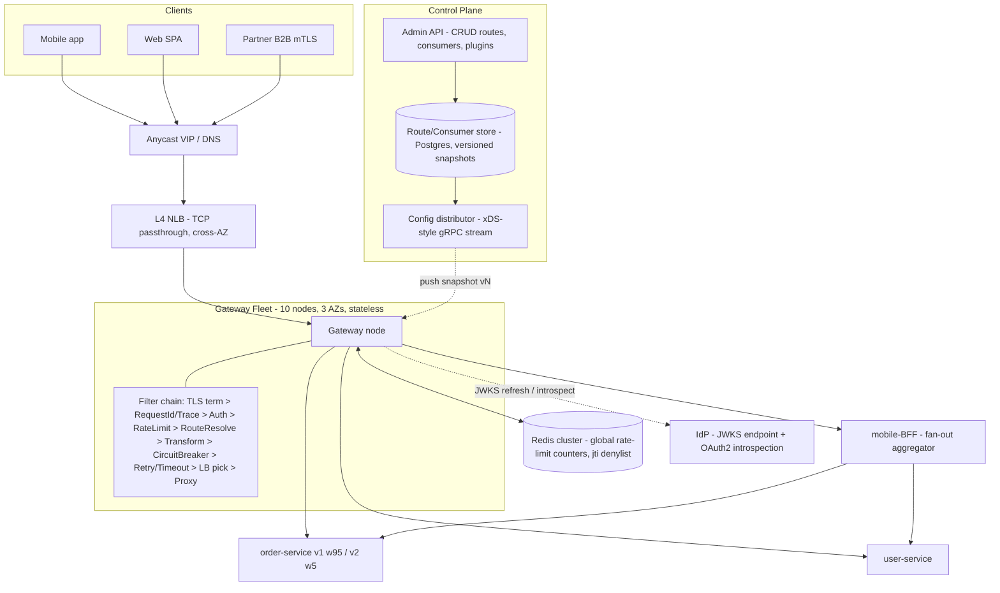
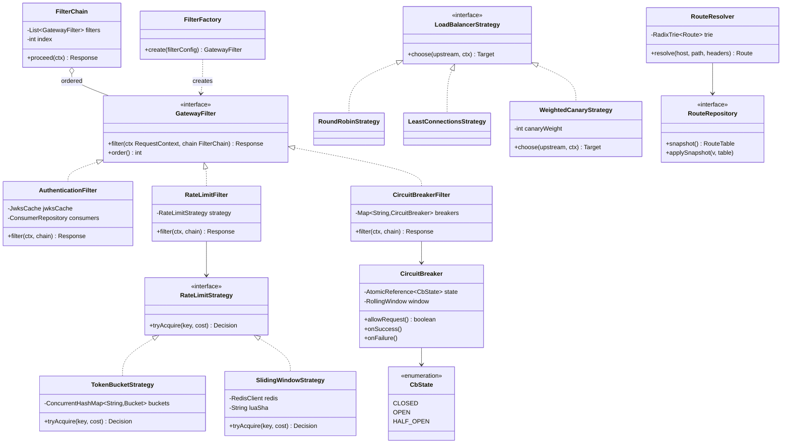

# API Gateway Design

## 1. Problem Statement & Scope

Design the single edge entry point for a microservices platform: it routes, authenticates, rate-limits, transforms, and shields ~200 internal services from ~10M clients (web, iOS, Android, third-party API consumers).

### Functional requirements
- **Routing**: path-based (`/orders/*` → order-service), host-based (`api.example.com` vs `partner.example.com`), header-based (`X-Tenant`, `Accept` version headers), method-based; dynamic route configuration without gateway redeploys.
- **Auth offload**: JWT validation (signature + claims), API keys for partners, OAuth2 token introspection for opaque tokens, mTLS for high-trust B2B channels. Services behind the gateway trust a signed internal identity header — they never re-validate.
- **Rate limiting / throttling**: per-consumer, per-route, per-IP; local (node-level) and global (fleet-level, Redis-backed) limits; return `429` with `Retry-After`.
- **Request/response transformation**: header injection/stripping (`X-Request-Id`, `X-User-Id`), path rewriting (`/v1/orders/{id}` → `/internal/orders/{id}`), protocol translation (external REST → internal gRPC), body transforms for legacy versions.
- **Resilience**: per-route timeouts, retries with budgets, circuit breakers, load shedding.
- **Deploy safety**: canary routing (weighted + sticky), shadow traffic.
- **Observability**: access logs, RED metrics per route, distributed trace initiation (inject `traceparent`).

### Non-functional requirements
- **Latency overhead**: <5ms p50, <20ms p99 added by the gateway itself (excluding upstream time).
- **Throughput**: 100k RPS peak, 30k RPS average.
- **Availability**: 99.99% — the gateway is in the path of every request; it must be *more* available than any service behind it.
- **Config propagation**: route changes visible fleet-wide in <10s, zero dropped requests during config swap.
- **Horizontal scalability**: stateless data plane; only rate-limit counters and route config are shared state.

### Back-of-envelope estimation

**Throughput and nodes**
- Peak 100k RPS. A tuned Envoy/Netty-style proxy on 8 vCPU handles ~20k RPS of L7 work (TLS termination + JWT verify + routing). JWT ES256 verify ≈ 50–100µs of CPU; at 20k RPS that is 1–2 vCPU-seconds/second just for auth — fits.
- Nodes needed: 100,000 / 20,000 = 5 nodes at 100% → run at ≤50% utilization for failure headroom → **10 nodes**, spread over 3 AZs (lose one AZ: 7 nodes × 20k × 0.5 headroom consumed → still survive peak).

**Connections and memory**
- 10M clients, but concurrent connections ≈ clients active in a keep-alive window. Assume 500k concurrent client connections (HTTP/2 multiplexing keeps this down). Per node: 500k / 10 = 50k connections.
- Memory per connection: ~30 KB kernel socket buffers + ~20 KB TLS session + ~50 KB proxy buffers ≈ 100 KB. 50k × 100 KB = **5 GB per node** for connections alone → provision 16 GB nodes.
- Upstream connection pools: 200 services × ~50 pooled conns/service/node = 10k upstream connections per node — negligible vs client side.

**Rate-limit store**
- Suppose 1M distinct rate-limit keys active (consumer × route). Sliding-window counter ≈ 2 counters × 8 B + key ~64 B ≈ 100 B/key → 100 MB in Redis. Trivial.
- Redis ops: if every request did a synchronous check → 100k ops/s; a single Redis node does ~100k–200k simple ops/s, Lua scripts less. This is why we go two-tier (Section 3/4): sync only for strict limits, batched async for the rest, cutting Redis load ~10×.

**Latency budget decomposition (p50 target 5ms)**
- TLS (resumed session): ~0.5ms; routing lookup (radix trie): ~10µs; JWT verify (cached JWKS): ~0.1ms; local rate-limit check: ~5µs; global (Redis, same-AZ RTT): ~1ms when sync; serialization/copy: ~0.5ms. Sum ≈ 2–3ms p50 — budget holds if Redis is same-AZ and JWKS is cached.

**Config scale**: ~2,000 routes, ~50k API-key consumers. Route table ≈ 2,000 × 2 KB = 4 MB — trivially cached in-memory on every node, refreshed by push.

Out of scope: CDN/static assets, GraphQL federation internals, DDoS scrubbing (upstream of us at L3/L4).

## 2. Brute-Force / Naive Design

**Option A: clients call every microservice directly.**
- Each of 200 services independently implements auth. JWT validation logic duplicated 200× — one service forgets to check `exp`, or pins a stale JWKS, and you have a security incident. A key rotation becomes a 200-service coordinated deploy.
- TLS certs and CORS config per service: 200 cert renewals, 200 CORS policies to keep consistent. One misconfigured `Access-Control-Allow-Origin: *` on an authed endpoint is a breach.
- Mobile home screen needs data from 8 services → 8 sequential-ish round trips. At 150ms mobile RTT each, that's 600ms–1.2s of pure network before rendering, and 8× TLS handshakes on cold start. Battery and latency both suffer.
- Rate limiting per service means an abuser gets 200 separate budgets; no global view of a consumer's traffic.
- Every service must be internet-hardened: request smuggling, slowloris, oversized bodies — 200 attack surfaces.

**Option B: single nginx with static config.**
- Better: one TLS/CORS/auth point. But every route change = config file edit + `nginx -s reload` via a config-management pipeline. With 40 teams shipping, that's 30+ route changes/day funneled through one ops-owned file — each a PR + deploy, ~30–60 min lead time, and a single syntax error takes down *all* ingress.
- Static upstreams: no service discovery integration; scaling a service means editing the gateway config.
- nginx OSS has no first-class distributed rate limiting, circuit breaking, or JWT validation (Lua/OpenResty bolt-ons only) — you end up rebuilding a gateway inside nginx anyway.
- One instance = SPOF; at 100k RPS a single box is also a capacity wall.

Both options fail the same interview test: cross-cutting concerns (auth, limits, resilience, routing) are either duplicated N times or frozen in static config. The fix is a horizontally scaled, dynamically configured L7 gateway fleet with a control-plane/data-plane split.

## 3. Evolving the Design

**Step 1 — Direct calls → single reverse proxy.** Put one L7 proxy in front. Wins: one TLS termination point, one CORS policy, stable public hostname, internal topology hidden. New bottleneck: it's one box (capacity + SPOF) and config is static.

**Step 2 — Fleet + L4 front door.** Run N stateless gateway nodes behind an L4 load balancer (NLB) or anycast VIP. 10 nodes @ 50% utilization carry 100k RPS with AZ-failure headroom. Gateways hold no per-request state, so scale-out is linear. New bottleneck: every service still validates tokens itself.

**Step 3 — Auth offload at the gateway.** An `AuthenticationFilter` validates JWTs (JWKS cached, refreshed hourly + on unknown-`kid`), checks API keys against a cached consumer table, and for opaque OAuth2 tokens calls the IdP's introspection endpoint (RFC 7662) with a 60s positive cache. The gateway then mints a short-lived signed internal header (`X-Internal-Identity`, JWT signed with an internal key, 30s TTL) so services do one cheap local verification and never talk to the IdP. mTLS terminates at the gateway for partner channels; the client cert's SAN maps to a consumer ID. Numbers: introspection at 100k RPS uncached would DDoS the IdP; with a 60s cache and ~50k active tokens it drops to <1k RPS. New bottleneck: nothing stops an abusive or buggy client from flooding us.

**Step 4 — Rate limiting: local, then global.** Start with per-node token buckets (lock-free, ~5µs). Problem: 10 nodes × local limit of L gives an effective fleet limit of 10L, and the L4 LB doesn't hash consumers to nodes, so per-node limits are both leaky and unfair. Fix: **two-tier** — a generous local bucket as a cheap first gate and abuse backstop, plus a Redis-backed global limiter (Lua script, atomic) for the real contract limit. Optimization: sync Redis check only for strict/paid quotas; for soft limits, nodes take batches of tokens from Redis (e.g., 100 at a time) and serve locally — Redis QPS falls from 100k to ~1k, at the cost of ±(batch × nodes) burst overshoot. New bottleneck: a slow downstream service ties up gateway connections and failures cascade.

**Step 5 — Circuit breakers, timeouts, retry budgets.** Per-route timeouts (default 2s, chatty endpoints 500ms) with **deadline propagation** (`X-Deadline-Ms` header decremented at each hop). Circuit breaker per (route, upstream-host): rolling 10s error-rate window, open at >50% errors over ≥20 requests, half-open after 5s with ≤3 probe permits. Retries: max 1 retry, only idempotent methods (or POST with idempotency key), jittered exponential backoff — **governed by a retry budget: retries may add at most 10% extra load** (token bucket refilled at 10% of request rate). Why: with 3 naive retries per hop across a 3-hop chain, a flapping leaf service sees up to 4³ = 64× amplification — retries *cause* the outage they're retrying through. The budget caps amplification at 1.1× no matter how bad things get. New bottleneck: every deploy of a service is a cliff-edge cutover.

**Step 6 — Canary routing.** Route table gains weighted upstream groups: `orders-v2: weight 5, orders-v1: weight 95`. For session consistency, sticky canary: hash of user ID or a `canary=true` cookie/header pins a user to one side so they don't flap between versions mid-session. Internal employees get header-forced canary (`X-Canary: always`). Ramp 1% → 5% → 25% → 100% gated on error-rate/latency SLO deltas. New bottleneck: mobile clients are still chatty.

**Step 7 — BFF / aggregation.** Home screen = 8 calls. Introduce **Backends-for-Frontends**: a thin per-client gateway layer (mobile-BFF, web-BFF, partner-API) behind the shared edge gateway. The mobile BFF exposes `/home` which fans out to 8 services *inside the datacenter* (RTT ~1ms, parallel) and returns one tailored payload: 8 × 150ms mobile RTTs → 1 × 150ms + ~30ms internal fan-out. BFFs are owned by the client teams; the edge gateway stays generic. New bottleneck: route changes still require config deploys.

**Step 8 — Dynamic config: control plane / data plane split.** Routes, consumers, and plugin configs live in a datastore (Postgres) behind an **Admin API**. A control plane validates changes, versions them, and pushes snapshots to gateway nodes over a streaming channel (xDS-style gRPC) — or nodes poll every 5s as a simpler v1. Data plane nodes atomically swap an immutable in-memory route table (RCU-style: build new radix trie, flip pointer; in-flight requests finish on the old one). Route change latency: seconds, no redeploy, no dropped requests. Config itself is canaried (Section 7).

End state: stateless L7 data plane fleet + control plane + Redis for shared counters + IdP integration. Each evolution step is a named bottleneck with a mechanism that removes it — that's the narrative to tell in the interview.

## 4. Protocol & Technology Choices — Why This, Not That

### API versioning strategies

| Strategy | Example | Pros | Cons | When it wins |
|---|---|---|---|---|
| URI path | `GET /v1/orders` | Visible, cache-friendly (URL is the cache key), trivially routable at gateway, easy to curl/debug | "Pollutes" URI (same resource, two URLs); coarse — versions whole API surface | **Default for public APIs.** Gateway routes `/v1/*` and `/v2/*` to different upstreams with zero body inspection |
| Custom/Accept header | `Accept: application/vnd.api.v2+json` | Clean URIs; REST-purist (version = representation); fine-grained per-resource | Invisible in logs/browser; intermediary caches must `Vary: Accept`; harder for consumers to discover; gateway must parse headers to route | Internal APIs with sophisticated consumers; media-type-driven hypermedia APIs |
| Query param | `GET /orders?version=2` | Easy to add, visible | Mixes versioning with filtering semantics; caches treat it inconsistently; easy to omit → ambiguous default | Quick experiments; optional behavior flags rather than true versions |
| Content negotiation (proper) | `Accept` + server-driven negotiation, `406` on mismatch | Most HTTP-correct; supports gradual per-representation evolution | Highest client complexity; poor tooling; teams get it wrong | Long-lived hypermedia APIs (rare in practice) |

**Choice**: URI versioning for the public surface — the gateway does path-prefix routing to versioned upstreams and can lifecycle each version independently (deprecation headers, sunset dates, per-version rate limits). Header versioning would win for an internal platform where URL aesthetics and per-resource evolution matter and all consumers are in-house. State the rule: *route-level* versioning at the gateway, *field-level* evolution (additive, tolerant readers) inside a version — you should ship v2 rarely.

### Rate-limit algorithms

| Algorithm | Memory/key | Accuracy | Burst handling | Cost | Verdict |
|---|---|---|---|---|---|
| Token bucket | 2 fields (tokens, lastRefill) | Exact over time, allows bursts up to capacity | Configurable burst = bucket size | O(1), lock-free CAS | **Chosen for per-consumer limits** — bursts are a feature for API clients |
| Leaky bucket (as queue) | queue | Smooths output perfectly | No bursts — queues or drops | O(1) + queue memory & added latency | Traffic *shaping* (e.g., pacing calls to a fragile legacy upstream), not client limiting |
| Fixed window | 1 counter | Up to 2× limit at window boundary | Boundary burst bug | O(1) cheapest | Only for rough abuse caps where 2× error is fine |
| Sliding window log | timestamp per request | Perfect | Exact | O(requests) memory — 10k RPM key = 10k timestamps | Low-volume, high-value ops (login attempts, password reset) |
| Sliding window counter | 2 counters | ~99% accurate (weighted interpolation of prev+curr window) | Good | O(1) | **Chosen for the Redis global tier** — near-exact at fixed cost |

**Choice**: token bucket locally (burst-friendly, CAS-cheap), sliding window counter in Redis globally (bounded memory, no boundary artifact). Sliding window log would win where exactness per-event matters more than memory (auth endpoints).

### Distributed limit sync: sync Redis vs async batch

| Approach | Accuracy | Latency cost | Redis load | Failure mode |
|---|---|---|---|---|
| Sync check per request (Lua) | Exact fleet-wide | +1 RTT (~1ms same-AZ) per request | 100k ops/s at peak | Redis down = decide fail-open/closed per route |
| Async batch (nodes lease token chunks) | Overshoot ≤ batch × nodes | ~0 (local decrement) | ~1k ops/s | Nodes coast on leased tokens; degrade to local-only |

**Choice**: sync for strict quotas (billing-backed partner tiers), async batch for soft fairness limits. Pure sync would win at lower RPS (<10k) where 1ms and Redis load are non-issues and exactness simplifies support.

### Gateway products

| Product | Model | Strengths | Weaknesses | Pick when |
|---|---|---|---|---|
| Kong | nginx/OpenResty + Lua plugins, Postgres or DB-less config | Rich plugin ecosystem, mature admin API, hybrid control plane | Lua plugin perf ceiling; enterprise features paywalled | You want batteries-included API management (keys, portals) fast |
| Envoy-based (Gloo, Contour, Ambassador/Emissary, or raw Envoy + custom xDS) | C++ proxy, dynamic xDS APIs, WASM/ext_proc filters | Best-in-class perf & observability, first-class dynamic config, same proxy as your mesh | You build/operate the control plane; steeper learning curve | **Chosen** — large eng org, need custom filters + mesh consistency |
| AWS API Gateway | Fully managed | Zero ops, IAM/Cognito/Lambda native, usage plans | $3.50/M requests → 100k RPS avg 30k ≈ 78B req/mo ≈ $270k+/mo vs ~$5k of EC2; 29s hard timeout; limited custom logic; lock-in | Small teams, spiky/low volume, serverless stacks |
| Spring Cloud Gateway | JVM, Netty, filters in Java | Filters in your app language, easy custom logic, Spring ecosystem | JVM memory/GC per node; you own scaling & HA; smaller perf ceiling than Envoy | JVM shop wanting deep custom gateway logic (also our LLD reference model in Section 6) |
| nginx/OpenResty (raw) | Static config + Lua | Ubiquitous, fast, battle-tested | Dynamic config, distributed RL, CB all DIY | Simple ingress, few routes, low change rate |

### Gateway vs service mesh vs load balancer

| Dimension | L4 LB (NLB) | L7 LB (ALB) | API Gateway | Service mesh (sidecar/ambient) |
|---|---|---|---|---|
| Traffic direction | North-south front door | North-south | **North-south** (edge) | **East-west** (service-to-service) |
| OSI layer | L4 (TCP/UDP passthrough) | L7 (HTTP routing) | L7 + API semantics | L4+L7 per hop |
| Knows about | IPs/ports/flows | Paths, hosts | Consumers, API keys, versions, quotas, transformations | Service identity (SPIFFE/mTLS), per-hop retries/CB, traffic policy |
| Auth | None | TLS term, basic OIDC | JWT/API key/OAuth2/mTLS, consumer mgmt | Workload mTLS (machine identity, not end-user) |
| Lives | In front of gateway fleet | Edge | Edge, one logical tier | Beside every service instance |
| Config unit | Target groups | Rules | Routes + plugins + consumers | Per-service traffic policy |

**Answer to "do you need all three?"**: yes at scale, and they compose: anycast/L4 LB (dumb, ultra-reliable packet spreading) → gateway (client-facing API semantics) → mesh (zero-trust and resilience *between* services). The gateway authenticates *users*; the mesh authenticates *workloads*. A mesh ingress gateway can replace a standalone gateway for internal platforms; a standalone gateway wins when you need API products: keys, quotas, monetization, developer portal.

### JWT local validation vs token introspection

| | Local JWT validation | Introspection (RFC 7662) |
|---|---|---|
| Latency | ~0.1ms (cached JWKS) | +1 RTT to IdP (mitigate w/ cache) |
| Revocation | Only at token expiry (keep TTL ≤ 5–15 min) | Immediate |
| IdP load | JWKS fetch on rotation only | Per request (or per cache-TTL) |
| Token privacy | Claims visible to holder | Opaque token, claims stay server-side |

**Choice**: local validation with short-lived access tokens + refresh tokens; a small Redis denylist (jti of force-revoked tokens, checked in ~50µs) covers the "fire the employee now" case. Introspection wins when tokens must be opaque or revocation must be truly instant and IdP RTT is acceptable.

## 5. High-Level Design (HLD)



### Read path: one request through the filter chain

`GET /v1/orders/42`, `Authorization: Bearer <jwt>`:

1. **L4 LB** picks a healthy gateway node (5-tuple hash); TCP/TLS passthrough — TLS terminates *at the gateway* so L7 filters can run.
2. **TLS + protocol**: session resumed (~0.5ms); HTTP/2 stream accepted; body size capped (1 MB default) — reject early, cheaply.
3. **RequestId/Tracing filter**: assign `X-Request-Id`, start span, inject `traceparent`.
4. **Route resolution**: radix-trie lookup on host+path (`api.example.com` + `/v1/orders/*`) → route `orders-v1`; header predicates evaluated if present. ~10µs.
5. **AuthenticationFilter**: JWT header parsed; `kid` → cached JWKS key; verify ES256 signature, `exp`, `iss`, `aud`; check jti denylist (local bloom filter, Redis on hit). Attach `Principal{sub, scopes, tier}` to context. Reject → `401`, chain short-circuits.
6. **RateLimitFilter**: key = `consumer:route`. Local token bucket take (5µs). Tier = paid strict → sync Redis Lua sliding-window check (~1ms). Over limit → `429` + `Retry-After`.
7. **TransformFilter**: strip hop-by-hop and client-supplied `X-Internal-*` headers (spoof defense); mint `X-Internal-Identity` (signed, 30s TTL); rewrite path per route config.
8. **CircuitBreakerFilter**: breaker for `orders-v1` is CLOSED → proceed. (OPEN → immediate `503` + `Retry-After`, no upstream call.)
9. **Canary/LB pick**: weighted choice — hash(sub) mod 100 < 5 → v2 pool, else v1; within pool, least-connections host selection.
10. **Proxy filter**: connection from per-route pool; per-try timeout 2s; `X-Deadline-Ms` forwarded. On 5xx/connect-error and method idempotent and retry-budget token available → one retry against a *different* host, jittered backoff.
11. **Response path** (filters unwind in reverse): record outcome in breaker window, emit metrics/log, add CORS + security headers, stream body to client (no full buffering unless a body transform demands it).

Gateway-added latency: ~2–3ms p50, dominated by TLS and the optional Redis RTT.

### Data model

**Route** (control-plane store; compiled into an immutable in-memory trie on the data plane):

```sql
CREATE TABLE routes (
    id              UUID PRIMARY KEY,
    name            TEXT UNIQUE NOT NULL,        -- "orders-v1"
    priority        INT NOT NULL DEFAULT 0,      -- tie-break for overlapping matches
    match_hosts     TEXT[],                      -- ["api.example.com"]
    match_paths     TEXT[],                      -- ["/v1/orders/*"] prefix|exact|regex
    match_methods   TEXT[],                      -- ["GET","POST"] null = all
    match_headers   JSONB,                       -- {"X-Tenant": "acme"}
    upstream_id     UUID REFERENCES upstreams(id),
    filters         JSONB,       -- ordered: [{type:"jwt-auth",cfg:{...}},{type:"rate-limit",cfg:{rpm:1000,burst:100,scope:"consumer"}},{type:"rewrite",cfg:{stripPrefix:"/v1"}}]
    timeout_ms      INT NOT NULL DEFAULT 2000,
    retry_policy    JSONB,       -- {maxRetries:1, retryOn:["5xx","connect-failure"], perTryTimeoutMs:1000, budgetPct:10}
    version         BIGINT NOT NULL              -- monotonic, for config snapshots
);

CREATE TABLE upstreams (
    id        UUID PRIMARY KEY,
    name      TEXT,             -- "order-service"
    discovery TEXT,             -- "dns:orders.svc" | "static"
    targets   JSONB,            -- [{group:"v1",weight:95},{group:"v2",weight:5}]  <- canary weights live here
    lb_policy TEXT,             -- round_robin | least_conn | weighted_canary
    cb_config JSONB,            -- {windowSec:10, minRequests:20, errorPct:50, openMs:5000, halfOpenPermits:3}
    pool      JSONB             -- {maxConns:50, maxPending:100, connectTimeoutMs:250}
);

CREATE TABLE consumers (
    id         UUID PRIMARY KEY,
    name       TEXT,            -- "acme-corp"
    tier       TEXT,            -- free | pro | enterprise -> maps to limit plans
    key_hash   TEXT,            -- SHA-256 of API key; prefix (first 8 chars) stored for lookup
    jwt_sub    TEXT,            -- or OAuth client_id
    mtls_san   TEXT,            -- SAN pinning for mTLS consumers
    limits     JSONB            -- {"orders-v1": {rpm: 10000}}
);
```

API keys are stored **hashed** (like passwords); the gateway looks up by key-prefix then compares hash. Consumers cache on nodes with the same push mechanism as routes.

### Admin API & config propagation

- `POST/PUT/DELETE /admin/routes`, `/admin/upstreams`, `/admin/consumers`, `/admin/plugins` — validated (predicate syntax, filter config schema, no route shadowing without explicit priority), then committed with a new global `config_version`.
- **Propagation — push (chosen)**: distributor holds a gRPC stream per node (xDS-style); on commit, sends the delta or full snapshot with version N. Node builds the new trie off to the side, health-checks it (compile errors → NACK, keep vN-1), then pointer-swaps. Nodes report ACKed version → control plane dashboard shows fleet convergence. Sub-second propagation.
- **Poll (rejected as end-state, fine as v1)**: node polls `/config?since=vN` every 5s. Simpler (no stream management), but 5s worst-case staleness and thundering polls at scale. Would win for a small fleet or DB-less (declarative file) deployments.
- Every snapshot is immutable and versioned → instant rollback = re-push vN-1 (see Section 7, config-push-gone-bad).

## 6. Low-Level Design (LLD)

The core abstraction is a **filter/middleware chain** implemented with **Chain of Responsibility**: each cross-cutting concern is a `GatewayFilter` that either short-circuits (auth failure, rate limit, open breaker) or calls `chain.proceed()`. Filters compose per-route from config via a **Factory**; interchangeable algorithms (limiting, load balancing) are **Strategies**; breaker behavior is a **State** machine; config access is behind a **Repository**.



Patterns, named, and why:
- **Chain of Responsibility** (`FilterChain`): each filter handles or delegates; adding a concern = adding a filter, no core changes (Open/Closed). Short-circuiting is first-class — an auth failure never touches the limiter or upstream.
- **Strategy** (`RateLimitStrategy`, `LoadBalancerStrategy`): algorithm swappable per route from config; test each in isolation.
- **State** (`CircuitBreaker` CLOSED/OPEN/HALF_OPEN): transitions are explicit and race-checked with CAS rather than if-soup.
- **Factory** (`FilterFactory`): turns JSON filter config from the route table into filter instances; the config push path never `new`s concrete classes.
- **Repository** (`RouteRepository`): data plane reads an immutable snapshot; storage/propagation details (poll vs xDS) hidden behind the interface.

### (a) Token bucket — lazy refill + CAS locally, Lua for distributed take

No background refill threads: refill is computed *lazily* from elapsed time at take-time, and the update is an atomic CAS so hot keys don't lock.

```java
final class TokenBucket {
    private final long capacity;          // burst size
    private final double refillPerNanos;  // rate / 1e9
    // packed state: tokens (scaled x1e6) and lastRefillNanos, swapped atomically
    private final AtomicReference<State> state;
    record State(double tokens, long lastNanos) {}

    boolean tryAcquire(int cost) {
        while (true) {
            State cur = state.get();
            long now = System.nanoTime();
            double refilled = Math.min(capacity,
                cur.tokens() + (now - cur.lastNanos()) * refillPerNanos);
            if (refilled < cost) {
                // still update lastNanos lazily? No — leave state, deny cheaply.
                return false;
            }
            State next = new State(refilled - cost, now);
            if (state.compareAndSet(cur, next)) return true;
            // CAS lost: another thread took tokens; loop and recompute
        }
    }
}
```

Distributed take — Redis Lua so read-compute-write is atomic server-side (no race between GET and SET across gateway nodes):

```lua
-- KEYS[1]=bucket key  ARGV: 1=capacity 2=refill_per_ms 3=now_ms 4=cost 5=ttl_ms
local s = redis.call('HMGET', KEYS[1], 'tokens', 'ts')
local tokens = tonumber(s[1]) or tonumber(ARGV[1])
local ts     = tonumber(s[2]) or tonumber(ARGV[3])
tokens = math.min(tonumber(ARGV[1]),
                  tokens + (tonumber(ARGV[3]) - ts) * tonumber(ARGV[2]))
local allowed = tokens >= tonumber(ARGV[4])
if allowed then tokens = tokens - tonumber(ARGV[4]) end
redis.call('HMSET', KEYS[1], 'tokens', tokens, 'ts', ARGV[3])
redis.call('PEXPIRE', KEYS[1], ARGV[5])   -- self-cleaning: idle keys expire
return allowed and 1 or 0
```

Note: pass `now` from the caller (or use a Redis-side clock consistently) — never mix clocks across nodes for the same key. Batch variant: `ARGV[4] = 100` leases a chunk that the node then serves from its local bucket.

### (b) Circuit breaker — rolling error window + half-open probe permits

```java
final class CircuitBreaker {
    enum St { CLOSED, OPEN, HALF_OPEN }
    private final AtomicReference<St> state = new AtomicReference<>(St.CLOSED);
    private volatile long openedAtMs;
    private final RollingWindow window;            // ring of 10 x 1s buckets: {total, errors}
    private final AtomicInteger halfOpenPermits = new AtomicInteger(0);
    private final int maxProbes = 3, minRequests = 20, errorPct = 50;
    private final long openMs = 5000;

    boolean allowRequest() {
        St s = state.get();
        if (s == St.CLOSED) return true;
        if (s == St.OPEN) {
            if (System.currentTimeMillis() - openedAtMs >= openMs
                    && state.compareAndSet(St.OPEN, St.HALF_OPEN)) {
                halfOpenPermits.set(maxProbes);    // exactly one thread arms probes
            } else if (state.get() != St.HALF_OPEN) {
                return false;                      // still cooling down -> fast 503
            }
        }
        // HALF_OPEN: admit at most maxProbes concurrent probes, reject the rest
        while (true) {
            int p = halfOpenPermits.get();
            if (p <= 0) return false;
            if (halfOpenPermits.compareAndSet(p, p - 1)) return true;
        }
    }

    void onSuccess() {
        window.record(false);
        if (state.get() == St.HALF_OPEN) {
            // require ALL probes to succeed before closing (conservative)
            if (window.recentConsecutiveSuccesses() >= maxProbes
                    && state.compareAndSet(St.HALF_OPEN, St.CLOSED)) {
                window.reset();                    // don't close then instantly re-open on stale errors
            }
        }
    }

    void onFailure() {
        window.record(true);
        St s = state.get();
        if (s == St.HALF_OPEN) { trip(St.HALF_OPEN); return; }  // one failed probe -> re-open
        if (s == St.CLOSED
                && window.total() >= minRequests                 // volume guard: no tripping on 1/2 errors
                && window.errorPercent() >= errorPct) {
            trip(St.CLOSED);
        }
    }

    private void trip(St from) {
        if (state.compareAndSet(from, St.OPEN)) openedAtMs = System.currentTimeMillis();
    }
}
```

Interview points: (1) the `minRequests` volume guard prevents tripping on tiny samples; (2) half-open admits a *bounded* number of probes — without the permit counter, the instant the breaker half-opens, the full 10k RPS floods a barely recovered service (thundering herd, Section 7); (3) `window.reset()` on close avoids flapping on residual errors.

### (c) Filter chain — proceed() recursion (Chain of Responsibility)

```java
public interface GatewayFilter {
    Response filter(RequestContext ctx, FilterChain chain);
}

public final class FilterChain {
    private final List<GatewayFilter> filters;  // ordered at build time from route config
    private final int index;

    public FilterChain(List<GatewayFilter> filters) { this(filters, 0); }
    private FilterChain(List<GatewayFilter> filters, int index) {
        this.filters = filters; this.index = index;
    }

    public Response proceed(RequestContext ctx) {
        if (index >= filters.size()) {
            return ctx.proxyToUpstream();        // terminal action: forward to service
        }
        // hand the CURRENT filter a chain positioned at the NEXT one
        return filters.get(index).filter(ctx, new FilterChain(filters, index + 1));
    }
}

// Example filter showing short-circuit AND response-path work:
public final class RateLimitFilter implements GatewayFilter {
    private final RateLimitStrategy strategy;
    public Response filter(RequestContext ctx, FilterChain chain) {
        Decision d = strategy.tryAcquire(ctx.limitKey(), 1);
        if (!d.allowed()) {
            return Response.status(429)
                .header("Retry-After", d.retryAfterSeconds())
                .header("X-RateLimit-Remaining", "0");     // short-circuit: no proceed()
        }
        Response resp = chain.proceed(ctx);                  // pre-work above, post-work below
        return resp.withHeader("X-RateLimit-Remaining", String.valueOf(d.remaining()));
    }
}
```

Each `filter()` call frames pre-processing (before `proceed`) and post-processing (after it returns) around everything downstream — the call stack *is* the onion. The chain object is immutable (new index per link), so it's thread-safe and reusable; in a reactive stack, `proceed` returns `Mono<Response>` and the recursion becomes operator composition, same shape.

## 7. Deep Dives & Failure Modes

**Gateway as SPOF.** It's in the path of 100% of traffic, so: fleet of N stateless nodes across 3 AZs behind anycast/L4 LB; LB health checks hit a `/healthz` that verifies route table loaded + upstream connectivity sample, not just process-up; capacity rule N+2 at peak (survive one AZ + one node). Deploy the gateway itself with rolling + connection draining (stop accepting, finish in-flight, 30s grace). Because nodes are stateless, MTTR = LB eject time (~2 health-check intervals, ~10s).

**Redis rate-limit store down.** Decide *per route*, in config: **fail-open** for revenue paths (a free 30s of unmetered traffic beats a total outage — the local token buckets still cap abuse at node-level limits), **fail-closed** for expensive/abuse-prone endpoints (auth attempts, SMS-send). Implementation: Redis call wrapped in its own 5ms timeout + mini circuit breaker; on trip, fall back to local buckets scaled to `globalLimit / activeNodes` (node count from the control plane heartbeat) — approximate fairness, no shared state. Alarm loudly; global accuracy is degraded, not correctness.

**Retry storms and budgets.** Amplification math: 3 hops, 3 retries each → 4×4×4 = 64× load on the leaf during a brownout; the retries extend the brownout, which triggers more retries — a self-sustaining storm. Defenses, layered: (1) **retry budget** — per-target token bucket refilled at 10% of live request rate; no budget token, no retry, period; (2) **deadline propagation** — `X-Deadline-Ms` shrinks per hop; never retry with <2× per-try latency remaining (a retry that can't finish is pure waste); (3) **jittered exponential backoff** (full jitter: `rand(0, base·2^attempt)`) so retriers don't synchronize; (4) retry against a *different* host; (5) prefer **hedging** for tail latency on idempotent reads (send 2nd copy at p95 mark, cancel loser) — hedging attacks tail latency, retries attack transient failure; don't conflate them, and hedges also draw from a budget.

**Thundering herd on circuit-close.** Breaker half-opens and 10k RPS hits a service that just restarted with cold caches → instant re-trip, flap forever. Fixes: bounded half-open probe permits (LLD above); on close, **ramped recovery** — admit 10% → 25% → 50% → 100% over ~30s rather than a step function; jitter `openMs` ±20% across gateway nodes so 10 nodes don't probe simultaneously; upstream should also do request-priority load shedding while warming.

**Config push gone bad.** A bad route snapshot can blackhole all traffic in seconds — config is the gateway's biggest real-world outage source. Defenses: schema + semantic validation at the Admin API (unreachable upstreams, shadowed routes); **canary the config**: push vN to 1 node, watch error-rate/RPS deltas for 60s, then fleet; nodes keep **last-known-good** on disk and boot from it if the control plane is down (data plane must start without the control plane — availability of the two is decoupled); one-click rollback = re-push vN-1 (snapshots immutable); auto-rollback if fleet-wide 5xx jumps >X% within 2 min of a push.

**Slow upstream exhausting gateway resources.** One service going slow (2s responses) at 10k RPS holds 20k concurrent requests' worth of gateway memory/connections — it can take down the *gateway* and thus everyone. Bulkheading: **per-route connection pools** with `maxConns` + `maxPending`; overflow → immediate `503` for *that route only*; per-route timeouts strictly enforced; **load shedding by priority** when node CPU >85% or queue depth breaches — shed batch/low-priority routes first (priority tag on route config), keep checkout alive; backpressure: stop reading the client request body when the upstream write stalls (don't buffer unbounded).

**JWKS endpoint down.** Never let IdP availability gate request auth: cache JWKS keys with `kid` indexing; on refresh failure, serve stale keys within a grace period (hours — key rotation overlaps old+new keys anyway, so stale keys stay valid); refresh in the background, never inline on the request path; unknown `kid` triggers one rate-limited (single-flight) refresh, not a per-request stampede. Only fully unreachable-for-days IdP forces a policy call (fail-closed for auth is the default answer).

**Hot key in the rate limiter.** One enterprise consumer at 20k RPS hammers a single Redis key → that shard saturates. Fixes: batch-leasing (each node leases 500 tokens per round-trip → 40 Redis ops/s instead of 20k); or **sharded counters** — split key into `key:{0..9}`, each shard gets limit/10, node hashes to a shard (accept ±shard-skew inaccuracy); or dedicate local-only limits for whitelisted mega-consumers with async reconciliation for billing.

**WebSockets / long-lived connections.** Gateway must support HTTP/1.1 Upgrade / HTTP/2 CONNECT passthrough; auth happens once at handshake, so enforce **max connection lifetime** (e.g., 1h, then force reconnect) or in-band re-auth, since a JWT valid at handshake may be revoked mid-connection; connection draining on deploy needs a longer grace or client-side reconnect logic; per-node connection *count* limits (long-lived conns consume the 100 KB/conn budget indefinitely); rate-limit *messages*, not just connections. Idle timeout distinct from request timeout.

**Idempotency keys for safe POST retries.** Retrying POST risks double-charge. Client sends `Idempotency-Key: <uuid>`; gateway (or service) stores key → {status, response-hash} in Redis with 24h TTL; duplicate key within TTL → replay stored response, don't re-execute; in-flight duplicate → `409` or wait. Gateway policy: POST is retryable *only* when an idempotency key is present. This is what turns "never retry POST" into "retry anything safely."

## 8. Trade-off Summary & Interview Soundbites

| Decision | Trade-off accepted |
|---|---|
| Central gateway for all cross-cutting concerns | Gateway becomes critical infra: must be the most available, best-operated tier you run |
| URI versioning (`/v1/`) | "Impure" REST; two URLs per resource — bought: trivial routing, caching, debuggability |
| Local JWT validation, short TTLs + jti denylist | Revocation delayed up to token TTL — bought: zero IdP dependency on the hot path |
| Two-tier rate limiting (local bucket + Redis global) | Bounded overshoot (batch × nodes) and Redis as a soft dependency — bought: 10× less Redis load, µs hot path |
| Retry budget capped at 10% | Some legitimately transient failures won't be retried under stress — bought: amplification capped at 1.1× (vs 64×) |
| Push (xDS) config propagation | Control plane complexity: streams, ACK tracking — bought: sub-second config, fleet convergence visibility |
| Canary weights in the gateway | Gateway config becomes part of every service's deploy pipeline — bought: 1% blast radius on releases |
| BFF layer per client type | More deployables, owned by client teams — bought: 8 mobile RTTs → 1; edge gateway stays generic |
| Fail-open on Redis loss (default) | Brief unmetered traffic — bought: rate limiting never causes a total outage on revenue paths |

### Soundbites
- "A retry without a budget is a self-inflicted DDoS — three retries over three hops is 64× amplification."
- "The gateway authenticates users; the mesh authenticates workloads. North-south vs east-west."
- "Fail-open on the limiter, fail-closed on auth — losing accuracy is a page, losing authentication is a breach."
- "Half-open without probe permits is a thundering herd with a delay timer."
- "Data plane must boot without the control plane — last-known-good config on disk, always."
- "Version at the route level, evolve at the field level — shipping /v2 should be rare and boring."
- "Config pushes cause more gateway outages than traffic does — canary your config like you canary your code."
- "Deadlines propagate down, retries budget up."

### Common follow-ups
- **Where do you terminate TLS?** At the gateway — L7 filters need plaintext. The L4 LB does TCP passthrough (or TLS with re-encrypt if compliance demands edge termination). Gateway→service re-encrypts via mesh mTLS: "terminate and re-originate," never plaintext east-west.
- **Gateway vs mesh — do you need both?** At scale, yes: gateway for north-south API semantics (consumers, quotas, versioning, transformation), mesh for east-west zero-trust and per-hop resilience. Small org: a mesh ingress gateway can serve both roles until you need API-product features.
- **How do you rate limit fairly across gateway nodes?** Not with per-node limits (L4 hashing makes them leaky and unfair). Shared counters in Redis via atomic Lua; batch token leasing for hot keys; on Redis loss, fall back to `globalLimit / activeNodes` locally.
- **How do you avoid the gateway becoming a deploy bottleneck for teams?** Self-serve Admin API with per-team route namespaces and validation; teams own their routes and filter configs; platform team owns the data plane. Config changes, not gateway deploys.
- **Won't the gateway become a monolith of business logic?** Guard rail: gateway filters are *generic* (auth, limits, transforms driven by config). Anything client-shaped goes in a BFF; anything domain-shaped goes in a service. If a filter mentions a business noun, it's in the wrong tier.
- **How big can added latency get?** Budget it: ~2–3ms p50 (TLS resume + JWT + trie + local bucket); the p99 tail comes from sync Redis and JWKS misses — both are cache/batch problems, both fixable, both worth calling out unprompted.
