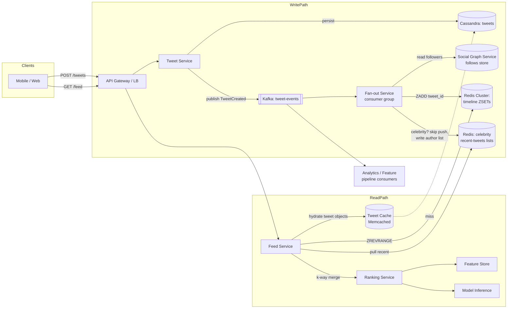
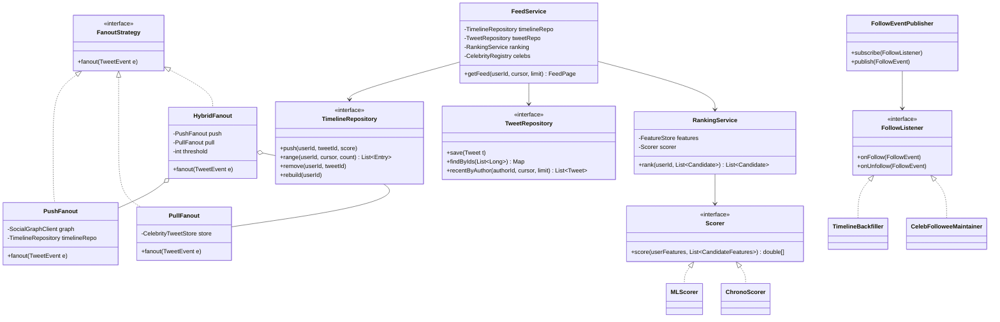

# Twitter/X Home Feed

## 1. Problem Statement & Scope

Design the home timeline: a reverse-chronological / ranked feed of tweets from accounts a user follows, delivered with low latency at massive read fan-in.

### Functional Requirements
- Post a tweet (text <= 280 chars, optional media references).
- Follow / unfollow users.
- Fetch home feed: paginated list of tweets from followees, ranked (relevance) with a chronological fallback.
- Feed should reflect new tweets within seconds (near-real-time, not strictly real-time).
- Support deletes: a deleted tweet must disappear from feeds "soon" (eventual, minutes-level SLO).

### Out of Scope (state this explicitly in the interview)
- Search, trends, notifications, DMs, ads insertion (mention ads slot in ranking as extension).
- Media storage/CDN pipeline (treat media as opaque URLs).

### Non-Functional Requirements
- **Read-heavy**: feed reads dominate tweet writes by ~100:1 or more.
- **Latency**: p50 < 200 ms, p99 < 500 ms for `GET /feed`.
- **Availability > consistency**: stale feed (missing a tweet for 30 s) is acceptable; downtime is not. Target 99.99% on the read path.
- **Eventual consistency** for fan-out; strong consistency only for the user's own tweets ("read-your-writes" for self).
- **Scale horizontally**: no single machine holds all timelines.

### Back-of-Envelope Estimation

Assumptions:
- 500M DAU.
- Tweets: ~10% of DAU post, avg 2 tweets/day -> 500M x 0.1 x 2 = **100M tweets/day**.
- Feed reads: each DAU opens feed ~10 times/day -> 500M x 10 = **5B feed reads/day**.
- Avg followers per user: ~200 (median far lower; distribution is heavily skewed — key design driver).

QPS:
- Tweet writes: 100M / 86,400 s ≈ **1,160 writes/s avg**, peak ~3-5x -> **~5K writes/s**.
- Feed reads: 5B / 86,400 ≈ **58K reads/s avg**, peak -> **~200K reads/s**.
- Read:write ≈ 50:1 on request counts alone — before fan-out.

Fan-out write amplification (the number that shapes the whole design):
- Fan-out on write: 100M tweets/day x 200 avg followers = **20B timeline insertions/day** ≈ 230K inserts/s avg, ~1M/s peak. Each insert is a small Redis op — feasible across a cluster, but a celebrity with 100M followers turns 1 tweet into **100M inserts** (at 1M inserts/s that's 100 s of cluster capacity for one tweet). This single observation justifies the hybrid approach.

Storage:
- Tweet: ~1 KB with metadata -> 100M/day x 1 KB = **100 GB/day**, ~36 TB/year raw; x3 replication ≈ 110 TB/year. 5 years ≈ 550 TB — sharded store required.
- Timeline cache: store only tweet IDs. 8 B ID (+ ~12 B overhead in Redis) x 800 entries/user x 500M active users ≈ 500M x 800 x 20 B = **8 TB of RAM** — a moderately large Redis cluster (~100 nodes at 80 GB usable each). Caching only *active* users cuts this substantially (Section 3, step 5).

Bandwidth:
- Read path: 200K req/s x ~40 tweets x 1 KB ≈ **8 GB/s egress** at peak — CDN-cache the static parts (media, avatars); the JSON itself is served from the app tier.

## 2. Brute-Force / Naive Design

One SQL database, two tables, compute the feed at read time:

```sql
SELECT t.*
FROM tweets t
JOIN follows f ON f.followee_id = t.author_id
WHERE f.follower_id = :user_id
ORDER BY t.created_at DESC
LIMIT 40;
```

Single app server + single MySQL instance. Writes are trivial: `INSERT INTO tweets`.

### Why it breaks — with numbers
1. **Query cost**: for a user following 1,000 accounts, the DB must locate the recent tweets of 1,000 authors and merge-sort them. Even with an index on `(author_id, created_at)`, that is ~1,000 index range scans per feed request. At 200K feed reads/s -> **200M index scans/s**. A tuned MySQL box does maybe 10-50K simple lookups/s. You are 4 orders of magnitude short.
2. **Hot working set**: the join touches the `follows` table (500M users x 200 avg = **100B follow edges**, ~2-4 TB) plus recent tweets. Doesn't fit one machine's RAM; disk-bound joins push p99 into seconds.
3. **Single writer**: 5K tweet writes/s plus 200K read queries/s on one primary — lock contention, replication lag if you add replicas, and replicas don't fix the per-request join cost anyway (they replicate it).
4. **No ranking**: an ML-ranked feed needs feature hydration and scoring over hundreds of candidates per request — impossible to bolt onto a synchronous SQL join within 200 ms.

Verdict: correct, simple, and dead at ~1/1000th of target scale. Its real value in the interview is as the baseline whose read-time work we systematically move to write time.

## 3. Evolving the Design

Narrate each bottleneck -> fix, in order:

**Step 1 — Read-time join is too slow -> precompute timelines (fan-out on write).**
Move work from the read path (200K/s) to the write path (5K/s). When a user tweets, a fan-out service looks up their followers and pushes the tweet ID into each follower's cached timeline (Redis list/sorted set). Reads become a single O(1)-ish cache fetch of ~800 IDs plus hydration. This is the classic "do work proportional to writes, not reads" move — valid because writes are 50x rarer.

**Step 2 — Celebrity write amplification.**
Fan-out cost is `tweets/s x followers`. For the median user (200 followers) it's cheap. For a celebrity with 100M followers, one tweet = 100M cache inserts: minutes of cluster time, huge fan-out lag (followers see the tweet late), Kafka backlog, and wasted work (most of those 100M followers won't open the app before the entry ages out of their 800-entry cache).

**Step 3 — Hybrid fan-out.**
Split authors by follower count with a threshold (e.g., **>10K followers = "celebrity"**, tuned empirically — Twitter historically used a similar cutoff, and >10K covers <0.1% of accounts but a large fraction of edges):
- Normal authors: push (fan-out on write) as before.
- Celebrities: **no fan-out**. Their tweets go only to a per-author "recent tweets" list. At read time, the feed service takes the user's celebrity followees (bounded — users follow few celebrities, typically <50), pulls each one's recent tweets, and **k-way merges** them with the precomputed timeline.
This bounds write amplification at 10K per tweet and bounds read-time pull work at (#celebrity followees x small fetch), each of which is a hot, cache-resident read. Edge case: a user crosses 10K followers -> flip a flag; existing cached entries stay, new tweets switch to pull. Reverse transition on decay is lazy.

**Step 4 — Chronological merge isn't engagement-optimal -> ranking layer.**
Insert a ranking pipeline on the read path, after candidate retrieval:
1. **Candidate generation**: ~500-1,000 candidates = cached timeline entries + celebrity pull + (extension) out-of-network candidates from a graph/embedding service (GraphJet/SimClusters-style "in-network vs out-of-network" split).
2. **Feature hydration**: batch-fetch features per (user, tweet) pair — author affinity, tweet engagement counts (likes/retweets so far), content type, recency, user's historical engagement rates — from a low-latency feature store (Redis/Memcached-backed, precomputed by stream jobs).
3. **ML scoring**: a model (logistic regression -> GBDT -> multi-task DNN as the evolution story) predicts P(engagement) per candidate; score = weighted sum of predicted actions (like, reply, retweet, dwell). Served by a model-inference service; budget ~50-100 ms for the whole scoring batch.
4. **Re-ranking / dedup**: business rules on top of raw scores — dedup by tweet ID and by retweet-of-same-original, author diversity (max N consecutive from one author), drop blocked/muted authors, drop already-seen tweets (bloom filter of impression history), inject "in case you missed it" and ads slots.
Keep ranking **stateless and read-side** so the write path stays simple and ranking models can be redeployed independently.

**Step 5 — 8 TB of RAM for timelines is wasteful -> cache only active users.**
80%+ of registered users are inactive on a given day. Policy:
- TTL/LRU-evict timelines of users inactive for N days (e.g., 30).
- On login of a cache-miss user, **rebuild** the timeline via the pull path (query recent tweets of followees — the "naive" join, but for one user, once, against sharded tweet storage) and repopulate the cache. First request is slow (~1-2 s, show spinner or serve partial); subsequent requests are fast.
- Fan-out service **skips inactive users** entirely (check an activity bitmap/bloom filter before pushing) — this cuts the 20B daily inserts by a large constant factor.
This is the same push/pull duality as celebrities, applied on the *consumer* side instead of the producer side — a nice symmetry to call out.

**Step 6 — Decouple producers from fan-out -> Kafka ingestion.**
Tweet write must ACK in <100 ms; fan-out can take seconds. Publish `TweetCreated` to Kafka (partitioned by author_id for per-author ordering); the fan-out service is a consumer group that scales horizontally and absorbs spikes (World Cup goal moments: 10-20x write bursts). Kafka's replayable log also gives us retry/recovery semantics for free (Section 7).

## 4. Protocol & Technology Choices — Why This, Not That

### Fan-out strategy

| Dimension | Push (fan-out on write) | Pull (fan-out on read) | Hybrid (chosen) |
|---|---|---|---|
| Read latency | Excellent — one cache read | Poor — k queries + merge per read | Excellent — cache read + bounded pull |
| Write cost | O(followers) per tweet | O(1) per tweet | O(min(followers, 10K)) |
| Celebrity handling | Catastrophic (100M inserts) | Fine | Fine (pull path) |
| Inactive users | Wasted writes | No waste | Skip inactive in push |
| Storage | Timeline per user (RAM-heavy) | None extra | Timeline per active user |
| Consistency lag | Fan-out lag (seconds) | Always fresh | Fresh for celebrity tweets, small lag otherwise |

- **Why hybrid**: the follower distribution is power-law; no single strategy is optimal across it. Push for the fat middle, pull for the heavy tail.
- **When pure pull wins**: low-read-rate products (email-digest feeds), very small scale, or feeds where every follow set is huge (e.g., "everyone follows everyone" internal tools).
- **When pure push wins**: capped follower counts (e.g., friends-only, max 5K like early Facebook), where amplification is bounded by product design.

### Feed cache data structure

| Option | Verdict | Reasoning |
|---|---|---|
| Redis sorted set (ZSET) | **Chosen** | Score = tweet snowflake ID (time-ordered) or rank score. `ZADD` insert, `ZREVRANGEBYSCORE (cursor, -inf) LIMIT 40` gives cursor pagination natively, `ZREMRANGEBYRANK` trims to 800, `ZREM` handles deletes by ID, and set semantics dedup by member ID for free (idempotent fan-out retries). |
| Redis list | Rejected as primary | `LPUSH`/`LTRIM` is cheaper (~2x less memory), but no ordered insert for late-arriving tweets, no O(log n) delete by ID, no dedup, and offset-based `LRANGE` breaks under concurrent inserts. Fine for a strictly append-only chrono feed if memory is the top constraint. |
| Memcached | Rejected | Value is an opaque blob -> every timeline update is read-modify-write of the whole list (race-prone, needs CAS), no per-element ops, no persistence/replication story. Great for the *hydration* cache (tweet objects by ID), wrong for the timeline structure. Would win for pure object caching at slightly better memory efficiency. |

### Ingestion queue

| Option | Verdict | Reasoning |
|---|---|---|
| Kafka | **Chosen** | Sustains millions of msgs/s; partition-per-author-hash preserves per-author order; consumer groups scale fan-out workers; **log retention + replay** lets us reprocess after a fan-out bug or rebuild timelines; backpressure is natural (consumers lag, log absorbs). |
| RabbitMQ | Rejected | Broker-side per-message tracking limits throughput (~50K msg/s per node); no replay after ACK; queues bloat under consumer lag. Would win for complex routing (topic exchanges, per-message TTL, priorities) at moderate scale — e.g., a notifications system. |
| SQS | Rejected | No ordering except FIFO queues capped at ~3K msg/s/group; no replay; per-request cost at 100M+ msgs/day adds up. Would win for low-ops teams on AWS with modest throughput and no ordering needs. |

### Pagination

| Option | Verdict | Reasoning |
|---|---|---|
| Cursor (opaque token encoding `max_id`/score) | **Chosen** | See below. |
| Offset (`?page=3&size=40`) | Rejected | See below. |

Why offsets are wrong for feeds (say this unprompted):
1. **Instability under mutation**: the feed is prepended-to constantly. If 5 tweets arrive between page 1 and page 2, `OFFSET 40` re-serves 5 tweets the user already saw (duplicates) — or skips items if entries were deleted.
2. **Cost**: `OFFSET n` requires the store to walk and discard n entries — O(n) per page, degrades linearly with scroll depth; a cursor is an indexed seek, O(log n).
3. Cursor = "give me items with `sort_key < cursor_value`" — stable snapshot semantics regardless of concurrent inserts. Encode `(score, tweet_id)` as an opaque base64 token so the client can't fabricate or depend on internals. Offsets would win only for small, static, jump-to-page-N datasets (admin tables).

### Tweet storage

| Option | Verdict | Reasoning |
|---|---|---|
| Cassandra (or Scylla) | **Chosen** | Write-optimized LSM engine for 5K/s sustained inserts; linear horizontal scaling; multi-DC replication; partition key `author_id`, clustering by `tweet_id DESC` matches the exact query the pull path needs ("recent tweets by author"). Tunable consistency (write QUORUM, read ONE). |
| Sharded MySQL | Viable alternative | Twitter actually ran sharded MySQL (Gizzard) for years. Wins when you need secondary indexes, transactions, and mature tooling, and are willing to build/operate the sharding layer. Rejected here to avoid hand-rolled resharding and because our access patterns are pure key/partition lookups — no joins needed post fan-out. |
| ID scheme | Snowflake IDs | 64-bit: timestamp(41) + worker(10) + sequence(12) -> globally unique, k-sorted by time, so ID doubles as the chrono sort key and cursor. |

### Live feed updates

| Option | Verdict | Reasoning |
|---|---|---|
| Polling / pull-to-refresh (+ cheap "new tweets?" count endpoint) | **Chosen (default)** | The home feed is not latency-critical; users refresh on open/scroll. 500M persistent connections is an enormous cost for marginal UX gain. A lightweight `GET /feed/updates?since=` HEAD-style check every 30-60 s (or on foreground) shows the "N new posts" pill. |
| SSE | Situational win | One-directional server push over plain HTTP — ideal for live event timelines (sports moments, Spaces). Simpler than WebSocket (auto-reconnect, HTTP infra friendly), but still holds a connection per client. |
| WebSocket | Rejected for feed | Bidirectional, needed only when the client also streams up (typing indicators, DMs, collaborative editing). Connection state x 500M users needs a dedicated gateway tier; not justified for a feed that tolerates 30 s staleness. Wins for DMs/notifications. |

## 5. High-Level Design (HLD)



### Write path walkthrough
1. `POST /tweets` -> Tweet Service validates, generates snowflake ID, writes to Cassandra (`QUORUM`), publishes `TweetCreated{tweet_id, author_id, created_at}` to Kafka partitioned by `hash(author_id)`. **ACK to client here** (~30 ms) — fan-out is async.
2. Fan-out consumers read the event. Look up author's follower count (cached).
   - `followers <= 10K`: fetch follower IDs (paged from social graph), filter by activity bitmap, pipeline `ZADD timeline:{uid} score=tweet_id member=tweet_id` across the Redis cluster; `ZREMRANGEBYRANK` to cap at 800.
   - `followers > 10K`: single `LPUSH celeb:{author_id}` (+trim) — done. 1 write instead of millions.
3. Consumer commits Kafka offset **after** completing fan-out for the event (at-least-once; ZSET dedups retries).

### Read path walkthrough
1. `GET /feed?cursor=...&limit=40` -> Feed Service.
2. Fetch ~800 IDs: `ZREVRANGEBYSCORE timeline:{uid} (cursor -inf LIMIT 0 300)`. On cache miss (evicted inactive user): rebuild via pull path, backfill cache.
3. Fetch the user's celebrity followees (cached list, typically <50), pull each `celeb:{id}` recent list, filter by cursor.
4. K-way merge cached + pulled candidates by score (Section 6 pseudocode).
5. Ranking: hydrate features, batch-score with the model, re-rank/dedup/diversity rules.
6. Hydrate final 40 tweet IDs -> tweet objects via Memcached (multiget), fallback Cassandra.
7. Respond with tweets + `next_cursor` = (score, id) of last item.

### Data model

```sql
-- Cassandra: tweets by author (serves pull path + hydration fallback)
CREATE TABLE tweets_by_author (
  author_id   bigint,
  tweet_id    bigint,          -- snowflake, time-ordered
  content     text,
  media_refs  list<text>,
  created_at  timestamp,
  PRIMARY KEY ((author_id), tweet_id)
) WITH CLUSTERING ORDER BY (tweet_id DESC);

CREATE TABLE tweets_by_id (     -- lookup table for hydration
  tweet_id bigint PRIMARY KEY,
  author_id bigint, content text, media_refs list<text>, created_at timestamp
);

-- Social graph (own service; e.g., sharded MySQL or a graph store)
CREATE TABLE follows   (follower_id bigint, followee_id bigint, created_at timestamp,
                        PRIMARY KEY (follower_id, followee_id));       -- "who do I follow"
CREATE TABLE followers (followee_id bigint, follower_id bigint,
                        PRIMARY KEY (followee_id, follower_id));       -- "who follows me" (fan-out)

-- Redis (not SQL, shown for shape)
-- timeline:{user_id}  -> ZSET { member: tweet_id, score: tweet_id }  capped 800
-- celeb:{author_id}   -> LIST [tweet_id, ...]                        capped 200
-- celeb_followees:{user_id} -> SET of celebrity followee ids
```

### API design

```
POST /v1/tweets
  Body: { "content": "...", "media_ids": [...] }
  201 -> { "tweet_id": "1823...", "created_at": "..." }
  Idempotency-Key header supported (client retries must not double-post).

GET /v1/feed?cursor=<opaque>&limit=40
  200 -> {
    "tweets": [ { tweet_id, author, content, metrics, created_at }, ... ],
    "next_cursor": "b64((last_score,last_tweet_id))"   // null when exhausted
  }

POST /v1/users/{id}/follow      DELETE /v1/users/{id}/follow
```

## 6. Low-Level Design (LLD)

Patterns used and why:
- **Strategy**: `FanoutStrategy` — push vs pull vs hybrid selected per author at runtime by follower count; new strategies (e.g., geo-fanout) plug in without touching `FeedService`.
- **Repository**: `TweetRepository`, `TimelineRepository` isolate Cassandra/Redis behind interfaces — swappable in tests and if storage migrates (MySQL -> Cassandra story).
- **Observer**: follow/unfollow events published to listeners (timeline backfiller inserts recent tweets of new followee; celebrity-followee-set maintainer updates `celeb_followees:{uid}`), decoupling graph mutation from timeline maintenance.
- **Template Method / Chain**: `RankingService` runs a fixed pipeline (candidates -> hydrate -> score -> rerank) with pluggable `Scorer`.



```java
class HybridFanout implements FanoutStrategy {
    public void fanout(TweetEvent e) {
        if (graph.followerCount(e.authorId()) > threshold) pull.fanout(e);  // 1 write
        else push.fanout(e);                                               // <=10K writes
    }
}
```

### Hardest algorithm: hybrid feed merge (k-way merge with cursor)

Merge the precomputed timeline with N celebrity pull streams, ordered by descending score (snowflake ID for chrono; ranked score post-ranking uses the same shape). Cursor = `(score, tweetId)` of the last returned item; every source is seeked past the cursor before merging, so pagination is stable under concurrent inserts.

```java
public FeedPage getMergedCandidates(long userId, Cursor cursor, int limit) {
    // Source 1: precomputed timeline, already past-cursor via ZREVRANGEBYSCORE (exclusive)
    PeekingIterator<Entry> timeline =
        peeking(timelineRepo.range(userId, cursor, limit + RANK_OVERFETCH));

    // Sources 2..k: one stream per celebrity followee (bounded, typically < 50)
    List<PeekingIterator<Entry>> sources = new ArrayList<>();
    sources.add(timeline);
    for (long celebId : celebs.followeesOf(userId)) {
        sources.add(peeking(tweetRepo.recentByAuthor(celebId, cursor, PER_CELEB_FETCH)
                                     .iterator()));
    }

    // Max-heap over stream heads: order by (score DESC, tweetId DESC) for total order
    PriorityQueue<PeekingIterator<Entry>> heap = new PriorityQueue<>(
        (a, b) -> compareDesc(a.peek(), b.peek()));
    for (var s : sources) if (s.hasNext()) heap.add(s);

    List<Entry> out = new ArrayList<>(limit);
    Set<Long> seen = new HashSet<>();            // dedup: same tweet may exist in
                                                 // timeline (old push) AND celeb pull
    while (!heap.isEmpty() && out.size() < limit + RANK_OVERFETCH) {
        var src = heap.poll();
        Entry e = src.next();
        if (seen.add(e.tweetId())) out.add(e);   // skip duplicates, keep first (highest)
        if (src.hasNext()) heap.add(src);        // reinsert stream with new head
    }
    // out feeds the ranking pipeline; final page + next_cursor built after re-rank.
    // Complexity: O(M log k), M = candidates fetched, k = streams. k small -> cheap.
    return new FeedPage(out, Cursor.of(lastOf(out)));
}

static int compareDesc(Entry a, Entry b) {
    int c = Long.compare(b.score(), a.score());
    return c != 0 ? c : Long.compare(b.tweetId(), a.tweetId());  // deterministic tiebreak
}
```

Subtleties to mention: (1) deterministic tiebreak on `tweetId` makes the cursor unambiguous when scores collide; (2) `PER_CELEB_FETCH` must be >= limit in the worst case (all top items from one celebrity) but is capped and cached; (3) after ML re-ranking reorders items, the cursor must encode the *retrieval* score boundary, not the display order — or you paginate over a frozen candidate snapshot ID (session-scoped ranked list cached for ~5 min).

## 7. Deep Dives & Failure Modes

**Celebrity / hot-key problem.** The pull path concentrates reads on `celeb:{id}` keys — a hot Redis key can saturate one node's network. Mitigations: replicate hot keys N ways with client-side random suffix (`celeb:{id}:{0..4}`), plus an in-process near cache (Caffeine, 1-2 s TTL) in Feed Service instances — 200K RPS x 2 s TTL means the origin sees ~0.5 RPS per key per instance. Detect hot keys via sampled key-access telemetry.

**Thundering herd on cache miss (request coalescing).** A celebrity tweets; their `celeb` list is invalidated or a popular user's timeline is evicted; thousands of concurrent requests miss simultaneously and stampede Cassandra. Fixes: (1) **singleflight** per key — first request rebuilds, others block on the same future (in-process) or on a short-TTL Redis lock (`SET rebuild:{key} NX PX 2000`) cross-process; (2) serve **stale-while-revalidate**: keep a soft-TTL copy and return it while one worker refreshes; (3) jitter TTLs so mass expiry doesn't align.

**Idempotency of partial fan-out.** Fan-out for 10K followers crashes at follower 6,000; Kafka redelivers the event; followers 1-6,000 get pushed again. Because the timeline is a **ZSET keyed by tweet_id, re-ZADD is a no-op** — idempotency by data structure, the cheapest kind. Also checkpoint progress for large fan-outs (store `last_follower_cursor` per (tweet, batch) so retry resumes, an optimization not a correctness need). The client-facing `POST /tweets` uses an Idempotency-Key so network retries don't create duplicate tweets upstream of everything.

**Kafka consumer lag / backpressure.** A viral moment spikes writes 20x; fan-out lags; feeds go stale. Handle: (a) lag is *visible* (`records-lag-max` alerting, SLO: fan-out p99 < 30 s); (b) scale consumers to partition count (over-provision partitions, e.g., 256, up front — repartitioning later breaks per-author ordering during migration); (c) **degrade gracefully**: under extreme lag, temporarily raise the celebrity threshold (e.g., 10K -> 1K) to shift more load to the read/pull path, shrinking the fan-out queue; (d) never block the tweet-write ACK on fan-out.

**Exactly-once concerns.** True exactly-once end-to-end is a mirage across Kafka -> Redis; we target **at-least-once delivery + idempotent apply** = effectively-once. Dedup points: ZSET membership in the timeline (write side), `seen` set in the k-way merge (read side, catches timeline-vs-pull duplicates during threshold transitions), and impression-history bloom filter (ranking side, catches "already shown"). Three independent layers — enumerate them.

**Redis failover.** Redis Cluster with 1 replica per primary; on primary failure, replica promotes in ~1-2 s. Async replication means a promoted replica may have **lost the last few ZADDs** — acceptable: the timeline is a *cache*, source of truth is Cassandra + Kafka. Repair options: (a) lazy — missing tweets return on next pull-rebuild; (b) active — replay Kafka from a pre-failure offset for affected slots (log replayability paying off). If a whole shard is cold (node replaced), treat all its users as cache-miss rebuilds with request coalescing to avoid stampeding Cassandra.

**Delete / unfollow propagation.** Deletes: publish `TweetDeleted` to Kafka; a cleanup consumer `ZREM`s from follower timelines (reverse fan-out — same amplification math, but deletes are ~1% of writes). Because that's eventual, the **read path is the guarantee**: hydration by tweet ID against the tweet store returns "gone" for deleted tweets and they're filtered before response — feeds never *display* deleted content even if IDs linger in caches. Unfollow: Observer fires; lazily filter at read time (check author against a small blocked/unfollowed-recently set) and asynchronously prune the timeline ZSET; blocking a user uses the same path but with a synchronous filter-set update since it's a safety feature.

**Feed staleness SLO.** Define it: 95% of followers see a non-celebrity tweet within 30 s (fan-out lag); celebrity tweets are visible immediately on next read (pull path has no lag). Monitor by sampling: timestamp delta between `TweetCreated` and the ZADD landing.

## 8. Trade-off Summary & Interview Soundbites

| Decision | Trade-off accepted |
|---|---|
| Fan-out on write for normal users | 20B daily cache inserts + 8 TB RAM, in exchange for O(1) reads at 200K RPS |
| Hybrid threshold at ~10K followers | Read-path complexity (k-way merge, dual code paths) to cap write amplification |
| Redis ZSET timelines, capped at 800 | Memory cost + deep-scroll beyond 800 falls back to slow pull path |
| Kafka async fan-out | Seconds of feed staleness in exchange for fast tweet ACK and burst absorption |
| At-least-once + idempotent apply | Occasional duplicate work instead of the cost/fragility of exactly-once machinery |
| Cursor pagination | No "jump to page N" — irrelevant for infinite scroll |
| Cassandra for tweets | No ad-hoc queries/joins; acceptable because all access is by partition key post fan-out |
| Cache only active users | First-visit-after-30-days request is slow (rebuild) to save ~80% of timeline RAM |
| Read-path guarantee for deletes | Cleanup is eventual; correctness enforced at hydration, not at every cache |

### Soundbites
1. "Feeds are read-heavy, so I move work from read time to write time — precompute timelines — until write amplification bites, then I go hybrid."
2. "The follower distribution is power-law: push for the median, pull for the tail. The 10K threshold is a tuning knob, not a constant — under fan-out lag I can lower it dynamically."
3. "Offsets break the moment the list mutates under the reader; cursors are 'everything older than X' and are both stable and O(log n)."
4. "I don't chase exactly-once; I do at-least-once delivery with idempotent apply — the ZSET makes retries free."
5. "The timeline in Redis is a cache, not a source of truth — Kafka plus Cassandra can rebuild any of it, which turns Redis failover from a data-loss incident into a latency blip."
6. "Deletes are enforced at hydration time on the read path; async cleanup is an optimization, not the correctness mechanism."
7. "Celebrities create hot keys on the pull side too — key replication and a 1-second near-cache turn 200K RPS on one key into background noise."
8. "Ranking is a stateless read-side pipeline — candidates, hydrate, score, re-rank — so models ship independently of the serving infrastructure."

### Common follow-ups
- **How do you handle deletes?** `TweetDeleted` event -> async ZREM fan-out; hard guarantee is read-time filtering during hydration (deleted IDs resolve to nothing). Legal/GDPR deletes additionally purge Cassandra and compact Kafka by key.
- **How is the ranking model trained?** Log (user, tweet, features, impression, engagement) tuples from the serving path -> offline pipeline builds labeled examples (clicked/liked = positive, impressed-no-action = negative) -> train GBDT/DNN daily -> validate offline (AUC) -> online A/B on engagement + long-term retention guardrails. Features must be logged *as served* to avoid training/serving skew.
- **Feed staleness SLO?** p95 fan-out latency < 30 s for push path; celebrity tweets fresh-on-read by construction. Alert on Kafka consumer lag as the leading indicator.
- **What if a user follows 50K accounts?** Cap candidate sources: their timeline cache still works (push side is unaffected — it's about *their followees'* fan-out); the pull side caps celebrity streams considered per request (top-K by affinity).
- **New user with empty feed (cold start)?** Onboarding interest picker -> seed with popular/out-of-network candidates from the ranking layer's candidate generators until the graph fills in.
- **Edited tweets?** Store edits as versions on the same tweet_id; timelines hold IDs, so hydration always shows the latest version — edits propagate for free.
- **Multi-region?** Cassandra multi-DC replication for tweets; timelines built regionally (each region's fan-out consumers read a mirrored Kafka topic) — a user's timeline lives in their home region; cross-region follows tolerate mirror lag (~seconds).
