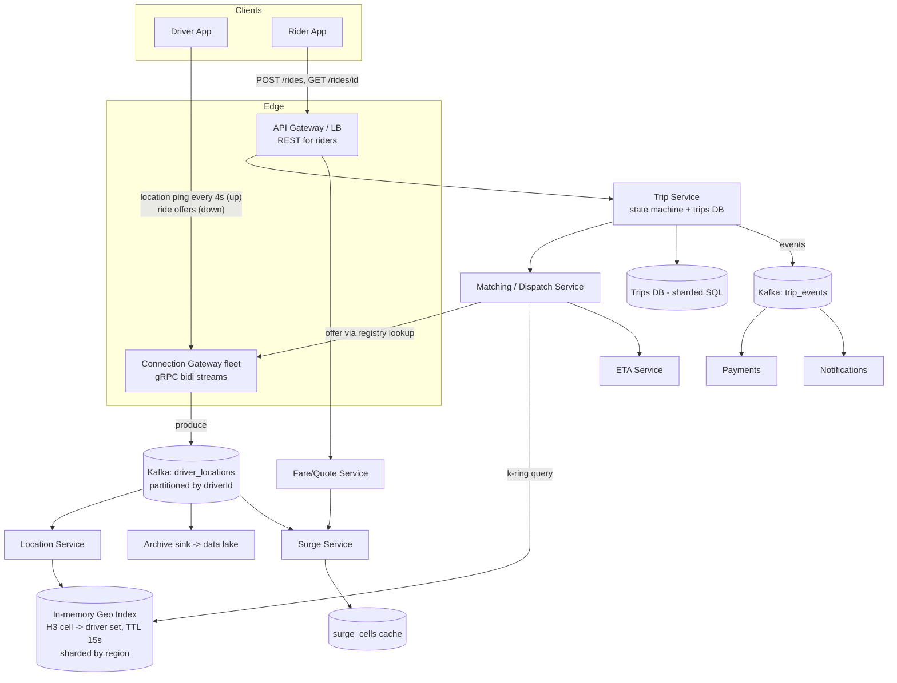

# Ride-Sharing System (Uber)

## 1. Problem Statement & Scope

### Functional Requirements
- Rider requests a ride (pickup, drop-off, product type: UberX/UberGo/UberAuto); gets a fare estimate before confirming.
- System matches rider to a nearby available driver; driver can accept/decline within a timeout.
- Rider and driver see each other's live location during pickup and trip.
- Trip lifecycle tracking: REQUESTED -> DRIVER_ASSIGNED -> ARRIVED -> IN_PROGRESS -> COMPLETED/CANCELLED.
- Surge pricing when demand outstrips supply in an area.
- ETA computation (driver-to-pickup and pickup-to-destination).
- Trip history, receipts, ratings (out of deep scope; mention data model only).

### Non-Functional Requirements
- Matching latency: p99 < 3s from request to driver offer sent.
- Location freshness: driver positions no staler than ~8s (2 missed pings).
- Availability > 99.99% for dispatch path (revenue-critical); location ingestion can tolerate brief data loss (next ping self-heals in 4s).
- Consistency: a driver must never be assigned two trips simultaneously (strong consistency on the claim); location reads can be eventually consistent.
- Scale: global, multi-region, city-partitionable.

### Back-of-Envelope Estimation
- **Drivers**: 5M concurrent online drivers, ping every 4s
  -> 5,000,000 / 4 = **1.25M location updates/sec** sustained.
- **Payload**: driverId (8B) + lat/lng (2 x 8B doubles) + heading/speed (8B) + timestamp (8B) + status (1B) ≈ 41B; with protobuf framing ~**50B/msg**.
  -> Ingest bandwidth: 1.25M x 50B = **62.5 MB/s ≈ 500 Mbps** — trivially small for a fleet of gateways; the challenge is *message rate and fan-in*, not bytes.
- **Riders**: 20M concurrent app-open riders; ~1% actively requesting -> 200K open ride flows; ride requests ~**2,000/sec peak** globally.
- **Trips**: 25M trips/day. Trip record ~2KB (endpoints, fare breakdown, state timestamps, IDs).
  -> 25M x 2KB = **50 GB/day**, ~18 TB/year raw; with route polylines (~10KB compressed each) add 250 GB/day -> polylines go to blob/cold storage, not the OLTP store.
- **Location history** (for ETA models, fraud, support): 1.25M/s x 50B = 5.4 TB/day raw -> write to Kafka, sink to a data lake with columnar compression (~10x) ≈ 500 GB/day. Never in the OLTP path.
- **Geo index memory**: 5M drivers x ~100B entry (id, cell, coords, ts, status) = **500 MB** — fits comfortably in RAM on a handful of shards. This single number justifies the entire "in-memory index" design.

Read:write on locations is inverted vs. typical systems: 1.25M writes/sec vs. ~2K matching reads/sec. Design for write absorption, cheap reads.

## 2. Brute-Force / Naive Design

One server, one Postgres:

```sql
CREATE TABLE drivers (
  id BIGINT PRIMARY KEY,
  lat DOUBLE PRECISION,
  lng DOUBLE PRECISION,
  is_available BOOLEAN,
  updated_at TIMESTAMPTZ
);

-- Driver ping:
UPDATE drivers SET lat=?, lng=?, updated_at=now() WHERE id=?;

-- Matching:
SELECT *, haversine(lat, lng, :rider_lat, :rider_lng) AS dist
FROM drivers
WHERE is_available
  AND lat BETWEEN :rlat - 0.05 AND :rlat + 0.05
  AND lng BETWEEN :rlng - 0.05 AND :rlng + 0.05
ORDER BY dist LIMIT 10;
```

### Why it breaks (with numbers)
1. **Write load**: 1.25M UPDATEs/sec. A well-tuned Postgres does ~10-50K writes/sec per node; you'd need 25-100+ shards *just to record ephemeral data that's stale in 4 seconds*. WAL, MVCC bloat (each update is a new row version), and autovacuum churn are pure waste for data with a 4s useful lifetime.
2. **No usable 2D index**: B-trees index one dimension. A composite index `(lat, lng)` only bounds `lat`; the `lng` predicate scans every row in the latitude band. In Manhattan, a 0.05-degree lat band contains ~tens of thousands of drivers spanning the whole island's longitude range — the DB filters most of them out post-fetch. p99 query time balloons under concurrent updates on the same rows.
3. **Bounding box != distance**: a degree of longitude shrinks with latitude (cos(lat) factor), so the box is distorted; the haversine sort runs on the full candidate set with no index support.
4. **Contention**: two riders' matching queries can both read `is_available=true` for the same driver before either UPDATEs it. Race -> double assignment.
5. **Single point of failure**, no regional isolation: an incident in one city takes down the world.

Each failure maps to a fix in Section 3.

## 3. Evolving the Design

**Bottleneck 1: 2D range queries -> geospatial index.**
Map (lat, lng) to a 1D or hierarchical cell ID (geohash/H3/S2 — compared in §4). "Drivers near X" becomes "union of drivers in cell(X) + neighbor cells" — a handful of exact key lookups instead of a range scan. Index the world in cells of ~0.5-1 km edge (H3 res 8); each lookup returns O(drivers-in-cell), not O(all drivers).

**Bottleneck 2: 1.25M durable writes/sec -> in-memory index with TTL, not a durable DB.**
Location data is ephemeral: superseded every 4s, worthless after ~15s. Durability buys nothing — if a node dies, the next ping wave rebuilds state in one 4s cycle. So: keep the live index in RAM (Redis GEO or a custom in-process cell->driver-set map, ~500 MB total per §1), entries carry `lastSeen` and expire after ~15s (TTL). The same ping stream is tee'd to Kafka for offline consumers (ETA training, heatmaps, fraud) — durability where it's needed, not on the hot path.

**Bottleneck 3: matching contention -> atomic claim.**
Selecting a candidate and marking him busy must be one atomic step. Options: Redis `SET driver:{id}:lock trip_id NX PX 30000`, a DB `UPDATE ... WHERE status='AVAILABLE'` with rows-affected check, or in-process `AtomicBoolean.compareAndSet` when matching for a driver is pinned to one shard (see §6). Losers of the race fall through to the next candidate. Claim carries a lease/timeout so a crashed dispatcher doesn't strand the driver.

**Bottleneck 4: dispatch latency and blast radius -> regional sharding.**
A rider in Tokyo never needs São Paulo's drivers. Partition matching + geo index by city/region (or by coarse geo cell, e.g. H3 res 4, with a routing layer mapping cell -> shard). Wins: index per shard shrinks to ~50-100K drivers, matching is a local in-memory operation, failures are contained to one region, and hot regions scale independently. Cross-boundary requests query the 1-2 adjacent shards (cell neighbors span shard edges).

**Bottleneck 5: surge -> supply/demand per cell.**
Every ride request increments demand for its cell; the geo index already knows supply (available drivers per cell). A surge service computes `multiplier = f(demand_rate / effective_supply)` per cell over a sliding window (e.g., 2-5 min), smooths it (EWMA, hysteresis to avoid flapping), clamps steps (no 1.0 -> 3.0 jumps), and publishes cell->multiplier to a cache read at fare-quote time. Quotes lock the multiplier for the quote's TTL — the user pays what was quoted.

**Bottleneck 6: notifying drivers -> persistent connections.**
You cannot HTTP-poll 5M drivers for offers. Each driver app holds one persistent bidirectional connection (gRPC stream or WebSocket) to a gateway; the gateway maintains a connection registry (driverId -> gateway node, stored in Redis or via consistent hashing). Dispatch pushes an offer down that connection with a 10-15s accept deadline. The same connection carries location pings upstream — one socket, both directions.

Resulting shape: stateless API tier; connection gateways (stateful in the "who's connected here" sense); Kafka firehose; per-region location/geo-index service; matching/dispatch service; trip service backed by a durable DB; surge service; ETA service.

## 4. Protocol & Technology Choices — Why This, Not That

### Geospatial index: geohash vs quadtree vs H3 vs S2

| Dimension | Geohash | Quadtree | H3 (hexagons) | S2 (Google) |
|---|---|---|---|---|
| Scheme | Base32-interleave lat/lng bits -> string prefix | Recursive 4-way spatial split of a region | Hexagonal hierarchical grid on icosahedron projection | Hilbert curve on cube faces projected to sphere |
| Cell shape | Rectangles; aspect ratio alternates 1:1 / 1:2 per level | Rectangles, adaptive size | Hexagons (12 pentagons globally) | Quadrilaterals, low distortion |
| Edge-boundary problem | Severe: two points meters apart can share no prefix (e.g., across the prefix boundary at Greenwich); must always query 8 neighbors | Same rectangle-adjacency issue; neighbor finding requires tree walks or extra links | Mitigated: all 6 neighbors are equidistant center-to-center, so k-ring search gives clean distance semantics | Hilbert curve preserves locality well, but cells adjacent on the sphere can still be far apart in ID space; use S2 region coverings |
| Neighbor lookup | Bit-twiddling on the hash; cheap but 8 unequal neighbors | Tree traversal; O(log n) unless neighbor pointers maintained | O(1) `kRing(cell, k)` — the killer feature for "expand search radius ring by ring" | O(1) via cell ID arithmetic |
| Hierarchy | Prefix = parent; strict containment | Natural (tree) | ~7 children per parent, containment is *approximate* (hexes don't nest exactly) | Exact containment, 4 children |
| Distortion | Bad at high latitudes (Mercator-ish stretching) | Depends on projection | Low, near-uniform cell area globally | Very low (equal-ish area, purpose-built for the sphere) |
| Uniform distance ring | No — corner neighbors are ~1.4x farther than edge neighbors | No | Yes — hexagon's core property | No (quad corners) |

**Choice: H3** (what Uber built and uses). The dispatch workload is dominated by "give me drivers within ~r km, expanding outward" — H3's k-ring makes that a clean, cheap, distance-honest iteration, and uniform neighbor distances make supply/demand aggregation per cell (surge) statistically sane.
**When alternatives win**: Geohash if you just need proximity inside Redis/Elasticsearch with zero new infrastructure (it's what Redis GEO uses internally). Quadtree if density varies wildly and you want adaptive cell sizes (Yext/early Foursquare style) or in-process indexes you fully control. S2 if you need exact hierarchical containment (geofencing with precise polygon covering, spatial joins — Google Maps, MongoDB internals) — H3's approximate parent-child containment is its one real weakness.

### Driver location transport

| Option | Verdict | Why |
|---|---|---|
| HTTP polling/short requests | Reject | 1.25M req/s of TCP+TLS+header overhead for 50B payloads; no server-push for offers; battery drain from radio wakeups. |
| WebSocket | Acceptable | Persistent, bidirectional, firewall-friendly (port 443). But framing/serialization/heartbeats/backpressure are all DIY; no typed contract. |
| **gRPC bidirectional streaming** | **Chosen** | HTTP/2 multiplexed stream: pings up, offers/config down on one connection; protobuf gives 50B messages and a typed schema; built-in deadlines, flow control, and codegen for Android/iOS. Uber runs gRPC-heavy infra already. |
| MQTT | Strong alternative | Designed exactly for this (millions of flaky mobile publishers, tiny messages, QoS levels, broker fan-out). Wins if you want broker-managed pub/sub semantics and ultra-constrained clients (IoT-grade). Loses on typed RPC ergonomics and doubles your infra (broker fleet + still need RPC for everything else). |

Gateway math: at ~50-100K concurrent streams per gateway node (mostly-idle connections; memory-bound at ~10-20KB/conn), 5M drivers need **~50-100 gateway nodes** — a small fleet.

### Live geo index store

| Option | Verdict | Why |
|---|---|---|
| **Redis GEO** (sorted set keyed by 52-bit geohash score) | **Chosen for v1 / interview default** | `GEOADD`/`GEOSEARCH` out of the box; single-digit-ms; shard by region key. Handles ~100-200K ops/s per node -> ~10-15 shards for the write load. TTL handled via a companion `lastSeen` check or periodic sweep (GEO members don't TTL individually — call this out; it's a real wart). |
| Custom in-memory service (H3 cell -> driver set, e.g., Uber's ringpop-style sharded Go service) | Chosen at Uber-scale | Full control: per-entry TTL, k-ring queries natively, colocate matching logic with the index (no network hop per candidate query), custom replication. Costs an engineering team. Say: "start with Redis GEO, migrate when Redis's geohash-ring queries and TTL gaps hurt." |
| Elasticsearch geo queries | Reject for live index | Indexing latency (refresh interval) and write amplification make 4s-fresh data at 1.25M/s untenable. Wins for *historical/analytical* geo queries (trips in polygon last month). |

### Location firehose

| Option | Verdict | Why |
|---|---|---|
| **Gateway -> Kafka -> consumers (geo index, ETA, surge, archive)** | **Chosen** | Decouples ingestion from N consumers; absorbs consumer slowness (index restart replays from offset); partition by driverId keeps per-driver ordering; 1.25M x 50B msgs is comfortable for a modest Kafka cluster. |
| Gateway writes directly to geo index | Simpler, viable | One less hop (~10-50ms fresher data). Loses every secondary consumer and any replay/buffering. Wins for a single-city MVP. Hybrid used in practice: gateway dual-writes hot index directly *and* tees to Kafka for everyone else. |

### Trip storage

| Option | Verdict | Why |
|---|---|---|
| **SQL (Postgres/MySQL), sharded by city or trip_id** | **Chosen** | Trip state transitions need transactions (assign driver + update trip + write payment intent atomically); trips are relational (rider, driver, payment, rating); volume (25M rows/day, 50 GB/day) is easy for a sharded RDBMS. |
| NoSQL (Cassandra/Dynamo) | Rejected for trips | Trips need conditional multi-column transitions and read-your-writes; volume doesn't demand Cassandra. **Wins** for location *history* (append-only, time-partitioned, massive) and for trip-history-by-user feed views (denormalized, partition key = user_id). Use both, for different tables. |

## 5. High-Level Design (HLD)



**Write path (driver ping)**: app -> gRPC stream -> gateway (authn, rate check) -> Kafka `driver_locations` -> Location Service consumes, computes H3 cell, upserts geo index entry `{driverId, cell, lat, lng, lastSeen}`. On cell change, moves driver between cell sets. TTL sweep evicts entries with `lastSeen > 15s`.

**Read path (ride request)**: rider POST /rides -> Trip Service creates trip in REQUESTED (idempotent on client request ID) -> Matching Service queries geo index with `kRing(pickupCell, k)` for k=0,1,2... until enough candidates -> filters (product type, rating floor, heading/ETA) -> ranks via strategy -> atomically claims a driver -> pushes offer through the driver's gateway -> on accept, trip -> DRIVER_ASSIGNED; on decline/timeout, next candidate.

### Data Model

```sql
trips(
  trip_id UUID PK, rider_id, driver_id NULL, product_type,
  status ENUM(REQUESTED, DRIVER_ASSIGNED, ARRIVED, IN_PROGRESS, COMPLETED, CANCELLED),
  pickup_lat, pickup_lng, dropoff_lat, dropoff_lng,
  quoted_fare_cents, surge_multiplier, final_fare_cents NULL,
  client_request_id UNIQUE,        -- idempotency
  requested_at, assigned_at, arrived_at, started_at, ended_at,
  version INT                      -- optimistic locking on transitions
)
drivers(driver_id PK, name, vehicle, product_types[], rating, status)
driver_locations  -- NOT a SQL table: in-memory index entry
  {driver_id, h3_cell_res9, lat, lng, heading, last_seen}
surge_cells(h3_cell_res8 PK, multiplier, demand_ewma, supply_count, updated_at)  -- cache/CRDT-ish, short TTL
```

### API

```
POST /v1/quotes        {pickup, dropoff, product}          -> {quote_id, fare, surge, ttl: 120s}
POST /v1/rides         Idempotency-Key: <client_request_id>
                       {quote_id, pickup, dropoff, product} -> 201 {trip_id, status: REQUESTED}
GET  /v1/rides/{id}                                        -> {status, driver, driver_location, eta}
POST /v1/rides/{id}/cancel
-- Driver side: one gRPC bidi stream
rpc DriverSession(stream DriverMsg) returns (stream ServerMsg)
  DriverMsg  = LocationPing | OfferResponse{offer_id, accept} | StatusChange
  ServerMsg  = RideOffer{trip_id, pickup, fare, deadline} | TripUpdate | ConfigPush
```

Trip state machine (server-enforced; illegal transitions rejected with 409):
`REQUESTED -> DRIVER_ASSIGNED -> ARRIVED -> IN_PROGRESS -> COMPLETED`; `CANCELLED` reachable from REQUESTED/DRIVER_ASSIGNED/ARRIVED (with cancellation-fee rules per state); transitions written with `UPDATE ... WHERE trip_id=? AND status=<expected> AND version=?`.

### Trip state machine — full transition table

| From | Event | To | Actor | Side effects | Guard / notes |
|---|---|---|---|---|---|
| (none) | POST /rides | REQUESTED | Rider | Insert trip row; enqueue to matching | Idempotency-Key dedup; quote must be unexpired |
| REQUESTED | driver accepts offer | DRIVER_ASSIGNED | Driver (via dispatch) | Persist driver_id, assigned_at; notify rider; start driver->pickup ETA stream | Offer must still be OFFERED (offer_id version check) |
| REQUESTED | no supply / rings exhausted | CANCELLED | System | Notify rider "no drivers"; no fee | Terminal |
| REQUESTED | rider cancels | CANCELLED | Rider | No fee | Terminal |
| DRIVER_ASSIGNED | driver taps "arrived" | ARRIVED | Driver | arrived_at; notify rider; start wait timer | Optional geofence check: driver within ~100m of pickup |
| DRIVER_ASSIGNED | rider cancels | CANCELLED | Rider | Fee if past free-cancel window (e.g., 2 min post-assign); release driver | Driver `release()`; driver re-enters geo index |
| DRIVER_ASSIGNED | driver cancels | REQUESTED | Driver | Strike on driver; trip re-enters matching with prior candidates excluded | Re-dispatch, not terminal — rider shouldn't re-request |
| ARRIVED | driver starts trip | IN_PROGRESS | Driver | started_at; begin metered fare accumulation; stop wait timer | Optional: rider-side PIN confirms right passenger |
| ARRIVED | rider no-show timeout | CANCELLED | System/Driver | No-show fee to rider; release driver | Wait timer (e.g., 5 min) authoritative on server |
| IN_PROGRESS | driver ends trip | COMPLETED | Driver | ended_at; compute final fare (metered km/min x rates x locked surge); outbox event -> payment capture | Geofence sanity vs. dropoff; large deviation flags for review |
| IN_PROGRESS | (any cancel attempt) | — rejected 409 | — | — | In-progress trips end, they don't cancel; disputes are post-trip refunds |
| COMPLETED / CANCELLED | any | — rejected 409 | — | — | Terminal states are immutable; corrections are compensating records |

Every transition is a single conditional UPDATE (`status=<expected> AND version=?`), so a stale actor (duplicate tap, delayed packet) loses the version check and gets a 409 with the current state in the body — clients reconcile by re-fetching, never by retrying the transition blindly. Timestamps per state double as the audit log and feed cancellation-fee and driver-incentive logic.

## 6. Low-Level Design (LLD)

```mermaid
classDiagram
    class RideService {
        -DriverMatchingStrategy matchingStrategy
        -RideRepository rideRepo
        -DriverRepository driverRepo
        -GeoIndex geoIndex
        +requestRide(riderId, pickup, dropoff, product) Ride
        +assignDriver(rideId) Driver
        +updateStatus(rideId, RideStatus) void
    }
    class DriverMatchingStrategy {
        <<interface>>
        +pickDriver(List~Driver~ candidates, Location pickup) Driver
    }
    class NearestDriverStrategy {
        +pickDriver(candidates, pickup) Driver
    }
    class HighestRatedDriverStrategy {
        +pickDriver(candidates, pickup) Driver
    }
    DriverMatchingStrategy <|.. NearestDriverStrategy
    DriverMatchingStrategy <|.. HighestRatedDriverStrategy
    RideService --> DriverMatchingStrategy

    class FareEstimationService {
        -PricingStrategy pricingStrategy
        -FareRepository fareRepo
        +estimateFare(pickup, dropoff, Product) FareQuote
    }
    class PricingStrategy {
        <<interface>>
        +surgeMultiplier(Location pickup, Instant time) double
    }
    class LocationBasedPricingStrategy {
        -SurgeCellCache surgeCells
        +surgeMultiplier(pickup, time) double
    }
    class NightBasedPricingStrategy {
        +surgeMultiplier(pickup, time) double
    }
    PricingStrategy <|.. LocationBasedPricingStrategy
    PricingStrategy <|.. NightBasedPricingStrategy
    FareEstimationService --> PricingStrategy

    class RideRepository {
        +save(Ride) void
        +findById(rideId) Ride
        +transition(rideId, from, to) boolean
    }
    class DriverRepository {
        +findById(driverId) Driver
        +findByProduct(Product) List~Driver~
    }
    class FareRepository {
        -TTLCache~QuoteId,FareQuote~ quoteCache
        +saveQuote(FareQuote, ttl) void
        +getQuote(quoteId) Optional~FareQuote~
    }
    RideService --> RideRepository
    RideService --> DriverRepository
    FareEstimationService --> FareRepository

    class Product {
        <<abstract>>
        +getBaseRate()* double
        +getPerKmRate()* double
        +getPerMinRate()* double
        +computeFare(km, min, surge) double
    }
    class UberX
    class UberGo
    class UberAuto
    Product <|-- UberX
    Product <|-- UberGo
    Product <|-- UberAuto

    class Driver {
        -String id
        -double rating
        -Product product
        -AtomicBoolean isAvailable
        +tryClaim() boolean
        +release() void
    }
    class Ride {
        -String id
        -RideStatus status
        -String riderId
        -String driverId
    }
    RideService --> Ride
    DriverRepository --> Driver
```



`Product.computeFare`: `fare = getBaseRate() + km * getPerKmRate() + min * getPerMinRate()`, then `* surgeMultiplier`, floor at product minimum. Subclasses only override the three rate getters (Template Method flavor on top of the hierarchy).

### LLD walkthrough — the classic machine-coding UML, end to end

Call flow for `requestRide`:
1. `RideService.requestRide(riderId, pickup, dropoff, product)` validates the quote (via `FareRepository.getQuote` — expired quote means re-quote, not silent re-price), creates a `Ride` in `REQUESTED` through `RideRepository.save`.
2. `assignDriver(rideId)` pulls candidates from `GeoIndex` (k-ring), hands the list to the injected `DriverMatchingStrategy.pickDriver`, and claims via `Driver.tryClaim()` — the CAS loop from the pseudocode below.
3. On COMPLETED, `FareEstimationService` computes the final fare: `product.computeFare(km, min, surge)` where `surge` came from `PricingStrategy.surgeMultiplier(pickup, requestTime)` *frozen at quote time* — completion never re-reads live surge.

Concrete strategy implementations (each ~5 lines — the point is the seam, not the code):

```java
class NearestDriverStrategy implements DriverMatchingStrategy {
    public Driver pickDriver(List<Driver> c, Location pickup) {
        return c.stream().min(comparingDouble(d -> haversine(d.location(), pickup))).orElseThrow();
    }
}
class HighestRatedDriverStrategy implements DriverMatchingStrategy {
    public Driver pickDriver(List<Driver> c, Location pickup) {
        return c.stream().max(comparingDouble(Driver::rating)).orElseThrow();
    }
}
```

Product hierarchy is pure data variation — three getters per subclass, formula lives once in the abstract parent:

| Product | getBaseRate() | getPerKmRate() | getPerMinRate() | Notes |
|---|---|---|---|---|
| UberX | 50.0 | 12.0 | 2.0 | Sedan, default |
| UberGo | 40.0 | 10.0 | 1.5 | Hatchback, budget |
| UberAuto | 20.0 | 8.0 | 1.0 | Rickshaw, min-fare floor matters most here |

Adding UberXL or UberMoto is one subclass + registry entry; `computeFare` and every service are untouched — the interviewer is checking you *don't* write `if (product == UBERX)` ladders.

`FareRepository` with the TTL quote cache and background cleaner — the piece most candidates hand-wave:

```java
class FareRepository {
    private final ConcurrentHashMap<String, TimestampedQuote> cache = new ConcurrentHashMap<>();
    private static final Duration TTL = Duration.ofMinutes(2);
    private final ScheduledExecutorService cleaner = Executors.newSingleThreadScheduledExecutor();

    FareRepository() {  // sweep expired quotes every 30s so the map doesn't grow unbounded
        cleaner.scheduleAtFixedRate(
            () -> cache.entrySet().removeIf(e -> e.getValue().isExpired(TTL)), 30, 30, SECONDS);
    }
    void saveQuote(FareQuote q)            { cache.put(q.id(), new TimestampedQuote(q, Instant.now())); }
    Optional<FareQuote> getQuote(String id) {
        TimestampedQuote t = cache.get(id);
        if (t == null || t.isExpired(TTL)) { cache.remove(id); return Optional.empty(); }  // lazy expiry on read
        return Optional.of(t.quote());
    }
}
```

Two-layer expiry is deliberate: the read path checks staleness itself (correctness — a quote must never be honored past TTL even if the sweeper is behind), while the scheduled sweep is purely for memory hygiene. `ConcurrentHashMap.removeIf` inside the sweeper is safe under concurrent puts; no global lock. In the distributed version this whole class becomes `SETEX quote:{id}` in Redis and the cleaner disappears — say that migration out loud, it shows the repository seam paying off.

Why `AtomicBoolean` and specifically `compareAndSet` prevents double-dispatch: with a plain `boolean` + `if (d.isAvailable()) { d.setAvailable(false); assign(d); }`, two matcher threads can both pass the `if` before either writes — classic TOCTOU, and both riders get the same car. `compareAndSet(true, false)` compiles to a single hardware CAS (lock cmpxchg on x86): the read-compare-write is one indivisible step, so exactly one thread observes `true -> false` succeed and the other gets `false` back *as a return value it can act on* — fall through to the next candidate, no blocking, no lock ordering to get wrong, no deadlock possible. `synchronized` on the driver would also be correct but serializes all claims on that driver and invites lock-held-across-IO bugs when the offer RPC creeps inside the critical section; CAS keeps the critical section to one instruction.

### Why these patterns

**Strategy for matching and pricing.** Matching policy is a product decision that changes without redeploying dispatch: nearest-driver for latency, highest-rated for premium products, later an ML-ranked strategy — each is one new class implementing `pickDriver`, selected at runtime (per product, per city, per experiment arm). Open-closed: `RideService` never changes when policy does. Same argument for `PricingStrategy`: `LocationBasedPricingStrategy` reads live surge cells; `NightBasedPricingStrategy` applies a time-of-day multiplier; both are just `surgeMultiplier()` hooks composed into the same fare formula. Also the single best testability win: inject a deterministic stub strategy in tests.

**Repository pattern.** `RideRepository`/`DriverRepository`/`FareRepository` isolate *what* the domain needs (save, findById, atomic transition) from *how* it's stored. Day 1 that's a HashMap (machine-coding round), day 300 it's sharded Postgres — service code untouched. `FareRepository` additionally owns quote lifecycle: quotes live in a TTL cache (2 min) so a rider confirms the price they saw; expiry forces a re-quote rather than honoring stale surge. Putting the TTL inside the repository keeps "quotes expire" a storage concern, invisible to `FareEstimationService`.

**AtomicBoolean for driver availability.** Matching is inherently concurrent: two riders, two threads, same nearest driver. Check-then-set on a plain boolean is a TOCTOU race. `compareAndSet(true, false)` is a single atomic CPU instruction (CAS): exactly one thread wins the claim, the loser gets `false` and moves on — no locks, no blocking, no deadlock risk.

```java
class Driver {
    private final AtomicBoolean isAvailable = new AtomicBoolean(true);
    /** Atomic claim: returns true for exactly one caller. */
    boolean tryClaim()  { return isAvailable.compareAndSet(true, false); }
    void release()      { isAvailable.set(true); }
}
```

Scope note for seniors: `AtomicBoolean` guards a race *within one JVM*. It works in the distributed system only because matching for a given geo shard is pinned to one dispatcher node (shard-per-region, §3). If two nodes could match against the same driver, the claim must move to a shared arbiter — Redis `SET NX PX` lease or a conditional DB update — same CAS idea, different medium. Saying this sentence is worth more than the code.

### Matching pseudocode

```java
public Optional<Driver> match(RideRequest req) {
    H3Cell origin = h3.cellFor(req.pickup(), RES_9);
    for (int k = 0; k <= MAX_RING; k++) {                 // expand search ring
        List<Driver> candidates = geoIndex.driversIn(h3.kRing(origin, k)).stream()
            .filter(d -> d.product().equals(req.product()))
            .filter(d -> d.lastSeen().isAfter(now().minusSeconds(15)))  // stale filter
            .collect(toList());
        while (!candidates.isEmpty()) {
            Driver best = matchingStrategy.pickDriver(candidates, req.pickup());
            if (best.tryClaim()) {                        // CAS: exactly one winner
                boolean accepted = dispatch.offer(best, req, OFFER_TIMEOUT_15S);
                if (accepted) {
                    rideRepo.transition(req.rideId(), REQUESTED, DRIVER_ASSIGNED);
                    return Optional.of(best);
                }
                best.release();                           // declined or timed out
            }
            candidates.remove(best);                      // lost CAS or declined -> next
        }
    }
    rideRepo.transition(req.rideId(), REQUESTED, CANCELLED);  // no supply
    return Optional.empty();
}
```

Key properties: ring-by-ring expansion bounds work and preserves "nearest first"; CAS loop degrades gracefully under contention (loser pays one list-removal, not a lock wait); offer timeout releases the claim so a distracted driver doesn't strand the rider.

## 7. Deep Dives & Failure Modes

**Hot cells (airports, stadiums, concert exits).** A single H3 res-8 cell at LAX can hold thousands of drivers and requests — cell-granular structures (driver sets, surge counters, per-cell locks) become hotspots. Mitigations: (a) *adaptive resolution* — index hot cells at res 9/10 (children), splitting the load and sharpening matching; (b) shard the cell's driver set across sub-keys; (c) queue-based dispatch at airports (FIFO virtual queue is fairer than proximity when everyone is in the same lot — a product fix to a systems problem); (d) load-shed reads: matching caps candidates per query.

**Thundering herd after an event ends.** 20K ride requests in 2 minutes from one cell. Defenses: surge itself is the demand valve (price rises, demand spreads in time); request queuing with honest wait estimates instead of failing matches; pre-positioning — surge forecast (events calendar + historical) nudges drivers toward the venue *before* it ends; rate-limit per cell at the API gateway to protect dispatch, returning "high demand, retrying" rather than 500s.

**Idempotent ride creation.** Mobile networks retry. `POST /rides` carries a client-generated `Idempotency-Key` (UUID minted at button-press); trips table has a unique index on `client_request_id`; a duplicate insert returns the existing trip (200, same body) instead of creating a second dispatch. Without this, one tap in a tunnel = two cars and two charges.

**Driver connection flaps and stale locations.** Cellular handoffs kill streams constantly. Gateway marks the stream dead after 2 missed heartbeats; geo index entries carry `lastSeen` and a 15s TTL, so a vanished driver stops receiving offers within ~2 ping intervals without any explicit "offline" signal. Reconnect is cheap (gRPC channel re-establish, resume same session). Crucial rule: a driver *on a trip* who flaps must not be marked available — availability is derived from trip state, not connection state.

**Dispatch offer timeout state machine.** Offer is its own mini-lifecycle: `OFFERED -(accept)-> CONFIRMED`, `-(decline)-> RELEASED`, `-(15s timer)-> EXPIRED -> RELEASED`. Edge case: driver accepts at t=15.1s after the timer released the claim and the next driver was claimed — the late accept must be rejected (offer_id versioning: accept is only valid if the offer is still OFFERED, checked atomically). Never trust the client's clock; the server timer is authoritative.

**Double-charge protection.** Payment capture keyed by `trip_id` (idempotency key on the PSP call); COMPLETED transition and payment-intent write happen in one DB transaction, then an outbox event triggers capture; PSP-side idempotency keys make retried captures no-ops. Refund path is a compensating transaction, never a delete.

**Exactly-once trip completion events.** Downstream (payments, receipts, driver earnings) must see COMPLETED exactly once *in effect*. True exactly-once delivery doesn't exist; use the transactional outbox: state transition + outbox row committed atomically, a relay publishes to Kafka (at-least-once), consumers dedupe on `(trip_id, event_type)` — idempotent consumers turn at-least-once into effectively-once.

**Regional failover.** Regions are largely independent (a city's drivers, riders, geo index live together). Trips DB: per-region primary with cross-region async replica; on region loss, promote replica — in-flight trips may lose the last seconds of state, reconciled from client-side trip logs on reconnect. Geo index needs no failover replication: it rebuilds from the ping stream in one 4s cycle after gateways re-route (DNS/anycast) to the standby region. This "state that self-heals from the stream" property is the payoff of not making locations durable.

**ETA computation (follow-up magnet).** Two ETAs: driver->pickup (shown during matching, feeds strategy ranking) and trip ETA. The pipeline has three layers:

1. *Map-matching.* Raw GPS is noisy (5-30m error, worse in urban canyons); a ping rarely lies exactly on a road. Map-matching snaps the ping sequence onto the road graph — standard approach is an HMM/Viterbi: hidden states are candidate road segments near each ping, emission probability decays with snap distance, transition probability penalizes implausible jumps (route distance between consecutive candidates vs. straight-line). Output: a clean sequence of (segment, timestamp) — the substrate for both live speeds and billing-grade trip distance (odometer from raw GPS overbills in tunnels and canyons).
2. *Routing graph + contraction hierarchies.* The road network is a directed graph: nodes = intersections, edges = segments weighted by expected traversal time (not distance). Dijkstra/A* on a continental graph (~100M edges) is tens of ms — too slow at dispatch QPS. Contraction hierarchies preprocess the graph: rank nodes by "importance", contract them bottom-up, inserting shortcut edges that preserve shortest-path distances through removed nodes. Queries become a bidirectional search that only goes *upward* in the hierarchy from both ends and meets in the middle — microseconds to low-ms per query, at the cost of hours of preprocessing. The catch: edge weights baked at preprocess time. That's why production systems use CRP/customizable variants — partition the graph (metric-independent, done once), then re-"customize" cell-level shortcut costs with fresh traffic weights every few minutes, keeping queries fast *and* traffic-aware.
3. *Live speeds + ML residual.* A Kafka consumer aggregates map-matched pings into per-segment speed estimates over 1-5 min windows (the driver fleet is a free probe network); these feed the customization layer. On top, an ML model (Uber's DeepETA) predicts the residual between graph ETA and observed arrival using time-of-day, weather, pickup/dropoff type, driver behavior — the graph gets you within ~10-20%, the residual model halves that.

For matching, never run full routing per candidate: haversine x a regional detour coefficient (~1.2-1.4) filters the ring, exact CH routing only for the top ~5 finalists.

**Surge pricing mechanics (deep dive).** Per H3 res-8 cell, two signals: *demand rate* = ride requests + fare-quote opens (eyeballs, a leading indicator) over a sliding 2-5 min window; *effective supply* = available drivers in the cell k-ring, discounted for drivers currently holding offers or finishing nearby trips (they're supply-in-30s). Raw ratio `d/s` is far too jumpy to price on — a cell with 3 drivers flips from 1.0x to 3.0x when one logs off. So the pipeline is: (a) EWMA-smooth both signals; (b) map ratio -> multiplier through a step function (1.0, 1.2, 1.5, ... capped) rather than a continuous curve, so prices are legible; (c) hysteresis — the threshold to *drop* a surge level sits below the threshold that raised it, killing oscillation at a boundary; (d) rate-limit steps (one level per update tick, no 1.0 -> 3.0 jumps); (e) spatial smoothing across the k-ring so adjacent cells don't show 1.0x vs 2.5x across a street — that teaches riders to walk a block to dodge surge and puts a cliff in driver earnings. Published cell->multiplier snapshots go to a cache read at quote time; the quote freezes its multiplier for the quote TTL. Closing the loop: surge is also a *supply* signal — driver apps render the surge heatmap, so the multiplier both throttles demand and attracts supply, which is why it must decay smoothly as drivers converge (hysteresis again, in reverse).

**Payments integration.** Never charge inline in the trip path. Flow: (1) at request time, optionally place a pre-auth hold for the quoted fare (fraud posture per market); (2) on COMPLETED, the trip transition and a `payment_intent` row (amount = final fare, status=PENDING, idempotency key = trip_id) commit in one DB transaction, plus an outbox event; (3) a payment worker consumes the outbox, calls the PSP (Stripe/Adyen/Braintree) with the trip-scoped idempotency key — retries and duplicate deliveries collapse into one charge; (4) webhook from the PSP flips the intent to CAPTURED/FAILED; (5) failure path: retry with backoff across the stored payment methods, then mark trip in arrears (collect on next ride) — the trip stays COMPLETED; money state is deliberately decoupled from trip state. Ledger discipline: every money movement is an append-only double-entry record (rider charge, driver earning, platform fee, tolls, tips); refunds and adjustments are compensating entries, never mutations. Driver payouts batch from the earnings ledger (daily/weekly, or instant-pay against accrued balance for a fee) — completely offline from dispatch. PCI scope stays at the edge: apps tokenize cards directly with the PSP; your systems store tokens only.

## 8. Trade-off Summary & Interview Soundbites

| Decision | Trade-off accepted |
|---|---|
| In-memory geo index, TTL, no durability | Lose location history on node death (rebuilt in 4s); gain 100x write throughput and simplicity |
| H3 over S2/geohash | Approximate parent-child containment; gain uniform k-ring distance semantics and clean surge cells |
| gRPC bidi streaming | Stateful gateways (connection registry, drain complexity); gain 1 socket per driver, typed contract, tiny payloads |
| Kafka between gateway and index | +10-50ms location staleness; gain replay, fan-out to ETA/surge/archive, consumer isolation |
| Sharding by region/city | Cross-border trips need shard handoff; gain small indexes, local matching, contained blast radius |
| CAS claim (optimistic) over locking | Retry loop under contention; gain no blocking, no deadlocks, graceful hot-cell degradation |
| SQL for trips | Sharding effort at scale; gain transactional state transitions and relational queries |
| Quote TTL + locked surge | Riders can game a 2-min window; gain price honesty (quoted price is charged price) |

### Soundbites
1. "Locations are ephemeral — data that's worthless in 15 seconds doesn't deserve a WAL. Keep it in RAM with a TTL and let the next ping be the recovery mechanism."
2. "The write:read ratio is inverted: 1.25 million location writes/sec vs. two thousand matching reads/sec. Everything in this design is about absorbing writes cheaply."
3. "B-trees index one dimension; geospatial indexing is fundamentally about turning 2D proximity into 1D or hierarchical key lookups."
4. "H3 wins because k-ring on hexagons gives a uniform-distance expanding search — with squares, corner neighbors are 40% farther than edge neighbors."
5. "Matching correctness reduces to one atomic claim: compareAndSet(true, false) in one process, SET NX with a lease across processes — same idea, different medium."
6. "Surge is a control system, not just pricing: it's the demand valve that protects dispatch from thundering herds and moves supply toward heat."
7. "Idempotency keys on ride creation and payment capture: one tap in a tunnel must never mean two cars or two charges."
8. "The geo index needs no failover replication — it self-heals from the ping stream in one 4-second cycle. Choosing what NOT to persist is a design decision."
9. "Contraction hierarchies trade hours of preprocessing for microsecond routing queries; CRP re-customizes cell costs every few minutes so the shortcuts stay traffic-aware."
10. "Trip state and money state are deliberately decoupled: COMPLETED plus an outbox row in one transaction, and the PSP idempotency key makes every retry a no-op."

### Common follow-ups
- **How does ETA work?** Road-graph routing (contraction hierarchies) for the base estimate, corrected with live per-segment speeds aggregated from the driver ping firehose, plus an ML residual model (DeepETA-style). Matching uses cheap haversine for filtering, exact routing only for finalists.
- **How is surge computed?** Per H3 cell: demand rate (requests + app opens) over effective supply (available drivers, discounted by those already being offered), sliding window, EWMA-smoothed with hysteresis and step clamps to prevent flapping; the multiplier is frozen into the fare quote for its TTL.
- **Why not store locations in Postgres?** 1.25M updates/sec would need 25-100 shards, MVCC turns every update into a dead row version, and the data's useful life is 4 seconds — you'd pay durability costs for data you'll never need durable. In-memory with TTL, tee to Kafka for the consumers who want history.
- **Two riders match the same driver?** Impossible past the claim: candidate selection is racy by design, but the claim is CAS — exactly one winner; the loser falls through to the next candidate in the same loop.
- **Driver goes offline mid-trip?** Availability derives from trip state, not connection state; the trip stays IN_PROGRESS, the app buffers pings and trip events locally, reconciles on reconnect. Only pre-assignment drivers are evicted by the location TTL.
- **How do you scale matching for one city?** Pin a city (or coarse H3 cell) to one dispatcher shard so claims stay in-process; split hot cities by sub-cell; airports get a FIFO virtual queue instead of proximity matching.
- **How would you do scheduled rides?** They're not dispatched at booking time — store as a future intent, and a scheduler materializes a normal ride request T-minus-lead-time before pickup (lead time = predicted driver->pickup ETA + buffer for that cell/time). The only new machinery is the timer service and a supply-forecast check at booking so you don't promise a 5 AM airport ride in a dead zone; everything downstream reuses the standard matching path.
- **How does pool/shared rides change matching?** It becomes an online vehicle-routing problem: a candidate driver may already carry a rider, so scoring a match means inserting the new pickup+dropoff into the existing route and pricing the *detour* imposed on current passengers (bounded by product promise, e.g., +8 min max). Practical shape: keep the same k-ring candidate generation, but the strategy scores insertions via the ETA service (pairwise route deltas), and claims lock a *seat*, not the driver. Batch matching (accumulate requests for 2-5s, solve a small assignment problem per cell) beats greedy per-request matching noticeably here — mention Uber's shift to batched global matching.
- **Where do you rate-limit, and on what key?** Three tiers: per-device/rider at the API gateway (token bucket, protects against buggy clients and card-testing fraud); per-cell request admission at dispatch (protects the matcher during stampedes — degrade to queued-with-ETA, not 429); per-driver ping rate at the connection gateway (a hacked client streaming 100 pings/s gets throttled at the socket, protecting Kafka). Keys differ per tier because the resource being protected differs — saying that is the senior answer.
- **How do riders see the driver approaching in real time?** Rider app holds a lightweight subscription (SSE/WebSocket via the API tier, or short-poll at 3-5s) keyed by trip_id; the trip service subscribes to the assigned driver's ping stream (filtered from the Kafka firehose or forwarded by the gateway) and relays snapped, map-matched positions — never raw GPS, which jitters across buildings. Fan-out is 1:1 (one rider per driver), so this is trivial compared to the ingest side; interpolate client-side between updates for smooth animation.
