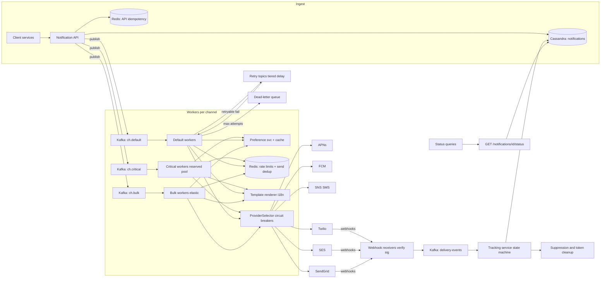
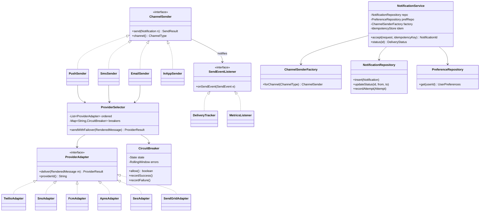

# Notification Service

## 1. Problem Statement & Scope

Design a multi-channel notification platform that internal product teams call to send push notifications (APNs/FCM), SMS (Twilio-class providers), email (SES/SendGrid), and in-app messages to end users, with delivery guarantees, user preference enforcement, and full delivery observability.

### Functional Requirements
1. **Multi-channel delivery**: push (APNs, FCM), SMS, email, in-app inbox. One logical notification may fan out to multiple channels.
2. **Provider abstraction with failover**: each channel has >= 2 providers (e.g., Twilio + SNS for SMS); automatic failover on provider degradation.
3. **Deduplication**: caller-supplied idempotency keys; the same logical notification is never sent twice even if the caller retries or a worker crashes mid-send.
4. **Prioritization**: transactional traffic (OTP, password reset, payment alerts) must never queue behind marketing blasts. OTP p99 end-to-end < 3s.
5. **Per-user rate limiting**: cap non-transactional notifications per user per channel (e.g., 5 marketing pushes/day).
6. **Preferences & quiet hours**: per-user, per-channel, per-category opt-in/out; quiet hours evaluated in the user's local timezone with deferral, not drop, for deferrable categories.
7. **Templates + localization**: templates with variables, rendered per user locale; template versioning.
8. **Delivery tracking**: ingest provider webhooks (delivered/bounced/opened/clicked); expose `GET /notifications/{id}/status`.
9. **Retries**: exponential backoff with jitter; dead-letter queue after max attempts; DLQ replay tooling.

### Non-Functional Requirements
- **Scale**: 100M DAU, ~1B notifications/day, campaign bursts of 10M+ sends in minutes.
- **Latency**: OTP/transactional p99 < 3s end-to-end; marketing best-effort within minutes.
- **Delivery semantics**: at-least-once into the provider, with dedup making it effectively-once at the send boundary. (True exactly-once to a device is impossible — Section 7.)
- **Availability**: 99.95% for the ingest API. Ingest must survive any single provider outage.
- **Durability**: an accepted notification (202 returned) is never silently lost — it ends in a terminal state or the DLQ.
- **Retention**: 90 days of delivery logs, queryable by notification id and user id.

### Back-of-Envelope Estimation
- **Throughput**: 100M users x 10 notifications/user/day = 1B/day. 1B / 86,400s ≈ **11.5K/sec average**. Diurnal + campaign peak at 10x → **~115K/sec design target**.
- **Channel mix (assume)**: 60% push, 25% in-app, 10% email, 5% SMS → SMS peak ≈ 5.75K/sec — relevant because SMS providers rate-limit hard (Twilio default ~ hundreds of msg/sec/account without short codes).
- **Delivery log storage**: 1 notification row ≈ 1 KB (ids, channel, status, timestamps, provider ids, template ref) + ~2 delivery-attempt rows x 0.5 KB = **~2 KB/notification**. 1B/day x 2 KB = **2 TB/day**; 90-day retention = **~180 TB** raw, ~540 TB with RF=3 → LSM store (Cassandra) with TTL, not a relational primary.
- **Queue throughput**: 115K msg/sec x ~1.5 KB envelope ≈ 170 MB/sec peak — trivially within Kafka territory, uncomfortable for a single RabbitMQ node.
- **Idempotency store**: keys live 24-48h. 1B keys/day x ~100 B ≈ 100 GB/day, ~200 GB live at 48h TTL → a modest Redis cluster (handful of shards) suffices.
- **Webhook ingest**: ~2-3 status events per email/SMS (sent, delivered, opened) → +~0.5B events/day ≈ 6K/sec average, bursty after campaigns.

### Out of Scope
Campaign authoring/segmentation UI (we accept a resolved recipient list or a segment id), analytics warehousing beyond the 90-day log, marketing attribution.

## 2. Brute-Force / Naive Design

Single service; callers hit `POST /notify`; the handler synchronously renders the template, picks a provider SDK, and calls Twilio/APNs/SES inline, returning the provider response to the caller.

```
Caller -> Notification API -> (in request thread) render -> Twilio/FCM/SES HTTP call -> 200/500
```

Why this collapses, with numbers:

1. **Provider latency caps throughput.** Provider API calls take 200 ms - 2 s. At 500 ms average, one worker thread does 2 sends/sec. To hit even the 11.5K/sec *average* you need ~5,750 concurrent in-flight calls; at 115K/sec peak, ~57,500. A 200-thread server handles 400/sec — you would need ~290 servers doing nothing but blocking on provider I/O, and the caller's request thread is held hostage the whole time.
2. **Provider outage cascades upstream.** Twilio has a 30-minute brownout; every caller's request now hangs to timeout. Callers' thread pools saturate; the notification dependency takes down checkout. Synchronous coupling turns a third-party incident into a company-wide one.
3. **No retry safety.** Caller times out at 2 s, provider actually sent the SMS at 2.3 s, caller retries → user gets two OTPs (confusing) or two marketing texts (churn + carrier spam flags). No idempotency layer exists.
4. **Campaign bursts.** Marketing triggers 10M sends. At 400/sec per server the burst takes 10M/400 = 25,000 s ≈ 7 hours on one box, or you autoscale to hundreds of instances that then hammer provider rate limits and get 429-throttled — and while the blast runs, OTPs share the same thread pool and queue behind it. OTP p99 goes from 1 s to minutes; login breaks.
5. **No dedup, no preferences, no quiet hours, no tracking** — every one of these is a per-send lookup or async event flow that doesn't fit in a synchronous request path.

The core lesson to state in the interview: **notification sending is inherently asynchronous work against slow, flaky, rate-limited third parties; the only sane API contract is "202 Accepted + status endpoint," never "sent."**

## 3. Evolving the Design

**Bottleneck 1: synchronous provider calls → queue-based async decoupling.**
API validates, persists a `notifications` row (status=QUEUED), publishes to a message queue, returns `202 {notification_id}`. Channel workers consume and call providers. Ingest latency drops to ~10 ms regardless of provider health; provider outages become queue backlog, not caller failures; workers scale independently per channel.

**Bottleneck 2: one queue → head-of-line blocking → priority queues per (channel, priority).**
A 10M marketing enqueue puts OTPs behind 10M messages. FIFO queues have no queue-jumping. Fix: **separate physical queues/topics**: `sms.critical`, `sms.default`, `sms.bulk` (same per channel). Dedicated worker pools for `critical`; `bulk` workers are the elastic/preemptible pool. Critical capacity is reserved, not shared — OTP latency is now independent of campaign volume by construction. (Why not in-queue priority: Section 4.)

**Bottleneck 3: retries cause duplicates → idempotency keys at two boundaries.**
- **API boundary**: caller sends `Idempotency-Key` header; API does a conditional insert keyed on `(caller_id, idempotency_key)`; a replayed request returns the original `notification_id` with 200 instead of creating a new send.
- **Send boundary**: the queue is at-least-once (worker can crash after the provider call, before the ack). Worker does `SETNX send:{notification_id}:{channel} TTL 48h` in Redis immediately before calling the provider; if the key exists, skip. Window between provider-call and SETNX-visible is the residual duplicate risk — acceptable at-least-once residue (Section 7).

**Bottleneck 4: provider outage → provider abstraction + health-checked failover.**
`ProviderAdapter` interface per channel; a `ProviderSelector` holds an ordered provider list with a **circuit breaker per provider** (trip on error-rate/latency threshold over a rolling window). On trip, traffic shifts to the secondary (Twilio → SNS); half-open probes recover. APNs/FCM are exceptions — they are the *only* path to their devices, so "failover" there means backoff + queue buffering, not provider swap.

**Bottleneck 5: user annoyance → preference service, rate limiter, quiet hours.**
- **Preference check** happens in the worker (not at enqueue) so it reflects the user's state at send time — matters when a campaign drains over hours. Read-through cache (Redis, ~5 min TTL) over the preferences DB; at 115K/sec you cannot hit the DB per send.
- **Per-user rate limit**: token bucket per `(user, channel, category-class)` in Redis; transactional traffic bypasses it.
- **Quiet hours**: resolve user timezone → if local time is inside the quiet window and category is deferrable, **reschedule** to next allowed local time via a delay mechanism (scheduled-delivery table scanned each minute, or per-delay-tier queues), don't drop. OTPs bypass quiet hours.

**Bottleneck 6: no visibility → delivery tracking via webhooks + status store.**
Providers callback (Twilio status callbacks, SES → SNS event destinations, SendGrid event webhook, APNs/FCM give only accept/reject + token feedback). Webhook receivers verify signatures, drop the raw event onto a Kafka topic, and a tracking consumer applies **idempotent, monotonic** status transitions (QUEUED → SENT → DELIVERED/BOUNCED → OPENED) to the delivery log. `GET /notifications/{id}/status` reads that store. Bounce events also feed suppression lists and token cleanup.

**Bottleneck 7: transient failures → backoff + DLQ.**
Retry retryable errors (429, 5xx, timeouts) with exponential backoff + full jitter (`base 2^n`, cap 15 min); after N attempts (e.g., 5), move to the channel DLQ with full context. Non-retryable errors (invalid token, hard bounce, unsubscribed) go straight to terminal FAILED — retrying those burns quota and reputation. DLQ has alerting, a triage dashboard, and idempotent replay (safe because of the send-boundary dedup key).

**Resulting shape**: stateless ingest API → durable prioritized queues → per-channel worker fleets → adapter/failover layer → providers; a parallel webhook → tracking pipeline closes the loop.

## 4. Protocol & Technology Choices — Why This, Not That

### Queue: Kafka vs RabbitMQ vs SQS

| Criterion | Kafka (chosen) | RabbitMQ | SQS |
|---|---|---|---|
| Peak throughput (115K/s, 170 MB/s) | Trivial with partitioning | Single-broker strain; clustering is operationally fiddly at this rate | Fine (managed, effectively unbounded) |
| Replay / backlog absorption | Log retention → replay by offset resets; multi-hour campaign backlog is normal operation | Backlogged queues degrade broker memory/paging | 14-day retention, no offset replay |
| Per-message delay (quiet hours) | Not native — needs scheduler tier | Native (delayed-exchange plugin) | Native, but capped at 15 min |
| Fan-out (tracking, analytics consume same events) | Consumer groups, free | Requires exchange topology | Needs SNS in front |
| Ordering | Per-partition (key by user_id if needed) | Per-queue | FIFO queues cap at ~3K/s/group |
| Ops | Heaviest (or pay for MSK/Confluent) | Medium | Zero |

**Choice: Kafka.** Throughput, cheap fan-out to the tracking/analytics consumers, and replayability during incident recovery dominate. **SQS would win** for a smaller org (<10K/s) prioritizing zero ops — this is a legitimate answer at lower scale. **RabbitMQ would win** if per-message delayed delivery and complex routing were the core requirement at modest volume.

**Why priority = separate topics, not message priority:** Kafka has *no* priority concept — a partition is an append-only log consumed in order; a high-priority message physically cannot pass earlier messages in its partition. RabbitMQ's priority queues exist but degrade under deep backlogs (priority is resolved among *ready* messages in broker memory) — and a 10M backlog is exactly the scenario we designed for. Separate `critical/default/bulk` topics with **separate reserved worker fleets** turn priority into a capacity-isolation guarantee instead of a broker-scheduling hope. This is the strongest single soundbite in this design.

### In-app channel: APNs/FCM push vs WebSocket vs SSE vs polling

| Criterion | APNs/FCM | WebSocket | SSE | Polling |
|---|---|---|---|---|
| Reaches backgrounded/killed app | Yes (OS-level) | No | No | No |
| Server cost at 100M users | Externalized to Apple/Google | ~100M sockets → hundreds of gateway nodes + sticky routing | Similar to WS | Cheap servers, huge wasted request volume |
| Delivery guarantee | Best-effort (OS may coalesce/drop) | Only while connected | Only while connected | On next poll |
| Bi-directional | N/A | Yes | No | No |

**Choice: hybrid.** OS push (APNs/FCM) is the *only* mechanism that reaches a backgrounded app — non-negotiable for mobile. For in-app inbox: **write to an inbox table (pull model)** + push a silent "sync" signal; web clients with the app open use **SSE** (server→client only, auto-reconnect + `Last-Event-ID`, plain HTTP — no WS upgrade infrastructure needed since we never need client→server on this channel). **WebSocket would win** if the product also needed real-time bidirectional features (chat, presence) sharing the connection. **Polling wins** only as a degraded fallback. The inbox-table-as-source-of-truth means a missed push costs nothing — the badge count reconciles on next app open.

### Idempotency-key store: Redis vs DynamoDB

| Criterion | Redis (chosen) | DynamoDB |
|---|---|---|
| Latency (on every send: 115K/s) | ~0.5 ms | ~5-10 ms |
| TTL semantics | Per-key TTL, expiry within ms of deadline | TTL deletion lag up to ~48h (fine here: reads still filter expired via condition, but only if you check the timestamp attribute yourself) |
| Atomic check-and-set | `SET key val NX EX 172800` — single command | `PutItem` + `attribute_not_exists` condition — also atomic |
| Durability | Can lose recent keys on failover (async replication) | Fully durable |
| Cost at 200 GB live | Small cluster | 115K conditional writes/s is expensive |

**Choice: Redis** — the check sits on the hot path of every send; sub-ms `SETNX ... EX` is the whole feature. Losing the store's recent tail on failover degrades to *at-least-once*, which is our stated floor anyway (occasional duplicate, never a loss). **DynamoDB would win** if duplicates were financially unacceptable (e.g., the "notification" moved money) and you needed the dedup record durable — then you pay the latency/cost for conditional writes, and treat its lazy TTL as a non-issue by storing and comparing an `expires_at` attribute.

### Delivery log: Cassandra vs MySQL

| Criterion | Cassandra (chosen) | MySQL |
|---|---|---|
| Write rate | ~120K writes/s across notification + attempt + status updates: LSM, linear scale | Requires heavy sharding + async replicas; B-tree write amplification |
| 180 TB / 90-day retention | Row TTL native; size-tiered ops well-understood | Manual partition-drop jobs; painful at this size |
| Query patterns | By notification_id, by (user_id, time) — both are key-designed partitions | Flexible ad-hoc SQL |
| Consistency needs | Status updates are idempotent + monotonic → LWW with the state-machine guard is fine | Strong, but unneeded here |

**Choice: Cassandra** (or ScyllaDB/DynamoDB — same shape): append-heavy, TTL-heavy, two known access paths, no cross-entity transactions. **MySQL would win** at <5K/s with rich ad-hoc querying needs, or for the *preferences* and *templates* tables — which we do keep relational, since they're low-volume, strongly consistent, and admin-edited.

### Per-user rate limiting: token bucket vs sliding window

| Criterion | Token bucket (chosen) | Sliding window log/counter |
|---|---|---|
| Burst semantics | Explicit burst allowance (bucket size) — "3 quick notifications OK, then 1/hour refill" matches product intent | Hard cap in window; a burst at window edge either double-counts (fixed window) or needs a per-event log |
| Memory per user | 2 numbers (tokens, last_refill) | Log: O(events); counter approximation: 2 counters |
| Precision | Exact for its model | Log is exact; windowed counter is an approximation |

**Choice: token bucket**, lazily refilled in a Redis Lua script (atomic read-refill-decrement, no race). Notification limits are UX guardrails — burst-then-throttle *is* the desired behavior. **Sliding window log would win** for strict compliance limits ("never more than N marketing SMS per rolling 24h" as a legal requirement) where edge-of-window precision matters more than memory.

### Template rendering: enqueue-time vs send-time

| Criterion | Send-time (chosen) | Enqueue-time |
|---|---|---|
| Queue payload | Template id + variables (~300 B) | Fully rendered body (email HTML: 50-500 KB → 10-100x queue volume) |
| 10M-campaign enqueue | 10M x ~300 B = 3 GB | 10M x 100 KB = 1 TB through Kafka |
| Freshness | Locale/template fixes apply to still-queued messages | Frozen at enqueue |
| Worker CPU | Render per send (cache compiled templates — cheap) | None |
| Reproducibility | Must pin `template_version` in the envelope to keep retries byte-identical | Trivially reproducible |

**Choice: send-time rendering** with **pinned template version** captured at enqueue. **Enqueue-time would win** when the caller composes fully bespoke content anyway (no template), or for legal/audit contexts requiring the exact bytes decided at request time.

## 5. High-Level Design (HLD)



### Write path
1. `POST /v1/notifications` with `Idempotency-Key` → validate → conditional-insert idempotency record → persist notification row (QUEUED) → publish envelope `{notification_id, user_id, channel, template_id, template_version, variables, priority, category}` to `{channel}.{priority}` topic → `202 {notification_id}`.
2. Worker consumes → send-dedup `SETNX` → preference/opt-out check → quiet-hours check (defer if needed) → rate-limit check (skip for transactional) → render template in user locale → `ProviderSelector.send()` → write delivery_attempt, update status=SENT → commit offset. Any check failing terminally writes SKIPPED/FAILED with reason.

### Status/read path
Provider webhook → signature verification → raw event onto `delivery-events` → tracking consumer maps provider message id → notification id, applies monotonic transition, updates Cassandra → served by `GET /v1/notifications/{id}/status`. Bounces/complaints update suppression lists; APNs `Unregistered`/FCM `NotRegistered` delete device tokens.

### Data model
```
notifications            PK: notification_id (UUIDv7 — time-ordered)
  caller_id, user_id, channel, category, priority,
  template_id, template_version, variables_json,
  status, status_reason, created_at, scheduled_at, TTL 90d
notifications_by_user    PK: (user_id, bucket_day) CK: created_at DESC   -- query path 2
delivery_attempts        PK: notification_id CK: attempt_no
  provider, provider_message_id, result_code, latency_ms, attempted_at
provider_msg_index       PK: (provider, provider_message_id) -> notification_id  -- webhook join
user_preferences  (MySQL) user_id, channel, category, opted_in,
  quiet_start, quiet_end, timezone, updated_at
device_tokens     (MySQL) user_id, token, platform, app_version,
  last_seen_at, invalidated_at   -- capped per user, LRU-evicted
templates         (MySQL) template_id, version, channel, locale,
  subject_tpl, body_tpl, active
```

### API design
```
POST /v1/notifications
  Headers: Idempotency-Key: <caller-generated UUID>   (required)
  Body: { user_id, channels: ["push","sms"], category: "otp",
          priority: "critical", template_id, variables: {...},
          collapse_key?: "order-1234-status" }
  -> 202 { notification_id, status: "queued" }   (200 + same id on idempotent replay)

POST /v1/notifications/batch          -- up to 10K; campaign path; returns batch_id
  { segment_id | user_ids[], template_id, variables_per_user? , priority: "bulk" }

GET  /v1/notifications/{id}/status    -- status + per-attempt provider detail
GET  /v1/users/{id}/notifications     -- in-app inbox, cursor-paginated
PUT  /v1/users/{id}/preferences

POST /webhooks/twilio | /webhooks/sendgrid | /webhooks/ses
  -- signature-verified, 200-fast (enqueue and ack), idempotent
```

## 6. Low-Level Design (LLD)



**Patterns, named, with the reason:**
- **Strategy** — `ChannelSender`: the send algorithm varies by channel (token lookup vs phone normalization vs MIME assembly); callers hold the interface, adding a channel touches no orchestration code.
- **Adapter** — `ProviderAdapter`: Twilio/SNS/SES/SendGrid SDKs have wildly different request/response/error shapes; adapters normalize to `ProviderResult{permanent|transient|success, providerMessageId}` so failover and retry logic is provider-agnostic. This is the pattern that makes the whole failover story possible.
- **Factory** — `ChannelSenderFactory`: constructs the sender graph (selector, breakers, config) per channel from configuration; workers stay wiring-free.
- **Repository** — `NotificationRepository`/`PreferenceRepository`: hides Cassandra/MySQL split and caching; enables in-memory fakes in tests.
- **Observer** — `SendEventListener` with `DeliveryTracker` + `MetricsListener`: send outcomes fan out to tracking, metrics, suppression without coupling senders to consumers.
- **Circuit Breaker + State Machine** — per-provider breaker; and the notification status itself is a monotonic state machine (Section 7).

### Core algorithm: worker send loop

```java
void process(Envelope env) {
    Notification n = repo.get(env.notificationId);

    // 1. Send-boundary idempotency: at-least-once queue -> effectively-once send.
    String key = "send:" + n.id + ":" + n.channel;
    boolean first = redis.set(key, workerId, SetArgs.nx().ex(Duration.ofHours(48)));
    if (!first) { ack(env); return; }                       // duplicate delivery of the queue message

    // 2. Preference / opt-out (evaluated at send time, not enqueue time).
    UserPreferences p = prefRepo.get(n.userId);              // read-through cache, 5 min TTL
    if (!p.optedIn(n.channel, n.category)) {
        repo.updateStatus(n.id, QUEUED, SKIPPED_PREF); ack(env); return;
    }

    // 3. Quiet hours: defer, never drop (transactional bypasses).
    if (n.priority != CRITICAL) {
        ZonedDateTime local = ZonedDateTime.now(ZoneId.of(p.timezone));
        if (p.inQuietHours(local.toLocalTime())) {
            ZonedDateTime resume = p.nextAllowed(local);     // e.g. quiet 22:00-08:00 -> today/tomorrow 08:00 local
            scheduler.schedule(env, resume.toInstant());      // delay-tier topic or scheduled-delivery scan
            redis.del(key);                                   // it hasn't been sent; free the dedup slot
            repo.updateStatus(n.id, QUEUED, DEFERRED_QUIET);
            ack(env); return;
        }
    }

    // 4. Per-user rate limit: token bucket, atomic Lua (refill + take in one round trip).
    if (n.priority != CRITICAL &&
        !rateLimiter.tryAcquire(n.userId, n.channel)) {      // EVAL: tokens=min(cap,tokens+rate*dt); if>=1 take
        repo.updateStatus(n.id, QUEUED, SKIPPED_RATELIMIT);
        redis.del(key); ack(env); return;
    }

    // 5. Render with pinned version so retries are byte-identical.
    RenderedMessage msg = renderer.render(n.templateId, n.templateVersion,
                                          p.locale, n.variables);

    // 6. Provider failover behind per-provider circuit breakers.
    ProviderResult r = selector.sendWithFailover(msg);
    switch (r.kind) {
        case SUCCESS -> {
            repo.recordAttempt(n.id, env.attempt, r);
            repo.updateStatus(n.id, QUEUED, SENT);
            listeners.forEach(l -> l.onSendEvent(SendEvent.sent(n, r)));
        }
        case PERMANENT -> {                                   // invalid token, hard bounce, unsubscribed
            repo.updateStatus(n.id, QUEUED, FAILED);          // retrying burns quota + sender reputation
            listeners.forEach(l -> l.onSendEvent(SendEvent.failed(n, r)));
        }
        case TRANSIENT -> {                                   // 429, 5xx, timeout, all breakers open
            redis.del(key);                                   // allow the retry to pass dedup
            if (env.attempt >= MAX_ATTEMPTS) {                // e.g. 5
                dlq.publish(env.withError(r));
                repo.updateStatus(n.id, QUEUED, DEAD_LETTERED);
            } else {
                // Exponential backoff with FULL jitter: base*2^n capped, then uniform draw.
                long capped = Math.min(BASE_MS << env.attempt, MAX_BACKOFF_MS);  // 1s,2s,4s.. cap 15m
                long delay  = ThreadLocalRandom.current().nextLong(capped);      // decorrelates retry storms
                scheduler.schedule(env.nextAttempt(), Instant.now().plusMillis(delay));
            }
        }
    }
    ack(env);
}

ProviderResult sendWithFailover(RenderedMessage msg) {
    ProviderResult last = ProviderResult.transientErr("no provider available");
    for (ProviderAdapter pa : ordered) {                      // primary first, e.g. [Twilio, SNS]
        CircuitBreaker cb = breakers.get(pa.providerId());
        if (!cb.allow()) continue;                            // OPEN: skip; HALF_OPEN admits limited probes
        try {
            ProviderResult r = pa.deliver(msg);
            if (r.kind == TRANSIENT) { cb.recordFailure(); last = r; continue; }  // try next provider
            cb.recordSuccess();
            return r;                                         // SUCCESS or PERMANENT: don't fail over on
        } catch (Exception e) {                               //   permanent errors — they'd fail everywhere
            cb.recordFailure(); last = ProviderResult.transientErr(e);
        }
    }
    return last;                                              // all providers down -> transient -> backoff/DLQ
}
```

Points worth narrating: dedup key is **released** on defer/rate-limit/transient (nothing was sent) but **kept** on success; permanent errors never fail over (an invalid phone number is invalid at every provider); full jitter is specifically what prevents synchronized retry waves after a provider recovers.

## 7. Deep Dives & Failure Modes

**Duplicate vs lost delivery — why exactly-once to a phone is impossible.** The worker's provider call and its dedup/ack are not one atomic operation: the worker can crash after Twilio accepted the message but before the ack — the message redelivers. You choose the failure side: at-most-once (ack before send → crash loses the OTP) or at-least-once (send before ack → crash may duplicate). Losing an OTP is worse than duplicating one, so: **at-least-once transport + dedup as close to the provider call as possible**, shrinking the duplicate window to the SETNX→provider-response gap (milliseconds). Even a perfect pipeline can't fix the last hop — Twilio itself retries into carriers, carriers duplicate, APNs coalesces or drops. State it plainly: *the guarantee is at-least-once with effectively-once at our send boundary; end-to-end exactly-once does not exist.*

**Campaign thundering herd starving OTPs.** Defenses in layers: (1) physical topic isolation — bulk cannot occupy critical partitions; (2) reserved, non-shared critical worker capacity; (3) **provider-quota partitioning** — the subtle one: if bulk workers consume the entire Twilio account rate limit, OTPs fail at the provider despite the fast lane. Enforce a shared distributed rate limit per provider account where bulk gets, say, 70% of quota and critical always has headroom — or use separate provider accounts/short codes for transactional vs marketing (also better for carrier reputation); (4) campaign submission is itself paced: the batch endpoint enqueues at a controlled drip rate rather than dumping 10M messages instantaneously.

**Webhook out-of-order and duplicate events.** SendGrid batches events; Twilio retries callbacks; `delivered` can arrive before your own `SENT` write, and `opened` before `delivered`. Fix: statuses form a **partial order with ranks** (QUEUED=0 < SENT=1 < DELIVERED=2 < OPENED=3; BOUNCED/FAILED terminal at rank 2). Transition rule: apply only if `rank(new) > rank(current)` — a compare-and-set in the tracking consumer. This makes every event idempotent (replay is a no-op) and reorder-safe (late `sent` after `delivered` is ignored). Keep the raw event log append-only regardless, for audit and re-derivation.

**Provider rate limits and backpressure.** Providers 429 you well below your internal throughput. Workers maintain an **adaptive concurrency limit per provider** (AIMD: additively raise in-flight ceiling on success, multiplicatively cut on 429) rather than hammering and retrying. Excess demand accumulates in Kafka — which is precisely why the queue was chosen to absorb hours of backlog. Alert on *backlog age* per priority tier (critical backlog age > 30 s pages; bulk backlog age > 1 h warns), not just depth.

**DLQ triage and replay.** Every DLQ record carries the envelope, attempt history, last error, and last provider response. Triage classes: (a) transient outage that outlasted retries → bulk replay after recovery — but **check message age first**: replaying a 6-hour-old OTP is harmful, so critical categories carry a validity TTL and expired ones are dropped-with-audit; (b) systematic bug (bad template variable) → fix, replay; (c) data issues (malformed numbers) → export to owning team, don't replay. Replay re-enqueues through the normal path; send-boundary dedup makes accidental double-replay safe.

**Device token invalidation.** APNs returns 410 `Unregistered` (with a timestamp), FCM returns `NotRegistered` — on these, mark the token invalidated immediately (compare APNs' timestamp against `last_seen_at` to avoid killing a token that re-registered). Continuing to push to dead tokens wastes throughput and, at scale, degrades your standing with the push services. Also cleanup: token rotation on app reinstall means the same device accretes rows — dedupe on registration by (user, device fingerprint) where available.

**Hot user (100 devices).** One user_id fanning to 100 device tokens turns 1 notification into 100 sends and skews any per-user partition key. Mitigations: cap active tokens per user (e.g., 20, LRU by `last_seen_at` — legitimate users don't have 100 live devices; this pattern usually indicates abuse or a registration bug); fan out to devices *inside* one worker task rather than 100 queue messages; per-user rate limiting already bounds the multiplier for non-transactional traffic.

**Retry storms after provider recovery.** Twilio recovers after 20 minutes; you have a backlog of fresh sends *plus* thousands of scheduled retries maturing at once, and the circuit half-opens into a stampede that re-trips it. Defenses: full-jitter backoff decorrelates retry timestamps; the half-open state admits a **token-limited trickle** of probes (not the floodgate); the adaptive concurrency limiter re-ramps from a low ceiling instead of resuming at pre-incident rate. Recovery ramp should look like a slow-start curve, and that's worth saying explicitly in the interview.

**Redis dedup store dies.** Fail *open* (send without the dedup check): you degrade from effectively-once to plain at-least-once — occasional duplicates, zero losses, OTPs keep flowing. Failing closed halts all sending to prevent a few duplicate marketing pushes: obviously the wrong trade. Mitigate blast radius with clustered Redis and replicas; accept that async replication may lose the last seconds of keys on failover (again: duplicates, not losses).

## 8. Trade-off Summary & Interview Soundbites

| Decision | Trade-off accepted |
|---|---|
| Async 202 + queue instead of synchronous send | Callers never learn "sent" inline; they must poll status or consume events |
| At-least-once + send-boundary dedup | Rare duplicates in crash windows and on Redis failover; never silent loss |
| Priority as separate topics + reserved workers | Reserved critical capacity idles off-peak; more topics/fleets to operate |
| Kafka over SQS/RabbitMQ | Real operational burden bought for throughput, replay, and fan-out |
| Send-time template rendering | Worker CPU per send + version pinning complexity, for 100x smaller queue payloads and late-fix ability |
| Preference/rate checks in worker, cached | Up to cache-TTL staleness (opt-out may lag ~5 min) to avoid a DB hit per send |
| Quiet-hours deferral instead of drop | Scheduler infrastructure + morning delivery spikes at 08:00 local per timezone |
| Fail-open when dedup store is down | Duplicates during the incident, chosen over stopping OTPs |
| Cassandra delivery log, TTL 90d | No ad-hoc SQL; access limited to designed key paths |
| No failover on permanent errors | Requires trustworthy provider-error classification in every adapter |

**Soundbites**
1. "The API contract is 202-accepted, never 'sent' — sending is async work against slow, rate-limited third parties."
2. "Kafka has no message priority; priority is separate topics with separately reserved worker capacity — isolation by construction, not scheduling by hope."
3. "Exactly-once to a phone doesn't exist; I do at-least-once with a SETNX dedup right at the send boundary, and I choose duplicate-over-lost for OTPs."
4. "Failover on transient errors only — an invalid phone number is invalid at every provider."
5. "The fast lane isn't enough: bulk traffic must also be capped below the provider's account quota, or campaigns starve OTPs at Twilio's front door instead of ours."
6. "Webhooks arrive duplicated and out of order, so status is a monotonic state machine — apply only rank-increasing transitions and every event becomes idempotent."
7. "Quiet hours defer, never drop, and are computed in the user's timezone — which also means expect a send spike at 8 a.m. in every timezone."
8. "If the dedup store dies I fail open: a few duplicate pushes beat a company-wide OTP outage."

**Common follow-ups**
- *How do you guarantee OTP latency during a campaign?* Three independent layers: dedicated `critical` topics, reserved worker pools that bulk can never borrow, and provider-quota partitioning (or a separate transactional provider account). Then monitor critical-backlog *age* with a paging alert at 30 s.
- *How do you handle a 10M-user campaign?* Batch API accepts a segment reference, a fan-out service resolves and drips envelopes into `*.bulk` at a paced rate; elastic bulk workers drain under AIMD provider limits; per-user rate limits and send-time preference checks apply per recipient; the campaign takes minutes-to-hours by design and never touches critical capacity.
- *What if the Redis dedup store dies?* Fail open — degrade to at-least-once. Duplicates are bounded to the outage window; losses would be unbounded harm. Redis Cluster + replicas make the window small; the API-level idempotency insert in Cassandra still blocks caller-retry duplicates independently.
- *Why not exactly-once with Kafka transactions?* Kafka EOS covers consume-process-produce within Kafka; the provider HTTP call is an external side effect outside the transaction — the crash-after-send-before-commit window remains. Hence dedup at the boundary instead.
- *How would you add a new channel (e.g., WhatsApp)?* New `ChannelSender` strategy + `ProviderAdapter`s + topics `whatsapp.{critical,default,bulk}` + preference category rows; orchestration, retry, tracking, and DLQ machinery are untouched — that's the payoff of Strategy + Adapter.
- *Where does collapse/coalescing fit?* `collapse_key` in the envelope: newer message with the same key supersedes an undelivered older one (FCM supports this natively; elsewhere, check a Redis latest-sequence key before sending) — prevents "your order shipped" arriving after "your order was delivered."
