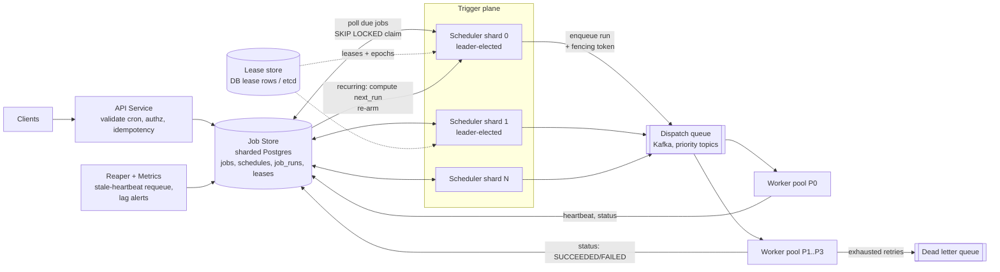
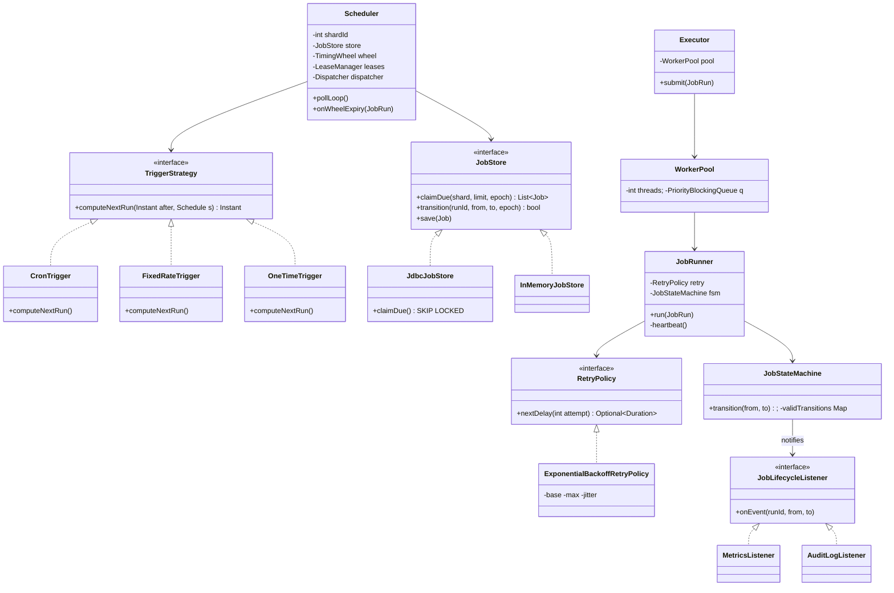

# Distributed Job Scheduler

## 1. Problem Statement & Scope

Design a horizontally scalable job scheduler ("cron at scale"): users register one-off and recurring jobs, the system fires them at the right time and executes them reliably.

### Functional requirements

- Schedule **one-off jobs** ("run at 2026-08-06T14:00:00Z") and **recurring jobs** (cron expressions like `0 */6 * * *`, fixed-rate, fixed-delay).
- **Execute** the job payload (invoke an HTTP callback, publish a message, or run registered handler code) with a configurable **retry policy**.
- **Pause / resume / cancel** jobs; query run history per job.
- **Priorities** (a critical billing job should preempt a low-priority cleanup job under contention).
- Optional: **DAG dependencies** (job B runs after job A succeeds) — extension, Section 7.

### Non-functional requirements

- **Precision**: fire within ~1s of due time for most jobs; sub-second precision for a small premium tier; minute-level acceptable for bulk cron.
- **Delivery semantics**: **at-least-once** execution. Never silently drop a due job. Exactly-once *effects* achieved via idempotent handlers, not exactly-once *delivery* (Section 7).
- **Availability**: no single point of failure; scheduler node loss must not lose or permanently stall jobs.
- **Scale**: horizontal scale of both triggering and execution.
- **Durability**: schedules and run history survive crashes (persisted, replicated).

### Back-of-envelope

Assume:

- **100M scheduled jobs** total (mostly recurring), ~10M distinct owners.
- Average firing rate: if each job fires ~10x/day on average → 1B firings/day ≈ **11.6K firings/sec average**. Peak (top of the hour, midnight cron pileup) easily **10x average → ~100K/sec peak burst**, sustained peak target **10K/sec** with burst smoothing.
- **Job row size**: id (16B) + owner (16B) + cron string (~32B) + payload ref (~64B) + timestamps/state/policy (~128B) ≈ **~300B/row** → 100M jobs ≈ **30 GB** — fits a sharded Postgres or a single beefy instance with replicas; run history is the real storage cost.
- **Run history**: 1B runs/day x ~200B/row = **200 GB/day** → must be partitioned by day and TTL'd (e.g., 30 days ≈ 6 TB) or shipped to cold storage.
- **Polling QPS math**: if each scheduler shard polls every 500ms and we have 64 shards → 128 poll queries/sec — trivial. The expensive part is not poll frequency but each poll doing an index range scan + row locks on the `next_run` index; with `LIMIT 1000` per poll, 64 shards x 2 polls/sec x 1000 = capacity for **128K claims/sec**, comfortably above peak.
- **Dispatch queue throughput**: 10K msgs/sec x ~1KB = 10 MB/s — well within one Kafka topic (dozens of partitions) or a few SQS queues.

Out of scope: the business logic inside jobs; multi-region active-active (mention: partition trigger space by region, jobs pinned to home region).

## 2. Brute-Force / Naive Design

Single process, in-memory **min-heap keyed on `next_run_time`**:

```
loop:
    job = heap.peek()
    sleep(job.next_run - now)          # or condition-wait with timeout
    heap.pop(); execute(job)           # inline, or thread pool
    if job.recurring: heap.push(job.withNext(cron.next(now)))
```

This is literally how `crond`, Quartz-in-RAM, and `ScheduledThreadPoolExecutor` work. Why it breaks at our scale:

1. **Durability**: process crash loses every schedule. Recurring jobs vanish; one-off jobs due during downtime never fire. Unacceptable for 100M jobs owned by paying customers.
2. **No HA**: one box down = zero firings. Even 99.9% uptime = ~43 min/month of missed jobs; at 11.6K/sec that is ~30M missed firings/month.
3. **Memory**: 100M heap entries x ~100B (object header + key + pointer) ≈ **10+ GB of heap** just for the index, before payloads. GC pauses on a 10 GB+ hot heap blow the 1s precision budget. Restart requires rescanning/rebuilding the entire heap — minutes of blindness.
4. **Execution throughput**: one machine cannot run 10K jobs/sec if the average job takes even 100ms of CPU/IO — that needs 1,000 concurrent slots on one box; a heavy job (30s report generation) head-of-line-blocks everything sharing its pool.
5. **Clock/sleep drift**: a single `sleep()` loop stalls behind one slow synchronous execution; every job after it misfires.

Each failure maps to a fix in Section 3: persistence, replicated/sharded triggering, bounded in-memory horizon, and separating triggering from execution.

## 3. Evolving the Design

**Bottleneck → fix**, incrementally:

1. **Crash loses schedules → persist jobs in a DB.** `jobs` table is the source of truth; the heap becomes a cache. On restart, reload only the near-term horizon (`next_run <= now + 5min`), not all 100M rows — memory problem solved too (5 min x 10K/sec = ~3M entries worst case, typically far fewer per shard).
2. **No HA → run N scheduler nodes with leader election.** Only the leader polls and fires (otherwise every node fires every job — duplicate storm). Leader holds a **lease** (etcd/ZooKeeper ephemeral node, or a DB lease row) renewed every T/3; on expiry a follower takes over within seconds.
3. **Single leader becomes the throughput bottleneck → shard the trigger space.** One leader doing 100K peak claims/sec saturates its DB connection pool and CPU on cron computation. Partition jobs by `hash(job_id) % num_shards` (uniform, simple) or by time-bucket (aligns with the `next_run` index, but hot at popular times — prefer hash). Each shard has its **own leader-elected scheduler**; shards scale independently. Shard count is the parallelism knob for triggering.
4. **Poll contention when multiple pollers hit the same rows →** claim atomically:
   ```sql
   SELECT * FROM jobs
   WHERE shard_id = ? AND next_run <= now() AND state = 'SCHEDULED'
   ORDER BY next_run
   LIMIT 1000
   FOR UPDATE SKIP LOCKED;
   ```
   `SKIP LOCKED` lets concurrent claimers (shard failover races, intra-shard poller threads) skip rows another transaction holds instead of blocking — turns the due-jobs index into a lock-free-ish work queue.
5. **Scheduler doing execution couples the wrong things → separate triggering from execution.** Scheduler's only job: move `SCHEDULED → QUEUED` and publish `{job_id, run_id, fire_time, fencing_token}` to a dispatch queue. Stateless **workers** pull, execute, report. Triggering scales with shards; execution scales with worker count — independent dials.
6. **Slow/hung jobs block workers → worker pools + timeouts + heartbeats.** Per-priority worker pools (so P0 never queues behind P3 bulk), per-job `timeout_ms`, workers heartbeat `job_runs.last_heartbeat` every 10s; a reaper requeues runs with stale heartbeats (this is where at-least-once duplicates come from — Section 7).
7. **"What happened to my job?" → persist the state machine.** Every transition `SCHEDULED → QUEUED → RUNNING → SUCCEEDED | FAILED → RETRYING → ... → DEAD` written to `job_runs` with attempt number, worker id, timestamps, error. Enables UI, debugging, SLA alerting, and correct crash recovery (a run stuck in RUNNING with a dead heartbeat is recoverable state, not a mystery).

Final shape: API → job store (sharded) → per-shard leader-elected schedulers (DB poll + in-memory timing wheel for the near horizon) → dispatch queue (partitioned, priority-aware) → worker fleet → status writes back → scheduler computes `next_run` for recurring jobs.

## 4. Protocol & Technology Choices — Why This, Not That

### Trigger mechanism

| Dimension | Hierarchical timing wheel (Kafka-style) | DB polling (`next_run` index) | Delay queue (SQS delay / Redis ZSET / RabbitMQ TTL+DLX) |
|---|---|---|---|
| Precision | ~1 tick (1–10ms) — best | poll interval (100ms–1s) | SQS: seconds, 15-min max delay; Redis ZSET poll: ~100ms; RabbitMQ TTL: head-of-line — expiry only observed at queue head |
| Durability | None (in-memory) — needs a backing store | Full (it *is* the store) | SQS durable; Redis = RDB/AOF (lossy window); RabbitMQ durable-ish |
| Max horizon | Practical: minutes–hours (memory-bound) | Unlimited (it's a table) | SQS 15 min hard cap; Redis unlimited but all in RAM; RabbitMQ awkward per-message TTL |
| Scale limit | O(1) insert/tick, millions of timers/node | DB write path + index churn; scales via sharding | SQS scales well within delay cap; Redis single-shard ZSET ~100K ops/s |
| Wins when | Sub-second precision, huge timer count, short horizon (Kafka request timeouts, Netty) | Long horizons, durability, queryability, pause/edit/cancel | You already run the infra and precision/horizon limits fit |

**Choice: DB polling as the durable source of truth + a per-shard in-memory hierarchical timing wheel as the near-term (next 60s) precision layer.** Polling alone caps precision at the poll interval and wastes queries; a wheel alone is volatile. The hybrid: poll loads `next_run <= now + 60s` into the wheel; the wheel fires with ~10ms precision. This is exactly Quartz's model (store + in-memory trigger horizon) and how most real systems land. A pure delay queue is rejected as primary because you can't cancel/edit/pause a message already enqueued with a delay, can't query "what's scheduled," and SQS's 15-minute cap forces re-enqueue chains.

### Leader election

| Option | Why choose | Why reject | Alternative wins when |
|---|---|---|---|
| **DB lease row** (`UPDATE leases SET owner=?, epoch=epoch+1, expires=now()+15s WHERE shard=? AND (owner=? OR expires<now())`) | Zero new infra; the DB is already the strongest-consistency component; **epoch column doubles as the fencing token** | Lease granularity ~seconds; DB is now on the control path | You don't already run etcd/ZK — most teams; this is the pragmatic pick |
| etcd | Raft-backed leases + watch API; K8s-native (Lease objects) | Another quorum system to operate | Already on Kubernetes — use `client-go` leaderelection |
| ZooKeeper | Battle-tested ephemeral znodes; herd of prior art | JVM ensemble ops burden; watch semantics footguns | You already run Kafka(ZK)/HBase and have ZK expertise |

**Choice: DB lease row with a monotonic epoch (fencing token).** Fewest moving parts, and the fencing token falls out for free.

### Dispatch queue

| Option | Why choose | Why reject | Wins when |
|---|---|---|---|
| **Kafka** | Partitioned throughput (10K–1M msg/s), replay for incident recovery, consumer groups = worker scaling, key by job_id for per-job ordering | No per-message ack — a slow job stalls its partition unless you decouple consume-from-execute; no native per-message delay; no built-in DLQ | Chosen at high scale with existing Kafka; pair with an executor pool so consumption isn't blocked by execution |
| SQS | Per-message ack + visibility timeout is *exactly* the worker-lease semantic; native DLQ + redrive; zero ops | AWS-only; ~seconds latency tail; standard queues themselves only at-least-once with occasional dupes (fine — we're idempotent anyway) | On AWS at <50K/s — honestly the best-fit semantics; pick it and say so |
| Redis (lists/streams) | Sub-ms latency | Durability window on failover; you rebuild ack/claim/DLQ (Streams XAUTOCLAIM) yourself | Sub-100ms dispatch latency requirement, small scale |

**Choice: Kafka** for throughput + replay at our scale (interview default); **explicitly note SQS's visibility-timeout model is the cleaner semantic fit** and wins on AWS at moderate scale.

### Job store

| Option | Why choose | Why reject | Wins when |
|---|---|---|---|
| **Postgres (sharded) + SKIP LOCKED** | Transactional claim, secondary index on `(shard_id, state, next_run)`, ad-hoc queries, `job_runs` FK integrity | Single-writer-per-shard write ceiling (~10–50K TPS/shard); index churn from constant `next_run` updates (mitigate: HOT updates, fillfactor) | Default choice through very large scale |
| DynamoDB + TTL streams | Serverless, infinite-ish scale | **TTL deletion fires up to 48h late** — disqualifying as a trigger; you'd still poll a GSI on next_run, with worse claim semantics (no SKIP LOCKED; conditional writes per item) | Job *metadata* store at extreme scale, trigger handled elsewhere |
| Cassandra | Linear write scale for run history | Time-ordered "due jobs" scan = bucketed partitions that go hot; queue-in-Cassandra tombstone hell is a classic anti-pattern | `job_runs` history archive, never the trigger table |

### Push vs pull work distribution

**Pull** (workers claim from queue): natural backpressure — a saturated worker just doesn't poll; no dispatcher needing worker liveness/capacity maps; add workers = add capacity, zero coordination. **Push** wins only for ultra-low latency to known endpoints (webhook fan-out) — and then you need per-endpoint rate limiting, circuit breakers, and a retry buffer, i.e., you rebuild the queue. **Choice: pull.**

### Build vs buy

| System | What it actually is | Use it when |
|---|---|---|
| Quartz | In-JVM scheduling library; clustered mode = DB row locks over shared tables | Single-app scheduling inside a JVM service; clustering strains past ~100s of nodes |
| Airflow | *Batch workflow orchestrator* — DAGs of tasks, minute-level, data pipelines; scheduler parses DAG files, not built for millions of independent jobs | ETL/data-engineering DAGs; wrong tool for "fire 10K user-defined jobs/sec" |
| Temporal | *Durable execution* — workflows are replayable event-sourced code; timers, retries, saga compensation built in | Long-running multi-step business processes (order fulfillment, onboarding). Overkill as a pure cron trigger, superb once jobs are workflows |
| Build | This design | Product requirement is multi-tenant scheduling-as-a-service at scale with custom precision/priority/quotas — none of the above is that product |

## 5. High-Level Design (HLD)



### Write path (create job)

1. `POST /jobs` → validate cron expression (parse, reject sub-minute unless tier allows, cap far-future dates), authz, quota check.
2. Compute `next_run = cronNext(schedule, now, tz)`; assign `shard_id = hash(job_id) % N`.
3. Insert `jobs` row (`state = SCHEDULED`) transactionally; API `Idempotency-Key` header dedupes client retries via a unique index.

### Trigger / execution path

1. Shard leader polls: claims due jobs with `FOR UPDATE SKIP LOCKED`, sets `state = QUEUED`, inserts a `job_runs` row (attempt 1), stamps its **epoch/fencing token** — one transaction.
2. Loads near-term jobs (due within 60s) into the in-memory timing wheel for precise firing; wheel expiry → enqueue to Kafka (topic per priority band, key = job_id).
3. Worker consumes, CAS-transitions run `QUEUED → RUNNING` (guarded by fencing token), heartbeats every 10s, executes with timeout.
4. On success: run → `SUCCEEDED`; recurring job → compute next occurrence, `state = SCHEDULED`, `next_run` updated (misfire policy applied if we're late — Section 6c). On failure: RetryPolicy decides `RETRYING` (set `next_run = now + backoff`) or `DEAD` (+ DLQ).
5. Reaper: `RUNNING` runs with `last_heartbeat < now - 30s` → mark attempt `FAILED(worker_lost)`, requeue per retry policy.

### Data model

```
jobs(
  job_id UUID PK, owner_id, shard_id SMALLINT,
  schedule_type ENUM(cron, fixed_rate, one_time), cron_expr TEXT, timezone TEXT,
  payload JSONB / payload_ref, priority SMALLINT,
  state ENUM(SCHEDULED, QUEUED, RUNNING, PAUSED, COMPLETED, DEAD),
  next_run TIMESTAMPTZ, last_run TIMESTAMPTZ,
  misfire_policy ENUM(fire_now, skip, catch_up),
  retry_policy JSONB {max_attempts, base_ms, max_ms, jitter},
  timeout_ms INT, idempotency_key TEXT UNIQUE, version INT,   -- optimistic lock
  created_at, updated_at
)
INDEX due_idx ON jobs(shard_id, state, next_run)   -- the poll index; keep it lean

job_runs(
  run_id UUID PK, job_id FK, attempt INT, scheduled_for TIMESTAMPTZ,
  state ENUM(QUEUED, RUNNING, SUCCEEDED, FAILED, RETRYING, DEAD),
  worker_id, fencing_token BIGINT, started_at, finished_at,
  last_heartbeat TIMESTAMPTZ, error TEXT, output_ref TEXT
)  -- partitioned by day, TTL 30d
UNIQUE(job_id, scheduled_for, attempt)   -- dedupes double-enqueue

leases(shard_id PK, owner_node TEXT, epoch BIGINT, expires_at TIMESTAMPTZ)
-- epoch increments on every acquisition; epoch IS the fencing token
```

### API

```
POST   /jobs                      {schedule: {cron|run_at|rate}, timezone, payload,
                                   priority, retry_policy, misfire_policy, timeout_ms}
                                   Header: Idempotency-Key   → 201 {job_id, next_run}
GET    /jobs/{id}                 job + state + next_run
GET    /jobs/{id}/runs?limit=&cursor=      attempt history
PATCH  /jobs/{id}                 {action: pause | resume} | partial schedule update
DELETE /jobs/{id}                 cancel (soft-delete; in-flight run drains)
```

## 6. Low-Level Design (LLD)



**Patterns, named:**
- **Strategy** — `TriggerStrategy`: next-run computation varies by schedule type; the scheduler is closed to modification when a new type (e.g., business-day calendar trigger) is added. Same pattern for `RetryPolicy`.
- **Repository** — `JobStore`: persistence behind an interface; `InMemoryJobStore` makes the scheduler unit-testable without a DB, `JdbcJobStore` for production.
- **Observer** — `JobLifecycleListener`: metrics, audit, webhooks, and DAG-dependency triggering subscribe to state transitions without coupling the runner to them.
- **State** (as a validated transition table) — `JobStateMachine` rejects illegal transitions (`SUCCEEDED → RUNNING`), making replayed/duplicate messages harmless at the persistence layer.

### (a) Scheduler poll loop — SKIP LOCKED claim + lease/fencing token

```java
void pollLoop() {
    while (running) {
        Lease lease = leases.acquireOrRenew(shardId);      // UPDATE ... epoch+1 on takeover
        if (lease == null) { sleep(retryMs); continue; }   // not leader for this shard
        long epoch = lease.epoch();                        // fencing token

        List<Job> due = store.inTransaction(tx -> {
            List<Job> jobs = tx.query("""
                SELECT * FROM jobs
                WHERE shard_id = ? AND state = 'SCHEDULED' AND next_run <= ?
                ORDER BY next_run LIMIT 1000
                FOR UPDATE SKIP LOCKED""", shardId, now().plus(WHEEL_HORIZON));
            for (Job j : jobs) {
                tx.update("UPDATE jobs SET state='QUEUED' WHERE job_id=?", j.id());
                tx.insertRun(j.id(), j.nextRun(), /*attempt*/ 1, epoch);
            }
            return jobs;                                   // claim + run insert atomic
        });

        for (Job j : due) {
            if (j.nextRun().isBefore(now())) dispatch(j, epoch);       // already due
            else wheel.insert(j.nextRun(), () -> dispatch(j, epoch));  // near-term precision
        }
        sleep(POLL_INTERVAL_MS);   // 500ms; wheel covers precision between polls
    }
}

void dispatch(Job j, long epoch) {
    // Every downstream write carries epoch; store rejects writes where
    // epoch < leases.current_epoch(shard) — a paused old leader cannot double-fire.
    dispatcher.enqueue(new RunMessage(j.id(), j.currentRunId(), epoch, j.priority()));
}
```

### (b) Hierarchical timing wheel — insert / tick

```java
class TimingWheel {                       // Kafka-style hierarchical wheel
    final long tickMs;                    // e.g. 10ms
    final int wheelSize;                  // e.g. 60 buckets -> 600ms span per level
    final long interval;                  // tickMs * wheelSize
    long currentTime;                     // floored to tickMs
    final Bucket[] buckets;
    volatile TimingWheel overflow;        // next level: tickMs' = this.interval

    boolean insert(TimerTask t) {
        long exp = t.expirationMs;
        if (exp < currentTime + tickMs) return false;          // due now -> run
        if (exp < currentTime + interval) {
            long virtualId = exp / tickMs;
            buckets[(int)(virtualId % wheelSize)].add(t);      // O(1)
            return true;
        }
        if (overflow == null) overflow = new TimingWheel(interval, wheelSize, currentTime);
        return overflow.insert(t);                             // coarser level
    }

    void advanceTo(long timeMs) {                              // driven by a DelayQueue
        if (timeMs >= currentTime + tickMs) {
            currentTime = timeMs - (timeMs % tickMs);
            if (overflow != null) overflow.advanceTo(currentTime);
        }
    }
    // On bucket expiry: re-insert each task (cascades level-2 tasks down to
    // level-1 with finer precision) or execute if now due. Insert/expire O(1);
    // vs O(log n) heap — matters at millions of in-flight timers.
}
```

### (c) Next-run computation + misfire policy branch

```java
void onRunFinished(Job job, RunResult result, long epoch) {
    if (!fsm.transition(result.runId(), RUNNING, result.state(), epoch)) return; // stale epoch/dup

    if (result.failed()) {
        Optional<Duration> delay = job.retryPolicy().nextDelay(result.attempt());
        if (delay.isPresent()) {
            store.scheduleRetry(job.id(), now().plus(delay.get()), result.attempt() + 1, epoch);
            return;                                            // state = RETRYING
        }
        store.markDead(job.id(), result.runId(), epoch);       // -> DLQ
        return;
    }
    if (!job.isRecurring()) { store.complete(job.id(), epoch); return; }

    Instant next = trigger.computeNextRun(job.scheduledFor(), job.schedule());
    if (next.isBefore(now())) {                                // MISFIRE: we are late
        switch (job.misfirePolicy()) {
            case FIRE_NOW -> next = now();                     // run once immediately;
                                                               // then next = computeNextRun(now)
            case SKIP     -> { do { next = trigger.computeNextRun(next, job.schedule()); }
                               while (next.isBefore(now())); } // drop missed, align to future
            case CATCH_UP -> { /* keep 'next' in the past: fires missed occurrences
                                  sequentially; MUST be rate-limited (Section 7) */ }
        }
    }
    store.rearm(job.id(), next, epoch);                        // state = SCHEDULED
}

// ExponentialBackoffRetryPolicy: delay = min(maxMs, baseMs * 2^(attempt-1))
// then FULL JITTER: delay = random(0, delay)   (AWS-style; decorrelates retry waves)
// nextDelay returns empty() when attempt >= maxAttempts.
```

**Misfire policy guidance**: `FIRE_NOW` for idempotent freshness jobs (cache refresh — one run now is as good as the missed ones); `SKIP` for time-anchored jobs (9am digest email at 3pm is wrong; wait for tomorrow); `CATCH_UP` for ledger-like jobs where each occurrence has distinct meaning (hourly billing rollup — every hour must be processed).

## 7. Deep Dives & Failure Modes

**Scheduler leader dies mid-firing — fencing tokens.** Leader A claims 1,000 jobs, GC-pauses for 20s; its lease expires; B takes over with `epoch = A.epoch + 1` and reclaims the still-QUEUED rows. A wakes and continues enqueueing. Without fencing: double-fire. With fencing: every state write and enqueue carries the epoch; the store's transition is `UPDATE job_runs SET state=? WHERE run_id=? AND fencing_token <= ?` — wait, direction matters: writes with `epoch < current lease epoch` are **rejected**, and workers dedupe run messages via the `UNIQUE(job_id, scheduled_for, attempt)` constraint. A's stale enqueues become no-ops at claim time. The token must be checked by the *resource being written*, not just held by the writer — a token you never validate is decoration (Kleppmann's point vs. Redlock).

**Worker dies mid-job.** Heartbeat stops → reaper (after 3 missed beats = 30s) marks the attempt `FAILED(worker_lost)` and requeues. But the worker may have *finished the work* and died before acking — the retry re-executes. This is the irreducible at-least-once window: crash-after-effect-before-ack is indistinguishable from crash-before-effect. Hence **handlers must be idempotent**: dedupe on `(job_id, scheduled_for)` as the idempotency key — natural, stable across attempts (`run_id` changes per attempt; don't key on it). Techniques: idempotency table with unique insert, conditional writes, "INSERT ... ON CONFLICT DO NOTHING," or making the operation naturally idempotent (set-to-value, not increment).

**Clock skew.** All due-ness comparisons use the **DB's clock** (`next_run <= now()` evaluated server-side), so scheduler-node skew can't fire early/late — one clock of record per shard. Workers never make timing decisions. NTP-discipline nodes anyway for heartbeat/lease math; lease durations (15s) must dwarf plausible skew (<500ms) — a rule of thumb: lease TTL >= 10x max skew + max GC pause. Never compare timestamps produced by two different machines to make a correctness decision.

**Misfire storm after a long outage.** Scheduler down 2 hours; 11.6K/sec x 7,200s ≈ **84M missed firings** are now all `next_run <= now()`. Naive recovery dumps them into the queue at claim speed and DDoSes every downstream callback. Mitigations: (1) apply per-job misfire policy first — `SKIP` and `FIRE_NOW`(coalesce) collapse most of the backlog, only `CATCH_UP` jobs replay history; (2) **catch-up rate limiter** — token bucket per shard and per tenant caps backlog drain (e.g., 2x normal rate) while current-time jobs take priority lane; (3) order backlog by priority then staleness.

**Thundering herd at `0 0 * * *`.** Thousands of tenants pick midnight. Fixes: (a) **schedule jitter** — hash(job_id) → 0–299s offset applied to non-time-sensitive jobs (make jitter opt-out, advertised in the API); (b) queue absorbs the spike — workers drain at their rate, that's the point of the queue; (c) admission: nudge/price sub-minute and top-of-hour precision so bulk jobs land on spread schedules.

**Poison jobs.** A job that crashes its worker or always fails burns retries forever. Retry cap (`max_attempts`, e.g., 5) → `DEAD` + DLQ with full attempt history; alert owner; manual redrive endpoint. Also a **failure-rate circuit breaker per destination**: if callbacks to endpoint X fail >90% for 5 min, pause X's jobs rather than burn worker capacity.

**Hot shard.** One tenant schedules 5M jobs; `hash(job_id)` spreads them, but a *time-bucket* partitioning would concentrate midnight — another reason hash won in Section 3. If a shard still runs hot: split it (double shard count for that range, jobs re-map via consistent hashing) or add per-tenant quotas (jobs count + firings/sec) — multi-tenant fairness is quota + per-tenant token buckets at dispatch.

**The exactly-once illusion, crisply.** Exactly-once *delivery* between two parties over a lossy network is impossible (Two Generals): an unacked effect must be retried (→ possible duplicate) or dropped (→ possible loss); you must pick a side, and schedulers pick duplicate. What systems that claim "exactly-once" (Kafka EOS, Temporal) actually provide is **at-least-once delivery + idempotent/transactional processing inside a boundary they control** — dedupe by sequence number, transactional offsets, event-sourced replay. The moment the effect leaves that boundary (send an email, charge a card via third-party API), you're back to at-least-once + an idempotency key handed to the external system. Interview framing: "I guarantee every job *effect happens exactly once* by guaranteeing every job *message is delivered at least once* to a handler that's safe to run twice."

**DAG extension (Airflow-style).** Add `job_dependencies(child_id, parent_id)` and per-DAG-execution state keyed by `(dag_id, logical_date)`. Dispatch = **incremental topological release**: a node becomes eligible when all parents' runs for the same logical date are `SUCCEEDED` — implemented as an Observer on job completion decrementing a per-run `pending_parents` counter (no global topo sort needed; validate acyclicity at DAG registration via DFS). Upstream failure propagation: children marked `UPSTREAM_FAILED` (a terminal state distinct from FAILED — they never ran); support trigger rules (`all_success` default, `all_done`, `one_success`) and partial backfill/retry from the failed node with downstream reset. Fan-in nodes need the counter update to be atomic (conditional decrement) or two parents completing concurrently can double-release the child.

## 8. Trade-off Summary & Interview Soundbites

| Decision | Trade-off accepted |
|---|---|
| DB poll + in-memory timing wheel hybrid | Two mechanisms to operate; bounded staleness between store and wheel — bought durability *and* ~10ms precision |
| Sharded leaders vs single global leader | Coordination per shard, rebalancing on resize — bought linear trigger-plane scaling |
| At-least-once + idempotent handlers | Duplicate executions reach handlers — bought the only semantics physics allows, without a distributed-transaction tax |
| Pull-based workers | Extra queue hop of latency — bought free backpressure and coordination-free worker scaling |
| SKIP LOCKED claim in Postgres | DB on the hot path; per-shard write ceiling — bought transactional claim + queryable source of truth |
| DB lease + epoch for election | Coarser failover (~lease TTL) than etcd watches — bought zero extra infra and a free fencing token |
| Hash sharding over time-bucket | Range scans cross shards — bought immunity to top-of-hour hot shards |
| Run history TTL 30d + archive | Old runs need cold-storage lookup — bought bounded hot storage (6 TB vs unbounded) |

**Soundbites**

1. "Separate the trigger plane from the execution plane — they scale on different axes and fail differently."
2. "The database is the schedule; the timing wheel is just a precision cache of the next 60 seconds."
3. "Exactly-once is a system property you construct from at-least-once delivery plus idempotency — never a delivery guarantee you're handed."
4. "A fencing token nobody validates is decoration; the store must reject stale epochs, not trust the leader to behave."
5. "Misfire policy is a per-job business decision — fire-now for freshness, skip for time-anchored, catch-up for ledgers — not a system-wide constant."
6. "SKIP LOCKED turns an ordinary index into a concurrent work queue with none of the queue-in-a-database blocking pathologies."
7. "Retry without jitter is a self-inflicted DDoS on a schedule; full jitter decorrelates the wave."
8. "Idempotency-key on `(job_id, scheduled_for)`, never `run_id` — the key must survive the retry it exists to dedupe."

**Common follow-ups**

- *"How do you guarantee a job runs exactly once?"* — You can't guarantee exactly-once delivery (Two Generals: an unacked attempt must be retried or dropped). You guarantee at-least-once delivery and exactly-once *effect*: fencing tokens stop stale leaders from double-enqueueing, a unique constraint on `(job_id, scheduled_for, attempt)` dedupes the queue side, and the handler dedupes on `(job_id, scheduled_for)` for the crash-after-effect window nothing upstream can close.
- *"Scale to 1M firings/sec?"* — The trigger plane shards linearly: ~1,000 shards each claiming 1K/sec is mundane per-shard load; the job store moves to a purpose-partitioned fleet (or the due-index moves to per-shard Redis ZSETs backed by the durable store); Kafka handles 1M msg/s with partitioning; the real bottleneck becomes downstream callback capacity — per-tenant rate limits and priority shedding, not scheduler internals.
- *"How is Temporal different?"* — Temporal is durable *execution*, not scheduling: workflow code is event-sourced and replayed after any crash, so multi-step state, timers, and retries live in the workflow itself. Our scheduler answers "fire this at time T reliably"; Temporal answers "run this 40-step, 3-week process without losing my place." Temporal's cron is a feature on top of its engine; our engine could dispatch *into* Temporal workflows for complex jobs.
- *"Why not just Airflow?"* — Airflow schedules *data pipelines*: DAG-file parsing, minute-granularity, single logical scheduler tuned for thousands of DAGs — not a multi-tenant API ingesting millions of independent user jobs at second precision. Right tool, different problem.
- *"How do you handle a schedule edit while a run is in flight?"* — Optimistic version column on `jobs`; the in-flight run completes under its captured config; re-arm reads the latest row, so the edit takes effect from the next occurrence — and a pause between claim and execute is caught by a state re-check at worker claim time.
