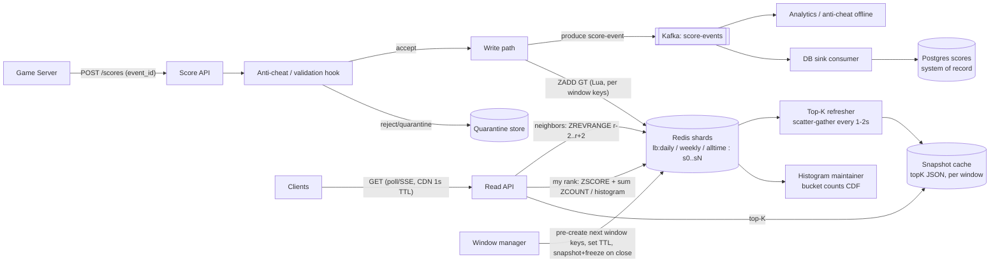
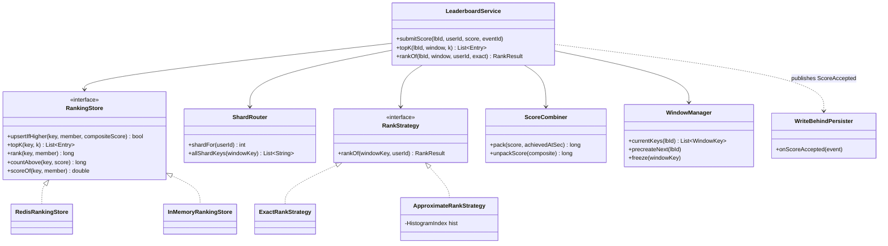

# Real-Time Leaderboard

## 1. Problem Statement & Scope

Design a gaming-scale real-time leaderboard: players submit scores, the system serves global and windowed rankings with low latency.

### Functional Requirements

1. **Submit score** — a game server reports a score for `(user_id, leaderboard_id)` at match end. Semantics are configurable per game: *only-improve* (keep max score) or *accumulate* (increment total points).
2. **Get top-K** — return the top K entries (K ≤ 100 typical, K ≤ 1000 hard cap) with user, score, rank.
3. **Get my rank + neighbors** — exact (or bounded-error) rank for any user, plus the ±2..±5 surrounding entries ("you are #48,213, here are #48,211–#48,215").
4. **Time windows** — daily, weekly, and all-time leaderboards, each independently rankable. Daily resets at 00:00 UTC.
5. **Live-ish updates** — top-K views should reflect new scores within ~1–2 s; a user's own rank should reflect their own write read-your-writes style.

### Non-Functional Requirements

- **Read-heavy**: reads (top-K + rank lookups) outnumber writes ~10:1.
- **Latency**: p99 < 50 ms for top-K, < 100 ms for rank+neighbors.
- **Scale**: 50M DAU per title; must have a story for 500M users all-time.
- **Durability**: a lost score is a support ticket; ranks may be rebuilt, scores may not be lost.
- **Consistency**: eventual consistency on ranks is acceptable (seconds); a user's own submitted score must not be silently dropped.

### Back-of-Envelope

- **Writes**: 50M DAU × 5 games/day = 250M score submissions/day.
  250M / 86,400 s ≈ **2,900 writes/s average**; peak (evening, tournament end) ×5–10 → **~15k–30k writes/s**. A single Redis node does 100k+ ops/s, so write *throughput* is not the problem — memory and rank-query cost are.
- **Reads**: 10× writes → ~29k reads/s avg, ~300k/s peak. But most reads are the *same* top-10/top-100 — highly cacheable.
- **Memory per zset entry**: Redis sorted set = hash table entry + skiplist node. Roughly: member string (say 16-byte user id) + robj/SDS overhead + skiplist node (score double, backward ptr, avg ~1.33 level ptrs) + dict entry ≈ **100–130 bytes/entry**.
  50M entries × ~120 B ≈ **6 GB per window**. Daily + weekly + all-time = ~18 GB, plus replication ×2 → ~36 GB fleet-wide for one title. Fits in a few Redis nodes but **not** comfortably on one, and all-time at 500M users → 60 GB for one zset → *must* shard.
- **Kafka persistence stream**: 250M events/day × ~200 B ≈ 50 GB/day — trivial.

Scope out: matchmaking, anti-cheat internals (we place a hook), social/friend leaderboards (mention as a filter variant at the end).

## 2. Brute-Force / Naive Design

One SQL table:

```sql
CREATE TABLE scores (
  leaderboard_id BIGINT,
  user_id        BIGINT,
  score          BIGINT,
  updated_at     TIMESTAMP,
  PRIMARY KEY (leaderboard_id, user_id)
);
CREATE INDEX idx_lb_score ON scores (leaderboard_id, score DESC);
```

- **Top-K**: `SELECT ... ORDER BY score DESC LIMIT 100` — fine with the index, until pagination: `LIMIT 100 OFFSET 1000000` walks 1M index entries per query, O(offset).
- **My rank**: `SELECT COUNT(*) FROM scores WHERE leaderboard_id=? AND score > :myScore` — an index *range scan* counting every row above you. For a median player that is **O(N/2) ≈ 25M index entries per query**. At even 1k rank-QPS this is 25 *billion* index touches/s. Dead on arrival.
- **Writes**: 15–30k updates/s against a secondary index on a hot, monotonically shuffled column → constant B-tree page splits, buffer pool churn, replication lag. Postgres/MySQL survive this only with heavy partitioning, and it buys you nothing for the rank query.
- **Windowing**: `WHERE updated_at > midnight` breaks the score index entirely (composite index per window, table bloat, vacuum storms on daily deletes).

Numbers verdict: rank query is O(N) per read at ~10³ QPS with N = 5×10⁷ → the design breaks on reads long before writes. We need a data structure where **rank is a first-class O(log N) operation**.

## 3. Evolving the Design

Each step: bottleneck → fix.

1. **O(N) rank in SQL → Redis sorted set.** A zset is a hash map (member → score, O(1) score lookup) plus a skiplist ordered by (score, member). `ZADD`/`ZINCRBY` are O(log N); `ZREVRANK` is O(log N) because skiplist nodes carry *span* counts, so rank is computed while descending levels; `ZREVRANGE 0 99` is O(log N + K). One command replaces the 25M-row count.
2. **Redis is volatile → write-behind durability.** Redis holds *rank truth*; every accepted score is also produced to Kafka, and a sink consumer upserts Postgres/DynamoDB. On Redis loss: restore from RDB/AOF, replay Kafka from the last snapshot offset. DB is *score* truth; ranks are always recomputable.
3. **One 6–60 GB zset = single-node memory + hot key → shard by `hash(user_id) % S`.** Writes spread across S nodes. Top-K becomes scatter-gather: fetch top-K from each shard, k-way merge. Exact rank becomes `1 + Σ_shards ZCOUNT(shard, (myScore, +inf)` — S parallel O(log n_s) ops.
4. **Exact rank for the long tail is S round-trips per lookup at high QPS → approximate rank.** Maintain a score histogram (fixed or exponential buckets, or a t-digest). Rank ≈ cumulative count of buckets above yours + intra-bucket interpolation. #48,213,772 doesn't need the last three digits right; top-1000 stays exact.
5. **Time windows → key-per-window with TTL.** `lb:{game}:daily:2026-08-06`, `lb:{game}:weekly:2026-W32`. Writes go to current daily + weekly + all-time keys. Old windows expire via TTL (kept ~7 d for "yesterday's results"). Pre-create/warm next window before midnight; no delete storms, no timestamp filtering.
6. **Top-10 read spike (300k/s all asking the same thing) → cached top-K snapshot.** A refresher pulls merged top-K every 1–2 s into local memory / a plain Redis string on each API node; CDN/edge cache with `max-age=1` for public boards. Read amplification on the zsets drops to ~1 QPS per window regardless of client load.

End state: sharded Redis zsets per window (rank), Kafka → DB (durability), histogram (approximate tail rank), snapshot cache (top-K reads).

## 4. Protocol & Technology Choices — Why This, Not That

### Rank storage

| Option | Rank op cost | Verdict | When it would win |
|---|---|---|---|
| **Redis sorted set** | O(log N) rank, O(log N + K) top-K, in-memory | **Chosen** — the only mainstream store where rank is a native primitive | — |
| SQL (Postgres/MySQL) | O(N) count per rank; OFFSET pagination O(offset) | Rejected for serving; **kept as durable system of record** | Small boards (<100k rows), or batch-computed ranks refreshed hourly |
| Cassandra counters | No ordering across partitions; counters aren't idempotent, can't index by value | Rejected | Pure "total points" storage with ranks computed offline (Spark) |
| DynamoDB (GSI score as sort key) | Top-K per partition OK; global rank = full scan; write-sharded GSIs get complex | Rejected for ranks | Serverless shop wanting managed durability tier; pair with in-memory ranker |
| Aerospike / KeyDB / Dragonfly | Same sorted-structure idea, better memory/threading | Viable substitutes | >1 TB in-memory footprint or when Redis single-threaded CPU is the wall |

#### Sorted-set internals — why the complexities are what they are

A zset above the small-set threshold is **two structures over the same entries**:

- **dict (hash table)**: member → score. Answers `ZSCORE` in O(1); this is what makes `ZADD` on an existing member cheap to detect (look up old score first) and what the only-if-higher compare reads.
- **skiplist**: nodes ordered by (score, then member lexicographically — ties are deterministic). A probabilistic multi-level linked list: each node gets level ℓ with probability p^ℓ (Redis p=0.25, max 32 levels), giving expected O(log N) search like a balanced tree but with trivially simple insert/delete (no rotations) and cheap *forward range iteration* (level-0 is a plain linked list with a backward pointer for reverse scans).
- **Spans**: each forward pointer at each level stores how many level-0 nodes it skips. `ZRANK` descends from the top level accumulating spans — rank falls out of the same O(log N) walk that finds the node. This is the one field that separates "sorted structure" from "ranking structure"; a plain balanced BST without subtree-size augmentation cannot do this. `ZRANGE ... BYRANK` similarly seeks by cumulative span in O(log N), then walks K nodes.

Command costs, derived from the two structures:

| Command | Cost | Which structure pays, and why |
|---|---|---|
| `ZSCORE` | O(1) | dict lookup only |
| `ZADD` (new member) | O(log N) | dict insert O(1) + skiplist insert O(log N) |
| `ZADD` (score change) | O(log N) | dict tells us the old score O(1); skiplist node deleted and reinserted at new position |
| `ZINCRBY` | O(log N) | same as score-change ZADD |
| `ZRANK` / `ZREVRANK` | O(log N) | skiplist descent summing spans — no scan |
| `ZREVRANGE 0 K-1` | O(log N + K) | span-seek to rank 0, then walk K level-0 nodes |
| `ZCOUNT min max` | O(log N) | two span-summing boundary walks; count = rank difference |
| `ZRANGEBYSCORE ... LIMIT off n` | O(log N + off + n) | the offset is *walked* — deep paging inside a shard still wants cursor bounds |
| `ZREM` | O(log N) | dict delete O(1) + skiplist unlink O(log N) |
| `ZRANGEBYLEX` | O(log N + K) | only meaningful when all scores equal — not our case |

Small-set encoding: below thresholds (`zset-max-listpack-entries` 128, value length 64) Redis stores the zset as a flat listpack (contiguous buffer, O(N) ops, tiny memory). Irrelevant for the 50M board but exactly relevant for per-user or per-clan mini-boards — millions of tiny zsets stay in listpack encoding and the ~120 B/entry estimate drops several-fold. Memory drivers for the big board: every entry pays dict entry + robj/SDS member (stored once, shared by both structures) + skiplist node with avg 1/(1−p) ≈ 1.33 levels → the 100–130 B/entry figure in §1 — quote it, it's the number that forces sharding.

### Sharding topology

| Option | Pros | Cons | Verdict |
|---|---|---|---|
| Single zset, one node | Exact ranks in one op, trivial | 60 GB key, one node's CPU/NIC takes all traffic; failover story is scary | Only for ≤ ~10M entries |
| **Application-level sharded zsets (hash(user_id) % S)** | Spreads memory+write CPU; shard count under our control; scatter-gather is S parallel O(log n) ops | Exact global rank costs S round-trips; resharding is a migration | **Chosen** |
| Redis Cluster, hash-tags to co-locate | Managed slot migration | Hash-tagging all shards of one board to one slot **defeats the purpose** (one key = one slot = one node; Cluster never splits a key); without tags you can't multi-key anyway | Use Cluster as the *fleet*, but shard logic stays in the app |

### Rank fidelity

| Option | Error | Cost per lookup | Verdict |
|---|---|---|---|
| Exact (Σ ZCOUNT across shards) | 0 | S round-trips, S × O(log n) | Top-1000 and "my rank" on demand |
| **Score-histogram buckets** | ≤ bucket width count | O(1) from cached CDF + 1 ZCOUNT | **Default for long tail** |
| t-digest (Redis Stack `TDIGEST.RANK`) | ~0.1–1% relative, best at the extremes | O(1) | Percentile displays ("top 3%"); mention, don't build first |

### Client update delivery

| Option | Verdict |
|---|---|
| Polling (1–2 s, ETag) | **Chosen default** — top-K only changes ~1/s post-cache anyway; infinitely CDN-friendly |
| SSE | Chosen for "watch the board" tournament screens — one-way, auto-reconnect, HTTP-native |
| WebSocket | Rejected here — bidirectional plumbing for a read-only feed; wins only if the game already holds a WS for gameplay (then piggyback) |

### Persistence path

| Option | Verdict |
|---|---|
| **Kafka write-behind (API → Redis + Kafka; consumer → DB)** | **Chosen** — absorbs DB downtime, replayable, feeds analytics/anti-cheat for free |
| Direct dual-write (API → Redis and DB synchronously) | Rejected — no atomicity across the two; partial-failure divergence with no repair log; DB p99 leaks into submit latency |
| CDC from DB → Redis | Inverts truth: DB can't answer "did I improve?" cheaply per write; adds rank staleness. Wins when DB is *already* the mandated system of record |

### Atomic only-if-higher update

| Option | Verdict |
|---|---|
| **`ZADD key GT CH member`** (Redis ≥ 6.2) | **Chosen** — server-side compare-and-set in one command, no round trips |
| Lua script | Chosen when logic exceeds GT (composite tie-break score must be rebuilt from parts, dedup check, multi-key window fan-out) — atomic, one RTT |
| WATCH/MULTI/EXEC | Rejected — optimistic retry loops under contention on a hot member; strictly worse than Lua here |
| Plain ZSCORE-then-ZADD | Rejected — read-modify-write race loses the higher of two concurrent scores |

## 5. High-Level Design (HLD)



### Write path

1. Game server (never the client directly) calls `POST /scores` with an idempotency `event_id`.
2. Validation/anti-cheat hook: schema, score bounds per game mode, z-score outlier check; suspicious scores go to quarantine, not the board.
3. Lua script per shard: dedup `event_id` (SET NX EX 86400), then `ZADD GT` (or composite compare-and-set) into `daily`, `weekly`, `alltime` keys for the user's shard.
4. Produce the event to Kafka (acks=all). Redis-write and Kafka-produce both succeed before 200; on Kafka failure, buffer locally and retry (Redis already has it; DB catches up on replay).
5. Sink consumer upserts `scores` table with `GREATEST(score, excluded.score)` semantics; idempotent by `event_id`.

### Read path

- **Top-K**: served from the snapshot cache (JSON blob refreshed every 1–2 s by scatter-gather merge). CDN-cacheable.
- **My rank (exact)**: `ZSCORE` on the user's shard → parallel `ZCOUNT (score, +inf)` on all shards → rank = 1 + Σ. ~1–2 ms with pipelining.
- **My rank (approx, long tail)**: cached bucket CDF lookup + one `ZCOUNT` in own shard's bucket range.
- **Neighbors**: cheap only within a shard; for global neighbors, use rank r from above, then `ZREVRANGEBYSCORE` a narrow score band on all shards and merge ±2 around the user's score (band chosen from histogram density).

### Data model

Redis (per shard s, per window):
```
lb:{game}:daily:2026-08-06:{s}    ZSET member=user_id score=composite   TTL 7d
lb:{game}:weekly:2026-W32:{s}     ZSET                                  TTL 30d
lb:{game}:alltime:{s}             ZSET                                  no TTL
lbhist:{game}:daily:2026-08-06    HASH bucket_id -> count (or t-digest)
dedup:{event_id}                  STRING NX, TTL 24h
lbsnap:{game}:daily:2026-08-06    STRING frozen top-K JSON (post-close)
```

Postgres:
```sql
scores(leaderboard_id, window_id, user_id, score BIGINT, achieved_at, event_id, PRIMARY KEY(leaderboard_id, window_id, user_id));
leaderboard_snapshots(leaderboard_id, window_id, rank, user_id, score, frozen_at);  -- final results, prizes/audit
```

### API

```
POST /v1/leaderboards/{lbId}/scores        {user_id, score, event_id, achieved_at} -> {accepted, new_best, score}
GET  /v1/leaderboards/{lbId}/top?window=daily&k=100&cursor=...                      -> [{rank,user,score}...]
GET  /v1/leaderboards/{lbId}/users/{uid}/rank?window=daily&exact=false&neighbors=2  -> {rank, approx, score, neighbors[]}
```

## 6. Low-Level Design (LLD)



Patterns, named:
- **Repository** — `RankingStore` abstracts the store; `InMemoryRankingStore` (TreeMap + HashMap) makes unit tests hermetic and is the machine-coding fallback.
- **Strategy** — `RankStrategy` swaps exact vs approximate per request (`exact=` flag, or by rank threshold: exact if likely top-10k).
- **Factory** — `WindowManager` mints window keys (`daily:2026-08-06`), owns TTLs, pre-creation, and freeze-on-close.
- **Observer** — `WriteBehindPersister` subscribes to `ScoreAccepted` events (in-process bus → Kafka producer); write path doesn't know about the DB.
- **Adapter/Sharding** — `ShardRouter` maps userId → shard suffix and enumerates shard keys for scatter-gather.

### (a) Composite score packing (tie-break: earlier scorer wins)

```java
// Redis zset scores are IEEE-754 doubles: integers are exact only up to 2^53.
// Layout: [ raw score : high bits ][ inverted time : low 20 bits ]
static final long TS_BITS   = 20;                    // 2^20 = 1,048,576 buckets
static final long MAX_TS    = (1L << TS_BITS) - 1;   // ~12 days at 1s buckets; use epoch-relative
static final long EPOCH     = 1_754_006_400L;        // window/season start, seconds

long pack(long score, long achievedAtSec) {
    long tsBucket = clamp(achievedAtSec - EPOCH, 0, MAX_TS);   // seconds since season start
    long composite = (score << TS_BITS) | (MAX_TS - tsBucket); // earlier => larger low bits
    // Safety: composite must be <= 2^53 for exact double representation.
    // => score <= 2^(53-20) = 2^33 ≈ 8.59e9. Assert at ingest.
    if (score >= (1L << (53 - TS_BITS))) throw new ScoreOverflow();
    return composite;
}
long unpackScore(long composite) { return composite >>> TS_BITS; }
```

Analysis: doubles have a 52-bit mantissa (53 significant bits with the implicit leading 1). Any packed value > 2^53 silently rounds — two different composites collapse to the same double and tie-breaking (or worse, ordering) corrupts. Budget: 53 = score bits + time bits. 20 time bits at 1 s granularity covers a ~12-day season; for all-time boards use coarser buckets (e.g. 64 s buckets → 2^20 ≈ 2.1 years) or 16 bits at hour granularity. If score itself needs > 33 bits, drop to minute buckets or store tie-break rank out-of-band. Same tie ordering *within* equal composites falls back to Redis's lexicographic member order — acceptable, deterministic.

### (b) Sharded top-K scatter-gather (k-way merge with a heap)

```java
List<Entry> topK(String windowKey, int k) {
    // Parallel: per-shard ZREVRANGE 0 k-1 WITHSCORES  -> S sorted lists (each O(log n + k))
    List<Deque<Entry>> lists = shards.parallelFetchTopK(windowKey, k);

    PriorityQueue<Cursor> heap = new PriorityQueue<>(   // max-heap by composite score
        (a, b) -> Double.compare(b.head().score, a.head().score));
    for (Deque<Entry> l : lists) if (!l.isEmpty()) heap.add(new Cursor(l));

    List<Entry> out = new ArrayList<>(k);
    while (out.size() < k && !heap.isEmpty()) {
        Cursor c = heap.poll();
        out.add(c.pop());                                // global next-best
        if (c.hasNext()) heap.add(c);
    }
    return out;                                          // O(k log S) merge; ranks = 1..k
}
```

Correctness: each shard's top-k must be fetched (not top-k/S) because one shard could hold all global top-k. Cost: S × O(log n_s + k) Redis work + O(k log S) merge; with S=16, k=100 this is microseconds of CPU.

Exact global rank across shards, spelled out (the "1 + Σ ZCOUNT" one-liner as code):

```java
long exactRank(String windowKey, long userId) {
    String own = shardRouter.shardKey(windowKey, userId);
    Double composite = store.scoreOf(own, userId);
    if (composite == null) return NOT_RANKED;

    // One pipelined ZCOUNT per shard, all in flight concurrently.
    // Bound is EXCLUSIVE of my own composite: "(<composite>" .. "+inf"
    List<CompletableFuture<Long>> counts = shardRouter.allShardKeys(windowKey).stream()
        .map(k -> store.countAboveAsync(k, composite))     // ZCOUNT k (composite +inf
        .toList();
    long above = counts.stream().mapToLong(CompletableFuture::join).sum();
    return 1 + above;                                       // dense rank, ties broken by composite
}
```

Two subtleties worth saying: the exclusive bound plus composite tie-break packing means no two members share a composite, so "count strictly above" is unambiguous — with raw tied scores you must define competition vs. dense ranking explicitly. And the S ZCOUNTs run against a snapshot-in-motion: concurrent writes can shift the answer by a few positions between shard reads. That's inherent to scatter-gather and fine for display; the only rank that must be exactly right — prize cutoffs — is computed on the *frozen* board where nothing moves.

### (c) Approximate rank via histogram buckets

```java
// HistogramIndex: bucket_id -> count, exponential bucket width; CDF cached in-process,
// rebuilt every ~5s from the maintained hash (incremented/decremented on score moves).
long approxRank(String windowKey, long userId) {
    long composite = store.scoreOf(shardKey(windowKey, userId), userId);
    long score     = combiner.unpackScore(composite);
    int  b         = hist.bucketOf(score);

    long above = hist.countAboveBucket(b);               // O(1): precomputed suffix sums (CDF)
    // Refine within own bucket, own shard only, then extrapolate by shard fanout:
    long inBucketAboveMe = store.countBetween(            // ZCOUNT (composite, bucketUpperComposite]
        shardKey(windowKey, userId), composite, hist.upperComposite(b));
    return 1 + above + inBucketAboveMe * shardCount;      // error <= ~bucket width; exact for singleton buckets
}
```

Error bound: at most the in-bucket population misestimate, ≈ bucket_count × (1 − 1/S) worst case; with ~2,000 exponential buckets over 50M users, typical bucket ≈ 25k users → tail rank error ≪ 0.1%. Top ranks bypass this via `ExactRankStrategy`. (Redis Stack alternative: `TDIGEST.ADD` on ingest, `TDIGEST.RANK`/`CDF` for percentile — better tails, no per-bucket ZCOUNT.)

Maintenance detail interviewers probe: the histogram must be updated on *score moves*, not just inserts — a user jumping buckets is `HINCRBY old_bucket -1` + `HINCRBY new_bucket +1`, emitted from the same Lua script that did the ZADD (it knows old and new composite). If counters drift (crashes between the two increments), a nightly rebuild from one `ZRANGEBYSCORE` sweep per bucket boundary resets them — bounded drift, cheap repair, never user-visible because the error bound already dominates.

Why **count-min sketch is the wrong tool here** (name it before the interviewer does): CMS answers *point frequency* queries ("how many times was key X seen") with one-sided overestimate error; rank needs a *prefix/suffix sum over an ordered score domain*, which CMS doesn't order. You'd have to query every score above yours — nonsense. CMS earns a place elsewhere in this system: per-user submit-rate estimation in the anti-cheat path ("has this user submitted improbably many times this hour") where approximate frequency over a huge key space is exactly the question, in kilobytes instead of a 50M-entry counter table. Bucket histograms / t-digest for rank, CMS for frequency — matching sketch to query type is the senior signal.

### (d) Only-improve semantics: ZADD GT / Lua CAS

```java
// Simple case (raw scores): single command, atomic, returns 1 if changed.
// ZADD lb:daily:2026-08-06:{s} GT CH <score> <userId>
```

```lua
-- Composite case: GT on the packed value would let a LATER equal score win
-- (its inverted-ts low bits are smaller... actually lose; but a later HIGHER raw score
-- must win even though packing math needs rebuilding). Compare on unpacked raw score:
-- KEYS[1]=zset key  ARGV[1]=userId ARGV[2]=newComposite ARGV[3]=tsBits ARGV[4]=eventDedupKey
if redis.call('SET', ARGV[4], 1, 'NX', 'EX', 86400) == false then return -1 end  -- duplicate
local cur = redis.call('ZSCORE', KEYS[1], ARGV[1])
local newRaw = math.floor(tonumber(ARGV[2]) / 2^tonumber(ARGV[3]))
if cur and math.floor(tonumber(cur) / 2^tonumber(ARGV[3])) >= newRaw then return 0 end
redis.call('ZADD', KEYS[1], ARGV[2], ARGV[1])
return 1
```

Note: for pure raw scores without tie-breaking, plain `ZADD GT` suffices and GT also correctly rejects equal scores (keeping the earlier one implicitly). The Lua path exists precisely because composite packing changes what "greater" means; it also folds in dedup atomically. For accumulate-mode games, replace with `ZINCRBY` guarded by dedup only.

## 7. Deep Dives & Failure Modes

**Hot key: the giant zset lives on one node.** Redis Cluster shards *keys across slots*; it never splits a single key, so one 50M-entry zset pins its memory and all its ops to one primary. Mitigations, layered: (1) application-level sharding (S sub-keys) spreads *writes* and memory; (2) read replicas take `ZREVRANGE`/`ZCOUNT` traffic (`READONLY` routing), tolerating replica lag of ms; (3) the top-K snapshot cache absorbs the overwhelming majority of reads so the zsets see refresher traffic only. Know the failure smell: one node at 100% CPU while the rest of the cluster idles.

**Thundering herd at tournament close.** At T=end, millions fetch final standings and their prize rank simultaneously. Fix: *freeze semantics* — WindowManager stops accepting writes for the window (grace period for in-flight matches), computes the full final ranking once (or top-N + per-user ranks materialized to a plain hash/DB `leaderboard_snapshots`), and all "final results" reads hit the immutable snapshot behind CDN. Never serve finals from live zsets.

**Idempotent submits.** Game servers retry on timeout; with `ZINCRBY` (accumulate mode) a retry double-counts, and even with `ZADD GT` a retry can resurrect a score after an admin rollback. Every event carries a UUID `event_id`; the Lua script does `SET dedup:{event_id} NX EX 86400` before mutating. The DB sink dedups by the same id (unique index). Dedup TTL must exceed max retry horizon.

**Redis failover loses recent writes.** Async replication means promotion can drop the last N ms of writes; AOF `everysec` bounds crash loss on a node to ≤ 1 s. Recovery: the Kafka topic is the repair log — a reconciler replays events since the last known-good offset, and `ZADD GT`/dedup makes replay idempotent. This is the payoff of write-behind: Redis is *rebuildable state*, not the only copy. Bound RPO explicitly in the interview: "≤1 s local loss, 0 after Kafka replay."

**Clock issues in tie-breaking.** `achieved_at` comes from game servers; skew makes a later scorer "earlier". Use server-receive time at the Score API (single NTP-disciplined fleet) rather than client/game-server timestamps, bucket to ≥ 1 s so sub-second skew is invisible, and clamp any timestamp outside [window_start, now+ε]. Accept that tie-order within one bucket is arbitrary-but-deterministic.

**Window rollover race at midnight.** A score at 23:59:59.9 processed at 00:00:00.1 must not land in the wrong day. WindowManager pre-creates tomorrow's keys minutes early; during a ±few-second cutover band writes are routed by the event's `achieved_at`, not wall-clock, and the API double-writes to both windows when the timestamp is inside the ambiguity band (GT semantics make the extra write harmless). Yesterday's key stays writable for a short grace window, then freezes.

**Write-behind consumer lag / backpressure.** If the DB sink lags hours, a Redis loss inside that gap is still recoverable (Kafka retains events) but DB-derived features (profiles, prize audit) go stale. Monitor consumer lag as an SLO; sink is horizontally scalable (partition by user_id for per-user ordering); batch upserts (COPY / multi-row) to keep DB write amplification down. Kafka absorbs bursts — that is why it exists in the path; never throttle score *acceptance* on DB health.

**Anti-cheat / outlier quarantine.** Impossible scores (beyond per-mode max, > μ+kσ, impossible rate) are quarantined: persisted to Kafka/DB flagged, *not* written to Redis. Async review can promote them (replay into zsets) or ban. Boards must also support *removal*: `ZREM` across window keys + snapshot invalidation — design the admin path up front, cheaters at #1 are a certainty.

**Anti-cheat validation pipeline (expanded).** Three tiers, ordered by latency budget:
1. *Synchronous (in the submit path, <5 ms)*: schema + auth (game-server-signed submission — clients never call the score API directly), per-mode hard bounds (score ≤ theoretical max, match duration ≥ minimum), monotonic sanity (accumulate-mode delta ≤ max-per-match), rate check via CMS/token bucket per user. Fail → 422 or silent quarantine (don't teach cheaters your thresholds by rejecting loudly).
2. *Near-line (Kafka consumer, seconds)*: statistical outliers vs. the user's own history (sudden 10× jump), vs. cohort distribution (z-score per mode/skill band), impossible session patterns (two matches overlapping in time, geo-impossible device switches). Verdict flips a `suspect` flag; scores already on the board get *shadow-quarantined* — visible to the cheater (so they don't adapt), filtered from everyone else's reads via a small denylist set checked by the snapshot refresher.
3. *Offline (batch, hours)*: model-based detection over full history, replay validation for top-N finishers before prize payout — prize boards are never paid from live state, only from the frozen snapshot *after* the review job signs off.
The pipeline placement rule: everything that can wait, waits — the submit path carries only checks cheap enough to never blow the write SLO.

Shard rebuild pseudocode (grade (b)/(c) below — the code that makes "Redis is rebuildable" true):

```java
void rebuildShard(String windowKey, int shard) {
    store.delete(shardKey(windowKey, shard));                       // start clean (UNLINK)
    long applied = 0;
    if (kafka.retentionCovers(windowStart(windowKey))) {
        // Grade (b): replay the window's events; idempotent (GT + event-id dedup),
        // so re-processing an overlap or replaying twice is harmless.
        for (ScoreEvent e : kafka.replay("score-events", windowStart(windowKey))) {
            if (shardRouter.shardFor(e.userId()) != shard) continue;
            if (!withinWindow(e.achievedAt(), windowKey)) continue;
            store.upsertIfHigher(shardKey(windowKey, shard), e.userId(),
                                 combiner.pack(e.score(), e.achievedAtSec()));
            applied++;
        }
    } else {
        // Grade (c): cold rebuild from the DB system of record, keyset-paginated,
        // bulk ZADD in pipelined batches (~5k) — never one round trip per row.
        for (List<ScoreRow> page : db.scanScores(windowKey, shard, PAGE_5000)) {
            store.bulkUpsert(shardKey(windowKey, shard), page.stream()
                .map(r -> entry(r.userId(), combiner.pack(r.score(), r.achievedAtSec())))
                .toList());
            applied += page.size();
        }
    }
    histogram.rebuild(windowKey);          // tiny; do FIRST in real runs so approx ranks return early
    snapshotRefresher.forceRefresh(windowKey);
    log.info("rebuilt shard {} of {}: {} entries", shard, windowKey, applied);
}
```

**Recovery & rebuild — the full runbook (write-behind's payoff).** Three failure grades: (a) *Node crash, replica intact*: failover promotes the replica; loss ≤ replication lag (ms). (b) *Shard lost entirely (both copies)*: only 1/S of members are affected; rebuild that shard by replaying Kafka from the topic start of the window (daily = at most 24 h of that shard's events; `hash(user_id)` picks out its events) — with `ZADD GT` + event-id dedup, replay is idempotent and order-insensitive, so no coordination needed; minutes to restore. (c) *Kafka retention already expired (all-time board, cold rebuild)*: rebuild from the DB system of record — a paged scan of `scores` for the window, bulk `ZADD` in pipelined batches of ~5k; 50M rows at ~200k inserts/s pipelined ≈ 5 min/shard-fleet. Serve during rebuild in degraded mode: top-K from the last snapshot (stale but plausible), rank endpoints return `approx=true` from the histogram (rebuilt first — it's tiny). Key doc sentence: *RPO = 0 after replay, RTO = minutes, and both are testable* — run the shard-rebuild drill in staging monthly, because an untested replay path is a fictional one.

**Seasonal reset & archival.** Seasons (monthly/quarterly ranked ladders) are windows with ceremony. At season close: freeze (stop writes after grace), materialize the *complete* final ranking — not just top-K — into `leaderboard_snapshots` (rank, user, score, reward tier) because season rewards touch every participant; batch-grant rewards from that table (idempotent per (season, user)); archive the full standing to columnar storage (Parquet in S3) for history screens and analytics; then `UNLINK` (not `DEL` — lazy-free, a 60 GB zset freed synchronously stalls the event loop for seconds) the Redis keys after a 7-day grace. Season *start* is the inverse: pre-create empty keys, optionally seed placement from MMR rather than zero (product choice), and warm the snapshot cache before announcing — the first minute of a new season is a write *and* read stampede. "Last season's board" is served entirely from the snapshot/archive tier; Redis holds only live windows, which is what keeps the memory budget flat across years of operation.

Season lifecycle as a state machine (WindowManager enforces; every arrow is a job with an idempotency key):

| State | Entered by | Writes? | Reads served from | Exit |
|---|---|---|---|---|
| PENDING | pre-create job (T-15 min) | no | — | clock → ACTIVE |
| ACTIVE | season start | yes (live Lua path) | snapshot cache + live zsets | close time → GRACE |
| GRACE | close time | only events with in-window `achieved_at` | live zsets (banner: "finalizing") | grace expiry (~5 min) → FROZEN |
| FROZEN | freeze job | no (writes 409) | frozen snapshot, CDN | review sign-off → SETTLED |
| SETTLED | reward-grant job done | no | snapshot + archive | +7 d → ARCHIVED |
| ARCHIVED | UNLINK job | no | Parquet/archive tier only | terminal |

The GRACE→FROZEN edge is where the §7 rollover race and the freeze semantics meet: routing by `achieved_at` during grace is what makes "score at 23:59:59.9, processed at 00:00:00.1" land correctly without holding writes.

**Social / friends leaderboards.** Global-rank-then-filter is upside down for friend boards — a friend list is ~100–500 people, so compute in the read path: fetch the friend list (social graph service, cached), pipeline `ZSCORE` for all F friends against the window's shard keys (each O(1)), sort in the service — O(F log F), sub-ms, no extra storage, always fresh, works for every window for free. Two escalations worth naming: (1) *very large F* (streamers with 100k followers) — precompute a materialized per-user zset updated by a follower-fanout consumer, i.e., the same push-vs-pull fanout trade-off as a social feed; threshold ~1–2k friends. (2) *Clan/guild boards* — that's a group aggregate, not a filter: maintain `lb:{game}:clan:{window}` zsets keyed by clan_id, `ZINCRBY` on member submissions (accumulate) or recompute clan score from member top-N nightly (max-based). Friends boards also change the *privacy* answer: visibility checks (blocked users, private profiles) apply at read time in the service layer — one more reason not to bake the social graph into Redis.

```java
List<Entry> friendsBoard(String windowKey, long userId, Window w) {
    List<Long> friends = socialGraph.friendsOf(userId);          // cached, ~100-500 ids
    friends.add(userId);                                         // always include self
    // Group by shard so each Redis node gets ONE pipelined ZMSCORE, not F round trips.
    Map<String, List<Long>> byShard = friends.stream()
        .collect(groupingBy(f -> shardRouter.shardKey(windowKey, f)));
    List<Entry> entries = byShard.entrySet().parallelStream()
        .flatMap(e -> store.scoresOf(e.getKey(), e.getValue()).stream())  // ZMSCORE key f1 f2 ...
        .filter(en -> en.score() != null)                        // friend hasn't played this window
        .filter(privacy::visibleTo(userId))
        .sorted(comparingDouble(Entry::score).reversed())
        .toList();
    return withDenseRanks(entries);                              // ranks 1..F, local to this board
}
```

Cost: |shards touched| pipelined round trips, O(F log F) sort — sub-ms for any human-sized friend list, zero storage, and the ranks are *friend-local* by construction (rank 3 of 212 friends), which is the product semantics anyway.

## 8. Trade-off Summary & Interview Soundbites

| Decision | Trade-off accepted |
|---|---|
| Redis zsets as rank truth | Memory cost (~120 B/entry) and an in-memory tier to operate, for O(log N) ranks |
| Write-behind via Kafka (not dual-write) | Seconds of DB staleness for burst absorption, replayability, and no partial-write divergence |
| App-level sharding of one board | Exact global rank costs S ZCOUNTs; resharding is ours to run — in exchange for write/memory scale-out |
| Approximate rank for long tail | Bounded rank error (< bucket width) for O(1) lookups; exact reserved for top ranks |
| Key-per-window + TTL | Multiple concurrent zsets (3× memory) instead of timestamp filtering and delete storms |
| Composite score tie-breaks | Score capped at 2^33 (double 53-bit safe-integer budget) to encode time in low bits |
| 1–2 s snapshot cache for top-K | Deliberate staleness so read QPS decouples entirely from zset load |
| Freeze-and-snapshot at window close | Finals are immutable and cacheable; no live reads at the moment of peak demand |

**Soundbites**
- "Rank is the whole problem: SQL counts O(N) rows to answer it; a skiplist with span counts answers it in O(log N) — that one line justifies Redis."
- "Redis is the source of truth for *ranks*, the DB for *scores*; Kafka is the repair log that lets me treat Redis as rebuildable."
- "Redis Cluster shards keys, not the inside of a key — a 50M-member zset is a hot key no matter how big the cluster is, so I shard it myself and scatter-gather."
- "Exact rank across shards is just 1 + the sum of ZCOUNTs above my score."
- "Nobody at rank 48 million needs the last three digits — histogram CDF for the tail, exact for the top."
- "Tie-breaking is bit-packing: score in the high bits, inverted timestamp in the low bits — and I must stay under 2^53 because zset scores are doubles."
- "Windows are keys, not filters: `lb:daily:2026-08-06` with a TTL; rollover is creating a key, not deleting rows."
- "ZADD GT is compare-and-set on the server — the naive ZSCORE-then-ZADD read-modify-write loses races."
- "Match the sketch to the query: histograms/t-digest answer ordered prefix sums (rank), count-min answers point frequency (abuse rates) — CMS can't rank because it doesn't order."
- "Season close is freeze, materialize the full ranking, pay prizes from the immutable snapshot, then UNLINK — never DEL a 60 GB key on a single-threaded event loop."
- "A rebuild path you've never run is fiction — replay-from-Kafka is idempotent by construction (GT + event-id dedup), so we drill it monthly."

**Common follow-ups**
- *Rank of a user far outside top-K, cheaply?* Histogram CDF: O(1) suffix-sum above the user's bucket + one ZCOUNT to refine; or t-digest for a percentile. Exact fallback: parallel ZCOUNT per shard (~S ops, still ms).
- *500M users?* Same shape, more shards: ~60 GB → S=32–64 shards across a cluster; top-K path unchanged (k-way merge is O(k log S)); push all-time long-tail fully to approximate ranks; consider Dragonfly/Aerospike if memory economics bite.
- *Why not ZINCRBY for high-score games?* ZINCRBY is accumulate semantics; high-score boards need max semantics — an increment on retry or a lower second run corrupts the board. ZINCRBY is right only for total-points modes, and then only behind event-id dedup because increments aren't idempotent.
- *Paging through ranks?* Never OFFSET-style deep `ZREVRANGE` for arbitrary pages from clients; use cursor pagination keyed by `(score, member)` with `ZREVRANGEBYSCORE (lastScore -inf LIMIT 0 pageSize` (exclusive bound), which is O(log N + page) regardless of depth. Cap page depth product-side — nobody browses page 40,000.
- *Friends-only leaderboard?* Don't rank globally then filter; fetch friends' scores (MGET-style ZSCORE pipeline, friend lists are ~hundreds) and sort in the service — O(F log F) beats any global structure. Precompute a materialized per-user zset only past ~1–2k friends (follower-fanout, same push/pull trade-off as a feed).
- *Why is ZRANK O(log N) — what's in the skiplist that makes rank cheap?* Span counts: every forward pointer stores how many level-0 nodes it skips, so the descent that locates the member sums spans and arrives holding the rank. A sorted structure without size/span augmentation (plain BST, plain sorted list) can find the node in O(log N) but still needs O(N) to know its position — the span field is the entire reason Redis is *the* leaderboard store.
- *Redis loses everything and Kafka retention has expired — now what?* The DB is score truth: rebuild each shard with a paged scan + pipelined bulk ZADD (~minutes for 50M entries), rebuild the tiny histogram first so approximate ranks come back immediately, and serve stale top-K from the last snapshot during the gap. Degraded, honest, and bounded — never blocked on "hope the RDB file is good."
- *How do you delete a banned cheater's presence everywhere?* One admin operation fans out: `ZREM` on every live window key (all shards), tombstone in the DB (keep the row flagged, don't delete — audit), snapshot invalidation + immediate refresh, histogram decrement, and denylist entry so any in-flight Kafka events for that user are dropped by the sink. If they were in a *frozen* prize snapshot, that's a governance decision, not a technical one — snapshots are immutable; issue a correction record.
- *Multi-region?* Keep each board's write path in one home region (rank state doesn't merge well — two regions' zsets can't be reconciled without replaying one into the other) and geo-replicate reads: snapshot cache and histogram CDF replicate trivially (they're just blobs), giving remote regions local top-K/approx-rank; exact-rank and submit calls pay the cross-region hop. Global writes with regional Redis + async merge is offerable only with `GT` semantics (max merges commutatively) — accumulate boards cannot split-brain safely.
