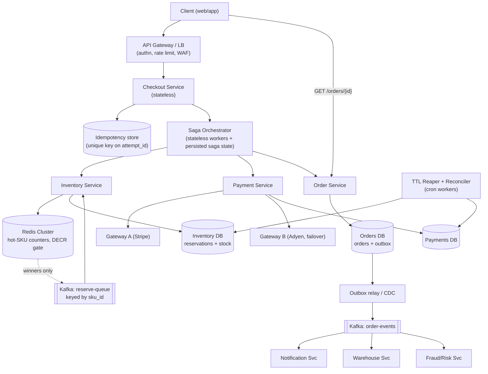
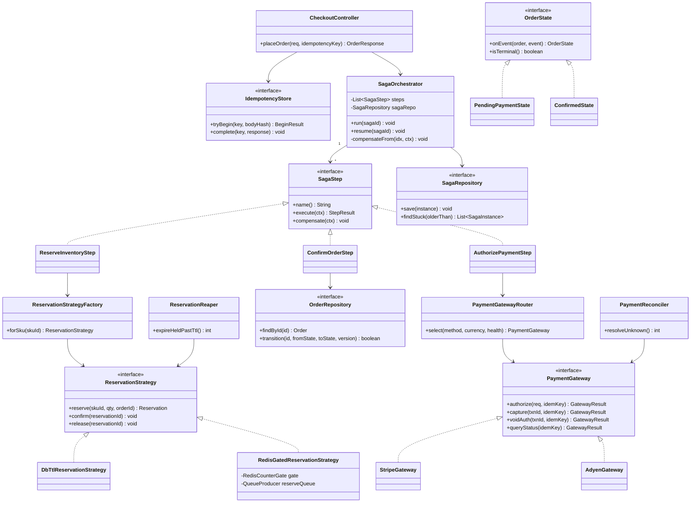

# E-Commerce Checkout

## 1. Problem Statement & Scope

Design the checkout subsystem of a large e-commerce platform: cart finalization, inventory reservation, payment authorization/capture, and order creation — correct under concurrency, retries, and partial failure.

### Functional Requirements
- Place order: validate cart, reserve inventory, price the order (items + tax + shipping + promotions), authorize payment, confirm order.
- Inventory must never oversell beyond a configured tolerance (target: zero oversell for regular SKUs; bounded, reconciled oversell acceptable only if business explicitly opts in).
- Payment: authorize at checkout, capture at fulfillment (auth/capture split); support cards, wallets, and BNPL via multiple payment gateways.
- Cancel/timeout: unpaid orders release reserved inventory automatically.
- Order status queryable by user in near-real-time; email/push notifications on state transitions.
- Retries and double-clicks must never double-charge or double-order.

### Non-Functional Requirements
- Availability: 99.95% for checkout submission (revenue path). Degrade gracefully (queue orders) rather than fail hard.
- Latency: p99 < 2 s for synchronous checkout acknowledgment (payment auth dominates; gateway p99 alone is often 1–1.5 s).
- Consistency: inventory counts strongly consistent per SKU; order state machine transitions atomic; payment exactly-once *effect*.
- Durability: an accepted order is never lost (payment taken but no order is the worst possible outcome).
- Flash-sale capable: single hot SKU absorbing 100k+ purchase attempts in the first seconds.

### Back-of-Envelope Estimation
- 50M DAU, 2% convert to checkout per day → 1M orders/day.
- Average order QPS: 1,000,000 / 86,400 ≈ 12 orders/s. Peak (5× diurnal + sale spikes): ~60–100 orders/s steady, with flash-sale bursts of 10,000+ *attempts*/s on one SKU (most rejected — attempts ≠ orders).
- Reads (order status, cart, availability checks): ~20× writes → ~2,000 QPS peak reads.
- Storage: order row + items + payment record + events ≈ 5 KB/order. 1M/day × 5 KB = 5 GB/day ≈ 1.8 TB/year raw; ×3 replication ≈ 5.5 TB/year. Trivial for a relational cluster; retention/archival to cold storage after 18–24 months.
- Bandwidth: 100 orders/s × 5 KB ≈ 500 KB/s writes — negligible. The hard problem is *contention*, not volume: thousands of writers on one inventory row.

Key insight to state up front: checkout is a low-QPS, high-correctness problem with pathological hot-key bursts. Design for correctness first, then engineer the hot path separately.

## 2. Brute-Force / Naive Design

Single app server + single PostgreSQL database. One request handler, one ACID transaction:

```sql
BEGIN;
SELECT stock FROM inventory WHERE sku_id = ?;          -- check
UPDATE inventory SET stock = stock - ? WHERE sku_id = ?; -- decrement
INSERT INTO orders (...) VALUES (...);
-- synchronous HTTPS call to payment gateway INSIDE the transaction
INSERT INTO payments (...) VALUES (...);
COMMIT;
```

Why this breaks, with numbers:

1. **External call inside a DB transaction.** Gateway p99 is 1–1.5 s, timeout maybe 10 s. Row locks on the inventory row are held the whole time. At 100 concurrent checkouts of the same SKU, lock wait queues serialize: 100 × 1 s = 100 s tail latency; connection pool (typically 100–200 conns) exhausts in seconds; the whole DB stalls for *all* SKUs.
2. **Check-then-act race** if the SELECT and UPDATE aren’t properly guarded (no `FOR UPDATE`, no `WHERE stock >= ?`): two concurrent readers both see stock=1, both decrement → stock = −1. Oversell.
3. **Ambiguous gateway outcomes.** Gateway call times out — did the charge happen? Naive design rolls back the transaction: inventory restored, no order… but the customer may have been charged. Double-charge on retry, or charge-without-order. No idempotency key, no reconciliation.
4. **SPOF and no burst absorption.** A flash sale of 10k attempts/s against one Postgres row: even a bare `UPDATE` on a hot row sustains maybe 3–5k TPS with lock convoys; the other 5k+/s pile up, latency explodes, everything times out.
5. **Crash between charge and order insert** loses the order permanently. Money taken, nothing durable recorded.

Every one of these is a correctness bug, not just a scale limit. The rest of the design exists to fix them.

## 3. Evolving the Design

**Step 1 — Get the external call out of the transaction.** Split checkout into phases: (a) reserve inventory in a short local transaction, (b) call the gateway with no DB locks held, (c) confirm or release in a second short transaction. This immediately raises the question: what if step (c) never runs (crash after charge)? Answer: every reservation carries a TTL and every payment has an idempotency key, so a reaper + reconciliation job can always converge. This decomposition is the seed of the saga.

**Step 2 — Make the decrement race-free.** Replace check-then-act with a conditional atomic write: `UPDATE inventory SET available = available - :q WHERE sku_id = :s AND available >= :q` and check rows-affected. Zero rows → sold out. This is the single most important line in the system. Compare locking strategies explicitly (Section 4): pessimistic `SELECT FOR UPDATE`, optimistic version column, reservation rows with TTL. Choose reservation-with-TTL for checkout because the resource is held across a multi-second, failure-prone payment step — neither pure lock nor pure CAS models "held for a while, maybe released."

**Step 3 — Make payment safe under retries.** Client generates an idempotency key at checkout-page render; server persists it before calling the gateway; gateway receives its own idempotency key derived from the order. Now timeouts are resolved by *querying/replaying*, never by guessing. (Full flow in Sections 4 and 7.)

**Step 4 — Coordinate the multi-step flow.** Reserve → authorize → confirm spans three systems (inventory, gateway, orders). 2PC is rejected (Section 4) — you cannot enroll Stripe in your prepare phase, and blocking on a coordinator kills availability. Use a saga: each step is a local transaction with a compensating action (release reservation, void/refund auth). Choose *orchestration* over choreography: checkout is a linear, ordered flow where a human asks "where is my order stuck?" — a central orchestrator with a persisted state machine answers that in one query.

**Step 5 — Make the orchestrator crash-safe.** Persist saga state before and after every step (state row + outbox events in the same transaction). On crash, a recovery worker resumes from the last durable state; every step is idempotent so replays are harmless. Order states become an explicit state machine with legal-transition enforcement in SQL (`UPDATE ... WHERE state = :expected`).

**Step 6 — Absorb the flash-sale burst before the database.** The DB can serialize maybe a few thousand decrements/s on one row; the burst is 10k+/s of *attempts*, most of which must lose. Push the admission decision to Redis: preload stock, `DECR` per attempt (~100k+ ops/s per shard, single-threaded so atomic by construction), reject the 99% losers in <1 ms, and let only winners proceed to the durable reservation path — via a queue that serializes DB writes at a sustainable rate. Add request collapsing on availability reads and shard the counter if one SKU exceeds a single Redis node. Redis is the *gate*, the DB remains the *truth*; reconcile the two.

**Step 7 — Decouple side effects.** Notifications, warehouse allocation, analytics, fraud scoring consume order events from a log (Kafka) via the outbox pattern — never inline in the checkout path. Checkout latency stays bounded by reserve + auth only.

Each step is motivated by a named failure (lock convoy, race, ambiguous timeout, coordinator blocking, hot row, crash), which is exactly the narration an interviewer wants: bottleneck → mechanism → residual risk.

## 4. Protocol & Technology Choices — Why This, Not That

### Inventory Reservation Strategy

| Dimension | Pessimistic lock (`SELECT FOR UPDATE`) | Optimistic version column (CAS) | Reservation row + TTL (chosen) |
|---|---|---|---|
| Mechanism | Lock inventory row, check, decrement, commit | `UPDATE ... SET stock=stock-q, version=version+1 WHERE sku=? AND version=?`; retry on 0 rows | Atomic conditional decrement of `available` + insert `reservations` row with `expires_at`; confirm or release later |
| Oversell risk | None (serialized) | None (CAS rejects stale writers) | None (conditional decrement is the guard) |
| Hot-SKU behavior | Lock convoy; throughput collapses; deadlock risk with multi-item carts | Retry storm: 1000 contenders → 1 wins, 999 retry → O(n²) wasted work | Losers rejected instantly by the conditional check; no lock held across payment |
| Holding across payment (seconds) | Catastrophic — lock held during gateway call, or you release and lose the guarantee | CAS is instantaneous; cannot represent "held for 10 min" at all | Native: TTL *is* the hold; reaper releases abandoned holds |
| Crash safety | Lock vanishes on crash → stock silently unprotected mid-checkout | N/A | Reservation row survives crash; TTL guarantees eventual release |
| Complexity | Lowest | Low | Moderate (reaper job, confirm/release paths, reconciliation) |
| When it wins | Low-contention admin ops (stock adjustment, single-warehouse ERP), short critical sections entirely inside one transaction | Low-contention concurrent edits where conflict is rare and retry is cheap (profile updates, CMS docs, cart line edits) | Any hold-then-confirm flow: checkout, seat/ticket booking, hotel rooms |

Decision: **reservation-with-TTL**, with the decrement itself implemented as a conditional atomic update (so it inherits the optimistic style’s lock-freedom without its retry storm). Pessimistic locking is still used inside single short transactions where multi-row invariants must hold (e.g., transfer between warehouse buckets).

### Distributed Transaction Style

| Dimension | 2PC/XA | Saga — choreography | Saga — orchestration (chosen) |
|---|---|---|---|
| Atomicity | True atomic commit across resources | Eventual, via compensations | Eventual, via compensations |
| Blocking | Prepared participants hold locks until coordinator decides; coordinator crash → in-doubt locks block everyone | Non-blocking | Non-blocking |
| Third-party support | Payment gateways do not speak XA — disqualifying by itself | Fine (each step is a normal API call) | Fine |
| Availability under partition | Poor (CP, blocking) | Good | Good |
| Visibility/debugging | N/A in practice | Flow is implicit in N services’ event subscriptions; "where is order X stuck" requires tracing across topics | One state row per saga; single query answers everything |
| Coupling | Tight | Loose, but *cyclic* event dependencies creep in as steps grow | Services stay dumb; orchestrator holds the flow, becomes a (scalable, stateless-workers) component to operate |
| Evolving the flow | Hard | Change = touch several services’ subscriptions | Change one orchestrator definition |
| When it wins | Same-org, same-infra resources, short transactions, XA-capable (rare; some banks internally) | Simple 2–3 step flows, broadcast-shaped ("order placed → many independent reactions"), max team autonomy | Long linear flows with compensation, SLAs, and human-facing status — i.e., checkout |

Why 2PC is avoided, precisely: (1) the gateway can’t participate; (2) prepare-phase locks held across WAN latencies destroy hot-row throughput; (3) coordinator failure leaves participants in-doubt — a blocking protocol by design (this is the FLP/consensus gap that 3PC also fails to close under partition); (4) it couples availability of checkout to the worst participant. We still use choreography *downstream* of order confirmation (notifications, warehouse, analytics react to events) — orchestration for the money path, choreography for the fan-out.

### Datastore per Concern

| Concern | Choice | Why | Alternative and when it wins |
|---|---|---|---|
| Orders, payments, sagas, reservations | PostgreSQL (or MySQL), partitioned by order_id hash, read replicas | ACID for state transitions, conditional updates, outbox in same txn; volume (5 GB/day) is small | Spanner/CockroachDB when multi-region synchronous writes are mandated; DynamoDB when order access is strictly key-value and team runs serverless |
| Inventory source of truth | Same RDBMS, `inventory` table per (sku, warehouse) | Conditional decrement, joins for reconciliation | Dedicated inventory service on Dynamo with conditional writes at extreme SKU cardinality |
| Hot-SKU admission counter | Redis (Cluster) | Single-threaded atomic DECR at 100k+ ops/s; Lua for multi-key atomicity; TTL native | None realistically; Memcached lacks Lua/persistence hooks |
| Event backbone | Kafka | Ordered per-partition replay for outbox consumers, retention for reprocessing | SQS/SNS when ordering needs are weak and ops budget is small |
| Serialization queue for flash-sale winners | Kafka partition keyed by sku_id | Per-SKU ordering = natural serialization; consumer paces DB writes | Redis Streams for lower latency at smaller durability guarantees |

### Payment Capture Timing

| Dimension | Sync auth + capture at checkout | Sync auth, async capture at fulfillment (chosen) | Fully async (accept order, pay later) |
|---|---|---|---|
| Customer certainty | Highest | High (card validated, funds held) | Low (may fail after "success" page) |
| Refund exposure | Must refund on any fulfillment failure | Void auth (free, instant) if not shipped | None at accept time |
| Card-network rules | Capturing before shipment violates many card-scheme rules for physical goods | Compliant | Compliant |
| Latency on checkout path | Auth + capture | Auth only | Near zero |
| When it wins | Digital goods, instant delivery | Physical goods (default) | Extreme flash sales / COD markets where auth itself is the bottleneck |

### Idempotency Key Placement
Client-generated UUID per checkout *attempt-session* (minted when the payment page renders, reused across retries of the same click), persisted server-side with a unique constraint, and a *second* deterministic key (`order_id:attempt_n`) sent to the gateway. Two layers because they solve different dedupes: client↔server (double-click, network retry) and server↔gateway (timeout replay). Server-generated-only keys fail the double-click case: two requests, two keys, two charges.

## 5. High-Level Design (HLD)



### Write Path (place order)
1. `POST /checkout` with `Idempotency-Key`. Checkout Service inserts the key (unique constraint); duplicate → return the stored/in-progress response.
2. Orchestrator persists saga row (`STARTED`), then executes:
   - **ReserveInventory**: hot SKU → Redis `DECR` gate first; winners enqueue to `reserve-queue`; consumer performs the conditional decrement + inserts `reservations` row (TTL 10 min). Cold SKU → direct DB reservation.
   - **AuthorizePayment**: Payment Service calls gateway with key `order_id:attempt_1`; records auth id.
   - **ConfirmOrder**: order state `PENDING_PAYMENT → CONFIRMED`, reservation `HELD → CONFIRMED` (stock permanently decremented), outbox event `OrderConfirmed` — one transaction.
3. Any step fails permanently → orchestrator runs compensations in reverse (void auth, release reservation), order → `FAILED`, saga → `COMPENSATED`.
4. Response returned when auth completes (p99 ≈ auth latency + ~200 ms overhead); capture happens later on `Shipped`.

### Read Path
`GET /orders/{id}` → Order Service → read replica (or primary for read-your-writes within a session, via session pinning or reading the primary for N seconds after a write). Availability display reads Redis counters (approximate, cheap) — never the DB.

### Data Model (DDL)

```sql
CREATE TABLE orders (
  order_id        BIGINT PRIMARY KEY,          -- snowflake
  user_id         BIGINT NOT NULL,
  state           VARCHAR(32) NOT NULL,        -- state machine, Section 6
  total_amount    BIGINT NOT NULL,             -- minor units; never floats
  currency        CHAR(3) NOT NULL,
  idempotency_key UUID NOT NULL UNIQUE,
  version         INT NOT NULL DEFAULT 0,      -- guards concurrent transitions
  created_at      TIMESTAMPTZ NOT NULL DEFAULT now(),
  updated_at      TIMESTAMPTZ NOT NULL
);

CREATE TABLE order_items (
  order_id  BIGINT REFERENCES orders,
  sku_id    BIGINT NOT NULL,
  quantity  INT NOT NULL CHECK (quantity > 0),
  unit_price BIGINT NOT NULL,
  PRIMARY KEY (order_id, sku_id)
);

CREATE TABLE inventory (
  sku_id       BIGINT,
  warehouse_id INT,
  available    INT NOT NULL CHECK (available >= 0),  -- DB-level oversell backstop
  reserved     INT NOT NULL DEFAULT 0,
  PRIMARY KEY (sku_id, warehouse_id)
);

CREATE TABLE reservations (
  reservation_id UUID PRIMARY KEY,
  order_id       BIGINT NOT NULL,
  sku_id         BIGINT NOT NULL,
  quantity       INT NOT NULL,
  status         VARCHAR(16) NOT NULL,  -- HELD | CONFIRMED | RELEASED | EXPIRED
  expires_at     TIMESTAMPTZ NOT NULL
);
CREATE INDEX idx_res_expiry ON reservations (expires_at) WHERE status = 'HELD';

CREATE TABLE payments (
  payment_id      UUID PRIMARY KEY,
  order_id        BIGINT NOT NULL,
  idempotency_key VARCHAR(64) NOT NULL UNIQUE,   -- order_id:attempt_n
  gateway         VARCHAR(16) NOT NULL,
  gateway_txn_id  VARCHAR(128),
  status          VARCHAR(24) NOT NULL,  -- INITIATED|AUTHORIZED|CAPTURED|VOIDED|REFUNDED|FAILED|UNKNOWN
  amount          BIGINT NOT NULL,
  created_at      TIMESTAMPTZ NOT NULL DEFAULT now()
);

CREATE TABLE saga_instances (
  saga_id      UUID PRIMARY KEY,
  order_id     BIGINT NOT NULL UNIQUE,
  current_step VARCHAR(48) NOT NULL,
  status       VARCHAR(24) NOT NULL,   -- RUNNING|COMPLETED|COMPENSATING|COMPENSATED|STUCK
  step_results JSONB NOT NULL DEFAULT '{}',
  updated_at   TIMESTAMPTZ NOT NULL
);

CREATE TABLE outbox (
  event_id   BIGSERIAL PRIMARY KEY,
  aggregate  VARCHAR(32), aggregate_id BIGINT,
  event_type VARCHAR(48), payload JSONB,
  published  BOOLEAN NOT NULL DEFAULT FALSE
);
```

### API Design

```
POST /v1/checkout
  Headers: Idempotency-Key: <uuid>
  Body: { cart_id, payment_method_token, shipping_address_id }
  201: { order_id, state: "CONFIRMED", amount, eta }
  202: { order_id, state: "PENDING_PAYMENT" }        -- async/queued path
  409: { code: "OUT_OF_STOCK", skus: [...] }
  402: { code: "PAYMENT_DECLINED", reason }
  Same key re-sent: replay stored response (200/201), or 409 CONFLICT
  if same key with different body hash.

GET  /v1/orders/{order_id}          -> { order_id, state, items, timeline[] }
POST /v1/orders/{order_id}/cancel   -> 202; allowed only from cancellable states
GET  /v1/skus/{sku_id}/availability -> { available_hint }   -- Redis, approximate
POST /v1/webhooks/payments/{gateway} -- gateway async results; verify signature,
                                        dedupe on gateway event id
```

## 6. Low-Level Design (LLD)



Patterns, explicitly:
- **Strategy** — `ReservationStrategy`: DB-TTL for the long tail vs Redis-gated for hot SKUs; the saga step is oblivious to which is in play.
- **Factory** — `ReservationStrategyFactory` picks strategy from SKU hotness metadata (flagged by ops for a sale, or auto-promoted when attempt rate crosses a threshold).
- **Repository** — `OrderRepository`, `SagaRepository`: persistence isolated; `transition()` encodes the CAS (`WHERE state=? AND version=?`) so illegal transitions cannot compile-time hide.
- **State** — `OrderState` objects own their legal outgoing transitions; an event arriving in the wrong state throws, never silently corrupts. Mirrors the DB-level guard.
- **Adapter + Router** — `PaymentGateway` implementations normalize Stripe/Adyen; router does health/cost-based selection and failover.
- **Template Method** (implicit) — `SagaOrchestrator.run` fixes the execute/persist/compensate skeleton; steps fill in the work.

### Order State Machine

```
CREATED ──validate──▶ PENDING_INVENTORY ──reserved──▶ PENDING_PAYMENT
PENDING_INVENTORY ──out_of_stock──▶ FAILED
PENDING_PAYMENT ──authorized──▶ CONFIRMED
PENDING_PAYMENT ──declined/timeout(final)──▶ FAILED        (+ release reservation)
PENDING_PAYMENT ──ttl_expired──▶ EXPIRED                   (+ release reservation, void if auth landed late)
CONFIRMED ──user_cancel──▶ CANCELLED                       (+ void auth, release)
CONFIRMED ──allocated──▶ FULFILLING ──shipped──▶ SHIPPED   (capture on shipped)
SHIPPED ──delivered──▶ DELIVERED ──return_window_closed──▶ CLOSED
DELIVERED ──return_requested──▶ RETURN_PENDING ──received──▶ REFUNDED
Terminal: FAILED, EXPIRED, CANCELLED, CLOSED, REFUNDED
```

Enforcement is dual: in code (State pattern) and in the database — `UPDATE orders SET state=:to, version=version+1 WHERE order_id=:id AND state=:from AND version=:v`; zero rows updated means a concurrent transition won; reload and re-decide. Never `SET state=:to` unconditionally.

### Hardest Algorithm: Orchestrator Step Execution with Compensation

```java
public void run(UUID sagaId) {
    SagaInstance saga = sagaRepo.load(sagaId);          // pessimistic claim:
    if (!sagaRepo.claim(sagaId, workerId, LEASE_30S))   // lease prevents two
        return;                                          // workers running one saga

    for (int i = saga.stepIndex(); i < steps.size(); i++) {
        SagaStep step = steps.get(i);
        StepResult r;
        try {
            // execute() MUST be idempotent: keyed by (sagaId, step.name()).
            // A re-run after crash re-sends the same reservation id /
            // idempotency key and gets the same effect, not a second one.
            r = step.execute(saga.context());
        } catch (TransientException e) {
            sagaRepo.scheduleRetry(sagaId, i, backoff(saga.attempts(i)));
            return;                                      // resume() re-enters here
        } catch (PermanentException e) {
            compensateFrom(i - 1, saga);                 // current step had no effect
            return;
        } catch (AmbiguousException e) {                 // e.g. gateway timeout
            // NEVER compensate on ambiguity: the auth may exist.
            // Park for the reconciler, which calls queryStatus(idemKey)
            // and re-drives run() with a definitive result.
            sagaRepo.markStuck(sagaId, i, e);
            return;
        }
        // Persist progress + step output ATOMICALLY before moving on.
        sagaRepo.advance(sagaId, i + 1, r.output());     // single txn, CAS on stepIndex
    }
    sagaRepo.complete(sagaId);
}

private void compensateFrom(int idx, SagaInstance saga) {
    sagaRepo.markCompensating(sagaId, idx);
    for (int i = idx; i >= 0; i--) {
        try {
            // compensate() must also be idempotent AND tolerate
            // "nothing to undo" (execute persisted but effect ambiguous).
            steps.get(i).compensate(saga.context());
            sagaRepo.recordCompensated(sagaId, i);
        } catch (Exception e) {
            // Retry with backoff forever-ish; page a human after N.
            // Compensation must not be abandoned: releaseReservation and
            // voidAuth are both safe to hammer.
            sagaRepo.scheduleCompensationRetry(sagaId, i, backoff());
            return;
        }
    }
    sagaRepo.markCompensated(sagaId);
    orderRepo.transition(saga.orderId(), anyActive(), FAILED);
}
```

Idempotent payment handler core (the other candidate for "hardest"):

```java
public PaymentResult authorize(long orderId, Money amt, String methodTok) {
    String idemKey = orderId + ":attempt:" + attemptSeq(orderId);
    // 1. INSERT payments(status=INITIATED, idempotency_key=idemKey)
    //    Unique violation -> load existing row:
    //      AUTHORIZED -> return it (dedupe); INITIATED/UNKNOWN -> queryStatus first.
    // 2. Call gateway.authorize(amt, methodTok, idemKey) — gateway dedupes on key too.
    // 3. Success  -> UPDATE payments SET status=AUTHORIZED, gateway_txn_id=...
    //    Declined -> status=FAILED (permanent; saga compensates).
    //    Timeout  -> status=UNKNOWN; throw AmbiguousException; reconciler owns it.
}
```

## 7. Deep Dives & Failure Modes

**Double-charge.** Requires all three shields to fail: client idempotency key (dedupes double-click/browser retry at the edge), payments-row unique constraint (dedupes server-side replay), gateway idempotency key (dedupes network-level replay to the processor). The classic bug: treating a gateway *timeout* as failure and retrying with a *fresh* key — that manufactures a double charge with all shields "working." Rule: ambiguous outcome → same key, query-then-replay, never re-key. Last line of defense: daily settlement-file reconciliation against the payments table; auto-refund orphaned charges.

**Oversell.** Three guards: conditional decrement (`available >= q`), `CHECK (available >= 0)` as the DB backstop, Redis gate for hot SKUs. Residual risks: (a) Redis counter drifts above DB truth after a Redis failover that loses recent DECRs → winners hit the DB conditional decrement and lose there — correct but poor UX ("you won, then you didn’t"); mitigate by initializing Redis slightly *under* true stock (e.g., 98%) and drip-releasing the reserve. (b) Reaper releases a reservation whose payment then succeeds late: confirm step must CAS on reservation `status='HELD'`; if it finds `EXPIRED`, the saga voids the auth and fails the order — never confirms against released stock.

**Exactly-once payment is an illusion.** Networks give at-least-once or at-most-once; you choose at-least-once (retry on ambiguity) and layer idempotent dedupe so the *effect* is once. Say it this way: exactly-once *delivery* is impossible; exactly-once *processing* is engineered via (stable key + dedupe store + idempotent handler). The dedupe store must be updated atomically with the effect (same transaction as the payments row), or the crash between them re-opens the window.

**Retry/double-click safety end-to-end.** Button disabled client-side (UX, not safety). Same attempt key on retry. `tryBegin` returns IN_PROGRESS for a concurrent duplicate → return 409/`Retry-After` rather than blocking a second handler on the same work. Response captured under the key so late retries get the same 201 body. Body-hash check catches "same key, different cart" client bugs.

**Flash-sale hot SKU.** Layered shedding: CDN/edge queue-page → per-user rate limit at gateway → Redis `DECR` gate (Lua: reject if would go negative, INCR back on later failure) → Kafka partition per SKU serializing durable reservations at DB-sustainable rate (~1–2k/s) → conditional decrement as final truth. **Request collapsing** on availability reads: thousands of `GET /availability` for the same SKU coalesce into one Redis read per cache-fill window (singleflight); sale pages show cached hints with 1–2 s TTL. **Inventory sharding** when one SKU exceeds one Redis node: split stock across K sub-counters (`sku:123:shard:0..K-1`), route by `hash(user) % K`, DECR the local shard; on local exhaustion, either reject (accepting stranded remainders) or one bounded steal attempt from a random sibling; a rebalancer migrates remainders as shards drain unevenly. Accepted trade-off: sharding trades perfect stock utilization for K× throughput — state that explicitly.

**Payment gateway down.** Circuit breaker per gateway; router fails over to secondary for *new* auths (in-flight ambiguous auths stay pinned to the original gateway — only it can answer status queries for its keys). If all gateways are down: park orders in `PENDING_PAYMENT` with extended reservation TTL and drain when healthy (works for loyal demand), or fail fast during flash sales where holding reservations blocks other buyers. Vaulted card tokens are gateway-scoped — cross-gateway failover requires a gateway-agnostic vault/tokenization layer; call this out, it’s a real constraint.

**DB failover mid-transaction.** Uncommitted transactions vanish — fine, steps are retried idempotently. Danger: async-replication promotion loses committed-but-unreplicated writes, e.g., a payments row recording an auth that *did* happen at the gateway. Mitigations: semi-sync replication (at least one replica acks) for payments/orders clusters; reconciler treats the gateway as source of truth and re-inserts missing rows from status queries + webhooks.

**Orchestrator crash.** State persisted before/after each step; lease (worker id + expiry) prevents two workers driving one saga; a sweeper re-claims sagas with expired leases. Replayed step re-executes idempotently. If crash occurred *inside* an external call, the saga resumes into the ambiguous branch and the reconciler resolves via queryStatus. Sagas `STUCK` beyond SLA page an operator with the full step_results context — the payoff of orchestration.

**Compensation edge cases.** (1) Compensate-before-effect: void arrives at gateway before the delayed auth lands → gateway idempotent void on the same key must yield "nothing to void" *and* the reconciler must catch a late-landing auth afterward and void again — void must be re-drivable. (2) Compensation itself fails (gateway 5xx on void): retry with backoff; auths also auto-expire at issuers in ~7 days as a natural backstop; page before that. (3) Semantic non-compensatability (already shipped): the state machine forbids entering compensation from `SHIPPED` — cancellation after ship is a *return*, a different saga. (4) Partial multi-item reservation: reserve-all-or-release-all within the step, in one DB transaction across the item rows (deterministic sku_id ordering to avoid deadlock).

**Backpressure.** Every queue bounded. Reserve-queue lag beyond threshold → gate rejects earlier ("sold out for now") instead of growing latency. Orchestrator worker pool sized to gateway rate limits; exceeding them converts success into ambiguous timeouts — the worst outcome class — so throttle *before* the gateway does. Load-shed reads (availability hints) before writes; never shed the confirm step.

**Clock skew and TTLs.** Reaper compares `expires_at` against DB time, not app-server time; reservations get a grace margin (reap at TTL + 30 s) so a confirm racing the reaper is decided by the reservation-status CAS, with skew unable to flip the outcome.

## 8. Trade-off Summary & Interview Soundbites

| Decision | Trade-off accepted |
|---|---|
| Reservation-with-TTL over pessimistic/optimistic | Reaper + reconciliation machinery; stock temporarily "held" by abandoners reduces sellable inventory for the TTL window |
| Saga orchestration over 2PC | Eventual consistency between services; must design and test compensations; users can transiently see `PENDING_PAYMENT` |
| Orchestration over choreography | Orchestrator is an extra component to operate (mitigated: stateless workers, state in DB) in exchange for one-query debuggability |
| Auth-at-checkout, capture-at-ship | Auth can expire before slow fulfillment → re-auth flow needed |
| Redis gate in front of DB inventory | Two sources of (near-)truth; drift requires reconciliation; UX risk of "won at gate, lost at DB" |
| Queue-serialized reservations for hot SKUs | Winners get 202-then-confirm (async UX) instead of instant 201 |
| Sharded hot-SKU counters | Stranded stock in unlucky shards; rebalancer complexity — throughput bought with utilization |
| Outbox + CDC for events | Consumers see events at-least-once → all consumers must dedupe |

### Soundbites
1. "Exactly-once delivery doesn’t exist; exactly-once *effect* is at-least-once retries plus idempotent dedupe keyed on a stable identifier."
2. "Never hold a database lock across a network call — that one rule generates most of this architecture."
3. "On a payment timeout you know nothing; the only safe moves are query or replay with the *same* idempotency key — a fresh key is how double-charges are manufactured."
4. "2PC is out the moment a third party joins the transaction: Stripe will never vote in your prepare phase, and a blocking protocol is the wrong availability trade for checkout."
5. "Redis is the gate, the database is the truth; the conditional decrement is the last word on oversell."
6. "Compensate on definite failure, reconcile on ambiguity — compensating an outcome you haven’t confirmed is how you void a payment that then lands."
7. "A flash sale is a rejection engine: the design goal is saying no to 99% of traffic in under a millisecond, as far from the database as possible."
8. "The order state machine is enforced twice — State objects in code, CAS on (state, version) in SQL — because only the database wins races."

### Common Follow-ups
- **Why not just decrement inventory at payment capture?** Between checkout and capture (hours), you’d oversell freely; reservation bounds the exposure window to minutes and makes it explicit.
- **Reservation TTL value?** Payment p99 (~seconds) plus 3-DS/OTP user think-time: 10 min typical, 2–5 min during flash sales to recycle abandoned holds faster.
- **What if the user pays exactly as the reservation expires?** Confirm CASes on `status='HELD'`; loser path voids the auth. One row decides the race; grace margin makes it rare.
- **How do multi-warehouse reservations work?** Reserve against an aggregate ATP (available-to-promise) view at checkout; warehouse *allocation* is a post-confirmation saga step — don’t force warehouse choice onto the checkout critical path.
- **How would you test the saga?** Fault-injection per step boundary (kill worker before/after persist), gateway chaos stub returning timeout/declined/late-success, and an invariant checker asserting Σ(confirmed order qty) + available + held = initial stock.
- **Idempotency key retention?** Keep 24–72 h (client retry horizon) hot, then archive; the payments unique key is retained forever since it guards money.
- **Where does fraud check go?** Async post-auth for most orders (cancel + void on bad score); inline pre-auth only above a risk/amount threshold — keeps p99 flat for the 99%.
