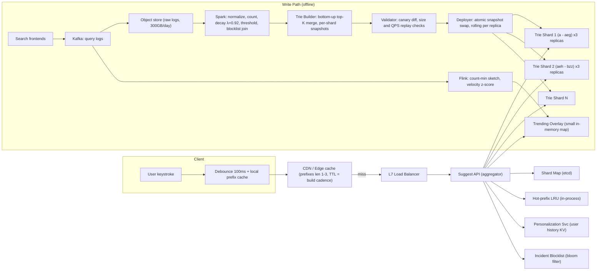
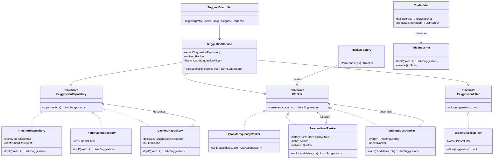

# Typeahead / Autocomplete

## 1. Problem Statement & Scope

Design the suggestion service behind a search box: as the user types, return the top-K (K=10) most relevant query completions for the current prefix, ranked by popularity blended with personalization, within a strict latency budget.

### Functional Requirements
- Given a prefix (1..N chars), return top-10 ranked suggestions.
- Suggestions ranked by historical query frequency with time decay; optionally re-ranked by user history.
- Filtering: profanity, spam, legally-blocked terms never appear.
- Suggestions refreshed on a regular cadence (hours, not seconds); a narrow real-time path for trending topics.
- Multi-language / Unicode support.
- Out of scope: the search results page itself, ads in suggestions, voice input.

### Non-Functional Requirements
- p99 end-to-end (client-observed) latency < 100 ms; server-side p99 < 20 ms.
- Availability 99.99% — a broken search box is a top-line revenue event.
- Eventual freshness is acceptable: suggestions may lag reality by hours (except trending path).
- Read-dominated: reads:writes effectively infinite at serving time (writes happen offline).
- Scalable to billions of queries/day; graceful degradation (stale > empty > error).

### Back-of-Envelope Estimation

Assume Google-scale search: **5B searches/day**.

- **Keystroke fan-out.** Average query ~20 chars, but debouncing + client cache means not every keystroke hits the server. Assume avg **4 server-hitting requests per search** (first few chars served from client cache/short-prefix CDN, debounce collapses fast typing).
  - Typeahead requests/day = 5B × 4 = **20B requests/day**.
- **QPS.** 20B / 86,400 s ≈ **231K QPS average**. Peak = 2× avg ≈ **~460K QPS peak**. Design for 500K QPS.
- **Unique queries / storage.**
  - ~20% of daily searches are new-ish long tail; assume corpus of **1B distinct queries** worth indexing after frequency thresholding (drop count < ~5/week — kills spam and typos too).
  - Avg query 20 chars ≈ 20 bytes ASCII (Unicode avg ~30B); + 8B weight + overhead ≈ 50B/entry.
  - Raw corpus: 1B × 50B = **50 GB**. Trie with top-10 precomputed per node: each node stores 10 suggestion IDs (4B each) + weights → node overhead ~100B; #nodes ≈ #distinct prefixes ≈ 5–10× compression over storing full strings per prefix; realistic serving index **~200–500 GB** → does not fit one commodity box comfortably with headroom → **shard**.
  - Prefix hash table alternative: index prefixes length 1..7 only (longer prefixes → fall back to filtering a fetched list or a secondary tier). Prefixes of 1B queries truncated to ≤7 chars: ~ tens of millions of distinct prefixes × (7B key + 10 × 24B suggestions) ≈ **~50–100 GB** — fits in a few Redis-class nodes.
- **Bandwidth.** Response = 10 suggestions × ~25B + envelope ≈ 400B (protobuf, pre-gzip). 500K QPS × 400B ≈ **200 MB/s egress** at peak — trivial for a fleet, meaningful for a single NIC → another sharding argument.
- **Log volume for the pipeline.** 5B searches × ~60B/log line (query, ts, geo, anon user id) ≈ **300 GB/day raw logs** → batch, not streaming, territory.
- **Fleet sizing (serving).** One aggregator instance handles ~10K QPS of mostly-in-memory work → ~50 instances/region at peak + 50% headroom ≈ 75; trie tier: 500 GB / ~64 GB usable per box ≈ 8 shards × 3 replicas = 24 boxes/region; 3 regions → ~300 machines total. Small fleet — the design's economics come from precomputation, not hardware.
- **Cache math.** 1–3 char prefixes ≈ 45% of server-bound requests (they are the first request of nearly every session and CDN-cacheable); client cache + debounce remove ~40% before that. Origin therefore sees ~500K × 0.55 ≈ **~275K QPS peak**, of which the aggregator's hot-prefix LRU (Zipfian traffic: top 10K prefixes ≈ 60% of lookups) leaves shards serving ~100K QPS — ~12K QPS/shard, comfortable for an in-memory walk.

## 2. Brute-Force / Naive Design

One server, one SQL database:

```sql
SELECT query, freq FROM queries
WHERE query LIKE 'pre%'
ORDER BY freq DESC
LIMIT 10;
```

Writes: on every executed search, `UPDATE queries SET freq = freq + 1`.

### Why it breaks, with numbers
1. **Read cost.** `LIKE 'pre%'` with a B-tree index on `query` is a range scan. Prefix `"a"` matches ~1B/26 ≈ **tens of millions of rows**, which must be scanned and sorted by `freq` (freq is not the index order) — hundreds of ms to seconds per query. Even a composite trick index can't give you "top-10 by freq within a range" without scanning the range.
2. **Throughput.** A tuned Postgres box does ~10–50K simple indexed reads/sec. We need **500K QPS** of a query that is *not* simple. Off by 2–4 orders of magnitude.
3. **Write contention.** 5B searches/day ≈ 58K row-updates/sec avg on hot rows ("weather", "youtube") → lock contention, WAL saturation. And every increment invalidates any naive cache.
4. **Latency budget.** Disk-backed range-scan-and-sort cannot hit p99 < 20 ms server-side. The workload demands **precomputation**: at serve time we should do an O(prefix) lookup returning an already-ranked list, never a scan-and-sort.
5. **No decay, no filtering, no personalization** — raw counters overweight stale queries forever.

Conclusion the interviewer wants stated: *typeahead is a precomputation problem, not a query problem*. Move all ranking work offline; serving becomes a key→value lookup.

## 3. Evolving the Design

**Step 1 — Precompute per prefix.** Bottleneck: scan-and-sort at read time. Fix: offline job computes, for every prefix, the top-10 suggestions; serving is `GET(prefix) → [10 strings]`, O(1)-ish. Two data-structure candidates: trie with top-K per node, or flat prefix→list hash table (compared in §4).

**Step 2 — Move counting offline.** Bottleneck: 58K synchronous counter updates/sec. Fix: search frontends fire-and-forget append query logs (Kafka → HDFS/object store). A daily/hourly MapReduce/Spark pipeline aggregates:
- *Frequency counting*: map `(query) → 1`, reduce to counts; normalize/case-fold/trim; threshold out count < N (spam/typo/PII long tail).
- *Decay weighting*: `weight = Σ count_d × λ^age_days`, λ ≈ 0.9–0.95 (half-life ~1–2 weeks). Implemented incrementally: `weight_today = λ × weight_yesterday + count_today` — only need yesterday's snapshot + today's counts, not full history. Decay is what lets "iphone 15" die when "iphone 16" launches without manual cleanup.
- *Filter join*: anti-join against blocklist (profanity, legal, spam classifier output) **at build time**, so banned terms never reach serving memory.
- Output: `(prefix, [top10 (suggestion, weight)])` files, or a serialized trie per shard.

**Step 3 — Fit in memory, then shard.** Bottleneck: 200–500 GB index, 500K QPS > one box. Fix: shard by **prefix range** (like an encyclopedia: shard1 = `a`–`aeg`, shard2 = `aeh`–`b...`), ranges chosen by a shard-map built from observed prefix traffic so load is even, not alphabet-even (naive `a-z/26` fails: `s`, `c`, `t` prefixes carry far more traffic than `x`, `q`). A lightweight shard-map service (or config in ZooKeeper/etcd) routes prefix→shard. Each shard has R replicas for throughput and failover. **Hot prefixes** (1–2 char, celebrity spikes) handled separately: see §7.

**Step 4 — Cut requests before they exist.** Bottleneck: 20B requests/day is self-inflicted. Fixes on the client:
- *Debounce* 50–150 ms (fire only after typing pauses; adaptive: shorter for slow typists) → collapses "netflix" from 7 requests to ~2–3.
- *Client cache*: cache prefix→suggestions per session; on backspace or retype, serve locally. Also **prefix-derivable filtering**: if server returned top-10 for "net" and user types "netf", client can locally filter the cached 10 (best-effort; server call still made if filtered set < K, or skipped entirely in degraded mode).
- *CDN/edge cache* for 1–3 char prefixes: only 26 + 26² + 26³ ≈ 18K ASCII combos (×languages); TTL = pipeline cadence. Absorbs the hottest ~40–50% of traffic.

**Step 5 — Latency engineering.** Bottleneck: p99 < 100 ms including network. Fixes: keep-alive HTTP/2 connections (kill TCP+TLS handshake per keystroke), edge PoPs terminate TLS near user, protobuf on the wire, in-memory serving with no disk in the read path, request hedging to replica at p95 timeout. Budget itemized in §4.

**Step 6 — Personalization & trending.** Bottleneck: global-only ranking is mediocre for repeat users and blind to breaking news. Fix: (a) a re-rank layer blending global top-N with the user's own recent/frequent queries (§5, §6); (b) a *narrow* streaming pipeline detecting anomalous query velocity and patching a small "trending overlay" into serving every few minutes — an exception to, not a replacement of, the batch path (§7).

## 4. Protocol & Technology Choices — Why This, Not That

### Serving data structure

| Option | How it works | Pros | Cons | Verdict |
|---|---|---|---|---|
| **Trie, top-K precomputed per node** | Walk prefix chars to node; node stores pointer to its top-10 | O(len(prefix)) lookup; natural longest-prefix fallback; shares storage across prefixes; supports arbitrary prefix length | Complex to build/serialize/shard; pointer-chasing hurts cache locality; updates require rebuild | **Chosen for main index** — handles unbounded prefix length, best memory sharing at 1B-query scale |
| **Prefix hash table (prefix → top-10 list)** | Flat KV: every prefix (len ≤ L) is a key | O(1) lookup, trivially shardable by key hash, fits Redis/RocksDB off-the-shelf, dead simple ops | Storage blows up with L (every query duplicated per prefix length); must cap L (~7) and handle long prefixes specially; no structural sharing | **Chosen for edge/CDN tier and short prefixes**; loses at full corpus with long prefixes |
| **FST (finite state transducer, à la Lucene)** | Minimized automaton mapping strings→weights | 3–10× smaller than trie (suffix sharing too); immutable — perfect for snapshot deploys | Top-K per node needs extra sidecar structures or WFST tricks; harder to explain/build in-house | Would win when memory is the binding constraint (on-device autocomplete, mobile keyboards) |
| **Elasticsearch completion suggester** | ES builds FSTs per shard from indexed docs | Zero build effort; fuzzy/typo support built-in; good to ~10K QPS/cluster | Latency less predictable (JVM GC, segment merges); ranking model rigid; expensive at 500K QPS; you don't own the top-K logic | Would win for a startup / <10K QPS / when search infra is already ES |

Pattern to state: **hash table for the hot short-prefix head, trie for the long tail** — hybrid, not either/or.

### Offline aggregation pipeline

| Option | Why chosen / rejected | When it would win |
|---|---|---|
| **Spark on object-store logs (chosen)** | 300 GB/day is comfortably batch; DataFrame joins for blocklist + decay recurrence; incremental (`λ·prev + today`); mature retries/backfill | — |
| Classic Hadoop MapReduce | Same model, slower iteration, more boilerplate; no reason in 2026 | Legacy org already on it |
| Flink/Kafka Streams (full streaming) | Real-time trie updates are explicitly *not* a goal (see §8 soundbite); streaming top-K over 1B keys with decay is far more operational surface for freshness nobody perceives | If product requires <1 min freshness for *all* suggestions (e.g., stock tickers) |
| Streaming *sidecar* (chosen, narrow) | Small Flink job: count-min sketch + velocity z-score → trending overlay of ~1K queries | — |

### Serving store

| Option | Why chosen / rejected |
|---|---|
| **Custom in-memory service (mmap'd immutable trie snapshot) — chosen for trie tier** | Full control of layout (array-packed trie nodes, cache-friendly); zero (de)serialization at read; atomic snapshot swap = trivially consistent deploys; no network hop between "cache" and "logic" |
| Redis (prefix hash) — chosen for head tier | ZSET/plain values per short prefix; ops-mature, replication free; but at 500 GB + custom top-K merge logic, you're fighting the tool — hence only the head |
| RocksDB/LSM per shard | Survives restarts without full reload; but adds read amplification and we redeploy full snapshots anyway; would win if index >> RAM |
| Memcached in front of a DB | Cache-aside reintroduces the DB scan on miss — the naive design with extra steps; rejected |

### Client↔server protocol

| Option | Why chosen / rejected |
|---|---|
| **HTTPS GET per (debounced) keystroke over HTTP/2 keep-alive — chosen** | GETs are CDN-cacheable (the entire short-prefix strategy depends on this); stateless → trivial LB; HTTP/2 multiplexing removes head-of-line and handshake costs; firewall/proxy-proof |
| WebSocket per session | Saves ~a few ms of framing; but loses CDN caching entirely, forces sticky/stateful LBs, connection storms on deploys, mobile radios hate held connections; would win for collaborative-editing-style bidirectional flows, not request/response |
| Long polling / SSE | Server has nothing to push unsolicited; wrong shape |

### Wire format

| Option | Why chosen / rejected |
|---|---|
| **Protobuf (chosen service↔service and app clients)** | ~2–3× smaller, ~5–10× faster (de)serialization than JSON; schema'd evolution |
| JSON (+gzip) — kept for web browser endpoint | Human-debuggable, zero client tooling; at 400B payloads the size delta is ~0.5 ms — acceptable tax on web only |

### Latency budget — p99 < 100 ms, itemized

| Segment | p99 budget (ms) | Notes |
|---|---|---|
| Client debounce is **not** counted | 0 | UX chooses to wait; budget starts at request send |
| Client → edge PoP (last mile, RTT/2 amortized on HTTP/2) | 25 | The dominant, least controllable term; edge PoPs exist to shrink it |
| TLS/TCP handshake | 0 | Amortized away by keep-alive; cold-start pays ~1 RTT extra — accept it on request #1 only |
| Edge/CDN cache check (hit → done at ~30 ms total) | 2 | ~45% hit rate on short prefixes |
| Edge → origin region | 20 | Only on CDN miss; region per continent |
| L7 load balancer + routing (shard-map lookup) | 2 | |
| Suggest service: local cache (hot prefix LRU) check | 1 | |
| Trie/hash shard lookup (in-memory, precomputed top-10) | 3 | O(len) node walk + one pointer deref; no sort, no scan |
| Personalization re-rank (user-history fetch p99 + blend) | 10 | Strict 10 ms timeout → fall back to global list; async-prefetched user profile makes typical cost ~1 ms |
| Filtering overlay check (bloom filter on incident blocklist) | 1 | Build-time filtering does the heavy lifting; this catches same-day incidents |
| Serialization (protobuf encode, ~400 B) | 1 | |
| Response edge → client | 25 | |
| **Total (worst path: CDN miss + personalization)** | **90** | 10 ms headroom for jitter; hedged retry to replica fires at 50 ms server-side |

## 5. High-Level Design (HLD)



### Read path walkthrough
1. Keystroke → debounce window closes → local cache check (exact prefix or filterable superset) → hit ends here.
2. `GET /v1/suggest?q=net&lang=en&sid=…` to nearest edge. CDN serves 1–3 char prefixes (~45% of misses from client cache).
3. Miss → origin aggregator: consults shard map, checks in-process hot-prefix LRU, else calls the owning trie shard replica (least-loaded of 3, hedged at 50 ms).
4. Shard walks trie to prefix node, returns the precomputed top-10 (IDs + weights) — no computation.
5. Aggregator in parallel (10 ms timeout): fetch user's recent-query list; blend (§6); merge trending overlay entries matching prefix; drop anything hitting the incident bloom filter; encode; return. Any enrichment timeout → serve global list. Stale-and-fast beats fresh-and-slow.

### Write path walkthrough
1. Executed searches (not keystrokes — only submitted queries count as signal) logged to Kafka; landed hourly to object store.
2. Spark job (hourly incremental, daily full): normalize (lowercase, trim, Unicode NFC), count, apply decay recurrence against previous snapshot, threshold, anti-join blocklist, emit `(query, weight)` corpus.
3. Trie Builder partitions corpus by shard ranges (re-balancing ranges if traffic skewed >20%), builds each shard's trie with bottom-up top-K propagation (§6), serializes to immutable snapshot files.
4. Validator replays 1% of yesterday's traffic against new snapshot; sanity checks (size delta < 30%, no empty top-prefixes, blocklist spot-checks).
5. Rolling deploy: each replica loads new snapshot alongside old, atomically swaps a pointer, drops old. CDN entries expire by TTL; version tag in cache key forces coherent cutover.

### Data model
- **Corpus record (pipeline):** `query: string, weight: float64, lang: string, updated: date`.
- **Trie node (packed array, not pointers):** `children: [(char, node_idx)] sorted; topK: [10 × (suggestion_id: u32, weight: f32)]`; suggestion strings in a shared string pool referenced by id — dedup across nodes is where the memory win comes from.
- **User history KV:** `user_id → ring buffer of last 100 (query, ts)` + `top-50 (query, decayed_count)`; TTL 90 days; ~200 B–2 KB/user.
- **Shard map:** `[(range_start, range_end, shard_id, replicas[])]`, versioned in etcd, watched by aggregators.

### API
```
GET /v1/suggest?q=<prefix>&lang=en&limit=10&sid=<session>
→ 200 {"v": "2026-08-06T04", "s": [{"t":"netflix","score":0.97},{"t":"netflix login","score":0.61}, ...]}
Headers: Cache-Control: public, max-age=3600 (only when personalization off / prefix len ≤ 3)
```
- Personalized responses are `Cache-Control: private` — never CDN-cached. Design consequence: short-prefix CDN tier serves *global* lists; personalization only applies from prefix length ≥ 2–3 where CDN is bypassed. Acceptable: 1-char personalization has low signal anyway.
- `v` = snapshot version, used by clients to invalidate local cache across deploys.

## 6. Low-Level Design (LLD)



### Design patterns and why
- **Repository** (`ISuggestionRepository`): serving store is swappable — trie shards in prod, prefix-hash for the head tier, in-memory fake in tests. The hybrid head/tail split is a routing decision inside a `CompositeRepository`, invisible to the service layer.
- **Strategy** (`IRanker`): ranking policy varies per request (logged-in vs anonymous, experiment arms). A/B testing rankers = registering strategies, no service changes.
- **Decorator** (`CachingRepository`, `TrendingBoostRanker`): cross-cutting behaviors layered without touching core lookup; trending is explicitly a bolt-on overlay, mirroring the architecture.
- **Factory** (`RankerFactory`): encapsulates the per-request wiring (personalized-wrapping-trending-wrapping-global) and experiment bucketing.
- **Chain of filters** (`ISuggestionFilter` list): blocklist, dedup, min-length composable; each independently testable.
- **Immutable Snapshot** (`TrieSnapshot`): the concurrency story — readers never lock; deploy = build new object, CAS a reference, old snapshot garbage-collected when in-flight reads drain.

### Hardest algorithm: trie build with bottom-up top-K propagation

Key insight: a node's top-K is the K best of (its own terminal query, if any) ∪ (children's top-Ks). Since each child already carries a *sorted* top-K, the merge is a K-way merge over sorted lists — O(C·K log C) per node with a heap, not a re-sort of the subtree. One post-order pass builds every node's top-K in O(N·K·log σ) total.

```java
// Post-order (bottom-up) top-K propagation. Called once per node during build.
// Each child.topK is already sorted desc by weight when we get here.
List<Entry> propagateTopK(TrieNode node) {
    // Max-heap over "next candidate from each source list"
    PriorityQueue<Cursor> heap =
        new PriorityQueue<>((a, b) -> Double.compare(b.peekWeight(), a.peekWeight()));

    for (TrieNode child : node.children()) {
        List<Entry> childTop = propagateTopK(child);   // recurse first (post-order)
        if (!childTop.isEmpty()) heap.add(new Cursor(childTop));
    }
    if (node.isTerminal()) {
        // The node's own complete query competes as a single-element list
        heap.add(new Cursor(List.of(new Entry(node.suggestionId(), node.weight()))));
    }

    List<Entry> topK = new ArrayList<>(K);
    while (topK.size() < K && !heap.isEmpty()) {
        Cursor c = heap.poll();
        topK.add(c.pop());                 // globally next-best candidate
        if (c.hasNext()) heap.add(c);      // re-offer cursor with its next element
    }
    node.setTopK(topK);                    // stored as ids into shared string pool
    return topK;
    // Cost per node: O(K log C), C = child count. Total: O(nodes * K * log sigma).
    // Duplicates impossible: each query is terminal at exactly one node,
    // so it enters exactly one child list on any root-to-node path.
}
```

### Trie node physical layout and serving-tier memory math

Pointer-based tries die on cache misses; the serving structure is an **array-packed** trie: all nodes in one contiguous `node[]`, children referenced by index, suggestion strings deduplicated into a shared pool. Concrete layout per node:

```
struct Node {                         // fixed 8 B header
    u32 first_child_idx;              // children stored contiguously, sorted by char
    u8  child_count;
    u8  flags;                        // isTerminal, hasTopK
    u16 topk_off;                     // offset of this node's topK block within its page
}
// Every materialized node carries a full top-K: serving never walks up or
// down to assemble an answer — one node hit, one 80 B block read.
struct TopKEntry { u32 suggestion_id; f32 weight; }   // 8 B × 10 = 80 B
struct ChildEdge { u16 codepoint_lo; u16 pad; u32 node_idx; }  // 8 B (BMP chars; astral via escape node)
```

Arithmetic for the 1B-query corpus, stated the way an interviewer wants it derived:
- **Node count.** 1B queries × 20 chars = 20B character positions, but prefix sharing compresses hard: empirically ~2.5–4 distinct trie nodes per query at web-search skew (heads like `how to`, `what is` shared by millions). Take **3B nodes** as the planning number. Nodes below the frequency-threshold cutoff aren't materialized at all — we only keep nodes on the path to a surviving query.
- **Per-node cost.** 8 B header + 80 B top-K block + (avg 1.5 children × 8 B edge) = **~100 B/node**. Optimization: leaf chains (single-child runs, i.e., the unique tail of a query) are path-compressed into radix edges storing a string-pool slice — cuts node count ~40%, so effective **~1.8B nodes × 100 B ≈ 180 GB**.
- **String pool.** 1B suggestions × ~22 B avg (UTF-8 + length prefix) ≈ **22 GB**, shared across every node that references the id — this dedup is the whole reason top-K stores ids, not strings.
- **Total ≈ 200 GB** serving-side (+ ~2× transient during build), matching the §1 estimate. Per shard at 8 shards: **~25 GB**, comfortably inside a 64 GB box with page cache and headroom; mmap'd so restart = remap, not rebuild.
- Sanity check the other direction: if the interviewer pushes to 10B queries, nodes scale ~linearly → 2 TB → 32+ shards; the structure scales, the *builder* becomes the bottleneck first (§8 follow-up).

### Top-K update algorithm — why online updates are avoided, and the delta patch that is used

The hourly build is a full rebuild, but the trending overlay and same-day corrections need a *bounded* patch path. The algorithm that makes online update expensive — and the restricted form we actually run:

```
// Full online update (NOT run in serving; shown to justify rejecting it):
onCountChange(query q, newWeight w):
    node = walk(q)                       // terminal node of q
    for anc in path(root -> node):       // up to len(q) ancestors, ~20
        if q in anc.topK:
            update weight; re-sort 10 entries            // cheap case
            if w decreased below anc.topK[9].weight:
                // q may fall OUT of top-K: need the K+1-th candidate,
                // which precomputation discarded -> must re-merge all
                // children's topKs: O(C·K log C) per ancestor
                anc.topK = kwayMerge(children topKs, anc.terminal)
        else if w > anc.topK[9].weight:
            insert q, evict last                          // cheap case
// Worst case: one decrement triggers K-way re-merges up 20 ancestors,
// under concurrent reads -> locks or epoch-based reclamation on the
// hottest path in the system. This is the §7 argument made concrete.
```

The production compromise — **overlay patching**, which never mutates the trie:
1. Trending job emits `(query, boost)` deltas (~1K entries).
2. Aggregator holds them in a per-prefix hash overlay: for each delta query, register it under its first ~8 prefixes (`t`, `ta`, `tay`, ...) → ~8K overlay keys, trivially rebuilt every push.
3. At serve time, `TrendingBoostRanker` merges overlay hits into the trie's top-10 (12-element merge, nanoseconds). Deletions (incident blocklist) are the same shape with weight = −∞ via the bloom filter.
4. Every hourly snapshot absorbs the deltas into the real weights; the overlay resets. Invariant: overlay size stays O(1K), so the mutable surface is negligible regardless of corpus size.

### Decayed counting, precisely

The weight recurrence deserves its own numbers because interviewers probe it:
- `W_t = λ · W_{t-1} + c_t` (c_t = today's raw count). Closed form: `W_t = Σ λ^k · c_{t-k}` — an exponential moving sum. Half-life `h = ln(0.5)/ln(λ)`: λ = 0.95 → ~13.5 days; λ = 0.9 → ~6.6 days. Choose per corpus: news-heavy locales want shorter half-life than evergreen ones; λ is per-language build config, not code.
- Why exponential over sliding window: O(1) state per query (one float) vs storing per-day counts for a true window; no cliff when an event exits the window; incremental — the pipeline only needs yesterday's snapshot + today's counts, never full history.
- Steady-state intuition: a query with constant daily count c converges to `c / (1−λ)` (λ = 0.92 → 12.5×c), so weights are comparable across queries regardless of age; a query that stops being searched decays to threshold-cull in ~4–5 half-lives, which is the "garbage collection for relevance" soundbite made quantitative.
- Practical guards: floor tiny weights to zero at threshold (denormal floats waste the pipeline), and apply decay *before* adding today's counts so a burst isn't immediately discounted.

Serve-time blend (global + personal), same K-way merge shape:

```java
List<Suggestion> blend(List<Suggestion> global, List<Suggestion> personal, double alpha) {
    // score = alpha * normalizedPersonal + (1 - alpha) * normalizedGlobal
    // alpha ~ 0.3; personal candidates must still match the prefix.
    Map<String, Double> scores = new HashMap<>();
    double gMax = global.isEmpty() ? 1 : global.get(0).weight();
    double pMax = personal.isEmpty() ? 1 : personal.get(0).weight();
    for (Suggestion s : global)   scores.merge(s.text(), (1 - alpha) * s.weight() / gMax, Double::sum);
    for (Suggestion s : personal) scores.merge(s.text(), alpha * s.weight() / pMax, Double::sum);
    return scores.entrySet().stream()
        .sorted(Map.Entry.<String, Double>comparingByValue().reversed())
        .limit(K).map(e -> new Suggestion(e.getKey(), e.getValue()))
        .toList(); // 20-30 items total: cost is negligible; the 10ms budget is the history fetch
}
```

Personalization notes: user history is prefetched async on session start and cached in the aggregator; a user's own past query matching the prefix is a very strong signal (users repeat searches ~30% of the time), so exact-match-in-history often pins to slot 1. Guardrail: never let personalization *introduce* a blocklisted or sub-threshold-quality suggestion — filters run after blending.

## 7. Deep Dives & Failure Modes

**Hot prefixes / celebrity spikes.** 1-char prefixes are structurally hot (every session passes through them) — handled by CDN + aggregator LRU, and they change slowly (TTL-friendly). Event spikes ("taylor…" during a surprise album drop) are different: sudden 100× QPS on one shard's range. Mitigations: (1) aggregator-local LRU absorbs it — same key, perfect cache locality; (2) shard replicas auto-scale on QPS; (3) shard-map supports *dedicated hot ranges* — a rebalance can carve `tay`–`taz` onto its own replica set within minutes; (4) the trending overlay makes the *content* respond even though the trie is static.

**Cache stampede.** Snapshot deploy or CDN TTL expiry causes coordinated misses on the same hot keys. Mitigations: request coalescing at the aggregator (singleflight: N concurrent misses on "t" → 1 shard call); jittered CDN TTLs (±10%); serve-stale-while-revalidate at the edge; deploy replicas rolling so the origin never cold-starts as a group.

**Stale suggestion rollout / bad snapshot.** A corrupt or degenerate build (pipeline bug zeroes weights, blocklist join silently fails) is worse than a stale one. Defenses in the deploy path: validator replays sampled traffic and diffs against previous snapshot (alert if >X% of top-1s changed — big diffs are usually bugs, not news); canary one replica for 15 min watching CTR-on-suggestion metric; one-command rollback = re-point to previous immutable snapshot (kept for 7 days). Immutability makes rollback trivial — the single strongest argument for snapshot deploys over in-place mutation.

**Shard failure.** Replica dies → LB health check ejects it, hedged requests already mask the tail. Whole shard range down (all replicas, e.g., bad snapshot crash-loop) → aggregator degrades for that range: serve from CDN/stale LRU if present, else fall back to the prefix-hash head tier truncating the prefix to ≤ 7 chars (approximate but non-empty), else return empty list with 200 — the search box must never error; an empty dropdown is invisible, a spinner or 500 is not.

**Trending topics — the real-time exception.** The batch trie is hours stale by design. A small Flink job over the Kafka log keeps count-min sketches per 5-min window, flags queries whose velocity z-score exceeds threshold, human/classifier-gates them (breaking-news spam is an attack vector), and pushes ~1K `(query, boost)` entries to an in-memory overlay on every aggregator. `TrendingBoostRanker` injects/boosts matches at serve time. Why this shape: it keeps the real-time surface *tiny* (1K entries, no persistence, safe to lose) while the 1B-entry structure stays batch. If the overlay dies, product quality degrades imperceptibly — the correct failure posture.

**Trending detection mechanics (the fast path, quantified).** The Flink sidecar keeps, per 5-minute tumbling window, a count-min sketch (w=2^16 counters × d=4 hashes ≈ 1 MB — error ε ≈ 2e-5 of stream mass, fine because we only care about heads) plus a heavy-hitters list (SpaceSaving, top ~10K). Burst score per candidate: `z = (c_now − μ_baseline) / max(σ_baseline, σ_floor)` where baseline μ/σ come from the same weekday/hour over trailing weeks (diurnal + weekly seasonality would otherwise flag every lunchtime); `σ_floor` prevents division-by-tiny for previously-rare queries — which are exactly the interesting ones, so also require an absolute floor `c_now > c_min` (e.g., 500/5 min) to keep botnet-cheap fabrications out. Candidates passing z > 3 and c_min go through the spam/abuse classifier and an optional human queue for sensitive categories, then push to overlays with a decaying boost (halved every window without re-confirmation, so dead spikes self-clean in ~20 min). End-to-end freshness: event → suggestion in **5–10 min**, vs hours for the trie — and the entire mechanism is ~1 MB of sketch and 1K overlay entries.

**Unicode / multi-language.** Normalize NFC + casefold in *both* pipeline and client/server request path or lookups miss. Trie on code points (not bytes) to avoid splitting multibyte chars; per-language index selected by `lang` + user locale, because ranking corpora must not mix ("real" in Spanish vs English). CJK: prefix means something different — index pinyin/romaji/jamo transliterations alongside native script (user types "bei" → 北京). Arabic/Hebrew RTL is a rendering concern, not an index concern, but diacritic-folding rules are per-language build config.

Tokenization is where multi-language actually bites, because "prefix" presumes the user types left-to-right into word-ish units:
- **Segmentation-free scripts** (Chinese, Japanese, Thai): no spaces, so "whole-query prefix" works but "last-word completion" needs a segmenter (dictionary/CRF-based, e.g., Jieba/MeCab-class) at *build* time to generate word-boundary entry points; at serve time the raw code-point prefix is still the key — never run a segmenter in the 20 ms path.
- **IME composition**: CJK users type through an IME; the app sees composition events (`compositionupdate`), and firing suggests on half-composed syllables is noise. Client rule: suggest on the romanization buffer (pinyin trie) *during* composition, on committed text after. This is why transliteration indexes are first-class, not a bolt-on.
- **Agglutinative languages** (Turkish, Finnish, Korean particles): long compounded words mean whole-query prefixes are sparse; build additionally indexes stem-boundary entry points ("arabalarımızdaki" reachable from "araba"). Same trie, extra insertion keys emitted by a per-language analyzer in the Spark job.
- **Mixed-script queries** ("iphone 15 pro ケース"): normalize per-token, keep the query atomic in the corpus; language routing by dominant script + `lang` header, with a fallback lookup in the user's secondary locale index when primary returns < K.
- Locale-sensitive casefolding traps: Turkish dotless-ı (`I`.lower() = `ı`, not `i`) — casefold must be locale-aware per index or Turkish lookups silently miss; German ß→ss folding must match between pipeline and serving exactly (shared normalization library, versioned with the snapshot).

**Typo tolerance.** Full fuzzy search in the trie (edit-distance automaton intersection) costs 10–100× lookup work — usually declined at this latency budget. Cheaper 80% solutions: (a) pipeline-side — misspellings that are *common* are in the logs, so map them to canonical forms at build time ("gogle" node carries "google" in its top-K via a spell-correction join); (b) keyboard-adjacency single-substitution retry only when the exact prefix returns < K results (bounded to ~len(prefix) extra lookups, only on the sparse path where we have latency slack).

Why fuzzy is architecturally a *separate path*, not a trie feature: exact-prefix lookup visits len(prefix) nodes; a Levenshtein-automaton intersection with the trie visits every node within edit distance d of the prefix — for d=1 that's O(len × σ) branches (~hundreds of nodes), for d=2 it explodes to tens of thousands, with terrible cache behavior. Bolting it onto the main path makes p99 hostage to the worst prefix. The clean design: exact path answers first and fast; a **fuzzy fallback service** is consulted *only* when exact results < K (true for maybe 2–5% of requests, and precisely the requests where users tolerate +20 ms because the alternative is an empty box). That service can afford different machinery: a d=1 Levenshtein automaton over a smaller "head" corpus (top 10M queries covers nearly all misspelling targets — nobody fat-fingers into the long tail), or SymSpell-style precomputed deletion neighborhoods (for each head query, store all len-1-deletion variants in a hash → candidate lookup is O(len) hashes, memory ~×(len+1) of the head corpus ≈ a few GB). Ranking rule: fuzzy candidates are always scored below any exact-prefix candidate and marked in logs — a fuzzy suggestion that wins clicks consistently is a signal to add the misspelling mapping to the build-time join, migrating the fix from the expensive path to the free one.

**Shard rebalancing without downtime.** Traffic skew drifts (a game launch makes `pal…` hot for a month); the shard map must move ranges live. Procedure: (1) builder emits next snapshot already cut to the *new* ranges (splitting is cheap at build time — sub-tries are independent); (2) new replica set warms the moved range by loading its snapshot while the old owner still serves; (3) shard-map version bump in etcd flips routing atomically per aggregator watch; (4) old owner drains in-flight requests, drops the range. Because serving state is immutable snapshots, "moving" a range is just loading a file elsewhere — no data migration protocol, no double-write window. The rebalancer runs on a cadence, triggered when any shard's QPS or memory exceeds 1.5× fleet median; hysteresis (don't move a range back within 24 h) prevents flapping. This is another dividend of the immutable-snapshot decision worth naming explicitly: rebalancing a mutable store is a project, rebalancing snapshots is a config change.

**Snapshot distribution at fleet scale.** 200 GB of snapshot × 24 boxes/region × 3 regions, hourly, is ~15 TB/day of internal transfer if done naively point-to-point from the builder. Fixes: per-shard snapshots (each box pulls only its ~25 GB), delta encoding between consecutive snapshots (hour-over-hour churn is ~1–5% of nodes → ship ~1 GB deltas with periodic full baselines), region-local object-store mirrors so cross-region transfer happens once, and pull-with-jitter so 72 boxes don't stampede the store at the top of the hour. Deploy orchestration ties into §5's validator: a region only advances when the prior region's canary metrics hold — snapshot rollout is a staged deploy like any binary.

**Backpressure & overload.** Admission control at the aggregator: per-IP/session token bucket (a client bug emitting per-keycode-repeat requests is a self-DDoS); under load-shed conditions, drop personalization first (10 ms and a downstream dependency saved per request), then shorten prefixes served (serve len-3 CDN answer for len-5 request — approximate but cheap), then serve stale. Explicit degrade ladder, decided in advance, not improvised in the incident.

**Degraded mode (serve stale from CDN).** If the origin region is down: CDN configured with `stale-if-error` for suggest responses (serve up to 24 h stale); clients extend local cache lifetime on error responses and rely on prefix-derivable filtering of cached supersets. Suggestions age gracefully — yesterday's top-10 for "wea" is ~today's — which is exactly why the SLA on freshness was set loose: it buys this entire degradation story.

**Why NOT real-time trie updates (the interviewer will probe this).**
1. *No user benefit*: suggestion popularity distributions shift over hours/days; per-second freshness is invisible except for trending, which the overlay handles with 0.1% of the machinery.
2. *Concurrency cost*: a mutable concurrent trie needs fine-grained locking or lock-free structures on the hottest read path in the system; immutable snapshots make reads zero-coordination.
3. *Top-K invalidation cascade*: one count increment can change the top-K of every ancestor node (up to 20+ nodes) and requires knowing the *K+1-th* entry to evaluate — which precomputation deliberately discarded; you'd carry full sorted children or recompute subtrees online.
4. *Abuse/quality*: batch boundaries are where thresholding, spam classification, and blocklisting run; real-time ingestion means real-time poisoning ("google [slur]" pushed by a botnet appears within seconds).
5. *Ops*: snapshots give deterministic rebuilds, trivial rollback, and replayable validation. Mutable state gives you none of those.

## 8. Trade-off Summary & Interview Soundbites

| Decision | Trade-off accepted |
|---|---|
| Precompute top-K offline; immutable snapshots | Suggestions are hours stale; storage for materialized top-Ks; a build+deploy pipeline to operate |
| Trie (tail) + prefix hash (head) hybrid | Two structures to maintain vs one; routing logic between tiers |
| Batch Spark pipeline, not streaming | No sub-hour freshness for the main index; mitigated by narrow trending overlay |
| Shard by prefix *range* (not hash) | Range skew requires an observed-traffic rebalancer; in exchange, one shard serves each lookup (hash-of-prefix would too, but ranges keep related prefixes co-located for trie sharing and range carve-outs for hot spots) |
| CDN caching of short prefixes | Short prefixes can't be personalized; version-tagged keys needed for coherent rollout |
| Personalization with 10 ms timeout + fallback | Some requests silently serve unpersonalized results; correctness of ranking sacrificed for tail latency |
| Client debounce 100 ms | Perceived suggestion lag on the last keystroke; 3–5× request reduction |
| Empty-list-on-failure, never error | Silent quality loss is undetectable to users but must be caught by metrics (suggest CTR), not user reports |
| Build-time filtering + tiny runtime bloom overlay | Same-day blocklist additions need the overlay path; full removal waits for next build |
| Exponential decay (λ per locale) over sliding windows | One float of state per query and no window cliffs, in exchange for tuning λ and slower reaction than a hard cutoff |
| Fuzzy matching as a fallback service, not a trie feature | Misspelled prefixes pay +20 ms and hit a smaller corpus; main-path p99 stays untouched |
| Array-packed mmap'd trie with string-pool ids | Cache-friendly reads and O(seconds) restarts, for an offline builder that must own layout, path compression, and delta encoding |
| Trending via 1 MB sketches + 1K-entry overlay | 5–10 min freshness only for burst heads; everything else waits for the hourly build — deliberate |

### Soundbites
1. "Typeahead is a precomputation problem disguised as a search problem — at serve time it must be a key lookup, never a scan."
2. "The trie answers 'what are the completions'; the top-K stored *at each node* answers it in O(prefix length) — we pay memory at build time to buy zero computation at read time."
3. "I shard like an encyclopedia — by prefix range weighted by observed traffic — because the alphabet is not uniformly loaded: 's' is a bestseller, 'x' is a pamphlet."
4. "The cheapest request is the one the client never sends: debounce plus client cache plus CDN removes well over half the load before my service exists."
5. "Real-time trie updates buy invisible freshness at the cost of locks on the hottest read path — I'd rather ship an immutable snapshot every hour and a 1K-entry trending overlay every 5 minutes."
6. "Personalization is a re-rank, not a re-retrieve: blend the user's history into the global top-N under a strict timeout, and always have the global list to fall back to."
7. "Decay weighting is garbage collection for relevance — 'iphone 15' fades out of the top-K without anyone deleting it."
8. "In degraded mode, stale beats empty beats error: yesterday's suggestions for 'wea' are still 'weather'."
9. "Fuzzy matching lives on the empty-result path, where users have patience and I have latency slack — never on the happy path."
10. "The overlay is how I keep the mutable surface to a thousandth of a percent: everything hot changes in RAM, everything big changes by snapshot."

### Common follow-ups, short answers
- **"How would you support fuzzy matching?"** Build-time spell-correction mapping for common misspellings (they're in the logs); bounded 1-substitution retry only when exact prefix yields < K. Full edit-distance automata blow the latency budget.
- **"How do you measure quality?"** Suggestion CTR, rank-of-clicked (MRR), keystrokes-saved per search, and abandonment; A/B rankers via the Strategy factory with per-arm metrics.
- **"What if K needs to be configurable per surface (10 web, 5 mobile)?"** Precompute max-K (10) per node; truncate at serve time. Never precompute per-surface.
- **"Multi-word queries — suggest on last word or whole query?"** Whole-query prefixes as primary (that's what logs contain); optional last-term completion as a secondary candidate source merged in the ranker.
- **"How big can the trie get before this breaks?"** The design scales horizontally by splitting ranges; the real ceiling is build time — at 10B queries, move the builder itself to distributed construction (build sub-tries per range partition in parallel; they're independent by construction).
- **"Why not count keystrokes as signal?"** Keystroke prefixes are biased by the suggestions we showed (feedback loop); only *submitted* queries are ground truth. Log impressions separately to debias ranking if you later train a model.
- **"GDPR delete request?"** User history KV delete is immediate (personalization source of truth); global corpus contains only aggregate counts above threshold, no per-user data — thresholding at ingest is also the k-anonymity story.
- **"How do you A/B test a ranking change safely at this scale?"** Bucket by session id at the `RankerFactory`; both arms read the same trie (ranking is serve-time blend, so no duplicate index). Guardrail metrics (suggest CTR, keystrokes-saved, abandonment) evaluated per arm with CUPED variance reduction; changes to the *build* (λ, thresholds) need shadow builds — run both pipelines, serve arm B's snapshot to 1% of aggregators via the shard map's snapshot-version field.
- **"Suggestions leak private info — 'why does my name autocomplete to X'?"** Three layers: ingest thresholding (count < N never enters the corpus — protects rare personal queries), a PII classifier in the blocklist join (names+sensitive-attribute combinations, addresses, ID numbers), and the incident bloom overlay for same-day takedowns with a legal/reporting intake path. State the residual honestly: threshold-based k-anonymity fails for locally-common queries about locally-notable people — per-geo thresholds and the classifier carry that case.
- **"What changes if this must also serve on-device (mobile keyboard, offline)?"** Ship a compressed head corpus (top ~1M queries per locale as an FST, ~10–20 MB) with the app; on-device answers instantly and offline, server refines when reachable. Merge rule: server list replaces on-device list when it arrives within 150 ms, otherwise on-device stands — never visibly reshuffle after paint. The FST snapshot rides the same build pipeline with a size-budgeted top-N cut.
- **"Where would an ML ranker fit, and what stops you from using one for retrieval?"** Retrieval stays trie/top-K (candidate generation must be O(prefix)); a learned ranker (GBDT or two-tower with query/context features) re-scores the ~30 blended candidates inside the existing 10 ms personalization budget. Training data comes from impression + click logs — which is why §8 insists impressions are logged separately to debias the feedback loop. Full neural retrieval (embedding ANN per keystroke) costs 10–50× serve compute for gains that show up mainly on zero-result prefixes — exactly where the fuzzy fallback already operates, so start there if at all.
