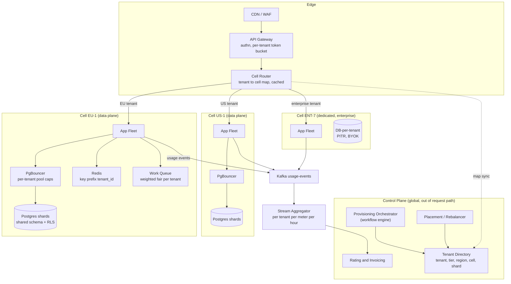
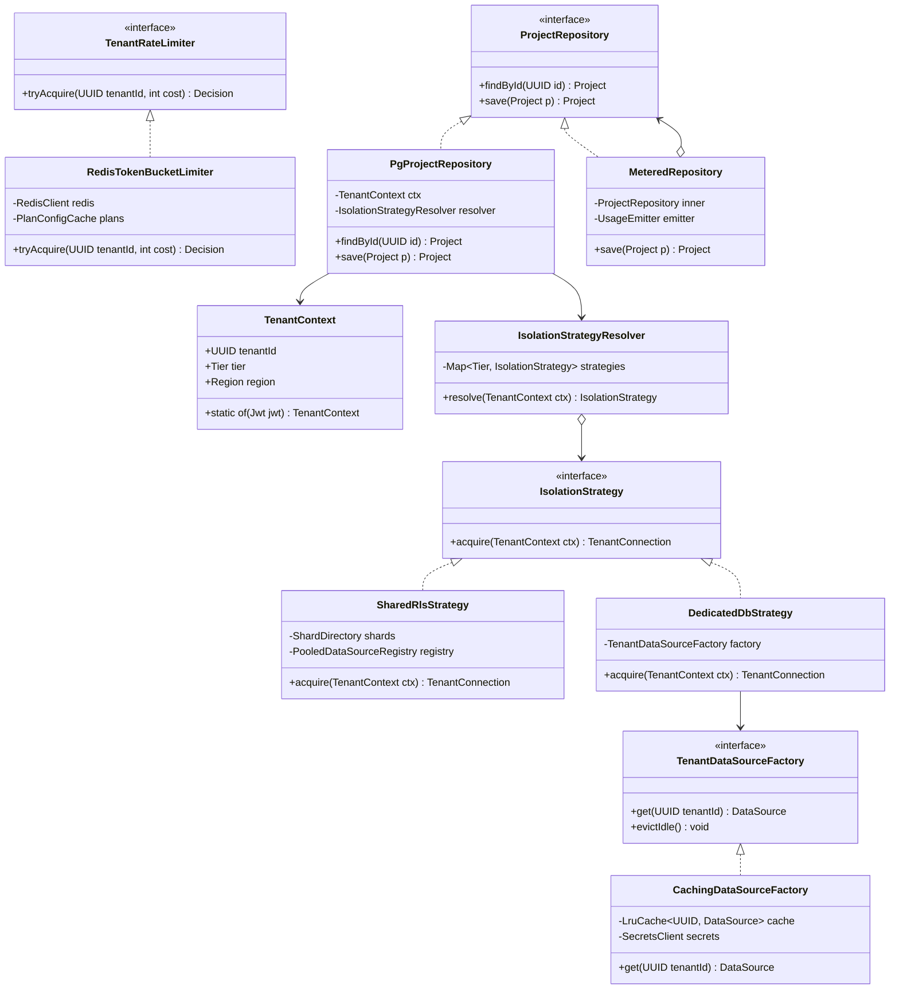

# Multi-Tenant SaaS Architecture

## 1. Problem Statement & Scope

Design the platform architecture for a B2B SaaS product (think: project management / CRM-class app) that serves many customer organizations ("tenants") from shared infrastructure, with strong data isolation, per-tenant performance guarantees, usage-based billing, and compliance requirements (data residency, per-tenant restore, GDPR deletion).

### Functional requirements
- Tenant lifecycle: signup → provisioning → active → suspended → offboarded (data export + deletion).
- All application reads/writes are scoped to exactly one tenant; zero cross-tenant leakage.
- Usage metering (API calls, storage GB, seats) feeding invoicing.
- Tiered offering: self-serve SMB tier (shared infra) and enterprise tier (dedicated isolation, residency pinning).
- Per-tenant admin: quotas, feature flags, custom domains, SSO config.
- Data residency: a tenant's data is pinned to EU or US and never persisted outside its region.

### Non-functional requirements
- Isolation: cross-tenant data leak probability driven to ~0 via defense in depth (not just app code discipline).
- Fairness: one tenant's traffic spike must not degrade others (noisy neighbor SLO: p99 latency for tenant A independent of tenant B's load).
- Availability: 99.95% per tenant; blast radius of any single failure bounded to a small fraction of tenants.
- Per-tenant restore: restore one tenant to T-minus-X without touching others.
- Schema evolution: roll out migrations across all tenants in < 1 day with rollback.
- Operability at 100k tenants without O(tenants) manual work.

### Back-of-envelope estimation
- Tenants: 50,000 total. Power-law distribution: top 50 "whale" tenants ≈ 40% of traffic; long tail of 45,000 tenants nearly idle.
- Users: avg 40 users/tenant → 2M users; 10% concurrently active in business hours → 200k concurrent.
- QPS: 200k concurrent users × 1 request / 10 s = **20,000 QPS** steady; peak 3× = **60,000 QPS**. Read:write ≈ 80:20 → 48k reads, 12k writes at peak.
- Storage: avg 2 GB/tenant, whales up to 5 TB. 50,000 × 2 GB = **100 TB** logical; ×3 replication + indexes ≈ **400 TB** raw.
- Metering events: every billable API call emits 1 event. 20k QPS × 86,400 s ≈ **1.7B events/day**. At 200 B/event ≈ **350 GB/day** raw metering data (compresses ~10:1).
- Bandwidth: 20k QPS × 20 KB avg response = **400 MB/s ≈ 3.2 Gbps** egress steady.
- Connection math (this matters later): 60k peak QPS with 20 ms avg DB time ⇒ ~1,200 concurrently busy DB connections needed platform-wide (Little's Law: 60,000 × 0.02).

## 2. Brute-Force / Naive Design

One monolith, one Postgres instance, every table has a `tenant_id` column, every query hand-written with `WHERE tenant_id = ?`. One global connection pool (say 200 connections). Billing = monthly cron that runs `SELECT count(*) FROM api_log GROUP BY tenant_id`.

### Why it breaks, with numbers
1. **Noisy neighbor saturates the pool.** Whale tenant runs an export: 500 concurrent report queries × 800 ms each = 400 busy connections needed; pool has 200. Every other tenant's 5 ms point reads queue behind them. p99 for the 49,999 innocent tenants goes from 30 ms to 8+ s. One tenant caused a platform-wide incident.
2. **Isolation is one missing WHERE clause away from a breach.** With ~2,000 hand-written queries and no enforcement layer, the leak probability per release is effectively "whenever a human forgets." This is the #1 reported class of SaaS security incidents.
3. **Single DB ceiling.** 100 TB and 60k QPS exceed one Postgres box (practical comfort ~ a few TB hot / ~50k simple QPS with heavy tuning). Vertical scaling ends; there is no shard story.
4. **Per-tenant restore is impossible.** PITR restores the *whole* database. Tenant asks "restore us to yesterday 14:00" → you'd roll back 49,999 other tenants too, or do a painful side-restore + row extraction (hours to days for a 100 TB cluster).
5. **Billing cron double-bills or misses.** Counting from an operational table with retries and no idempotency: client retries create duplicate rows (over-bill), crashed requests log nothing (under-bill), and the monthly full scan of 1.7B × 30 rows hammers production.
6. **Blast radius = 100%.** Bad migration, bad deploy, or DB failover takes every tenant down simultaneously.
7. **No residency.** EU tenant data sits in a US database; unsellable to EU enterprises.

## 3. Evolving the Design

Narrate each bottleneck → fix, in the order an outage would force them on you.

**Step 1 — Missing WHERE clause → enforce isolation in the database (RLS).**
App-layer filtering is a convention; Postgres Row-Level Security is a guarantee. Add `tenant_id` policies so the DB refuses to return rows outside the session's tenant, even if application code is buggy. App code sets `SET app.tenant_id = '<uuid>'` per transaction; policies do the rest. Defense in depth: app filter + RLS + tests that attempt cross-tenant reads.

**Step 2 — Pool exhaustion → tenant-aware connection pooling.**
Partition the pool: each tenant (or tenant tier) gets a cap, e.g. no tenant may hold > 10% of connections. Introduce PgBouncer in transaction mode so 10,000 app-side "connections" multiplex onto ~500 server connections. Whale's export now queues *its own* requests, not everyone's.

**Step 3 — Whale traffic spikes → per-tenant rate limits and fair queuing.**
Token bucket per tenant at the API gateway (capacity = burst, refill = plan rate). Behind the gateway, weighted fair queuing per tenant for expensive async work (exports, reports) so the worker fleet round-robins across tenants instead of FIFO-draining one whale's 50k-job burst.

**Step 4 — Single DB ceiling → shard by tenant.**
Tenant is the natural shard key: no cross-tenant transactions exist by construction. Map tenant → shard in a control-plane directory. Most tenants share shards (shared schema + RLS); this is horizontal scaling with zero cross-shard queries on the hot path.

**Step 5 — Enterprise isolation/restore/residency demands → hybrid isolation tiers.**
Keep shared-schema for the 45k tail (cheap). Offer database-per-tenant for enterprise: per-tenant PITR restore, physical isolation, per-tenant encryption keys, easy residency pinning. The isolation model becomes a *pricing tier attribute*, resolved per tenant at runtime (Strategy pattern, §6).

**Step 6 — Billing accuracy → event pipeline with idempotent metering.**
Replace the cron scan with: API emits usage events (with idempotency keys) → Kafka → streaming aggregation into per-tenant, per-hour rollups → rating engine → invoice. Exactly-once *effect* via idempotent upserts keyed by (tenant, meter, window, event_id-set hash), plus reconciliation jobs.

**Step 7 — 100% blast radius → cell-based architecture.**
Group shards + app fleet + cache into self-contained **cells**, each hosting a bounded set of tenants (e.g., ≤ 2,000 tenants or ≤ 5% of revenue per cell). A thin cell router maps tenant → cell. A bad deploy or poison-pill tenant takes down one cell, not the platform. Deploys roll cell-by-cell (waves). Residency falls out naturally: EU cells in eu-central-1, US cells in us-east-1; the router pins EU tenants to EU cells.

**Step 8 — Growth → tenant placement and rebalancing.**
Control plane tracks per-cell utilization; new tenants placed by bin-packing (headroom + residency + tier). Hot tenants migrated between cells (or promoted to a dedicated cell) via dual-write/backfill/cutover.

## 4. Protocol & Technology Choices — Why This, Not That

### Isolation model (the core decision)

| Dimension | Shared schema + tenant_id (+RLS) | Schema-per-tenant | Database-per-tenant |
|---|---|---|---|
| Infra cost / tenant | Lowest (rows are free) | Medium (catalog bloat per schema) | Highest (instance or DB overhead each) |
| Isolation strength | Logical only (RLS-enforced) | Logical, stronger namespace separation | Physical; own creds, keys, resources |
| Migration pain | 1 migration, all tenants at once (big-bang risk, but one operation) | N migrations; drift when some fail mid-fleet | N migrations; fully independent versions possible |
| Noisy neighbor | Worst — shared buffers, locks, vacuum, WAL | Same instance ⇒ still shared resources | Best — dedicated compute/IO possible |
| Per-tenant restore | Hard: row-level extract from side restore | Medium: dump/restore one schema | Trivial: native PITR per tenant |
| Tenant count scalability | 100k+ easily | ~1k–5k/instance (pg_catalog, pg_dump, connection × schema pain) | 100s–low 1000s (cost + fleet ops), needs heavy automation |
| Ops model | One fleet to tune | One fleet, N namespaces | Fleet-of-fleets; needs control plane |

**Chosen: hybrid.** Shared schema + RLS for SMB tail; database-per-tenant for enterprise tier. Schema-per-tenant rejected as the default: it combines the migration pain of DB-per-tenant with the noisy-neighbor profile of shared — worst of both — though it *would win* for a mid-size fleet (≤ ~1k tenants) needing per-tenant restore on a budget, or migrating a legacy single-tenant app with minimal code change. DB-per-tenant *wins outright* when tenant count is small and contracts demand it (healthcare, finance, gov: BYOK, dedicated instances, audit).

### RLS vs app-layer filtering

| | Postgres RLS | App-layer WHERE filtering |
|---|---|---|
| Enforcement point | Database — survives app bugs, ad-hoc queries, ORMs | Application — every query path must be correct |
| Failure mode | Forgot `SET app.tenant_id` ⇒ query returns **zero rows** (fail closed) | Forgot WHERE ⇒ returns **all tenants' rows** (fail open) |
| Perf | ~0–5% overhead; planner inlines the predicate; needs `(tenant_id, …)` leading indexes | Zero overhead |
| Works with | Connection pooling needs care (SET per txn, transaction-mode pooling) | Any pooler trivially |

**Chosen: both** (belt and suspenders). RLS is the backstop; app-layer scoping (repository pattern) is the first line and enables query-plan control. App-only would win if using a DB without RLS (MySQL pre-8 without workarounds) or a sharded key-value store where the tenant key is in every physical key anyway.

### Rate limiter placement

| | API gateway (edge) | Per-service in-process | DB-level (statement timeout, pool caps) |
|---|---|---|---|
| Rejects work | Earliest — cheapest | After routing + auth cost paid | Latest — request already consumed app CPU |
| Global view | Yes (with shared counter store, e.g., Redis) | Per-instance only unless coordinated | Per-DB |
| Granularity | Tenant, route, plan | Tenant + operation cost | Connections/queries only |

**Chosen: gateway token bucket (Redis-backed, local cache for hot tenants) + DB pool caps as backstop.** In-process limiting alone rejected: N gateway instances × local buckets over-admits N×. In-process *would win* for cost-based limiting where "cost" is only known mid-request (e.g., query complexity) — we do both: cheap coarse limit at edge, cost-aware limit in service.

### Metering: stream vs batch

| | Streaming (Kafka + aggregator) | Batch (nightly log scan) |
|---|---|---|
| Freshness | Minutes — enables live usage dashboards, spend caps, overage cutoffs | T+1 day; can't enforce spend caps in-day |
| Accuracy machinery | Idempotent keys, windowed aggregation, late-event handling | Simpler: scan immutable logs, dedupe in one pass |
| Cost | Kafka + stream processors 24/7 | Cheap burst compute |
| Failure recovery | Replay from offset | Re-run the job |

**Chosen: streaming for rollups + a daily batch reconciliation over the raw event log as source of truth.** Pure batch *would win* for a young product with monthly-only invoicing and no in-product usage display — start there, add streaming when spend caps become a feature.

### Cell routing: DNS vs L7 router

| | DNS per tenant (tenant1.app.com → cell IP) | L7 routing layer (thin proxy consults tenant→cell map) |
|---|---|---|
| Migration agility | Poor — TTLs, client DNS caching; cutover takes minutes-hours | Instant — flip mapping in directory, next request routes new |
| Extra hop | None | One (~1 ms) |
| Failure handling | Client retries against dead cell until DNS propagates | Router health-checks cells, can fail over instantly |
| Complexity | Low | Must keep router thin/static or it becomes a global SPOF |

**Chosen: L7 cell router** (stateless, config from control plane, aggressive local caching of tenant→cell map) — because tenant migration between cells is a core operation. DNS *would win* for very large enterprise tenants on dedicated cells with custom domains (we actually do DNS pinning for those: rare moves, no router hop). Router discipline: it does *only* tenant→cell lookup and forwarding; no business logic, deployed independently of cells, N+2 redundant.

## 5. High-Level Design (HLD)



Control plane (tenant directory, provisioning, billing) is globally replicated but **never on the request hot path** — cells keep serving with a cached tenant map even if the control plane is down (static stability).

### Write path (create a record)
1. Request hits gateway with JWT; gateway validates signature, extracts `tenant_id` claim, checks tenant token bucket (Redis `EVAL`, ~0.3 ms). 429 with `Retry-After` if empty.
2. Cell router looks up tenant → cell (local cache, TTL 30 s + push invalidation), forwards to cell EU-1.
3. App middleware builds immutable `TenantContext` from the JWT (never from request body/query params).
4. Repository opens a transaction via PgBouncer; first statement: `SET LOCAL app.tenant_id = $1`. PgBouncer transaction mode is safe because `SET LOCAL` scopes to the transaction.
5. INSERT with explicit `tenant_id` column; RLS `WITH CHECK` policy independently verifies the row's tenant matches the session tenant.
6. On commit, emit usage event `{event_id: uuid, tenant_id, meter: api.write, qty: 1, ts}` to Kafka (async, buffered; request does not block on the broker).

### Read path
Same steps 1–4; SELECT carries app-layer `WHERE tenant_id = ?` *and* RLS filters. Cache lookup first: key `t:{tenant_id}:project:{id}` — tenant prefix mandatory, enforced by a cache client wrapper that refuses keys without a tenant prefix.

### Data model (shared-schema cells)

```sql
CREATE TABLE tenants (
    tenant_id   uuid PRIMARY KEY,
    name        text NOT NULL,
    tier        text NOT NULL CHECK (tier IN ('free','pro','enterprise')),
    region      text NOT NULL CHECK (region IN ('eu','us')),
    cell_id     text NOT NULL,
    status      text NOT NULL DEFAULT 'active',
    created_at  timestamptz NOT NULL DEFAULT now()
);

CREATE TABLE projects (
    tenant_id   uuid NOT NULL REFERENCES tenants(tenant_id),
    project_id  uuid NOT NULL,
    name        text NOT NULL,
    created_at  timestamptz NOT NULL DEFAULT now(),
    PRIMARY KEY (tenant_id, project_id)          -- tenant_id leads every PK/index
);
CREATE INDEX idx_projects_tenant_created ON projects (tenant_id, created_at DESC);

ALTER TABLE projects ENABLE ROW LEVEL SECURITY;
ALTER TABLE projects FORCE ROW LEVEL SECURITY;   -- applies even to table owner

CREATE POLICY tenant_isolation ON projects
    USING      (tenant_id = current_setting('app.tenant_id')::uuid)
    WITH CHECK (tenant_id = current_setting('app.tenant_id')::uuid);
-- App role has no BYPASSRLS. Migrations run as a separate privileged role.
-- Per transaction: SET LOCAL app.tenant_id = '<uuid>';
-- current_setting with no value set -> error -> fail closed.
```

Composite PKs with leading `tenant_id` keep each tenant's rows physically clustered (good locality, cheap tenant export/delete) and make the RLS predicate index-supported.

### API design and tenant context propagation
- JWT claims: `{ sub: user_id, tid: tenant_id, tier, region, scopes[] }` — signed by the IdP; `tid` is authoritative. Tenant is **never** accepted from a path/body field for authorization purposes; if the URL contains a tenant slug, it must match `tid` or 403.
- Service-to-service: `tenant_id` propagated in a signed internal header / context object; every internal API requires it (no "tenantless" calls except control-plane admin APIs with separate audit).
- Async: every queue message and Kafka event carries `tenant_id`; consumers rebuild `TenantContext` from the message, never from ambient state.
- Admin "impersonation" endpoints: separate token type, short TTL, always audited.

## 6. Low-Level Design (LLD)

Patterns used and why:
- **Strategy** — `IsolationStrategy` resolves how a tenant's data is accessed (shared pool + RLS vs dedicated datasource) so business code is isolation-agnostic; adding a new tier touches one resolver.
- **Factory (+ registry cache)** — `TenantDataSourceFactory` lazily builds and caches per-tenant/per-shard datasources; avoids 50k open pools by evicting idle ones (LRU + TTL).
- **Repository** — the only layer allowed to touch SQL; constructor-injected `TenantContext` makes tenantless queries unrepresentable.
- **Ambient context via scoped holder** — `TenantContext` bound per-request; explicitly captured/restored across async hops (no ThreadLocal leaks across pooled threads).
- **Decorator** — `MeteredRepository` wraps repositories to emit usage events without polluting domain logic.



### Tenant-aware datasource routing (hardest path #1)

```java
final class SharedRlsStrategy implements IsolationStrategy {
    private final ShardDirectory shards;              // tenant -> shard (cached, push-invalidated)
    private final PooledDataSourceRegistry registry;  // shard -> PgBouncer-backed pool
    private final Semaphores tenantCaps;              // tenantId -> Semaphore(maxConnsForTier)

    @Override
    public TenantConnection acquire(TenantContext ctx) throws SQLException {
        Shard shard = shards.lookup(ctx.tenantId());  // O(1) local cache hit
        Semaphore cap = tenantCaps.forTenant(ctx.tenantId(), ctx.tier());
        // Per-tenant pool cap: whale cannot hold more than its slice. Bounded wait,
        // then shed with 429-equivalent so backpressure reaches the client, not the DB.
        if (!cap.tryAcquire(50, MILLISECONDS)) {
            throw new TenantPoolExhausted(ctx.tenantId());
        }
        Connection c = null;
        try {
            c = registry.get(shard).getConnection();  // PgBouncer transaction mode behind this
            try (Statement s = c.createStatement()) { // SET LOCAL: scoped to txn => pooler-safe
                s.execute("SET LOCAL app.tenant_id = '" + ctx.tenantId() + "'"); // uuid, not user input
            }
            return new TenantConnection(c, () -> cap.release());  // release cap on close
        } catch (Throwable t) {
            if (c != null) c.close();
            cap.release();
            throw t;
        }
    }
}

final class DedicatedDbStrategy implements IsolationStrategy {
    private final TenantDataSourceFactory factory;    // LRU cache of live pools, idle-evicted
    @Override
    public TenantConnection acquire(TenantContext ctx) throws SQLException {
        // Factory: fetch per-tenant creds from secrets manager, build small pool (max 5),
        // cache keyed by tenantId; ~200 concurrently-warm enterprise tenants => ~1k conns.
        return new TenantConnection(factory.get(ctx.tenantId()).getConnection(), () -> {});
    }
}
```

### Per-tenant token bucket (hardest path #2) — atomic Lua on Redis

```java
final class RedisTokenBucketLimiter implements TenantRateLimiter {
    // KEYS[1]=bucket key  ARGV: capacity, refillPerSec, nowMicros, cost
    private static final String LUA = """
        local b = redis.call('HMGET', KEYS[1], 'tokens', 'ts')
        local tokens = tonumber(b[1]) or tonumber(ARGV[1])       -- start full
        local ts     = tonumber(b[2]) or tonumber(ARGV[3])
        local elapsed = math.max(0, tonumber(ARGV[3]) - ts) / 1e6
        tokens = math.min(tonumber(ARGV[1]), tokens + elapsed * tonumber(ARGV[2]))
        local allowed = 0
        if tokens >= tonumber(ARGV[4]) then
            tokens = tokens - tonumber(ARGV[4]); allowed = 1
        end
        redis.call('HMSET', KEYS[1], 'tokens', tokens, 'ts', ARGV[3])
        redis.call('EXPIRE', KEYS[1], math.ceil(tonumber(ARGV[1]) / tonumber(ARGV[2])) * 2)
        return { allowed, tokens }
        """;

    public Decision tryAcquire(UUID tenantId, int cost) {
        Plan p = plans.forTenant(tenantId);            // {ratePerSec, burstCapacity}
        // Hot-tenant optimization: gateway instances hold a local sub-bucket leased from
        // Redis in batches of N tokens -> 1 Redis call per N requests, bounded overshoot N*instances.
        List<Long> r = redis.eval(LUA, key(tenantId), p.burst(), p.rate(), nowMicros(), cost);
        return r.get(0) == 1 ? Decision.allow()
                             : Decision.throttle(retryAfterSeconds(cost, p.rate()));
    }
}
```

Fair queuing for async work: one logical queue per tenant; dispatcher performs deficit-weighted round-robin across tenants with pending work (weight = tier), so a whale enqueueing 50k export jobs interleaves with a tail tenant's single job instead of starving it.

### Onboarding/provisioning workflow (control plane, workflow engine e.g. Temporal)
1. Create tenant record (`status=provisioning`), reserve slug/custom domain.
2. Placement: choose cell by residency + tier + headroom bin-packing.
3. Tier=shared: assign shard, seed rows, create default admin. Tier=enterprise: provision DB (from template snapshot, ~seconds), create creds in secrets manager, register in factory config, run schema migrations.
4. Configure SSO/SCIM stubs, create billing account, publish tenant→cell mapping to router config, warm caches.
5. Activate (`status=active`), emit `tenant.provisioned`.
Every step idempotent + compensating action (saga) — a crash mid-provision must not leave a half-tenant; retries converge.

## 7. Deep Dives & Failure Modes

### Cross-tenant leak vectors and defenses
| Vector | Defense |
|---|---|
| Missing WHERE clause | RLS backstop (fail closed on unset `app.tenant_id`); repository layer is the only SQL entry point |
| tenant_id taken from request body/URL | Authorization tenant comes only from verified JWT claim; URL slug must match or 403 |
| Cache key collision | Cache client wrapper mandates `t:{tenant}` prefix; refuses raw keys; code review lint rule |
| ThreadLocal context bleed across pooled threads | Scoped context with mandatory clear-on-exit; async boundaries copy explicitly; canary test injects sentinel tenant and asserts absence elsewhere |
| Background jobs with superuser DB role | Jobs run per-tenant with the same RLS role; batch jobs iterate tenants, setting context each time |
| Search index / analytics store without RLS | Index per tenant or mandatory tenant filter injected by the search client library, verified by contract tests |
| Logs/metrics leaking tenant PII cross-tenant | Structured logging with tenant tag; support tooling enforces tenant-scoped views |
| Continuous verification | Nightly "leak canary": synthetic tenant A attempts reads as tenant B across every API; any row returned pages security |

### Noisy neighbor storm
Whale's mobile app ships a bug: 50× request rate. Layers that absorb it: (1) edge token bucket 429s the excess in <1 ms; (2) per-tenant pool semaphore bounds its DB share; (3) fair scheduler bounds its async share; (4) worst case, it degrades only its own cell — 4% of tenants — not the platform. Detection: per-tenant golden signals (QPS, p99, conn-held, queue depth) with automatic "tenant in penalty box" flag that tightens its bucket.

### Pool exhaustion
PgBouncer server pool sized by Little's Law per shard (peak shard QPS × avg txn time × safety 2×). Alarms on `cl_waiting` and server pool saturation. Guards: statement_timeout (e.g., 5 s API role), idle-in-transaction timeout 10 s, per-tenant caps. Failure mode to watch: long transactions in transaction-mode pooling pin server connections — ban interactive transactions on the API role; long work goes to the worker fleet with a separate pool.

### Metering double-count / undercount
- Double-count sources: producer retry after broker timeout (message written twice), consumer reprocessing after crash before offset commit. Fix: deterministic `event_id` at the producer; aggregator dedupes within window via `INSERT ... ON CONFLICT (tenant, meter, hour) DO UPDATE` driven by a processed-event-id set (RocksDB/state store), i.e., idempotent effect not exactly-once delivery.
- Undercount sources: fire-and-forget emit dropped on process crash. Fix for revenue-critical meters: transactional outbox (usage row committed in the same DB txn as the business write, relayed to Kafka).
- Late events: hourly windows stay open for 24 h grace; later arrivals go to an adjustments ledger, never mutate a rated invoice line — invoices are append-only with credit/debit memos.
- Reconciliation: daily batch recomputes rollups from raw immutable log, diffs against streamed rollups; alert at >0.1% divergence. Rating engine is pure/replayable: (rollups, price book version) → invoice lines.

### Cell failure and tenant evacuation
Cell = independent failure domain (own DBs, cache, app fleet; no synchronous cross-cell calls). On cell failure: (1) intra-region DB failover first (replicas in-cell across AZs) — usually sufficient; (2) true cell loss ⇒ evacuate: restore tenant data from continuous backups/cross-cell replicas into surviving cells or a standby cell, flip tenant→cell mapping (instant at L7 router). Evacuation is drilled monthly ("cell drain" game day). Cell sizing caps blast radius: no cell holds > 5% of revenue; whales spread across cells deliberately.

### Schema migration across thousands of tenants
- Shared-schema shards: expand/contract only (add nullable column → dual-write → backfill in batches → flip reads → drop later). Never `ALTER` that rewrites a 5 TB table in one lock; use `NOT VALID` constraints + `VALIDATE` separately; `lock_timeout=2s` with retry to avoid queueing behind long queries.
- DB-per-tenant fleet: migration = versioned artifact rolled by orchestrator in waves (canary tenants → 1% → 25% → all), tracked per-tenant version in the directory. Application must tolerate N and N+1 schema simultaneously (the invariant that makes wave rollout safe). Stuck tenants (long txn, disk full) alert and pause their wave without blocking others. Dashboard: histogram of fleet schema versions; drift > 48 h is an incident.

### Tenant deletion / GDPR
On offboard: `status=deleted` (soft) → 30-day grace with data export available → hard delete job: shared schema deletes by `tenant_id` in rate-limited batches (leading tenant_id in PKs makes this an index range delete); DB-per-tenant is `DROP DATABASE` + delete backups after retention + shred per-tenant KMS key (crypto-erasure covers backups you can't easily scrub). Purge propagates to: search indexes, caches, Kafka (tenant-keyed compaction/tombstones or encrypted payloads + key deletion), analytics warehouse, logs (PII kept out of logs by design). Signed deletion certificate emitted from a checklist workflow, audited.

### Hot tenant splitting
A tenant outgrows shared infra (e.g., > 15% of its shard's IO). Promotion to dedicated DB via live migration: (1) provision target; (2) bulk copy snapshot (per-tenant rows via `COPY` keyed on tenant_id, or logical replication filtered by tenant); (3) CDC tail to catch up; (4) brief write freeze for that tenant only (< 30 s: reject writes with retry hint) at lag ≈ 0; (5) final delta, flip directory entry `tenant→(strategy=dedicated, dsn)`; (6) verify row counts/checksums, then delete source rows. Rollback = flip pointer back before source deletion. Same mechanism handles cell-to-cell rebalancing.

## 8. Trade-off Summary & Interview Soundbites

| Decision | Trade-off accepted |
|---|---|
| Hybrid isolation (shared+RLS default, DB-per-tenant enterprise) | Two operational models to run; strategy indirection in code — in exchange for tail cost efficiency and enterprise sellability |
| RLS on top of app filtering | ~5% query overhead + pooler `SET LOCAL` discipline — for fail-closed isolation |
| PgBouncer transaction mode | No session state (prepared statements/advisory locks need care) — for 20× connection multiplexing |
| Edge token bucket per tenant | Redis dependency on hot path (mitigated by local token leases) — for earliest, cheapest rejection |
| Streaming metering + batch reconciliation | Two systems computing the same number — freshness and accuracy without trusting either alone |
| Cell-based architecture | Capacity fragmentation (per-cell headroom), tenant migration machinery — for ≤5% blast radius and wave deploys |
| L7 cell router over DNS | One extra hop, one more tier to keep boring — for instant tenant migration |
| tenant_id leads every PK/index | Slightly fatter indexes — for locality, cheap per-tenant delete/export, RLS-friendly plans |

### Soundbites
1. "Tenant_id is my partition key, my security boundary, my billing dimension, and my unit of blast radius — one identifier drives the whole architecture."
2. "App-layer filtering fails open; RLS fails closed. I want the bug that returns zero rows, not the bug that returns everyone's rows."
3. "Isolation model is a pricing decision as much as a technical one — I ship a hybrid and let the Strategy pattern hide it from business code."
4. "The noisy-neighbor fix is layered: reject at the edge, cap at the pool, fair-queue the workers, and bound the worst case with cells."
5. "I don't chase exactly-once delivery for metering; I make aggregation idempotent and reconcile against an immutable raw log."
6. "Cells turn 'the platform is down' into 'four percent of tenants are degraded, evacuation in progress.'"
7. "Migrations at fleet scale mean the app must tolerate schema N and N+1 at once — that invariant is what makes wave rollouts safe."
8. "The control plane decides; the data plane serves. Cells must keep serving cached decisions when the control plane is down — static stability."

### Common follow-ups
- **"Why not one giant DynamoDB table with tenant in the partition key?"** Viable for KV access patterns and gives per-partition throttling for free, but you lose relational queries, per-tenant restore is still hard, and RLS-equivalent enforcement moves back into app code/IAM policy per tenant (IAM policy count limits bite at ~10k tenants).
- **"How do you prevent a tenant from reading another's data via a support tool?"** Support tooling goes through the same tenant-scoped APIs with impersonation tokens (separate token type, short TTL, audited) — no direct DB access for humans.
- **"JWT says tenant A, URL says tenant B — who wins?"** JWT wins; mismatch is a 403 and a security metric, never a silent redirect.
- **"How many tenants per cell?"** Bound by two limits: operational (≤ ~2k tenants for manageable migrations) and business (≤ 5% of revenue) — whichever binds first.
- **"Cross-tenant analytics for your own product team?"** ETL into a warehouse under a separate governance regime; the operational plane never runs cross-tenant queries.
- **"What breaks first at 10× growth?"** The tenant directory read rate at the router — fix is push-based map replication to routers (it's small: 50k rows), not a bigger lookup service.
- **"Zero-downtime tenant migration between cells?"** Snapshot + CDC tail + sub-30 s per-tenant write freeze at cutover; reads never stop; directory flip is atomic at the router.
