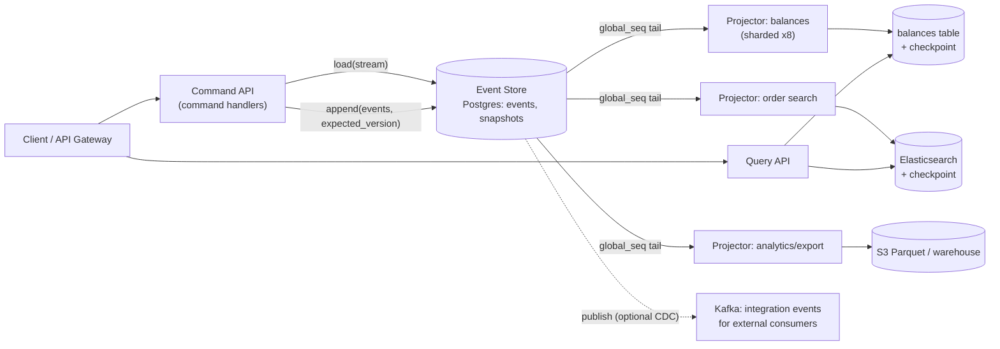
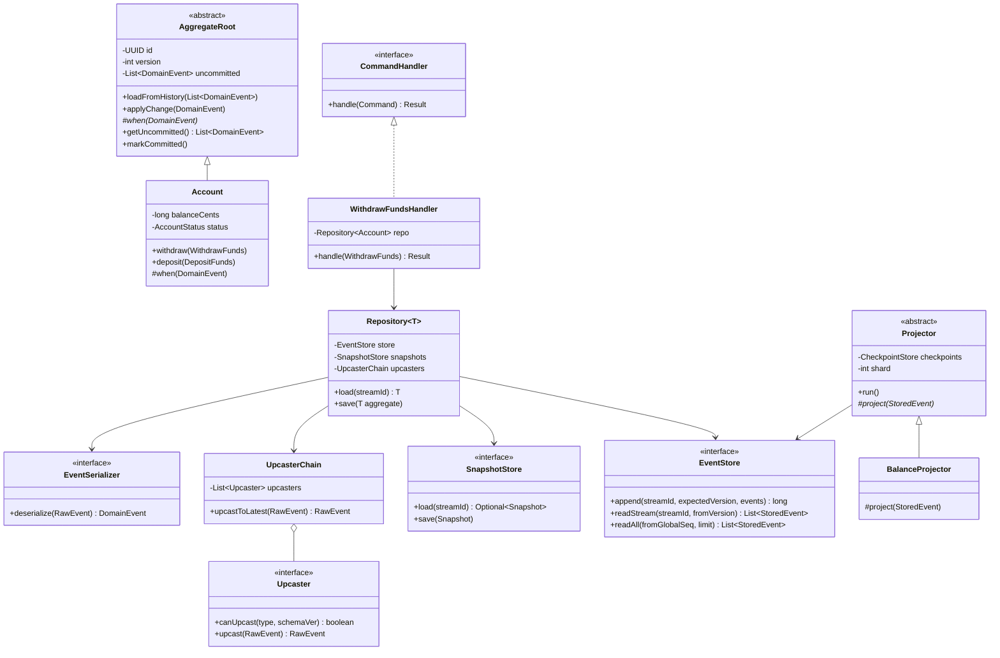

# Event Sourcing + CQRS

## 1. Problem Statement & Scope

**Anchor domain: core banking ledger + order management for a brokerage.** Accounts hold balances; commands are `OpenAccount`, `DepositFunds`, `WithdrawFunds`, `PlaceOrder`, `CancelOrder`, `SettleTrade`. Regulators require a complete, tamper-evident history of every state change; support and compliance need to answer "what did this account look like at 14:32 UTC on March 3rd, and why."

### Functional requirements
- Accept commands against an account/order with strict business invariants (no overdraft, no cancel-after-fill).
- Persist every state change as an immutable fact; state is fully derivable from history.
- Serve multiple read shapes: account balance lookup, transaction history, per-customer portfolio view, compliance/audit queries, fraud-scoring feed.
- Point-in-time reconstruction of any account ("temporal queries").
- Rebuild any read model from scratch without touching the write side.

### Non-functional requirements
- Command latency: p99 < 100 ms (load aggregate + validate + append).
- Durability: no acknowledged event may ever be lost (RPO = 0 for the event store).
- Correctness under concurrency: two simultaneous withdrawals must not both succeed if only one is covered.
- Projection lag budget: p99 < 500 ms for balance view; < 30 s acceptable for analytics views.
- Audit: 7-year retention, immutable.

### Back-of-envelope estimation
- 10 M active accounts; 5 M commands/day at peak season.
- Commands/sec average: 5,000,000 / 86,400 ≈ **58 cmd/s avg**; peak ×10 → **~600 cmd/s peak**.
- Events per command: most commands emit 1 event, some (SettleTrade) emit 2–3 → assume 1.5 avg → **~90 events/s avg, ~900 events/s peak**.
- Event size: ~300 B payload + ~200 B envelope (ids, timestamps, metadata, headers) = **500 B/event**.
- Daily event volume: 5 M × 1.5 × 500 B = 3.75 GB/day... check: 7.5 M events × 500 B = 3.75 GB/day.
- Yearly growth: 3.75 GB × 365 ≈ **1.4 TB/year raw**; with indexes (~+60%) and replication ×3 → **~6.5 TB/year of physical storage**. Manageable in partitioned Postgres for years; plan archival tiering (S3 Parquet) after year 2.
- Aggregate history length: median account ~200 events/year; hot trading accounts ~50k events/year → snapshots mandatory for the hot tail, optional for the median.
- Projection throughput needed: 900 events/s peak into 4–5 read models = ~4,500 projected writes/s — trivially shardable.

**Scope**: single region for writes (ledger correctness > geo-latency), multi-region read replicas of read models. Out of scope: inter-bank settlement rails, payment networks.

## 2. Brute-Force / Naive Design

CRUD: one mutable `accounts` row per account, plus an `audit_log` table written by application code after each update.

```sql
UPDATE accounts SET balance = balance - 500 WHERE id = :id AND balance >= 500;
INSERT INTO audit_log(account_id, action, amount, actor, at) VALUES (...);
```

### Why it breaks, concretely

1. **Lost history.** The `accounts` row only holds *current* state. "What was the balance before the disputed withdrawal at 14:32?" requires the audit log to be complete and correct — which nothing enforces. The row is the truth; the audit is a hope.
2. **Audit drift (dual-write inside one service).** The UPDATE and the audit INSERT are two statements. Wrap them in one transaction and you're OK *until* someone adds a code path (bulk adjustment script, admin console, DBA hotfix) that updates the row without writing audit. At 5 M commands/day, a 0.01% drift rate = **500 unexplained mutations/day**. Auditors reject "mostly complete" logs. With event sourcing this class of bug is structurally impossible: there is no state to mutate except by appending an event.
3. **Contention on hot rows.** A market-maker account taking 200 updates/s serializes on one row lock. At 5 ms per transaction, 200/s = the row is locked 100% of the time; queue grows unboundedly, p99 explodes past 1 s. Append-only writes to an event log don't take a long row lock — the conflict window shrinks to a unique-index insert.
4. **Read-shape coupling.** Balance lookup, history pagination, portfolio aggregation, and fraud feeds all hammer the same normalized tables. Every new read shape means new indexes on the write tables, which slows every write. 4 extra indexes ≈ 4 extra B-tree maintenance ops per UPDATE.
5. **Bug recovery.** A bug that corrupts balances is unrecoverable beyond backups — you cannot re-derive correct state because the inputs (intent) were thrown away; only the corrupted output survives.

Adding triggers to auto-populate the audit table fixes (2) partially but not (1), (3), (4), or (5), and trigger-based audit captures *row diffs*, not *business intent* ("balance -500" vs "WithdrawalMade{atm: X, card: Y}").

## 3. Evolving the Design

**Step 1 — Make the log the source of truth (append-only events).**
Bottleneck: audit drift + lost intent. Fix: invert the relationship — instead of state-plus-audit, store only immutable domain events (`FundsWithdrawn{amount, atmId}`) in an append-only log, one *stream* per aggregate (account). Current state = left-fold of events. Audit is now free and provably complete: the audit *is* the database. Interviewer soundbite: "we stop persisting the answer and start persisting the question."

**Step 2 — Guard invariants with optimistic concurrency.**
Bottleneck: two concurrent withdrawals both read balance 600, both append `FundsWithdrawn{500}` → overdraft. Fix: every append carries `expected_version` = the version the writer loaded. A unique constraint on `(stream_id, version)` makes the second append fail; that writer reloads, re-validates (insufficient funds now), and rejects. No pessimistic locks, no lock manager; the DB's unique index is the arbiter.

**Step 3 — Split reads from writes (CQRS).**
Bottleneck: querying "top 100 accounts by balance" or "all orders for customer X" against an event log means folding millions of streams — O(total events). Fix: separate models. Write side stores events and enforces invariants; read side maintains denormalized *projections* (balance table, order-search index, portfolio cache), each shaped exactly for one query. Writes stop paying for read indexes; reads stop scanning logs. Note explicitly: CQRS does not require event sourcing and vice versa, but they compose naturally — events are a perfect changefeed for projections.

**Step 4 — Snapshots for long streams.**
Bottleneck: loading the market-maker account with 500k events takes seconds per command. Fix: periodically persist a *snapshot* (serialized aggregate state + version). Load = latest snapshot + events after it. With snapshot cadence every 500 events, worst-case load = 1 snapshot read + ≤500 event reads ≈ 5–10 ms. Snapshots are a cache, never truth: deletable, rebuildable, version-tagged to the aggregate code that produced them.

**Step 5 — Asynchronous projections with checkpoints.**
Bottleneck: updating 5 read models synchronously in the command transaction re-creates dual-write and couples command latency to the slowest read store (Elasticsearch p99). Fix: projector workers tail the global event log asynchronously, each maintaining its own *checkpoint* (last processed global position). Command path stays: load → validate → append → ack. Cost accepted: the read side is eventually consistent — addressed with consistency tokens (Section 5/7).

**Step 6 — Shard projectors for throughput and isolation.**
Bottleneck: one projector thread at 900 events/s with a 5 ms Elasticsearch write = 180 events/s max → lag grows 720 events/s at peak. Fix: partition the event feed by `stream_id` hash (preserves per-aggregate order, which is the only order that matters for correctness), run N projector shards per read model, each with its own checkpoint row. Separate projector *groups* per read model so a slow analytics projector never delays the balance view. 8 shards × 180/s = 1,440/s > 900/s peak with headroom.

## 4. Protocol & Technology Choices — Why This, Not That

### Event store

| Option | Verdict | Why / Why not | When it WOULD win |
|---|---|---|---|
| **Postgres events table** | **Chosen** | ACID append + unique `(stream_id, version)` gives optimistic concurrency for free; transactional with snapshots/checkpoints; ops team already runs it; partitioning handles 1.4 TB/yr | Almost always the right default up to ~10k events/s |
| EventStoreDB / KurrentDB | Strong alternative | Purpose-built: streams, `$all` feed, catch-up + persistent subscriptions, built-in projections | Team is ES-native, needs many fine-grained subscriptions, >10k ev/s, wants server-side stream APIs instead of building them on Postgres |
| Kafka as event store | **Rejected** | No per-aggregate optimistic concurrency (can't CAS on expected_version across producers); no "read one aggregate's events by key" (a partition holds thousands of interleaved streams); retention/compaction fights "keep forever, keep every version" (compaction keeps only latest per key — destroys history) | As the *downstream distribution bus* fed from the store, or when "streams" are coarse (one per topic/tenant) and you accept single-writer-per-partition serialization |
| DynamoDB + Streams | Viable at extreme scale | Conditional writes give optimistic concurrency (`attribute_not_exists(version)`); Streams feed projectors; but Streams retain 24 h only (replay needs your own archive), 1 MB item limit, awkward global ordering | Serverless shop, multi-region write scale beyond a single Postgres, willing to build archival + replay plumbing |

### Projection transport (events → read models)

| Option | Verdict | Why / Why not | When it WOULD win |
|---|---|---|---|
| **Poll/tail the events table by global sequence** | **Chosen** | Simplest correct thing: `SELECT ... WHERE global_seq > :checkpoint ORDER BY global_seq LIMIT 1000`; checkpoint stored transactionally with the projection update; replayable from any position | Default within one system; sub-second lag with 100–200 ms poll or LISTEN/NOTIFY wakeups |
| CDC (Debezium) → Kafka → projectors | Good for fan-out | Decouples consumers, offloads read-path from the store DB, integrates other teams | Many external consumers, cross-team event distribution, event store DB is CPU-constrained |
| Direct dual-write (command handler writes read models) | **Rejected** | Classic dual-write hazard: no transaction spans Postgres + Elasticsearch; partial failure = silent divergence; also couples write latency to every read store | Never for correctness-critical models; tolerable only for best-effort caches you can drop |

Note: with event sourcing you do **not** need a separate outbox — the events table *is* the outbox (see Section 7 / distinction below).

### Snapshot store

| Option | Verdict | Notes |
|---|---|---|
| **Same Postgres, `snapshots` table** | **Chosen** | Transactionally simple, one op surface; snapshots are small (KBs) and overwritten in place (they're cache, not truth) |
| Redis | Alternative | Faster load, but adds a system and a cold-start path; wins when aggregate rehydration dominates p99 and streams are huge |
| S3 | Alternative | For very large snapshot blobs (rare); latency too high for the hot path |

### Event serialization

| Option | Verdict | Why / Why not | When it WOULD win |
|---|---|---|---|
| **JSON (+ JSONB column)** | **Chosen** | Human-debuggable (compliance will read raw events), queryable ad hoc in Postgres, weak-schema tolerant (ignore unknown fields, default missing ones) — which *is* an upcasting strategy | Default for in-system events at our volume; 500 B × 7.5 M/day is cheap |
| Protobuf | Alternative | 3–5× smaller, fast, enforced schema evolution rules (field numbers, no reuse) | >10k ev/s, cross-language consumers, storage-sensitive; pay with opaque blobs and registry ops |
| Avro + schema registry | Alternative | Best-in-class evolution (reader/writer schemas) | Kafka-centric ecosystems where the registry already exists |

### Read model stores (per query shape)

| Read model | Store | Why |
|---|---|---|
| Balance / account summary | Postgres table (or Redis-fronted) | Point lookups, needs to be transactional with its checkpoint |
| Order/history search | Elasticsearch | Full-text + filter + facet |
| Portfolio aggregation | Postgres materialized rows | Joins across accounts per customer |
| Analytics / compliance | S3 Parquet + warehouse | Cheap scans, 7-year retention |
| Fraud feed | Kafka topic (fed from log) | Streaming consumers outside our bounded context |

## 5. High-Level Design (HLD)



### Write path
1. `POST /accounts/{id}/withdrawals` → command handler builds `WithdrawFunds`.
2. Repository loads snapshot (if any) + events after snapshot version → folds into `Account` aggregate.
3. Aggregate validates invariants (sufficient balance, account not frozen); produces `FundsWithdrawn` or throws a domain rejection (4xx, not a retry).
4. Repository appends with `expected_version`; unique-violation → reload and retry (bounded, e.g. 3 attempts); still conflicting → 409.
5. Ack to client with `{streamId, newVersion}` — the **consistency token**.
6. Every ~500 events, write/overwrite the snapshot (async, best-effort).

### Read path
1. `GET /accounts/{id}/balance` hits the balances read table. Optionally pass `X-Consistent-With: version=1042`; the query side compares against the projection's applied version for that stream and either waits (bounded, e.g. 200 ms poll) or returns `202`/stale-flag.
2. Search and analytics queries never touch the write side.

### Data model

```sql
-- Append-only. Never UPDATE or DELETE (except crypto-shredding key deletion, Sec 7).
CREATE TABLE events (
    global_seq   BIGINT GENERATED ALWAYS AS IDENTITY,   -- total order for projectors
    stream_id    UUID        NOT NULL,                  -- aggregate id
    stream_type  TEXT        NOT NULL,                  -- 'Account', 'Order'
    version      INT         NOT NULL,                  -- 1..n within stream
    event_type   TEXT        NOT NULL,                  -- 'FundsWithdrawn'
    schema_ver   INT         NOT NULL DEFAULT 1,        -- for upcasting
    payload      JSONB       NOT NULL,
    metadata     JSONB       NOT NULL,                  -- causation_id, correlation_id, actor, key_id
    occurred_at  TIMESTAMPTZ NOT NULL DEFAULT now(),
    PRIMARY KEY (global_seq),
    UNIQUE (stream_id, version)                         -- optimistic concurrency arbiter
) PARTITION BY RANGE (global_seq);

CREATE INDEX ON events (stream_id, version);            -- aggregate load path

CREATE TABLE snapshots (
    stream_id   UUID PRIMARY KEY,
    version     INT         NOT NULL,                   -- state as of this event version
    schema_ver  INT         NOT NULL,                   -- aggregate code version; mismatch => ignore snapshot
    state       JSONB       NOT NULL,
    taken_at    TIMESTAMPTZ NOT NULL DEFAULT now()
);

CREATE TABLE projection_checkpoints (
    projection_name TEXT NOT NULL,
    shard           INT  NOT NULL,
    last_global_seq BIGINT NOT NULL,
    updated_at      TIMESTAMPTZ NOT NULL DEFAULT now(),
    PRIMARY KEY (projection_name, shard)
);
```

Caveat worth naming in an interview: `GENERATED ALWAYS AS IDENTITY` values can commit out of order (txn A gets seq 100, commits after txn B with 101). Tailing "> checkpoint" can skip an in-flight row. Fixes: read below the oldest in-flight txid (track `pg_snapshot_xmin`), use a single-writer sequencer, or tolerate small re-reads with idempotent projections. Say it before the interviewer does.

### API design
- Commands: `POST /accounts/{id}/commands/withdraw {amount, idempotency_key}` → `201 {version}` | `409 conflict` | `422 domain-rejected`. Idempotency key stored per stream to dedupe client retries.
- Queries: `GET /accounts/{id}` (balance view), `GET /accounts/{id}/history?after=...` (paginates the stream itself — history is a first-class read), `GET /search/orders?...`.
- Consistency token: the `version` returned by every command; clients echo it on the next read for read-your-writes.

## 6. Low-Level Design (LLD)



**Patterns, named and justified**
- **Repository**: hides "snapshot + events + upcast + fold" behind `load(id)`; the handler sees only an aggregate. Also the single choke point for the append/retry protocol.
- **Memento**: the snapshot is exactly Memento — externalized aggregate state restorable without exposing internals; tagged with `schema_ver` so a refactored aggregate silently ignores stale mementos and re-folds from events.
- **Strategy**: each `Upcaster` is a strategy for one (event_type, schema_ver) migration; `UpcasterChain` composes them so v1 → v2 → v3 stays as N small pure functions instead of one N×N matrix.
- **Factory**: `EventSerializer`/event factory maps `event_type` strings to concrete classes — the only place reflection or a type registry lives.
- (Anti-pattern to name-check: aggregates never query read models inside `when()` — folding must be pure and deterministic or replay breaks.)

### Load–apply–append with optimistic concurrency retry

```java
public Result handle(WithdrawFunds cmd) {
    for (int attempt = 0; attempt < MAX_RETRIES; attempt++) {
        // 1. LOAD: snapshot fast-path, then tail of stream
        Optional<Snapshot> snap = snapshots.load(cmd.accountId())
                .filter(s -> s.schemaVer() == Account.SCHEMA_VER); // stale memento => ignore
        Account acc = snap.map(s -> Account.fromMemento(s.state(), s.version()))
                          .orElseGet(() -> Account.empty(cmd.accountId()));
        List<StoredEvent> tail = store.readStream(cmd.accountId(), acc.version() + 1);
        acc.loadFromHistory(tail.stream()
                .map(upcasters::upcastToLatest)     // raw -> latest schema
                .map(serializer::deserialize)       // raw -> DomainEvent
                .toList());                          // fold: when(e); version++

        // 2. DECIDE: pure domain logic, throws DomainRejection (NOT retried)
        acc.withdraw(cmd.amount(), cmd.idempotencyKey()); // emits FundsWithdrawn via applyChange

        // 3. APPEND: expected_version = version at load time
        try {
            long newVersion = store.append(
                    cmd.accountId(),
                    /* expectedVersion = */ acc.version() - acc.getUncommitted().size(),
                    acc.getUncommitted());
            maybeSnapshot(acc, newVersion);          // async, every SNAPSHOT_EVERY=500
            return Result.ok(newVersion);            // newVersion is the consistency token
        } catch (VersionConflictException e) {
            // Someone appended concurrently. State may have changed; MUST re-load
            // and re-validate — never blind-retry the append with bumped version.
            backoffJitter(attempt);
        }
    }
    return Result.conflict(); // 409 after MAX_RETRIES
}
```

The one-line `append` contract in SQL terms: `INSERT ... (stream_id, version) = (:id, :expected + i)`; the `UNIQUE(stream_id, version)` violation *is* `VersionConflictException`. No SELECT-for-update, no advisory locks.

### Upcaster chain

```java
public final class UpcasterChain {
    private final List<Upcaster> upcasters; // registration order = version order

    public RawEvent upcastToLatest(RawEvent e) {
        boolean progressed;
        do {
            progressed = false;
            for (Upcaster u : upcasters) {
                if (u.canUpcast(e.type(), e.schemaVer())) {
                    e = u.upcast(e);      // pure: JSON-in, JSON-out, bumps schemaVer
                    progressed = true;    // re-scan: v1->v2 may enable v2->v3
                }
            }
        } while (progressed);
        return e;
    }
}

// Example: v1 FundsWithdrawn had "amount" in dollars-as-double; v2 uses cents-as-long + currency.
final class FundsWithdrawnV1toV2 implements Upcaster {
    public boolean canUpcast(String type, int ver) {
        return type.equals("FundsWithdrawn") && ver == 1;
    }
    public RawEvent upcast(RawEvent e) {
        var json = e.payloadJson();
        json.put("amountCents", Math.round(json.remove("amount").asDouble() * 100));
        json.put("currency", "USD");                 // safe default for all v1 history
        return e.withPayload(json).withSchemaVer(2);
    }
}
```

Rules the chain enforces culturally: upcasters are pure and total (must handle every historical shape), stored events are never rewritten in place, and one upcaster handles exactly one hop.

### Projector loop (checkpointed, idempotent)

```java
public void run() {
    long cp = checkpoints.load(name, shard);
    while (running) {
        List<StoredEvent> batch = store.readAll(cp, 1000).stream()
                .filter(e -> hash(e.streamId()) % shards == shard).toList();
        if (batch.isEmpty()) { awaitNotifyOrSleep(100); continue; }
        for (StoredEvent e : batch) project(upcasters.upcastToLatest(e));
        cp = lastGlobalSeq(batch);
        checkpoints.save(name, shard, cp);   // same txn as project() when store == Postgres
    }
}
```

When the read store is Postgres, `project()` + checkpoint save share one transaction → effectively-once. When it's Elasticsearch, checkpoint is saved after the batch → at-least-once, so `project()` must be idempotent (see Section 7).

## 7. Deep Dives & Failure Modes

**Concurrent writers to one aggregate.** Two handlers load Account@v41 (balance 600), both attempt withdraw 500. Both pass validation; first append lands v42; second hits the unique constraint, reloads at v42 (balance 100), re-validates, gets a domain rejection → clean 422, no overdraft. Key interview point: retry means *re-decide*, not *re-append*. For pathological hot aggregates (>100 conflicting writers), optimistic retry thrashes — mitigate by funneling commands per stream through a single-writer queue (partition command bus by stream_id) so conflicts become ordering.

**Projector crash and checkpoint replay (idempotency).** Projector applies events 1000–1050 to Elasticsearch, crashes before checkpointing → restarts at 1000, reapplies 51 events. Projections must therefore be idempotent: (a) natural idempotence — `SET balance = :computed` keyed by stream, or store `last_applied_version` per row and skip `event.version <= row.version`; (b) never use increments (`balance += x`) without the version guard. The per-row version guard is the standard answer: cheap, local, exact.

**Poison events.** A projector throws deterministically on event 78,231 (bad data or projector bug) → the shard halts, lag alarms fire for every stream behind it. Policy ladder: retry with backoff (transient) → after N failures, write to a parking-lot table with the error and *advance the checkpoint* → alert. Parking is acceptable for read models (they're rebuildable); it is never acceptable on the write side. Track parked-count as a first-class SLO; a parked event means a lying read model.

**Rebuild of a multi-TB projection (blue-green).** Never rebuild in place — readers would see a half-built model. Procedure: (1) stand up `balances_v2` table + new projector with checkpoint 0; (2) replay history from S3-archived events + recent Postgres partitions — at 50k events/s replay, 10 B events ≈ 55 hours, so budget days, and make projectors read from the archive tier to avoid hammering the live store; (3) v2 catches up to within seconds of head; (4) flip the query API alias `balances -> balances_v2` (one config change, instant, reversible); (5) keep v1 warm for rollback, drop later. This is also *the* mechanism for fixing projection bugs and adding new read models over old data — the payoff that justifies event sourcing.

**Event schema evolution gone wrong.** Failure classes: renaming a field without an upcaster (old events silently deserialize with nulls); *narrowing* semantics (v1 `amount` sometimes meant fee-inclusive — no pure function can fix ambiguous history, you must fork event types); reusing an event_type name for different meaning. Defenses: weak-schema deserialization (tolerate unknown, default missing) for additive changes; upcaster chain for mechanical transforms; **copy-transform** (a.k.a. copy-and-replace migration: stream-by-stream rewrite into a *new* store/stream with new event versions, then cut over) for changes upcasters can't express — expensive, offline-ish, last resort. Golden rule: never edit stored events in place; the log's immutability is the audit story.

**GDPR deletion (crypto-shredding).** "Immutable forever" collides with right-to-erasure. Encrypt PII fields of each event with a per-person data key; store the key in a separate `person_keys` table; `metadata.key_id` references it. Erasure = delete the key → all that person's PII in history becomes ciphertext noise, while amounts/versions/structure remain for accounting integrity. Costs to state honestly: key management is real infra; projections holding plaintext PII must also delete (rebuild or targeted purge); snapshots too; replay after shredding yields aggregates with redacted fields, so `when()` must tolerate them. Alternative for simpler shops: keep PII out of events entirely (store a reference to a mutable PII service).

**Dual-write hazard, and outbox vs event sourcing.** Dual write = writing DB state and publishing to a broker as two non-atomic operations; a crash between them yields state-without-event or event-without-state. The **outbox pattern** fixes this for *CRUD* systems: state row + outbox row in one transaction, a relay publishes from the outbox. Distinction to articulate crisply: with outbox, **events are derivative** — state is the truth, events are notifications, and nothing forces them to fully describe the change. With event sourcing, **events are the truth** — state is derivative, there is nothing else to dual-write, and the "outbox relay" is just the projector tailing the log. If a team only needs reliable integration messages, outbox on CRUD is the cheaper, correct answer; recommending it is a senior signal.

**Exactly-once projection is an illusion.** Any at-least-once delivery + non-transactional sink = duplicates. "Exactly-once" is achievable only as *effectively-once*: idempotent apply (version guards) or atomically co-committing checkpoint with the projection (same DB). Kafka's EOS covers Kafka-to-Kafka topology, not Kafka-to-Elasticsearch. Say "at-least-once delivery, exactly-once *effect*."

**Backpressure on projectors.** Symptom: lag SLO breach on the balances view during peak. Levers in order: batch writes to the read store (1000-event batches cut per-op overhead ~10×), increase shard count (rebalance = re-hash streams; safe because checkpoints are per shard-group generation), degrade gracefully (serve reads with a `staleness_ms` header so callers can decide), and isolate: per-read-model consumer groups mean analytics lag never touches balance lag. Never respond by making projections synchronous — that reintroduces coupling you removed in Step 5.

**Set-validation / uniqueness across aggregates (reservation pattern).** "Email must be unique across all accounts" is unenforceable inside one aggregate (invariant spans streams). Options: (a) **reservation pattern** — a plain `unique_emails(email PRIMARY KEY, stream_id)` table; command handler INSERTs (reserves) in the same DB transaction as the event append, releases on failure/compensation; (b) a dedicated `EmailRegistry` aggregate (serializes all registrations — hot stream); (c) validate against the read model and accept a race window + compensating `RegistrationRevoked` event. In Postgres, (a) is free because store and reservation share a transaction — one of the quiet arguments for Postgres-as-event-store.

**Kafka-as-event-store, the full caveat list** (interviewers probe this): (1) no conditional append — you cannot say "append iff current version = 41"; per-aggregate invariants require a single-writer-per-partition design plus in-memory state, which is a different architecture (and still races on rebalance); (2) no keyed random read — loading one aggregate means scanning a partition shared by thousands of streams or maintaining an external index, at which point the index store is your real event store; (3) retention: time/size retention deletes your source of truth; log compaction keeps only the latest record per key — the exact opposite of event sourcing; "infinite retention + no compaction" works but forfeits compaction and makes rebuild-from-Kafka your only story; (4) transactions don't span Kafka and your snapshot/reservation tables. Right role for Kafka here: the *downstream* distribution/integration bus, fed from the real store (directly or via CDC).

### When NOT to use event sourcing — honest costs
- **CRUD-shaped domains.** If the business genuinely thinks in "current values" (a CMS page, user preferences), the fold buys nothing; you pay upcasting, projections, and eventual consistency to reimplement UPDATE. Use CRUD + outbox.
- **Team unfamiliarity.** ES has a steep failure mode: mutable-state habits (editing events, querying read models inside aggregates, non-deterministic `when()`) corrupt the model in ways that surface months later during replay. Budget real ramp-up or don't.
- **Query complexity tax.** Every new question needs a projection (build + backfill + operate) where SQL over normalized tables would be one JOIN. Ad-hoc exploration is strictly worse until you export to a warehouse.
- **GDPR/erasure pain.** Crypto-shredding works but is a whole subsystem (key lifecycle, projection purges, redaction-tolerant folds). If PII is pervasive and audit needs are mild, this alone can flip the decision.
- **Eventual consistency leaks to product.** PMs must accept "created, visible in ≤500 ms" semantics or you'll bolt on synchronous projections and get the worst of both worlds.
- Honest scoping: apply ES to the subdomains where history *is* the business (ledger, orders, inventory) and run plain CRUD around them. Whole-company ES mandates are a smell.

## 8. Trade-off Summary & Interview Soundbites

| Decision | Trade-off accepted |
|---|---|
| Events as source of truth | Perfect audit + replay, for upcasting burden and no in-place fixes |
| Optimistic concurrency via `(stream_id, version)` | Lock-free fast path, for retry loops and hot-aggregate thrash (mitigate: single-writer funnel) |
| CQRS with async projections | Decoupled read scaling + per-query models, for eventual consistency and N pipelines to operate |
| Postgres as event store | Transactions across events/snapshots/reservations + ops familiarity, for building subscriptions ourselves and a ~10k ev/s practical ceiling |
| Snapshots every 500 events | Bounded load latency, for cache-invalidation discipline (schema_ver tagging) |
| JSON events | Debuggability + weak-schema evolution, for 3–5× storage vs Protobuf |
| Crypto-shredding for GDPR | Immutable log survives erasure requests, for a key-management subsystem |
| Blue-green projection rebuild | Zero-downtime schema changes on read side, for double storage during migration and multi-day replays |

**Soundbites**
1. "Stop persisting the answer; persist the facts and derive any answer — including ones you haven't thought of yet."
2. "The unique constraint on (stream_id, version) is my entire concurrency control — the database is the arbiter, and a conflict means re-decide, never re-append."
3. "CQRS and event sourcing are separable: CQRS is two models, ES is events-as-truth; outbox gives you events-as-derivative, ES gives you events-as-truth."
4. "Snapshots are a cache with a Memento shape — deletable, versioned, and never load-bearing for correctness."
5. "Exactly-once projection is a myth; I build at-least-once delivery with exactly-once effect via per-row version guards."
6. "Kafka is a great river and a poor library: no conditional append, no keyed reads, and compaction eats your history — it distributes events, it shouldn't own them."
7. "GDPR meets immutability through crypto-shredding: delete the key, and history keeps its shape but loses its secrets."
8. "I'd event-source the ledger and CRUD the settings page — event sourcing is a subdomain decision, not a company religion."

**Common follow-ups, short answers**
- *How do you get read-your-writes?* Command returns the new stream version as a consistency token; the query side compares it to the projection's applied version and briefly waits or flags stale. UI optimism (apply the change locally, reconcile on next fetch) covers the human path.
- *What if a projection needs data from two streams?* Projections can join freely — they're read-side; only *invariants* are stream-scoped. Cross-stream invariants use reservations or sagas.
- *How big can an aggregate get before it's wrong?* If streams grow unboundedly hot (millions of events, constant contention), the aggregate boundary is misdrawn — split by time (AccountMonth) or by concept (Order vs OrderShipment).
- *Sagas vs projections?* Projections fold events into queryable state; sagas/process managers fold events into *new commands* (e.g., `TradeSettled` → `TransferFunds`). Same tailing machinery, different output, plus timeout handling and idempotent command dispatch.
- *Delete/compact old events?* Don't delete truth; tier it — archive closed streams to S3 Parquet, keep a `StreamArchived` tombstone + final snapshot hot. Replay reads through the archive.
- *Why not EventStoreDB from day one?* It's a fine choice; I default to Postgres because transactions spanning events, reservations, and checkpoints remove three distributed-systems problems, and my ops story is one database. I'd move when subscription fan-out or throughput outgrows that.
- *How do you test this?* Given-when-then on aggregates (given events, when command, then events) — pure and fast; projector tests replay fixed event fixtures; a nightly job replays production history into a shadow projection and diffs against live as a corruption canary.
