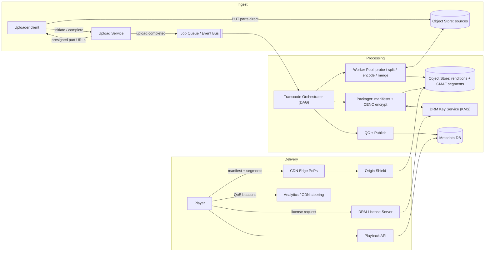
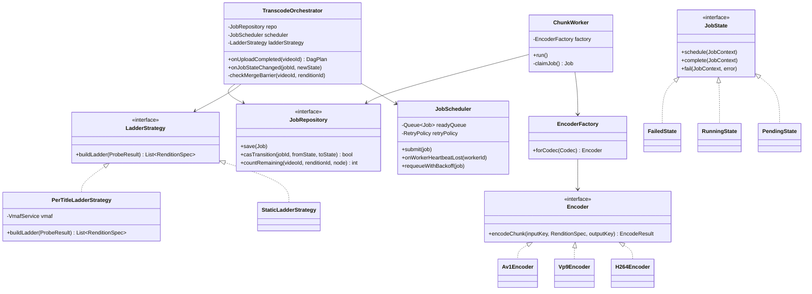

# Video Streaming Pipeline

## 1. Problem Statement & Scope

Design a YouTube/Netflix-style video platform: users upload videos, the system transcodes them into multiple renditions, and viewers stream them with adaptive bitrate on any device, globally, with optional DRM. Cover both VOD and a live-streaming extension.

### Functional Requirements
- Upload videos up to ~10 GB / 4 hours, resumable over flaky connections.
- Transcode into an adaptive bitrate (ABR) ladder across resolutions and codecs.
- Stream with ABR (HLS/DASH) to web, mobile, smart TVs, consoles.
- Playback features: seek, resume position, captions/subtitles, multiple audio tracks.
- DRM-protected content for licensed catalogs (Netflix mode); public content without DRM (YouTube mode).
- Live streaming with DVR (seek back within a window).

### Non-Functional Requirements
- Time-to-publish (upload complete → playable) p95 < 5 min for a 10-min 1080p video.
- Startup time (click → first frame) p95 < 2 s; rebuffer ratio < 0.5% of watch time.
- Durability 11 nines for source masters; renditions are re-derivable (lower durability acceptable).
- Availability 99.95% for playback path (revenue path); upload path can degrade to queued/deferred.
- Global delivery: p95 segment fetch < 300 ms from edge.

### Back-of-Envelope Estimation

**Ingest (YouTube-scale):** 500 hours of video uploaded per minute.
- 500 hr/min = 30,000 hr/hour = 720,000 hr/day.
- Assume source averages 1080p at ~8 Mbps: 8 Mbps × 3600 s = 28.8 Gb/hr = 3.6 GB per source hour.
- Raw ingest storage: 720,000 hr/day × 3.6 GB = ~2.6 PB/day of source material alone.

**Transcoded ladder storage per source hour** (H.264 ladder, rates below in Section 8):
- 2160p @ 16 Mbps → 7.2 GB/hr
- 1440p @ 9 Mbps → 4.05 GB/hr
- 1080p @ 5 Mbps → 2.25 GB/hr
- 720p @ 2.8 Mbps → 1.26 GB/hr
- 480p @ 1.2 Mbps → 0.54 GB/hr
- 360p @ 0.7 Mbps → 0.32 GB/hr
- 240p @ 0.3 Mbps → 0.14 GB/hr
- H.264 ladder total ≈ 15.8 GB/hr. Add a VP9 ladder at ~0.65× bitrate ≈ 10.2 GB/hr. Full dual-codec ladder ≈ 26 GB per source hour (most uploads aren't 4K; realistic blended average ≈ 8–10 GB/hr).
- At 720k hr/day × ~9 GB = ~6.5 PB/day of renditions. Storage tiering and rendition pruning (Section 7) are mandatory, not optional.

**Egress:** 10 M concurrent viewers at an average delivered bitrate of 3 Mbps (ABR mix):
- 10^7 × 3 × 10^6 bps = 3 × 10^13 bps = 30 Tbps aggregate. No origin serves this; CDN offload must be > 99%. Origin sees 30 Tbps × 1% = 300 Gbps worst case — still needs origin shield + multi-region origins.

**Transcode compute:** software x264 encodes ~0.5–1× realtime per core at 1080p "slow" preset. One source hour → ~7 rendition-hours (ladder) → roughly 10–20 core-hours with muxing/overhead. 30,000 source hr/hour × ~15 core-hours = ~450,000 cores busy continuously. This is why chunked parallelism, spot instances, and per-title optimization dominate the cost conversation.

**Scope cuts (state these in the interview):** recommendations, comments, search, monetization/ads insertion (mention SSAI exists), copyright matching (ContentID) — out of scope.

## 2. Brute-Force / Naive Design

One beefy server: nginx serving MP4 files from local disk; upload via single HTTP POST; `ffmpeg` transcodes on the same box; players use progressive download (HTTP range requests into one big MP4).

Why it breaks, with numbers:

1. **Bandwidth wall.** A 10 Gbps NIC serves 10 Gbps / 3 Mbps ≈ 3,300 concurrent viewers. Target is 10 M. You are off by ~3,000×, and every viewer in Sydney pulls across the ocean at 200+ ms RTT, collapsing TCP throughput (throughput ≈ cwnd/RTT).
2. **No adaptation.** Progressive download serves one fixed bitrate. A 5 Mbps 1080p file on a 2 Mbps cellular link means the player buffers 60% of the time; a 4G user who could handle 8 Mbps gets no better quality. There is no mid-stream switching without ABR segmenting.
3. **Wasted egress.** Progressive download buffers far ahead; users abandon videos ~50% through on average. You pay egress for bytes never watched. Segmented streaming with a bounded buffer (~30 s) caps that waste.
4. **Transcode time.** 4K60 AV1/VP9 software encode runs 0.05–0.2× realtime on one machine — a 2-hour 4K upload takes 10–40 hours to encode serially, times 7 ladder rungs. Time-to-publish is measured in days.
5. **Upload fragility.** A single 10 GB POST over residential internet fails partway with high probability; the naive design restarts from byte 0. At 20 Mbps uplink, one attempt takes 67 minutes — three failures means most of an afternoon.
6. **SPOF.** Disk dies → catalog gone; process crash → all viewers drop.

## 3. Evolving the Design

Narrate each bottleneck → fix:

**Bottleneck 1: fragile monolithic upload → resumable chunked upload.**
Client asks the Upload Service to initiate a session; service returns an `upload_id` and issues presigned URLs for fixed-size parts (e.g., 8–16 MB, aligned with S3 multipart's 5 MB minimum). Client PUTs parts directly to object storage in parallel (3–5 concurrent parts saturates most uplinks), retries individual parts on failure, and finally calls `CompleteUpload` with the part list + per-part checksums (S3 validates ETag/MD5, or SHA-256 trailer). Benefits: (a) resume = re-upload only missing parts, tracked server-side via `ListParts`; (b) app servers never proxy video bytes — presigned URLs push traffic straight to the object store; (c) parallel parts cut wall time ~3×. Garbage-collect abandoned multipart sessions after 24–48 h (they bill as storage).

**Bottleneck 2: durability and capacity of local disk → object storage.**
Source masters and all renditions in S3/GCS-class storage: 11 nines durability, effectively infinite capacity, and it doubles as the CDN origin. Path convention: `videos/{video_id}/source`, `videos/{video_id}/{rendition_id}/seg_{n}.m4s`.

**Bottleneck 3: serial transcode → chunk-parallel transcode DAG.**
Split the source into ~10–30 s GOP-aligned chunks (split on keyframes so each chunk is independently decodable). Fan out: chunk × rendition = independent job. A 2-hour video at 15 s chunks = 480 chunks × 7 renditions = 3,360 jobs; with 3,360 available cores, wall time drops from ~40 hours to roughly the time of the slowest single chunk plus merge — minutes. The DAG: `probe/validate → split → [encode(chunk_i, rendition_j)] → merge-per-rendition (barrier) → package (CMAF segment + manifest) → QC (duration/bitrate/black-frame checks) → publish`. Orchestrator tracks the DAG; workers are stateless, pull jobs from a queue, and are perfect for spot/preemptible instances since any chunk job is cheap to retry.

**Bottleneck 4: one bitrate → ABR ladder + segmented streaming.**
Encode the ladder (Section 1 rates), package into 4–6 s CMAF segments, generate HLS and DASH manifests referencing the same segments. Player measures throughput and buffer occupancy per segment and switches rendition at segment boundaries. This is the single biggest QoE lever: startup on a low rung (fast first frame), climb as throughput proves out.

**Bottleneck 5: origin egress → CDN.**
Segments are immutable, cache-forever objects (`Cache-Control: max-age=31536000, immutable`) — ideal CDN payload. Manifests: VOD manifests immutable; live media playlists cached 1–2 s at edge. CDN offload > 99% for popular content; the origin now only serves cache fills.

**Bottleneck 6: cache-miss storms on the origin → origin shield.**
1,000 edge PoPs missing simultaneously on a new viral video = 1,000 concurrent origin fetches per segment. Insert a shield tier: edges fill from a designated mid-tier cache near the origin, which coalesces concurrent requests for the same object into one origin fetch (request collapsing). Origin fill traffic drops by the shield's hit ratio (typically 90%+ of residual misses).

**Bottleneck 7: one CDN's bad day → multi-CDN.**
Steer across 2–3 CDNs via weighted DNS or client-side manifest/URL selection informed by real-user QoE beacons (per-ASN/per-region throughput and error rates). Also gives price leverage. Netflix goes further with Open Connect appliances embedded inside ISPs; note it as the end state, not the starting point.

**Bottleneck 8: one-size-fits-all ladder wastes bits → per-title / per-scene encoding.**
A static ladder gives an animated title (simple, flat regions) the same 5 Mbps 1080p as a confetti-filled sports clip. Per-title (Netflix, 2015): run trial encodes across resolution × bitrate points, compute VMAF, pick the convex hull — the per-title ladder. Animation might get 1080p at 2.5 Mbps at equal quality (50% storage + egress savings); complex sport keeps or raises rates. Per-scene/per-shot: segment on shot boundaries and optimize each shot's rate — another 10–30% on top. Cost: many trial encodes, so gate on predicted popularity — spend encode compute where egress savings repay it. Naturally amortized: encode once, deliver millions of times.

**Bottleneck 9 (extension): live.** Contribution encoder pushes RTMP/SRT to redundant ingest; realtime transcode (GPU/ASIC, one pipeline per rung, no chunk-DAG since input arrives in realtime); LL-HLS/LL-DASH packaging; DVR window via retained segments. Details in Sections 4 and 7.

## 4. Protocol & Technology Choices — Why This, Not That

### Delivery Protocol

| | HLS | MPEG-DASH | Progressive download | WebRTC |
|---|---|---|---|---|
| Transport | HTTP (TCP/QUIC) | HTTP (TCP/QUIC) | HTTP | UDP (SRTP/SCTP) |
| Container | MPEG-TS or fMP4/CMAF | fMP4/CMAF (ISO-BMFF) | MP4 | RTP packets |
| Manifest | m3u8 text playlists | MPD (XML) | none | SDP negotiation |
| Latency (standard) | 6–30 s | 6–30 s | n/a | < 500 ms |
| Low-latency variant | LL-HLS (partial segments, blocking playlist reload, preload hints) ~2–5 s | LL-DASH / CMAF chunked transfer ~2–5 s | n/a | native |
| Apple support | Native (required for iOS/Safari; App Store mandates HLS for cellular video) | Not native in Safari (needs MSE, absent on iPhone Safari) | yes | yes |
| DRM | FairPlay (+ Widevine/PlayReady via CMAF) | Widevine/PlayReady (CENC) | weak (clear or offline) | none standard |
| CDN cacheable | yes | yes | partially (range requests) | no (per-peer sessions) |

**Choice: HLS + DASH over shared CMAF segments.** Apple devices require HLS; DASH is codec/DRM-agnostic and better specified for everything else. **CMAF convergence** is the key insight: since fMP4 became a first-class HLS container (2016), one set of CMAF segments serves both — you store segments once and generate two thin manifest formats, roughly halving packaging storage vs. the old TS-for-HLS + fMP4-for-DASH split. The residual duplication is DRM: FairPlay uses CENC `cbcs` (AES-CBC pattern) while historically Widevine/PlayReady used `cenc` (AES-CTR); modern Widevine/PlayReady support `cbcs`, so new catalogs can converge on single `cbcs`-encrypted segments.
**Why not WebRTC:** no CDN caching (per-viewer stateful sessions ≈ your 30 Tbps problem with no offload), no DRM, complex SFU fanout. **When WebRTC wins:** sub-second interactive use — conferencing, auctions, cloud gaming, real-time betting — where 3 s of HLS latency is disqualifying and audiences are 10^2–10^4, not 10^7.
**Why not progressive:** Section 2.

### Video Codec

| | H.264/AVC | HEVC/H.265 | VP9 | AV1 |
|---|---|---|---|---|
| Bitrate vs H.264 (equal quality) | baseline | ~35–50% less | ~30–40% less | ~40–55% less |
| Encode cost vs H.264 (software) | 1× | ~5–10× | ~5–10× | ~15–30× (much improved with SVT-AV1, still costliest) |
| Decode support | ~100% of devices, ubiquitous hardware decode | Broad on Apple/TVs; patchy on browsers | All modern browsers/Android; no iOS hardware decode until late models; poor Safari history | Modern chips (2020+: Snapdragon 888+, Apple A17+, recent TVs); software decode drains older phones |
| Licensing | MPEG-LA pool, modest, well-understood | Fragmented mess: 3+ patent pools + unaffiliated holders, content-fee ambiguity — the business reason streamers avoided it | Royalty-free (Google) | Royalty-free (AOMedia: Google/Netflix/Amazon/Apple/Meta); patent-troll suits exist but industry proceeds |
| Deployed by | everyone (fallback) | Apple ecosystem, 4K/HDR broadcast | YouTube (default), Netflix | YouTube/Netflix top titles, Meta |

**Choice: tiered codec strategy.** H.264 ladder for universal reach (never skip it); VP9 or AV1 ladders for top-N% popular titles where egress savings exceed encode cost. Arithmetic: AV1 saving ~45% of egress on a title streamed 10 M times at 2 GB/view saves ~9 PB of egress; at ~$0.01–0.02/GB blended CDN cost that's ~$90–180k against a few hundred dollars of extra encode — trivially positive for hits, negative for a video watched 40 times. Popularity-gated codec ladders are the standard answer. **HEVC note:** technically fine, commercially poisoned by fragmented licensing; used mainly where Apple hardware and DRM requirements make it unavoidable (4K HDR on Apple TV).

### Segment Duration

| | 2 s | 6 s | 10 s |
|---|---|---|---|
| Min live latency (~3 segments buffered) | ~6 s | ~18 s | ~30 s |
| ABR switch granularity | every 2 s — fast reaction to throughput drops | every 6 s | sluggish; one bad choice costs 10 s |
| Request overhead (2-hr movie, per rendition) | 3,600 requests | 1,200 | 720 |
| Compression efficiency | worst — a keyframe forced every ≤2 s inflates bitrate ~5–10% | good | best |
| CDN behavior | more requests, smaller objects, more per-request overhead | balanced | fewest requests |

**Choice: 4–6 s for VOD** (industry converged here; Apple's own recommendation moved 10 s → 6 s). **2 s (or LL partial segments of 200–500 ms) for low-latency live.** 10 s only when squeezing compression on non-interactive catalog content.

### Other Components

| Decision | Choice | Rejected alternative | When the alternative wins |
|---|---|---|---|
| Delivery transport | HTTP over TCP/QUIC via commodity CDN | Custom UDP protocol | You're Netflix-scale and own the appliance fleet (Open Connect still uses HTTP; truly custom UDP mainly in game streaming, e.g., Stadia/GeForce Now) |
| Transcode job queue | Kafka for the job log + Redis/SQS-style work queue with visibility timeout | RabbitMQ | Fine at moderate scale; Kafka wins on replay (rebuild orchestrator state) and throughput; a visibility-timeout queue wins on per-message retry/DLQ ergonomics — hybrid is common |
| Orchestration | Purpose-built DAG orchestrator (or Temporal-style durable workflow) | Cron + DB polling | Tiny scale only; you need per-node retry, barriers, priorities, backpressure |
| Object store | S3/GCS + lifecycle tiering | HDFS / self-hosted Ceph | Own-datacenter economics at exabyte scale, or regulatory data residency |
| Metadata DB | Postgres/MySQL (videos, renditions, jobs) + read replicas; Cassandra/DynamoDB for view-position/session data | Single NoSQL for everything | Metadata is relational and low-write; positions are high-write KV — split by access pattern |
| Encoder deployment | Spot/preemptible CPU fleet for VOD; GPU/ASIC (NVENC, VCU) for live | GPU for all VOD | GPU encode is faster but lower quality-per-bit than slow software presets; VOD is latency-tolerant so quality/$ favors CPU spot; YouTube's Argos VCU is the ASIC endgame |

## 5. High-Level Design (HLD)



### Write Path (upload → publish)
1. `POST /v1/videos` → create video row (`status=UPLOADING`), return `video_id` + multipart `upload_id` + first batch of presigned part URLs.
2. Client PUTs parts to object store; `POST /v1/videos/{id}/complete` with part ETags → store assembles object, Upload Service emits `upload.completed`.
3. Orchestrator: probe (validate container/codec/duration; reject or sanitize hostile files — Section 7), decide ladder (static or per-title), split into GOP-aligned chunks, enqueue `chunks × renditions` encode jobs.
4. Workers encode chunks idempotently to deterministic keys; per-rendition merge barrier fires when all chunks for that rendition land; merge concatenates + validates.
5. Packager segments merged renditions into CMAF, requests content keys from KMS, applies CENC encryption, writes HLS master/media playlists + DASH MPD.
6. QC checks (duration match ±1 frame, no black/silent output, bitrate within tolerance) → flip `status=PUBLISHED`, write rendition rows, invalidate/warm manifest at CDN if pre-announced.

### Read Path (click → frames)
1. Player → `GET /v1/videos/{id}/playback`: Playback API returns manifest URL (device-appropriate: HLS for Apple, DASH elsewhere), short-lived signed CDN token (anti-hotlinking), DRM license endpoint, resume position.
2. Player fetches master playlist from CDN → picks starting rendition (low rung, e.g., 480p, for fast start) → fetches media playlist → fetches init segment + first media segments.
3. If encrypted: CDM extracts PSSH from init segment, generates license challenge → license server validates entitlement (user, device security level, concurrency) → returns keys bound to the CDM. Playback starts; ABR loop adjusts rendition per Section 6 pseudocode.

### Data Model

```sql
videos(video_id PK, owner_id, title, duration_ms, source_key, source_codec,
       status ENUM(UPLOADING,PROCESSING,PUBLISHED,FAILED,TAKEN_DOWN),
       ladder_profile, drm_required BOOL, created_at, published_at)

renditions(rendition_id PK, video_id FK, codec ENUM(H264,VP9,AV1,HEVC),
           width, height, bitrate_kbps, framerate, segment_duration_ms,
           storage_prefix, manifest_ready BOOL, byte_size, vmaf_score)

segments(video_id, rendition_id, seg_index, PK(video_id,rendition_id,seg_index),
         object_key, byte_size, duration_ms)
-- often not materialized for VOD: keys are deterministic (seg_{index}) and the
-- manifest is the source of truth; materialize for live/DVR window management.

transcode_jobs(job_id PK, video_id, dag_node ENUM(PROBE,SPLIT,ENCODE,MERGE,PACKAGE,QC),
               rendition_id NULL, chunk_index NULL,
               state ENUM(PENDING,SCHEDULED,RUNNING,SUCCEEDED,FAILED,CANCELLED),
               attempt INT, worker_id, input_key, output_key, updated_at,
               INDEX(video_id, dag_node, state))

content_keys(key_id PK, video_id, drm_system, key_ref_in_kms, rotation_epoch)
playback_positions(user_id, video_id, position_ms, updated_at)  -- Cassandra/DynamoDB, high write rate
```

### API Design
```
POST   /v1/videos                       → {video_id, upload_id, part_urls[], part_size}
GET    /v1/videos/{id}/upload/parts?from=n   → next presigned batch (URLs expire ~1 h)
POST   /v1/videos/{id}/upload/complete  → {status}    # idempotent; body: [{part_no, etag}]
DELETE /v1/videos/{id}/upload           → abort multipart
GET    /v1/videos/{id}/playback         → {manifest_url, cdn_token, drm{license_url, cert}, resume_ms}
POST   /v1/videos/{id}/heartbeat        → position + QoE beacon (rebuffers, bitrate, errors)
```
Notes: `complete` idempotent via `upload_id`; playback API stateless behind LB; heartbeat batched client-side (1/10 s) to keep write volume sane.

### Manifest Examples

HLS master playlist (`master.m3u8`):
```
#EXTM3U
#EXT-X-VERSION:7
#EXT-X-STREAM-INF:BANDWIDTH=5500000,RESOLUTION=1920x1080,CODECS="avc1.640028,mp4a.40.2",FRAME-RATE=30
h264_1080p/media.m3u8
#EXT-X-STREAM-INF:BANDWIDTH=3000000,RESOLUTION=1280x720,CODECS="avc1.64001f,mp4a.40.2"
h264_720p/media.m3u8
#EXT-X-STREAM-INF:BANDWIDTH=1300000,RESOLUTION=854x480,CODECS="avc1.64001e,mp4a.40.2"
h264_480p/media.m3u8
#EXT-X-STREAM-INF:BANDWIDTH=3400000,RESOLUTION=1920x1080,CODECS="vp09.00.40.08,mp4a.40.2"
vp9_1080p/media.m3u8
```

HLS media playlist (`h264_1080p/media.m3u8`, VOD):
```
#EXTM3U
#EXT-X-VERSION:7
#EXT-X-TARGETDURATION:6
#EXT-X-PLAYLIST-TYPE:VOD
#EXT-X-MAP:URI="init.mp4"
#EXTINF:6.000,
seg_0.m4s
#EXTINF:6.000,
seg_1.m4s
#EXTINF:4.250,
seg_2.m4s
#EXT-X-ENDLIST
```
DASH equivalent: one XML MPD with `<AdaptationSet>` per track type, `<Representation>` per rendition, and `<SegmentTemplate media="seg_$Number$.m4s" initialization="init.mp4">` — same underlying CMAF files.

## 6. Low-Level Design (LLD)



**Patterns and why:**
- **Strategy (`LadderStrategy`):** ladder selection varies by content class and popularity tier (static vs per-title vs per-shot); swap without touching orchestration.
- **Factory (`EncoderFactory`):** codec choice is data-driven per rendition spec; factory isolates ffmpeg/SVT-AV1/libvpx invocation details and lets tests inject a fake encoder.
- **State (`JobState`):** job lifecycle has strict legal transitions (PENDING→SCHEDULED→RUNNING→{SUCCEEDED,FAILED→PENDING(retry) or DEAD}); the pattern makes illegal transitions unrepresentable instead of scattered if-chains.
- **Repository (`JobRepository`):** persistence behind an interface; critically exposes `casTransition` (compare-and-swap on state + attempt) — the primitive that makes double-completion by zombie workers harmless.
- **Observer (implicit):** workers emit state-change events; orchestrator subscribes to drive barriers, rather than polling.

**Hardest algorithm: DAG scheduling of chunk encodes with retry + merge barrier.**

```java
class TranscodeOrchestrator {

  // Entry: fan out the DAG after probe+split succeed.
  DagPlan planEncodes(Video v, ProbeResult probe, List<Chunk> chunks) {
    List<RenditionSpec> ladder = ladderStrategy.buildLadder(probe);
    for (RenditionSpec r : ladder)
      for (Chunk c : chunks)
        repo.save(Job.encode(v.id, r.id, c.index,
            /*inputKey*/  c.objectKey,
            /*outputKey*/ key(v.id, r.id, c.index),   // deterministic => idempotent
            State.PENDING, attempt(0)));
    repo.save(Job.mergeBarrier(v.id, ladder));         // one MERGE job per rendition, blocked
    return DagPlan.of(v.id, ladder.size() * chunks.size());
  }

  // Worker pull loop (at-least-once queue; visibility timeout ~ 2x expected encode time).
  void workerLoop(Worker w) {
    Job j = queue.claim(w.id);                         // lease, not dequeue
    if (!repo.casTransition(j.id, State.SCHEDULED, State.RUNNING)) return; // zombie duplicate: drop
    try {
      String tmp = j.outputKey + ".attempt-" + j.attempt;   // never write final key partially
      EncodeResult res = factory.forCodec(j.codec).encodeChunk(j.inputKey, j.spec, tmp);
      verify(res, j);                                  // duration within 1 frame, decodable, size sane
      store.atomicRename(tmp, j.outputKey);            // object-store copy+delete; last-writer-wins is
                                                       // safe because output is deterministic
      if (repo.casTransition(j.id, State.RUNNING, State.SUCCEEDED))
        events.emit(new JobSucceeded(j));              // CAS lost => another attempt finished first: fine
    } catch (PoisonInputException p) {
      repo.casTransition(j.id, State.RUNNING, State.DEAD);
      events.emit(new VideoFailed(j.videoId, p));      // no retry: input itself is bad
    } catch (Exception e) {
      handleFailure(j, e);
    }
  }

  void handleFailure(Job j, Exception e) {
    if (j.attempt + 1 >= MAX_ATTEMPTS) {               // e.g., 3
      repo.casTransition(j.id, State.RUNNING, State.DEAD);
      events.emit(new VideoFailed(j.videoId, e));      // one dead chunk fails the rendition
    } else {
      repo.bumpAttempt(j.id);                          // RUNNING -> PENDING, attempt++
      queue.enqueueAfter(backoff(j.attempt), j);       // exp backoff + jitter: 30s, 2m, 8m
    }
  }

  // Merge barrier: fires exactly once per rendition when its last chunk lands.
  @Subscribe void onJobSucceeded(JobSucceeded ev) {
    if (ev.node != ENCODE) return;
    // Atomic decrement of remaining-count avoids a racy COUNT(*) scan:
    long remaining = repo.decrementRemaining(ev.videoId, ev.renditionId);
    if (remaining == 0 &&
        repo.casTransition(mergeJobId(ev.videoId, ev.renditionId),
                           State.BLOCKED, State.PENDING)) {
      queue.enqueue(repo.get(mergeJobId(ev.videoId, ev.renditionId)));
    } // CAS guarantees single fire even if two final chunks complete concurrently
  }

  // Liveness: lease expiry, not heartbeat push — queue visibility timeout requeues
  // jobs whose worker died; casTransition + deterministic outputs make the
  // duplicate execution harmless (idempotency, not exactly-once, is the invariant).
}
```

Client-side ABR (mention in one breath): estimate throughput as an EWMA of recent segment download rates, pick the highest rendition whose bitrate < ~0.8 × estimate, overridden by buffer occupancy (buffer < 10 s → step down aggressively; > 25 s → probe up one rung). Buffer-based (BBA) and hybrid (MPC) algorithms exist; the interviewer wants you to know switching is client-driven at segment boundaries.

## 7. Deep Dives & Failure Modes

**Worker death mid-chunk.** Covered by design: queue lease expires → job requeued; new attempt writes to attempt-scoped temp key, then atomically renames to the deterministic final key; CAS on job state discards the zombie's late completion. Invariant to state out loud: *chunk outputs are deterministic and idempotent, so at-least-once execution is safe and exactly-once is unnecessary.*

**Poison inputs.** Malformed/hostile files (zip-bomb-like containers, 1-frame "10-hour" durations, ffmpeg CVE payloads). Defenses: probe in a sandboxed, seccomp-restricted, no-network container with hard CPU/memory/wall-clock limits; validate probe claims against actual file size; classify deterministic encoder crashes as `PoisonInputException` (no retry, DLQ + human review) vs transient errors (retry). Never let one poison file consume MAX_ATTEMPTS × ladder × chunk worth of compute — fail the whole DAG on first poison signal.

**Thundering herd on a viral video.** 5 M players request the same new segment across all PoPs. Layers: (1) edge caches absorb repeats within a PoP; (2) request coalescing at edge and shield — concurrent misses for one key collapse to a single upstream fetch; (3) origin shield tier so the origin sees ~#shields, not #PoPs, concurrent fetches; (4) `stale-while-revalidate` on live playlists so an expiring manifest never causes a synchronized refetch wall; (5) for predictable events (episode drop), pre-warm edges. Numbers: 1,000 PoPs × 7 renditions without collapsing = 7,000 origin fetches per 4 s tick; with shield + coalescing ≈ 7–30.

**Origin overload / protection.** Origin is the object store + a thin manifest service. Signed URLs with short TTL prevent hotlink bypass of the CDN; rate-limit by CDN provider identity; if the shield tier itself is unhealthy, serve stale from edge (`stale-if-error`) — a slightly stale live playlist beats a 502.

**Manifest/segment consistency.** Never reference a segment before it is durably written: publish order is segments → init → media playlists → master → flip DB status. Segments immutable with content-addressed or versioned paths; on re-encode, write new paths and a new manifest — never mutate in place under CDN cache. Live: playlist advertises segment N only after N's upload is confirmed; players tolerate 404 on N+1 speculation but a playlist pointing at a missing segment stalls playback.

**Live encoder failover.** Redundant contribution: broadcaster pushes to two ingest points (primary/backup RTMP/SRT), two independent transcode pipelines produce timestamp-aligned segments (aligned via shared UTC-based segment numbering: `seg_index = floor(epoch_time / seg_duration)`), packager health-checks primary and switches to backup mid-stream; aligned numbering makes the switch seamless to players. State the trade-off: 2× live encode cost for zero-blackout failover — obviously right for a Super Bowl, skippable for a hobby stream.

**DRM license server outage.** License grant is on the playback critical path. Mitigations: licenses with persistence enabled + long-ish duration (e.g., 24–48 h for downloads, minutes-to-hours for streaming) so active viewers keep playing through an outage; multi-region active-active license servers (stateless validators over replicated entitlements); circuit-breaker fallback for low-value content (serve clear or degrade to SD-only where policy allows — studio contracts often forbid; say so). Key rotation for live means outage impact hits within one rotation epoch — size epochs accordingly.

**Storage cost runaway.** From Section 1, renditions accrue ~PB/day. Levers: (1) lifecycle tiering — segments not fetched in 90 days → infrequent-access, 1 year → cold/archive (renditions are re-derivable from the master, so archival even matters less than for sources); (2) rendition pruning — long-tail videos with < N views/month keep only 360p/720p H.264; re-encode the full ladder on demand if popularity resurges (minutes of delay, acceptable); (3) never store dual TS+fMP4 — CMAF (Section 4); (4) source masters to deep archive after transcode, since re-transcode reads are rare; (5) per-title encoding shrinks every stored byte ~20% on average. Watch access patterns: YouTube-shape traffic is extreme power-law — a large fraction of storage serves near-zero traffic.

**Backpressure on upload spikes.** Encode demand is bursty (creator events, breaking news). Uploads are already decoupled — the object store absorbs bytes regardless of encoder health, so upload never fails due to transcode saturation. Then: priority queues (creator tier, predicted popularity, shorts-vs-longform) so the p95 time-to-publish SLO is protected for content that matters; autoscale spot fleet on queue depth; under extreme backlog, publish fast with a single quick 480p H.264 rendition (one pass, fast preset) and backfill the full ladder — "playable in 1 minute, beautiful in 30."

## 8. Trade-off Summary & Interview Soundbites

| Decision | Trade-off accepted |
|---|---|
| HLS + DASH over shared CMAF | Two manifest formats to generate/test, in exchange for single segment storage and full device reach |
| Segmented ABR over progressive | 6–30 s glass-to-glass latency and manifest complexity, for CDN cacheability + adaptation + bounded egress waste |
| 4–6 s segments | Give up sub-5 s live latency (need LL-HLS for that) for compression efficiency and request-count sanity |
| Chunked parallel transcode | Merge/barrier complexity and slight quality loss at chunk boundaries, for 100× lower time-to-publish |
| At-least-once jobs + idempotent outputs | Occasional duplicate encode work, avoiding the cost/impossibility of distributed exactly-once |
| Popularity-gated AV1/VP9 ladders | Multi-codec pipeline complexity, for 30–50% egress savings exactly where egress dominates |
| Per-title encoding | Trial-encode compute (only repaid on popular titles), for ~20% storage/egress savings and better QoE |
| Multi-CDN + origin shield | Steering complexity and shield egress cost, for availability and origin fill reduction |
| Fast-publish single rendition + backfill | Briefly worse quality at publish, protecting time-to-publish SLO under encode backlog |
| Rendition pruning + cold tiering | Minutes of re-encode latency on long-tail resurgence, for order-of-magnitude storage savings |

**Soundbites:**
1. "Video streaming is a caching problem wearing a codec costume — every design choice should maximize what a CDN can cache: immutable segments, deterministic URLs, manifests as the only mutable object."
2. "Chunk outputs are deterministic, so I only need at-least-once execution and idempotent writes — exactly-once is a requirement I engineered away, not solved."
3. "Encode once, deliver a million times: any CPU spent per-title on encoding that saves egress on a popular title pays back thousands-fold — which is precisely why it's gated on popularity."
4. "H.264 is the reach codec, AV1 is the cost codec; the ladder you ship is a function of the device population times the popularity curve."
5. "CMAF ended the era of storing everything twice — one fMP4 segment set, two ten-line manifests."
6. "Segment duration is the latency/efficiency dial: 2 s when latency matters, 6 s when bits do."
7. "Upload health must never depend on encoder health — the object store is the shock absorber between them."
8. "DRM's hard part isn't the crypto, it's that license grant sits on the startup critical path — so make licenses persistent and license servers boring and replicated."

**Common follow-ups, short answers:**
- *How does the player pick a bitrate?* Throughput EWMA + buffer occupancy hybrid; choose max rendition under ~0.8× estimated throughput, step down hard when buffer < ~10 s; switches happen at segment boundaries.
- *How do you get to sub-5 s live latency?* LL-HLS/LL-DASH: sub-segment CMAF chunks (200 ms–1 s parts) delivered via chunked transfer/blocking playlist requests; sub-second requires WebRTC and forfeits CDN economics.
- *Why not encode on upload servers?* Coupling: upload is user-facing and latency-sensitive; encode is throughput-batch. Different scaling curves, different hardware, different failure domains.
- *How is seek implemented?* Player maps seek time to segment index via the manifest's cumulative durations, fetches that segment; keyframe-aligned segment starts make every segment a valid decode entry point.
- *Widevine vs FairPlay vs PlayReady — why all three?* CDMs are baked into platforms: Widevine (Android/Chrome), FairPlay (Apple), PlayReady (Windows/Xbox/some TVs). CENC lets one encrypted segment set carry PSSH boxes for all three; only the license exchange differs.
- *What breaks first at 10× scale?* Origin fill and metadata hot rows for viral titles — answer is deeper shield/coalescing and caching playback-API responses; the segment path itself scales linearly with CDN spend.
- *Exactly how big is the DVR window cost?* Retained live segments: 4-hour window × 7 renditions × ~4 GB/hr blended ≈ 112 GB per channel — trivial; the real cost is playlist size and edge cache churn, so cap window and use byte-range DVR where supported.
- *How would you A/B test a new ABR algorithm?* Server-assigned experiment flag in the playback API response; compare rebuffer ratio, average VMAF-weighted bitrate, and abandonment — never ship on throughput alone.
