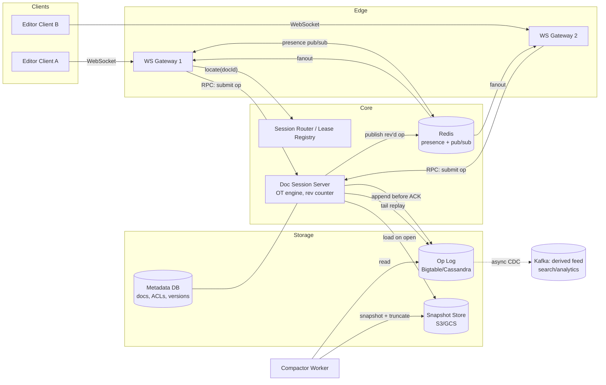
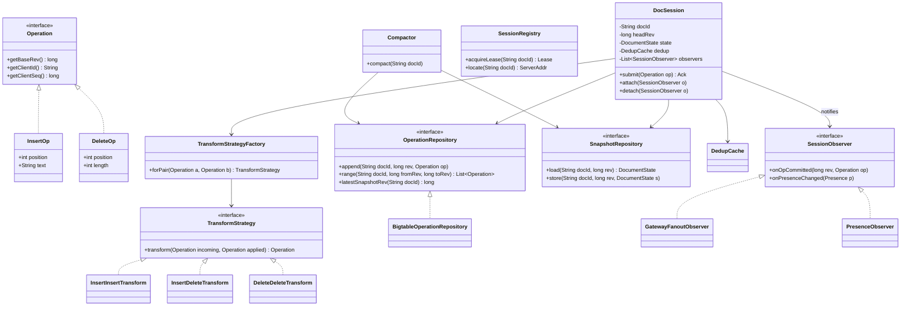

# Collaborative Editing Backend (Google Docs)

## 1. Problem Statement & Scope

Design the backend for a real-time collaborative text editor: multiple users edit the same document concurrently, every user converges to the same final state, and edits appear on peers' screens in well under a second.

### Functional requirements

- Concurrent editing of a single document by up to ~100 simultaneous editors (Google Docs caps active editors at 100; viewers can be far more).
- Character-level edits (insert, delete, format) propagated in real time.
- Guaranteed convergence: all replicas reach identical document state.
- Intention preservation: if I type "cat" at position 5, "cat" appears where I meant it, even if concurrent edits shifted offsets.
- Presence: live cursors, selections, and "who is here" per document.
- Document history: point-in-time restore, named versions, per-op attribution.
- Offline editing: buffer edits locally, reconcile on reconnect.
- Access control (owner/editor/commenter/viewer) — in scope for API shape, not deep-dived.

### Non-functional requirements

- Edit propagation latency p99 < 500 ms same-region; local echo must be instant (0 ms — apply optimistically).
- Durability: an acknowledged op is never lost (no "my paragraph vanished").
- Availability 99.95% for editing; degraded read-only mode acceptable during partial outages.
- Consistency model: eventual convergence across replicas with causality preserved; the server's op log is the total order of record.
- Scale: hundreds of millions of documents, tens of millions of DAU.

### Back-of-envelope estimation

Assume 50 M DAU, 10% concurrently active at peak = 5 M concurrent editors.

**Write QPS (ops):**
- Active typist: ~200 chars/min ≈ 3.3 keystrokes/s, but clients batch keystrokes into ops every ~250 ms → ~2 ops/s per active typer.
- Of 5 M connected, assume 20% actively typing at any instant = 1 M typers.
- Op ingest: 1 M × 2 ops/s = **2 M ops/s peak** globally. Sharded per-document, each doc session sees single-digit ops/s (5 editors × 2 = ~10 ops/s/doc — trivially serializable per doc).

**Fanout bandwidth:**
- Each op ≈ 200 bytes on the wire (JSON: type, position, text, version, ids).
- Avg 3 recipients per op (co-editors) → 2 M × 3 × 200 B = **1.2 GB/s egress** for edit traffic.
- Presence/cursor updates: throttled to 10/s per user, ~50 bytes → 5 M × 10 × 50 B × 3 recipients ≈ 7.5 GB/s. Presence dominates; hence a separate, lossy, non-durable channel.

**Storage:**
- 500 M documents, avg 50 KB text + 5x overhead for op history between compactions ≈ 300 KB/doc → 500 M × 300 KB = **150 TB** for hot doc state.
- Op log: 2 M ops/s × 200 B = 400 MB/s ≈ 34 TB/day raw. Compaction (snapshot + truncate) keeps only the tail; long-term history stored as periodic snapshots + compressed op deltas ≈ 10:1 → ~3.4 TB/day retained.

**Connections:**
- 5 M concurrent WebSockets. At ~50 K connections per gateway node (conservative with TLS + heartbeats) → **~100 gateway nodes**, plus headroom.

Key insight to state early: the hard problem is **not** throughput — per-document write rates are tiny. The hard problem is **correct concurrent merge semantics** (OT/CRDT) plus **session routing** (all ops for a doc must meet at one serialization point).

## 2. Brute-Force / Naive Design

**Design:** One server, one SQL table `documents(id, content TEXT, updated_at)`. Client loads the document over HTTP, edits locally, and does `PUT /documents/{id}` with the full body every 5 seconds or on blur. Last write wins.

Why it breaks:

1. **Lost updates (correctness, not scale).** Alice and Bob both load version V. Alice saves V+her edits; 2 s later Bob saves V+his edits. Alice's edits are silently destroyed. With 5 co-editors typing, effectively 4/5 of all work is lost. This fails with just *two* users — it is not a scale problem, it is a semantics problem.
2. **Bandwidth blowup.** A 50 KB doc saved every 5 s per editor = 10 KB/s per editor of upload for what is really ~10 bytes/s of actual change — 1000x amplification. At 5 M editors that is 50 GB/s ingest vs the 400 MB/s of true delta traffic.
3. **No real-time feedback.** Peers see changes only on next poll/reload — 5–30 s latency vs the 500 ms requirement. Polling every 500 ms for freshness → 5 M × 2 QPS = 10 M read QPS of mostly-unchanged 50 KB payloads = 500 GB/s egress. Absurd.
4. **Diff-based patching doesn't save you.** "Send diffs and 3-way merge server-side" (the wiki/Git model) fails interactively: text merge conflicts require human resolution, which is unacceptable mid-keystroke. Character-level concurrent merge must be *automatic and deterministic* — which is exactly what OT/CRDT provide and diff3 does not.
5. **Single server.** One box handling all docs: 5 M sockets and 150 TB of state don't fit; any restart drops every session with unsaved buffers lost.

The naive design fails on correctness at N=2 users and on cost at N=large. Both must be fixed.

## 3. Evolving the Design

**Step 1 — Send operations, not documents.** Replace full-body PUT with granular ops: `insert(pos, "a")`, `delete(pos, len)`. Fixes the 1000x bandwidth amplification and gives us the vocabulary for merging. New problem: two concurrent ops reference positions in *different* versions of the doc — Bob's `insert(10, "x")` is wrong if Alice already inserted 3 chars at position 2.

**Step 2 — Central serialization + Operational Transformation.** Route all ops for a document through one authority that assigns each op a sequence number (revision). When the server receives an op based on revision R but the log is at R+k, it *transforms* the incoming op against the k intervening ops so its positions are correct in the current state, appends it, and broadcasts. Clients symmetrically transform inbound server ops against their own unacknowledged local ops. This is the Jupiter/Google Wave model and what Docs uses. Fixes lost updates and preserves intention. New problem: "one authority per doc" — who is it, and how do we scale it?

**Step 3 — Document sessions and sharding.** Introduce a **DocSession**: an in-memory actor owning one document's op log tail, current revision, and connected-client list. Consistent-hash `docId → session server`. Per-doc traffic is ~10 ops/s, so one server hosts ~50 K sessions. All ops for a doc funnel to its session; serialization is now just an in-process queue — no distributed locking. New problem: clients connect to arbitrary edge nodes, not necessarily the session owner.

**Step 4 — Split connection gateways from session servers.** Stateless(ish) WebSocket **gateways** terminate TLS and hold sockets; they route messages to the owning session server over internal RPC and subscribe to that session's broadcast channel (Redis pub/sub or direct gRPC stream). Gateways scale with connection count; session servers scale with active-document count. Independent scaling axes.

**Step 5 — Durability: op log + snapshots.** Session server appends each accepted op to a persistent log (write-ahead) *before* ACKing the client. Replaying 500 K ops to open a doc is too slow (~seconds), so periodically write a **snapshot** at revision R and truncate/archive the log prefix. Doc load = latest snapshot + tail ops. Compaction bounds both open latency and storage.

**Step 6 — Presence as a separate lossy channel.** Cursor positions change 10x more often than text and need zero durability — only the latest value matters. Give presence its own pub/sub path: no log writes, aggressive coalescing (last-write-wins per user, flushed at 10 Hz), auto-expiring keys. This keeps 7.5 GB/s of ephemeral traffic out of the durable write path.

**Step 7 — Offline and flaky clients.** Client keeps a local buffer of unACKed ops and its last known server revision. On reconnect: fetch ops since that revision, transform the local buffer over them (client-side OT, same transform function), replay. Idempotency via `(clientId, clientSeq)` dedup on the server so retried ops apply once.

**Step 8 — Failover.** Session servers are cattle: on crash, another node loads snapshot + log tail (all durable) and resumes; clients reconnect and resync via revision numbers. Ownership handoff guarded by fenced leases (see §7 split-brain).

Each step answers a bottleneck: semantics → OT; scale-out → sessions + sharding; fan-in/fan-out mismatch → gateway split; durability vs latency → log + snapshot; noisy ephemeral data → separate channel; unreliability → idempotent resync.

## 4. Protocol & Technology Choices — Why This, Not That

### OT vs CRDT (the headline decision)

| Dimension | OT (chosen) | CRDT (RGA / Yjs / Automerge) |
|---|---|---|
| Requires central server | Yes — server provides total order | No — merges commutatively peer-to-peer |
| Metadata per character | None in doc state; positions are plain integers | Unique ID per char (siteId, counter) — persistent |
| Deletes | Actually remove content | Tombstones: deleted chars retained as markers |
| Memory for long-lived doc | O(current doc size) | O(all chars ever typed) unless GC'd; Automerge docs historically 10–100x raw text (Yjs mitigates well with run-length encoded IDs) |
| Transform/merge complexity | Transform functions are notoriously tricky (many published OT papers had bugs, e.g. dOPT); but simple if server-serialized (only transform against a linear history) | Merge is mathematically clean (join-semilattice); correctness easier to prove |
| Undo, rich-text attributes | Mature (Docs does full rich text + suggestions) | Harder; rich-text CRDTs (Peritext) are recent |
| Centralized history/permissions | Natural — server log is canonical | Must be layered on separately |
| Offline / P2P / E2E-encrypted | Needs server mediation | Native strength |

**Why Google Docs uses OT:** Docs was always server-centric — Google already needs the server for auth, storage, history, and search, so "requires a central server" costs nothing. Server-serialized OT is drastically simpler than general OT (you only transform client ops against a totally ordered log, never op-vs-op in arbitrary DAGs), document state carries zero per-character metadata, and history/attribution falls out of the log for free.

**Why Figma is CRDT-ish:** Figma's document is a tree of objects with properties, not a character sequence. Their model is per-property last-writer-wins registers plus fractional indexing for child order — CRDT ideas without full sequence-CRDT machinery. LWW on `object.x = 42` is fine (no intention-preservation problem for a number), and it makes the server merge code trivial and client reconnection stateless. Text-style OT would be overkill for property updates.

**When CRDT wins for text:** offline-first apps, P2P/local-first (no server you control), end-to-end encryption (server can't transform what it can't read), and multi-master geo-replication without a per-doc home. Yjs in particular has made the memory cost acceptable for most real docs.

### Realtime transport

| Option | Verdict | Reasoning |
|---|---|---|
| WebSocket (chosen) | Chosen | Bidirectional, low per-message overhead (~4 B framing), one connection for ops + presence + acks. Edit traffic is inherently two-way. |
| SSE + HTTP POST for writes | Rejected | Server→client only; every op becomes a separate POST (TLS+HTTP overhead per keystroke batch, ordering across POSTs needs care). Would win for view-only followers or read-heavy dashboards behind plain HTTP infra. |
| Long-polling | Rejected | 1 request per message, high latency jitter, connection churn. Only as a fallback for hostile proxies (keep it as a degraded transport). |
| WebRTC data channels (P2P) | Rejected | No server serialization point (breaks our OT model), NAT traversal complexity, and we need the server in-path for durability anyway. Would win for a serverless CRDT design or for bulky ephemeral streams (e.g., voice). |

### Op log + snapshot storage

| Option | Verdict | Reasoning |
|---|---|---|
| Log-structured NoSQL (e.g., Bigtable/Cassandra/DynamoDB), row per op keyed `(docId, revision)` (chosen) | Chosen | Append-heavy, key-range scans for tail replay, horizontal scale, per-doc ordering by key. |
| Relational (Postgres/Spanner) | Viable, rejected at this scale | Correct and simple; 2 M ops/s of tiny appends needs heavy sharding. Would win at smaller scale or if you want transactions across doc metadata + ops (Spanner is a legitimate pick if you're Google). |
| Kafka as the op log of record | Rejected | Kafka is a shared pipe, not a per-entity random-access log: can't cheaply read "ops for doc X since rev R" among millions of docs, retention/compaction is topic-global. Would win as a *derived* feed for analytics/search indexing. |
| Object storage (S3/GCS) for snapshots (chosen for snapshots) | Chosen | Snapshots are immutable blobs read on doc-open; cheap, durable, versioned. Serve via CDN for view-only load. |

### Fanout within a doc session

| Option | Verdict | Reasoning |
|---|---|---|
| Redis pub/sub, channel per docId (chosen) | Chosen | Sub-ms fanout, cheap channel churn (millions of mostly-idle docs), fire-and-forget fits presence; durability is already handled by the op log, so at-most-once delivery here is fine — clients heal gaps via revision-based resync. |
| Kafka | Rejected for fanout | Millions of fine-grained topics/partitions is an anti-pattern; consumer group rebalancing on every doc open/close; ~10s of ms latency. Would win for durable downstream consumers (indexing, ML, audit) — run it *in addition*, fed asynchronously from the op log. |
| Direct gRPC streams session→gateway | Strong alternative | Fewer moving parts, no Redis hop; chosen-adjacent (many real systems do this). Redis wins when gateway↔session topology is very dynamic; gRPC wins on latency and one-less-dependency. Either is defensible in the interview. |

### Presence storage

| Option | Verdict | Reasoning |
|---|---|---|
| Redis with TTL keys + pub/sub (chosen) | Chosen | Presence is ephemeral by definition; TTL gives free liveness (no heartbeat = gone in 30 s); no durable writes. |
| In-memory on session server only | Viable | Simplest; lost on failover but presence rebuilds in seconds from client heartbeats — honestly fine. Rejected only to keep gateways able to serve presence without session-server hops. |
| Database-backed presence | Rejected | Durable storage for data with a 30-second useful life is pure waste at 50 M writes/s aggregate. |

## 5. High-Level Design (HLD)



### Write path (one keystroke batch)

1. Client applies op locally (optimistic, 0 ms echo), assigns `(clientId, clientSeq)`, tags it with `baseRev` = last server revision seen, sends over WS. Client sends at most one op in flight; further edits compose into a pending buffer (Docs does exactly this — reduces transform load and simplifies client OT to a 2-slot state machine).
2. Gateway looks up (cached) session owner for docId via Session Router; forwards op.
3. Session server: dedup check on `(clientId, clientSeq)`; transform op against log entries `(baseRev, currentRev]`; assign `rev = currentRev + 1`; append to op log (durable write) — only then ACK.
4. Session publishes `{rev, op'}` to the doc channel; gateways push to all subscribed clients. Sender receives ACK `{rev}`; others receive the transformed op and transform it against their own pending buffer before applying.

### Read path (document open)

1. `GET /v1/docs/{id}` → metadata + snapshot pointer `(snapshotRev, url)`.
2. Client fetches snapshot blob (CDN-able), then opens WS: `hello{docId, haveRev: snapshotRev}`.
3. Session server (spawning the session if cold: load snapshot + replay log tail) streams ops `(haveRev, currentRev]`, then live ops. Client is now converged.

### Data model

```
documents(doc_id PK, owner_id, title, acl_id, head_rev, snapshot_rev,
          snapshot_url, created_at, updated_at)

op_log: key = (doc_id, rev)   -- range-scannable per doc
        value = {op_type, payload, client_id, client_seq, user_id, ts}

snapshots: object key = doc_id/rev  -> serialized doc state (immutable)

named_versions(doc_id, version_id, rev, label, created_by, ts)

presence (Redis): key = presence:{doc_id}:{user_id}, TTL 30s
        value = {cursor_pos, selection: [start,end], color, device}
```

### API

REST (control plane):

```
GET    /v1/docs/{id}                 -> metadata + snapshot pointer
POST   /v1/docs                      -> create
GET    /v1/docs/{id}/ops?from=R&to=S -> op range (resync / history scrub)
POST   /v1/docs/{id}/versions        -> create named version at head_rev
GET    /v1/docs/{id}/versions/{v}    -> materialized historical state
PUT    /v1/docs/{id}/acl             -> permissions
```

WebSocket messages (data plane), all JSON with `type` discriminator:

```
// client -> server
{ "type": "hello",  "docId": "d1", "haveRev": 4182, "resumeToken": "..." }
{ "type": "op",     "docId": "d1", "baseRev": 4190,
  "clientId": "c-9f2", "clientSeq": 57,
  "ops": [ {"kind":"retain","n":120},
           {"kind":"insert","text":"hello"},
           {"kind":"retain","n":33},
           {"kind":"delete","n":4} ] }        // OT op = run-length op list
{ "type": "presence", "docId": "d1", "cursor": 125, "sel": [125,130] }

// server -> client
{ "type": "ack",    "clientSeq": 57, "rev": 4191 }
{ "type": "op",     "rev": 4192, "userId": "u7", "ops": [ ... ] }
{ "type": "presence", "userId": "u7", "cursor": 88, "sel": null }
{ "type": "resync", "fromRev": 4180, "ops": [ ... ] }   // gap fill after reconnect
{ "type": "error",  "code": "STALE_BASE_REV", "headRev": 4210 }
```

## 6. Low-Level Design (LLD)



**Patterns and why:**
- **Strategy** (`TransformStrategy` per op-type pair): the transform logic is a matrix over (incoming type × applied type); strategies isolate each cell so each case is independently unit-testable — critical because transform bugs are the classic OT failure mode. Adding a new op type (e.g., `FormatOp`) adds strategies without touching the engine.
- **Factory** (`TransformStrategyFactory`): dispatch on the op-type pair; single registration point, keeps `DocSession` free of `instanceof` chains.
- **Repository** (`OperationRepository`, `SnapshotRepository`): storage behind interfaces — Bigtable in prod, in-memory in tests; the OT engine is storage-agnostic.
- **Observer** (`SessionObserver`): the session emits committed ops; gateway fanout, presence, metrics, and the CDC feed subscribe independently. Decouples the serialization hot path from delivery concerns.
- (Implicit **Actor/single-writer** on `DocSession`: all mutations on one queue → per-doc serialization without locks.)

### The transform function — the heart of the design

Contract (TP1): given concurrent ops `a`, `b` on the same base state, `apply(apply(S,a), transform(b,a)) == apply(apply(S,b), transform(a,b))`. With central serialization we only ever transform an incoming op over an already-committed one, so TP2 (transform-order independence) is not required — say this in the interview, it is *why* server-based OT is tractable.

```java
// transform(incoming, applied): rewrite `incoming` (based on rev R)
// so it applies correctly AFTER `applied` (committed at rev R+1).

// ---- Case 1: insert vs insert ----
InsertOp transformII(InsertOp incoming, InsertOp applied) {
    if (applied.position < incoming.position
            || (applied.position == incoming.position
                && applied.clientId.compareTo(incoming.clientId) < 0)) {
        // applied insert is at/left of ours -> our target shifted right
        return new InsertOp(incoming.position + applied.text.length(),
                            incoming.text, incoming.meta);
    }
    return incoming;  // applied is strictly to our right: unaffected
}

// ---- Case 2: insert vs delete (incoming insert, applied delete) ----
InsertOp transformID(InsertOp incoming, DeleteOp applied) {
    if (incoming.position <= applied.position) {
        return incoming;                       // delete was to our right
    }
    if (incoming.position >= applied.position + applied.length) {
        return new InsertOp(incoming.position - applied.length,
                            incoming.text, incoming.meta);  // shift left
    }
    // insert point was INSIDE the deleted range: collapse to range start
    return new InsertOp(applied.position, incoming.text, incoming.meta);
}

// ---- Case 3: delete vs insert (incoming delete, applied insert) ----
DeleteOp transformDI(DeleteOp incoming, InsertOp applied) {
    if (applied.position <= incoming.position) {
        return new DeleteOp(incoming.position + applied.text.length(),
                            incoming.length);              // shift right
    }
    if (applied.position >= incoming.position + incoming.length) {
        return incoming;                                    // unaffected
    }
    // insert landed inside our delete range: split into two deletes
    int leftLen = applied.position - incoming.position;
    return new CompositeDelete(
        new DeleteOp(incoming.position, leftLen),
        new DeleteOp(incoming.position + applied.text.length() + leftLen,
                     incoming.length - leftLen));
    // (Alternative policy: also delete the inserted text. Preserving the
    //  concurrent insert is the standard intention-preserving choice.)
}
```

**Worked insert/insert example.** Base doc (rev 10): `"ABCDEF"`.
- Alice (clientId `"a"`) sends `insert(2, "XY")` → intends `"ABXYCDEF"`.
- Bob (clientId `"b"`) concurrently sends `insert(4, "Z")` → intends `"ABCDZEF"`. Both have `baseRev = 10`.

Server receives Alice first: applies as-is → rev 11, doc = `"ABXYCDEF"`.
Server receives Bob (`baseRev=10`, but head is 11): transform Bob's op over Alice's.
- `applied.position (2) < incoming.position (4)` → shift right by `len("XY") = 2` → `insert(6, "Z")`.
- Apply at rev 12: `"ABXYCD" + "Z" + "EF"` = `"ABXYCDZEF"`. Bob's `Z` still lands after the original `D` — intention preserved.

Meanwhile Alice's client receives Bob's committed op and must transform it over nothing (her op was already ACKed) → applies `insert(6,"Z")` → `"ABXYCDZEF"`. Bob's client receives Alice's op and transforms his *pending* op the same way before reconciling with his ACK. All replicas: `"ABXYCDZEF"`. Convergent.

**Tie-break:** if both insert at the *same* position (say both at 2), position comparison is equal; we break the tie deterministically by `clientId` ordering (lower clientId's text ends up left). Any deterministic total tiebreak works — it just must be the *same* on server and every client, or replicas diverge (see §7).

### DocSession.submit pseudocode

```java
synchronized Ack submit(Operation op) {                  // actor mailbox
    Long prev = dedup.get(op.clientId, op.clientSeq);
    if (prev != null) return new Ack(prev);              // idempotent replay
    if (op.baseRev < headRev - MAX_TRANSFORM_WINDOW)
        throw new StaleBaseRev(headRev);                 // client must resync

    Operation t = op;
    for (Operation committed : opRepo.range(docId, op.baseRev + 1, headRev))
        t = factory.forPair(t, committed).transform(t, committed);

    long rev = headRev + 1;
    opRepo.append(docId, rev, t);                        // durable BEFORE ack
    state.apply(t);
    headRev = rev;
    dedup.put(op.clientId, op.clientSeq, rev);
    for (SessionObserver o : observers) o.onOpCommitted(rev, t);
    return new Ack(rev);
}
```

### CRDT alternative in brief (know it cold)

RGA/Yjs model: every character gets an identity `(siteId, counter)`; insert says "place me after character with ID X"; delete marks the target ID as a **tombstone** (kept so concurrent "insert after it" ops still resolve). Concurrent inserts after the same ID are ordered by ID comparison — the analogue of our clientId tiebreak. Cost: a 10 KB doc that endured 1 M edits carries up to 1 M IDs + tombstones; naive encoding is tens of MB. Yjs run-length-encodes consecutive IDs from one client (typing is sequential) getting within ~2x of raw text; Automerge v2 columnar encoding similarly. Tombstone GC is only safe when all replicas have seen the delete — which needs... coordination, i.e., the thing CRDTs were avoiding.

## 7. Deep Dives & Failure Modes

**Same-position concurrent inserts / tie-breaking.** Without a tiebreak, `transformII(a,b)` and `transformII(b,a)` could both leave positions unchanged → server applies "a then b" while some client applies "b then a" → interleaved garbage like `"heworldllo"`. The `clientId` comparison guarantees both orders produce identical results (TP1 holds at the boundary case). Test this exhaustively with randomized convergence tests (generate N concurrent ops, apply in all orders, assert equality) — this is the single highest-value test suite in the system. Subtle variant: a client inserting twice at the same spot must keep its own inserts in sequence order; tie-breaking must therefore compare `(clientId, clientSeq)`, never reorder same-client ops.

**Idempotency / duplicate delivery.** WS drops after the server committed but before the ACK arrived → client retries the same op. Dedup table `(clientId, clientSeq) → rev` (bounded LRU per session + persisted alongside the op in the log so failover preserves it). On duplicate: return the original ACK, do not re-append. Client seq numbers are strictly increasing per clientId; the server can keep only the max seq per client plus its rev.

**Retries and one-op-in-flight.** Client protocol: at most one unACKed op; while waiting, new keystrokes **compose** into a single pending op (retain/insert/delete lists compose cheaply). On timeout, retry the same `(clientId, clientSeq)`. This bounds server transform work (transform window is small), simplifies the client to a 2-state machine (in-flight, buffered), and makes retries trivially safe with dedup.

**Backpressure on slow clients.** A phone on 2G subscribed to a hot doc can't drain 10 ops/s of pushes. Never block the session on a slow consumer: per-connection bounded outbound queue at the gateway; on overflow, drop queued ops and send `resync{fromRev}` forcing the client to catch up via an op-range fetch (or snapshot if too far behind). Because ops are durable and revision-addressed, fanout can be lossy — this is the payoff of separating durability (op log) from delivery (pub/sub). Presence: coalesce to latest-only, drop freely.

**Server failover and op-log recovery.** Session server dies holding 50 K sessions. All committed state is in op log + snapshots (we ACK only after durable append), so nothing is lost. Recovery: clients detect dead WS (heartbeat 15 s), reconnect; gateway asks registry, which detects the expired lease and assigns a new owner; new owner loads snapshot + replays tail (bounded by compaction to, say, ≤1000 ops → <100 ms) and rebuilds dedup state from the persisted `(clientId, clientSeq)` columns. Clients send `hello{haveRev}`, get gap ops, retransmit any unACKed op. Failover cost: a few seconds of pause, zero data loss.

**Split-brain on session ownership.** Two servers both believing they own doc D would each assign rev 4191 to different ops — divergence and log corruption. Defenses in layers: (1) ownership via lease in a consensus store (etcd/ZooKeeper/Chubby) with TTL; (2) **fencing token** = lease epoch written with every op-log append; the log store rejects appends with a stale epoch (conditional write on `(doc_id, rev)` uniqueness also catches the race — two writers appending rev 4191 → second write fails its CAS and the loser self-demotes). Never rely on the lease alone — clock skew makes "my lease is still valid" a lie; the fenced conditional append is the actual safety mechanism.

**Offline-edit rebase.** Client edits for an hour offline: 500 composed local ops based on rev 4000; server head is now 4700. On reconnect: fetch ops 4001–4700; for each server op `s` and each pending local op `p` (in order), compute `p' = transform(p, s)` and `s' = transform(s, p)` (the symmetric bridge — s' is what gets applied to the local doc). Then submit the rebased pending ops one at a time as normal. This is *identical* code to online OT, just a bigger batch — a key elegance of the design. Practical limits: if the divergence exceeds a threshold (e.g., baseRev older than last snapshot, or 10 K+ ops), fall back to "fork" UX: present a merge view or save as a copy, because hour-long divergent edits to the same paragraph produce *convergent but semantically mangled* text — OT guarantees convergence, not meaning. Also cap the server-side transform window (`MAX_TRANSFORM_WINDOW`) and push big rebases to the client, which has idle CPU.

**Compaction correctness.** Compactor snapshots at rev R and wants to delete ops ≤ R. But: (a) history/versioning may need old ops → archive to cold storage (compressed batches) rather than delete, honoring named versions; (b) an offline client with baseRev < R will return → its rebase needs ops since baseRev; serve from archive, or if archived-out, force snapshot-based resync + client-side diff (degraded). Snapshot writes are immutable + atomic pointer swap in metadata (`snapshot_rev, snapshot_url` updated in one transaction) so a crashed compactor leaves the old pointer valid.

**Hot document.** A company all-hands doc with 3000 viewers, 100 editors: fanout 100 ops/s × 3000 = 300 K msg/s on one channel. Mitigations: viewers get **batched** op frames (flush every 500 ms — viewers don't need keystroke latency), presence sampled (show 8 cursors, summarize the rest), read-only followers served from a fan-out tree of relay subscribers rather than the session node itself. Editor cap (100) bounds the transform hot path by design — copy Google's product constraint and say so.

**Ordering across the pub/sub gap.** Redis pub/sub doesn't guarantee delivery; gateways track last seen rev per doc channel and on any gap (rev jump) fetch the missing range from the op log before forwarding — clients always observe contiguous revisions.

## 8. Trade-off Summary & Interview Soundbites

| Decision | Trade-off accepted |
|---|---|
| OT with central serialization (vs CRDT) | Server is mandatory and per-doc home is a SPOF-to-manage; gained zero per-char metadata, simple linear-history transforms, free canonical history |
| ACK only after durable log append | +5–15 ms write latency; gained zero-loss failover |
| One op in flight per client + composition | Slightly delayed remote visibility of rapid typing; gained bounded transform window and trivial client state machine |
| Redis pub/sub (lossy) for fanout | Possible gaps; gained sub-ms fanout — safe only because rev-numbered resync heals gaps from the durable log |
| Snapshot + archived op log (compaction) | Compactor complexity, archive reads for stale clients; gained O(tail) doc-open latency and bounded hot storage |
| Presence on separate non-durable channel | Presence can be stale/lost for seconds; kept 6x ephemeral traffic off the durable path |
| Deterministic clientId tiebreak | Arbitrary (not "fair") ordering of same-position inserts; gained convergence — the only property that matters |
| Editor cap per doc (100) | Product limitation; bounds worst-case session CPU and fanout — scale problem solved by product decision |
| Fenced leases for session ownership | Consensus-store dependency; eliminated split-brain log corruption |

**Soundbites:**

1. "The bottleneck isn't throughput — a doc sees ~10 ops/s. The problem is merge semantics and getting every op for a doc to one serialization point."
2. "OT rewrites positions against concurrent history; CRDTs give every character an identity so positions never need rewriting — you pay in metadata and tombstones instead of transform complexity."
3. "Google Docs uses OT because it already has a server for auth, storage, and history — so 'requires a central server' is free; Figma uses CRDT-style LWW because its data is object properties, where last-writer-wins is actually the right semantics."
4. "Server-serialized OT only needs TP1, never TP2 — clients transform against a totally ordered log, which is why this is buildable and general P2P OT famously wasn't."
5. "Durability comes from the ACK-after-append op log; delivery can then be lossy pub/sub, because any gap is healed by revision-numbered resync."
6. "One op in flight, compose the rest — the client is a two-state machine and retries are idempotent by (clientId, clientSeq)."
7. "Offline rebase is just online OT with a bigger batch: same transform function, replayed over the missed op range."
8. "OT guarantees convergence, not meaning — for hour-long offline divergence, offer a merge/fork UX instead of silently interleaving paragraphs."

**Common follow-ups:**

- *Why not lock paragraphs instead?* Locking kills concurrency at the granularity users actually collide (same sentence), adds lock-liveness problems (crashed holder), and still needs merge for offline. OT/CRDT make conflicts a non-event instead of a workflow.
- *How does undo work with OT?* Undo = apply the inverse of your own op, transformed over everything committed since — "undo my last op, not the document's." Keep an inverse stack per client; transform inverses forward as remote ops arrive.
- *How do you support rich text?* Ops become retain/insert/delete with attribute maps (`retain(5, {bold:true})`); transform logic extends to attribute merge (LWW per attribute is standard). Same engine.
- *How would you geo-distribute?* Keep one home region per doc (session affinity by docId; docs are usually edited by colocated teams), with cross-region read replicas for viewers. True multi-master editing pushes you toward CRDTs — say that explicitly.
- *What if two clients pick the same clientId?* Server assigns clientId at connection time (session-scoped UUID); the tiebreak's correctness depends on uniqueness, so never trust the client to choose it.
- *How big can a doc get?* Cap it (Docs: ~1.02 M characters). Beyond that, shard the doc itself (per-chapter sub-documents with their own sessions) — same architecture, composed.
- *Scaling ceiling of one DocSession?* CPU: transforms are O(pending × window), microseconds each; the cap of 100 editors × 2 ops/s = 200 ops/s per doc is nowhere near a core's limit. Fanout is the first ceiling — solved with relay trees for viewers.
