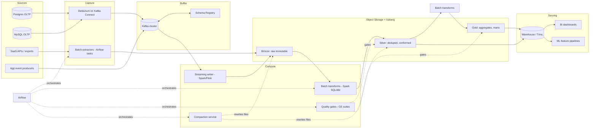
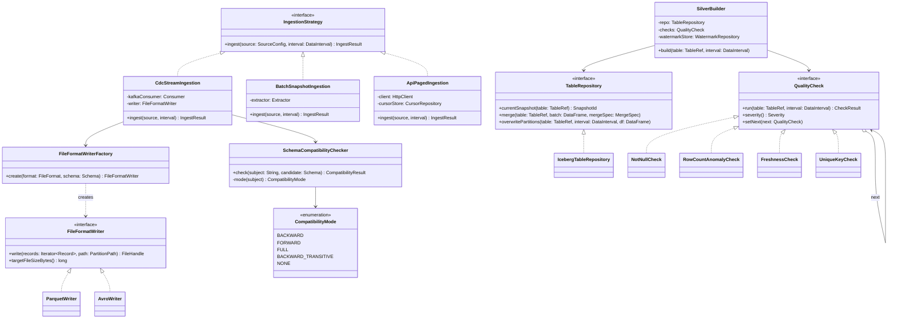

# Data Warehouse Ingestion Pipeline

## 1. Problem Statement & Scope

Design the ingestion layer that moves data from operational systems (OLTP databases, microservice event streams, third-party SaaS APIs) into an analytical data warehouse / lakehouse, keeping analytical tables correct, fresh, and queryable at scale.

### Functional Requirements

1. Ingest from ~200 source tables across ~30 OLTP databases (Postgres/MySQL) plus ~50 application event topics.
2. Capture inserts, updates, and deletes (not just appends) — analytics must reflect row mutations.
3. Land raw data immutably, then produce cleaned, deduplicated, business-conformed tables (medallion: bronze → silver → gold).
4. Support schema evolution without pipeline outages (columns added/widened/dropped by upstream teams).
5. Support backfills and reprocessing of historical ranges without double-counting.
6. Enforce data quality gates (nullability, ranges, referential counts, freshness) before data reaches consumers.
7. Expose tables to BI (dashboards), ad-hoc SQL, and ML feature pipelines.

### Non-Functional Requirements

- **Freshness**: silver tables ≤ 15 min behind source for CDC-fed tables; gold aggregates hourly; some batch sources daily is acceptable.
- **Correctness**: effectively exactly-once — no duplicate rows in silver, no lost mutations; eventual convergence to source state.
- **Durability**: raw (bronze) retained ≥ 13 months for replay/audit; object storage 11 nines durability.
- **Availability**: ingestion is a background system — target 99.9% for the pipeline; consumer-facing warehouse availability is the warehouse's SLA.
- **Scalability**: 10x growth headroom without redesign.
- **Cost**: storage-cheap, compute-elastic; avoid always-on clusters for batch work.

### Back-of-Envelope Estimation

**Event/CDC volume:**
- 30 databases × ~200 total hot tables, aggregate write rate ≈ 5,000 row mutations/sec average, peak 4x = 20,000/sec.
- Application events: 50 topics × ~400 events/sec avg = 20,000 events/sec avg, peak 80,000/sec.
- Combined average ≈ 25,000 records/sec; peak ≈ 100,000 records/sec.

**Daily raw volume:**
- Avg record (CDC envelope with before/after images + metadata) ≈ 2 KB; app events ≈ 1 KB. Blend ≈ 1.2 KB.
- 25,000 rec/s × 86,400 s/day = 2.16 × 10^9 records/day.
- 2.16B × 1.2 KB ≈ 2.6 TB/day raw JSON-ish. Encoded as compressed Parquet/Avro (≈ 5–8x compression on this shape): ≈ 350–500 GB/day landed.

**Storage growth:**
- Bronze: 400 GB/day × 395 days retention ≈ 158 TB.
- Silver ≈ current-state snapshots + history ≈ 30–50 TB; gold ≈ 5 TB. Total ≈ 200 TB → design for 2 PB (10x).

**Bandwidth:**
- Average ingest: 25,000 × 1.2 KB = 30 MB/s. Peak: 100,000 × 1.2 KB = 120 MB/s ≈ 1 Gbps. Trivial for Kafka (a 6-broker cluster handles this with wide margin); the hard problems are correctness, schema change, and small files — not throughput.

**File count pressure (preview of the small-files problem):**
- If a streaming writer flushes every 60 s per topic-partition: 250 topic-partitions × 1,440 min/day = 360,000 files/day. At 400 GB/day that is ~1.1 MB/file — catastrophic for a warehouse that wants 128 MB–1 GB files. Compaction is mandatory, not optional.

### Out of Scope

Warehouse query optimization internals, BI tooling, ML feature store design, source database schema design.

## 2. Brute-Force / Naive Design

**Design:** one VM, a nightly cron at 02:00 that runs `SELECT * FROM <table>` against each production replica, writes CSVs to disk, gzips them, and `COPY`s them into warehouse tables after `TRUNCATE`.

```
cron 02:00 → for table in tables: psql -c "COPY (SELECT * FROM t) TO STDOUT CSV" | gzip → scp → warehouse TRUNCATE + LOAD
```

This is genuinely fine for 10 tables × 1 GB. It breaks at our scale for concrete, quantifiable reasons:

1. **Full-dump time exceeds the window.** Largest table: 2 TB. Reading at a sustained 100 MB/s from a replica (being polite to production) = 2 × 10^12 / 10^8 = 20,000 s ≈ 5.6 hours *for one table*. 200 tables serialized on one box blows through the night; even parallelized, you saturate replica I/O and destroy the replica's replication lag SLO.
2. **Daily transfer waste.** If only ~2% of rows change per day, dumping 60 TB of total source data moves 50x more bytes than needed. Incremental delta ≈ 1.2 TB vs 60 TB full.
3. **Deletes and intra-day updates are invisible or destructive.** `TRUNCATE + LOAD` gives a once-a-day snapshot: no intraday freshness, and if the load fails mid-way, consumers see an empty or partial table (no atomicity).
4. **CSV is the wrong format.** No schema, no types (everything is a string; `NULL` vs `""` ambiguity), no compression columnar layout, no predicate pushdown, delimiter/newline-in-field corruption. A single upstream `ALTER TABLE ADD COLUMN` silently shifts columns and corrupts every downstream field to its right.
5. **Single server = single point of failure**, no retry semantics, no idempotency: rerunning a half-finished cron double-loads or re-truncates mid-business-day.
6. **No lineage, no quality gates, no backfill story.** "Rerun last Tuesday" means hand-editing a shell script.

Interview framing: state this design, then let each failure drive the evolution below.

## 3. Evolving the Design

**Step 1 — Full dumps → incremental extracts.** Add `WHERE updated_at > :last_watermark` per table. Moves 1.2 TB/day instead of 60 TB. New problems: (a) requires a trustworthy `updated_at` column on every table (many tables lack it, or app code forgets to set it); (b) **hard deletes are invisible** — a deleted row simply stops appearing; (c) a row updated twice between runs loses the intermediate state; (d) clock skew and long-running transactions can commit rows with `updated_at` *earlier* than your watermark, silently dropping them.

**Step 2 — Query-based incremental → log-based CDC (Debezium).** Read the database's write-ahead log (Postgres logical replication slot / MySQL binlog) instead of querying tables. Debezium tails the log and emits one event per committed row change with before/after images, op type (`c/u/d`), source LSN/GTID, and transaction metadata. This captures deletes, captures every intermediate version, imposes near-zero query load on the source, and gives a total order per key. Cost: operational complexity (replication slots can bloat WAL if the consumer stalls — monitor slot lag), snapshot-then-stream bootstrapping, and now you own a Kafka cluster.

**Step 3 — Direct writes → Kafka as the buffer.** Debezium writes to Kafka (via Kafka Connect). Kafka decouples source rate from sink rate, absorbs sink outages (7-day topic retention = 7 days of warehouse downtime tolerance), enables fan-out (warehouse + search indexer + cache invalidator read the same stream), and provides per-key ordering via partitioning on primary key.

**Step 4 — CSV → columnar/binary formats.** In-flight: Avro (compact row format, schema-carrying via registry ID). At rest: Parquet (columnar, compressed, predicate pushdown, splittable). Concretely: 400 GB/day Parquet vs ~2.6 TB/day raw text; analytic scans read only needed columns — a 3-column query over a 60-column table reads ~5% of bytes.

**Step 5 — No schema management → Schema Registry.** Every Avro message carries a 4-byte schema ID; the registry stores versioned schemas per subject and *rejects* incompatible producer registrations at publish time. Upstream `ALTER TABLE` becomes a governed event, not a 3 a.m. page. Compatibility mode chosen per subject (see §4 and §7).

**Step 6 — Append-only landing → idempotent MERGE into silver.** CDC replays and at-least-once delivery mean duplicates land in bronze. Silver is built by a deterministic dedup + `MERGE INTO` keyed on primary key and source timestamp/LSN — reprocessing any slice of bronze converges to the same silver state (effectively exactly-once at the table level).

**Step 7 — One giant table → partitioning + compaction.** Partition bronze by ingest date (and topic), silver by business event date. Streaming writers create thousands of small files; a scheduled compaction job rewrites them into 128 MB–1 GB files. Adopt an open table format (Iceberg/Delta) so compaction, schema evolution, and time travel are metadata operations with snapshot isolation.

**Step 8 — Cron → Airflow orchestration.** Batch/ELT layers (silver builds, gold aggregates, quality gates, compaction) become DAG tasks with data-interval-aware, idempotent semantics, retries, SLAs, and first-class backfills.

**Step 9 — Hope → data quality gates.** Great-Expectations-style suites run as DAG tasks between layers; hard failures block promotion to gold, soft failures alert.

End state: streaming CDC for freshness-sensitive OLTP tables, batch ELT for SaaS/API sources, both landing in a lakehouse with medallion layering.

## 4. Protocol & Technology Choices — Why This, Not That

### Batch ETL vs ELT vs Streaming CDC

| Dimension | Batch ETL (transform in-flight) | Batch ELT (load raw, transform in-warehouse) | Streaming CDC |
|---|---|---|---|
| Freshness | Hours–daily | Hours–daily | Seconds–minutes |
| Captures deletes/updates | Only with soft-delete columns | Only with soft-delete columns | Yes, natively from the log |
| Source load | Heavy (full/incremental queries) | Heavy | Near-zero (log tailing) |
| Reprocessing | Re-run transform code | Cheap — raw is preserved, re-run SQL | Replay from Kafka/bronze |
| Complexity/ops | Low–medium | Low | High (Connect, slots, offsets) |
| Cost profile | Transform compute outside warehouse | Warehouse compute (elastic, SQL-native) | Always-on connectors + brokers |

**Chosen:** CDC for OLTP tables needing freshness and delete capture; ELT (not ETL) for batch sources — land raw into bronze, transform with SQL where the data lives, because storage is cheap and preserved raw data makes every bug recoverable. **ETL would win** when data cannot legally land raw (PII must be tokenized before persistence) or when the target is a constrained system you cannot transform inside. **Pure batch would win** for small internal tools where 24 h staleness is fine — CDC's operational tax is real.

### Parquet vs Avro vs ORC

| Dimension | Parquet | Avro | ORC |
|---|---|---|---|
| Layout | Columnar | Row-oriented | Columnar |
| Best for | Analytical scans at rest | Streaming/wire format, write-heavy | Analytical scans (Hive/Presto lineage) |
| Compression | Excellent (per-column: dictionary, RLE, ZSTD) | Good (block-level deflate/snappy) | Excellent; lightweight indexes + bloom filters built-in |
| Predicate pushdown | Yes — row-group min/max stats, optional bloom filters | No (must read whole blocks) | Yes — stripe/row-group stats, bloom filters |
| Schema evolution | Add/rename via table format metadata; positional by default | Best-in-class: reader/writer schema resolution, defaults, aliases | Similar to Parquet |
| Splittability | Yes (row groups) | Yes (sync markers) | Yes (stripes) |
| Ecosystem | Universal (Spark, Trino, Snowflake, BigQuery, DuckDB) | Kafka-native (Schema Registry) | Strong in Hive/Hadoop shops |

**Chosen:** Avro on the wire (row-oriented suits record-at-a-time production; registry integration; strong evolution semantics), Parquet at rest (columnar scans dominate warehouse workloads; broadest engine support). **ORC would win** in a Hive/Hadoop-centric stack already tuned for it — it is technically comparable to Parquet; Parquet wins on ecosystem breadth, not fundamentals.

### Kafka vs Kinesis

| Dimension | Kafka (self-managed/MSK/Confluent) | Kinesis Data Streams |
|---|---|---|
| Throughput ceiling | Effectively unbounded (add brokers/partitions) | Per-shard caps: 1 MB/s in, 2 MB/s out; resharding is manual-ish |
| Retention | Days–infinite (tiered storage) | 24 h default, 365 d max (paid) |
| Ecosystem | Kafka Connect (Debezium!), Streams, ksqlDB, exactly-once txns | AWS-native (Lambda, Firehose) |
| Ordering | Per partition (key-hashed) | Per shard (partition key) |
| Ops | You run it (or pay Confluent/MSK) | Fully managed, near-zero ops |
| Cost at our scale | 120 MB/s peak → modest cluster | 120 MB/s ≥ 120 shards ingest; cost climbs with fan-out |

**Chosen:** Kafka — Debezium is Kafka Connect-native, retention flexibility enables replay-based recovery, consumer groups + transactions support exactly-once sinks. **Kinesis would win** for an all-AWS small team wanting zero broker ops at modest throughput with Lambda consumers.

### Debezium (log-based CDC) vs Query-based Polling CDC

| Dimension | Debezium (WAL/binlog) | Query-based (`WHERE updated_at > ?`) |
|---|---|---|
| Deletes | Captured (`op = d`, before-image) | Missed unless soft-delete convention |
| Intermediate versions | Every committed change | Only latest at poll time |
| Source impact | Log read; minimal query load | Repeated index scans on hot tables |
| Correctness hazards | Slot/WAL bloat if consumer stalls; snapshot consistency handled | Clock skew, long txns commit "into the past" of your watermark → silent loss |
| Requirements | Logical replication enabled, DBA buy-in | Just a timestamp column |
| Ops complexity | High | Low |

**Chosen:** Debezium for owned OLTP databases. **Polling would win** for third-party databases where you have read-only SQL access and no replication privileges, or append-only tables with reliable monotonic keys.

### Airflow vs Dagster vs cron

| Dimension | Airflow | Dagster | cron |
|---|---|---|---|
| Model | Task-centric DAGs, data intervals | Asset-centric (software-defined assets), typed IO | Time triggers only |
| Backfills | First-class (`airflow dags backfill`, per-interval runs) | First-class, asset-partition-aware | Manual scripting |
| Retries/SLA/alerting | Built-in | Built-in | None |
| Ecosystem/hiring | Largest; every warehouse has providers | Growing; strong dbt integration | n/a |
| Local dev/testing | Weaker (needs scheduler) | Strong (asset graph testable in-process) | Trivial |

**Chosen:** Airflow — maturity, team familiarity, provider breadth, battle-tested backfill semantics. **Dagster would win** greenfield with a heavily dbt/asset-oriented team that values lineage-as-code and local testability. **cron would win** for a single job on a single box — never for a dependency graph.

### Iceberg vs Delta Lake vs Hudi

| Dimension | Apache Iceberg | Delta Lake | Apache Hudi |
|---|---|---|---|
| Metadata model | Snapshot + manifest files; engine-neutral spec | JSON/parquet transaction log (`_delta_log`) | Timeline + file groups; MoR/CoW modes |
| Engine neutrality | Best (Spark, Trino, Flink, Snowflake, BigQuery read/write) | Best inside Databricks; OSS parity improving | Spark/Flink-centric |
| Upsert story | MERGE + merge-on-read deletes (v2 position/equality deletes) | MERGE, deletion vectors | Strongest native upsert/record-index heritage |
| Hidden partitioning / partition evolution | Yes — transforms (`days(ts)`, `bucket(n, id)`), evolve without rewrite | Partition columns are physical; generated columns help | Physical partitions |
| Schema evolution | Full: add/drop/rename/reorder via field IDs | Add/rename (column mapping) | Add columns |
| Concurrency | Optimistic, snapshot isolation via atomic catalog swap | Optimistic on log | MVCC timeline |

**Chosen:** Iceberg — engine neutrality (Trino for ad-hoc, Spark for heavy transforms, warehouse external tables), hidden partitioning kills the "users forgot the partition filter" class of bugs, partition evolution avoids petabyte rewrites. **Delta would win** on Databricks-committed stacks; **Hudi would win** for extreme streaming-upsert workloads where record-level index lookup latency dominates.

## 5. High-Level Design (HLD)



### Write Path

1. **Capture.** Debezium connectors tail WAL/binlog per database; each table maps to topic `cdc.<db>.<schema>.<table>`, keyed by primary key (per-key ordering). Initial load = consistent snapshot phase, then seamless switch to streaming from the snapshot's LSN. Batch sources: Airflow tasks pull API pages / files for a data interval directly into bronze.
2. **Serialize.** Producers Avro-encode against Schema Registry; registry enforces the subject's compatibility mode at registration — incompatible schemas are rejected at the producer, never discovered downstream.
3. **Land bronze.** A streaming writer (Spark Structured Streaming / Flink) consumes topics, writes Avro-decoded records to Iceberg bronze tables partitioned by `days(ingest_ts)`. Append-only, no dedup, full CDC envelope preserved. Offsets commit atomically with the Iceberg snapshot (checkpoint + snapshot in one transaction scope) → no lost/duplicated micro-batches from the writer itself.
4. **Build silver.** Micro-batch (15 min) or Airflow-scheduled Spark SQL: read new bronze slice, dedup per key keeping latest `(source_ts, lsn)`, `MERGE INTO` silver (see §6). Deletes applied (or soft-deleted with `_deleted` flag per table policy). Quality gate runs before the merge commit is exposed.
5. **Build gold.** Hourly/daily Airflow DAGs aggregate silver into marts (star schemas, metrics tables). Gold writes are full-partition overwrites (`INSERT OVERWRITE` per data interval) — idempotent by construction.
6. **Compact.** Background job rewrites small files, expires old snapshots, rewrites manifests.

### Read Path

- BI/ad-hoc → Trino/warehouse over gold (silver for power users). Iceberg hidden partitioning applies partition pruning automatically; Parquet row-group stats prune within files.
- ML pipelines read silver via Spark, pinned to an Iceberg snapshot ID for reproducible training sets (time travel).
- Debugging/replay → bronze, filtered by `ingest_ts` partition.

### Data Model & Contracts

- **Registry subjects:** `cdc.orders.public.orders-value` (TopicNameStrategy). Compatibility: `BACKWARD_TRANSITIVE` on CDC subjects (consumers upgrade lazily), `FULL` on shared canonical event subjects.
- **Bronze schema (per table):** full Debezium envelope — `op`, `before`, `after`, `source.lsn`, `source.ts_ms`, `ts_ms` — plus pipeline columns `_ingest_ts`, `_kafka_partition`, `_kafka_offset`. Partition: `days(_ingest_ts)`.
- **Silver schema:** flattened `after` image + `_source_ts`, `_lsn`, `_deleted`, `_processed_ts`. Partition: `days(business_event_ts)` (e.g., `order_created_at`) — analysts filter on business time, not ingest time.
- **Contract with source teams:** additive-only changes without coordination; renames/drops/type-narrowing require a versioned migration window; enforced mechanically by the registry, socially by ownership metadata on each subject.

## 6. Low-Level Design (LLD)

Machine-coding-style component model for the ingestion service and silver builder:



**Patterns and why:**
- **Strategy (`IngestionStrategy`)** — CDC stream, batch snapshot, and API-cursor ingestion share a contract but differ entirely in mechanics; Airflow tasks select a strategy per source without branching logic in the DAG.
- **Factory (`FileFormatWriterFactory`)** — format choice (Parquet at rest, Avro for raw envelope archive) is configuration, not code; adding ORC is a new class, not a rewrite (Open/Closed).
- **Repository (`TableRepository`)** — isolates Iceberg specifics (snapshots, MERGE, overwrite) so business logic is unit-testable against an in-memory fake and a Delta migration touches one class.
- **Chain of Responsibility (`QualityCheck`)** — checks compose per table; `BLOCKING` severity short-circuits promotion, `WARN` accumulates into a report. Mirrors a Great Expectations suite.
- **Template Method** (inside `SilverBuilder.build`): read-slice → dedup → merge → gate → advance-watermark skeleton fixed; per-table hooks for key columns and delete policy.

### The Core Algorithm: Idempotent Dedup + MERGE Upsert

CDC delivery is at-least-once; bronze contains duplicates and replays. Silver must converge regardless of how many times a slice is processed, and must never let an older version overwrite a newer one (out-of-order replays, backfills racing live processing).

```sql
-- Step 1: dedup the new bronze slice: latest version per PK.
-- Order by (source_ts, lsn, kafka_offset) — lsn breaks source_ts ties
-- (same-millisecond updates), offset breaks the rest deterministically.
WITH slice AS (
    SELECT *
    FROM bronze.orders
    WHERE _ingest_ts > :last_watermark
      AND _ingest_ts <= :new_watermark
),
ranked AS (
    SELECT *,
           ROW_NUMBER() OVER (
               PARTITION BY order_id
               ORDER BY _source_ts DESC, _lsn DESC, _kafka_offset DESC
           ) AS rn
    FROM slice
),
deduped AS (
    SELECT * FROM ranked WHERE rn = 1
)

-- Step 2: MERGE keyed on PK, guarded by op timestamp/LSN.
MERGE INTO silver.orders AS t
USING deduped AS s
ON t.order_id = s.order_id
WHEN MATCHED AND (s._source_ts, s._lsn) > (t._source_ts, t._lsn)
     AND s.op = 'd' THEN
    UPDATE SET t._deleted = true,
               t._source_ts = s._source_ts, t._lsn = s._lsn
WHEN MATCHED AND (s._source_ts, s._lsn) > (t._source_ts, t._lsn) THEN
    UPDATE SET *          -- newer version wins
-- MATCHED but (s._source_ts, s._lsn) <= target: no clause fires → stale
-- replay is a no-op. This is what makes reprocessing idempotent.
WHEN NOT MATCHED AND s.op <> 'd' THEN
    INSERT *;
```

Idempotency argument: the merge is a pure function of `(current silver state, deduped slice)`; the version guard makes application of any already-applied or older version a no-op; therefore replaying any bronze range, in any order, any number of times, converges to the state implied by the maximum `(source_ts, lsn)` per key. That is exactly-once *effect* on top of at-least-once *delivery*.

### Watermark Handling

```java
public void build(TableRef table, DataInterval interval) {
    Watermark last = watermarkStore.get(table);            // e.g. ingest_ts 2026-08-06T10:00
    // Hold back by allowed lateness so records still in flight
    // (Kafka lag, writer checkpoint interval) are not permanently skipped.
    Instant candidate = clock.now().minus(ALLOWED_LATENESS); // e.g. now - 10 min
    Watermark next = Watermark.of(min(candidate, interval.end()));
    if (!next.isAfter(last)) return;                        // nothing safe to process

    DataFrame slice = repo.readBronzeBetween(table, last, next);
    DataFrame deduped = dedupLatestPerKey(slice, table.pk(), ORDER_BY_SOURCE_TS_LSN_OFFSET);

    CheckResult r = checks.run(stage(deduped), interval);
    if (r.hasBlockingFailure()) throw new QualityGateException(r); // watermark NOT advanced → safe retry

    repo.merge(table, deduped, MergeSpec.versionGuarded(table.pk(), "_source_ts", "_lsn"));
    watermarkStore.advance(table, next);   // advance ONLY after successful merge
}
```

Key invariants: (1) watermark advances only after a committed merge, so a crash between merge and advance causes a re-merge — harmless by idempotency; (2) watermark is on **ingest time**, so "late" business-time data still flows through (it landed in bronze late but within a new ingest window) — business-time lateness is handled in gold by reaggregating trailing partitions (see §7); (3) `ALLOWED_LATENESS` bounds bronze in-flight skew, sized from observed p99.9 Kafka-to-bronze latency.

## 7. Deep Dives & Failure Modes

**Exactly-once vs at-least-once realities.** True end-to-end exactly-once across independently-failing systems (DB → Debezium → Kafka → writer → Iceberg) does not exist; every hop is at-least-once after a crash-restart. Kafka transactions give exactly-once *within* Kafka Streams topologies, but Debezium after a crash re-emits events from its last committed offset, and a streaming writer may re-land a micro-batch if its checkpoint lags its commit. The honest architecture: at-least-once delivery everywhere + idempotent, version-guarded MERGE at the table boundary = exactly-once *effects*. Say this sentence in the interview.

**Replayed CDC events.** Sources of replay: connector restart, snapshot re-run after slot loss, Kafka consumer rebalance, manual topic replay for recovery. All produce bronze duplicates. Handled by dedup-then-guarded-merge; additionally, the `(pk, _lsn)` pair is a natural exactly-once key because LSN strictly increases per source — a duplicate has an identical LSN and loses the `>` comparison.

**Schema-breaking changes.** Compatibility modes: `BACKWARD` = new schema can read old data (safe: add optional field, delete field) — consumers upgrade *after* producers is the constraint direction to memorize: BACKWARD protects consumers reading old data with new schema; `FORWARD` = old schema can read new data (safe: add field consumers ignore, delete optional field); `FULL` = both; `*_TRANSITIVE` variants check against all prior versions, not just the latest — use transitive, because non-transitive lets A→B→C be pairwise compatible while A→C is not, which bites during replays of old data. A genuinely breaking change (type change `int`→`string`, semantic change of a column): registry rejects it; process is create `orders_v2` subject + table, dual-write window, backfill v2 from bronze, cut consumers over, retire v1. Never mutate meaning in place.

**Small-files explosion math.** From §1: 250 topic-partitions × 1-min flushes = 360,000 files/day ≈ 1.1 MB each. Cost: (a) query planning must open every file footer — 360K S3 GETs before reading a byte; (b) Iceberg manifests bloat, planning goes from ms to minutes; (c) S3 LIST throttling. Mitigations: raise writer trigger to 5–10 min (freshness trade), fewer writer tasks with shuffle-before-write, and mandatory compaction: hourly `rewrite_data_files` targeting 512 MB → 400 GB/day ÷ 512 MB ≈ 800 files/day post-compaction, a 450x reduction. Also `expire_snapshots` + `rewrite_manifests` on a daily cadence or metadata itself becomes the small-files problem.

**Late data past the watermark.** Two distinct latenesses. *Ingest lateness* (event stuck in Kafka 2 hours) — fine: it enters a later processing window; the guarded merge still applies it correctly. *Business-time lateness* (an order event whose `order_ts` is 3 days old arrives today) — silver is correct (merge by PK doesn't care), but gold daily aggregates for 3 days ago are now stale. Policy: gold jobs reaggregate a trailing N-day window each run (N from the observed lateness distribution, e.g., 99.9% of events arrive within 48 h → N=3); beyond N, a weekly reconciliation job diffs silver-derived aggregates against gold and patches, with an explicit "restated" flag for finance-grade marts.

**Backfill correctness.** Dangers: double-counting (backfill + regular run write the same interval), and backfill racing live merges. Defenses: gold tasks write via `INSERT OVERWRITE` scoped to the Airflow data interval — rerunning any interval replaces exactly that partition (idempotent); silver backfills reuse the same guarded MERGE, so replaying old bronze cannot regress rows past newer versions; Airflow `max_active_runs=1` + `depends_on_past` where ordering matters; backfills declared as explicit interval ranges (`airflow dags backfill -s 2026-07-01 -e 2026-07-15`), never ad-hoc SQL.

**Kafka consumer lag / backpressure.** Writer slower than producers → lag grows. Monitor consumer group lag in *time*, not offsets (offsets don't tell you SLA breach). Bounded protection: topic retention (7 days) is the hard deadline — if lag approaches retention, page. Remedies in order: scale writer parallelism up to partition count; if at partition count, add partitions (accepting a key-ordering seam at the split moment — dedup/merge absorbs it); if the sink (object store commit rate) is the bottleneck, increase micro-batch size (throughput up, freshness down). Debezium-specific: a stalled connector holds the replication slot → WAL accumulates on the *source* database and can fill its disk — this is the failure mode that takes down production, so alert on slot lag bytes, not just Kafka lag.

**Poison messages.** A record that deserializes but violates invariants (or fails Avro decode due to a corrupted producer). Never block the partition retrying forever: after K attempts, route to a dead-letter table `bronze._dlq` with the raw bytes, error, offset, and headers; alert; continue. DLQ replays go through the normal path after a fix — idempotent merge makes replay safe. Track DLQ rate as a first-class SLI; a sudden spike is usually an unannounced upstream change.

**Partial file writes.** Writer dies mid-Parquet-upload. Object stores make this mostly safe (multipart uploads are invisible until completed), but the real protection is the table format: a data file not referenced by a committed Iceberg snapshot does not exist to readers. Orphan files (uploaded, never committed) leak storage → scheduled `remove_orphan_files` older than 3 days (grace period must exceed the longest possible in-flight write, or you delete a live upload).

**Compaction conflicts with concurrent writers.** Compaction rewrites files A,B,C→D while a streaming writer appends and a MERGE rewrites files containing matching rows. Iceberg optimistic concurrency: each commit validates against the current snapshot; appends and compaction touch disjoint files → both commit; MERGE vs compaction touching the same files → one fails validation and retries against the new snapshot. Practical rules: compaction uses partial-progress commits (per-file-group) so one conflict doesn't discard hours of work; schedule compaction on partitions older than the active write window (compact `day-1`, not today); MERGE jobs get bounded retry with jitter. Livelock symptom — compaction never wins on a hot partition — is fixed by scheduling, not by locks.

## 8. Trade-off Summary & Interview Soundbites

| Decision | Trade-off accepted |
|---|---|
| Log-based CDC (Debezium) over polling | High ops complexity (Connect, slots, WAL monitoring) for delete capture, low source load, full change history |
| ELT (land raw, transform in-place) over ETL | Store everything twice+ (bronze+silver+gold) for replayability and bug recovery; storage is the cheap resource |
| Avro in flight, Parquet at rest | Format conversion step and dual expertise, for optimal write-path and read-path characteristics respectively |
| At-least-once delivery + idempotent MERGE | Extra compute per batch (dedup window, version guard) instead of chasing unattainable transport-level exactly-once |
| Ingest-time watermarks + trailing-window gold reaggregation | Gold aggregates for recent days are provisional/restated, in exchange for never dropping late data |
| Iceberg over warehouse-native storage | Own compaction/vacuum/metadata ops, for engine neutrality, time travel, and no vendor lock on 200 TB |
| 5–10 min writer flush + hourly compaction | Freshness capped at minutes, to keep file counts and query planning sane |
| Airflow interval-scoped, overwrite-based tasks | More rigid task design (everything keyed to a data interval), for free idempotent backfills |
| BACKWARD_TRANSITIVE registry mode | Upstream teams constrained (no breaking changes in place), for zero-coordination consumer upgrades and safe replays |

**Soundbites:**

1. "Exactly-once is not a delivery guarantee, it's a table property: at-least-once transport plus an idempotent, version-guarded MERGE gives exactly-once effects."
2. "Query-based CDC can't see deletes and can lose rows to clock skew; the write-ahead log is the only honest source of change."
3. "Bronze is an immutable ledger, silver is deduplicated truth, gold is opinionated convenience — every layer is rebuildable from the one below."
4. "The small-files problem is arithmetic: 250 partitions times 1,440 minutes is 360K files a day; compaction to 512 MB makes it 800."
5. "Watermarks bound reprocessing on ingest time; business-time lateness is a gold-layer restatement policy, not a streaming problem."
6. "The registry moves schema failures from 3 a.m. in a consumer to compile time in the producer."
7. "A backfill is just a normal run over an old interval — if that sentence isn't true of your pipeline, your tasks aren't idempotent."
8. "The scariest CDC failure isn't losing data downstream — it's a stalled replication slot filling the production database's disk."

**Common follow-ups:**

- *"How do you bootstrap a 2 TB table into the pipeline?"* Debezium initial snapshot (consistent read at a recorded LSN) streams to the same topic; downstream treats snapshot rows as inserts; incremental snapshot (watermark-chunked) avoids one giant locking read and can run concurrently with streaming.
- *"What if two updates to the same key have identical source timestamps?"* Tie-break on LSN (strictly increasing per source), then Kafka offset — the dedup ordering must be a total order or replays become nondeterministic.
- *"Why not stream straight into the warehouse (e.g., Snowpipe)?"* You can for simple appends; you lose engine-neutral bronze, cheap replay, and you couple retention/replay to warehouse pricing. Fine for small stacks; at 400 GB/day the lakehouse buffer pays for itself.
- *"How do you handle GDPR deletes in an immutable bronze?"* Crypto-shredding (per-user encryption keys, delete the key) or targeted Iceberg row deletes with snapshot expiration to purge history within the compliance window — "immutable" means append-only in operation, not legally unerasable.
- *"CDC or event sourcing from the app?"* CDC captures what the database did (guaranteed complete, semantically thin); app events capture intent (rich, but only as reliable as every code path emitting them — usually via outbox). Use CDC for state replication, outbox events for business semantics; the outbox itself is read via CDC.
- *"How do you detect silent data loss?"* Reconciliation: periodic count/checksum comparison per key-range between source and silver (row counts by day, hash of sorted PKs per bucket) — the only check that catches "the pipeline is green but a table stopped changing."
