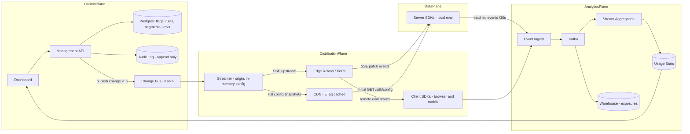
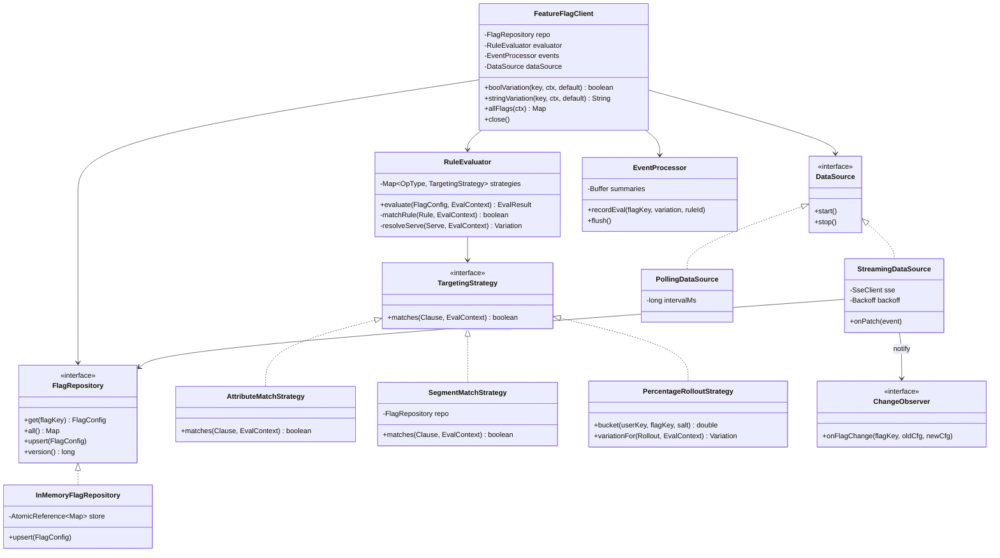

# Feature Flag Service

## 1. Problem Statement & Scope

Design a feature flag / experimentation delivery platform (LaunchDarkly, Unleash, Statsig-style): teams define flags with targeting rules, SDKs embedded in customer applications evaluate those flags per-user with sub-millisecond latency, and changes made in a dashboard propagate to all connected SDKs within seconds.

### Functional Requirements

1. **Flag CRUD**: create/update/archive boolean and multivariate flags (string/number/JSON variations) per project and per environment (dev/staging/prod).
2. **Targeting rules**: attribute-based rules (`country == "IN" AND plan IN ["pro","enterprise"]`), reusable segments, individual user allow/deny lists, default rule fallthrough.
3. **Percentage rollouts**: deterministic, sticky bucketing — the same user always gets the same variation for a given flag at a given rollout percentage; ramping 5% → 50% never flips already-included users out.
4. **Real-time propagation**: a flag toggle (especially a kill switch) reaches all SDKs in < 5 s p99.
5. **Server-side and client-side SDKs**: server SDKs evaluate locally against the full ruleset; client SDKs (browser/mobile) receive only evaluated results.
6. **Audit log**: every change — who, what, when, before/after diff — immutable, queryable.
7. **Evaluation analytics**: which users saw which variation (feeds experimentation/metrics), flag usage stats (for cleanup).
8. **Flag lifecycle**: temporary vs permanent flags, expiry dates, stale-flag detection.

### Non-Functional Requirements

| Requirement | Target |
|---|---|
| Evaluation latency (server SDK, local) | < 1 ms p99 (in-process, no network) |
| Propagation latency (change → SDK applied) | < 5 s p99 globally |
| Availability of *evaluation* | Effectively 100% — SDKs must work when our backend is fully down |
| Availability of control plane (dashboard/API) | 99.9% |
| Consistency | Eventual for config distribution; strong for the management write path |
| Durability of audit log | No loss, 7-year retention (compliance) |

### Back-of-Envelope Estimation

Key insight to state up front: **evaluations do not hit our servers**. Server SDKs evaluate in-process. What hits our infrastructure is (a) config fetches/streams, (b) analytics events. Interviewers reward candidates who separate the data plane's *logical* QPS from the *physical* QPS.

**Evaluation volume (logical):**
- 2,000 customer organizations, avg 500 server instances each running an SDK → 1M connected server SDKs.
- Each instance evaluates flags at, say, 200 evals/s (a flag check per request per flag) → 1M × 200 = **200M evaluations/s globally**. All local. Zero server load. This is the punchline for why local evaluation is non-negotiable.

**Streaming connections:**
- 1M server SDK instances, each holding one long-lived SSE connection → **1M concurrent connections**.
- At ~50 KB kernel + userspace memory per idle connection: 1M × 50 KB = 50 GB → ~25 streamer nodes at 40k conns each (comfortable), or fewer with tuned epoll servers (a single box can hold 200k+).
- Client-side SDKs (browsers/mobile): 10M concurrent → served via CDN/edge, mostly polling or edge-terminated SSE.

**Config change rate (write path):**
- 2,000 orgs × 50 flag changes/day = 100k changes/day ≈ **1.2 writes/s average**, maybe 50/s peak. Trivial write volume — the design difficulty is fan-out, not write throughput. 1 change → 1M+ notified SDKs = fan-out factor of 10^6.

**Config payload size:**
- Avg org: 300 flags × ~2 KB rule JSON = 600 KB full ruleset; gzipped ~100 KB.
- Full sync for 1M SDKs on a cold global restart: 1M × 100 KB = 100 GB — this is why we need CDN/edge caching and delta patches, not origin-served full payloads.

**Analytics events:**
- SDKs summarize locally (counters per flag/variation, flushed every 30 s), not one event per evaluation. 1M SDKs × 1 flush/30 s ≈ **33k flush requests/s**, each ~5 KB → ~165 MB/s ingest ≈ 14 TB/day raw; after aggregation, ~1% retained long-term (~140 GB/day).

**Storage:**
- Flag configs: 2,000 orgs × 600 KB = 1.2 GB. Tiny. Fits in memory everywhere — exploit this.
- Audit log: 100k changes/day × 2 KB = 200 MB/day → 73 GB/year → ~500 GB over 7 years. Cheap append-only storage.

Scope cut: experimentation stats engine (CUPED, sequential testing) is out; we deliver assignment + exposure events and stop there.

## 2. Brute-Force / Naive Design

Simplest thing that works:

```
flags table: (flag_key, enabled, rollout_pct, rules_json)
```

Every service, on every request, calls the flag service:

```
GET /evaluate?flagKey=new-checkout&userId=u123  →  { "variation": true }
```

which does `SELECT * FROM flags WHERE flag_key = ?`, runs the rules, returns.

### Why it breaks — concretely

1. **Latency on the hot path.** A flag check is now a network hop: ~1–5 ms same-AZ, 50–150 ms cross-region — per flag. A single request path checking 10 flags sequentially adds 10–50 ms. Compare to a local hash-map lookup + rule eval at ~10 µs. You've made the cheapest operation in your stack 1000x more expensive and put it in front of every request.
2. **QPS math is fatal.** From Section 1: 200M evaluations/s. Even a beefy Postgres does ~50k reads/s per node → you'd need ~4,000 database nodes to serve *reads of nearly-static data that changes 1.2 times per second*. The read:write ratio is ~170,000,000:1. Any design that pays a network/DB read per evaluation is architecturally wrong, not just slow.
3. **Blast radius.** The flag service is now a synchronous dependency of *every* service in every customer's stack. Flag service down → customer checkout down. A tool meant to *reduce* deploy risk becomes the single biggest availability risk in the fleet. Feature flags must fail open/local: an outage of the flag backend should mean "stale config," never "errors."
4. **Thundering herd built-in.** Traffic spikes on customer side translate 1:1 into spikes on the flag service; you inherit the sum of all customers' peak loads.

Even adding a Redis cache in front only softens (2); it does nothing for (1) and (3) — still a network hop, still a synchronous dependency.

## 3. Evolving the Design

**Step 1 — DB call per eval → shared cache.** Put Redis in front; cache `flag_key → config` with 30 s TTL. DB load drops from 200M/s to ~(num_flags / TTL) — fine. But evaluation still costs a network RTT and Redis is still a synchronous dependency (blast radius unchanged). *Interviewer reasoning: caching fixed the wrong problem — the bottleneck isn't DB reads, it's the network hop on the hot path.*

**Step 2 — cache the eval result in-process.** Cache `(flagKey, userId) → variation` in the app. Now hot users are fast, but: cardinality is users × flags (huge, poor hit rate for long-tail users), and TTL-based staleness means a kill switch takes a full TTL to bite. Caching *results* is the wrong granularity.

**Step 3 — ship the rules, not the results: full local evaluation.** The unlock: flag *configs* are tiny (100 KB/org) and change rarely (1.2/s globally). So sync the entire ruleset into SDK memory and evaluate in-process. Evaluation becomes a pure function `evaluate(flagConfig, userContext)` — ~10 µs, zero network, works during total backend outage. The problem transforms from "serve 200M reads/s" into "replicate a 100 KB document to 1M nodes within 5 s of change." That's a config-distribution problem — vastly easier.

**Step 4 — polling → SSE push.** SDKs polling every 30 s: 1M/30 s ≈ 33k req/s of mostly-304s, and worst-case 30 s staleness — unacceptable for kill switches. Move to SSE: SDK opens one long-lived connection; on change, the streamer pushes a delta (`patch` event with the changed flag's JSON). Propagation drops to O(100 ms–1 s). Keep polling as fallback (SSE-hostile proxies, and as a reconciliation mechanism against missed events).

**Step 5 — single region → edge/CDN distribution.** Origin streamers in one region mean 200 ms+ cross-ocean RTTs and a global SPOF. Introduce relay/edge tier: edge PoPs subscribe upstream to origin (one connection per PoP per environment, not per SDK), fan out locally. Initial full-config fetch is served from CDN with `ETag`/`If-None-Match`, so a cold restart of 100k pods hits CDN cache, not origin. Origin now sees O(number of PoPs) ≈ hundreds of connections, regardless of SDK count.

**Step 6 — client-side SDKs need a different path.** Browsers/mobile can't receive the full ruleset: rule payloads leak targeting logic and segment membership (PII, competitive info — "users in segment `enterprise-churn-risk`"), and mobile CPUs/battery don't want a rules engine. So client SDKs call an **evaluation edge endpoint** once per context: edge evaluates *all* flags for that user server-side and returns just `{flagKey: variation}` map (~2 KB), then streams changed *results*. Two SDK families, two protocols, one rules engine.

**Step 7 — events pipeline.** Exposure/usage events buffer in the SDK, pre-aggregate (counts per flag/variation/rule), flush every 30 s to an ingest endpoint → Kafka → stream aggregation (usage stats, "flag last evaluated at") + raw exposure events to warehouse for experiment analysis. Never let analytics ingestion touch the config-distribution path — separate failure domains.

End state: control plane (Postgres + management API) → distribution plane (streamer + CDN/edge relays) → data plane (SDKs evaluating locally) → analytics plane (events back). Each plane fails independently; evaluation survives failure of all others.

## 4. Protocol & Technology Choices — Why This, Not That

### Client-side vs server-side SDK evaluation

| Dimension | Server-side (local eval, full rules) | Client-side (remote eval, results only) |
|---|---|---|
| Where rules run | In customer's server process | At our edge; device gets results |
| Payload to SDK | Full ruleset (~100 KB) | Evaluated map (~2 KB) |
| Rule/segment secrecy | OK — trusted environment | Required — rules would leak segments, targeting, PII |
| Latency per eval | ~10 µs, no network | Local lookup after init; init costs 1 RTT |
| Context changes (login) | Re-evaluate locally, free | Re-fetch from edge |
| Chosen for | Backend services | Browser, mobile, IoT |

Why not one model? Shipping rules to browsers is a data-exposure incident waiting to happen (`plan == "enterprise" AND mrr > 50000` in devtools); remote-evaluating for servers reintroduces the Section 2 disaster. The split is forced by trust boundary, not preference.

### Config distribution: polling vs SSE vs WebSocket vs gRPC streaming

| Criterion | Polling | SSE (chosen) | WebSocket | gRPC stream |
|---|---|---|---|---|
| Propagation latency | TTL-bound (10–60 s) | Sub-second | Sub-second | Sub-second |
| Direction needed | Pull | Server→client only — exactly our shape | Bidirectional (unneeded) | Bidirectional (unneeded) |
| Infra friendliness | Trivial; CDN-cacheable | Plain HTTP; proxies/LBs/CDNs handle it; auto-reconnect + `Last-Event-ID` built into the contract | Upgrade handshake; some corp proxies break it | Needs HTTP/2 end-to-end; LB support patchier |
| Server cost | 33k req/s of 304s | 1 idle conn per SDK | Same | Same, plus HTTP/2 stream mgmt |
| Chosen because | — | One-way config push over vanilla HTTP with built-in resume semantics | — | — |
| Alternative wins when | Restricted egress, serverless/short-lived runtimes (Lambda — can't hold connections), reconciliation layer | — | You need client→server messages on same channel (collab editing, chat) | Internal microservice mesh already on gRPC/HTTP2, typed contracts |

Decision: **SSE primary, polling fallback + periodic reconciliation**. Push for latency, pull for correctness (heals missed events).

### Push vs pull hybrid

| Model | Property |
|---|---|
| Pure push | Fast but fragile: a dropped event = silent permanent staleness |
| Pure pull | Robust but slow or expensive (latency ∝ 1/poll-rate) |
| Hybrid (chosen) | SSE push for latency; every payload carries a monotonic `version`; SDK also polls every 5 min with `If-None-Match: <version>` — detects gaps, self-heals. Push is an optimization over a correct pull baseline. |

### Relay/edge state: Redis vs in-memory

| Criterion | In-memory in streamer (chosen) | Redis at edge |
|---|---|---|
| Dataset size | 1.2 GB total, all orgs — fits in one process | Fits trivially |
| Read latency for fan-out | 0 (same heap) | +1 hop per payload build |
| Failure mode | Node restarts → re-sync from upstream in seconds (config is small) | Extra stateful component to operate per PoP |
| Wins when | Config fits in RAM (it does, by 2 orders of magnitude) | Config too big for one node, or streamers must be truly stateless (frequent spot-instance churn), or shared cache across heterogeneous edge services |

The config is small enough that treating streamers as caching replicas (state rebuilt from upstream on boot) beats operating Redis in 50 PoPs.

### Flag config store: Postgres vs DynamoDB

| Criterion | Postgres (chosen) | DynamoDB |
|---|---|---|
| Write volume | 1.2/s avg — trivial for either | Trivial |
| Data shape | Relational: flags → rules → segments FK graph; dashboards need joins, search, "which flags use segment X" | Would need denormalization + GSIs per query pattern |
| Transactions | Update flag + append audit row + bump environment version atomically | Multi-item Tx exists but clunkier |
| Wins when | Control-plane workloads: complex queries, referential integrity, low write rate | If the *serving* path read from the DB directly at high QPS (ours doesn't — streamers serve from memory), or multi-region active-active writes were required |

Since the distribution tier absorbs all read scale, the source-of-truth DB only needs correctness and queryability — classic Postgres territory.

### Event analytics: batch vs stream

| Criterion | Stream (Kafka + Flink) — chosen for ingest | Batch (hourly S3 loads) |
|---|---|---|
| "Flag last used" freshness | Minutes — needed for safe cleanup and live debugging | Hours stale |
| Experiment exposure joins | Streamed to warehouse, analyzed in batch anyway | Fine |
| Chosen split | Stream ingest + streaming aggregates for operational stats; batch in warehouse for experiment analysis | Pure batch wins if you only do offline experiment readouts and cost dominates |

## 5. High-Level Design (HLD)



### Read path — SDK init + live update

1. Server SDK boots with SDK key → `GET /sdk/config` (CDN edge). CDN serves gzipped full ruleset with `ETag: env-version-8412`. Cache hit rate is high because thousands of pods of the same customer request the identical object.
2. SDK parses into an in-memory `FlagRepository`, marks itself ready (or times out after e.g. 5 s and falls back to bootstrap file / code defaults — Section 7).
3. SDK opens SSE: `GET /sdk/stream` with header `Last-Event-ID: 8412` to nearest relay. Relay holds the connection.
4. Application calls `client.boolVariation("new-checkout", ctx, false)` → pure in-process evaluation, ~10 µs.
5. Live update: relay pushes `event: patch` → SDK atomically swaps that flag's config (copy-on-write pointer swap; readers never lock).

### Write path — flag change propagation

1. PM toggles flag in dashboard → `PATCH /api/v2/flags/new-checkout` with `If-Match` (optimistic concurrency; two admins editing concurrently → 412).
2. Management API in one Postgres transaction: update flag row, increment `environments.version` (monotonic per env), append audit row.
3. Publish `{env, flagKey, version: 8413, config}` to Kafka change bus. (Outbox pattern: the event row is written in the same Tx and relayed, so DB and bus can't diverge.)
4. Origin streamer consumes, updates in-memory copy, pushes to all subscribed relays; relays fan out to SDK connections. Also writes new snapshot object → CDN invalidation by version-keyed URL (no purge needed: new version = new key).
5. SDKs apply patch iff `patch.version > current.version` (idempotent, reorder-safe). End-to-end target: p50 ~200 ms, p99 < 5 s.

### Data model

```sql
flags(id, project_id, key, kind ENUM('boolean','multivariate'),
      variations JSONB,          -- [{id, value, name}]
      temporary BOOLEAN,          -- lifecycle: temp flags get expiry nagging
      expires_at TIMESTAMPTZ NULL,
      created_at, archived_at)

flag_env_config(flag_id, environment_id,
      enabled BOOLEAN,            -- master kill switch: false => serve off_variation, skip all rules
      off_variation_id,
      fallthrough JSONB,          -- default rule: fixed variation OR rollout {variationWeights, bucketBy, salt}
      individual_targets JSONB,   -- {variationId: [userKeys]} — checked first, highest precedence
      rules JSONB,                -- ordered rule list (see below)
      version BIGINT)             -- per-flag version for patching

-- rule shape inside rules JSONB:
-- { id, clauses: [ {attribute:"country", op:"in", values:["IN","BR"], negate:false},
--                  {attribute:"segment", op:"segmentMatch", values:["beta-testers"]} ],
--   serve: {variationId} | {rollout: {weights:[{variationId,weight}], salt}} }

segments(id, project_id, key,
      included JSONB, excluded JSONB,   -- explicit user lists
      rules JSONB)                       -- attribute rules; segment = list ∪ rule-matched, minus excluded

environments(id, project_id, key, sdk_key_hash, mobile_key_hash, version BIGINT)

audit_log(id, project_id, actor, action, resource_type, resource_id,
      before JSONB, after JSONB, comment, created_at)  -- append-only, no UPDATE grant
```

Operators supported by clauses: `in`, `endsWith`, `startsWith`, `matches` (regex), `contains`, `lessThan`, `greaterThan`, `before`, `after` (dates), `semVerEqual/LessThan/GreaterThan`, `segmentMatch`. Clauses within a rule AND together; rules OR (first match wins, ordered).

### API design

Management (REST, authz-scoped, all writes audited):

```
POST   /api/v2/projects/{proj}/flags
PATCH  /api/v2/flags/{key}                     # JSON-patch semantics + If-Match version
POST   /api/v2/flags/{key}/environments/{env}/toggle   # dedicated fast path for kill switch
GET    /api/v2/audit?resource=flag:new-checkout&limit=50
POST   /api/v2/segments/{key}/users            # incremental segment membership add
```

SDK protocol:

```
GET /sdk/config            Authorization: <sdk-key>   → full ruleset + version (CDN)
GET /sdk/stream            Accept: text/event-stream, Last-Event-ID: <version>

  event: put     data: {"version":8412, "flags":{...}}         # full state (on connect if gap too large)
  event: patch   data: {"version":8413, "flag":{"key":"new-checkout", ...}}
  event: delete  data: {"version":8414, "key":"old-flag"}
  : heartbeat every 30s                                         # comment frame keeps proxies from idling out

POST /events/bulk          # batched: [{kind:"summary", startDate, endDate,
                           #   features:{flagKey:{counters:[{variation, count, ruleId}]}}},
                           #  {kind:"exposure", userKeyHash, flagKey, variation, ts}]
```

## 6. Low-Level Design (LLD)



### Design patterns — named, with justification

- **Strategy** (`TargetingStrategy`): each clause operator family (attribute compare, segment membership, rollout resolution) is an interchangeable strategy behind one interface. Adding `semVerGreaterThan` = new strategy class, zero changes to `RuleEvaluator` — open/closed. This is the class the machine-coding round wants to see.
- **Observer** (`ChangeObserver`): application code subscribes to flag changes (`client.onChange("new-checkout", cb)`) to e.g. resize a connection pool when a config flag flips. Streamer→SDK is the same pattern one level up.
- **Repository** (`FlagRepository`): evaluation logic depends on an interface, not on how configs arrive (stream, poll, bootstrap file, test fixture). Enables an in-memory fake for unit tests and a Redis-backed impl for the relay daemon.
- **Singleton** (`FeatureFlagClient`): one instance per process — it owns a network connection, threads, and event buffers; N instances = N SSE connections and duplicated memory. Enforced via factory `FeatureFlagClient.init(sdkKey)` returning the shared instance.
- Also present: **copy-on-write / immutable snapshot** in `InMemoryFlagRepository` (`AtomicReference<Map>` swap) so 200 evals/s per instance read lock-free while patches apply.

### Evaluation order in `RuleEvaluator.evaluate`

1. Flag `enabled == false` (kill switch) → return `off_variation`, reason `OFF`. No rules run.
2. `individual_targets` contains `ctx.key` → that variation, reason `TARGET_MATCH`.
3. Rules in order; first rule whose clauses all match → its `serve` (fixed variation or rollout), reason `RULE_MATCH(ruleId)`.
4. No rule matched → `fallthrough` (fixed or rollout), reason `FALLTHROUGH`.
5. Any error (flag missing, type mismatch, malformed rule) → **application-supplied default**, reason `ERROR`. The SDK never throws on the hot path.

### Consistent bucketing (Java)

```java
public final class PercentageRolloutStrategy implements TargetingStrategy {

    private static final int BUCKET_SPACE = 100_000; // 0.001% granularity

    /**
     * Deterministic bucket in [0.0, 100.0).
     * Input includes flagKey + salt so buckets are independent across flags:
     * being in the 10% for flag A says nothing about flag B (no correlated
     * cohorts, which would bias experiments).
     */
    static double bucket(String userKey, String flagKey, String salt) {
        String input = userKey + "." + flagKey + "." + salt;
        int h = Murmur3.hash32(input.getBytes(StandardCharsets.UTF_8));
        long positive = h & 0xFFFFFFFFL;             // treat as unsigned 32-bit
        return (positive % BUCKET_SPACE) / 1000.0;   // e.g. 41_337 -> 41.337
    }

    /** Multivariate rollout: walk cumulative weights. weights sum to 100_000. */
    public Variation variationFor(Rollout rollout, EvalContext ctx, String flagKey) {
        String byAttr = rollout.bucketBy() == null ? "key" : rollout.bucketBy();
        String bucketKey = ctx.attribute(byAttr);     // usually userId; can be orgId
        double b = bucket(bucketKey, flagKey, rollout.salt());
        double cumulative = 0.0;
        for (WeightedVariation wv : rollout.weights()) {
            cumulative += wv.weight() / 1000.0;       // weight in 0..100_000
            if (b < cumulative) return wv.variation();
        }
        return rollout.weights().getLast().variation(); // guard float edge
    }

    @Override
    public boolean matches(Clause clause, EvalContext ctx) {
        // used for "percentage of segment" style clauses
        double b = bucket(ctx.key(), clause.flagKey(), clause.salt());
        return b < clause.rolloutPercent();
    }
}
```

**Stickiness properties — say these out loud:**

- **Stable across restarts and machines**: bucket is a pure function of `(userKey, flagKey, salt)` — no stored assignment state, no coordination. Every SDK instance in every language computes the identical bucket (murmur3 is the cross-SDK contract; all SDKs must byte-match).
- **Monotonic ramps**: user at bucket 7.2 is "in" at 10% and stays in at 25%, 50%, 100% — raising the percentage only adds users, never flips existing ones (no UX whiplash, no experiment contamination).
- **Per-flag independence**: `flagKey` in the hash input decorrelates flags — without it, the *same* 10% of users would be guinea pigs for every rollout (systematically over-exposed cohort, biased experiments).
- **Salt for re-randomization**: rerunning an experiment on a fresh cohort = change salt; everyone re-buckets. Also mitigates users reverse-engineering their bucket.
- **`bucketBy` for entity-level consistency**: bucket by `orgId` so all users in one company get the same variation (B2B requirement — mixed variations within an account breaks shared UIs).
- Uniformity: murmur3 is fast (non-cryptographic — fine, this is distribution not security) and passes avalanche tests; 100,000 buckets gives 0.001% ramp granularity.

## 7. Deep Dives & Failure Modes

**SDK bootstrap with backend down.** Order of fallbacks: (1) live fetch; (2) **last-known-good** config persisted by the SDK to local disk/Redis on every update — on boot, load it and serve stale-but-sane; (3) bootstrap file baked into the deploy artifact (CI pulls current config at build time); (4) code-level defaults passed to every `variation()` call — the API *requires* a default parameter precisely so there is always an answer. Design principle: evaluation availability must not depend on flag-service availability. Also: SDK `init()` takes a timeout — apps choose "block up to 5 s for fresh config" vs "start instantly with defaults."

**Stale config detection.** Every payload carries a monotonic version + timestamp; SDK exposes `dataSourceStatus` (VALID / INTERRUPTED / OFF, lastSuccessfulSync). Customers alert if staleness > 5 min. Server-side: reconciliation poll every 5 min compares versions and triggers a full `put` on divergence — push optimizes, pull guarantees.

**Thundering herd on reconnect.** Relay restart drops 40k connections; naive clients reconnect simultaneously and all request full state. Mitigations: (a) reconnect with exponential backoff + full jitter (`sleep(rand(0, min(cap, base·2^n)))`); (b) `Last-Event-ID` so most reconnects get a tiny delta or empty catch-up, not a 100 KB `put`; (c) full snapshots served from CDN, so even a true cold herd hits cache; (d) relays drain gracefully on deploy (staggered `retry:` hints), never mass-drop; (e) origin admission control — shed reconnects with `Retry-After` rather than collapsing.

**Consistency across services mid-rollout.** Service A (updated) evaluates `true`, calls Service B (100 ms behind) which evaluates `false` — mixed behavior within one request. Options: (1) **evaluate once at the edge, propagate the decision** in a request header/baggage (`x-flag-eval: new-checkout=true`) — downstream services trust the header, one decision per request; (2) accept eventual consistency for cosmetic flags — the sticky bucketing means within a couple of seconds all instances converge to the same answer for the same user; (3) for genuinely transactional decisions, don't use a flag — use data. Interview soundbite: config propagation is eventually consistent; if two services must agree *within a single request*, pin the decision at the request's entry point.

**Segment size explosion.** "Everyone who ever churned" = 20M user keys; can't ship 20M IDs to every SDK. Split segment types: **rule-based segments** (small, ship with config) vs **big segments** (backed by a store). For big segments, server SDKs query a customer-hosted sidecar/Redis populated by our sync service (membership check = SETISMEMBER, ~0.2 ms, still no WAN call); client SDKs get membership resolved at edge eval time. Cap inline segment lists (e.g. 50k keys) and force big-segment mode beyond that.

**Kill-switch propagation SLO.** Toggle → all SDKs, target p99 < 5 s. Budget: API+DB commit 50 ms, Kafka 50 ms, origin→relay push 100 ms, relay→SDK push 100 ms, SDK apply ~0 → p50 well under 1 s; p99 dominated by SDKs currently in reconnect backoff (bounded by backoff cap, e.g. 30 s — so honest answer: p99 across *healthy* connections < 5 s, disconnected SDKs bounded by poll fallback interval). Measure it: streamer emits per-env version timestamps; SDKs report `appliedVersion` in event flushes; SLO dashboard = distribution of (applied_at − changed_at). Kill switch skips rule evaluation entirely (checked before rules), so even a corrupt ruleset can't block it.

**Audit and compliance.** Append-only audit table (no UPDATE/DELETE grants; optionally hash-chained rows for tamper evidence), every mutation captures actor, before/after JSON, comment, and approval reference. Enterprise needs: required approvals for prod environments (change requests — a toggle in prod creates a pending change another admin approves), SSO/SCIM for actor identity, audit export to customer SIEM via webhook. Flag payloads should not contain PII; exposure events hash user keys before leaving the SDK if configured.

**Flag debt.** Every non-permanent flag gets `temporary=true` + optional `expires_at`. Detection: analytics tell us "flag served 100% one variation for 30 days" or "zero evaluations for 30 days" → stale candidate → Slack/Jira nag to owner. **Code-reference scanning**: CI tool greps repos for flag keys and reports references back; a flag with zero code references and archived status is safe to delete; a flag at 100% *with* code references generates a "remove the flag, keep the winning path" cleanup ticket. Guardrail: archiving requires zero references or explicit override. Without this loop, a 3-year-old codebase accumulates hundreds of dead branches — real interview differentiator to raise unprompted.

**Multi-environment / multi-tenant isolation.** SDK key ↔ exactly one (project, environment); streamer partitions subscriptions by env so a tenant's config never reaches another tenant's connection. Payload isolation is the easy part; the hard parts are (a) noisy neighbor on the streamer — per-tenant connection quotas and fan-out rate limits so one customer's 500k pods don't starve others; (b) blast-radius of shared relays — shard tenants across relay pools, enterprise tenants can get dedicated relays or a self-hosted **relay proxy** inside their VPC (also solves their compliance need for no direct SDK egress); (c) prod vs non-prod: separate env versions, separate SDK keys, prod changes gated by approvals; key rotation without downtime (accept old+new keys during a rotation window).

## 8. Trade-off Summary & Interview Soundbites

| Decision | Trade-off accepted |
|---|---|
| Local evaluation in server SDKs | Eventual consistency of config (seconds of skew between instances) in exchange for ~10 µs evals and zero runtime dependency |
| SSE push + polling fallback | Two code paths to maintain; bought sub-second propagation with self-healing correctness |
| Remote eval for client SDKs | Extra RTT on context change and edge compute cost, in exchange for zero rule/PII leakage to devices |
| Deterministic hash bucketing (no assignment store) | Cannot do "exactly N users" or reassignment without salt change; bought statelessness, cross-language consistency, restart stability |
| Postgres source of truth, memory-serving distribution tier | Config reads are stale by design; bought relational control-plane queries plus infinite read scale |
| CDN-served snapshots, version-keyed URLs | Slight extra storage per version; bought cold-start herd immunity and no cache-purge races |
| Big segments in external store | One extra local hop (Redis) for huge segments; bought bounded config payload size |
| Append-only audit in same Tx as change | Slightly heavier writes; bought guaranteed change/audit atomicity for compliance |

**Soundbites:**

1. "The read:write ratio is ~10^8:1 — so ship the rules to the reader and turn 200M reads/s into replicating a 100 KB document 1M times per change."
2. "Evaluations never hit our servers; what we actually operate is a config CDN with a push channel and an events firehose."
3. "A feature flag system must fail *stale*, never fail *closed* — outage means old config, not errors, which is why every `variation()` call takes a default."
4. "Bucketing is `murmur3(user.flag.salt) % 100000` — sticky across restarts because it's a pure function, monotonic under ramps, and per-flag independent so cohorts don't correlate."
5. "Push is an optimization layered on a correct pull baseline: versions + reconciliation polling heal any dropped SSE event."
6. "Client and server SDKs differ because of the trust boundary: servers get rules, browsers get results — shipping targeting rules to devtools is a data leak."
7. "The kill switch is checked before the rules engine, so even malformed rules can't keep a feature alive."
8. "Flag debt is a first-class feature: expiry dates, staleness detection from evaluation analytics, and CI code-reference scanning close the loop."

**Common follow-ups, short answers:**

- *How do you A/B test with this?* Rollout weights across variations + exposure events (user, flag, variation, ts) to the warehouse; the flag system does assignment, the stats engine does analysis. Salt change = fresh randomization.
- *What if two SDK languages bucket differently?* That's a contract bug — murmur3 over identical byte input is part of the SDK spec, verified by cross-language golden-file test suites.
- *Serverless (Lambda) SDKs?* Can't hold SSE or amortize init: use the relay proxy in daemon mode or DynamoDB/Redis as a shared FlagRepository the relay keeps warm; functions read locally from that store.
- *Why not evaluate everything at the edge for servers too?* Reintroduces network hop and a hard dependency on the hot path — exactly the naive design's failure. Edge eval exists only where the trust boundary forces it.
- *How fast can you ramp 1% → 100%?* Config change propagates in seconds; the gating factor is your metrics feedback loop, not the flag system. Automate with guarded rollouts: metric guardrail breach → auto-revert to previous version (which the audit log stores).
- *Flag config gets corrupted and pushed globally?* Versioned snapshots make rollback a pointer flip; schema-validate at API and at SDK parse time — SDK rejects malformed patch and keeps last-known-good; canary the streamer fleet.
- *Why 100,000 buckets, not 100?* 0.001% granularity: at 100M users, 1 bucket = 1,000 users, letting you ramp to tiny exposed populations for high-risk features.
