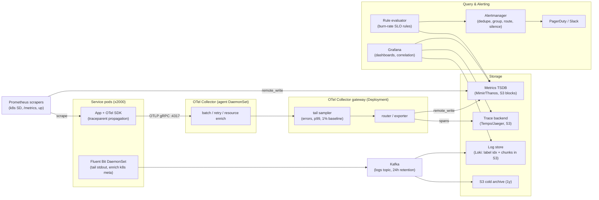
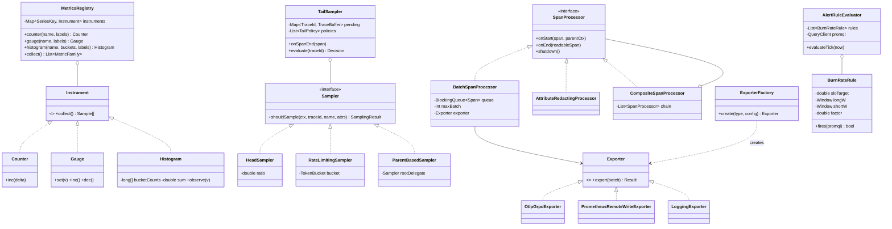

# Observability Stack

Design a company-wide observability platform: metrics, distributed traces, and logs for ~2,000 microservice instances, with dashboards, ad-hoc querying, and SLO-based alerting.

**The three pillars and the question each answers:**

| Pillar | Question it answers | Shape of data | Typical query |
|---|---|---|---|
| Metrics | "Is something wrong? How much / how fast?" | Numeric time series, pre-aggregated, low cost per data point | `rate(http_requests_total{status=~"5.."}[5m])` |
| Traces | "Where in the request path is it wrong?" | Tree of timed spans per request, causally linked | "Show p99 traces for `/checkout` where `db.query` span > 200 ms" |
| Logs | "Why exactly is it wrong?" | Semi-structured events, arbitrary payload, highest cost per byte | "grep for the stack trace attached to trace_id X" |

Metrics are cheap and aggregate well but lose per-request detail. Traces preserve per-request causality but must be sampled. Logs carry everything but are the most expensive to index. A senior answer treats the three as one correlated system (shared `trace_id`, shared resource attributes), not three silos.

## 1. Problem Statement & Scope

### Functional requirements
1. Ingest metrics, traces, logs from all services (polyglot: Java, Go, Node).
2. Dashboards and ad-hoc queries: PromQL for metrics, trace search by service/latency/attributes, full-text or label-scoped log search.
3. Correlation: from an alert → dashboard → exemplar trace → logs for that trace_id in < 5 clicks.
4. Alerting on SLOs (availability, latency) with paging and ticket-severity tiers.
5. Retention: metrics 13 months (downsampled), traces 7–30 days, logs 30 days hot + 1 year cold.

### Non-functional requirements
- Ingest availability > 99.9%; the observability plane must degrade *before* it degrades production (never block the request path).
- Query latency: dashboard panels p99 < 2 s over 6 h windows; alert evaluation every 15–60 s.
- Freshness: metric visible < 30 s after emission; logs < 15 s; traces < 60 s (tail sampling adds decision delay).
- Cost-bounded: observability spend commonly lands at 5–15% of infra spend; we budget ~10%.
- Multi-tenant isolation: one team's cardinality bomb must not take down everyone's dashboards.

### Back-of-envelope estimation

Assume 2,000 service instances (pods/VMs), 200 distinct services, 50k RPS aggregate at the edge.

**Metrics (series count and ingest):**
- Per instance: ~2,000 active series (runtime + RED metrics + a few histograms; one histogram with 15 buckets × 4 endpoints × 3 status classes = 180 series alone).
- Total series: 2,000 instances × 2,000 series = **4,000,000 active series**.
- Scrape every 15 s → 4M / 15 = **~267k samples/sec**.
- Gorilla-compressed sample ≈ 1.37 bytes → 267k × 1.37 ≈ 366 KB/s ≈ **~31 GB/day** on disk (plus index overhead, ~2× → 60 GB/day; 13 months raw would be ~24 TB, hence downsampling).
- In-memory head block: ~3–8 KB per active series → 4M × 4 KB ≈ **16 GB RAM** just for series heads (this is why cardinality is the #1 metric killer).

**Traces (spans/sec):**
- 50k RPS edge requests × average fan-out of 10 internal calls = 500k spans/sec generated.
- Head-sample at 10% → **50k spans/sec** stored. Span ≈ 500 bytes wire / ~300 bytes compressed → 50k × 300 B ≈ 15 MB/s ≈ **1.3 TB/day**. 7-day retention ≈ 9 TB.

**Logs (GB/day):**
- Per instance ~50 log lines/sec × 300 bytes avg = 15 KB/s.
- Fleet: 2,000 × 15 KB/s = 30 MB/s ≈ **2.6 TB/day raw**. Compressed ~10:1 for storage (~260 GB/day), but full-text indexing in Elasticsearch typically *expands* to 0.5–1.1× raw on disk → ~2–3 TB/day indexed. This single line item usually dominates cost and motivates the Loki-vs-ES discussion.

**Bandwidth:** metrics 0.4 MB/s + traces 15 MB/s + logs 30 MB/s ≈ **~46 MB/s ≈ 370 Mbps** sustained into the pipeline — trivially handled by a Kafka cluster, but 4 TB/day of write volume is not trivial for a single indexer node, so everything downstream must be horizontally sharded.

## 2. Brute-Force / Naive Design

The simplest thing that "works":

1. **Logs:** each service writes to `/var/log/app.log` with logrotate. Debugging = `ssh host && grep`.
2. **Health:** a cron job every minute curls `/health` on each host and inserts `(host, ts, status, latency)` into a MySQL table. A PHP page renders red/green.
3. **Metrics:** none, or `top`/`vmstat` over SSH.
4. **Alerting:** a second cron that emails ops if the last row for a host is non-200.

### Why it breaks, with numbers

- **grep does not scale past ~10 hosts.** 2,000 instances × autoscaling means the pod that served the failing request may be *gone* by the time you SSH in. A single incident touching 10 services requires grepping ~10 × N ephemeral pods; with 2.6 TB/day of logs, one day's grep across the fleet at 200 MB/s effective disk scan per host is minutes per host, serialized by a human.
- **No request correlation.** A checkout failure spans 10 services. With unstructured, uncorrelated logs, finding the causal chain is O(services × log volume) human work. Mean time to *find the right log line* dominates MTTR.
- **Cron + MySQL polling collapses.** 2,000 hosts × 1 curl/min = 33 checks/s — fine — but the moment you want per-endpoint latency histograms you need ~4M series × 4 samples/min = 267k inserts/s into MySQL. InnoDB with a secondary index on `(host, metric, ts)` will do maybe 20–50k inserts/s per beefy node before falling over, and a `GROUP BY minute` over a day of data (23 B rows) is a full-table-scan disaster. Time-series data needs time-series storage.
- **1-minute polling misses everything interesting.** A 30-second outage between polls is invisible; a health endpoint returning 200 while 20% of real requests 500 is the classic "green dashboard, angry customers" failure. You need *request-driven* metrics, not synthetic-only.
- **Static "host down" email alerts** page on every deploy (instances intentionally cycle) and never page on "error rate went from 0.01% to 2%," which is the outage that actually matters.

## 3. Evolving the Design

Interviewer-style: name a bottleneck, fix exactly that, repeat.

**Step 1 — SSH-grep → centralized log shipping.**
Bottleneck: logs die with the pod; humans fan out over hosts.
Fix: run a lightweight agent (Fluent Bit, ~1–5 MB RSS) as a DaemonSet tailing container stdout, shipping to a central store. Now one query surface, logs survive pod death.

**Step 2 — unstructured text → structured logs.**
Bottleneck: `grep 'ERROR.*checkout'` is brittle; you can't filter by field or aggregate.
Fix: services emit JSON lines (`{"ts":..., "level":"error", "service":"checkout", "trace_id":"...", "msg":...}`). Agents parse/enrich (add k8s pod, namespace, node). Queries become field predicates; log-derived metrics become possible.

**Step 3 — direct ship → buffered, indexed pipeline.**
Bottleneck: indexer (Elasticsearch) hiccups → agents buffer on-node → disk fills → *production* pods evicted. Also ingest spikes (crash-loop storms can 100× log volume) overwhelm the indexer.
Fix: put **Kafka** between agents and indexers. Agents do fire-and-forget to Kafka (retention 6–24 h = hours of replay buffer); consumers index at their own pace. Decouples producer availability from indexer availability; enables multiple consumers (indexer + S3 archiver + security SIEM) off one stream.

**Step 4 — cron poller → Prometheus pull model.**
Bottleneck: the poller has no service discovery, no histograms, no query language, and MySQL is the wrong store.
Fix: Prometheus. Services expose `/metrics`; Prometheus discovers targets via Kubernetes SD and scrapes every 15 s. Key properties:
- **Service discovery drives scraping** — new pods are monitored automatically, no registration step.
- **The `up` metric**: every scrape synthesizes `up{job,instance} = 1|0`. Target-down detection is free and *from the monitoring system's viewpoint* — you know the difference between "app reports healthy" and "monitoring can't reach app."
- Scrape failure is visible and attributable; with push, a silent client just… stops, indistinguishable from "no data to report."
- Local TSDB with Gorilla-style compression handles 267k samples/s on a handful of nodes; PromQL gives `rate()`, quantiles, joins.
For long retention and global view, front several Prometheis with Thanos/Mimir/Cortex (object storage blocks, global query fan-out, deduplication of HA pairs).

**Step 5 — no request correlation → distributed tracing.**
Bottleneck: metrics say *checkout p99 is bad*; logs say *some DB call somewhere timed out*; nobody can connect them.
Fix: instrument with OpenTelemetry SDKs; propagate **W3C `traceparent`** on every hop:

```
traceparent: 00-4bf92f3577b34da6a3ce929d0e0e4736-00f067aa0ba902b7-01
             ^^ ^^^^^^^^^^^^^^^^^^^^^^^^^^^^^^^^ ^^^^^^^^^^^^^^^^ ^^
             version (2 hex)   trace-id (32 hex,  parent span-id   flags (2 hex,
                               16 bytes)          (16 hex, 8 B)    bit0=sampled)
```

Every service reads it, creates a child span (new span-id, same trace-id), and forwards it. `tracestate` carries vendor extras. Log the `trace_id` in every log line → the correlation edge between all three pillars. Sample (head 10% at ingress, or tail-sample at the collector) because 500k spans/s unsampled is unaffordable.

**Step 6 — noisy threshold alerts → SLO burn-rate alerts.**
Bottleneck: `alert if error_rate > 1% for 5m` pages at 3 a.m. for a 6-minute blip that consumed 0.02% of the monthly error budget, and *doesn't* page for a slow 0.9% bleed that quietly burns the whole budget.
Fix: define SLOs (e.g., 99.9% success over 30 days → error budget 0.1%). Alert on **burn rate** = (observed error rate) / (budget rate). Multi-window, multi-burn-rate (Google SRE Workbook):
- Page: burn 14.4× over 1 h (2% of monthly budget gone in 1 h) AND 14.4× over 5 m (still burning now).
- Page (slower): 6× over 6 h AND 6× over 30 m (5% of budget in 6 h).
- Ticket: 1× over 3 d.
Math below in §6 and §7. Result: pages are proportional to user pain, and the short window makes alerts *reset fast* once the incident ends.

**Step 7 — per-pillar agents → OpenTelemetry Collector as unified edge.**
Bottleneck: three agent fleets (metrics exporter, trace agent, log shipper), three configs, vendor lock-in in SDKs.
Fix: OTel SDK in apps (vendor-neutral API + SDK), OTel Collector as agent (DaemonSet) and gateway (Deployment) — receive OTLP, batch, enrich with resource attributes, tail-sample, route to Prometheus-compatible TSDB / trace backend / log store. Swap backends by editing Collector config, not redeploying 200 services.

## 4. Protocol & Technology Choices — Why This, Not That

### Pull vs push metrics

| Dimension | Pull (Prometheus scrape) | Push (StatsD, Pushgateway, Datadog agent) |
|---|---|---|
| Target liveness | Free via `up` metric; monitor knows target is gone | Silent client death looks like "no data"; needs heartbeats |
| Backpressure | Monitor controls rate; slow scrape ≠ app impact | Thundering-herd pushes; clients need buffering/retry logic |
| Config locus | Central (SD config); app just exposes `/metrics` | Every client configured with destination, auth, interval |
| Short-lived jobs | Awkward — job may die between scrapes → Pushgateway | Natural fit (batch job pushes final counters) |
| Firewalls/NAT, serverless | Hard — monitor must reach the target | Easy — outbound-only |
| Event granularity | Samples of pre-aggregated state | StatsD can count individual events, agent aggregates |

**Chosen:** pull for long-lived services (the fleet). **Alternative wins when:** batch/cron jobs (Pushgateway or OTLP push of final metrics), Lambda/edge functions, or targets behind NAT you can't scrape. Note OTLP metrics are push — the modern hybrid is "push OTLP to a Collector, Prometheus-compatible backend behind it," which trades away scrape-based liveness for topology flexibility; you re-add liveness via absent-series alerts.

### Log storage: Elasticsearch vs Loki vs ClickHouse

| Dimension | Elasticsearch (full-text inverted index) | Loki (label index only, chunks in object store) | ClickHouse (columnar SQL) |
|---|---|---|---|
| Index cost | Indexes every token; disk ≈ 0.5–1.1× raw; heavy CPU/RAM at ingest | Indexes only ~10 labels/stream; index is ~0.1% of data; chunks gzip ~10:1 | Sparse primary index + optional token/ngram skip indexes; ~1/5–1/10 ES footprint |
| Query model | Fast arbitrary full-text, aggregations, anything | Filter by labels, then brute-scan (grep) chunks in parallel | SQL; blazing aggregations; text search via `hasToken`/materialized columns |
| "Needle" query over 30 d | Seconds (index does the work) | Can be slow if labels don't narrow it (scans TBs) | Fast if time/service in WHERE prunes parts |
| Cost at 2.6 TB/day | Highest (hot SSD tier + replicas + heap) | Lowest (S3 + small ingesters) | Middle-low |
| Cardinality sensitivity | Handles high-cardinality fields (each is just terms) | Labels MUST be low-cardinality or stream explosion | High-cardinality columns fine |

**Chosen:** Loki-style for the general fleet (developers query by `{service, namespace, level}` + time + trace_id, which labels cover; 10× cheaper), plus ES/OpenSearch for the subset needing true search (security/audit, support tooling searching by free text). **ES wins when:** search-heavy workloads, arbitrary-field ad-hoc forensics, compliance discovery. **ClickHouse wins when:** log analytics (billions-row aggregations), you already run it, or you want one engine for wide events.

### Head vs tail trace sampling

| Dimension | Head sampling (decide at trace start) | Tail sampling (decide after trace completes) |
|---|---|---|
| Decision input | Nothing yet — random %, or rate limit | Full trace: latency, errors, attributes |
| Keeps the interesting 1%? | No — errors sampled at same rate as successes | Yes — "keep all errors, all p99+, 1% baseline" |
| Cost | Cheap: unsampled spans never created/exported | All spans exported to collectors; buffer full traces (RAM), route all spans of a trace to same collector (trace-id sharding) |
| Consistency | Trivial (flag in traceparent propagates) | Hard: late spans, decision timeout, collector failover |
| Statistical soundness | Unbiased — rates/percentiles extrapolate | Biased sample — cannot naively extrapolate rates |

**Chosen:** head sampling 10% baseline + tail sampling at the Collector gateway for error/slow traces (keep 100% of errors). **Pure head wins when:** cost/simplicity dominate and metrics already catch anomalies. **Pure tail wins when:** debugging rare failures is the entire point and you can afford full span export.

### Kafka in the log path vs direct ship

| Dimension | Agents → Kafka → consumers | Agents → indexer directly |
|---|---|---|
| Indexer outage | Kafka absorbs (hours of buffer); replay after | Agent disk buffers fill in minutes; data loss or node disk pressure |
| Ingest spikes (crash-loop 100×) | Smoothed; consumers lag then catch up | Indexer rejects; retry storms amplify |
| Fan-out | N consumers (index, S3 archive, SIEM, sampling) from one stream | Point-to-point; add pipelines per destination |
| Ops cost | One more stateful cluster to run | Simpler; fewer moving parts |
| Latency | +100 ms–seconds | Lowest |

**Chosen:** Kafka at this scale (2.6 TB/day, multiple consumers). **Direct wins when:** small fleet (< ~50 nodes), single consumer, or you use a managed pipeline that embeds its own buffer.

### OpenTelemetry vs vendor agents

| Dimension | OpenTelemetry (API/SDK/Collector, OTLP) | Vendor agent (Datadog, New Relic) |
|---|---|---|
| Lock-in | Instrument once; swap backends in Collector config | Re-instrument to switch vendors |
| Semantic conventions | Standardized (`http.request.method`, `service.name`) — portable dashboards | Vendor-specific schemas |
| Auto-instrumentation maturity | Good and improving (Java agent excellent; some langs lag) | Often more polished, deeper runtime tricks (profiling) |
| Processing at edge | Collector: batch, filter, redact PII, tail-sample, route | Limited, vendor-controlled |
| Support | Community + vendor distros | Single throat to choke |

**Chosen:** OTel — the industry default and the correct interview answer for vendor neutrality. **Vendor agent wins when:** small team, all-in on one SaaS, wants zero-config auto-instrumentation + profiling today.

### Threshold vs burn-rate alerting

| Dimension | Static threshold (`errors > 1% for 5m`) | Multi-window burn rate |
|---|---|---|
| Maps to user pain | No — 1.1% for 5 m pages; 0.9% forever doesn't | Yes — pages ∝ budget consumed |
| Noise | High; every blip | Low; short blips can't hit the 1 h window |
| Detection of slow bleed | Never | 6 h / 3 d windows catch it |
| Reset after recovery | Slow (window still dirty) | Fast (5 m/30 m window clears) |
| Complexity | One rule | ~6 rules + recording rules + SLO definition |

**Chosen:** burn rate for SLO paging; static thresholds retained for resource *saturation* leading indicators (disk 90%, cert expiry, queue depth) where "budget" semantics don't apply.

## 5. High-Level Design (HLD)



### Write paths
- **Metrics:** app exposes `/metrics`; Prometheus (k8s SD) scrapes /15 s, appends to local WAL + head block, `remote_write`s to Mimir/Thanos which compacts 2 h blocks to S3. Push-only sources (batch jobs, OTel runtime metrics) go OTLP → Collector → remote_write. Every scrape also writes `up{}`.
- **Traces:** SDK creates spans, injects/extracts `traceparent`, batches via BatchSpanProcessor → OTLP to agent Collector → gateway (trace-id-consistent load balancing) → tail sampler holds spans ~10 s after root completion, applies policies (error? latency > 1 s? else 1%) → Tempo writes blocks to S3 keyed by trace_id.
- **Logs:** app writes JSON to stdout → Fluent Bit tails, parses, adds `{namespace, pod, service, level}` labels → Kafka → Loki ingesters build per-stream chunks (stream = unique label set), flush compressed chunks to S3, tiny label index. Parallel consumer archives raw to S3.

### Read paths
- **Metrics:** Grafana → query frontend (splits by time, caches) → queriers fan out to store-gateways (S3 blocks) + ingesters (recent). PromQL evaluated over merged series.
- **Traces:** by trace_id → direct block lookup; by attributes → search recent blocks / parquet-backed columns; from a metric panel via exemplars (samples annotated with trace_id).
- **Logs:** LogQL `{service="checkout", level="error"} |= "timeout" | json | latency > 500` — label index narrows to streams, queriers grep chunks in parallel from S3.

### Data model

```text
Metric series:  name + sorted label set → identity
  http_requests_total{service="checkout", method="POST", status="500", pod="c-7f9"}
  samples: (t: int64 ms, v: float64); histogram = N bucket series (le="...") + _sum + _count

Span: { trace_id: 16B, span_id: 8B, parent_span_id: 8B,
        name, kind: SERVER|CLIENT|PRODUCER|CONSUMER|INTERNAL,
        start_unix_nano, end_unix_nano,
        attributes: kv[], status: {code, message},
        events: [{ts, name, attrs}], links: [{trace_id, span_id}],
        resource: {service.name, service.version, k8s.pod.name, ...} }

Log record: { timestamp, severity, body, attributes, resource,
              trace_id?, span_id? }   // OTel log data model
```

### API design
- **Ingest:** OTLP over gRPC `:4317` / HTTP `:4318` — `POST /v1/traces`, `/v1/metrics`, `/v1/logs` (protobuf `ExportTraceServiceRequest` etc.; partial-success responses; `RESOURCE_EXHAUSTED` → client backoff).
- **Metrics query (Prometheus HTTP API):**
  - `GET /api/v1/query?query=sum(rate(http_requests_total{status=~"5.."}[5m])) by (service)`
  - `GET /api/v1/query_range?query=histogram_quantile(0.99, sum by (le) (rate(http_request_duration_seconds_bucket{service="checkout"}[5m])))&start=...&end=...&step=60s`
- **Traces:** `GET /api/traces/{trace_id}`; search `GET /api/search?tags=error=true&minDuration=500ms&service=checkout`.
- **Logs:** `GET /loki/api/v1/query_range?query={service="checkout"} |= "traceID=4bf9..."`.

## 6. Low-Level Design (LLD)



**Design patterns, named:**
- **Strategy** — `Sampler` implementations are swappable sampling policies; `ParentBasedSampler` also *decorates* a delegate (respect the traceparent sampled flag at non-root spans so traces stay whole).
- **Observer + Chain of Responsibility** — `SpanProcessor.onEnd` observes span lifecycle; `CompositeSpanProcessor` runs a chain (redact PII → add baggage attrs → batch/export). Each link is independent and ordered.
- **Factory Method / Abstract Factory** — `ExporterFactory` builds exporters from config strings; the Collector's pipeline is entirely factory-driven config, which is exactly why backend swaps are config-only.
- **Flyweight / interning** — `MetricsRegistry` interns `SeriesKey` (name + sorted labels) so `counter(...).inc()` on a hot path is a map lookup + atomic add, no allocation.
- **Producer–Consumer** — `BatchSpanProcessor`'s bounded queue between app threads and exporter thread; full queue drops spans rather than blocking the request path (availability of the app > completeness of telemetry).

### Multi-window multi-burn-rate evaluation (the hard algorithm)

Budget math first. SLO 99.9% over 30 days → error budget = 0.1% of requests.
- Burn rate B = observed error ratio / (1 − SLO) = observed / 0.001.
- Budget fraction consumed in window W at burn B = B × W / 30 d.
- Choose "page if 2% of budget gone in 1 h": B = 0.02 × 720 h / 1 h = **14.4** → error ratio 14.4 × 0.1% = 1.44%.
- Choose "page if 5% gone in 6 h": B = 0.05 × 720 / 6 = **6** → 0.6% errors.
- Ticket "10% in 3 d": B = 0.10 × 720 / 72 = **1** → 0.1% errors.
- Short window = long/12 (5 m for 1 h; 30 m for 6 h) confirms the burn is *still happening*, so alerts stop soon after the incident does instead of riding out the long window.

```java
final class BurnRateRule {
    final String service;
    final double slo;              // e.g. 0.999
    final Duration longW, shortW;  // e.g. 1h, 5m
    final double factor;           // e.g. 14.4
    final Severity severity;       // PAGE or TICKET

    /** error ratio over window w, from counter rates */
    private double errorRatio(QueryClient q, Duration w, Instant now) {
        double errors = q.scalar(String.format(
            "sum(rate(http_requests_total{service=\"%s\",code=~\"5..\"}[%s]))",
            service, promDur(w)), now);
        double total = q.scalar(String.format(
            "sum(rate(http_requests_total{service=\"%s\"}[%s]))",
            service, promDur(w)), now);
        if (total == 0) return 0.0;          // no traffic: do not page
        return errors / total;
    }

    boolean fires(QueryClient q, Instant now) {
        double budget = 1.0 - slo;                       // 0.001
        double burnLong  = errorRatio(q, longW,  now) / budget;
        double burnShort = errorRatio(q, shortW, now) / budget;
        // BOTH windows must exceed: long = enough budget burned,
        // short = still burning right now (fast reset after recovery).
        return burnLong > factor && burnShort > factor;
    }
}

final class AlertRuleEvaluator {
    private final List<BurnRateRule> rules = List.of(
        new BurnRateRule(svc, 0.999, ofHours(1), ofMinutes(5), 14.4, PAGE),
        new BurnRateRule(svc, 0.999, ofHours(6), ofMinutes(30), 6.0, PAGE),
        new BurnRateRule(svc, 0.999, ofDays(1),  ofHours(2),   3.0, TICKET),
        new BurnRateRule(svc, 0.999, ofDays(3),  ofHours(6),   1.0, TICKET));

    void evaluateTick(Instant now) {
        for (BurnRateRule r : rules) {
            boolean firing = r.fires(promql, now);
            AlertState st = stateStore.get(r);
            st.transition(firing, now);       // pending -> firing after FOR duration
            if (st.justFired())    alertmanager.send(r.toAlert(now));
            if (st.justResolved()) alertmanager.resolve(r.toAlert(now));
        }
    }
}
```

Production notes: precompute `errorRatio` per window as **recording rules** (evaluating `rate(...[3d])` ad hoc is expensive); dedupe so the 6 h alert is suppressed while the 1 h alert fires for the same SLO; guard the total==0 branch explicitly (low-traffic services need different math or grouped SLOs).

### Gorilla compression sketch (why 16 bytes/sample → ~1.37 bytes)

```java
// Timestamps: delta-of-delta. Scrapes are near-perfectly periodic,
// so dod == 0 almost always -> 1 bit.
void addTimestamp(long t) {
    long delta = t - prevT;
    long dod   = delta - prevDelta;
    if (dod == 0)                    bits.write(0b0, 1);
    else if (fits(dod, 7))  { bits.write(0b10, 2);   bits.write(dod, 7);  }
    else if (fits(dod, 9))  { bits.write(0b110, 3);  bits.write(dod, 9);  }
    else if (fits(dod, 12)) { bits.write(0b1110, 4); bits.write(dod, 12); }
    else                    { bits.write(0b1111, 4); bits.write(dod, 32); }
    prevDelta = delta; prevT = t;
}

// Values: XOR with previous float64. Slowly changing gauges XOR to
// mostly-zero words; encode only the meaningful middle bits.
void addValue(double v) {
    long x = Double.doubleToLongBits(v) ^ prevBits;
    if (x == 0) { bits.write(0b0, 1); }                 // identical value: 1 bit
    else {
        bits.write(0b1, 1);
        int lead = Long.numberOfLeadingZeros(x), trail = Long.numberOfTrailingZeros(x);
        if (lead >= prevLead && trail >= prevTrail) {   // fits in previous window
            bits.write(0b0, 1);
            bits.write(x >>> prevTrail, 64 - prevLead - prevTrail);
        } else {                                        // new window: 5b lead, 6b len
            bits.write(0b1, 1);
            bits.write(lead, 5); int len = 64 - lead - trail;
            bits.write(len, 6);  bits.write(x >>> trail, len);
            prevLead = lead; prevTrail = trail;
        }
    }
    prevBits ^= x;
}
```

TSDB layout: incoming samples → in-memory **head** (per-series Gorilla chunks) + write-ahead log; every 2 h the head is cut into an immutable **block** (chunks + inverted label index + tombstones); background compaction merges 2 h → 12 h → multi-day blocks and uploads to object storage. Immutable blocks make retention = "delete old directories" and long-range reads = sequential chunk scans.

**Downsampling/retention tiers:** raw 15 s for 30 d; 5 m aggregates (min/max/sum/count per chunk, so `rate` and `avg` stay computable) for 13 months; 1 h aggregates for 5 y. Storage per series-year: raw = 2.1M samples × 1.37 B ≈ 2.9 MB vs 5 m = 105k × ~5 B ≈ 0.5 MB vs 1 h ≈ 44 KB — a ~65× reduction at the coarsest tier.

## 7. Deep Dives & Failure Modes

**Cardinality explosion — the math.** Series count = product of label cardinalities. `http_requests_total` with `service`(1) × `method`(5) × `status`(8) × `path`(50) × `pod`(20) = 40,000 series — fine. One engineer adds `user_id` (1M active users): 40,000 × 1M = **4 × 10^10 potential series**; even 1% activation is 400M series. At ~4 KB head memory per series that is 1.6 TB of RAM — the TSDB OOMs fleet-wide. Same trap: `trace_id`, raw URLs (`/users/12345` — normalize to `/users/{id}`), container hashes, error messages as labels. Defenses: per-tenant series limits (Mimir enforces at ingest, returns 429 per-user), `metric_relabel_configs` to drop labels, cardinality analysis dashboards, and the rule of thumb: *labels are for bounded dimensions; unbounded identifiers belong in traces/logs.*

**Collector backpressure and loss policy.** When the backend slows: SDK BatchSpanProcessor queue (2,048 spans) fills → **drop newest, count `dropped_spans`** — never block app threads. Collector: bounded `sending_queue` (optionally file-backed), retry with exponential backoff + jitter; `memory_limiter` processor sheds load before OOM (an OOM-killed collector loses *everything* in flight; controlled drop loses a slice and keeps the pipeline alive). Policy per signal: metrics — drop oldest is fine (next scrape re-reports state; counters are cumulative so gaps heal); logs — buffer hardest (Kafka is the real answer); traces — dropping partial traces is worse than dropping whole ones, prefer sampling down at the source. Cardinal rule: **telemetry loss must never cause production request loss** — fire-and-forget with bounded resources everywhere.

**Trace context loss across async boundaries.** `traceparent` rides HTTP/gRPC headers; it dies at: thread pools (context is thread-local — use context-wrapping executors), message queues (inject into Kafka record headers at produce; extract at consume; model as PRODUCER/CONSUMER spans with a **link** rather than parent-child when the consumer batches many messages), scheduled jobs and outbox pollers (persist trace context in the message/row or accept a new trace with a link). Symptom of loss: "trace forests" — many short disconnected traces. Detection: alert when % of root spans for internal-only services rises (an internal service should almost never be a root).

**Sampling bias in tail sampling.** If you keep all errors + all slow + 1% baseline, the stored population is *not* the production distribution: computing error rate or p99 from stored traces overstates both wildly. Mitigations: derive rates/percentiles from metrics (unsampled by construction) or from span-metrics generated *before* sampling; store the sampling policy/adjusted-count on each kept trace so weighted estimates are possible; never let product analytics read the trace store.

**Monitoring the monitoring.** Who pages when Prometheus is down? (a) **Meta-monitoring**: a small independent Prometheus (different failure domain/region) scrapes the main stack (`up`, remote-write lag, rule-evaluation failures, Kafka consumer lag, collector drop counters). (b) **Dead man's switch**: an always-firing alert (`vector(1)`) routed to an external service (PagerDuty Heartbeat/Healthchecks.io) — if the heartbeat *stops arriving*, the external service pages: absence of signal becomes the signal, covering "entire alerting path dead." (c) Alertmanager clustered (gossip) across zones; notification pipeline has its own SLO.

**Clock skew in spans.** Each host stamps spans with its own clock; NTP keeps skew to single-digit ms but VM pauses/misconfig can push it to seconds → child spans "starting before" parents or client span shorter than server span it contains. Effects: negative computed network latency, nonsense flame graphs. Mitigations: durations are computed from a **monotonic clock** locally (always trustworthy); only cross-host *alignment* suffers; UIs clamp children into parents for display; run NTP/chrony with alerting on offset; never compute cross-service latency as `serverStart - clientStart`, prefer (clientDuration − serverDuration)/2 for network estimates.

**Retention cost math and downsampling accuracy loss.** Logs: 2.6 TB/day raw. Hot ES 30 d with 1 replica ≈ 2.6 × 30 × 2 ≈ 156 TB SSD; Loki: 260 GB/day compressed × 30 ≈ 7.8 TB S3 (~$180/mo storage) — a ~20× hot-cost difference. Metrics: raw-forever at 60 GB/day ≈ 22 TB/yr vs tiered (30 d raw + 5 m rollups) ≈ 2 TB + 0.7 TB ≈ 12% of the cost. What downsampling loses: within a 5 m rollup you keep min/max/sum/count — averages and rates are exact, but **sub-window spikes and accurate percentiles are gone** (a 20 s p99 spike inside a quiet 5 m window survives only in `max`). Rule: keep raw long enough to cover your longest incident-review lookback (30–90 d); accept trend-only fidelity beyond.

**Alert fatigue.** Every non-actionable page trains responders to ignore pages; ack-and-ignore rates > ~10% predict missed real incidents. Countermeasures: symptom-based SLO alerts page, cause-based alerts (CPU high, one pod restarting) become dashboards or tickets; Alertmanager grouping (one page per incident, not per pod), inhibition ("datacenter down" suppresses everything beneath it), time-boxed silences during maintenance; weekly review of pages — each is actionable-and-necessary or it gets deleted/demoted; cap pages per shift as an explicit team SLO.

## 8. Trade-off Summary & Interview Soundbites

| Decision | Trade-off accepted |
|---|---|
| Pull-based Prometheus for services | Awkward for batch/serverless (need Pushgateway/OTLP push); scraper must reach targets |
| Loki-style label indexing for logs | Slow needle-in-haystack full-text over long ranges; forces label discipline |
| Kafka in the log path | One more stateful system + seconds of latency, in exchange for spike absorption and fan-out |
| Head 10% + tail sampling for errors/slow | Full span export cost to collectors; trace store is statistically biased, so rates come from metrics |
| OpenTelemetry everywhere | Some auto-instrumentation less polished than vendor agents; conventions still evolving |
| Multi-window burn-rate alerting | ~6 rules + recording rules per SLO instead of 1 threshold; requires teams to define SLOs at all |
| Downsampling after 30 d | Sub-window spikes and true percentiles unrecoverable beyond raw retention |
| Drop telemetry under backpressure | Observability gaps during incidents (exactly when you want data) — but the app never blocks |

**Soundbites:**
1. "Metrics tell you *that*, traces tell you *where*, logs tell you *why* — and `trace_id` is the join key across all three."
2. "Pull's killer feature is the `up` metric: with push, a dead client and a quiet client look identical."
3. "Cardinality is multiplicative: one unbounded label doesn't add series, it multiplies them — `user_id` on a 40k-series metric is 40 billion potential series."
4. "Gorilla gets 16 bytes down to ~1.37 by betting that scrapes are periodic (delta-of-delta = 0) and values barely move (XOR ≈ 0)."
5. "Loki indexes the envelope, Elasticsearch indexes the letter — pick by whether your queries are 'scoped grep' or 'search anything.'"
6. "Burn rate 14.4 is just 2% of a 30-day budget spent in one hour: 0.02 × 720 = 14.4; the paired 5 m window makes the alert stop when the bleeding stops."
7. "Tail sampling keeps the interesting traces and destroys the statistics — never compute error rates from a tail-sampled store."
8. "The observability pipeline must be the first thing to degrade and the last thing to take production down with it: bounded queues, drop-not-block, and a dead man's switch watching the watcher."

**Common follow-ups:**
- *"How do you monitor a service with 10 requests/day against a 99.9% SLO?"* — You can't do per-service burn rates; one failure = 10% error rate. Group low-traffic services into a shared SLO, lengthen windows, or alert on absolute failure counts.
- *"Why not sample logs like traces?"* — You can (and Fluent Bit can drop DEBUG at the edge), but logs are the last-resort forensic record; the usual move is tiering (drop/summarize low-severity, keep WARN+ fully) rather than uniform sampling.
- *"Exactly-once delivery for telemetry?"* — Not worth it. Metrics are idempotent state reports; duplicate spans dedupe by span_id; logs tolerate at-least-once with dedupe keys. Pay for exactly-once in billing pipelines, not telemetry.
- *"Where does eBPF fit?"* — Zero-instrumentation L4/L7 golden signals and profiles (Cilium/Hubble, Parca, Beyla) — great for coverage of code you can't touch, but no app-level context (no business attributes), so it complements rather than replaces SDK instrumentation.
- *"How do exemplars work?"* — Histogram observations occasionally attach the current trace_id to the sample; Grafana renders them as dots on the latency panel, giving a one-click metric→trace pivot.
- *"Native/exponential histograms?"* — Fixed `le` buckets are chosen at instrumentation time and blow up series counts; exponential-bucket histograms (OTel, Prometheus native histograms) auto-scale resolution in one series, enabling accurate p99 without bucket guessing.
